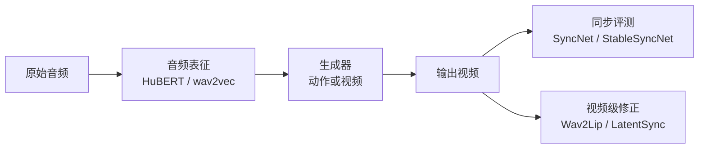

> 本文只建立音画同步的角色分工，不比较哪个模型“最好”。完整方法和指标口径见 [[knowledge/音画同步专题|音画同步专题]]，项目全景见 [[project:digital-human]]。

## 先记一句话

声音不会直接“控制像素”。通常它先变成语音特征，生成器再把特征变成动作或视频；最后还要用同步评测确认嘴形和声音没有跑偏。

## 每个模块各管什么

| 模块 | 作用 | 不做什么 |
|---|---|---|
| HuBERT / wav2vec | 把波形变成可被模型理解的特征 | 不生成视频 |
| 生成模型 | 根据特征预测动作或视频 | 不保证评测一定高分 |
| LoRA / 同步损失 | 训练时让模型更关注同步 | 不是独立视频模型 |
| SyncNet v2 | 判断嘴形与声音是否匹配 | 不修视频 |
| StableSyncNet | 冻结监督、Stable LSE、offset诊断 | 不生成视频 |
| Wav2Lip | 视频级嘴部替换 | 不解决完整数字人系统 |
| LatentSync | 视频级口型处理；当前可用于闭嘴化源视频 | 不是 Ditto 内部动作模块 |

## 为什么同一段声音会有不同口型结果

音频只提供发音和节奏，不直接决定全部表情。眨眼、眼神、头动和情绪还会受到身份、动作模型、参考视频和生成器先验影响。因此同步问题可能在音频表征、动作生成、视频渲染、时间对齐或评测口径中的任一环节出现。

一个常见排查顺序是：先确认音频采样率与视频帧率、再确认 offset，再看 SyncNet 指标，最后才决定是否微调模型或做视频级修正。

## 三条常见误解

1. **“SyncNet 是让嘴动起来的模型。”**
   不是。它主要判断音频和嘴形是否匹配，也可作为训练监督信号。

2. **“StableSyncNet 分数和 SyncNet 可以直接比。”**
   不可以。两者使用的帧数、人脸对齐、音频特征和 offset 搜索不同，C/D 数值没有同一把尺子。

3. **“闭嘴化源视频就是解决了 Ditto 同步问题。”**
   闭嘴化解决的是视频源原有嘴动泄露；它让目标音频更容易接管嘴部，不代表所有同步问题都已解决。

## 接下来读什么

- 想了解 StableSyncNet、音素辅助头和 offset：读 [[knowledge/音画同步专题|音画同步专题]]
- 想看 Ditto 如何处理视频源嘴动：读 [[knowledge/Ditto 改动实践|Ditto 改动实践]]
- 想看同步怎么评测：读 [[knowledge/评测指标专题|评测指标专题]]