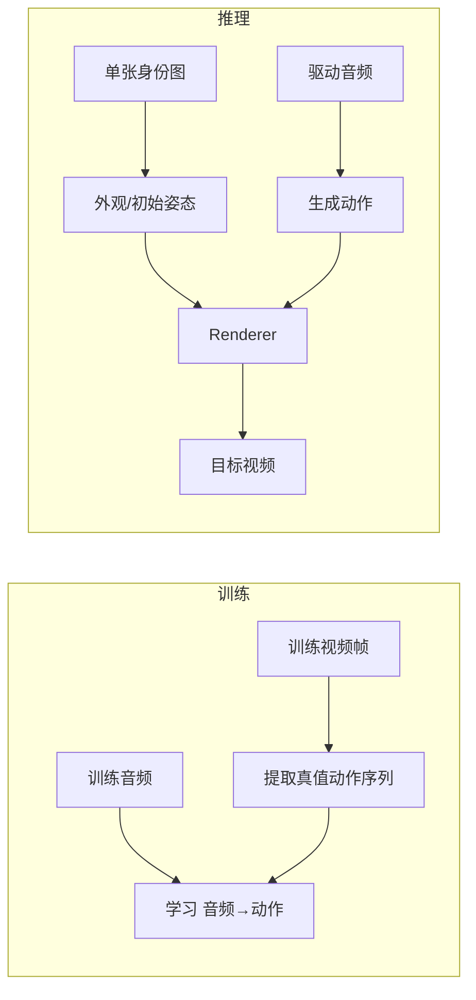

> 这是“训练视频和推理图片为什么不矛盾”的直觉版。深入细节见 [[knowledge/Ditto 模型精读|Ditto 模型精读]]、[[knowledge/Avatar Forcing Motion Latent AutoEncoder|Avatar Forcing Motion Latent AutoEncoder]] 和 [[knowledge/Ditto 改动实践|Ditto 改动实践]]。项目全景见 [[project:digital-human]]。

## 先记一句话

训练视频主要提供“这段声音下，人应该怎样连续运动”的答案；推理图片主要提供“这次由谁来表演”的身份条件。模型在训练中学动作规律，推理时不需要再给一整段视频教它怎么动。



## 训练时，哪些东西在变，哪些不变

一段训练视频有很多不同的目标帧：它们告诉模型嘴怎么开、头怎么转、表情怎么变。为了不让模型把“动作”和“长相”混在一起，训练样本通常会固定一个身份参考条件，再用连续帧提供动作监督。

Ditto 会从视频中提取连续运动作为真值；Avatar Forcing 的 Motion AutoEncoder 则把外观和动作拆开。它的真正运动自由度是 20 维，目标是让驱动脸的动作能迁移过去、但驱动者的长相尽量不要一起带过去。

## 推理时，单图到底提供什么

单图不是“完整动作视频的替代品”，它只提供：

- 这个人的外观和身份；
- 初始脸部几何或姿态；
- 给 Renderer 的静态外观特征。

驱动音频和生成模型负责后续每一帧怎么动。因为训练已经看过大量“音频—动作”配对，模型可以从声音预测新的动作序列，再把动作套到这张脸上。

## 为什么视频源反而会泄露动作

原始 one-shot 推理通常只提取一次参考图特征。视频源模式则可能每一帧都把源视频的外观、骨架或表情送进 Renderer：

```text
源嘴形 + 目标音频动作
        ↓
     两套动作叠加
        ↓
     嘴形泄露或冲突
```

这不是“训练看过视频所以模型记住了源动作”，而是推理时把源视频逐帧重新作为条件输入了。Ditto 的闭嘴源方案就是先移除源视频本来的嘴动，再让目标音频接管。

## 三条常见误解

1. **“训练视频里每一帧都是推理参考图。”**
   不是。连续帧主要是动作真值；一个训练片段会保持身份参考条件，目标动作随时间变化。

2. **“单图推理说明模型不需要视频训练。”**
   相反，正是大量训练视频教会模型动作规律，单图才只需负责身份。

3. **“20维运动一定不够用。”**
   对视频 reenactment，窄通道有助于减少身份泄漏；但音频预测细粒度音素时，它确实可能成为瓶颈，需要 probe 或辅助训练来判断。

## 接下来读什么

- 想看 20维与512维接口的关系：读 [[knowledge/Avatar Forcing Motion Latent AutoEncoder|Avatar Forcing Motion Latent AutoEncoder]]
- 想看视频源泄露的工程实践：读 [[knowledge/Ditto 改动实践|Ditto 改动实践]]
- 想看声音怎样变成口型：读 [[knowledge/5分钟理解声音怎样变成口型|5分钟理解声音怎样变成口型]]