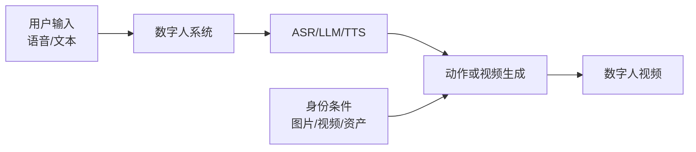

> 想先有一个地图，再读细节？本文只回答最基础的问题：数字人是什么，怎么判断一个方案适不适合。项目全景见 [[project:digital-human]]；需要完整分类和指标时再读 [[knowledge/数字人基础|数字人基础]]。

## 先记一句话

数字人不是单一模型，而是一套“让一个身份按输入表演”的系统：模型决定怎么动，系统负责听、想、说、生成并稳定地播放。

## 模型和系统不是一回事

- **生成模型**关心：给定身份和驱动，怎样生成动作或视频？
- **数字人系统**关心：语音能否识别、回复是否及时、视频能否稳定播出、用户是否可以打断。

因此论文里模型的 FPS 很高，不代表用户真的不需要等。系统还要加上语音识别、语言模型、语音合成、网络和播放器缓冲的时间。

## 用三条轴看任何方案

| 轴 | 要问的问题 | 举例 |
|---|---|---|
| **表现质量** | 画得好不好 | 画质、身份是否像、嘴和声音是否对、动作是否自然、会不会闪烁 |
| **表现范围** | 能表现什么 | 只改嘴、头肩说话、上半身、手势、全身、背景 |
| **工程性能** | 能否实时使用 | 首帧要等多久、能否持续播放、显存和GPU够不够 |

不要把它们混在一起。能生成全身不代表画质更好；口型同步高不代表能实时；模型每秒出很多帧也不代表整套系统没有卡顿。

## 常见方案的直觉

- **换嘴**：只改嘴，便宜稳定，表现范围小。
- **动作空间**：先生成头姿、表情、关键点等低维动作，再交给渲染器画脸；适合实时和可控。
- **整帧视频生成**：直接生成视频，范围大，但通常更贵、更难稳定。
- **3D资产**：不是第四种互斥模型，而是画面如何落地的一种后端；可以和动作空间组合。

## 三条常见误解

1. **“数字人就是一个会说话的图片模型。”**
   图片只是身份条件。真正可用的数字人还要处理动作、音频、时序、网络和交互。

2. **“能动得更多就是质量更高。”**
   身体覆盖范围是能力边界；质量还要看身份、画质、同步和自然度。

3. **“实时就是 FPS 大于 25。”**
   实时还包括首帧延迟、持续发布节奏、浏览器缓冲和卡顿。

## 接下来读什么

- 想知道声音怎样变嘴形：读 [[knowledge/5分钟理解声音怎样变成口型|5分钟理解声音怎样变成口型]]
- 想知道视频训练为什么能单图推理：读 [[knowledge/5分钟理解视频训练为何能单图推理|5分钟理解视频训练为何能单图推理]]
- 想知道实时系统为何复杂：读 [[knowledge/5分钟理解实时数字人为什么难|5分钟理解实时数字人为什么难]]
- 想看完整技术地图：读 [[knowledge/数字人基础|数字人基础]]