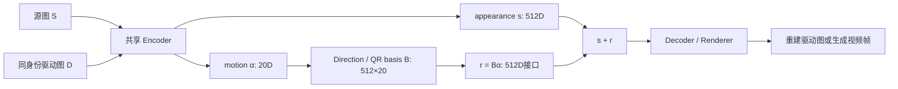

> 本文是 [[knowledge/Avatar Forcing 模型精读|Avatar Forcing 模型精读]] 的 Motion AutoEncoder 深读。它解释模型为何“训练用视频、推理能用单图”，以及 20 维窄运动通道为何适合 reenactment。我们曾担心它限制细粒度音素/viseme，但真实视频 GT-alpha 重建更支持“容量够用，问题在音频到 α 的预测”。音画同步链见 [[knowledge/音画同步专题|音画同步专题]]，本地微调与分层 probe 见 [[knowledge/Avatar Forcing 微调实践|Avatar Forcing 微调实践]]。项目全景见 [[project:digital-human]]。

## 一、先纠正一个最容易误读的维度

Avatar Forcing 论文常写：

$$
z = s + r \in \mathbb{R}^{512}
$$

这很容易让人以为模型有 512 个独立的“动作旋钮”。**不是。** 当前本地代码的实际结构是：

$$
\alpha \in \mathbb{R}^{20}, \qquad
B \in \mathbb{R}^{512\times20}, \qquad
r = B\alpha \in \mathbb{R}^{512}
$$

| 量 | 维度 | 它代表什么 |
|---|---:|---|
| `s` | 512 | appearance / identity code：这个人长什么样 |
| `α` | **20** | 真正独立的 motion feature：动作自由度 |
| `B` | 512×20 | Direction 模块构造的 QR 正交方向基 |
| `r=Bα` | 512 | 给 Flow / renderer 使用的运动接口，最多只有20个独立方向 |

所以 `r` 的形状是 512 维，但它落在一个最多 20 维的子空间里。后续 Flow 生成或控制的是这个 512 维接口，真正可独立变化的自由度仍是 20。



## 二、它原本解决的是 reenactment，不是音频口型生成

这套 Motion Latent AutoEncoder 来自 MegaPortraits / FLOAT 一类的 **reenactment** 思路。任务可以写成：

```text
驱动者视频帧的动作
      +
目标人的外观
      ↓
让目标人复现驱动者的动作
```

训练时使用同一身份的源图 `S` 和驱动图 `D`：

1. Encoder 从 `S` 提取外观/身份 `s`；
2. Encoder 从 `D` 提取动作 feature `α_D`，再展开为 `r_D`；
3. Decoder 接收 `s + r_D`，重建驱动图 `D`。

这不是让模型猜“音频对应什么嘴形”，而是直接从驱动图里把动作拿出来再复制。驱动视频的每一帧提供了已经发生的表情、头姿和口型；模型只需要把它迁移到目标身份上。

## 三、为什么 20 维在视频 reenactment 中是合理设计

### 3.1 窄通道减少身份泄漏

如果驱动图到运动的通道容量太大，模型很容易把驱动者的脸型、五官比例、纹理等身份信息一起带过去。20 维窄通道迫使模型优先保留能重建动作的变化，丢掉大部分“这个驱动者长什么样”的细节。

这不是 bug，而是 reenactment 的设计目标：

```text
要复制动作
不要复制长相
```

### 3.2 复制动作不要求每一维有名字

在 reenactment 中，`α` 不需要像 ARKit blendshape 那样让人读出“第7维等于张嘴”。只要将驱动帧的 `α_D` 原样带到目标身份上，Decoder 能正确重建动作即可。

因此不要把 20 维理解为 20 个固定语义旋钮。它更像一个压缩后的动作坐标：每一维可能混合影响嘴、眼、表情或头姿，语义由整个 Encoder/Direction/Decoder 联合决定。

### 3.3 自由度预算

20 个独立自由度要同时容纳：

- 头部旋转、平移、尺度变化；
- 全局表情和眼睛开合；
- 局部嘴形变化；
- 可能的细小姿态与时序残差。

对“复制一个已经存在的驱动动作”来说，这通常够用：原视频本身已经给出了完整运动，`α` 只需要把它压缩后传过去。

## 四、从音频预测 α：真正的风险在哪

音频驱动时，问题变了：不再是复制已有的 `α_D`，而是从语音特征**预测**应该出现的 `α`。

```text
视频 reenactment：驱动帧 → α → 复制给目标脸
音频驱动：音频特征 → Flow 预测 α → 生成目标脸动作
```

最初的合理担心是：20维要同时容纳头姿、表情、眨眼和细粒度口型，是否会压不下 `u/i`、鼻音闭合等差异？真实视频上的 GT-alpha 重建实验已经给出更具体的答案：

- 3条 heldout 素材共 **132,726 帧**，真实帧 → Encoder 提取 GT `α` → Decoder 重建；
- 困难音素组的嘴部 L1 误差只比其他组高 **1.4%**；
- 这远低于预注册的 ±20% 判定线。

因此当前证据支持：**20维运动潜空间本身装得下困难音素的嘴形**。它不是此阶段的主要容量瓶颈。更可能的问题是 Flow 如何从音频学出正确的 `α`，而不是 `α` 无法表示正确嘴形。

## 五、真实视频的分层线性 probe：分类结果说明什么

本地不再只看最终 LSE，而是用 MFA 对齐的真实新闻视频做逐层 probe：68/73 条对齐成功，得到 **51,921 个样本、92 类音素**；按 clip 划分 55/13，冻结各层特征，只训练统一容量的 Logistic Regression。

| 层 | 特征含义 | macro-F1 | 判读 |
|---|---|---:|---|
| L1 | wav2vec2 输出 | .394 | 中文失分音素仍有可线性读出的信息 |
| L2 | audio_projection / 蒸馏桥输出 | .341 | 相对 L1 降 13.4%，低于预注册 15% 桥塌陷线 |
| L3 | `c_embedder` 融合条件 | .307 | 继续下降，但仍有可读信息 |
| L4a | GT motion latent `r_d` | .016 | 线性 probe 几乎读不出音素 |

这回答了“真实视频分类器好不好”：**音频侧分类是有用的，不是随机水平；桥没有达到预注册的塌陷判据。**

但 L4a 的 .016 不能直接翻译成“Flow 丢掉了所有音素”。GT `r_d` 本身就是相对参考帧的运动方向接口，信息可能以非线性形式编码；GT-alpha 重建已经证明 decoder 能利用这个低维表示重建困难音素嘴形。因此线性 probe 测的是**线性可读性下界**，不是信息是否存在的最终裁决。

下一步的部署口径 alpha-error probe 会直接比较“音频驱动预测的 `α`”和“真实帧编码出的 GT `α`”，按音素分组判断错误是特异性的还是全局性的。

## 六、困难音素加权 LoRA：已验证 NO-GO

根据初步 probe 的 Flow 消费侧裁决，项目尝试了在 Flow matching 的逐帧 `diff2` 上提高困难音素帧权重（注意：权重实际加在 **Flow matching loss**，不是此前口头概括的 sync loss）。

结果：差时刻从 **12→15**（+25%），预注册的“差段时长 -30%”主门槛未过；回归主要集中在鼻音韵尾。Stable LSE-C 虽有 3.6% 改善，但局部差时刻恶化，最终裁决 **NO-GO**。这说明“知道困难音素在哪”不等于简单提高这些帧的权重就能修好动作预测。

## 七、音素辅助头为什么仍是后续候选

`phoneme-bottleneck-probe-and-fix` 计划在 bridge 后加两层 MLP：

```text
bridge output
   → MLP: d_cond → 256 → n_phones
   → MFA phoneme label
```

训练时让音素 CE loss 与原同步损失共同约束 bridge；Wav2Vec2 与 Flow 主干冻结。推理时辅助头被丢弃，只有训练后的 bridge 权重保留，因此不会增加在线推理成本。

但这条训练臂**尚未验证收益**。它可以帮助检验或塑形 bridge 表征，不能预先写成“已修复 20 维瓶颈”或“已提升音画同步”。

## 八、与 Ditto、Talker-T2AV 的关系

| 系统 | 动作表示 | 用途 |
|---|---|---|
| Avatar Forcing Motion AE | `α` 20D → `r` 512D接口 | 窄 motion bottleneck，身份与动作加法组合 |
| Ditto | 265D scale/pose/translation/expression | 音频到 motion，配 LivePortrait renderer |
| Talker-T2AV / LIA-X | 40D motion latent，25Hz | 文本驱动联合音视频生成的 motion 解码侧 |

它们都把视频动作压到低维空间，但优化目标不同：Avatar Forcing 的 20 维来自 reenactment 的身份隔离需求；Ditto 偏向可控 talking-head motion；LIA-X 作为 T2AV 的视频 motion autoencoder，服务联合音视频生成。

## 九、常见误解

1. **“512维 r 就有512个动作自由度。”**
   不对。`r=Bα`，真正独立自由度是 20。

2. **“20维没有固定语义，所以没法用。”**
   不对。reenactment 只要复制驱动动作，不要求人能命名每一维；语义可解释性和动作重建能力是两种不同需求。

3. **“音频同步不好一定是 Motion AE 的错。”**
   不对。问题可能在音频表征、bridge、Flow、20维瓶颈、renderer、offset 或评测口径。需要分层 probe 和同协议评测定位。

## 十、面试追问预案

**Q：为什么不把 motion feature 增到更高维？**

更高维可能容纳更多细粒度口型，但也会增大驱动身份泄漏、训练不稳定和生成自由度失控的风险。它不是单纯“维度越高越好”的问题，而是身份隔离、动作保真和音频可预测性之间的容量分配。先用 probe 确认瓶颈位置，再决定扩维、加辅助头还是改 bridge/Flow，更可控。

**Q：视频训练时的 20维为何够用，音频生成时却可能不够？**

视频 reenactment 直接从驱动帧拿到正确动作 `α_D`，只是压缩和迁移；音频生成必须从声音反推同一个动作，且要在有限自由度里区分细小音素差异。这相当于“抄答案”和“根据题目推答案”的区别，后者对表示的可预测性要求更高。

**Q：线性 probe F1 下降，是否就该重训 Motion AutoEncoder？**

不能直接跳到这个结论。F1 下降只表示线性可读性下降；还要看随机/错位标签基线、类别混淆、有效秩、不同 checkpoint 和小 MLP 上界。当前训练计划优先试音素辅助头塑形 bridge，并不等于已决定重训 Motion AE。