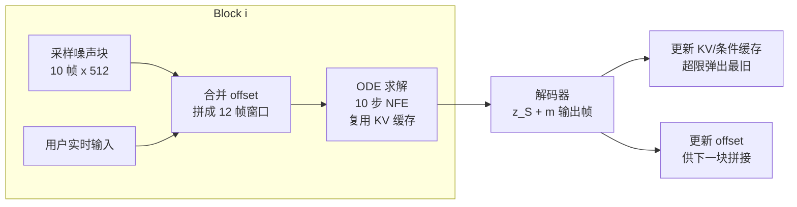

> 本文只讲模型本身（以博客精读文章为底稿压缩改写）。我们的微调与改造见 [Avatar Forcing 微调实践](../微调与实践/Avatar%20Forcing%20微调实践.md)，背景知识见 [数字人基础](../基础/数字人基础.md)。

## 一、任务设定：交互式数字人

Avatar Forcing 面向的是**双向对话**。可以把一轮交互理解成：用户说话、系统听到用户的音频和视频；系统再拿 avatar 准备说出的音频，生成 avatar 的回应画面。这里的 avatar 是屏幕上的数字人，listener 则是它在倾听用户时呈现的反应。

它和普通"音频驱动头像"的差别在于，后者只管让一张脸开口；这里还要处理对话中的听、说、反应和打断，而且必须边收到输入边输出。关键数字：**推理延迟 500ms、加速比 6.8×、人类偏好 >80%**。

## 二、三模块架构

### 2.1 Motion Latent Encoding：显式 identity-motion 分解

FLOAT motion latent autoencoder 把输入图像编码为 latent，并**显式分解**：

$$z = z_S + \mathbf{m}_S \in \mathbb{R}^{512}$$

- $z_S$：identity latent（这个人长什么样）——**整个对话中保持固定**
- $\mathbf{m}_S$：motion latent（面部表情 + 头部姿态）——模型逐帧只预测这个

直觉类比：一张照片拆成"底片"和"滤镜"两张透明片——换表情只换滤镜，底片不动。直接在像素空间建模的问题：512×512×3 每帧计算量巨大，且身份与运动信息高度耦合。这个分解让生成任务收缩到"预测 512 维运动增量"。

### 2.2 Dual Motion Encoder：先把“听到什么”和“要说什么”整理好

用户的音频/视频与 avatar 的待说音频格式不同，不能直接喂给生成器。Dual Motion Encoder 先把它们编码成同一种条件信息：前者告诉模型用户正在做什么，后者告诉模型 avatar 这次要怎么说。生成器随后读取这些条件来决定下一段表情和头动。

### 2.3 Causal DFoT Motion Generator：按 block 向前滚动生成

普通视频扩散常一次把整段视频一起生成，后面的帧也会影响前面的帧，画面整体性较好，却必须等整段完成。Avatar Forcing 采用的是**以 block 为粒度的因果生成**：block 之间按时间向前滚动。它并非严格的“每一帧只看过去”——训练时的 look-ahead mask 允许每个 block 额外看 $l=2$ 帧来减轻边界抖动；推理时真实未来帧不可用，就用上一个 block 最后两帧的历史 offset 替代。因此它能低延迟输出，同时需要靠 offset 维持跨 block 连续性。

## 三、流式推理：把长对话切成小段往前滚

这里的 block 就是一小段连续帧；rollout 指生成完一段后，把结果带到下一段继续生成。模型不是等完整回答结束才出视频，而是每次生成一小段并立即交给渲染器：

- **KV/条件缓存**：把上一小段已经算出的中间结果存起来；下一段直接复用，不必从头再算
- **独立 CFG 三路缓存**：CFG（classifier-free guidance）会并行比较“没有条件”“只有音频”“完整条件”三种预测，再合成结果；三路分别缓存才能避免重复计算
- 10 帧/block、12 帧 ODE 窗口（10 新帧 + 2 帧 offset 衔接）——这套分块和复用机制共同把延迟压到约 500ms。ODE/NFE 是扩散求解时的内部步数，不影响理解主流程

## 四、两阶段训练

第一阶段先让模型学会根据条件生成连续运动；第二阶段再拿“较好”和“较差”的成对样本做偏好微调，让模型更偏向前者。这里的 DPO（Direct Preference Optimization）中，较好样本是**真实视频提取出的 motion latent**，较差样本才是只给 avatar audio 的 FLOAT 模型生成结果；因此它在没有人工偏好标注的情况下，把“更有交互反应”的真实运动作为目标。

| 阶段 | 内容 | 配置 |
|------|------|------|
| Stage 1 | Diffusion Forcing 训练：motion latent space 中学习条件自回归 | 50 帧序列分 5 block，**同 block 帧共享噪声时间步、跨 block 独立采样**（DF per-token noising 核心），2000k steps |
| Stage 2 | DPO 微调 | λ=0.1、β=1000，仅需 5k steps 封顶；较差样本由仅音频条件的 FLOAT 模型生成 |

数据：RealTalk + ViCo 两个 dyadic conversation 数据集；预处理 PySceneDetect 场景切割 → 人脸追踪裁剪 512×512 → IIANet 语音分离（区分 speaker/listener）→ 25fps / 16kHz。Motion latent autoencoder 在此数据上重训（非直接用 FLOAT 原权重）。单张 H100。

**同 block 共享噪声时间步**为什么重要：这是 Diffusion Forcing 区别于标准视频扩散的关键——每个 block 有自己的噪声水平，训练时模型同时见到不同去噪程度的块，推理时才能逐块自回归地滚动生成。

## 面试追问预案

**Q：为什么选因果结构，放弃双向扩散的生成质量？**

交互场景的硬约束是不能等待整段未来视频。双向扩散生成第 1 帧需要第 50 帧的信息，意味着必须等整段完成——这在对话里不可接受。Avatar Forcing 因此按 block 因果滚动生成；为避免严格因果造成边界抖动，训练期允许 $l=2$ 的 look-ahead，推理期再用上一 block 的历史 offset 替代这部分未来信息。它仍会牺牲一部分全局一致性，但换来的是可持续输出、可打断和可切换输入。

**Q：identity-motion 分解和 DiT 的运动空间拆分是一回事吗？**

思想同源但粒度不同。Ditto 在论文抽象里用 deformation、rotation、translation 描述运动，部署时 LMDM 的 265 维输出是 scale、pitch/yaw/roll、translation 和 expression，**不含 kp**；FLAME 在语义层拆得更显式（每维有名字）；FLOAT latent 在隐空间做 512 维向量加法分解。它们共同的直觉是把身份外观与运动尽量分开，但没有哪一种表示能保证完全解耦。AF 的 decoder 不要求逐维语义，只要固定的 $z_S$ 能提供稳定身份即可。

**Q：DPO 只有 5k steps，为什么这么少就有效？**

DPO 的输入是成对偏好样本：preferred 是真实视频提取的 motion latent，less-preferred 是仅给 avatar audio 的 FLOAT 生成结果。它做的不是重新学习基础生成能力，而是在已收敛的分布上把模型推向更接近真实交互反应的一侧。作者也明确说继续训没有额外增益。这个设计对资源受限的复现者较友好：最贵的 Stage 1 只需要跑一次。
