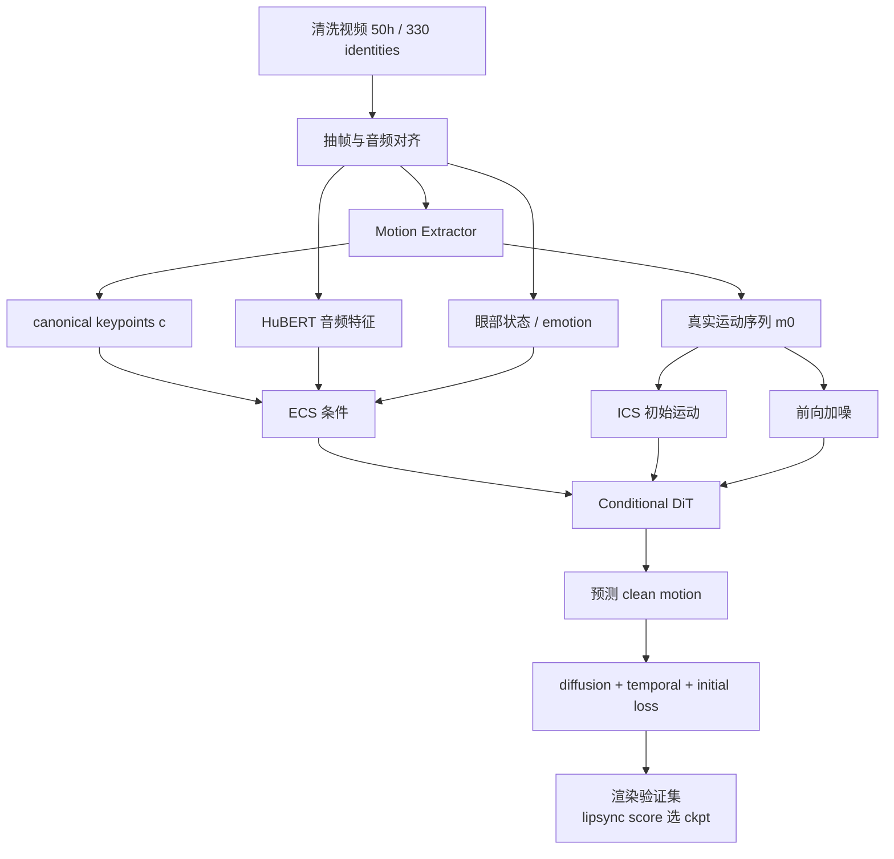

> 本文只讲模型本身（以博客精读为底稿压缩改写）。我们的改动（唇动隔离等）见 [Ditto 改动实践](../微调与实践/Ditto%20改动实践.md)，motion space 表示细节见 [动作空间专题](../基础/动作空间专题.md)。

## 一、任务分解："生成空间"比"生成模型"更重要

Ditto 先回答的不是"用什么网络"，而是"让网络直接预测什么"。这里的**生成空间**就是模型输出的数据格式：可以是整张图，也可以是一串描述嘴形、表情和头部姿态的运动数据。对实时系统来说，预测后者的计算量小得多。

| 路线 | 优势 | 瓶颈 |
|------|------|------|
| GAN / NeRF / 显式系数（Wav2Lip、SadTalker） | 快、可解释 | 表情头动自然度不足 |
| 像素 / 通用 VAE latent 扩散（EMO、Hallo） | 表情丰富 | 空间冗余、推理慢 |
| **运动空间扩散（VASA-1、Ditto）** | 目标低维适合实时、易控制 | 上限受运动表示约束 |

论据：目标空间太冗余，算力浪费在身份纹理和背景；太隐式，又难以控制修复。运动空间居中——足够低维便于实时，又保留表情/头姿/眼神等可干预结构。

任务被拆成两层：**音频到面部运动**（生成模型的事）+ **运动到视频渲染**（渲染器的事）。"谁在说话"与"怎么动"分离。

## 二、Motion Space：扩散模型只预测运动

单帧图像经 Motion Extractor $\mathcal{M}$ 输出：

- canonical keypoints $\mathbf{c} \in \mathbb{R}^{K\times3}$（身份基准骨架）
- expression deformation $\boldsymbol{\delta}$（表情形变）
- head rotation $\mathbf{R}$、translation $\mathbf{t}$

论文把要生成的运动抽象为 $\mathbf{m}=\{\boldsymbol{\delta},\mathbf{R},\mathbf{t}\}$，目的是说明模型主要生成运动而不是图像 latent。部署代码中的 LMDM 输出则是具体的 265 维编码：scale(1)、pitch/yaw/roll 各 66、translation(3)、expression(63)。它**不含 kp**；kp 由源侧信息回填。这个表示能大幅弱化身份与运动的耦合，但论文也明确指出两者并没有完全解耦。

把整条链路翻成白话就是：参考帧提供“这是谁”的骨架和外观；音频生成“这张脸这一刻该怎么动”的运动数据；渲染器把这份运动套回参考身份，得到视频。下面的公式只是在说明最后一步如何把参考骨架和生成的运动相加。

从运动到隐式 3D keypoints：

$$\hat{\mathbf{x}}=\mathbf{c}_{ref}\hat{\mathbf{R}}+\hat{\boldsymbol{\delta}}+\hat{\mathbf{t}}$$

$\mathbf{c}_{ref}$ 来自参考身份（身份保留），生成的运动叠加在参考骨架上。

## 三、Conditional DiT（LMDM）与双条件系统

LMDM 是 **Latent Motion Diffusion Model**（潜在运动扩散模型），即 Ditto 的音频到运动生成模型；Conditional DiT 是它执行扩散去噪的核心网络，Transformer 则是 DiT 所采用的架构。因此三者不是并列模型，也不能把 LMDM 泛化为项目中所有的 Transformer。

模型生成一段动作时，需要两类提示：一类全程都有效，例如音频和眼部状态；另一类只负责告诉它“这一段从什么姿态开始”，避免和前一段断开。Ditto 分别把它们叫作 ECS 和 ICS。Conditional DiT 接收这些提示和噪声，逐步还原出第二区所述的 265 维动作序列；cross-attention 可以理解成它在每一步都回头读取提示信息。

**ECS（Enhanced Conditional Signals，持续条件）**——在整个片段持续引导：

| 信号 | 来源 | 作用 |
|------|------|------|
| 音频特征 | HuBERT | 口型、语速、节奏 |
| 眼部状态 | aspect ratio + pupil position | 眨眼、gaze（音频解释不了的部分） |
| canonical keypoints | 参考帧 | 适配目标身份几何 |
| emotion label | clip 级标注 | 表情强度与风格 |

**ICS（Initial Conditional Signal，起始条件）**——取参考帧的初始运动，复制到与待生成序列相同的长度后，与噪声序列并排送进模型。它不负责整段的细节，而是给模型一个明确起点：上一段停在哪，这一段就从哪接上，从而减少长序列衔接时突然跳动。

## 四、训练管线：把视频"训成运动生成器"

关键步骤：

1. **把真实视频压到 motion space**：高维视频监督信号变成低维运动序列——DiT 学的不是 RGB 像素，而是 renderer 能理解的动作指令
2. **两类条件构造**：ECS（持续约束）+ ICS（起点连续性）
3. **处理 motion representation 偏差的训练技巧**：
   - **Horizontal flip**：野外视频头部朝向分布不均，翻转平衡左右朝向的 audio-to-motion 关系
   - **Adaptive loss weights**：按控制区域（嘴/眼/表情/头姿）分组，根据相邻 epoch 平均 loss 差异动态调权 + softmax 调整系数——统一权重会让某些区域训练不足（消融中影响很大）

## 五、推理与可控性

- **流式推理**：RTF（Real-Time Factor，处理时长/真实时长）达标，首帧延迟 385ms
- **可控性**（motion space 的直接红利）：gaze correction（改眼部条件重渲染）、眨眼控制、emotion label 切换——这些在像素空间路线里几乎无法干预
- 265 维运动表示 + 渲染器解耦，也让我们后来能在渲染层做区域级操作（见改动实践篇）

Ditto 的 motion space、分段流式推理和 10 步去噪构成实时性的模型基础；Decoder TensorRT、GPU 直传、发布节奏等工程优化及其生产证据见 [Ditto 实时化与 TensorRT 加速复盘](../工程与评测/Ditto%20实时化与%20TensorRT%20加速复盘.md)。论文 RTF、单模块基准和生产 RTF/FPS 的测试口径不同，不能合并成一个“整体加速倍数”。

## 面试追问预案

**Q：Ditto 和 VASA-1 都是运动空间扩散，差异在哪？**

运动表示不同：VASA-1 在整体面部动力学 latent 中生成，Ditto 的论文抽象使用 deformation、rotation 和 translation，部署时以 265 维 scale/pose/translation/expression 编码输出，再交给 LivePortrait 风格 renderer。Ditto 的开源推理链路、后验 probing 得到的区域控制映射，以及可替换的工程组件，使它更便于复现和修改；这与“每个维度天然有显式语义”不是一回事。VASA-1 没有可用代码，因此在需要工程改造时 Ditto 更适合作为基础。

**Q：为什么用 lipsync score 选 checkpoint 而不是常规 val loss？**

任务的评价目标是"音频-运动对齐"，但 val loss 混合了所有区域的回归误差（包括与说话无关的头姿预测）。用渲染验证集 + lipsync score 直接优化最终关心的能力。这也是我们在评测框架里坚持"指标要对应问题"的同一逻辑（见 [评测指标专题](../工程与评测/评测指标专题.md)）——代理指标和最终目标错位时，checkpoint 选择就会被带偏。

**Q：horizontal flip 为什么必要？听起来只是数据增强。**

不只是增强。音频到运动的映射对左右朝向不对称：野外数据（访谈、演讲）里人脸朝向有系统性偏置，模型会学到"偏向某一侧"的运动习惯，推理时生成的人头会慢慢歪。flip 平衡的是 audio-to-motion 关系的空间分布，不是普通的图像增强。这个细节说明：motion space 路线里，数据分布问题会直接变成生成行为偏置。
