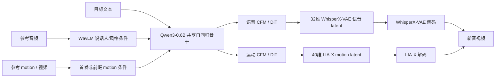
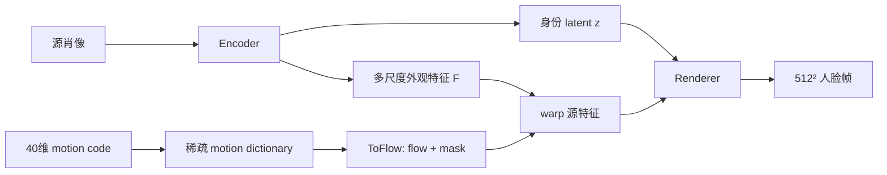

> 本文固定阅读本地缓存的上游版本 `6712f62`。**论文层正式笔记见 [[论文笔记/talker-t2av|Talker-T2AV 模型笔记]]。** 本地 adapter、FaceCropper 和性能冒烟见 [[knowledge/Talker-T2AV 接入与验证|Talker-T2AV 接入与验证]]。音画同步模块边界见 [[knowledge/音画同步专题|音画同步专题]]。项目全景见 [[project:digital-human]]。

## 一、它到底生成什么

Talker-T2AV 的核心任务不是“给定一段驱动音频，让头像对口型”，而是**联合生成新的语音和视频**：

```text
目标文本
+ 参考音频（音色/说话风格）
+ 参考 motion / 视频（身份、动作或前缀风格）
→ 新语音 + 新说话视频
```

参考音频主要提供音色、韵律和说话风格，**不是**像 Ditto 那样直接驱动口型的目标音频。合成内容来自目标文本。

上游 README 声称同一 checkpoint 还能支持 A2V（音频驱动视频）和 V2A（视频配音），但固定提交的公开 CLI 主要暴露 T2AV；本地也将 A2V 打分隔离。因此本文把 A2V/V2A 视为**上游声称能力**，不等同于本地已验证能力。

## 二、整体架构：一个共享骨干，两条生成头



### 2.1 共享自回归骨干

模型采用 Qwen3-0.6B，在 patch 级 token 序列上同时处理文本、音频和视频信息。每个 patch 覆盖 **4 帧**；音频与运动 patch embedding 在同一位置逐元素相加，让骨干学习跨模态时间关系。

### 2.2 两条 modality-specific refinement 头

共享骨干不直接输出波形或像素，而是把 hidden state 送给两个轻量 CFM/DiT：

| 头 | 输出 | 解码器 |
|---|---|---|
| 语音头 | 32维 WhisperX-VAE latent | WhisperX-VAE |
| 运动头 | 40维 LIA-X motion latent | LIA-X |

两条 **latent 序列都以 25Hz 对齐**。这表示每秒 25 个 latent 时间步，**不是原始音频波形的采样率**；语音原始波形侧仍使用独立的采样率时间单位。

运动头把首帧 40维 motion 作为 global condition，再按 patch 自回归地继续生成后续 motion。LIA-X 负责把这条 motion latent 序列还原为视频运动。

### 2.3 LIA-X 是什么：40维 motion 到人脸帧的 renderer

LIA-X 本身是人像动画里的 motion autoencoder / renderer。它接收源肖像的身份与多尺度外观特征，再接收一串 40维 motion code，把这些 motion 转成 flow 和 mask，去 warp 源图特征，最后渲染出目标帧。



它和 StyleGAN2 的关系容易说错。LIA-X 不是直接拿一个完整 StyleGAN2 generator 来用，也不是加载 StyleGAN2 权重；它使用了 StyleGAN2 风格的渲染积木，例如 modulated convolution、demodulation、ToRGB skip、upfirdn2d 和 fused activation。但它的核心仍然是自定义的 **flow-warp renderer**：motion 先决定源特征怎么被扭动，再由调制卷积把结果画出来。

这也是它慢的原因之一。当前 Talker-T2AV 的 A10 profile 中，512²、bf16、batch=1 的 LIA-X decoder 约 **333ms/帧**。这个数不能外推到所有硬件，但足以说明：逐帧高分辨率 warp、mask、grid_sample 和大量 StyleGAN2 风格调制卷积，会成为 T2AV 视频侧的主要成本。

因此后续的 LIA-X decoder 蒸馏目标不是“换个现代网络就画得更好”，而是用一个轻量学生 renderer 尽量逼近现有 LIA-X teacher，同时降低延迟和显存。这个方向目前是设计候选，尚未实现与验收；详见 [[knowledge/视频生成训练与推理加速专题|视频生成训练与推理加速专题]]。

## 三、两种参考前缀模式

`--gt-prefix-seconds` 决定参考片段进入骨干的多少：

| 设置 | 含义 | 适合什么 |
|------|------|----------|
| `0` | 只从参考音频取 WavLM 音色条件，视频主要取首帧外观；说话节奏和头动从模型先验采样 | 想保留身份/音色、但要全新表达 |
| `N>0` | 参考音频与 motion 的前 N 秒作为前缀 | 借用参考的韵律、节奏和头动风格，继续生成 |

前缀还可用于跨句风格借用，或用于同一句的续写。它不是简单的视频复制，而是为自回归生成提供风格和时间上下文。

## 四、与 Ditto、Avatar Forcing 的边界

| 模型 | 主输入 | 主输出 | 典型用途 |
|------|--------|--------|----------|
| Ditto | 参考身份 + 驱动音频 | 目标头像视频 | 音频驱动 talking head、可控 motion |
| Avatar Forcing | avatar身份/音频 + 用户多模态条件 | 交互式 avatar 响应视频 | 双向交互、listener/speaker 反应 |
| Talker-T2AV | 文本 + 参考音频 + 参考motion/视频 | **新音频 + 新视频** | 文本指定内容、借音色/风格/身份联合生成 |

T2AV 适合“文本决定说什么，同时借用某个声音和视觉风格”的联合生成。它不适合被直接当作“给一条外部音频，严格要求嘴形逐帧跟随”的已验证本地方案；那属于 A2V 路径，当前本地尚未完成公平验证。

## 五、训练逻辑

上游训练混合 T2SV/TTS 数据，音频/说话人编码器冻结。模型学习从文本和参考条件预测语音 latent 与 motion latent，两个 CFM 头再学习各自的连续分布。训练时 motion 的首帧条件帮助生成从合理姿态开始，而不是从全零运动突变进入。

## 六、适用边界

**适合：** 文本可控内容、音色/身份借用、联合生成音频与视频、带参考前缀的风格延续。

**当前不应直接承诺：** 本地实时能力、优于 Ditto/AF 的视觉质量、A2V 公平横比、复杂长序列身份稳定性。这些需要用同一资产、文本/音频、输出规格和资源预算复跑。

## 面试追问预案

**Q：T2AV 为什么要同时生成语音和 motion，而不是先 TTS 再驱动数字人？**

两阶段级联里，TTS 的韵律、停顿和情绪与视频动作需要跨模块再对齐；T2AV 在共享骨干内同时建模两条 latent 时间序列，让语音节奏与运动从同一上下文产生。代价是系统更重、调试边界更复杂，也不自动等于更实时。

**Q：参考音频和驱动音频有什么差别？**

在 T2AV 的 T2AV 模式里，参考音频主要提供“谁在说、怎么说”的风格条件，文本决定“说什么”；它不是 Ditto 那种逐帧驱动口型的目标音频。混淆这两个角色，会把 T2AV 的联合生成任务误当成普通 audio-driven avatar。

**Q：25Hz latent 为什么不等于 25kHz 音频？**

Hz 只表示时间频率，单位对象不同。25Hz latent 表示每秒 25 个模型时间步；音频采样率表示每秒多少个波形采样点。T2AV 在 latent 层把语音和 motion 对齐到25Hz，但语音解码前后的原始采样率仍由 WhisperX-VAE/音频链决定。