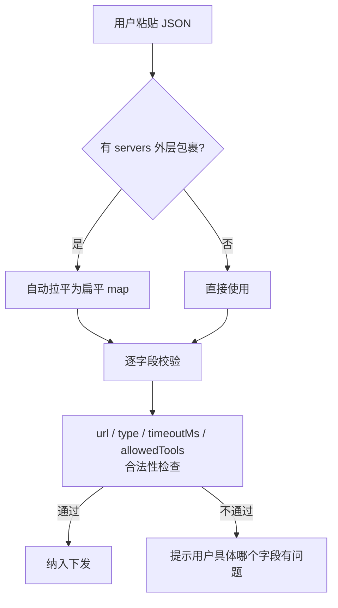
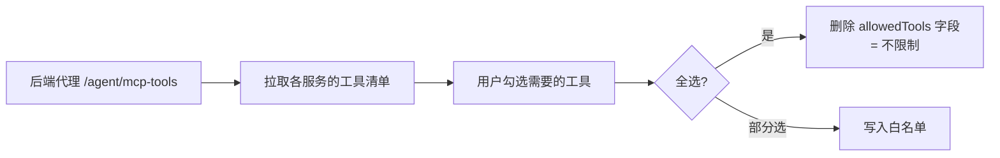

> 本文是 [VoiceAgent 项目总览](docs/voice-agent-overview.md) 的**前端亮点四**。服务端的 MCP 挂载位置与 `/agent/mcp-tools` 接口见 [三级配置继承体系](docs/voice-agent-config-inheritance.md)。

## 一、先扫盲：MCP 和 RAG 是什么

| 名词 | 一句话解释 |
|------|-----------|
| **MCP**（Model Context Protocol） | 一个让大模型能调用外部工具的标准协议。配了高德地图 MCP，AI 就能查路线；配了 GitHub MCP，AI 就能查代码仓库 |
| **Function Call** | 大模型「决定调用某个工具」的动作。用户问「明天天气」，模型自己决定去调天气工具 |
| **RAG**（检索增强生成） | 回答前先去知识库检索相关资料，再带着资料生成答案。让 AI 能回答「本公司的报销流程」这类它没被训练过的问题 |

## 二、问题：三层约束叠在一起

平台要支持用户自定义 MCP 服务并绑定知识库实现 RAG 检索，但有三层约束：

### 约束 1：网关对 MCP 配置格式要求严格

- 必须是**扁平 map**，不能有嵌套层
- **不接受鉴权字段**
- 字段类型校验严格，格式不对直接报错

而用户拿到的 MCP 配置 JSON 往往是**带 `servers` 外层包裹**的（各种工具生成的标准格式都这样），直接粘进来必然报错。

### 约束 2：端到端链路不支持 RAG

RAG 需要在 LLM 调用前注入检索结果，而**端到端（Speech-to-Speech）链路里语音直接进出模型**，没有独立的 LLM 文本环节可以插入。所以 RAG 只能在**级联链路**下生效。

如果前端不管这个约束照样下发，网关会报错，用户只看到「启动失败」，完全不知道是因为选了端到端。

### 约束 3：Function Call 过程对用户不可见

模型调工具时会有一两秒的停顿。用户不知道 AI 在干什么，只觉得「卡住了」。

**任务（T）**：实现 MCP 服务的 JSON 配置解析、工具级白名单选择、会话级开关控制，以及 RAG 的条件下发逻辑，并确保 Function Call 过程对用户实时可见。

## 三、Action：四个设计

### 3.1 MCP 配置解析管线

用户可以**直接粘贴 JSON**，管线负责把各种形态的输入规整成网关能接受的样子：



关键是**自动兼容嵌套 `servers` 层误包**——统一拉平为扁平 map。

> **为什么要替用户兜这个错？** 因为 `servers` 嵌套是 MCP 生态里的**标准格式**，用户从任何地方复制过来都是这个样子。如果强行要求用户手动删外层，几乎每个人第一次都会踩坑，而报错信息（网关的格式校验失败）根本无法让人联想到「要删一层」。
>
> **原则：当「用户的错」是可预期且高频的，就应该在系统层面消化掉，而不是把成本转移给用户。**

逐字段校验 `url` / `type` / `timeoutMs` / `allowedTools` 的合法性，问题定位到具体字段而不是笼统报错。

### 3.2 工具级白名单选择

一个 MCP 服务往往提供**十几个工具**。全部开放会有两个问题：模型面对太多选择容易选错工具；无关工具会干扰决策。

所以我做了工具级的勾选：



注意**全选时是删除字段而非列出全部**：

| 用户操作 | 下发方式 | 为什么 |
|---------|---------|--------|
| 全选 | **删除** `allowedTools` 字段 | 语义是「不限制」，且服务端工具列表变化时自动跟随 |
| 部分选 | 写入白名单数组 | 语义是「只允许这些」 |

> 如果全选时把所有工具名列出来，一旦 MCP 服务端**新增了工具**，用户的配置就会把新工具排除在外——而用户以为自己是「全选」状态。**「不限制」和「恰好列举了当前全部」在语义上完全不同。**

### 3.3 RAG / MCP 双开关级联控制

这是「按需下发」契约最典型的应用：

| 开关状态 | 下发行为 |
|---------|---------|
| RAG 开 **且** `pipelineMode=0`（级联） | 构造 `llmConfig.ragConfig`，含 `retrievalStrategy: 'force'` |
| RAG 开 但为端到端链路 | **自动禁用并提示用户**（不是静默失败） |
| MCP 关闭 | 下发 `{}` **显式禁用**全部服务 |

两处细节值得展开：

**① `retrievalStrategy: 'force'`** —— 强制检索，而不是让模型自己决定要不要查知识库。因为用户既然开了知识库开关，意图就是「以我的资料为准」；交给模型自行判断会出现该查的时候不查。

**② MCP 关闭下发 `{}` 而不是省略字段** —— 这里和 RAG 的处理**恰好相反**，原因就是浅覆盖契约：

```
省略字段  → 服务端回退到上一级配置（可能 Agent 级配了 MCP，等于没关掉）
下发 {}   → 显式表达「一个服务都不要」
```

> 这个对比很能说明浅覆盖契约的重要性：**同一个「关闭」意图，在不同字段上要用不同的表达方式**，取决于该字段是否存在上级默认值。详见 [前后端契约与协同设计](docs/voice-agent-frontend-backend-contract.md)。

### 3.4 监听 RTM 原始消息实现可视化

SDK 封装好的回调里**没有** Function Call 和延迟指标——这两类事件 SDK 未处理。

我的做法是直接监听 **RTM 原始消息**，自己解析：

| 消息类型 | 内容 | 渲染成 |
|---------|------|--------|
| `type=10` | Function Call | 工具调用卡片（开始 → 完成 / 失败） |
| `type=11` | Delay Metrics | 服务端时延面板 |

时延面板拆出四个维度：**ASR / LLM 首 Token / TTS / 端到端时延**。

> **为什么拆这四段？** 因为「感觉很慢」是没法优化的，必须知道慢在哪一环。ASR 慢是识别问题，LLM 首 Token 慢是模型或 prompt 问题，TTS 慢是合成问题。分段之后，每一轮对话都能立刻定位瓶颈环节。
>
> 这些指标同时被 [Bad Case 反馈系统](docs/voice-agent-web-badcase.md) 旁路记录进 `convLog`，所以点踩上报时也带着完整的时延数据。

## 四、Result：结果

| 指标 | 结果 |
|------|------|
| MCP 配置下发格式 | **零网关报错** |
| 工具白名单效果 | Agent 工具调用精准度提升，避免无关工具干扰 |
| Function Call 可视化 | 用户对 Agent 决策过程**完全透明**，工具调用成功率可实时观测 |
| 时延指标面板 | 为性能优化提供**数据支撑**，助力定位高时延轮次 |

## 五、面试追问预案

**Q：端到端链路不支持 RAG，为什么不干脆把知识库开关在端到端模式下置灰？**

置灰是更强的做法，但会带来另一个体验问题：用户在级联模式下配好了知识库，切到端到端时开关被置灰+配置清空，切回来还要重配。

我选的是**保留配置但下发时自动禁用并提示**——用户的配置意图被保留，切回级联链路立刻恢复生效。**UI 状态和下发行为分离**，UI 反映用户意图，下发遵守链路约束。

**Q：为什么 MCP 关闭要下发 `{}`，而 RAG 关闭是省略字段？听起来不一致。**

看起来不一致，实际是**同一条规则在不同上下文下的正确应用**：浅覆盖契约里「省略 = 继承上级」。

- MCP 在 Agent 级**可能配了默认服务**，所以省略字段会导致「关不掉」，必须用 `{}` 显式清空
- `ragConfig` 是请求级构造的字段，没有上级默认值，省略即不生效

判断依据是**该字段是否存在上级配置**，而不是「关闭就统一用某种写法」。这也是为什么服务端还额外设计了哨兵值 `-` 来表达「显式清除」——见 [三级配置继承](docs/voice-agent-config-inheritance.md)。

**Q：直接解析 RTM 原始消息、依赖 `type=10/11` 这种魔法数字，SDK 升级会不会挂？**

会有风险，这是 workaround 的固有代价。当时的权衡是：这两类事件对产品体验（决策透明、性能可观测）价值很高，而 SDK 短期内不会支持。

降低风险的做法是把解析逻辑**收敛在单个模块内**（`mcp` / 字幕模块的消息入口），且对未知 type 做静默忽略而非报错。这样 SDK 若变更协议，影响面限定在一处，且不会导致整体功能崩溃。理想路径当然是推动 SDK 原生支持。

**Q：`retrievalStrategy: 'force'` 强制检索，会不会让不需要知识库的问题也变慢？**

会有额外开销。但在这个产品场景下，用户开启知识库的意图非常明确——他们是**为了让 AI 基于自己的资料回答**。如果交给模型自行判断，出现「该查却没查」时，AI 会用通用知识胡编，这个错误的代价远大于多一次检索的延迟。

如果场景变成通用助手（大部分问题不需要知识库），那就该改成自适应策略。**参数选择要服务于场景的失败代价，而不是单看性能数字。**

**Q：为什么工具清单要走后端代理 `/agent/mcp-tools`，前端不能直接请求 MCP 服务？**

两个原因：一是**跨域**，用户填的 MCP 服务 URL 是任意第三方地址，不会给我们配 CORS；二是**避免鉴权信息落到前端**——网关的 MCP 配置本身不接受鉴权字段，相关凭据由服务端侧管理。后端代理同时解决了这两个问题。

## 相关文档

- [VoiceAgent 项目总览](docs/voice-agent-overview.md)
- [前后端契约与协同设计](docs/voice-agent-frontend-backend-contract.md)
- [服务端 · 三级配置继承体系](docs/voice-agent-config-inheritance.md) — MCP / RAG 在服务端的挂载逻辑
- [Bad Case 收集与反馈系统](docs/voice-agent-web-badcase.md) — 时延指标的下游消费方
- [前端模块化重构与配置适配层](docs/voice-agent-web-architecture.md)
