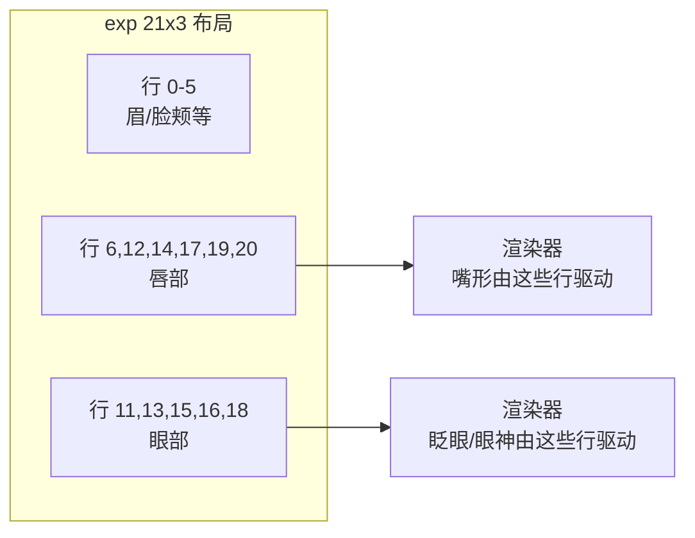

> 前置阅读：[数字人基础](数字人基础.md) 3.2 节。本文回答三个问题：动作空间有哪些表示？Ditto 是怎么把眼部和嘴部拆开的？这些表示各自从哪来？

## 一、表示谱系：显式 ↔ 隐式光谱

这里的 FLAME、blendshape、关键点和 latent，本质上都是**描述人物怎么动的一组数字格式**。区别在于：有的数字能直接读出"抬眉""张嘴"，有的只是模型内部好用、但人看不出含义的向量。下面按"人能不能直接读懂每一项"来排：

| 表示 | 维度/形式 | 语义可读性 | 代表工作 |
|------|----------|-----------|---------|
| **3DMM 系数（BFM/FLAME）** | 表情系数 + 头姿系数 | 高——每维有明确语义 | SadTalker、FLAP |
| **Blendshape 系数** | ARKit 52 维等 | 高——工业标准接口 | LiteAvatar（32 维口型） |
| **Ditto 的部署运动向量** | scale + pitch/yaw/roll + translation + expression（265 维） | 中——可按 probing 建立局部控制映射 | Ditto |
| **隐式关键点** | LivePortrait 紧凑关键点 | 低——"implicit blendshapes" | LivePortrait |
| **整体面部 latent** | 512 维向量 | 低——但可显式分解 | VASA-1、FLOAT |
| **资产接口** | SMPL-X / ARKit / BVH / motion tokens | 高——跨软件通用 | 3D avatar 生态 |

光谱两端的取舍：**显式**端可解释、可编辑、可直接接游戏引擎/直播软件的工业管线；**隐式**端容量大、表达上限高，但改一个"眼神"都不知道动哪个维度。

几个关键细节：

- **FLAME 系数语义清晰**：全局头部旋转、眼睛、下颌、眼睑、表情 blendshape 都可以单独读写——FLAP 正是用这一点把 FLAME 系数放进扩散模型做可控条件
- **FLAME 顶点自带 blendshape + LBS skinning**：LAM 把 Gaussian avatar 重建在 FLAME canonical space，每个 Gaussian 继承顶点的形变权重，FLAME 系数可以直接驱动 3DGS
- **FLAME UV 空间是"空间对齐的工作区"**：FlexAvatar 用 50×50 UV 网格（2500 token）让每个 token 天生负责头部一个固定区域；UIKA 的 canonical UV 让不同人的特征在统一坐标系下可比
- **隐式关键点学出"implicit blendshapes"**：LivePortrait 的经验发现——紧凑隐式关键点没有 3DMM 那样的显式语义维度，但小型 MLP 能学出「眼睛更开一点」「嘴巴闭合一点」这样的局部形变 offset。Ditto 借这个机制实现了 gaze/emotion/pose 细粒度控制

## 二、核心问答：Ditto 怎么把眼部和嘴部拆开？

这是理解"动作空间拆分"最典型的问题。答案不是某个训练魔法，而是**四层机制的叠加**：

### 第一层：表示层——先有隐式表示，再做后验映射

Ditto 的 motion space 来自预训练的 LivePortrait 风格 Motion Extractor。exp 可按 **21×3 的位移表**来操作：21 组、每组 3 个数，对应 63 维 deformation。重要的是，这些维度**并没有在预训练时被标为“嘴”或“眼”**。论文通过逐维施加正负小扰动、渲染并观察画面变化，才建立“哪些维度主要影响哪个局部”的后验控制映射。



工程代码将唇部控制索引设为 [6,12,14,17,19,20]，眼部索引设为 [11,13,15,16,18]（`motion_stitch.py:149-150`）。这些索引来自前述扰动观察后建立的控制映射，随后被代码作为手工掩码使用；它们不是 Motion Extractor 在预训练阶段提供的“天然语义标签”。

### 第二层：条件层——让模型知道哪些动作不能只靠声音猜

音频和嘴动强相关：不同音素要求不同口型；但只听声音，模型不知道该不该眨眼、看向哪里。因此 Ditto 把这部分额外告诉模型。表中的 cross-attention 可以先理解为“模型在生成每一帧时，随时去查这份条件提示”。

| 条件信号 | 来源 | 作用 |
|---------|------|------|
| 音频特征 | HuBERT 语音特征提取器 | 决定口型、语速、节奏 |
| **眼部状态 e** | 眼睛开合比例（aspect ratio）+ 瞳孔位置 | 单独提示眨眼和视线方向（gaze） |
| 参考 keypoints | Motion Extractor | 让动作适配这张脸的几何结构 |
| emotion label | clip 级情绪标注 | 控制表情强度与风格 |

嘴部主要听音频，眼部额外听眼部状态。这是第二层的“拆”。

### 第三层：训练层——别让一个区域学得特别快，另一个区域没学到

嘴、眼、表情和头姿的变化幅度不同，也不会以同样速度收敛。若统一使用一组 loss 权重，容易出现嘴已经学好、眼部却一直学不好的情况。Ditto 因此按区域分组，观察相邻训练轮次（epoch）的平均误差变化，再动态调整各组权重；adaptive loss weights 和 softmax 只是这套“哪里学得慢就多给一点训练关注”的实现方式。

### 第四层：运行时——用区域掩码决定取谁的值

推理时还可以逐区域混合“音频生成的驱动值”和“参考帧的原始值”。alpha mask 就是一张开关表：设为 1 的区域取驱动值，设为 0 的区域保留源值。下面代码**只演示唇部掩码**：

```python
_eye = [11, 13, 15, 16, 18]
_lip = [6, 12, 14, 17, 19, 20]
alpha = np.zeros((21, 3)); alpha[_lip] = 1
x_d_info["exp"] = x_d_info["exp"] * alpha + x_s_info["exp"] * (1 - alpha)
```

同一机制把 `_lip` 换成 `_eye` 就能单独处理眼部。我们团队的 mouth-isolation 改动正是利用它：把唇通道的基底换成源首帧，避免源视频原有的嘴动泄露进来（详见 [Ditto 改动实践](../微调与实践/Ditto%20改动实践.md)）。

到这里，四层分工才完整：表示层提供可分区的动作格式，条件层说明谁该驱动哪块，训练层保证各块都学得到，运行时允许按块干预。

## 三、各表示的训练来源对比

| 表示 | 怎么训出来的 | 数据需求 |
|------|------------|---------|
| FLAME / 3DMM | 统计模型：大量 3D 扫描数据拟合先验 | 数千次 3D 扫描（实验室级） |
| LivePortrait 隐式关键点 | one-shot 系统自监督蒸馏（跟踪视频中的关键点运动） | 大量无标注视频 |
| ARKit blendshape | 商业级表情捕捉校准（iPhone Face ID 硬件配套） | 专有校准数据 |
| FLOAT latent（AF 用） | autoencoder 训练，显式 identity-motion 分解 | 视频自监督 |

选型直觉：要接工业管线（Unity/UE/直播）→ FLAME/blendshape；要研究可控性 → 有语义分区的显式表示；要表达上限 → latent，但接受不可解释。

## 四、我们的实践映射

- **mouth-isolation**：唇通道操作——D2 第四层 alpha mask 机制的应用案例
- **Avatar Forcing 微调**：FLOAT latent 的 identity-motion 分解（z = z_S + m_S）被我们用来做漂移治理的锚点——见 [Avatar Forcing 微调实践](../微调与实践/Avatar%20Forcing%20微调实践.md)
- 延伸阅读（博客）：FLAP（FLAME 系数做可控条件）、LAM（FLAME canonical space 建 3DGS avatar）、FlexAvatar / UIKA（FLAME UV 空间工作区）、LivePortrait（implicit blendshapes）

## 面试追问预案

**Q：为什么 Ditto 不直接用 FLAME 系数，要自己搞 265 维混合表示？**

Ditto 采用的是与 LivePortrait renderer 配套的运动表示，而不是直接输出 FLAME 系数。部署时 LMDM 输出 265 维：scale(1)、pitch/yaw/roll 各 66、translation(3) 和 expression(63)；**不含 kp**，kp 由源侧信息回填。论文层面的运动公式会写 canonical keypoints、deformation、rotation 和 translation，用于说明如何将运动作用到参考身份；实现层面的 265 维输出则是为该 renderer 服务的具体编码。两种表示没有绝对优劣：FLAME 更适合直接接标准 3D 资产接口，Ditto 的表示与它的 renderer 和控制流程配套。

**Q：隐式关键点既然没有语义，怎么实现"控制眨眼"？**

靠训练时的蒸馏目标和推理时的区域操作。LivePortrait 的隐式关键点虽然整体无语义，但训练让它收敛到稳定的空间对应（某个点总在眼周）；推理时把眼部区域对应的关键点替换/偏移，渲染器就把这个几何变化渲染成眨眼。Ditto 更进一步：用眼部状态显式条件引导生成，再用 alpha mask 按区域混合——语义不在单个维度上，而在"区域 + 条件"的组合上。

**Q：blendshape 52 维够用吗？会不会表达力不足？**

够不够取决于目标。52 维 ARKit 是为实时捕捉设计的紧凑接口，覆盖表情的"主干"（眉、眼、颌、嘴、脸颊），对会议头像、Animoji 这类场景绰绰有余，而且是游戏引擎原生格式——表达力不足的场景（细腻微表情、情绪传递）才需要更高维的 3DMM 或 latent。表示的维度不是越大越好，是"匹配渲染器和消费端"才算好。我们 absdriver 线用 ARKit-52 做低带宽传输（52 个系数比视频流小几个数量级），就是吃这个接口的工程红利。
