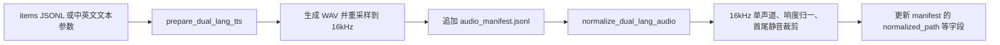

> 本文只描述当前仓库中可复核的脚本与配置。双语音频脚本位于 `~/DigitalHuman/finetune-avatarforcing/scripts/`；`measure_offset_dual.py`、`correct_clip_offset.py` 和 `prepare_identity.py` 实际位于 `models/avatarforcing/`，而不是 scripts 目录。项目全景见 [[project:digital-human]]。

## 一、多域数据和适配器各解决什么问题

训练配方使用 talkvid、news、linli 三个域。它们不是简单拼在一起：talkvid 提供通用说话视频，news 提供较稳定的播报风格，linli 补充覆盖。多域训练同时改变样本数量、来源和身份分布，因此后续评测不能把结果单独归因于“数据变多”。

| 域 | 内容 | 可确认的作用 |
|----|------|--------------|
| talkvid | 通用说话视频 | 提供主要通用说话样本 |
| news | 播报视频 | 补充播报风格样本 |
| linli | 补充域 | 扩大来源覆盖 |

`digital_human` 评测框架用 adapter 隔开数据组织和评测逻辑；base、talkvid、conversation、long 等适配器描述不同输入形态。新增数据集的重点是补齐适配器和轨道配置，而不是在模型代码里写数据路径。

## 二、双语 TTS 音频：从输入条目到 manifest

当前双语 TTS 脚本的流程不是“生成 items 文件”，而是：

`prepare_dual_lang_tts.py` 读取 `--items-jsonl`，或读取一对中英文文本参数；它生成 WAV 并**追加**记录到 `audio_manifest.jsonl`。初始 manifest 会标记 `loudness_normalized=false`、`silence_trimmed=false`。

随后 `normalize_dual_lang_audio.py` 用 ffmpeg 做三件事：

- 转为 16kHz、单声道；
- `loudnorm` 归一响度；
- 去除首尾静音，并回写 manifest 中的 normalized path、时长和处理状态。

这套规范化针对的是 TTS 探针音频。它不代表所有训练视频都经过同一条脚本链，也不应据此推断任意数据源的采样率/响度都会污染某一种具体指标。

### 16kHz 不是 FPS：它为什么会出现在训练链里

`16kHz` 是**音频采样率**，表示每秒 16,000 个音频采样点；它不是视频帧率。视频 FPS 表示每秒多少张画面，Avatar Forcing / Ditto 这条训练与推理链常以 **25 fps** 对齐。

两者组合后，每个视频帧对应的音频采样点数为：

$$
\frac{16000\ \text{samples/s}}{25\ \text{frames/s}} = 640\ \text{samples/frame}
$$

这不是人为随意选的常量：`train_distill_bridge.py` 将 `SAMPLES_PER_FRAME` 设为 `640 # 16000 / 25`；`train_lora.py` 的 `extract_audio()` 用 ffmpeg 强制 `-ar 16000 -ac 1`；Ditto 的 `wav2feat.py` 在输入不是 16k 时会用 librosa 重采样，再以 `len(audio) / 16000 * 25` 换算帧数。博客中的 Avatar Forcing 论文整理也记录了“视频转 25fps，音频重采样 16kHz”。

所以这里做的是**重采样与混音**：原始音频若是 24k、44.1k 或 48k，会转到 16k；多声道会下混为单声道。目的不是压低音质，而是让 wav2vec/HuBERT、SyncNet 和模型的音频-视频时间窗口使用同一份采样单位。

## 三、offset：对齐元数据，不等于总是物理移动音视频

offset 描述音频和视频在特征窗口上的相对偏移。它用于判断一段素材的口型和声音是否处于可比较的对齐位置，也会作为训练/评测口径的一部分。

当前实现里，`measure_offset_dual.py` 用于复核对齐；`correct_clip_offset.py` 用 SyncNet-v2 同类视觉/音频口径测量 LSE-C/D 并报告 offset。训练侧 `train_lora.py` 接收 `--offsets-json`，在编码 clip 时按 `(frame - offset)` 取对应音频窗口。

需要区分两个层次：代码在 offset 缺键时会回退为 `0`，并不会自动删 clip；但多域配方额外筛查了缺 offset 或不可靠的条目，并用 `--clips-exclude` 排除了 12 条，最终得到 257 个训练 clip。它们都使用 offset 元数据，不是在本流程中一律物理平移媒体文件。

这点很重要：offset 的绝对值会受素材子样本、测量噪声和窗口定义影响。实践中应优先比较同一 clip、同一口径下的成对结果；缺少可靠 offset 的素材宁可不进入这次训练，也不要把不确定的对齐写成“已修复”。

## 四、训练侧视频预处理：不是所有“删帧”都已接入

训练用的 `train_lora.py` 还做了与音频不同的一组视频预处理：

| 操作 | 当前行为 | 状态 |
|------|----------|------|
| 训练音频格式 | `extract_audio` 强制 `-ar 16000 -ac 1` | 已实现并使用 |
| 首帧无人脸 | `face_crop_data` 直接跳过该 clip | 已实现并使用 |
| 后续帧无人脸 | 复用上一帧的 crop，而非直接删除帧 | 已实现并使用 |
| 短片 | 只保留完整 50 帧训练段，余下不足段跳过 | 已实现并使用 |
| heldout 划分 | `heldout_stems` 划入验证，避免混进训练 | 已实现并使用 |
| 裁剪坐标 | 写入 motion cache key，避免不同裁剪复用同一缓存 | 已实现并使用 |

**逐帧删除非人脸帧**已经做过：`digital_human/filter_faceless_news.py` 对 73 条 news 素材完成检测、过滤和抽检，删除约 **1.80%** 的无脸帧，且没有整条视频被剔除。当前状态应区分两步：清洗结果已验证；`news_clean` 作为后续三域训练前置的接入仍在进行。不能提前写成训练已经完全使用了这套清洗输出。

低质量帧目前只有 `_monitor_window_sharpness` 监控；把它变成训练前硬过滤仍是待办，不应表述为已完成。

## 五、锚帧库：当前脚本实际怎么建

A1 推理期引导（见 [Avatar Forcing 微调实践](../微调与实践/Avatar%20Forcing%20微调实践.md)）需要一个身份方向库。`build_nopb_anchor_bank.py` 的 nopasteback 口径是：

1. 首帧运行 FaceCropper，得到固定裁剪框；
2. 后续帧全部用同一个固定框裁剪并 resize 到 512×512；
3. 不做旋转校正，不做质量筛选，**全帧入库**；
4. 输出包含方向和范数等数据的单个 `.npz` 文件。

因此不能把当前实现写成“姿态聚类采样 + 人工抽检”。那可以是未来的库质量策略，但不是此脚本已经完成的行为。

## 六、哪些结论可以从数据准备里得到

- 训练侧已使用音频 16k/单声道、offset 窗口消费、首帧无人脸跳 clip、后续无人脸复用上一裁剪、完整 50 帧段筛选、heldout 划分和裁剪坐标缓存；
- offset 缺键的代码默认与多域配方的显式排除是两层行为，报告时不能混成“系统自动过滤”；
- 无人脸逐帧删除脚本存在但尚未接入训练，低质量硬过滤也尚未完成；
- 锚帧库是当前 A1 实验的输入之一，但 A1 的长时结果目前仍是 c1 单身份证据，不能把库策略泛化为跨身份部署结论。

## 面试追问预案

**Q：为什么不把检测到的 offset 直接写回音视频文件？**

当前工程更需要的是一套可追溯的对齐口径：测量时使用什么窗口、训练时哪些 clip 有 offsets、哪些被排除。物理改媒体会影响共享数据和其他实验的输入语义；多域配方采用 `offsets.json` 和 CLI 排除清单，能把影响限制在当前实验。是否物理校正，需要在确认所有下游链路都使用同一时基后再决定。

**Q：为什么锚帧库不先做质量筛选？**

当前 nopasteback 脚本的目标是建立固定裁剪口径下的全帧方向库，先保证实现一致、可复现。质量筛选、姿态覆盖或聚类采样可能提升库质量，但它们不是现有脚本行为；若要加入，必须单独定义筛选准则并验证它不会把某些正常姿态错误排掉。