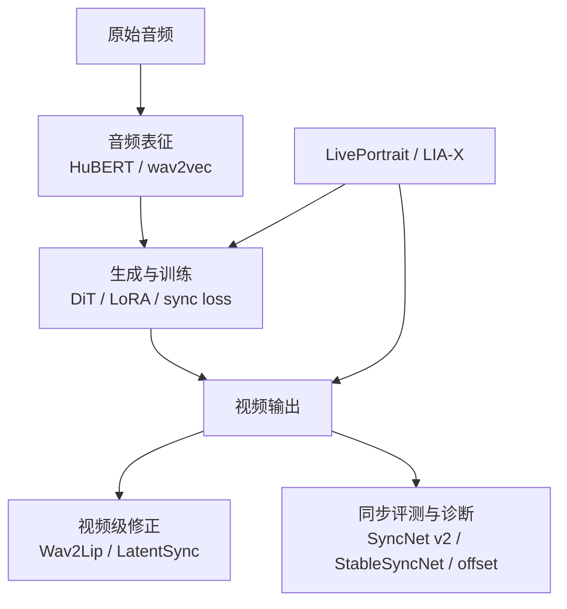

> 音画同步不是一个模型的名字，而是一条链：音频如何被表示、生成器如何学口型、视频如何被修正、同步如何被诊断。项目级指标口径见 [评测指标专题](评测指标专题.md)，数据和 offset 见 [数据集整理专题](数据集整理专题.md)。项目全景见 [[project:digital-human]]。

## 一、先画边界：谁负责什么



| 模块 | 主要角色 | 不是 |
|------|----------|------|
| HuBERT / wav2vec | 把波形转为语音特征 | 直接生成视频的模型 |
| LoRA / sync loss | 训练时调整生成链 | 独立评测器 |
| SyncNet v2 | 当前通用同步评测/监督口径 | 视频生成器 |
| StableSyncNet | 冻结同步监督、Stable LSE、offset 诊断 | LatentSync 的视频生成器 |
| Wav2Lip | 视频级口型替换路线 | 通用数字人系统 |
| LatentSync | 视频级扩散式同步/口型处理；本地用于闭嘴化源视频 | Ditto 内部 motion 模块 |
| LivePortrait | Ditto 的运动提取与 one-shot renderer 底座 | 同步评测器 |
| LIA-X | Talker-T2AV 的 40维 motion autoencoder/解码侧 | Ditto 的 motion 表示 |

## 二、音频表征：生成器到底听到什么

原始波形通常先统一到模型要求的采样率和声道，再经过 HuBERT、wav2vec 或其他语音编码器变成帧级特征。它们负责把“声音”变成可与视频时间轴对齐的向量，不负责判断最终嘴形好不好。

以 Ditto 为例，音频会进入 wav2feat/HuBERT，再驱动 motion 生成；以 Avatar Forcing 为例，中文 wav2vec2 特征通过 audio projection bridge 接入原 Flow 主干。音频表征可能是同步上限的瓶颈，但不能只凭某个 LSE 变化就断言瓶颈一定在编码器。

## 三、训练期方法：让生成链更关注口型

### 3.1 SyncNet v2 与同步损失

SyncNet v2 是当前项目常用的同步评测路径，也可作为训练监督的一部分。它将音频与嘴部视觉分别编码，再判断二者是否匹配。

当前 v2 口径的典型输入是：

- 5 帧、224×224 的人脸视觉序列；
- 13×20 的 MFCC 音频特征；
- `vshift=15` 的时间偏移搜索。

结果常写为 Sync/LSE C、D：C 是置信度类值（高通常更好），D 是距离类值（低通常更好）。它们的数值必须与同一模型、裁剪、音频和 offset 搜索口径比较。

### 3.2 LoRA 与同步损失

LoRA 不是同步模型，而是低秩微调方式。它可以把同步损失接到特定模块上，让模型在训练中更关心音频与动作的对应关系；但“LSE 变好”仍要同时看身份、画质、人工观察和其他同步口径，防止只把嘴变得更机械。

### 3.3 音素辅助头：待验证的表征塑形方案

当前 `phoneme-bottleneck-probe-and-fix` 计划在 audio_projection 桥后接两层 MLP：

```text
桥输出 → MLP (d_cond → 256 → n_phones) → MFA 音素标签
```

训练时联合音素 CE 与原同步损失；冻结 Wav2Vec2 与 Flow 主干，只训练桥和辅助头。**推理时辅助头丢弃**，因此它不增加推理计算图。

但这个训练臂尚未执行，不能写成“已提升同步”。它的价值在于检验：桥是否保留了足够区分音素的特征，而不是直接把音素分类准确率当成最终口型质量。

## 四、StableSyncNet：来自 LatentSync 的冻结监督与诊断器

StableSyncNet 从 LatentSync 相关代码/权重移植而来，在本地被当作独立冻结模块使用。它能做：

- LoRA 训练中的可微 BCE 同步监督；
- Stable LSE 评测；
- offset 扫描与局部同步诊断。

它**不生成视频**，也不是 Ditto 或 T2AV 的条件输入。

### 4.1 为什么不能把 Stable LSE 和 SyncNet v2 直接横比

| 项目 | StableSyncNet | SyncNet v2 |
|------|---------------|------------|
| 视觉输入 | 16 帧、106点仿射对齐的下半脸，48×128×256 | 5 帧、224×224 人脸裁剪 |
| 音频输入 | 80×52 mel | 13×20 MFCC |
| offset 搜索 | `-16..40` mel | `vshift=15` 搜索 |
| D 定义 | 窗口均 L2 的最小值 | shift L2 的最小值 |
| C 定义 | 各 offset 窗口均值的中位数减 D | median − min 的 v2 口径 |

两者窗口、对齐、特征和聚合方式都不同，**C/D 的量纲、阈值与绝对数值不得直接横比**。

当前已验证的一件事是：修正 Stable 的 106 点仿射对齐后，GT 的 C1 loss/cos 从 `1.57/.28` 改善到 `.457/.682`，说明对齐口径本身更合理。另一组训练出现了 stable 指标上升、v2 LSE 变差的情况，因此不能宣称 StableSyncNet 已证明生成同步更好，也不能宣称它普适优于 v2。

## 五、视频级处理：Wav2Lip 与 LatentSync

### Wav2Lip：局部替换

Wav2Lip 把重点放在嘴部区域：用驱动音频替换或重建口型。它适合视频配音或对已有视频做局部口型修正，但不天然解决头动、表情、身份或整段时序问题。

### LatentSync：当前的闭嘴化源方案

LatentSync 是视频级口型处理路线。本地 Ditto 视频源模式里，源视频原有嘴动会经外观纹理、表情基底和关键点回灌，形成“源嘴动 + 目标音频动作”的泄露。直接在 Ditto 内部切断这些通道很难彻底解决。

当前已证实的工程路线是：

```text
原视频源
  → LatentSync 闭嘴化
  → 闭嘴视频源进入 Ditto
  → Ditto 再按目标音频生成嘴动
```

LatentSync 是当前闭嘴化实现，不是唯一可能方案。任何能稳定把源嘴运动中性化、又不破坏身份和头动的方案，都可替换它。闭嘴化的结果与评测状态见 [Ditto 改动实践](Ditto_改动实践.md) 和 [模型探索与未采纳实验复盘](模型探索与未采纳实验复盘.md)。

## 六、offset：同步问题先确认是不是时间没对齐

offset 是音频和视频特征窗口的相对偏移。它可能来自素材、裁剪、抽帧或模型输出；错误 offset 会让一个本来同步的视频看起来不同步。

因此诊断顺序通常是：先固定资产/音频和采样率、确认 offset 口径，再比较 SyncNet v2 或 StableSyncNet，最后才考虑改 LoRA、辅助头或视频后处理。详见 [数据集整理专题](数据集整理专题.md)。

## 面试追问预案

**Q：StableSyncNet 既然更稳定，为什么不直接取代 SyncNet v2？**

“更稳定”描述的是它的对齐与窗口设计，不代表所有任务上都更能预测用户感受。两者的视觉区域、音频特征、offset 搜索和 C/D 定义都不同，数值不能横比。现有实验还出现 Stable 指标变好、v2 LSE 变差的冲突；正确做法是先把它作为补充诊断和训练信号，等同协议下的生成结果、人工观察和跨域验证齐全后再决定是否替代。

**Q：LatentSync 闭嘴化是不是绕过了 Ditto 的问题？**

它是改变问题边界：视频源泄露的根因是源嘴动被逐帧条件回灌。先把源视频改成中性嘴，Ditto 就不再需要一边保留源动作、一边抵消源嘴动。它是当前有效的工程预处理，不是证明 Ditto 内部泄露已经被完全解决；后续仍可以寻找更轻、更稳或更可控的中性嘴方案。

**Q：音素辅助头为什么推理时可以丢弃？**

它只在训练时要求桥的输出能预测 MFA 音素标签，用来塑形表征。训练结束后，真正被替换的是桥权重；生成链仍沿用原本的音频特征→motion 路径，辅助分类头不参与推理，因此没有额外时延。