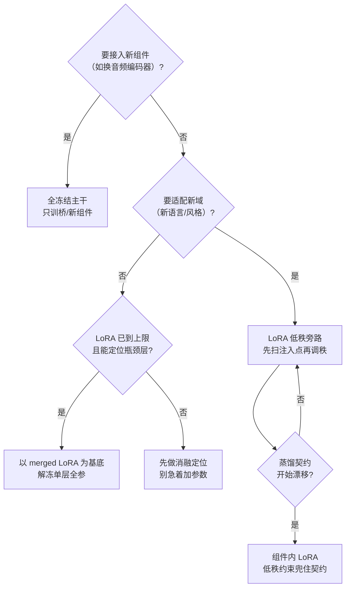

> 案例都来自 Avatar Forcing 中文微调（`~/DigitalHuman/finetune-avatarforcing`），但方法论通用。背景见 [Avatar Forcing 微调实践](Avatar%20Forcing%20微调实践.md)。

## 一、微调形态光谱

微调不是只有“训”或“不训”两种。**冻结**表示权重不更新；**解冻**表示允许某一部分直接学习；LoRA（Low-Rank Adaptation）则不改原权重，在旁边加一组很小的低秩增量。这里的**注入点**就是这组增量具体挂到网络的哪个模块上。

从“碰得最少”到“开放得最多”排列：

| 形态 | 我们的做法 | 可训参数量 | 适用场景 |
|------|-----------|----------|---------|
| **全冻结，只训新组件（桥）** | 蒸馏桥 B_new 全开放精调，flow/wav2vec 全冻结 | 桥 4.7M | 接入新音频编码器，不想动主干 |
| **LoRA（低秩旁路）** | flow cross-attn q/kv，rank16 | 低秩增量 | 主干域适配（中文化），数据有限 |
| **单层全参解冻** | targets=none 骨架全冻结，唯一放行 final_layer | 2.624M | 瓶颈层探针（历史零训练的层） |
| **整块开放 vs 桥内 LoRA** | 桥全开放精调 vs 桥内注入 rank16 LoRA（~0.15M） | — | 蒸馏契约漂移问题（见下） |

## 二、实战结论（每条都有实验背书）

### 2.1 本轮实验里，注入点比 rank 更影响结果

注意：这是**这轮中文域适配消融**的结论，不是所有模型都如此。我们同时比较了注入层、rank 和数据量；其中只有“把 LoRA 挂在哪”带来明显收益（q、kv、proj 组合 +0.39 LSE-C）。q/kv/proj 是注意力层里负责查询、键值和投影的线性层名称；rank 和数据量在当时的数据规模下没有成为主瓶颈。

两轮调研解决的是“到底挂到了哪里”：

- **Round 1**：`q,kv,proj` 三轴。问题是 `proj` 会同时命中三处职责不同的模块（attn.proj / cross_attn.proj / x_embedder.proj），因此无法判断收益来自哪一处
- **Round 2**：target 改为**路径后缀精确匹配**，例如 `*.cross_attn.proj` 只命中 8 个目标；训练前打印命中清单，再做 crossproj / mlp / selfonly / full 等对照

结论不是“某个模块永远最好”，而是：先让注入位置可审计，消融结果才值得信。

### 2.2 多域结果不能直接归因成“数据量是瓶颈”

多域设置（talkvid+news+linli，257 clips）中，md_georkd_best 的双轨均值 sync_c 为 6.299，是当前已测臂里的较优结果。但这一次同时改变了样本数量、来源域和身份多样性，且人工对比网格尚未完成；它不足以证明“纯数据量就是瓶颈”，更不能推出普适的“加数据一定优于加参数”。目前只能把它视为值得继续做配比和多 seed 验证的候选方向。

### 2.3 全开放的代价：桥和主干失去配合

蒸馏桥的“契约”指的是：桥输出的特征分布要和原主干习惯接收的特征保持兼容。桥若为追求训练集分数而改得太多，主干虽然没变，却可能收到了它不熟悉的输入。

路线 A（桥全开放精调）出现了明显的训练/验证分叉：训练侧 sync 下降、guided_flow 恶化；生成侧 videoc1 LSE-C 为 4.565，低于纯桥 5.719（−1.15）。这说明全开放精调破坏了桥向主干“翻译特征”的兼容性。

路线 B（桥内 LoRA）冻结桥基底，只在唯一的 Linear(9216→512) 上加 rank16 LoRA（约 0.155M）。它比路线 A 好（videoc1 LSE-C 5.483 vs 4.565），却仍低于纯桥 5.719（−0.24）。因此这组实验的结论不是“桥内 LoRA 已解决问题”，而是：低秩约束能减轻全开放造成的回退，但两种桥精调都没有超过纯蒸馏冻结桥；当前更好的适配位置仍在 flow LoRA 一侧。

### 2.4 解冻单层的判据：找历史空白区

FinalLayer readout（实际为 adaLN 1024→2048 + Linear 1024→512，4 个参数张量共 2.624M；早期按 hidden 512 估的 0.79M 已勘误）：

- **动机**：核查发现全部 17 个历史训练臂从未碰过 `final_layer.*`——它是主干外唯一从未微调的可训组件，且只在英文原数据上训过。假设：主干已学会中文音节区分，但 readout 把中文 viseme 方向投影进低增益方向
- **方法**：以训好的 geom_lora_s30 merged 为基底（`--flow-init` strict 载入）再解冻——**先训好 LoRA 再解冻，归因最干净**
- **配套**：`--early-stop-patience 3`（val 连续 3 ep 高于谷底即停）

### 2.5 工具链

| 工具 | 作用 |
|------|------|
| `--flow-init` | 任意 merged ckpt 作为训练起点，strict 载入 |
| `--early-stop-patience N` | 谷底连升即停，防过拟合烧卡 |
| `export_merged` | adapter 合并导出，全参键自动识别与基底回填 |
| 注入点命中清单打印 | 训练前审计每个 target 实际命中哪些模块 |

### 2.6 指标对照：不同口径不横向排序

以下两组数字来自不同评测体系，不能放进同一列排冠军。

**Round 1：单轨 output LSE-C 口径**

| 臂 | LSE-C ↑ |
|----|---------|
| baseline | 5.288 |
| layer_proj | 5.677 |

**多域：三 heldout × c1/c4 双轨均值，SyncNet v2 `sync_c` 口径**

| 臂 | sync_c ↑ | sync_d ↓ |
|----|----------|----------|
| geom_lora_s30（锚） | 6.122 | 9.044 |
| md_georkd_best（ep2） | **6.299** | **8.853** |

两组的素材、轨道、指标实现和聚合方式不同；它们各自只适合回答本组实验的问题。

## 三、决策树

## 面试追问预案

**Q：LoRA rank 怎么选？为什么是 16？**

我们的经验：rank 在 8~32 区间内收益差异远小于注入点选择的差异——先扫注入点（收益主轴），rank 用 16 这种保守默认值即可。这是因为域适配任务（中文化）的真实本征维度不高，rank16 的容量已够；真正缺的是"注入对地方"。如果注入点已最优还差容量，才值得做 rank 扫描。

**Q：怎么判断"该解冻了"？**

三个信号同时满足：① LoRA 已收敛到平台期，加数据不动了；② 有明确归因的瓶颈定位（我们靠历史臂审计发现 final_layer 零覆盖）；③ 接受单层实验的归因成本（解冻后指标变化只能归因于这层）。缺任何一个都先回去做消融——"感觉该解冻了"不是理由。

**Q：桥内 LoRA 和直接给桥降 rank 有什么区别？**

降 rank 是**改变组件结构**——桥的表达上限被永久压缩，且要重训。桥内 LoRA 是**在冻结的原结构上加增量**——原契约（B_new 基底权重）原封不动，LoRA 只学"在契约附近的小偏移"。推理时可以合并，部署形态无差别。本质区别：约束施加在"偏移量"上而不是"组件本身"上，保留了组件的全部容量以备后续数据充足时重训。
