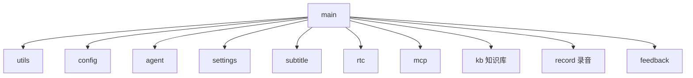
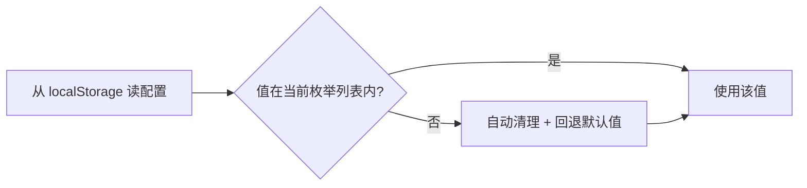

> 本文是 VoiceAgent 项目总览 的**前端亮点二**。服务端有一个**同名方法** `buildStartAgentBody`，两者的关系见 前后端契约与协同设计。

## 一、两个纠缠在一起的问题

### 问题 A：1476 行的单文件

项目原始代码是一个 **1476 行的 `index.html`**，所有业务逻辑挤在一起：

- RTC 通话建立与轨道管理
- 字幕实时渲染
- 配置项读写与持久化
- MCP 工具调用
- 知识库、录音、反馈……

改任何一处都要在近一千五百行里翻找，且**改 A 挂 B** 的情况频繁出现，因为所有函数共享同一个作用域，谁都能改谁的变量。

### 问题 B：配置组合爆炸

语音链路支持**级联**和**端到端**两种模式，往下展开是：

| 维度 | 取值数量 |
|------|---------|
| Pipeline 模式 | 3 种（级联 / 一段式 / 两段式） |
| LLM 模型 | 5+ 个 |
| 音色 | 3 类 |
| TTS 提供方 | 2 家（Aliyun 内置 / Customized 自定义） |

这些维度**不是自由组合**——比如端到端链路不支持 RAG、Customized TTS 需要额外的 API Key、某些模型只在特定 pipeline 下可用。散落在各处的 `if` 判断让下发参数经常不符合网关契约，导致会话启动失败。

**任务（T）**：将单体文件重构为模块化架构，并设计统一的语音链路配置适配层，支持上述所有组合的灵活配置与按需下发。

## 二、Action：架构与配置双线改造

### 2.1 模块化拆分：12 个功能域

我把单体 HTML 拆成了 **12 个功能模块**：



| 模块 | 职责 |
|------|------|
| `utils` | 通用工具函数 |
| `config` | 配置定义与枚举 |
| `agent` | Agent 会话请求体组装 |
| `settings` | 设置面板与持久化 |
| `subtitle` | 字幕渲染 |
| `rtc` | RTC 通话与轨道管理 |
| `mcp` | MCP 服务配置与工具调用 |
| `kb` | 知识库 RAG |
| `record` | 录音 |
| `feedback` | Bad Case 反馈 |
| `main` | 编排入口 |

### 关键决策：为什么不引入构建工具？

标准答案是「上 Webpack / Vite，用 ES Module」。我**没有这么做**，选的是「**按序加载共享全局作用域**」方案。

原因是这个项目的一条硬约束：**必须保持零构建工具、纯静态部署**。它是一个交付给企业客户体验的 Demo，需要能直接丢到任意静态服务器（甚至客户自己的 nginx）就跑起来，不能要求对方有 Node 环境或执行构建。

| 方案 | 优点 | 为什么没选 |
|------|------|-----------|
| ES Module + 构建工具 | 依赖显式、tree-shaking | 破坏零构建约束 |
| 原生 `<script type="module">` | 无需构建 | 本地 `file://` 打开受 CORS 限制，客户自测不方便 |
| **按序加载共享全局作用域** ✅ | 零构建、纯静态、任意环境可跑 | 依赖顺序是隐式的（用注释和加载顺序约定弥补） |

> **这是一个有意识的取舍**：我用「依赖顺序隐式」这个代价，换来了「部署零门槛」这个业务硬需求。工程决策要服务于约束，而不是套用最流行的方案。

**效果：主文件从 1476 行降至 ~300 行**，模块职责清晰。

### 2.2 buildStartAgentBody：统一请求体组装层

配置组合爆炸的根源是**判断逻辑散落各处**。解法是收敛到一个函数：

`buildStartAgentBody()` 根据 Pipeline 模式、模型枚举、开关状态，**按需构造**这些配置块：

```
asrConfig / llmConfig / ttsConfig / s2sConfig / ragConfig / mcpServers
```

「按需」是核心。举例：

| 场景 | 下发内容 |
|------|---------|
| 级联链路 | 构造 `asrConfig` + `llmConfig` + `ttsConfig` |
| 端到端链路 | 构造 `s2sConfig`，**不下发** asr/llm/tts |
| RAG 开关关闭 | `llmConfig` 里**不出现** `ragConfig` 字段 |
| MCP 开关关闭 | 下发 `{}` **显式禁用**全部服务 |

这里必须严格遵循网关的**字段级浅覆盖契约**：不下发某字段 ≠ 下发空值。

> **为什么这个区别很致命？** 服务端的三级配置继承里，**字段缺失表示「回退上一级默认值」**，而下发空值表示「显式设成空」。前端如果图省事把所有字段都填上（该缺的填 `null`），服务端的继承链就全部失效了。这个契约细节见 服务端配置继承 和 前后端契约。

### 2.3 TTS 双提供方模式

TTS 支持两种截然不同的形态：

| 提供方 | 用户填什么 | 下发差异 |
|--------|-----------|---------|
| **Aliyun** | 从内置音色列表里选 | 只需音色标识 |
| **Customized** | 自定义模型 + API Key | 需要额外的鉴权与模型字段 |

通过 `vendor` 字段路由下发逻辑，两条路径互不干扰。

> 服务端也有一套 **vendor 反推**逻辑（根据音色标识推断提供方），两边的 vendor 语义必须对齐，否则会出现前端下发 Customized 但服务端按 Aliyun 解析的错配。

### 2.4 getOverride：配置脏数据自净机制

这是一个**上线后才发现有多重要**的设计。

配置持久化在 `localStorage` 里。随着版本迭代，会出现两类脏数据：

1. **旧版残留**：上个版本存的字段，新版已经废弃或改名
2. **枚举失效值**：某个模型下线了，但用户浏览器里还存着它

用户带着这些脏数据发起会话 → 下发了非法参数 → **网关报错，会话启动失败**。而用户完全不知道为什么，只觉得「这个页面坏了」，甚至清缓存才能恢复。

`getOverride()` 的做法是**在读取时校验并自愈**：



不在枚举列表内的值**自动清理并回退默认值**，避免非法参数下发。

> **设计原则：不信任任何持久化的外部数据。** `localStorage` 本质上是「上个版本的代码写进去的数据」，它的 schema 和当前代码没有任何强制约束关系。凡是跨版本存活的数据，读取时都必须校验。这和服务端「不信任请求参数」是同一条原则的两面。

## 三、Result：结果

| 指标 | 结果 |
|------|------|
| 主文件行数 | **1476 行 → ~300 行**，模块职责清晰 |
| 配置组合覆盖 | **3 种链路 × 5+ 模型 × 3 类音色 × 2 TTS 提供方** |
| 下发参数合规率 | **100% 符合网关契约** |
| 配置相关会话启动失败率 | 脏数据自净机制上线后**降为 0** |

## 四、面试追问预案

**Q：不用构建工具、靠全局作用域共享，不就是回到 jQuery 时代了吗？**

形式上像，但有本质区别：我做了**明确的模块边界和职责划分**，每个文件只暴露自己命名空间下的函数，模块间通过约定好的接口调用，而不是随意读写彼此的变量。真正的问题在于「依赖顺序隐式」——这个我承认是代价，靠加载顺序集中在一处 + 注释说明来控制。

如果这个项目没有「零构建静态部署」的硬约束，我会选 ES Module + Vite。**是约束决定了方案，不是偏好。**

**Q：12 个模块的划分依据是什么？会不会拆太细？**

按**功能域**划分，每个模块对应一个用户可感知的能力（字幕、录音、反馈、知识库……）。判断标准是「这个模块能否独立地被开关或替换」——比如 MCP 和知识库是两个独立开关，就是两个模块。

至于会不会太细：主文件从 1476 降到 300 行，说明拆分吸收了绝大部分逻辑；单个模块规模都在可一屏读完的量级。没有出现「为了拆而拆」的空壳模块。

**Q：`buildStartAgentBody` 会不会变成一个新的巨型函数？把复杂度从「散落各处」搬到了「集中一处」？**

会有这个风险，但**集中的复杂度和散落的复杂度不是一回事**。散落时，你无法知道某个字段最终会被谁改写；集中后，请求体的完整形态在一个地方就能读全，契约变更时只改一处。

这是有意的收敛：**请求体组装是一个「契约翻译」职责，本身就应该内聚。** 内部再按配置块（asr/llm/tts/s2s/rag/mcp）分成子函数保持可读性。

**Q：为什么前后端都叫 `buildStartAgentBody`？重复了吗？**

不重复，两者处理的是**同一契约的不同侧**：

- 前端版：把**用户界面上的选择**翻译成请求体（关心枚举校验、开关状态、脏数据）
- 服务端版：把**三级继承后的配置**翻译成网关调用参数（关心继承、哨兵值、vendor 反推）

同名是因为它们在各自层面扮演相同角色。详见 前后端契约与协同设计。

**Q：脏数据问题为什么不用给 localStorage 加版本号、升级时整体清空来解决？**

整体清空会把用户**所有有效配置**都丢掉，体验很差（用户精心调好的音色、模型全没了）。`getOverride()` 的做法是**字段级自愈**：只清理真正失效的那几个字段，其余保留。

版本号方案适合「schema 发生了不兼容的结构性变更」；而我们遇到的绝大多数是「某个枚举值下线了」这种局部失效，字段级校验更精准。两者也不冲突，可以叠加。

## 相关文档

- VoiceAgent 项目总览
- 前后端契约与协同设计 — 浅覆盖契约的完整说明
- 服务端 · 三级配置继承体系 — 契约的服务端侧
- [[knowledge/voice-agent-web-mcp-rag|MCP 工具可视化与 RAG 前端集成]] — 配置层的具体应用
