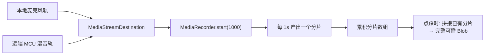

> 本文是 VoiceAgent 项目总览 的**前端亮点三**。服务端的 `feedback` + `feedback_audio` 两表分离存储与本文的上传协议一一对应，见 前后端契约与协同设计。

## 一、问题：AI 出错了，但没人知道为什么

AI Agent 在实际使用中会偶发这些问题：

- **答非所问**——LLM 理解偏了
- **ASR 误识别**——用户说的和识别出的不一样
- **时延过高**——用户等太久

这些问题的共同特点是**偶发且难以复现**。用户反馈「刚才那句它答错了」，但：

- 「刚才那句」到底是什么？用户记不准
- 是 ASR 听错了还是 LLM 答错了？无从判断
- 当时用的什么模型、什么配置？不知道
- 想复现？根本不知道现场是什么样

运营团队面对这类反馈只能干瞪眼，**根因定位平均要好几天**，且大多数最终不了了之。

**任务（T）**：设计一套会话级点踩反馈系统，在用户点踩时**一次性**上报完整的问题上下文（对话记录 + 双方混音录音 + 会话配置快照），支撑后端复现与归因分析。

## 二、核心难点：怎么在会话进行中拿到录音？

这是整个设计里最有意思的技术点。

`MediaRecorder` 的标准用法是 `start()` → `stop()`，**在 `stop()` 之后**通过 `ondataavailable` 拿到完整的音频 Blob。

但我们的场景是：**用户在会话进行中点踩**，希望立刻上报「从会话开始到此刻」的录音——而会话**还要继续进行**。如果为了取录音去 `stop()`，会话录音就断了；不 `stop()`，又拿不到可播放的完整文件。

### 解法：分片录制 + 独立 AudioContext



两个关键设计：

**① 独立 AudioContext 混音**

把**本地麦克风轨**与**远端 MCU 混音轨**接入同一个 `MediaStreamDestination`，得到一路包含双方声音的合成流。用「独立」的 AudioContext 而不是复用 RTC SDK 的，是为了避免录音逻辑干扰通话本身的音频处理链路。

**② `MediaRecorder.start(1000)` 分片录制**

传入 `timeslice = 1000` 参数后，`MediaRecorder` 会**每秒吐出一个数据分片**，而不是等到 `stop()` 才给一整块。

于是「会话进行中取录音」就变成了：把**已经累积的分片数组拼起来**，就是一个完整可播放的音频文件。**无需停止录制**，会话继续跑，分片继续累积。

> **这个设计的价值**：它把「录音」从一个**有始有终的事务**变成了一个**可随时快照的流**。同一个机制同时支撑了两种反馈场景：会话进行中点踩、挂断后点踩。

## 三、Action：其余三个设计

### 3.1 旁路对话记录机制

有了录音还不够，还需要**结构化的对话记录**。

我没有新建一套独立的记录系统（那会导致两套逻辑不同步），而是在已有的三个渲染入口**旁路写入** `convLog`：

| 旁路点 | 记录内容 |
|--------|---------|
| `pushTranscript` （字幕渲染） | role 消息（用户说了什么、AI 答了什么） |
| `renderFunctionCall` （工具调用渲染） | 工具调用及其结果 |
| `renderDelayMetrics` （延迟指标渲染） | ASR / LLM / TTS / 端到端时延数据 |

> **为什么选「旁路」而不是「独立采集」？** 因为这三个函数是**用户实际看到的内容**的唯一来源。在它们内部旁路写入，能保证 `convLog` 里记的和用户屏幕上看到的**严格一致**。如果另起一套采集，一旦渲染逻辑改了而采集没跟上，上报的记录就和用户看到的不一样，排障时会被误导。
>
> **原则：可观测性数据应当挂在真实路径上，而不是并行造一条。**

### 3.2 multipart/form-data 混合上传协议

一次点踩要传两类东西：**结构化数据**和**二进制文件**。

| Part | 内容 |
|------|------|
| `meta` | JSON，含 `sessionId` / `transcript` / `sessionConfig` / `offsetMs` 等 **15+ 字段** |
| `audio` | 可选的 WebM / MP4 音频文件 |

服务端对应地用 **`feedback` + `feedback_audio` 两表分离存储**。

> **为什么两表分离？** 音频是大字段（平均 200-500KB），且不是每次反馈都有。放同一张表会让主表膨胀、查询变慢；而运营的绝大多数查询（按时间/会话/配置筛 bad case）**根本不需要音频**。分离后主表保持轻量，音频按需 join。

`offsetMs` 字段值得单独说：它记录**点踩时刻相对会话开始的毫秒偏移**，这样运营拿到几分钟的录音后能**直接跳到出问题的那一秒**，而不是从头听。

### 3.3 跨浏览器兼容与两个实战坑

**坑 1：编码格式支持度不一**

不同浏览器支持的录音编码不同，所以按优先级**探测**：

```
webm;codecs=opus  →  webm  →  mp4
```

Opus 编码率最优先（体积小音质好），逐级降级，保证各浏览器都能录。

**坑 2：Safari 异步分片丢失**

Safari 上会出现最后一个分片丢失的问题——因为 `AudioContext` 被释放时，尚未通过异步回调交付的分片就没了。

解法：**延后 500ms 再释放 AudioContext**，给异步分片留出交付窗口。

**坑 3：广告拦截插件误杀（这个最出乎意料）**

功能上线后发现部分用户的反馈按钮**根本不显示**。排查发现是**广告拦截插件**把相关 DOM 元素干掉了——因为类名里带了 `bad-case`、`ad`、`adv` 这类关键词，命中了插件的拦截规则（`ad` 是 advertisement 的常见缩写）。

解法：**全部 DOM 标识改用 `fb-*` 命名**，规避 `bad-case` / `ad` / `adv` 等敏感词。

> **这个坑的教训**：前端代码运行在**用户可任意改造的环境**里。浏览器插件、脚本拦截、企业代理都可能改写你的页面。命名这种「看起来无所谓」的细节，在真实环境里可能直接导致功能不可用。

## 四、Result：结果

| 指标 | 结果 |
|------|------|
| 反馈提交闭环率 | **100%** |
| 单次提交内容 | 完整录音（平均 **200-500KB**）+ 对话记录 + 配置快照 |
| 支持场景 | **会话进行中** 与 **挂断后** 两种 |
| 录音覆盖范围 | 从会话开始到点踩时刻的完整音频 |
| 运营定位效率 | bad case 平均定位时间从**数天缩短至分钟级** |

## 五、面试追问预案

**Q：为什么不干脆让服务端录音？服务端在 RTC 链路上，录音更方便。**

服务端录音拿到的是**它自己视角的音频**，缺两样关键信息：一是用户端的真实听感（网络抖动、丢包在客户端才体现）；二是**用户主观判定的「出问题时刻」**。

更重要的是：这套系统的核心价值不是「有录音」，而是**把录音、对话记录、配置快照三样东西在用户点踩的瞬间绑定成一个完整上下文**。这个绑定动作只有前端能做，因为只有前端知道用户点的是哪一刻。

**Q：`MediaRecorder.start(1000)` 每秒一个分片，长会话会不会内存爆掉？**

会话本身有硬性时长上限（服务端有 600s 硬顶），所以分片数量有界。按实测平均 200-500KB 的量级，即使跑满上限也在浏览器内存的舒适区内。

如果要支持超长会话，可以改成滑动窗口（只保留最近 N 分钟）或分段上传，但那会牺牲「从会话开始的完整录音」这个特性——当前场景下完整性更重要。

**Q：分片拼接出来的 Blob 真的能直接播放吗？WebM 不是有容器头吗？**

能。这正是 `timeslice` 模式的设计意图——`MediaRecorder` 保证**第一个分片包含容器头**，后续分片是可追加的媒体数据，按序拼接即为合法文件。这也是为什么必须严格保序累积分片，不能乱序或丢中间片。

Safari 那个坑本质上就是**丢了尾部分片**，虽然文件仍可播，但结尾会缺失，所以要延后释放 AudioContext。

**Q：15+ 字段的 meta 是不是过度设计？**

不是。每个字段都对应一个具体的排障问题：`sessionId` 用于串联服务端日志，`sessionConfig` 用于回答「当时什么模型什么配置」，`offsetMs` 用于快速跳转，`transcript` 用于判断是 ASR 错还是 LLM 错。

判断标准很简单：**这些字段少一个，就有一类 bad case 无法归因**。反过来说，正是因为一次上报就包含了全部上下文，运营才能从「数天」压到「分钟级」——不需要来回找用户追问现场。

**Q：如果用户点踩时网络很差，上报失败了怎么办？**

这是当前实现的一个薄弱点。音频动辄几百 KB，弱网下确实有失败风险。可以优化的方向是：meta 和 audio 分两次提交（先保住轻量的结构化数据，音频异步补传/失败可弃），或对音频做失败重试。

不过实测闭环率 100%，说明在实际使用环境下没有成为瓶颈，所以当时没有为此增加复杂度。

## 相关文档

- VoiceAgent 项目总览
- 前后端契约与协同设计 — 上传协议与两表存储的对应关系
- 服务端 · 会话生命周期状态机 — 会话时长上限的来源
- [[knowledge/voice-agent-web-mcp-rag|MCP 工具可视化与 RAG 前端集成]] — `renderFunctionCall` / `renderDelayMetrics` 的实现
