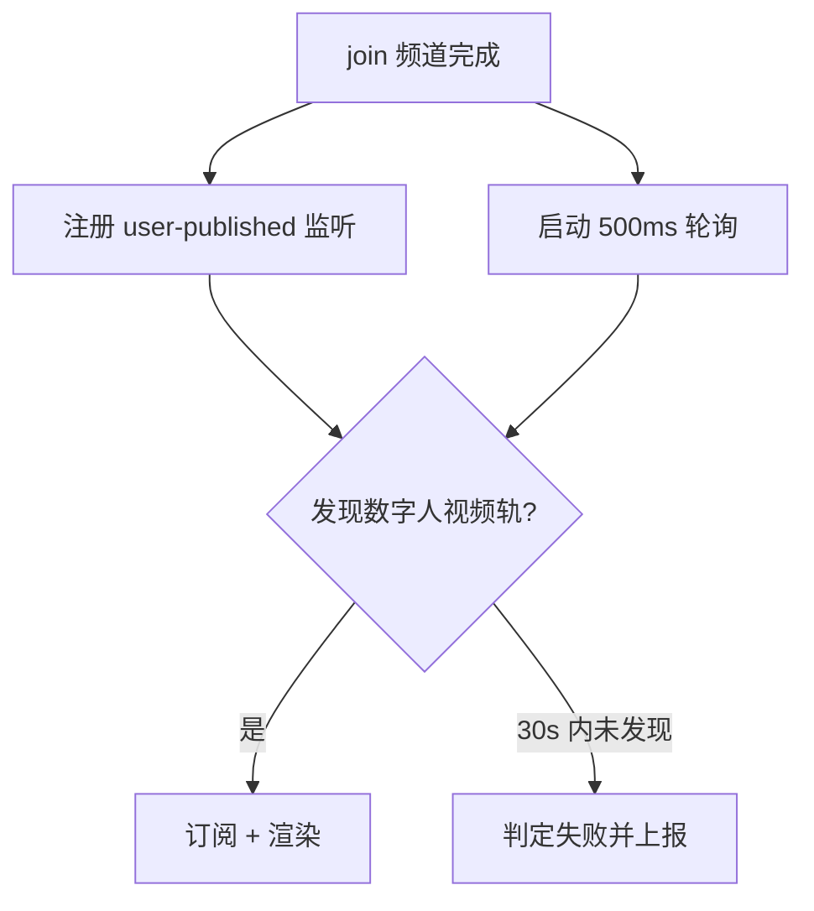
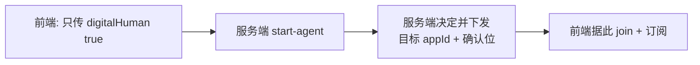

> 本文是 VoiceAgent 项目总览 的**前端亮点一**。服务端侧的对应实现见 编排引擎与多通路路由，两边是一套设计的两个半场。

## 一、问题：视频轨「明明在那，但发现不了」

业务要求把 AI Agent 的**数字人视频画面**实时呈现给用户。听起来只是「订阅一路视频流」，但踩了三个坑。

### 坑 1：SDK 不会补发 `user-published` 事件

WebRTC 的常规做法是**事件驱动**：远端用户发布了轨道，SDK 抛 `user-published`，前端收到后订阅。

但数字人 Agent 是**先于用户加入频道的**。等真人用户 join 进来时，发布动作早就发生完了，而 SDK **不会为已经发生的发布行为补发事件**。

```
时间轴:
  T1  数字人 Agent join 频道 + publish 视频轨
  T2  真人用户 join 频道
      ↑ 此刻注册 user-published 监听器 → 永远等不到 T1 那次发布
```

结果就是：视频轨真实存在，但前端永远收不到通知，画面一片空白。

### 坑 2：数字人在独立的 RTC App 下

数字人实例部署在**另一个 RTC App**（不同 appId）。前端如果按普通模式的 appId 去 join，token 和 appId 不匹配，**直接 join 失败**。

### 坑 3：音视频双声

MCU 已经把音频混好了一路给我们，而数字人的**视频轨里也带着音频**。两路一起播，用户听到的是**重影的双声**。

**任务（T）**：设计一套可靠的数字人视频发现、订阅、渲染与质量监控方案，解决跨 App 会话建立、视频轨发现延迟、音视频双声三个核心难题。

## 二、Action：四个针对性设计

### 2.1 事件驱动 + 轮询兜底的双路发现机制

既然事件不可靠，就**不能只依赖事件**。我的方案是两条腿走路：



轮询的具体做法是每 **500ms** 检查一次 `rtcClient.remoteUsers`，配合两条匹配规则：

| 规则 | 作用 |
|------|------|
| 用 `agentUserId` **精确匹配** | 频道里可能有多个远端用户，必须锁定是数字人那一路 |
| **自端排除**逻辑 | 排除自己，避免把本地轨当成远端轨订阅 |

30 秒内完成视频轨发现与订阅，超时则判定失败并上报。

> **为什么是 500ms？** 太密（如 50ms）会造成无意义的 CPU 开销，因为数字人推流本身有秒级的准备时间；太疏（如 2s）会明显拉长首帧延迟。500ms 是「用户感知不到延迟」和「开销可忽略」的平衡点。
>
> 这里体现的通用原则：**事件驱动优雅但不可全信，涉及关键路径时要有轮询兜底。** 这和服务端 三层超时兜底 里「实时事件负责快、定时扫描负责不漏」是完全同一个思路——只是一个在前端，一个在后端。

### 2.2 服务端确认位机制（前后端协同的关键设计）

跨 App 问题最初的「土办法」是：前端自己判断是数字人模式，然后**硬编码**数字人专用 appId。

这个做法很快就出问题了——appId 一旦在服务端变更、或者环境（日常/预发/线上）不同，前端就会拿着错误的 appId 去 join，报 token 不匹配。而且 appId 属于**服务端配置**，本来就不该由前端知道。

改造后的协议是：



| 角色 | 职责 |
|------|------|
| 前端 | 只表达**意图**（`digitalHuman: true`），不关心用哪个 appId |
| 服务端 | 在 `start-agent` 响应里下发**目标 `appId` 与确认位** |

**彻底消除前端硬编码 appId 导致的 token 不匹配问题。**

> 这正是服务端 `ai-dh-` 前缀设计 的另一半：服务端用 `agentUserId` 前缀记住「这次用的是数字人 appId」以便后续 stop，前端则完全不碰 appId 决策。**同一个问题在前后端各自的正确解法。**

### 2.3 用 MutationObserver 掐掉双声

双声问题的难点在于：**video 元素是 SDK 内部创建的**，我拿不到创建时机，也不能改 SDK 代码。

如果用 `setTimeout` 轮询去找元素然后静音，中间那段时间用户已经听到双声了。

我的解法是用 `MutationObserver` **持续监听 DOM 变化**，在 SDK 插入 video 元素的**瞬间**强制静音：

```js
// 思路示意
const observer = new MutationObserver((mutations) => {
  // 检测到新插入的 video 元素，立刻 muted = true
})
observer.observe(container, { childList: true, subtree: true })
```

关键在于 `MutationObserver` 的回调是在 DOM 变更后的**微任务**里同步触发的，早于浏览器开始播放音频，所以用户完全听不到杂音。

### 2.4 用 requestVideoFrameCallback 做质量监控

光「能播」不够，还得知道**播得好不好**。我基于 `requestVideoFrameCallback` 实现了实时质量指标采集：

| 指标 | 意义 |
|------|------|
| **首帧延迟** | 从 join 完成到第一帧画面渲染，直接决定用户的「快慢」体感 |
| **FPS** | 帧率是否稳定，卡顿的量化依据 |
| **丢帧率** | 网络或解码瓶颈的信号 |

> **为什么用 `requestVideoFrameCallback` 而不是 `requestAnimationFrame`？** 前者在**每一帧视频画面真正被渲染时**回调，能拿到精确的帧时间戳和已丢帧数；后者只跟屏幕刷新率绑定，测出来的是浏览器绘制节奏，不是视频真实帧率。**测什么就用什么 API，否则数据会误导优化方向。**

指标实时上报日志，为排障提供数据支撑。

## 三、Result：结果

| 指标 | 结果 |
|------|------|
| 数字人视频首帧延迟 | **2s 以内**（距 join 完成计） |
| 帧率 | 稳定在 **25-30 fps** |
| 跨 App 会话建立成功率 | **100%**（消除 token-appId 不匹配导致的 join 失败） |
| 方案沉淀 | 成为**团队数字人接入标准范式**，输出排障指南文档 |

## 四、面试追问预案

**Q：为什么不能只用事件驱动？非要加轮询这么「土」的兜底？**

因为这个场景的事件**在语义上就是不可靠的**：数字人先于用户 join，`user-published` 已经发生过了，SDK 设计上不补发历史事件。这不是 SDK 的 bug，是事件机制的固有特性——**事件只能通知「此后发生的事」**。

要拿到「此前已存在的状态」，必须主动查询。轮询 `remoteUsers` 就是在查询当前状态快照。所以这不是「土办法兜底」，而是**用对了机制**：事件负责增量，轮询负责存量。

**Q：轮询 30 秒还没发现就放弃，会不会太激进？**

30 秒是基于数字人实例正常启动耗时（秒级）留了足够余量。超过这个量级基本可以断定是异常（实例启动失败、appId 配错、网络不通），继续等只是让用户对着黑屏干等。**及早失败并给出明确提示，比无限期等待的体验更好**，而且失败上报能让我们拿到排障数据。

**Q：MutationObserver 会不会有性能问题？它监听整个 DOM 树。**

我限定了 `observe` 的根节点是视频容器而非 `document.body`，且只关心 `childList`。回调里做的事只是判断节点类型 + 设置 `muted`，开销极小。而且视频容器的 DOM 变更频率本身很低（一次会话就插入一两个元素）。

**Q：双声问题为什么不让服务端别在视频轨里带音频？**

提过，但这涉及数字人上游的推流实现，改造周期长且影响其他接入方。前端 `muted` 是**成本最低且完全可控**的解法——视频轨的音频我们本来就不需要（MCU 混音已经给了完整音频）。这是典型的「在自己能控制的边界内解决问题」。

**Q：如果 MutationObserver 也没赶上，用户还是听到了一瞬间双声怎么办？**

理论上存在这个窗口。实测没有出现，因为 `MutationObserver` 回调在 DOM 变更后的微任务阶段执行，而音频解码播放要经过更长的链路。如果真要做到万无一失，可以在订阅时就通过 SDK 的订阅参数只要 video 不要 audio——但当时 SDK 的接口不支持轨道级细分，所以选了 DOM 层拦截。

## 相关文档

- VoiceAgent 项目总览
- 前后端契约与协同设计 — 确认位机制的完整协议
- 服务端 · Agent 全生命周期编排引擎 — appId 决策与 `ai-dh-` 前缀的服务端侧
- [[knowledge/voice-agent-web-architecture|前端模块化重构与配置适配层]]
