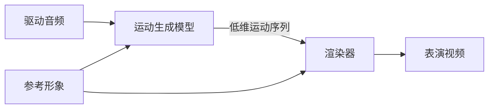

> 本文是数字人系列文档的入口篇。各路线与专题的深挖见同目录：[[knowledge/动作空间专题|动作空间专题]]、[[knowledge/Avatar Forcing 模型精读|Avatar Forcing 模型精读]]、[[knowledge/Ditto 模型精读|Ditto 模型精读]]，工程侧见 [[knowledge/CyberVerse 工程专题|CyberVerse 工程专题]] 与 [[knowledge/评测指标专题|评测指标专题]]。项目全景见 [[project:digital-human]]。

## 一、先分清两层：数字人 vs 数字人系统

讨论数字人时必须先区分两个层次：

| 层次 | 是什么 | 关心的问题 |
|------|--------|-----------|
| **数字人**（生成模型） | 一个视频生成任务 | 生成质量、推理速度 |
| **数字人系统**（产品） | 围绕模型的一整套交互管线 | 端到端延迟、可用性、交互体验 |

为什么要先分清？因为聊"实时数字人"时，**模型跑得快，不等于用户等得短**。论文里的 FPS 指模型单独每秒能生成多少帧；产品还要经过 ASR（把语音听成文字）、LLM（组织回复）、TTS（把文字说出来）和网络传输。用户真正感受到的是整条链路的等待时间，也就是产品服务承诺的延迟（SLA）。这就是"论文 FPS ≠ 产品 SLA"（详见 [[knowledge/评测指标专题|评测指标专题]]）。

## 二、生成任务：输入 → 形象 → 驱动 → 输出

数字人本质上是一个视频生成任务，四步流程：

1. **输入身份条件**：一张图片、一段视频，或一个固定的数字人资产
2. **创建形象**：根据输入条件生成数字人的外观
3. **输入驱动信号**：文本或语音
4. **输出表演视频**：数字人形象按驱动信号表演出内容匹配的人物视频

### 三个要分开问的问题

评价一段数字人视频，至少要把三件事拆开。它们经常一起出现，却不是同一个概念：

| 轴 | 要问的问题 | 典型观察项 |
|----|------------|------------|
| **表现质量** | 画得好不好 | 画质/分辨率、身份一致性、唇音同步、表情和动作自然度、时序流畅度 |
| **表现范围** | 能表现什么 | 只换嘴、头肩 talking head、上半身交互、手部动作、全身运动；也包括是否需要生成背景/场景 |
| **工程性能** | 等得久不久、跑得动吗 | 首帧延迟、实时因子/吞吐、显存与算力；离线、近实时或可打断的实时交互 |

例如，换嘴方案可以在小范围动作上很稳定，却不等于它的画质、身份一致性或音画同步一定最好；整帧视频生成能覆盖身体和背景，也不等于它必然比头像方案更流畅。实时交互数字人要在三条轴上同时满足场景要求，难点因此更集中。

### 常见任务的名字

文献里会把任务细分成很多名字。入门阶段先记住三个就够了：**换嘴配音**（只改说话口型）、**talking head**（让头像说话并带表情头动）、**3D avatar**（用可驱动的三维资产生成形象）。这些名字主要描述表现范围或实现形态，不替代上面的三轴判断。

## 三、技术方案要分两条轴看

“模型生成什么”和“最终用什么把画面渲染出来”可以自由组合，不能混成四条互斥路线。动作空间模型既可以配 2D renderer，也可以配 FLAME、NeRF 或 3DGS 等三维资产。

### 3.1 生成方式：模型直接预测什么

| 生成方式 | 模型直接处理的目标 | 代表工作 | 主要取舍 |
|----------|------------------|----------|----------|
| 局部换嘴 | 嘴部区域（ROI） | Wav2Lip、MuseTalk | 稳定、便宜，但动作范围受限 |
| 动作空间生成 | 低维运动序列（3DMM 系数、面部 latent、关键点等） | SadTalker、VASA-1、Ditto、Avatar Forcing | 便于实时与控制；外观交给 renderer，效果上限受表示和 renderer 限制 |
| 整帧视频生成 | 视频 latent 或图像帧 | FlashHead、LiveAvatar、Self-Forcing | 能扩展到身体、背景和场景，但成本、长时稳定和实时化更难 |

动作空间生成把“身份外观”和“运动”拆开：模型预测怎么动，渲染器负责把运动作用到参考身份上。

动作空间的具体表示（FLAME、blendshape、隐式关键点等）见 [[knowledge/动作空间专题|动作空间专题]]。若 renderer 是 3D 引擎，常见消费形态就是：头姿驱动变换矩阵，表情驱动表情系数，再逐帧渲染。

渲染循环（图片资源未随副本复制）

### 3.2 渲染或资产后端：画面靠什么落地

后端可以是 2D 参考图/视频的外观渲染，也可以是可驱动的 3D 资产（rigged mesh、NeRF、3DGS 等）。后者不是“第四种生成方式”，而是可与前一节任意生成方式组合的资产或渲染选择。

以专人 3D 资产为例，NeRF 到 3DGS 的演进显著降低了训练与渲染成本：

| 工作 | 训练成本 | FPS |
|------|---------|-----|
| AD-NeRF | 167.6h | 0.04 |
| ER-NeRF | — | 15.2 |
| EGSTalker | 3.7h | 68.5 |
| GSTalker | 40min | 125 |

这条线的关键变化是从 NeRF 的体采样转向 3DGS 的光栅化。LAM 展示了两条轴如何组合：Gaussian avatar 建在 FLAME canonical space，用 FLAME 的动作参数驱动 3DGS 渲染。

## 四、数字人系统：从模型到产品

级联管线四组件：

| 组件 | 作用 |
|------|------|
| **ASR**（自动语音识别） | 把用户语音转成文字 |
| **LLM**（大语言模型） | 理解上下文，生成回复文本 |
| **TTS**（文本转语音） | 把文字变成数字人的声音 |
| **Avatar 渲染** | 生成数字人的视觉形象 |

三种架构范式：**级联**（组件独立、可控、延迟高）vs **端到端**（如 A2-LLM，TTFA 535ms）vs **混合**（级联框架 + 端到端局部模块）。流式级联全链路约 3.2s——差距来自分块等待和组件间排队。

系统通常还集成 Agent 能力（RAG 检索、工具调用、记忆人格），让数字人像智能体一样完成任务。这套系统的完整工程实践见 [[knowledge/CyberVerse 工程专题|CyberVerse 工程专题]]。

## 五、实时性：两大工程战场

**传输层**：WebRTC / WebSocket 选型。WebRTC 自带 jitter buffer、NetEQ 隐藏、抗弱网，但建联复杂；WebSocket 简单但要自己做平滑。实时交互场景基本必选 WebRTC。

**推理层**：流式 TTS 分块合成 + Avatar 异步渲染，让文本到视频的全链路分段执行、减少首帧等待。轻量开源方案的经典技巧：滑动窗口重叠融合（LiteAvatar 的 1 秒窗口）、静音回退中性口型、说话/静音状态机。

## 六、怎么衡量好坏

五大指标族索引（详解见 [[knowledge/评测指标专题|评测指标专题]]）：

| 指标族 | 代表指标 | 回答的问题 |
|--------|---------|-----------|
| 唇同步 | Sync-C / Sync-D | 嘴型和声音对得上吗 |
| 身份与长时漂移 | CSIM / CSIM-drift / LPIPS-drift | 还是同一个人吗，时间长了是否偏离参考 |
| 画质 | PSNR / SSIM / LPIPS / NR-IQA | 画面质量如何 |
| 时序流畅度 | Dino-S / flow_smoothness | 相邻帧是否平滑，有无闪烁或抖动 |
| 效率 | FPS / TTFF / 延迟 / 显存 | 跑得动吗 |

关键口径：**论文 FPS ≠ 产品 SLA**。评测框架的完整实践见 [[project:digital-human]]。

## 面试追问预案

**Q：为什么实时数字人偏爱动作空间路线，而不是直接用视频扩散？**

核心是算力分配。整帧扩散每帧都要重新生成身份纹理、头发、背景——这些在固定形象场景下是不变的，重算纯属浪费。动作空间把生成目标收缩到低维运动序列（Ditto 只有 265 维），身份纹理由渲染器保留，算力全花在"怎么动"上。代价是上限受运动表示和渲染器限制——如果业务需要生成身体和复杂背景，还得回到整帧路线。

**Q：为什么要把表现质量、表现范围和工程性能拆成三条轴？**

因为它们回答的是不同问题。一个方案能生成全身，不代表画质、身份一致性或时序流畅度更好；一个方案口型同步高，也不代表能在实时预算内跑起来。实时交互场景往往三条轴都有限制：既要画面可信，也要覆盖所需的动作范围，还要满足首帧延迟和持续吞吐。因此选型不能只看一张 FPS 表或一段 demo。

**Q：3DGS 和动作空间生成是什么关系？**

不是并列排斥关系。动作空间描述的是**模型预测什么**：低维运动；3DGS 描述的是**画面靠什么资产/renderer 落地**。LAM 把两者组合：Gaussian avatar 建在 FLAME canonical space，用 FLAME 的动作参数驱动 3DGS 渲染。所以应使用“生成方式 × 渲染资产后端”来分类，不能把 3DGS 误写成与动作空间同级的第四条生成路线。
