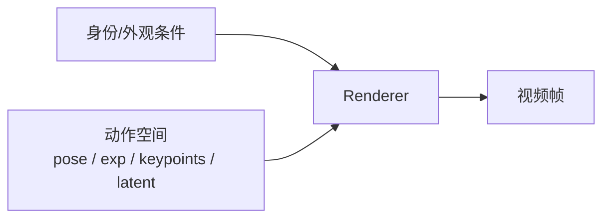
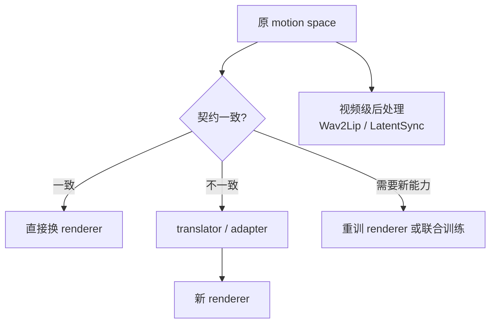

> 前置阅读：[[knowledge/数字人基础|数字人基础]]、[[knowledge/动作空间专题|动作空间专题]]。本文讨论“动作已经生成后，谁负责把它画成视频”。项目全景见 [[project:digital-human]]。

## 一、为什么动作空间模型一定需要 renderer

动作空间模型通常不直接生成 RGB 帧，而是先生成一个低维 motion：头姿、表情、关键点、motion latent 或 blendshape。motion 本身不是视频，必须交给 renderer 才能变成用户看到的画面。

这也是动作空间路线能兼顾速度和效果的原因：生成模型只负责“怎么动”，renderer 负责“把这个人画出来”。但代价也在这里：如果 renderer 画不清、身份不稳、响应 motion 不准，再好的 motion generator 也救不了最终视频。

## 二、我们接触过的 renderer / 后端光谱

| Renderer / 后端 | 输入契约 | 输出 | 典型用途 | 替换难度 |
|---|---|---|---|---|
| Ditto / LivePortrait renderer | reference appearance、canonical keypoints、pose/exp/translation | talking-head 帧 | one-shot 音频驱动头像 | 高：与 LivePortrait motion 表示强绑定 |
| LIA-X renderer | source identity/features + 40D motion code | 512² 人脸帧 | T2AV motion 解码、人像动画 | 高：与 LIA-X motion dictionary / flow-warp 绑定 |
| FLOAT / Avatar Forcing decoder | 512D appearance `s` + 512D motion接口 `r=Bα` | avatar 帧 | Motion AE / 交互头像 | 高：与 20D `α` 和 Direction 基绑定 |
| FLAME / 3DMM renderer | mesh、表情/头姿系数、相机/光照 | 3D或图像输出 | 可解释控制、3D资产驱动 | 中：接口显式，但画质依赖资产/后端 |
| NeRF / 3DGS avatar | 专人可渲染资产 + motion/pose | 写实渲染帧 | 专人高质量数字人 | 高：需要专人训练资产 |
| ARKit / blendshape / game engine | 标准 blendshape、rig、材质资产 | 实时 avatar | 工业实时角色 | 中：接口标准，但写实度靠资产 |
| Wav2Lip / LatentSync | 视频帧 + 音频/同步条件 | 口型替换或视频级修正 | 局部嘴形修复、闭嘴化 | 低到中：更像后处理，不替换完整 renderer |

## 三、几个 renderer 的关键区别

### 3.1 Ditto / LivePortrait renderer

Ditto 使用 LivePortrait 风格 motion extractor 和 renderer。其优势是 one-shot：一张参考图就能提供外观条件，再由音频生成 motion。它适合快速接入和实时 talking-head，但 motion、stitching、warp、decoder 是一套契约，不能直接把 Ditto motion 喂给 LIA-X 或 AF decoder。

视频源模式下，逐帧 `f_s[t]`、`x_s[t]`、`kp_s[t]` 会带来源视频自己的嘴动，因此我们才有 [[knowledge/Ditto 改动实践|Ditto 改动实践]] 中的泄露问题和闭嘴化源方案。

### 3.2 LIA-X flow-warp renderer

LIA-X 输入源肖像的身份/多尺度外观特征和 40D motion code，经 motion dictionary、ToFlow、warp、StyleGAN2 风格调制卷积生成帧。它不是完整 StyleGAN2，而是采用 StyleGAN2 风格积木的 flow-warp renderer。

在 [[knowledge/Talker-T2AV 模型精读|Talker-T2AV 模型精读]] 中，LIA-X 是 40D motion → 视频帧的解码侧。当前 A10 profile 下，512²、bf16、batch=1 的 LIA-X decoder 约 333ms/帧，说明渲染器本身可能成为 T2AV 速度瓶颈。

### 3.3 FLOAT / Avatar Forcing decoder

Avatar Forcing 的 Motion AE 继承 MegaPortraits/FLOAT reenactment 思路：`s` 是 512D appearance code，`α` 是 20D motion feature，`r=Bα` 是 512D renderer/Flow 接口。这个 renderer 的优点是身份/动作加法结构清楚，适合交互式头像；代价是 motion 表示与 decoder 强绑定。

细节见 [[knowledge/Avatar Forcing Motion Latent AutoEncoder|Avatar Forcing Motion Latent AutoEncoder]]。

### 3.4 FLAME / 3DMM 与 3DGS / NeRF

FLAME/3DMM 给出显式表情、头姿和 mesh 参数，可解释性强，适合接入 3D 资产或渲染管线。3DGS/NeRF 则更像“专人可渲染资产”：训练一个人的 3D 表示后，再由 motion 驱动它。

3DGS 的吸引力在于渲染快、身份稳定、写实度高；问题是需要专人训练资产，不是拿一张图就能即插即用。它更适合固定主播、固定 IP 或高价值角色，而不是临时 one-shot 场景。

### 3.5 Wav2Lip / LatentSync：视频级修正，不是完整 renderer

Wav2Lip 和 LatentSync 主要在视频层修改嘴部或同步关系。它们可以作为后处理、预处理或闭嘴化工具，但不应被当作完整 avatar renderer。

当前 Ditto 视频源闭嘴化中，LatentSync 是有证据的方案：先把源视频嘴动中性化，再让 Ditto 按目标音频生成嘴形。它解决的是源嘴动泄露，不是替代 Ditto renderer 的全部功能。详见 [[knowledge/音画同步专题|音画同步专题]]。

## 四、怎么评价 renderer 好坏

| 维度 | 要问的问题 | 常见证据 |
|---|---|---|
| 速度 | 单帧要多久，能否 batch/compile/TRT | ms/帧、RTF、显存 |
| 画质 | 是否清晰，嘴唇/牙齿/眼睛是否自然 | NR-IQA、人工观察、局部截图 |
| 身份保持 | 输出还是不是同一个人 | CSIM、人工身份判断 |
| 动作响应 | 输入 motion 是否被正确画出来 | 控制变量、局部动作对比 |
| 时序稳定 | 是否闪烁、抖动、纹理漂移 | Dino-S、flow_smoothness、视频目检 |
| 可控性 | 能否单独控制嘴、眼、头、情绪 | 区域mask、blendshape、显式参数 |
| 训练/资产成本 | 是否需要专人训练或大量数据 | 训练时间、数据量、权重大小 |

renderer 的好坏取决于任务。直播头像更看重实时和稳定；离线宣传片更看重画质；工业 avatar 更看重可控和标准接口；专人 3DGS 更看重身份和写实资产。

## 五、能不能通过替换 renderer 让效果更好

可以，但通常不是插拔式替换。

几种情况：

1. **直接兼容**：motion 表示和 renderer 输入一致，少见。
2. **translator / adapter**：把 Ditto motion 转为 LIA-X 或 FLAME 所需表示。风险是误差累积和语义丢失。
3. **重训 renderer**：保留 motion generator，重新训练一个吃该 motion 的 renderer。成本高，但最干净。
4. **视频级后处理**：不改 renderer，只在输出或输入视频层修嘴、闭嘴或补同步。速度和时序需单独验证。

所以“替换 renderer”能不能提升效果，取决于能否保持 motion 契约、身份外观和训练数据一致。只换代码文件通常不够。

## 六、未来方向与证据状态

| 方向 | 可能收益 | 当前证据状态 |
|---|---|---|
| 3DGS 专人资产 | 身份稳定、写实、渲染快 | 方向清晰，但需专人训练资产；不适合所有 one-shot 场景 |
| 轻量 LIA-X decoder 蒸馏 | 降低 333ms/帧渲染地板，目标 5–10× | 设计候选，未实现；5–10×不是结果 |
| LatentSync 类视频修正 | 修口型、闭嘴化、同步后处理 | 本地已有闭嘴源证据；不是完整 renderer 替换 |
| 标准 blendshape / 游戏引擎 | 工业实时、可控、稳定 | 资产质量决定上限；写实度取决于美术和rig |

## 面试追问预案

**Q：为什么动作空间模型不能只比较 motion generator？**

因为用户看到的是 renderer 输出的视频。motion generator 只决定动作指令，renderer 决定画面质量、身份、纹理、闪烁和速度。一个 motion 预测得对，如果 renderer 画糊或抖，最终体验仍然差。

**Q：Ditto 的 motion 能不能直接换成 LIA-X renderer？**

不能直接换。Ditto 的 motion 是 LivePortrait 风格的 scale/pose/translation/expression；LIA-X 吃的是自己的 40D motion code 和源特征契约。要换，需要训练 translator，或重训一个吃 Ditto motion 的 renderer。

**Q：最新最好的 renderer 是不是 3DGS？**

3DGS 在专人资产场景很有潜力：渲染快、身份稳定、写实度高。但它需要专人训练资产，不是 one-shot。若业务是固定主播或固定 IP，3DGS 很值得；若业务要求任意单图快速上线，LivePortrait/Ditto 类 one-shot renderer 更实际。

**Q：轻量 LIA-X decoder 为什么不能直接说会更好？**

轻量学生的目标是更快，不是天然更好。它必须通过蒸馏逼近 LIA-X teacher，否则容易丢嘴唇细节、牙齿、身份和时序稳定。5–10× 是目标，需要真实保留集和端到端 RTF 验证后才能写成结果。