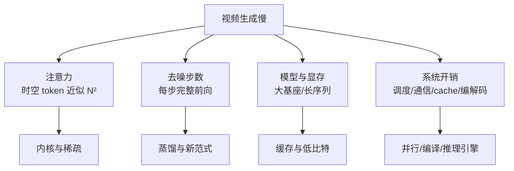
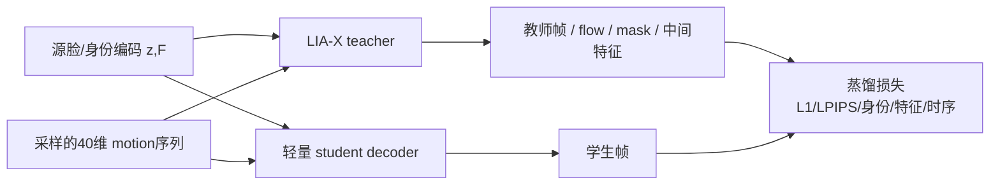

> 本文分两层：第一层是博客《视频生成推理加速》草稿整理的跨论文方法图谱；第二层是当前本地副本能否实际改训练/推理的源码可用性矩阵。两层的模型、硬件、质量口径不同，**不能拼成统一速度排行榜**。本地 Ditto 生产加速见 [[knowledge/Ditto 实时化与 TensorRT 加速复盘|Ditto 实时化与 TensorRT 加速复盘]]，项目全景见 [[project:digital-human]]。

## 一、为什么视频生成慢

视频生成的成本通常由四件事叠加：



因此“加速”至少有四种不同目标：把每一步算得更快、把需要的步数变少、避免长视频重复计算、把多模块串成高效系统。一个方法的倍数只有在相同模型、硬件、分辨率、步数和质量约束下才有可比性。

## 二、论文方法地图

### 2.1 注意力/内核：降低单步成本

| 方法 | 核心做法 | 训练要求 | 报告口径与证据等级 |
|---|---|---|---|
| FPSAttention | FP8 + 3D tile 稀疏注意力 + QAT 协同 | 需要量化感知微调 | Wan2.1-14B、720p、H20：kernel 7.09×、E2E 4.96×；VBench 未降。**论文已验证**，但依赖 Hopper FP8，未跨模型长视频验证 |
| BLADE | 块稀疏注意力 + data-free 步数蒸馏联合训练 | 需要蒸馏 | Wan2.1-1.3B：14.10×；CogVideoX-5B：8.89×。**论文已验证**，中等长度序列为主 |
| WorldAttention | HSA 混合稀疏注意力 + 分层 KV cache | 三阶段训练 | 单 H100：kernel 14.02×、E2E 2.21×、22fps。**代码/README证据**；论文公开与完整 kernel 状态需谨慎 |

共同点：这些方法不是“换一个更快的 attention 函数”那么简单。FPSAttention/BLADE 都把加速约束放回训练阶段；WorldAttention 同时处理长上下文 cache。单独套 FP8 或稀疏，质量可能反而下降。

### 2.2 长视频缓存：避免重复记忆和重复编码

| 方法 | 核心做法 | 报告口径 | 证据边界 |
|---|---|---|---|
| Latent Spatial Memory / Mirage | 直接把 3D 记忆存为 diffusion latent，避免每步 render→encode 往返 | Wan2.2-TI2V-5B、单H100：E2E 10.57×、3D cache显存55×下降 | **论文已验证**；任务是相机轨迹 world model，不是通用 talking head |
| WorldAttention HKV | chunk/page 检索、GPU/CPU/NVMe 分层 KV | 与 HSA 共同构成 2.21× E2E | **工程/论文路线**；短上下文中 cache 可能没有收益 |

这类方法的重点不是“某一步快一点”，而是长视频时不再为历史重复付费。它们适合长时世界模型、跨 chunk 一致性；对短 talking-head 片段未必划算。

### 2.3 自回归并行：减少串行生成步数

| 方法 | 核心做法 | 训练要求 | 报告口径与证据边界 |
|---|---|---|---|
| ZipAR | 利用空间局部性，让图像行间并行解码 | 零训练 | LlamaGen-XL-512、A100：33.17s→5.86s，延迟-82.3%；CLIP略变。**论文已验证**；主要是图像AR，迁到视频需定义时间维窗口 |
| NAR | 改训练目标为 next-neighbor，按邻域同时生成 | 从头训练 | UCF-101：44.0s→1.09s；吞吐13.8×等。**论文已验证**；不能直接套现成 NTP 权重 |
| FlashAR | 保留水平头、新增垂直头，后训练实现对角线并行 | 后训练 | Emu3.5-Image 34B、H20：130.10s→5.68s，22.9×；质量口径为 GenEval。**论文已验证**，部分报告人补充数字待核 |

ZipAR 是推理调度改造，NAR 改的是训练范式，FlashAR 在两者之间：保留预训练先验，用少量后训练增加并行头。它们和扩散式 Ditto/AF 不是即插即用关系，价值在于“若自训 AR 视觉模型，如何从训练目标消除串行瓶颈”。

### 2.4 端到端系统：把局部技术组合起来

| 方法 | 核心做法 | 训练要求 | 报告口径与证据边界 |
|---|---|---|---|
| DAX | 序列并行、SageAttention、compile、INT8线性层、TeaCache | 零训练 | Wan2.1-T2V-14B、720p、5s、8×H20：6836s→188s，36.4× | **仓库benchmark**；8卡结果，不能当单卡速度 |
| TurboDiffusion | rCM蒸馏 + SageSLA + W8A8 + 算子融合 | 需要训练 | Wan2.1-14B、720p、RTX5090：4767s→24s，199× | **论文已验证**；主要质量证据是视觉对比，缺VBench/FVD量化 |
| Inferix | block-diffusion推理引擎、KV管理、并行、流式输出 | 需 block-diffusion 模型 | 未公开加速数值 | **引擎能力/待自测**；不是标准全序列DiT的直接加速器 |

DAX、TurboDiffusion、Inferix 可以看成互补拼图：DAX 优化算子和系统，TurboDiffusion 用训练把步数压低，Inferix 服务 block-diffusion 的跨块状态和流式输出。它们并不能仅靠叠名字就直接让数字人实时，仍要看模型范式、chunk 延迟、质量和部署硬件。

## 三、训练费与即插即用的光谱

```text
零训练
  ZipAR / DAX
      ↓
后训练
  FlashAR
      ↓
蒸馏或QAT
  BLADE / FPSAttention / TurboDiffusion
      ↓
从头训练
  NAR
```

训练代价越高，通常能改变的上限越大；但“论文训练可行”不代表本地模型就有训练代码或数据链可复现。选择前要先问：我们拥有的是完整训练链、部分微调入口，还是只有推理权重？

## 四、本地训练源码可用性矩阵

下面按**当前本地副本**判断，不代表上游世界范围是否开源。

| 模型 | 本地训练状态 | 可做的训练/加速改动 | 当前边界 |
|---|---|---|---|
| Avatar Forcing | **部分可训练** | Flow LoRA、audio projection bridge蒸馏、alignment net训练 | 没有完整原始基座训练链 |
| UniLS | **部分可训练** | trainer/LoRA类、Accelerate多卡、EMA等 | 缺本地启动器、数据构建与完整配方 |
| LIA-X | **部分** | 编码器/解码器/CUDA算子可研究 | 本地缺完整训练入口，权重外取 |
| Ditto | **仅推理** | ONNX/TRT/CUDA Graph、发布与缓存优化 | 训练需另取上游 train 分支 |
| Talker-T2AV | **仅推理** | 渲染批量、缓存、FlashAttention、部署优化 | README提到training，但本地副本无对应训练目录 |
| LiveAct | **仅推理** | 量化、offload、compile、推理调度 | 未公开原训练代码，训练加速不可在本地直接做 |
| MoDA | **仅推理** | 推理batch、NVENC、贴回参数 | 本地未含训练入口 |
| LivePortrait | **仅推理** | FP16、compile、推理批量 | 本地无 trainer |
| Wav2Lip | **仅推理** | 人脸检测/生成batch | README提到的训练脚本本地缺失 |
| LatentSync | **不确定** | 当前仅见冻结StableSyncNet相关引用 | 需补源码、权重与许可证后再谈训练 |
| ExOmni-2D | **不确定** | 本地未检出明确改动面 | 先登记来源/版本与复跑环境 |

因此“训练加速”在当前可操作范围里主要是 Avatar Forcing 的定向微调、UniLS 的训练器补全，或未来补齐 LIA-X 训练链；Ditto/T2AV/LiveAct 等当前更适合讨论推理与系统加速。

## 五、本地候选：LIA-X decoder 蒸馏

Talker-T2AV 的视频侧依赖 LIA-X：40维 motion latent 经 LIA-X renderer 变成 512² 人脸帧。当前 A10 profile 中，LIA-X decoder 在 512²、bf16、batch=1 下约 **333ms/帧**。它慢的根源不是“某个 Python 循环”，而是 renderer 本身很重：flow/mask、grid_sample warp、多尺度特征和大量 StyleGAN2 风格 modulated convolution 逐帧执行。

这里的 LIA-X 不是完整 StyleGAN2；它借用了 StyleGAN2 家族的调制卷积、ToRGB、upfirdn2d、fused activation 等积木，但核心仍是 motion-conditioned 的 flow-warp renderer。

一个可能的训练侧加速路线是 **decoder 蒸馏**：



候选学生可以是 EfficientNet-ish UNet，也可以是小型 decoder-only DiT。它们属于**条件图像/视频 renderer**：输入身份特征与 motion，输出人脸帧。它们不会天然比 LIA-X 质量更好；目标是用更少 FLOPs 和显存逼近 teacher 输出。

“data-free”在这里也要谨慎理解。它不是凭空造数据，而是不依赖原始真实视频标注：可用教师 encoder 或人像生成器构造合法的身份特征，采样截断、稀疏、时间平滑的 40维 motion，再让 LIA-X teacher 生成监督帧。学生训练至少需要像素 L1/Charbonnier、LPIPS、身份损失、teacher flow/mask 或中间特征蒸馏、时序一致性等约束。

| 项 | 当前状态 |
|---|---|
| 333ms/帧 | 内部 A10 profile，512²/bf16/batch=1，已记录 |
| 轻量 decoder | 设计候选，未实现 |
| 5–10× | 目标预期，**未验证结果** |
| 质量风险 | 可能更糊、身份掉、嘴唇/牙齿边界差、时序闪烁 |
| 验证要求 | 真实保留集 ID、姿态/表情、LSE、闪烁、端到端 RTF |

这条路线值得研究，是因为它瞄准的是 T2AV 视频侧最大成本之一；但在完成学生模型、蒸馏训练和真实集验证前，不能写成已经加速成功。

## 六、与本地实践的关系

本地 Ditto 实时化并不是直接搬上表的论文方法，而是针对具体生产链做 Decoder TRT、Warp/LMDM 实验、GPU直传、stream overlap、发布节奏与资源治理；详见 [[knowledge/Ditto 实时化与 TensorRT 加速复盘|Ditto 实时化与 TensorRT 加速复盘]]。

CyberVerse 的 Avatar Forcing GPU frame pipeline 则是另一类工程案例：贴回 p95 **67.3→12.7ms**、RTF **0.698→0.588**、TTFF **1.39→1.18s**，并通过像素 max diff=0 与端到端无卡顿验证。它说明“帧数据留在 GPU”这类系统优化能产生真实用户侧收益，但结论只覆盖该 pipeline 和该测试口径。

## 面试追问预案

**Q：视频生成加速是不是只要减少去噪步数？**

不是。步数只是一个维度。长视频可能被 KV/cache 撑爆，AR模型可能被串行 token 卡住，注意力可能占单步70%以上，系统又可能被通信和Python调度拖慢。正确做法是先定位主要成本，再选择蒸馏、稀疏、缓存、并行或系统组合。

**Q：为什么不直接把 TurboDiffusion 的199×拿来说明本地数字人也能199×？**

它是 Wan2.1-14B、RTX5090、5秒720p、3–4步、特定训练和系统组合下的结果；其中原始基线还包含CPU offload。本地Ditto、AF的模型、硬件、输入、质量口径和实时目标不同。这个数字说明“模型-系统协同有巨大上限”，不构成本地性能承诺。

**Q：本地没有完整训练源码，为什么还要研究训练加速？**

研究可以帮助判断路线是否值得补齐源码或换基座。更重要的是先标清边界：若只有推理代码，就不应承诺能做蒸馏/QAT/从头训练；若有局部训练入口，就把目标缩到LoRA、桥或对齐网。训练源码矩阵的价值是防止“论文里能训”被误写成“本地现在就能训”。