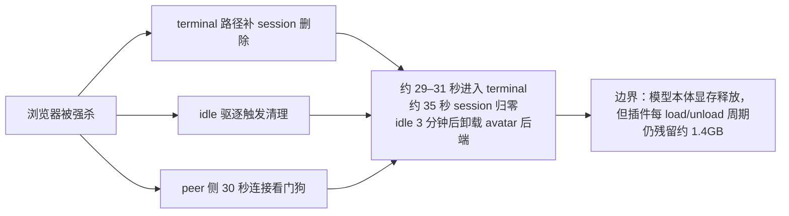
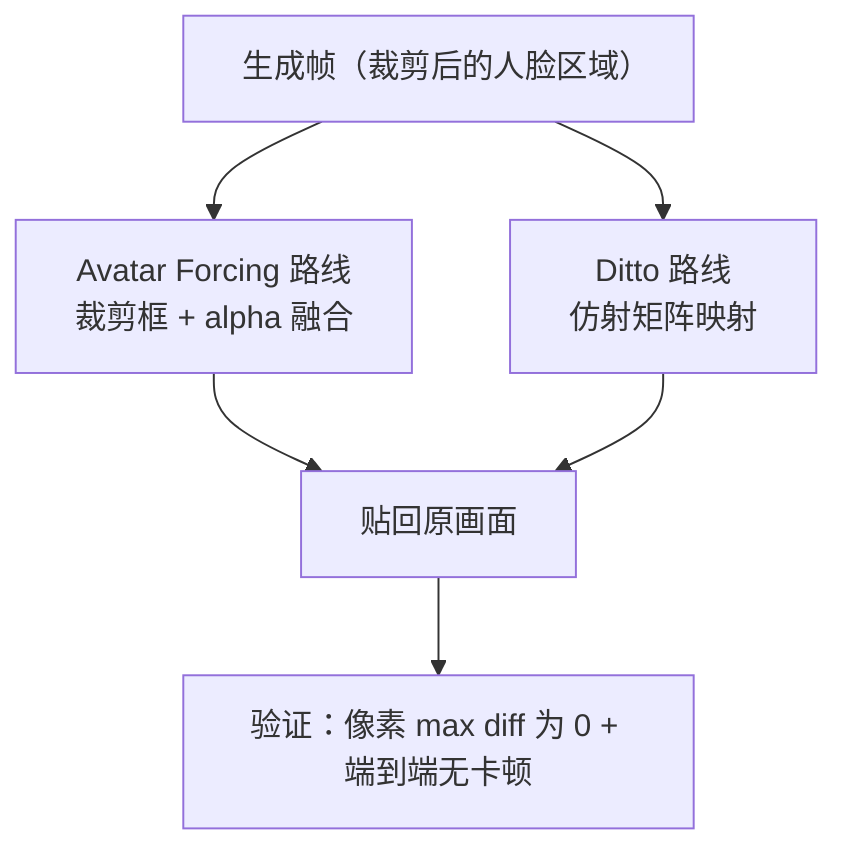

# 工程改进

## 为什么重要

实时数字人的可用性有两条天花板，**都不是模型问题**：

- **性能**：GPU 预算与发布节奏。模型能算出画面，但发不出去、发得不稳，产品就是不可用的
- **稳定性**：会话与资源的生命周期。异常退出、内存不归还、资源不释放，会把长时运行拖垮

这一篇记录我们在这两条线上做了什么。它有一条贯穿始终的纪律：

> **局部阶段变快，不等于用户侧变快。** 每次优化都要同时看阶段耗时、GPU 利用率、浏览器帧率、stall 与首帧（TTFF），不能只报一个 p95 就跑。

边界：这里只写我们改的部分与结论；系统架构与三条链路见 [[实习复盘/CyberVerse框架|CyberVerse框架]]，模型与动作/身份侧见 [[实习复盘/数字人动作|数字人动作]] 与 [[实习复盘/数字人身份|数字人身份]]。

## 实时链路的瓶颈在哪

排查从"画面发布给浏览器"这条链路开始。浏览器端以约 25 fps 消费；隔离基准下，GPU 侧的四个阶段合计约 **38.5ms/帧**，而 25 fps 的预算只有 **40ms**——**已经占掉 96%**。

| 阶段（隔离口径） | 典型耗时 | 说明 |
|------------------|----------|------|
| decode | 17.7ms/帧 | fp16 engine |
| warp | 14.9ms/帧 | PyTorch autocast |
| LMDM | 3.9ms/0.4s block | 不是主要瓶颈 |
| stitch | 约 1ms | 不是主要瓶颈 |
| **GPU 合计** | **约 38.5ms/帧** | 占 25 fps 的 40ms 预算约 96% |

这个基线改变了排查方向：**不能把每次变慢都归到某个模型"算得慢"**——余量只有几毫秒，生产环境里很多抖动其实是 GPU 排队。

## 音频缺口修复

### 症状与定位

浏览器端出现周期性音频缺口，听感是"呲呲"声。发布侧 trace 显示 `SendAVSegment` 阶段存在 **203–214ms** 的背压，而每段时长正好是 **200ms**：只要持续稍慢，浏览器的 jitter buffer 就会被耗尽，丢包隐藏算法开始用 concealment 遮掩缺失音频。

继续往下看编码器：persistent H.264 流的解析器会**持留段尾帧**，而旧逻辑在 `shortfall<=2` 时固定等待 200ms grace。真实 NVENC 编码只要约 15ms，但加上这段等待就变成约 **215ms**——刚好超过一段的预算。

### 两步修复

**第一步**：把 `shortfall==1` 视为解析器的确定性持留，立即返回，并用 deficit 在下一段记账偿还；只有 `shortfall==2` 保留 grace 作为兜底。

**第二步**：把发布从"每段相对锚定"改成**绝对播放锚点**——截止时间 = 播放锚点 + 已发布内容的累计时长。这样单段超时不会逐段累加。

| 指标 | 修复前 | 修复后 |
|------|--------|--------|
| 说话期 cadence | 1.056–1.070 | 1.018–1.020（稳态 **1.000**） |
| send 段平均耗时 | 203–214ms | 194–204ms |
| **concealment** | **2.5–3.6%** | **0.022%** |
| 浏览器 fps | 23.5 / min 22.6 | 24.5 / min 24.4 |

### 方法层面的收获

**症状在浏览器，根因在发布端。** 只看网络或只看模型推理都找不到那段固定等待；把发布时长、cadence 与 concealment 放到同一条时间线上之后，才定位到"解析器持留段尾帧 + grace 等待"的组合。跨端问题的第一步不是猜模块，而是建立能串起来的观测。

## 僵尸会话治理

浏览器被强杀后，原先的 terminal 路径可能不删除 session，会话长期不退出。修复采用**三层兜底**：terminal 路径补删除、idle 驱逐触发清理、peer 侧 30 秒连接看门狗。

**边界必须写清**：模型本体的显存会释放，但排查同时发现 **AvatarForcing 插件每个 load/unload 周期仍残留约 1.4GB 活跃分配**——这是独立的插件泄漏问题，与会话回收是两件事。所以结论**不能写成"GPU 归零"**。

## Ditto 实时化

### 生产基线

在生产链里生效的部分：

- **生成侧上限**：motion space + 分段流式推理 + 10 步去噪——不在像素空间逐帧扩散，把计算量定在可控范围
- **Decoder FP16 TensorRT**：隔离基准 **73.5 → 17.7ms/帧**，约 **4.2×**；配套独立 CUDA stream、张量地址复用与 buffer 复用
- **Warp → Decoder GPU 直传 + CUDA Event**：避免 GPU→CPU→GPU 往返；保留双流流水关系
- **LMDM 常量条件一次绑定**：避免 10 步去噪中反复上传，讲话阶段约 **49 → 39ms**

### 验证过但未默认采纳

| 项 | 隔离收益 | 端到端结果 |
|----|---------|-----------|
| Warp TensorRT | warp 14.9 → **11.8ms/帧** | warp p50 30→25ms，但 **stitch 2→9ms** 抵消，浏览器 fps 无明显变化 |
| LMDM FP16 | LMDM 8.35 → **3.27ms**（DDIM 相关基准 862→416ms） | 生产 RTF 0.916→0.870，**浏览器 fps 23.8→23.9** |

结论不是"这些优化无效"，而是**在该生产链与硬件下它们没有形成额外的用户侧收益**：总 GPU 预算仍主要被 warp 与 decoder 占用。

### 生产实时不是 TRT 单点胜利

各项优化的**测量对象不同**——模块耗时、RTF、发布 cadence、浏览器体验，**不能相加成"总加速 N 倍"**。而且 GPU 长期 90%+ 利用时，两个 kernel 会争同一批 SM，继续调 stream 优先级或扩大 overlap 不会自动提高端到端帧率。

## 编码与传输链路

**编码耗时的拆解**（720p、25 帧/段、A10）：总计约 **679ms** = ffmpeg 进程 + CUDA/NVENC 初始化 **约 400ms** + swscale BT.709 转换 **90ms** + NVENC 编码 **40ms** + 约 69MB 管道写入。也就是说，**大部分时间花在"起进程"和"搬数据"，不是编码本身**。

对应的改法：

- **编码器常驻**：每几何一个长生命编码进程，消除每段约 450ms 的 fork + 初始化固定开销；打断时强制重生以保证关键帧
- **H.264 换 NVENC 硬编**：软件 VP8 的编码耗时逼近实时预算且同码率画质更低
- **YUV420 传输**：1080p 单帧载荷 **6.2MB → 3.1MB**，同时去掉 ffmpeg 每帧的 CPU 色彩转换
- **preset 随分辨率自适应**：按帧像素量分档（大分辨率退到更快的档位），把大分辨率下的编码耗时压回百毫秒级

**这里的纪律还是那条**：warp fp16 在隔离口径下快了约 21%，但生产端 stitch 开销抵消、浏览器 fps 没有变化，因此没有采纳。**局部阶段变快 ≠ 用户侧变快。**

## PasteBack 贴回

生成出来的是裁剪后的人脸区域，要贴回原画面。直接贴会出现接缝与亮度波动，所以我们有两条贴回路径：

指标（Avatar Forcing 的 GPU 帧管线）：贴回 p95 **67.3 → 12.7ms**、RTF **0.698 → 0.588**、TTFF **1.39 → 1.18s**，并以**像素 max diff 为 0** 与端到端无卡顿作为验证。这是"把帧数据留在 GPU"这类系统优化的典型案例——收益是**真实用户侧**的，但结论只覆盖该管线与测试口径。

另一个值得记的发现：贴回此前**按源片全画幅（约 2.07MP）做两次 warp 加全画幅混合**，与传输分辨率上限无关；改成**只在人脸包围盒内运算**之后，才消除了那部分浪费。

## 实时性改进

这一节按问题类型组织，而不是按任务编号。每条都写"症状 → 定位 → 结论"。

### 首帧与开口

- **全链路首响应 3.5s → 约 2.9s**：每轮首个语音段攒够 400ms 即发（原来等 1s），并把预缓冲阈值从 800ms 降到 400ms
- **消除开口前的冻帧**：待机转说话时，在途待机段被整批丢弃、而首段还要准备约 1s，中间就是纯冻帧；改成爬坡段长 + 起播缓冲配合
- **TTFF 与待机存粮**：首帧延迟 ≈ 排空模型内待机存粮（≤1.12s）+ 首块推理约 0.3s，所以压缩方向是限制待机存粮深度
- **段聚合粒度 1000/400ms → 200ms**：常驻编码器上线后，细粒度不再有额外成本

### 打断与收声

正确行为是：打断后尾音在 1.5s 内自然收住 → 转成闭嘴聆听画面 → 新话开始，全程无冻帧。定位到两个成因：语音绕过门控导致模型内积压，以及 epoch 硬切冻在末帧。修复拆成四组独立改动（门控时长、软切护栏、放行预缓冲段、缓冲调参）。

**还有一个明确的失败**：让"打断立即止声"（丢弃对端已排队的旧回复语音）试了**四个版本，全部被推翻**——分别出现画面冻结、长度难调、尾音被一起丢弃等问题，人工核验不通过，最终宣告结束。这条负结论的价值在于：**打断链路的正确性判据是人眼与听感，不是指标**。

### 待机与静默

- **待机呼吸音**：倾听态喂给模型的静音 PCM 每 100ms 重新从 t=0 生成，导致呼吸包络永远走不完、每块字节完全相同；250ms 淡入又覆盖整个 1600 样本块，形成 10Hz 锯齿包络（块内标准差 **0.00118**，而一次性生成同样时长是 **0.0133**，差约 11 倍）
- **非打断说话时的单帧雪花**：通过仪表取证与单变量 A/B 缩小范围，嫌疑集中在码率漂移触发编码进程静默重生、以及预缓冲空窗扰动连续码流
- **问候后无响应**：会话日志显示只有问候开始、没有后续轮次；上层实时语音服务出现断连，恢复流程未被执行

### 画质与流畅

- **头部放大漂移**：流式下不到 1 分钟就出现头部逐渐放大，而同模型在另一条链路上没有此问题。根因是**逐 0.4s 块独立做音频归一化**：静默期的呼吸底噪（RMS≈0.02）被放大到单位方差，模型持续被大能量噪声驱动。改为**带下限的归一化**后消除
- **周期性卡顿**：窗口式后端的边界会留下约 **0.42s** 的出帧空洞，用约 500ms 的语音视频预缓冲吸收
- **输出比源视频糊**：三个原因叠加——输出高度上限被强降、编码走最快的档位、码率下限偏低；对应调整档位与码率，并配合 YUV420 与 preset 分档

### 会话与内存

推理进程的 RSS 从 **9.8GB 涨到 20.5GB 且会话结束后不回落**，逼近 OOM 阈值（曾有一次进程在 **28.8GB** 被 OOM 杀掉）。关键证据是**基准路径连跑 5 轮 RSS 恒定在 6.6GB 无增长**——这说明泄漏不在推理路径，而在浏览器会话路径（长时运行 + 多轮说话），排查范围由此收窄。

### 限流阀重构（进行中）

喂料限流这条线经历了一长串重构，且**多数仍在进行中**，这里只记当前认知：

- **自锁问题**：限流阀等待的量，只能靠被它拦住的东西推动——阀门等"视频抵达"才降低放行量，而模型要有新音频才出视频，于是互相等，表现为每 2 秒一次卡顿
- 后续尝试把判据换成**播放端存货**、引入**两级水位**（待机 / 说话）、说话开始与打断走 **FLUSH**，并统一为 **work-ahead 单一上限**
- 还发现一处记账缺陷：lead 记账会变负，使喂料阀在说话时失去调节能力

## 未采纳方案与原因

| 尝试 | 为什么不采纳 |
|------|--------------|
| 只把 `ditto.fps` 从 25 改成 20 | 在线因果窗口与"音频到动作"时序以 25 fps 为前提，纯配置降帧导致帧数与音频对应错位（实测 fps 18.8、min 14.4、stalls 3） |
| 持续深挖 GPU putback / 微优化 | GPU 饱和时没有端到端收益；应先减少 warp + decode 的总工作量 |
| 把插件显存残留当作会话泄漏已解决 | 两者是独立问题；插件每周期约残留 1.4GB，需单独立项 |

**负结论也是结论**：它们划出了"不要在这里继续投入"的边界，也避免后来的人重复踩。

## 可能的改进方向

- **限流阀重构收尾**：两级水位与 FLUSH 这套重构还在跑对照实验，目标是让常态 RTF 平稳、尾部尖峰消失
- **降低生成侧地板**：把仍是 PyTorch 权重的 warp 网络换成 fp16 推理引擎，是目前唯一能降低生成本身耗时的项
- **同机帧传输去拷贝**：大分辨率下帧流经序列化传输是结构性瓶颈，共享内存环形缓冲是候选方案（保留原有链路作为回退）
- **TTFF 与雪花帧**：两条都在等部署后的对照数据，判据已用仪表埋好
- **插件显存泄漏**：需要单独立项，与业务会话生命周期解耦处理
- **画质档位**：在高分辨率下 RTF 会越过 1.0（生成侧来不及），所以画质提升必须与预算一起谈，不能只谈分辨率

## 汇报要点

- **瓶颈基线**：GPU 侧约 **38.5ms/帧** vs 25 fps 的 **40ms** 预算（占 96%）——余量只有几毫秒，很多"变慢"其实是排队
- **音频缺口**：发布端固定等待 215ms 超过 200ms 段预算 → 修复后 concealment **3.6% → 0.022%**，fps 23.5 → 24.5，稳态 cadence 1.000
- **僵尸会话**：kill 后约 35 秒会话归零、3 分钟卸载后端；**但插件每周期仍残留约 1.4GB**，不能写成 GPU 归零
- **性能优化的取舍**：Decoder FP16 TRT 是明确收益（4.2×）；Warp TRT 与 LMDM FP16 隔离变快但端到端无感，故未默认采纳
- **PasteBack**：贴回 p95 67.3 → 12.7ms、RTF 0.698 → 0.588、TTFF 1.39 → 1.18s，像素 max diff = 0
- **实时性改进**：首响应 3.5s → 2.9s；待机呼吸音、头部放大漂移、周期性卡顿均已定位并修复；打断止声试了 4 版全部推翻（失败结论保留）
- **三条明确不采纳**：降帧到 20fps、深挖 GPU putback、把插件泄漏当会话问题解决
