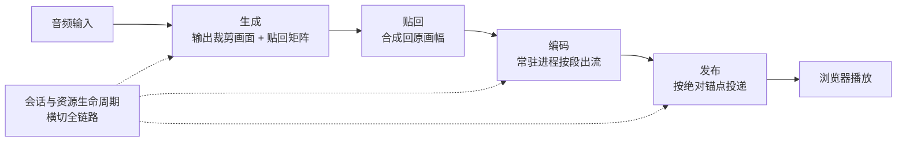
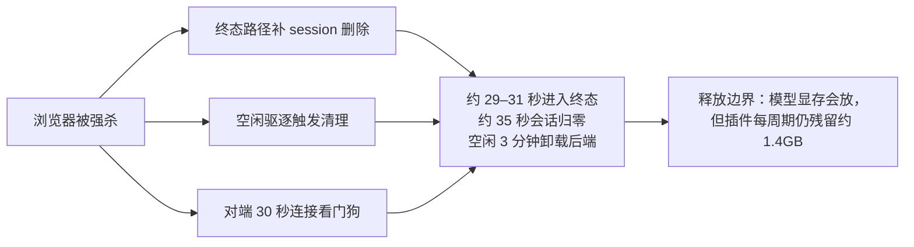

# 工程设计

## 为什么重要

**模型只是链路的一环。** 数据怎么流、资源怎么管、异常怎么接，决定这套系统能不能长时间稳定跑起来——这也是工程设计与"调模型"最大的区别：前者是结构问题，后者是单点问题。

本篇的设计原则可以压成一句话：**以"段"为单位组织流水线**。

- 每段有**预算**（时间是固定的），有**明确接口**（谁给谁什么），有**可回退的档位**（出问题时往哪退）
- 稳定来自**每段职责清晰**，而不是某一段特别快
- 段化换来可缓冲、可打断、可切换输入；代价是引入了**段边界**——后面几节的多数设计问题都源自段边界

边界：本篇讲"怎么设计的"；速度与吞吐见 [[实习复盘/数字人加速|数字人加速]]，架构与实时性通论见 [[实习复盘/CyberVerse框架|CyberVerse框架]]。

## 整体链路设计

一次会话的数据流：

每段的职责与接口：

| 段 | 职责 | 对外接口 |
|----|------|---------|
| **生成侧** | 按音频产出裁剪后的画面 | 裁剪帧 + 贴回所需的变换矩阵 |
| **贴回** | 把裁剪画面合成回原画幅，保证接缝与亮度可控 | 原画幅帧 |
| **编码** | 常驻编码进程、按几何复用、段为单位出流 | 已编码的媒体段 |
| **发布** | 按**绝对播放锚点**投递，浏览器以固定帧率消费 | 音视频流 |

设计取舍很直接：**段化是为了可缓冲、可打断**，但段边界本身会带来问题（发布节奏的误差累积、打断时的尾音处理、预缓冲与冻帧的权衡）。所以后续每一节基本都在回答同一个问题——**这一段边界该怎么设计**。

## 贴回设计

生成出来的是**裁剪后的人脸区域**（512×512），必须贴回原画面。直接贴会同时出现两类问题：**接缝**（边界处突变）与**亮度波动**。

### 链路六阶段

1. **人脸检测与固定裁剪框**：检测器出人脸框 → 按 pad 扩框 → 得到固定裁剪框。关键设计是**推理与贴回共用同一个框**，不逐帧重新检测——否则检测抖动会直接变成画面抖动
2. **关键点检测**：68 点，覆盖下颌、额头、眉毛，并能给出瞳孔轴方向
3. **相似变换构造原图到裁剪的矩阵**：由全脸关键点求 bbox → 中心（含水平/垂直比例偏移）+ 尺寸（正方形 × 比例）+ 旋转角
4. **逆矩阵贴回**：对上面的矩阵取逆，把生成图与 mask 一起 warp 回原尺寸；参考实现侧由注册环节维护该矩阵并按帧取用
5. **羽化 mask 与 alpha 融合**：矩形羽化 mask（中心为 1、边缘线性降到 0），合成式为 `生成 × mask + 原帧 × (1 − mask)`
6. **只算人脸包围盒**：贴回不再按源片全画幅（约 2.07MP）做两次 warp 加全画幅混合

### 三轮演进修出来的设计结论

三轮都不是"修 bug"那么简单，每一轮都改变了一个设计判断：

**第一轮：接缝出现在脸周一小圈。** 根因是区域抑制在五官框边界产生了硬过渡，动态区域被限制在脸中央。修正动作是**移除贴回路径上的抑制**，把运动交回整个裁剪区——**设计结论：抑制应该作用在渲染前的运动流上，而不是让它与贴回边界重合**。

**第二轮：接缝贴近脸，且随关键点抖动。** 根因是当时只用 **5 点**相似变换（双眼、鼻尖、嘴角），只能约束五官，裁剪区内人脸占比过大。修正动作是换成 **68 点**并对齐参考实现的裁剪方式，中心下移 **12.5%** 主动包含肩膀——**设计结论：裁剪框应该由全脸几何决定，而不是由五官决定**。

**第三轮：肩膀与原始帧错位。** 把比例放大到 2.3 后，裁剪框下边界切进了肩膀，而稳定带只覆盖裁剪区下方 30%，两侧稳定程度不一致。修正动作是**把比例回退到 1.9**（与上游一致），性能基本持平（RTF 1.250 → 1.200、帧率 20.0 → 20.9、显存 2633 → 2680 MB）——**设计结论：放大裁剪框必须同步扩大稳定带，单纯放大比例会引入新的边界问题**。

### 参数与验证

暴露成可配置项：裁剪比例（默认 1.9）、垂直比例偏移（-0.125）、mask 比例（0.9）、mask 类型（矩形）。

验证方式是**像素 max diff 为 0**（贴回本身不引入像素差异）+ 端到端人工检查（接缝位置、背景稳定性、肩膀对齐）。

## 传输与发布设计

### 帧格式

从 RGB24 换到 **YUV420**：1080p 单帧载荷 **6.2MB → 3.1MB**，同时去掉每帧的 CPU 色彩转换（编码器直接吃 yuv420p）。设计动机很朴素——**同一帧数据，能少搬一半就少搬一半**。

### 编码进程

- **常驻编码进程**：每个几何一个长生命进程，消除每段约 **450ms** 的进程与 CUDA 初始化固定开销
- **硬编替代软编**：软件编码约 640ms/秒段，逼近实时预算，且同码率画质更低
- **打断时强制重生**：为保证新一段从关键帧开始，打断处主动重启进程
- **缓冲档位可配置**：把平滑与延迟的权衡交给配置，而不是写死

### 段与发布节奏

段长按状态区分（待机 / 说话 / 爬坡 / 预缓冲），并且已经粒度可配。

设计上最关键的一处是**发布锚点**：从"每段相对锚定"改为**绝对播放锚点**——截止时间 = 播放锚点 + 已发布内容的累计时长。这样**单段超时不会逐段累加**。

这一设计是被一个真实故障逼出来的：编码器的字节流解析器需要等下一段起始码才能切出末帧，而这个等待在段长固定时**按构造必然失败**——它固定等 200ms，使真实约 15ms 的编码变成约 **215ms**，刚好超过 200ms 的段预算；发布端一慢，浏览器的抖动缓冲就被耗尽，触发丢包隐藏（听感是"呲呲"声）。

对应两步修正：把"只差一帧"的等待识别为解析器的确定性持留、立即返回并用 deficit 在下段记账偿还；发布改绝对锚点。结果：

| 指标 | 修正前 | 修正后 |
|------|--------|--------|
| 说话期节奏 | 1.056–1.070 | 1.018–1.020（稳态 **1.000**） |
| 丢包隐藏占比 | **2.5–3.6%** | **0.022%** |
| 浏览器帧率 | 23.5 / 最低 22.6 | 24.5 / 最低 24.4 |

**设计结论**：段化的代价是段边界，而**边界上的固定等待必须以"绝对锚点 + 记账偿还"的方式设计**，否则误差会一段一段累积上去。

## 音频链路设计

音频怎么进模型，同样有三处设计判断。

**分段与归一化。** 流式下逐 0.4s 块**独立**做音频归一化，会把静默期的呼吸底噪（RMS≈0.02）放大到单位方差，模型持续被大能量噪声驱动——表现就是**头部逐渐放大的漂移**。改成**带下限的归一化**后消除。设计结论：归一化的作用域与下限，必须按"音频是连续信号"来设计，而不是按"每块独立"。

**采样率与 offset。** 固定采样率与 offset 口径是同步诊断的前提——音频与视频特征窗口的相对偏移必须先对齐，否则会把对齐问题误判成模型问题。

**待机静音流。** 静音 PCM 每 100ms 重新从 t=0 生成，导致两个后果：呼吸包络永远走不完、每块字节完全相同；而 250ms 的淡入又覆盖整个 1600 样本块，形成 10Hz 的锯齿包络（块内标准差 **0.00118**，而一次性生成同样时长是 **0.0133**，差约 11 倍）。设计结论：**静音流应当跨块连续**，逐块重置会把连续性打断成周期性瑕疵。

## 会话与资源生命周期设计

会话与资源是横切链路的一层，设计目标是"**异常退出也能自己收干净**"。

**三层兜底**：终态路径补删除 + 空闲驱逐触发清理 + 对端 30 秒连接看门狗。实测结果是：进程被强杀后约 **29–31 秒**进入终态、约 **35 秒**会话归零、空闲 **3 分钟**后卸载模型后端。

**释放边界必须写清**：模型本体的显存会释放，但插件每个加载/卸载周期仍残留约 **1.4GB** 活跃分配——这是**独立于会话回收的问题**，所以结论**不能写成"显存归零"**。

**进程内存**：推理进程 RSS 从 **9.8GB 涨到 20.5GB** 且会话结束后不回落（曾有一次在 28.8GB 被 OOM 杀掉）。关键证据是**基准路径连跑 5 轮 RSS 恒定在 6.6GB 无增长**——这直接证明了泄漏在浏览器会话路径，而不是推理路径，排查范围由此收窄。

## 稳定性设计

### 打断与收声的状态机

期望行为是：打断 → 尾音在 1.5s 内自然收住 → 转成闭嘴聆听画面 → 新话开始，**全程无冻帧**。定位到两个设计缺陷：语音绕过门控导致模型内积压、以及 epoch 硬切把画面冻在末帧；修法拆成四组独立改动（门控时长、软切护栏、放行预缓冲段、缓冲调参）。

**一条失败结论要保留**：让"打断立即止声"（丢弃已排队的旧回复语音）试了 **4 个版本全部被推翻**——分别出现画面冻结、长度难调、尾音被一起丢弃。它说明这条链路的正确性判据是**人眼与听感**，不是某个单点指标。

### 断连与恢复

"问候之后用户说话没反应"的根因是上层语音服务断连、而恢复流程没有执行。设计结论：**恢复必须是显式路径**（检测断连 → 重连 → 恢复会话状态），不能依赖调用方重试。

### 非打断时的单帧雪花

每轮正常说话必现一帧雪花，嫌疑集中在两处：码率漂移触发编码进程静默重生、预缓冲空窗扰动连续码流。这条仍在定位中，当前只到"用仪表取证 + 单变量 A/B 缩小范围"这一步。

### 背压与限流（进行中）

限流阀出现过一个典型的**自锁**：阀门等待的量，只能靠被它拦住的东西推动——阀门要等"视频抵达"才放行，而模型要有新音频才出视频，于是互相等，表现为每 2 秒一次卡顿。

后续设计动作：把判据从"上游喂入量"换成**播放端存货**（它会随播放自然消耗，不会自锁）；引入**两级水位**（待机 / 说话）；说话开始与打断走 **FLUSH**（丢弃未播内容）；统一为单一的 work-ahead 上限。还发现一处记账缺陷：lead 记账会变负，使阀门在说话时失去调节能力。**这部分多数仍在跑对照实验，只记当前认知。**

## 未采纳的设计方案

| 方案 | 为什么不采纳 |
|------|--------------|
| 只把帧率从 25 改成 20 | 在线因果窗口与时序以 25 fps 为前提，纯配置降帧造成帧数与音频错位（实测帧率 18.8、最低 14.4、stalls 3） |
| 持续深挖 GPU 回贴与微优化 | GPU 饱和时没有端到端收益，应先减少 warp 与 decode 的总工作量 |
| 把插件显存残留当作会话泄漏已解决 | 两者是独立问题；插件每周期约残留 1.4GB，需单独立项 |
| 单纯放大贴回裁剪比例 | 会把裁剪框推进肩膀，与稳定带不匹配——第三轮已回退到 1.9 |

**负结论也是结论**：它们划出"不要在这里继续投入"的边界。

## 可能的改进方向

- **限流阀重构收尾**：两级水位与 FLUSH 那套仍在跑对照实验，目标是让常态发布节奏平稳、尾部尖峰消失
- **插件显存泄漏单独立项**：与会话生命周期解耦处理，不再当作同一件事
- **遗留缺陷的人眼复核与优先级**：雪花帧、问候后无响应、待机呼吸音
- **贴回链路参数化收口**：裁剪比例、垂直偏移、mask 比例与类型已经可配置，下一步是把"**裁剪框与稳定带联动**"做成显式约束，而不是靠经验值
- **静音流的连续性**：把待机静音从"逐块重置"改成跨块连续，从源头消除周期性瑕疵

## 汇报要点

- **设计原则一句话**：以"段"为单位组织流水线，每段有预算、有接口、有可回退档位；稳定来自职责清晰，而不是某段特别快
- **整体链路**：音频 → 生成 → 贴回 → 编码 → 发布 → 播放，会话与资源生命周期横切全链路
- **贴回设计**：六阶段（检测与固定框 / 68 点关键点 / 正变换 / 逆矩阵 / 羽化 mask / 只算人脸框）；三轮演进分别改了三个判断——抑制不应与贴回边界重合、裁剪框应由全脸几何决定、放大裁剪框必须同步扩大稳定带
- **发布节奏设计**：段边界的固定等待必须用"绝对锚点 + 记账偿还"；丢包隐藏占比 **3.6% → 0.022%**，发布节奏稳态回到 1.000
- **音频链路设计**：逐块独立归一化会把静默底噪放大成"头部放大漂移"，改为带下限归一化；静音流必须跨块连续
- **生命周期设计**：三层兜底，约 35 秒回收会话；**释放边界是插件每周期约 1.4GB，不能写成显存归零**
- **稳定性设计**：打断收声有 4 版方案被推翻（判据是人眼与听感）；背压限流的自锁问题已定位，重构仍在进行
