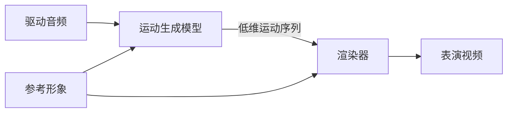

> 素材来源：knowledge/《数字人基础》《5分钟认识数字人》《3dgs-methods-research》、三篇 survey（survey-map / avatar-survey / realtime-survey）、papers 库、CyberVerse @4968280。
> 事实分级：【已验证】【待验证】【待补】。

# 数字人介绍与技术路线

## 数字人是什么

【已验证】数字人这件事要分两层看：

- **数字人（模型）**：给定驱动信号（音频/文本），生成可控形象的技术问题
- **数字人系统**：把 ASR（语音识别）、LLM（语言模型）、TTS（语音合成）、Avatar 渲染串成可对话产品的工程形态

一句话版本：**用可驱动的形象，把语音或文本变成会说话、有表情的画面。**

任何一个数字人方案，都值得先问三个问题【已验证】：

| 问题 | 含义 |
|------|------|
| 表现质量 | 像不像、自然不自然 |
| 表现范围 | 只动嘴 / 带头姿表情 / 带身体手势 |
| 工程性能 | 能不能实时、要多少算力 |

文献里的任务名称（换嘴配音 / talking head / 3D avatar）描述的是表现范围或实现形态，不能替代上面三问。

## 为什么重要

- **产品价值**：把 AI 回复从文字、语音升级为"可见的面对面交互"，是对话式产品临场感最强的载体【待验证·判断】
- **落地形态**：会议面试官数字人（本项目方向）、虚拟客服、直播主播、陪伴 Agent【已验证】
- **技术价值**：数字人串起语音理解 → 语言生成 → 语音合成 → 视觉生成的完整多模态链路，是端到端系统的集成试炼场【待验证·判断】
- **关键约束**：实时性决定可用性。对话场景下首帧延迟到秒级就会明显破坏自然感【已验证】

## 主要技术路线

> **先明确一个框架问题**：市面上的路线常被说成"三条互斥路线"，但更准确的说法是**两条轴**——「模型生成什么」（生成方式）与「画面靠什么落地」（渲染/资产后端）可以自由组合。本文用三路线作叙述框架（便于建立直觉），同时标出每条路线落在哪条轴上。
> 【已验证】knowledge/《数字人基础》原文："生成方式与渲染后端可自由组合，不能混成互斥路线。动作空间模型既可以配 2D renderer，也可以配 FLAME、NeRF 或 3DGS。"

三条路线与两条轴的关系：

| 常说的路线 | 落在哪条轴 | 说明 |
|-----------|-----------|------|
| 视频基座模型 | 生成方式轴：整帧视频生成 | 模型直接生成帧/latent |
| 动作空间扩散 | 生成方式轴：动作空间生成 | 模型只生成低维运动，外观交给渲染器 |
| 3D GS | **渲染/资产后端轴** | 可与动作空间或整帧生成组合 |

### 路线一：视频基座模型（整帧视频生成）

**做法**：直接在视频 latent 或帧空间生成，模型同时负责身份纹理、动作与背景。

**代表模型**（papers 库 slug 可检索）：

| 模型 | slug | 特点 |
|------|------|------|
| FlashHead | `paper-soulx-flashhead` | Oracle-guided 无限时长生成 |
| LiveAvatar | `live-avatar-paper` | 流式实时音频驱动 |
| Hallo3 | `paper-hallo3` | 高动态真实肖像动画 |
| HunyuanVideo-Avatar | `paper-hunyuan-avatar` | 高保真音频驱动人体 |
| OmniAvatar | `paper-omniavatar` | 高效音频驱动视频生成 |
| Wan-Streamer | `wan-streamer-2026` | 端到端实时交互 |
| OmniMate | `omnimate-2026` | 开放式实时流式音视频 |
| LeapTalk | `leaptalk-2026` | 延迟-质量权衡突破 |

**优点**：表现范围最大（身体、背景、场景），上限高，可零样本泛化到未见形象。
**缺点**：每帧重算身份纹理与背景，算力浪费；长时稳定性与实时化困难——这是领域级公认挑战【已验证·survey-map："扩散路线的实时化困难"】。

### 路线二：动作空间扩散模型

**做法**：把"身份外观"与"运动"解耦。模型只预测低维运动序列（Ditto 的运动表示仅 265 维），渲染器负责把运动作用到参考身份上。

**代表模型**：

| 模型 | slug | 运动表示 / 特点 |
|------|------|----------------|
| Ditto | `paper-ditto` | HuBERT → LMDM 运动隐空间扩散 |
| Avatar Forcing | `avatarforcing-2026` | FLOAT motion latent 显式分解 + 因果 Diffusion Forcing，双向听说 |
| VASA-1 | `paper-vasa1` | 3D 面部 latent 生成 |
| SadTalker | `paper-sadtalker` | 3DMM 系数（经典基线） |
| MuseTalk | `paper-musetalk` | 实时换嘴（局部 ROI） |
| LatentSync | `paper-latentsync` | 潜在扩散唇形同步 |
| Teller | `paper-teller` | 自回归运动 token 流式 |
| EMO2 | `paper-emo2` | 表情可控 |
| X-Portrait | `paper-x-portrait` | 层次化运动迁移 |
| AniPortrait | `paper-aniportrait` | 音频 → 3D 关键点 → 渲染 |
| UniLS | `unils-2024` | 统一听说端到端 |
| JoyVASA | `paper-joyvasa` | 扩散式肖像/动物动画 |

**优点**：算力集中花在"怎么动"上，便于实时与控制（Ditto 可把 RTF 压到 <1；Avatar Forcing 天然因果流式）【已验证】；身份纹理由渲染器保留，一致性有第二重保障（纹理只形变、不生成）。
**缺点**：效果上限受运动表示与渲染器限制；一旦需要生成身体或复杂背景，仍要回到整帧路线【已验证】。

### 路线三：3D GS（渲染/资产后端）

**做法**：用 3D Gaussian Splatting 作为可驱动的三维资产与渲染器，动作参数（如 FLAME 表情码）驱动高斯渲染。注意它主要是一条**渲染后端**选择，可与动作空间生成组合（如 LAM = FLAME 动作驱动 3DGS）。

**从 NeRF 到 3DGS 的成本革命**【已验证】：

| 工作 | 训练成本 | FPS |
|------|---------|-----|
| AD-NeRF | 167.6h | 0.04 |
| ER-NeRF | — | 15.2 |
| EGSTalker | 3.7h | 68.5 |
| GSTalker | 40min | 125 |

关键变化是从 NeRF 的体采样转向 3DGS 的光栅化，训练与渲染成本下降数量级。

**代表模型与实测**（VFHQ-Test，3D Portrait Animation）【已验证·《3dgs-methods-research》】：

| 模型 | slug | PSNR↑ | SSIM↑ | LPIPS↓ | CSIM↑ | 硬件可行性 | 接入状态 |
|------|------|-------|-------|--------|-------|-----------|---------|
| GAGAvatar | — | 21.83 | 0.818 | 0.122 | 0.816 | 【待补】 | — |
| LAM | `lam-2025` | 22.65 | 0.829 | 0.109 | 0.822 | 【待补】 | — |
| FlexAvatar | `flexavatar-2025` | **23.47** | **0.837** | **0.099** | **0.830** | A10 可行 | 已接入 |
| HyperGaussians | `hypergaussians-2025` | 渲染增强模块 | | | | A10 可行 | 可作增强 |
| MATCH | `match-2026` | 需多视角输入 | | | | 需多视角 + SM90，不可行 | 不接入 |
| AniGS | `anigs-2024` | 单图全身 | | | | 显存要求高 | 参考 |
| UIKA | `uika-2026` | 免位姿快速头部 avatar | | | | 【待补】 | 主线候选 |
| LHM | `lhm-2025` | 单图可动画人体重建 | | | | 【待补】 | — |
| EmoTaG | `emotag-2026` | 情绪感知高斯说话头 | | | | 【待补】 | — |

**优点**：前馈式方法可单图秒级建好 avatar（UIKA / MATCH 十倍增建速度）；渲染成本低、可自由视角。
**缺点**：需要采集或拟合，泛化与拓扑处理复杂；MATCH 类要多视角加新一代硬件；全身方案（AniGS）显存要求高。

## 数字人系统与实时性（现行做法）

【已验证】级联四组件：ASR → LLM → TTS → Avatar 渲染。三种架构：级联（组件独立、可控、延迟高）、端到端（如 A2-LLM，TTFA 535ms）、混合（级联框架 + 端到端局部模块）。流式级联全链路约 3.2s，差距来自分块等待与组件间排队。

两条工程战线【已验证】：
- **传输层**：实时交互基本必选 WebRTC（自带 jitter buffer、NetEQ 丢包隐藏、抗弱网）；WebSocket 简单但要自做平滑
- **推理层**：流式 TTS 分块 + Avatar 异步渲染，减少首帧等待；轻量技巧包括滑动窗口重叠融合（LiteAvatar 1 秒窗口）、静音回退中性口型、说话/静音状态机

系统之上通常还集成 Agent 能力（RAG 检索、工具调用、记忆人格）。框架落地形态见《CyberVerse框架》。

## 评价口径

【已验证】五大指标族：

| 指标族 | 代表指标 | 回答的问题 |
|--------|---------|-----------|
| 唇同步 | Sync-C / Sync-D | 嘴型与声音是否对得上 |
| 身份与长时漂移 | CSIM / CSIM-drift / LPIPS-drift | 是否还是同一个人、长时是否偏离 |
| 画质 | PSNR / SSIM / LPIPS / NR-IQA | 画面质量 |
| 时序流畅 | Dino-S / flow_smoothness | 相邻帧是否平滑、有无闪烁抖动 |
| 效率 | FPS / TTFF / 延迟 / 显存 | 能否实时、算力代价 |

一个关键口径：**论文里的 FPS 不等于产品的 SLA**。同一模型的实验室吞吐与产品准入标准往往相差一个数量级。身份度量本身也有适用边界（CSIM 在风格化场景失效等），详见《数字人身份》。

## 我们的选择与理由

【已验证】2026-06-08 启动三条路线调研（2D talking-head / 3D Gaussian Splatting 头像 / 扩散式生成），2026-06-22 得出结论：**以 GAGAvatar / UIKA 系前馈式方案为主要探索方向**。

最终落地的系统形态：**CyberVerse（实时数字人 Agent 框架）+ AvatarForcing / Ditto 模型插件**（@4968280）。

选型理由要点（实测支撑见《数字人行业全景》）：
- 动作空间路线便于实时化与精确控制，算力集中在运动生成上
- 前馈式 3D 方案（UIKA/GAGAvatar 系）单图建 avatar 成本低，适合快速换形象

## 开放问题与改进方向

- **手部与身体统一框架缺位**：唇、头、手势的统一生成框架仍是领域级空白【已验证·survey-map】
- **扩散路线实时化**：整帧扩散路线的实时化仍是主要瓶颈【已验证】
- **身份度量的标准化**：CSIM 缺乏统一协议，风格化场景失效【已验证】——见《数字人身份》
- **3D GS 前馈化的硬件门槛**：MATCH 等需要多视角与新一代硬件，低成本前馈方案仍有空间【待验证】
- 【待补】3DGS 各方法的 RTF / 显存实测数据、视频基座路线的延迟指标（评测框架数据在 CyberVerse，尚未复制到本仓库）
