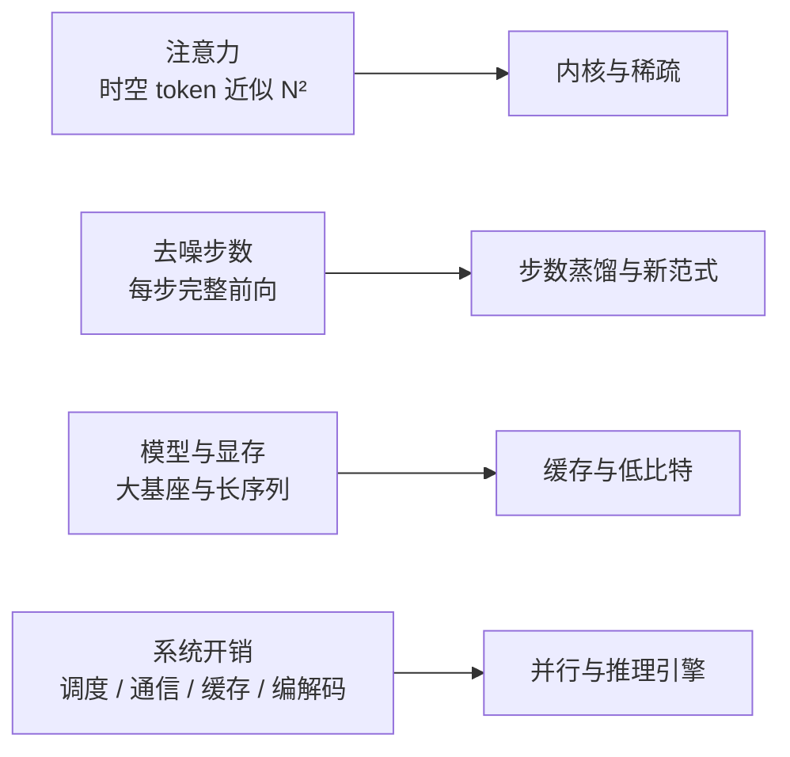
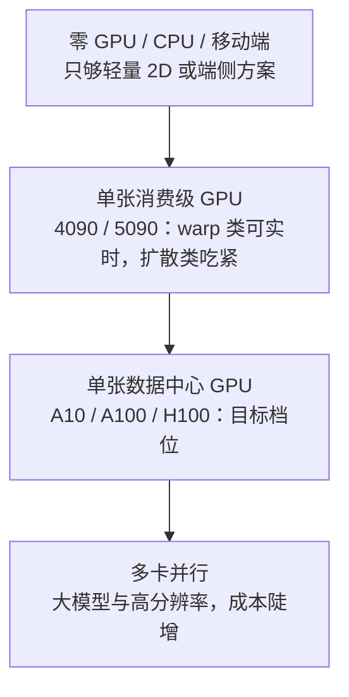

# 数字人加速

## 为什么重要

实时性有两条天花板，缺一条都不算能用：

- **延迟**：用户等多久才看到第一帧。对话里首帧上到秒级，自然感就没了
- **吞吐**：能不能持续跟上。首帧快但帧率跟不上，画面会一直卡

所以"快"不是一句"模型算得快就行"，而是**可拆、可测、可优化**的一件事。这一篇按这个顺序讲：先说清怎么算快（指标与延迟链）→ 再看慢在哪一段（延迟链分解）→ 然后两条加速路径（模型侧与系统侧）→ 各方案实际能跑多快（横评）→ 什么卡能跑到什么程度（硬件档位）→ 哪些路不值得走（未采纳）。

边界：本篇只讲快。链路怎么设计见 [[实习复盘/工程设计|工程设计]]，架构与实时性通论见 [[实习复盘/CyberVerse框架|CyberVerse框架]]。

## 实时性的三个指标与延迟链

三个指标各管一件事，必须一起看：

| 指标 | 含义 | 管什么 |
|------|------|--------|
| **FPS** | 每秒生成帧数 | 持续流畅度。≥25 算实时，≥50 才有余量做多路并发 |
| **TTFF / 首帧延迟** | Time To First Frame | 交互灵敏度——用户感知的"响应快不快"主要由它决定 |
| **RTF** | 处理时间 ÷ 音视频时长 | 吞吐效率的综合度量，RTF < 1 表示跑得比实时快 |

判据是**两者同时达标**：一个高 FPS 但首帧 3 秒的系统只适合离线配音；一个首帧 200ms 但 FPS 只有 15 的系统只适合低帧率交互；只有首帧与持续帧率都过线，才支撑自然的双向对话。

从用户说话到看见响应，延迟可以拆成三段：

**最反直觉的一点**：论文最常优化的"模型推理"往往不是最大项，**音频窗口（攒够一段音频再送模型）才是大头**。这直接决定了加速的两条路径——压模型推理走第三节，压其余两段走第四节。

## 生成侧加速

视频生成推理本身是一个独立可优化的层。

### 慢在哪

成本由四件事叠加：**注意力**（时空 token 近似 N²）、**去噪步数**（每一步都要完整前向）、**模型与显存**（大基座、长序列）、**系统开销**（调度、通信、缓存、编解码）。

### 内核与稀疏

把每一步算得更快：量化低比特与稀疏注意力一起做。代表工作是 **FPSAttention**——FP8 量化与稀疏注意力的协同设计。这类方法通常需要量化感知训练或蒸馏，属于要动训练的一档。

### 步数变少

让需要的去噪步数下降：**BLADE** 用块稀疏注意力配步数蒸馏，蒸馏出少步 student；自回归路线则用 **NAR**（邻域自回归建模）与 **FlashAR**（后训练加速）减少串行步数。思路是"把大模型的能力搬到少步模型上"。

### 缓存复用

避免长视频的重复计算：**Latent Spatial Memory** 在隐空间保留空间记忆，**WorldAttention** 把缓存与计算一起做系统协同设计。这类方法对长时生成收益最明显。

### 并行与推理引擎

把多模块串成高效系统，也把解码过程并行化：**ZipAR** 用空间局部性做并行解码；**DAX** 与 **Inferix** 分别提供推理基础设施与自回归扩散推理引擎；**TurboDiffusion** 是模型与系统协同设计的代表。

### 两条结论

- **协同设计是唯一的免费午餐**：单点优化很容易被别的阶段吃掉。这一点我们在工程侧反复撞到——warp 隔离变快约 21%，但被下游 stitch 抵消，浏览器帧率没有变化；真正有效的是模型与系统一起设计
- **训练费与即插即用的光谱**：零训练（ZipAR、DAX）→ 后训练（FlashAR）→ 蒸馏或量化感知训练（BLADE、FPSAttention、TurboDiffusion）→ 从头训练（NAR）。训练代价越高，通常能改变的上限越大，但"论文训练可行"不等于本地有训练代码与数据链。选型前要先问：**我们手里是完整训练链、部分微调入口，还是只有推理权重？**

### 能落到我们管线上的

- **现成候选：LIA-X decoder 蒸馏**。LIA-X 渲染器在 512²、bf16、batch=1 下约 **333ms/帧**，是当时 T2AV 链路的速度瓶颈——属于"只需推理权重就能做"的那一档
- 快多少倍这种事有前提：**同模型、同硬件、同分辨率、同步步数、同质量约束**，幻灯片口径与论文口径也要对齐，否则两组数字不可比

## 系统侧加速

### 瓶颈基线

排查从"画面发布给浏览器"这条链路开始。浏览器端以约 25 fps 消费；隔离基准下 GPU 侧四个阶段合计约 **38.5ms/帧**，而 25 fps 的预算只有 **40ms**——**已占 96%**。

| 阶段（隔离口径） | 典型耗时 | 说明 |
|------------------|----------|------|
| decode | 17.7ms/帧 | fp16 engine |
| warp | 14.9ms/帧 | PyTorch autocast |
| LMDM | 3.9ms/0.4s block | 不是主要瓶颈 |
| stitch | 约 1ms | 不是主要瓶颈 |
| **GPU 合计** | **约 38.5ms/帧** | 占 40ms 预算约 96% |

这个基线改变了排查方向：**不能把每次变慢都归到某个模型"算得慢"**——余量只有几毫秒，生产环境里很多抖动其实是 GPU 排队。

### 推理侧加速

三档要分清：**在生产链里生效的**、**验证过但没默认采纳的**、**回退或候选的**。

**生产基线**：

- **生成侧上限**：motion space + 分段流式推理 + 10 步去噪——不在像素空间逐帧扩散，把计算量定在可控范围
- **Decoder FP16 TensorRT**：隔离基准 **73.5 → 17.7ms/帧**，约 **4.2×**；配套独立 CUDA stream、张量地址复用与 buffer 复用
- **Warp → Decoder GPU 直传 + CUDA Event**：避免 GPU→CPU→GPU 往返，保留双流流水关系
- **LMDM 常量条件一次绑定**：讲话阶段约 **49 → 39ms**

**验证过但未默认采纳**：

| 项 | 隔离收益 | 端到端结果 |
|----|---------|-----------|
| Warp TensorRT | warp 14.9 → **11.8ms/帧** | warp p50 30→25ms，但 **stitch 2→9ms** 抵消，浏览器帧率无明显变化 |
| LMDM FP16 | LMDM 8.35 → **3.27ms**（DDIM 相关基准 862→416ms） | 生产 RTF 0.916→0.870，**浏览器帧率 23.8→23.9** |

结论不是"这些优化无效"，而是**在该生产链与硬件下它们没有形成额外的用户侧收益**：总 GPU 预算仍主要被 warp 与 decoder 占用。

**已回退或候选**：GPU 回贴、单 worker、降帧；少步采样与新环境重测仍待验证。

**这里的一条判断**：各项优化的**测量对象不同**——模块耗时、RTF、发布节奏、浏览器体验，**不能相加成"总加速 N 倍"**；而且 GPU 长期 90%+ 利用时，两个 kernel 会争同一批 SM，继续调流优先级或扩大重叠不会自动提高端到端帧率。

### 编码与传输

编码耗时的拆解（720p、25 帧/段）：总计约 **679ms** = 编码进程与 CUDA/NVENC 初始化 **约 400ms** + 色彩空间转换 **90ms** + NVENC 编码 **40ms** + 管道写入。**大部分时间花在"起进程"和"搬数据"，不是编码本身。**

对应改法：

- **编码器常驻**：每几何一个长生命编码进程，消除每段约 450ms 的进程与初始化固定开销；打断时强制重生以保证关键帧
- **硬编替代软编**：软件编码约 640ms/秒段，逼近实时预算，且同码率画质更低
- **YUV420 传输**：1080p 单帧载荷 **6.2MB → 3.1MB**，同时去掉每帧的 CPU 色彩转换
- **编码档位随分辨率自适应**：按帧像素量分档，把大分辨率下的编码耗时压回百毫秒级

### 首帧与开口

- **全链路首响应 3.5s → 约 2.9s**：每轮首个语音段攒够 400ms 即发（原来等 1s），预缓冲阈值从 800ms 降到 400ms
- **TTFF 的构成**：首帧延迟 ≈ 排空模型内待机存粮（≤1.12s）+ 首块推理约 0.3s——所以压缩方向是限制待机存粮深度
- **段聚合粒度 1000/400ms → 200ms**：常驻编码器上线后，细粒度不再有额外成本

**这节的判断还是那条**：**局部阶段变快 ≠ 用户侧变快**。

## 模型实时性横评

我们把覆盖到的 30+ 个方案按路线整理成实时性对比表。**每一行都标注来源类别**：论文直接披露 / 开源仓库 README 或 benchmark / **我们实测**；未公开的数据不猜，留空。

看表有两个前提：

- **FPS 不能脱离 GPU 型号与分辨率比较**——同一个模型换一张卡，差异可达 5–10 倍
- 表里的"实时 ✓"只表示**该卡上** FPS ≥ 25 或 RTF < 1，**不代表产品级端到端实时**（端到端还要叠加音频窗口与传输）

分路线的代表数字（用来说明跨度）：

| 路线 | 代表与数字 |
|------|-----------|
| 轻量换嘴 / 局部重绘 | SadTalker 在消费级 GPU 上仅 5–15 FPS；LiteAvatar 在 A10 实测 25.19 FPS |
| 运动空间 / 隐式关键点 | LivePortrait 在 RTX 4090 上 67 FPS；**Ditto（A100 + TensorRT）RTF 0.895、首帧 385ms**；部分 chunk 式自回归方案在 5090 上能到数百 FPS |
| 整帧 / 流式基模 | FlashHead **Lite** 在 A10 实测 46.7 FPS，而 **Pro 1.3B 在 A10 只有 4.8 FPS**——同一个家族内部就差近 10 倍，**档位选择比模型选择更影响可行性** |
| 扩散肖像 | 多数方案 RTF 远大于 1（有方案 RTF 达 35 量级），只能离线 |

> **待补**：我们在早期平台上跑过 **15+ 模型的 SpeedRun / Formal Evaluation 批处理**（RTF、画质、sync_c / sync_d 全量指标）。这批第一手横评数据目前不在本仓库，本节先以"含我们实测行的 30+ 模型表"为准；等原始结果取回后补完整横评，**不在此处用二手数字冒充第一手**。

## 硬件档位与可行性

按硬件分成四个档位，每档能跑到的能力差别很大：

面向 A10 的结论表：

| 模型 | 原始推理硬件 | A10 可行性 | 备注 |
|------|-------------|-----------|------|
| SoulX-LiveAct | 2× H100/H200（20 FPS） | ❌ 不适用 | 官方口径依赖多卡 + FP8 |
| LivePortrait | RTX 4090（12.8ms/帧） | ⚠️ 需实测 | 算力接近，显存差距大 |
| Ditto | 单张 A100 | ⚠️ 需实测 | 主要担心显存而非算力 |
| FlashHead Pro | A10 | ✅ 已验证 | 当时的可用基线 |

### 一个被推翻的结论——LiveAct 18B 的瓶颈不是显存

这条记录值得单独写，因为**我们的结论被自己的复测推翻过**。

早期版本把它记为"不可用（OOM / 超时）"，后来两次完整跑通否定了这个结论：两种规格都跑完全部迭代，产出了完整的 55.5 秒带音轨视频。修正后的事实是：

- **显存不是瓶颈**：实测峰值只有 **10.4 GiB（512²）与 11.7 GiB（416×720）**，22.5 GiB 的 A10 还剩一半以上
- **主机内存才是真约束**：走官方 offload 三件套把主干、T5 与 KV cache 全卸到 CPU 后，主机内存稳态占用约 **85–90 GiB**；正确口径是"整机独占 + 可用主机内存 ≥110 GiB"，且不能只看启动瞬间的快照
- **此前的失败另有原因**：几次中止都是同机其它任务挤爆主机内存触发的 OOM 击杀，不是 GPU 侧 OOM
- **两条路确实走不通**：不加 offload 全量装载约 36 GiB（单卡塞不进）；A10 是 Ampere 架构，**没有 FP8 硬件**，所以"用 FP8 把 KV cache 砍半"的方案直接作废
- **速度定位**：约 0.8–0.9 FPS，55.5 秒视频要跑约 39 分钟；同素材对照下小一个数量级的 FlashHead Pro 1.3B 是 1.4 FPS。**大模型在 A10 上没有质量红利，反而更慢**，只适合离线评测
- **证据边界**：这两次跑的是 `audio_cfg=1.0`，会**跳过音频引导分支**，所以产物只能回答"放不放得下、跑不跑得通、多快"，**唇同步质量不可与其它模型横比**

## 未采纳的加速方案

| 方案 | 为什么不采纳 |
|------|--------------|
| 只把帧率从 25 改成 20 | 在线因果窗口与时序以 25 fps 为前提，纯配置降帧造成帧数与音频错位（实测 fps 18.8、最低 14.4、stalls 3） |
| 持续深挖 GPU 回贴与微优化 | GPU 饱和时没有端到端收益，应先减少 warp 与 decode 的总工作量 |
| 把 Warp TRT / LMDM FP16 作为默认 | 隔离变快但被 stitch 抵消或浏览器帧率不变——不是无效，是本链与硬件下无额外用户侧收益 |
| 单卡硬塞大模型 | 显存不是问题，主机内存与架构（无 FP8）才是 |

**负结论也是结论**：它们划出"不要在这里继续投入"的边界，避免后来的人重复踩。

## 汇报要点

- **三指标与延迟链**：FPS 管流畅、TTFF 管灵敏、RTF 管吞吐；**音频窗口 100–2000ms 往往比模型推理更大**，这是系统优化的落点
- **两条加速路径**：生成侧（量化/稀疏/步数蒸馏/缓存/并行，需要动训练的程度不同）与系统侧（TensorRT、常驻编码器、YUV420、首帧策略）
- **系统侧关键数字**：瓶颈基线 38.5/40ms · Decoder FP16 TRT 4.2× · 编码耗时 679ms 拆解（大部分在起进程与搬数据）· YUV420 载荷减半 · 首响应 3.5s → 2.9s
- **优化取舍**：Warp TRT 与 LMDM FP16 隔离变快但端到端无感，故未默认采纳——**局部变快 ≠ 用户侧变快**
- **横评与可比性**：30+ 模型按路线，来源分论文/仓库/我们实测；FPS 不能脱离 GPU 与分辨率比较，"实时 ✓"不等于产品级实时
- **硬件结论**：A10 上 FlashHead Pro 已验证；LiveAct 18B 的显存不是瓶颈（峰值 10.4–11.7 GiB），**主机内存才是（需 ≥110 GiB）**，且 Ampere 无 FP8——早期"不可用"的结论已被复测推翻
- **未采纳四条**：降帧、深挖 GPU 回贴、把局部加速当默认、单卡硬塞大模型
