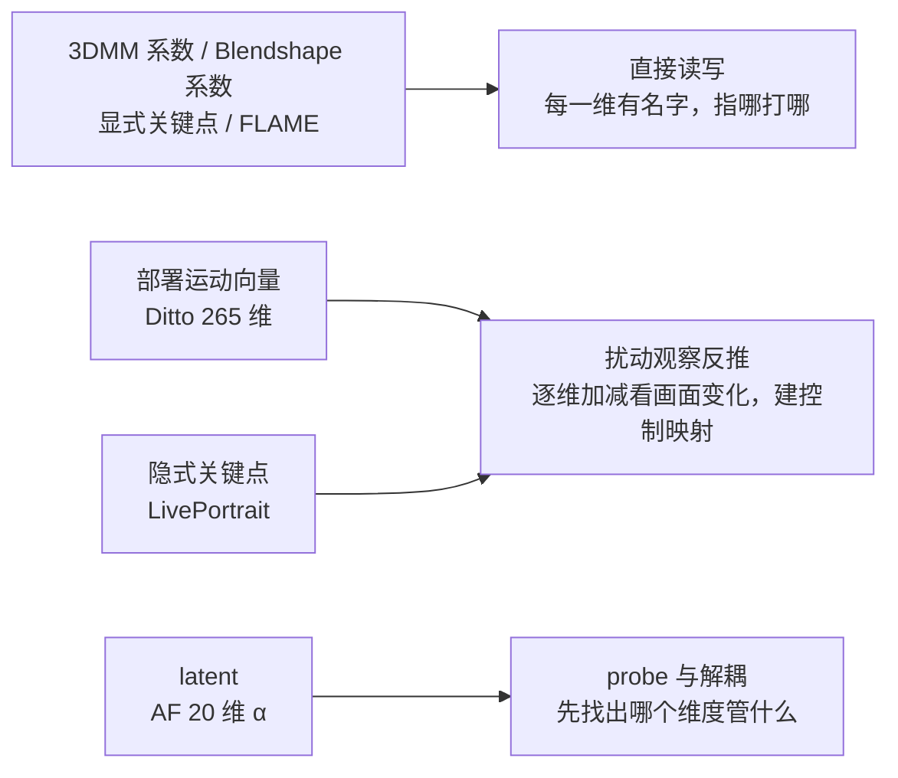
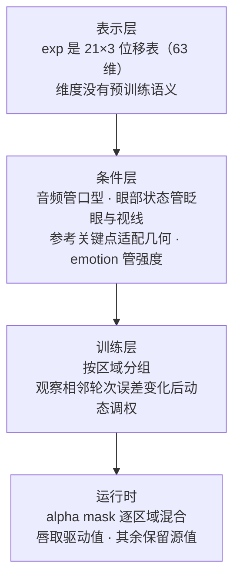

# 数字人动作

## 为什么重要

动作是数字人两个核心因素之一（另一个是身份，见 [[实习复盘/数字人身份|数字人身份]]）。身份回答"是不是同一个人"，动作回答"动得像不像"。**动作不自然，画质再好也像一张贴图在动**——它是可看性最直接的来源。

动作还是一件**分层递进**的事，每层的门槛和代价完全不同：

- **第一层 音唇同步**：只要求嘴形跟音频对得上。做扎实了，画面"能用"；做不好，一切免谈
- **第二层 情绪与听态**：说话时的表情要跟**情绪**走，听的时候还要有反应。这一层决定"像不像在对话"，比第一层更容易被忽略——而且它的核心是情绪，不是"有没有表情"
- **第三层 手部与全身**：整段肢体动作与语音协调，代价最高——渲染后端、动作数据、实时预算三样都要重来

本文只讲"怎么动"：渲染与实时性归《CyberVerse框架》与《工程改进》，身份侧归《数字人身份》。

## 动作空间谱系

动作空间生成要先决定一件事：**模型输出什么格式的数字来表示"怎么动"**。这个选择叫表示，它决定了后面能怎么控制、能被谁复用。

按"人能读懂多少"排序：

| 表示 | 维度与形式 | 语义可读性 | 代表工作 |
|------|-----------|-----------|---------|
| **3DMM 系数**（BFM / FLAME） | 表情系数 + 头姿系数 | 高：每一维有明确含义 | SadTalker、FLAP |
| **Blendshape 系数** | ARKit 52 维等标准接口 | 高：工业标准，可直接接引擎 | LiteAvatar（32 维口型） |
| **显式关键点与参数化模型** | 68 点、MediaPipe 468·478 点、3D 关键点；FLAME（shape / expression / pose + 蒙皮） | 高：语义由人定义，可直接读写 | FLAME / 3DMM 系 |
| **部署运动向量** | 标度 + 三轴旋转 + 平移 + 表情（Ditto **265 维**，不含关键点） | 中：可逐维扰动建立控制映射 | Ditto |
| **隐式关键点** | LivePortrait 紧凑关键点（论文称 implicit blendshape） | 低：维度没有天然语义 | LivePortrait、FOMM 类 |
| **整体面部 latent** | 512 维 | 低：容量大但不能直接编辑 | VASA-1、FLOAT |

### 显式这一族要多说几句

它是最"好懂"的一族，也是协议最杂的一族：

- **显式关键点**：68 点（iBUG 300-W 协议，dlib / ERT 一类实现）、MediaPipe Face Mesh 468·478 点、3D 关键点（带深度、可同时给头姿）
- **参数化 3D 模型**：**FLAME** 是代表——shape / expression / pose 参数加 LBS 蒙皮，输出 mesh 与 blendshape；3DMM / BFM 属同族
- **标准接口**：ARKit 52 维 blendshape，是工业实时角色与游戏引擎之间通用的那套"语言"

好处是**语义由人定义**：每个点、每个系数都对应一个可命名的东西，所以可以读写、可视化、用规则做动画（"抬眉"就是抬某几个点、某个系数）。FLAME 系数甚至能直接当扩散模型的可控条件，也能驱动 3DGS 资产。

局限同样清楚：**覆盖有限**（皱纹、纹理、光影不在这些量里）、**协议互不兼容**（68 点、478 点、52 维 blendshape、FLAME 参数各说各话，跨模型复用要先转换）、**遮挡与大姿态下不稳**。

### 各表示是怎么训出来的

| 表示 | 训练来源 | 数据需求 |
|------|---------|---------|
| FLAME / 3DMM | 统计模型：用大量 3D 扫描拟合先验 | 数千次 3D 扫描（实验室级） |
| LivePortrait 隐式关键点 | 自监督蒸馏（跟踪视频里的关键点运动） | 大量无标注视频 |
| ARKit blendshape | 商业级表情捕捉校准 | 专有校准数据 |
| FLOAT latent | autoencoder 训练，显式做身份与运动分解 | 视频自监督 |

选型直觉：要接工业管线（Unity / UE / 直播）就用 FLAME 或 blendshape；要做可控性研究就选有语义分区的显式表示；要表达上限就用 latent，代价是不可解释。

### 可控性从哪来

这是理解"为什么换个表示就要重做一遍控制"的关键：

- **显式表示**：控制是"自带"的，读写字面意思即可
- **隐式关键点与部署向量**：维度没有天然语义，能力要靠**实验反推**——LivePortrait 的经验是小 MLP 能学出"眼睛再开一点""嘴巴闭上一点"这类局部形变；Ditto 也是靠逐维扰动才建起眼、嘴的控制映射（详见下文第八节）
- **latent**：只能靠探针与解耦分析，先搞清楚维度含义再谈控制

## 音唇同步

### 主流做法

三层递进，代价依次上升：

- **局部替换**（Wav2Lip 系）：只重绘嘴部区域，稳定便宜、动作范围受限，适合配音与局部修正
- **latent inpainting**（MuseTalk 系）：在 latent 空间重绘嘴部，画质与稳定性兼顾，是目前 one-shot 头像的常见选择
- **视频基座与端到端**：整帧生成，能带身体与场景，但训练推理都重，实时化困难

### 判据与前置

同步的评测有两代口径：**LSE-C / LSE-D**（SyncNet 系）与 **sync_c / sync_d**（新口径）。SyncNet v2 的典型输入是 5 帧 224×224 的人脸序列加 13×20 的 MFCC 音频特征，并在 `vshift=15` 范围内搜时间偏移；C 是置信度（越高越好），D 是距离（越低越好）。

有两点要注意：

- **不同口径不能横向排序**——换了评测体系的两组数字放在同一列排冠军没有意义
- **先确认时间对齐，再比同步指标**：offset（音频与视频特征窗口的相对偏移）可能来自素材、裁剪、抽帧或模型输出，错误的 offset 会让本来同步的视频看起来不同步。正确顺序是：先固定资产与采样率、确认 offset 口径 → 再比指标 → 最后才考虑改 LoRA、辅助头或视频后处理

## 情绪与听态

音唇同步解决"嘴对得上"，这一层解决"**情绪对不对**"。这两件事的难度不在一个量级：口型从音频里能推出来，情绪不能。

**音频只提供发音与节奏，不直接决定情绪。** 眨眼、眼神、头动和情绪还受身份、动作模型、参考视频与生成器先验的影响。同一句话用喜怒哀乐说出来，表情应当完全不同——所以这一层的核心问题是"情绪表达得对不对"，而不是"有没有加表情"。

### 情绪怎么进来

按信号的来源分三类：

- **情绪标签**：clip 级情绪标注，控制表情强度与风格。Ditto 用的就是这一类，情绪是与音频、眼部状态并列的条件之一
- **情绪参考**：给一段带情绪的参考视频或图片，让模型模仿那份情绪；多模态控制类工作常把 emotion reference 与 prompt、mask、身体先验并列使用
- **语义与文本侧**：从说的内容推断情绪，或直接给出编辑指令（调表情强度、动注视点、改语速）。这条"把合成问题变成编辑问题"的方向，目前公开工作还很薄

语音侧也有一条并行线：对话式 TTS 已支持 inline 控制 emotion 与韵律（不只是朗读，而是"说话"），意味着情绪可以在语音与画面两侧同时被指定。

### 情绪怎么评

- **表达类指标**：`expression_nr`（自然度）、`expression_cls`（分类类）
- **动态类指标**：`THEval` 的动态指标组，看整段动作与表情是否合理
- **运动量类**：`SID`、`motion_magnitude`

它们各覆盖不同的局部行为，**不能拿一个指标代表"情绪表达正确"**。配套数据集的用途也要分清：

| 数据集 | 规模 | 用途 |
|--------|------|------|
| MEAD | 60 speakers、281K clips、39h，多视角多情绪 | 训练为主 |
| RAVDESS | 24 actors、多情绪、受控表演 | 评测 |
| EMTD | 情绪丰富的 talking head | 评测（侧重情绪表达） |

### 听态（情绪的双向面）

对话是双向的：用户说话时，数字人不该是一张静止的脸。Avatar Forcing 面向的正是这种双向场景——一轮交互可以理解成"用户说话 → 系统听到用户的音频与视频 → 系统拿 avatar 待说的音频生成回应画面"，其中 listener 呈现的是它在**倾听**时的反应。实现上它用 **Dual Motion Encoder** 把两路信息编码成同一种条件：一路告诉模型"用户正在做什么"，另一路告诉模型"avatar 这次要怎么说"。

这一层目前的问题是**评价口径薄弱**：情绪表达还有 `expression_nr` 这类指标可看，而"听的反应得不得体"几乎没有公认的口径——第九节会把它列为改进方向。

## 手部与全身动作

这一层用语音驱动手势（co-speech gesture），主流做法是两段式：先做动作序列生成，再交给身体渲染。它比前两层多了两项成本：

- **渲染后端要换**：口型与表情层可以只动头部区域，手部与全身需要身体渲染能力
- **数据与实时预算**：手势数据的采集与标注成本高，而且整段肢体渲染会吃掉实时预算

我们**没有做这一层**，所以第九节把它列为"我们做到哪层、市面到哪层"的主要差距。

## 中文音频适配（桥系列）

原模型吃的是英文音频特征，中文音频接不上。我们的做法不是重训整套模型，而是在**中文音频编码器**与**冻结的原主干**之间放一座桥：桥负责把中文特征翻译成主干熟悉的格式，主干保持冻结，避免有限的中文数据把原有能力冲掉。

三代桥，每一代解决一个具体故障：

**第一代 蒸馏桥**：桥本身是 Linear 9216→512 + LayerNorm + SiLU，**4.7M 参数**，接收中文 wav2vec2 特征，输出主干可消费的 512 维特征。

**第二代 geom 桥（反塌缩）**：蒸馏桥会把中文音节**压塌**——原本分开的音节过桥后挤到一起，几何上不可分。于是加**帧对单边 hinge 损失**：惩罚"同帧特征被拉近"，把音节间的几何距离保住。

**第三代 georkd**：在 geom 基础上再加 **RKD 关系蒸馏**，保持英文老师侧的成对距离结构，防止桥学出离谱的几何。

**指标与边界**（多域设置，257 clips）：

| 臂 | sync_c ↑ | sync_d ↓ |
|----|---------|---------|
| md_georkd_best（ep2） | **6.299** | **8.853** |
| geom_lora_s30（对照锚） | 6.122 | 9.044 |

这张表只能读成"该 checkpoint 在当前口径下优于对照锚"。**多域设置同时改变了样本数量、来源域与身份多样性，且人工判定尚未完成**——所以不能写成"数据量不足已被证实"，更稳的结论是"多域训练值得继续验证"。

## 微调方法与注入点

微调不是"训或不训"两态。从碰得最少到开放得最多：

| 形态 | 我们的做法 | 可训参数量 |
|------|-----------|-----------|
| **全冻结，只训新组件（桥）** | 桥全开放精调，主干与音频编码器全冻结 | 桥 4.7M |
| **LoRA（低秩旁路）** | 挂在 flow 的 cross-attention q / kv 上，rank16 | 低秩增量 |
| **单层全参解冻** | 骨架全冻结，只放行 `final_layer` | 2.624M |
| **桥内 LoRA** | 冻结桥基底，只在桥的 Linear 上加 rank16 | 约 0.155M |

四条有实验背书的结论：

**注入点比 rank 更影响结果。** 这次中文域适配消融里，只有"把 LoRA 挂在哪"带来明显收益（q、kv、proj 组合 **+0.39 LSE-C**），rank 与数据量在当时规模下都不是主瓶颈。注意这是**这轮实验**的结论，不是普适规律。

**先让注入位置可审计，消融才值得信。** 第一轮我们按"q、kv、proj"三个轴去挂，问题是 `proj` 同时命中三个职责不同的模块，收益来自哪一处说不清；第二轮改成**路径后缀精确匹配**（例如只命中 cross-attention 的 proj，共 8 个目标），并在训练前打印命中清单，再做 cross-proj / mlp / self-only / full 的对照。

**全开放的代价是桥和主干失去配合。** 桥全开放精调后，训练侧分数下降、生成侧也回退（videoc1 LSE-C **4.565**，低于纯蒸馏冻结桥的 **5.719**）；改成桥内 LoRA 能减轻回退（**5.483**），但**两者都没超过纯冻结桥**。结论不是"桥内 LoRA 解决了问题"，而是更好的适配位置仍在 flow LoRA 一侧。

**解冻单层的判据是找"历史空白区"。** 核查发现 17 个历史训练臂从未碰过 `final_layer`，于是把它作为唯一放行的探针；做法上**先训好 LoRA 再解冻**（归因最干净），并配早停策略。

另外，**不同口径的数字不能横向排序**——来自不同评测体系的两组结果放进同一列比较没有意义。

## Ditto 的眼嘴拆分

问题很具体：同一段音频驱动下，怎么让眼睛和嘴巴各自受控？答案不是某个训练技巧，而是**四层机制叠出来的**。

**表示层**：运动来自 LivePortrait 风格的 Motion Extractor，exp 可以按 **21×3 的位移表**（63 维形变）来操作。关键点是——**这些维度在预训练时并没有被标成"嘴"或"眼"**，论文是通过逐维施加正负扰动、渲染后观察画面变化，才建立起"哪些维度主要影响哪个局部"的**后验控制映射**。工程上再把这套映射固化成索引：唇部取第 6、12、14、17、19、20 行，眼部取第 11、13、15、16、18 行。

**条件层**：音频与嘴动强相关，但光听声音，模型不知道该不该眨眼、看向哪里。所以眼部状态被单独告诉模型——眼睛开合比加瞳孔位置，专门管眨眼与视线；参考关键点负责让动作适配这张脸的几何；emotion label 控制表情强度与风格。

**训练层**：嘴、眼、表情与头姿的变化幅度不同，收敛速度也不同，用一组统一权重容易出现"嘴学好了、眼一直学不好"。做法是按区域分组，观察相邻轮次的平均误差变化，再动态调整各组权重。

**运行时**：推理时还可以逐区域混合"音频生成的驱动值"与"参考帧的原始值"——alpha mask 就是一张开关表，设为 1 的区域取驱动值，设为 0 的保留源值。

四层合起来说明一件事：**可控性不是模型自带的，而是表示、条件、训练、运行时四层共同造出来的**。这也解释了为什么换一种表示，控制方案就得重做一遍。

## 可能的改进方向

- **情绪表达的可控性**：情绪目前主要靠 clip 级标签，粒度粗、可控维度少；"改内容 → 换情绪 → 调强度"这条链还缺可编辑的接口（公开工作也很薄）
- **听态的评价口径**：倾听反应目前只能靠人看，没有公认指标——这也是"做出来了却难以证明变好"的根源。另外"表情太用力"这类问题的根因与可调手段还需要补记录、再定位
- **手部与全身的接入成本**：要换渲染后端、要动作数据、要吃实时预算，短期内不划算，但它是与市面方案的主要差距
- **适配位置的可复用方法**：把"扰动观察反推控制"与"先审计注入位置再消融"这两套做法沉淀成流程，新表示或新主干接入时按固定动作走一遍，而不是每次重新试
- **多域配比与多 seed 验证**：桥系列目前只有单次多域结果，需要把数量、来源域、身份多样性拆开做配比实验

## 汇报要点

- **三层能力我们各做到哪**：音唇同步与情绪/听态已覆盖；手部与全身未做（渲染后端、数据、实时预算三重成本）
- **桥系列三段各解决什么**：蒸馏桥接通中文特征空间 → geom 桥用单边 hinge 反塌缩 → georkd 加关系蒸馏保住几何结构；指标优于对照锚，但属单次多域实验
- **微调的实用结论**：注入点比 rank 重要（+0.39 LSE-C）；先让注入位置可审计；全开放会让桥与主干失去配合（4.565 vs 5.719）；解冻单层要找历史空白区
- **Ditto 四层机制一句话**：表示层出维度、条件层分工、训练层分区域调权、运行时按 mask 混合——可控性是叠出来的，不是模型自带的
- **两个缺口**：手部与全身未接入；听态（倾听反应）没有公认评价口径——情绪表达本身已有 expression_nr / THEval 一类指标可看
