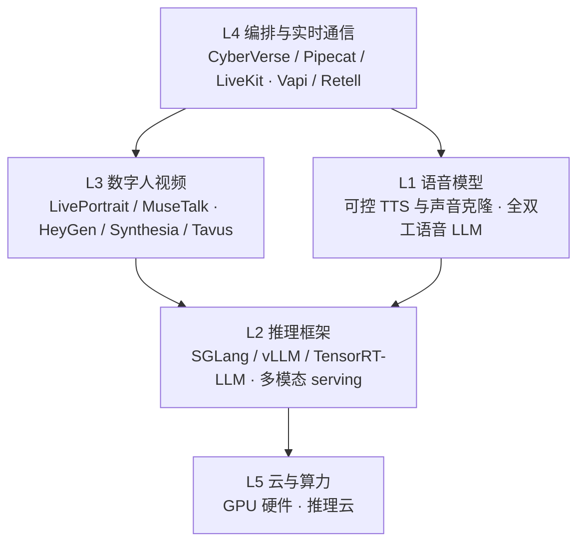

# 数字人行业全景

## 为什么重要

前面几篇讲原理、动作、身份、工程与加速，都是"我们怎么做"。这一篇只回答**事实性**问题：市场上在做什么、开源侧与产品侧各自做到哪一步、我们用的是什么位置，以及有哪些容易忽略的约束（比如许可证）。

**判断不在这里**：为什么这么选（选型结论）、往哪走（趋势判断）汇入《总结》，因为那需要取舍而不是罗列事实。速度与实时性口径在 [[实习复盘/数字人加速|数字人加速]]；原理与路线在 [[实习复盘/数字人介绍与技术路线|数字人介绍与技术路线]]。

## 竞品与产品调研

把实时数字人/语音 AI 拆开，从用户看到的产品到底层算力是五层，每层都存在"开源/开放权重"与"闭源商业平台"两条路线在竞争：

### 开源侧

- **LiveTalking**：已经广泛商用的实时流式引擎，四层架构（接口层 / 逻辑层 / 渲染层 / 推流层），渲染层接 Wav2Lip 或 MuseTalk；公开数据是 RTX 3060 上 wav2lip256 到 60 FPS、RTX 4090 上 MuseTalk 到 72 FPS。它的定位是"**单机、可落地、插件化**"
- **轻量 2D / 端侧**：LiteAvatar（纯 CPU 可实时）、Ultralight（能塞进手机）——能力范围窄，但部署门槛最低
- **框架侧**：CyberVerse 这类实时 Agent 框架把插件化做得很完整，但**许可证是 GPLv3**——要集成进闭源商业产品，商用前必须做法务判断，这是选型时不能忽略的约束

### 产品侧

- 云厂商的数字人产品与语音栈已经相当成熟：**可控 TTS 与声音克隆**成为标配（可 inline 控制情绪、韵律、语速），**全双工语音 LLM** 也已产品化
- 企业视频方向（数字人播报、企业形象）由海外 SaaS 领跑

### 我们与竞品的位置

| 维度 | 行业常见做法 | 我们的位置 |
|------|-------------|-----------|
| 数字人视频 | 轻量 2D 换嘴为主，或纯语音 | **实时 + 可插拔的 3D / 扩散模型**——这一段当时是缺口 |
| 编排 | 一站式语音 Agent 平台 | 自建框架，模型可替换 |
| 语音 | 云厂商 API | 接云厂商能力，重点投入画面侧 |

## 未采纳与待复跑

这里的**状态不是标签，而是证据等级**——同一个模型"接入过 / 跑通过 / 有指标 / 有人工检查"之间差别很大：

| 等级 | 含义 | 可以写什么 | 不可以写什么 |
|------|------|-----------|-------------|
| 待复跑 | 只有口头或初步观察 | 观察原话、待补字段、复跑计划 | 分数、排序、最终结论 |
| 初步观察 | 已有输出但对照不完整 | 单项指标 + 明确标注"对照不完整" | 直接排名 |
| 已复现 | 同协议重复得到一致现象 | 结论 | 未验证的推广 |
| 已否决 | 当前场景决定不采用 | 原因 | — |

当前清单：

- **ExOmni-2D**：初步观察。真人轨同步指标可用（sync-c 5.03 / sync-d 9.1，接近我们当时记录的 5.12），但**仅单条真人素材**；卡通素材上的旧结论已撤销。下一步要同资产、同音频、同规格重跑
- **MoDA**：待复跑。可运行，但主观上弱于 Avatar Forcing，缺同协议对照
- **LiveAct**：见上一节——放得下但慢，且唇同步不可横比，只适合离线评测
- **UniLS**：待复跑，缺一致协议
- **Talker-T2AV 的 FaceCropper 管线**：待复跑，问题出在预处理管线而非模型

**这一节的价值是避免重复投入**：它能直接回答"这个模型我们到底验证到哪一步了"。

## 汇报要点

- **竞品位置**：行业多在轻量 2D 换嘴或纯语音；我们做的是"实时 + 可插拔的 3D / 扩散模型"这一段
- **许可证约束**：主流实时框架里有 GPLv3 这类强 copyleft 协议，集成进闭源产品前必须做法务判断——这是选型时容易忽略的一项
- **待复跑清单**：ExOmni-2D、MoDA、LiveAct、UniLS、Talker-T2AV 预处理管线，各自卡在哪一步、复跑要什么条件
- **边界**：选型结论与趋势判断已汇入《总结》；速度与实时性口径在《数字人加速》
