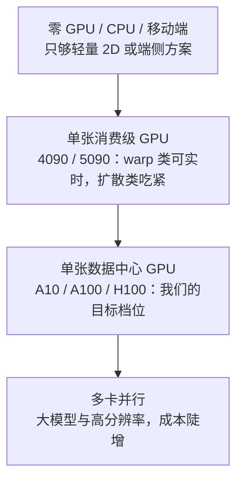
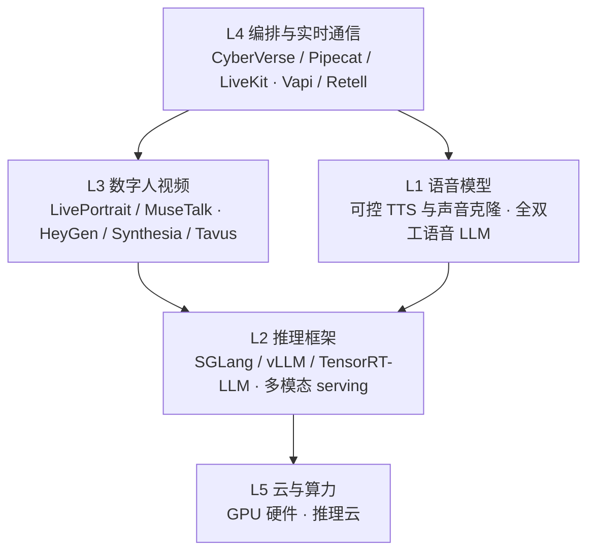

# 数字人行业全景

## 为什么重要

前面几篇讲的是原理、动作、身份与工程：那是"怎么做"。这一篇讲**市场与实测**：市场上有什么、我们测过什么、我们为什么这么选。

工程落地最常被问的问题不是"哪个模型画质最好"，而是——**"我手上有什么 GPU，能做到什么级别的实时？"** 这个问题决定了选型、成本与周期，量级差别往往是一个数量级。

边界：原理、路线 taxonomy 与评价体系见 [[实习复盘/数字人介绍与技术路线|数字人介绍与技术路线]]；我们的工程改造细节见 [[实习复盘/工程改进|工程改进]]。本篇只写市场对标与实测结论。

## 实时性的三个指标与延迟链

三个指标各管一件事：

| 指标 | 含义 | 管什么 |
|------|------|--------|
| **FPS** | 每秒生成帧数 | 持续流畅度。≥25 算实时，≥50 才有余量做多路并发 |
| **TTFF / 首帧延迟** | Time To First Frame | 交互灵敏度——用户感知的"响应快不快"主要由它决定 |
| **RTF** | 处理时间 ÷ 音视频时长 | 吞吐效率的综合度量，RTF < 1 表示跑得比实时快 |

三者必须一起看，这也是选型的核心判据：**一个高 FPS 但首帧 3 秒的系统只适合离线配音；一个首帧 200ms 但 FPS 只有 15 的系统只适合低帧率交互；只有两者同时达标，才能支撑自然的双向对话。**

延迟从用户说话到看见响应，可拆成三段：

**最容易被忽略的一点**：论文最常优化的"模型推理"往往不是最大项，**音频窗口（攒够一段音频再送模型）才是大头**。这也是为什么工程侧很多优化都落在缓冲与发布节奏上，而不是模型本身。

## 模型实时性横评

我们把覆盖到的 30+ 个方案按路线整理成了一张实时性对比表。**表里的每一行都要标注来源类别**：

- **论文直接披露**——论文里给出的 FPS / RTF
- **开源仓库**——README 或仓库自带 benchmark
- **我们实测**——在我们自己硬件上实测得到

未公开的数据不猜，留空。

**读表纪律（比数字本身更重要）**：

- **FPS 不能脱离 GPU 型号与分辨率比较**——同一个模型换一张卡，FPS 差异可达 5–10 倍
- 表里的"实时 ✓"只表示**该 GPU 上** FPS ≥ 25 或 RTF < 1，**不代表产品级端到端实时**——端到端还要叠加音频窗口与传输

分路线的代表数字（说明跨度有多大）：

| 路线 | 代表与数字 |
|------|-----------|
| 轻量换嘴 / 局部重绘 | SadTalker 在消费级 GPU 上仅 5–15 FPS；LiteAvatar 在 A10 实测 25.19 FPS |
| 运动空间 / 隐式关键点 | LivePortrait 在 RTX 4090 上 67 FPS；**Ditto（A100 + TensorRT）RTF 0.895、首帧 385ms**；部分 chunk 式自回归方案在 5090 上能到数百 FPS |
| 整帧 / 流式基模 | FlashHead **Lite** 在 A10 实测 46.7 FPS，而 **Pro 1.3B 在 A10 只有 4.8 FPS**——同一个家族内部就差近 10 倍，档位选择比模型选择更影响可行性 |
| 扩散肖像 | 多数方案 RTF 远大于 1（例如某些方案 RTF 达 35 量级），只能离线 |

> **待补**：我们在早期平台上跑过 **15+ 模型的 SpeedRun / Formal Evaluation 批处理**（RTF、画质、sync_c / sync_d 全量指标）。这批**第一手横评数据目前不在本仓库**（工作台的评测结果未随仓库迁移），所以本节先以"含我们实测行的 30+ 模型表"为准；等原始结果取回后补一节完整横评，**不在此处用二手数字冒充第一手**。

## 硬件层级与可行性

按硬件把可行性分成四层，每层能跑到的档位差别很大：

我们当时的结论表（面向 A10）：

| 模型 | 原始推理硬件 | A10 可行性 | 备注 |
|------|-------------|-----------|------|
| SoulX-LiveAct | 2× H100/H200（20 FPS） | ❌ 不适用 | 官方口径依赖多卡 + FP8 |
| LivePortrait | RTX 4090（12.8ms/帧） | ⚠️ 需实测 | 算力接近，但显存差距大 |
| Ditto | 单张 A100 | ⚠️ 需实测 | 主要担心显存而非算力 |
| FlashHead Pro | A10 | ✅ 已验证 | 当时的可用基线 |

### 一个被推翻的结论——LiveAct 18B 的瓶颈不是显存

这条记录值得单独写，因为**我们的结论被自己的复测推翻过**。

早期版本把 LiveAct 记为"不可用（OOM / 超时）"。后来的两次完整跑通否定了这个结论：512×512 与 416×720 两种规格都跑完全部迭代，产出了完整的 55.5 秒带音轨视频。修正后的事实是：

- **显存不是瓶颈**：实测峰值只有 **10.4 GiB（512²）与 11.7 GiB（416×720）**，22.5 GiB 的 A10 还剩一半以上
- **主机内存才是真约束**：走官方 offload 三件套把主干、T5 与 KV cache 全卸到 CPU 后，主机内存稳态占用约 **85–90 GiB**；正确口径是"整机独占 + 可用主机内存 ≥110 GiB"，且不能只看启动瞬间的快照
- **此前的失败另有原因**：几次中止都是同机其它任务挤爆主机内存触发的 OOM 击杀，不是 GPU 侧 OOM
- **两条路确实走不通**：不加 offload 全量装载约 36 GiB（单卡塞不进）；A10 是 Ampere 架构，**没有 FP8 硬件**，所以"用 FP8 把 KV cache 砍半"的方案直接作废
- **速度定位**：约 0.8–0.9 FPS，55.5 秒视频要跑约 39 分钟；同素材对照下小一个数量级的 FlashHead Pro 1.3B 是 1.4 FPS。**大模型在 A10 上没有质量红利，反而更慢**，只适合离线评测

还有一条证据纪律：这两次跑的是 `audio_cfg=1.0`，会**跳过音频引导分支**，所以产物只能回答"放不放得下、跑不跑得通、多快"，**唇同步质量不可与其它模型横比**。

## 竞品与产品调研

把实时数字人/语音 AI 拆开，从用户看到的产品到底层算力是五层，每层都存在"开源/开放权重"与"闭源商业平台"两条路线在竞争：

### 开源侧

- **LiveTalking**：已经广泛商用的实时流式引擎，四层架构（接口层 / 逻辑层 / 渲染层 / 推流层），渲染层接 Wav2Lip 或 MuseTalk；公开数据是 RTX 3060 上 wav2lip256 到 60 FPS、RTX 4090 上 MuseTalk 到 72 FPS。它的定位是"**单机、可落地、插件化**"
- **轻量 2D / 端侧**：LiteAvatar（纯 CPU 可实时）、Ultralight（能塞进手机）——能力范围窄，但部署门槛最低
- **框架侧**：CyberVerse 这类实时 Agent 框架把插件化做得很完整，但**许可证是 GPLv3**——要集成进闭源商业产品，商用前必须做法务判断，这是选型时不能忽略的约束

### 产品侧

- 云厂商的数字人产品与语音栈已经相当成熟：**可控 TTS 与声音克隆**成为标配（可 inline 控制情绪、韵律、语速），**全双工语音 LLM** 也已产品化
- 企业视频方向（数字人播报、企业形象）由海外 SaaS 领跑

### 我们与竞品的位置

| 维度 | 行业常见做法 | 我们的位置 |
|------|-------------|-----------|
| 数字人视频 | 轻量 2D 换嘴为主，或纯语音 | **实时 + 可插拔的 3D / 扩散模型**——这一段当时是缺口 |
| 编排 | 一站式语音 Agent 平台 | 自建框架，模型可替换 |
| 语音 | 云厂商 API | 接云厂商能力，重点投入画面侧 |

## 选型结论

调研分两步：先做三路线初筛（2D talking-head / 3D Gaussian Splatting 头像 / 扩散式生成），得出以前馈式 3D 资产方案为主要探索方向；再在实际链路里收敛到最终体系：

**CyberVerse（实时 Agent 框架）+ AvatarForcing / Ditto（模型插件）**

选它的依据：

- **主线落在"动作空间 + 快速渲染器"**：算力集中在运动生成上，便于实时化与逐区域控制
- **3D 资产侧优先前馈式**：单图建资产、成本低、适合快速换形象（专人训练类资产不适合频繁换形象）
- **可插拔**：框架把模型变成插件，换模型不改链路

代价与未选：

| 未选 | 原因 |
|------|------|
| 整帧视频基座路线 | 全画幅表达强，但训练与推理都重，实时化困难 |
| 3DGS / NeRF 专人资产 | 身份可复用、质量高，但换形象要重训 |
| 多卡大模型方案 | 效果可能与算力成正比，但硬件门槛直接排除（见上一节的 LiveAct） |

## 未采纳与待复跑

这里的**状态不是标签，而是证据等级**——同一个模型"接入过 / 跑通过 / 有指标 / 有人工检查"之间差别很大：

| 等级 | 含义 | 可以写什么 | 不可以写什么 |
|------|------|-----------|-------------|
| 待复跑 | 只有口头或初步观察 | 观察原话、待补字段、复跑计划 | 分数、排序、最终结论 |
| 初步观察 | 已有输出但对照不完整 | 单项指标 + 明确标注"对照不完整" | 直接排名 |
| 已复现 | 同协议重复得到一致现象 | 结论 | 未验证的推广 |
| 已否决 | 当前场景决定不采用 | 原因 | — |

当前清单：

- **ExOmni-2D**：初步观察。真人轨同步指标可用（sync-c 5.03 / sync-d 9.1，接近我们当时记录的 5.12），但**仅单条真人素材**；卡通素材上的旧结论已撤销。下一步要同资产、同音频、同规格重跑
- **MoDA**：待复跑。可运行，但主观上弱于 Avatar Forcing，缺同协议对照
- **LiveAct**：见上一节——放得下但慢，且唇同步不可横比，只适合离线评测
- **UniLS**：待复跑，缺一致协议
- **Talker-T2AV 的 FaceCropper 管线**：待复跑，问题出在预处理管线而非模型

**这一节的价值是避免重复投入**：它能直接回答"这个模型我们到底验证到哪一步了"。

## 趋势判断

以下每条都标注是**观察**还是**推断**：

1. **模型层与推理层的开源共生**（观察）：开放权重的语音模型与开源多模态推理框架正在互相适配——一边开放权重、一边为其做优化，形成对闭源 API 的集体反制
2. **开源做底座、闭源做产品**（观察）：数字人视频层的底层模型几乎全是中国团队开源；而企业视频的 SaaS 商业化由海外公司领跑。这不是谁打败谁，更像产业链上下游分工
3. **芯片厂商沿技术栈向上吃**（观察 + 推断）：有一家厂商同时横跨算力、推理框架与数字人微服务，还在反向投资推理云。"卖铲子"正在变成"卖整条流水线"——**这是推断，方向清晰但节奏无法预测**
4. **"合成问题"正在变成"编辑问题"**（推断）：从"给我生成一段说话视频"转向"改内容、改表情强度、动注视点、改语速，同时保持身份"——这条方向公开工作还很薄，是明确的选题空白
5. **实时性的瓶颈会继续留在系统层**（观察 + 推断）：模型侧的算力红利很容易被音频窗口与传输吃掉；谁把系统编排做好，谁才真正可用

## 汇报要点

- **三个指标与延迟链**：FPS 管流畅、TTFF 管灵敏、RTF 管吞吐；**音频窗口 100–2000ms 往往比模型推理更大**，这是系统优化的落点
- **横评与读表纪律**：30+ 模型按路线对比，来源分论文/仓库/我们实测三类；FPS 不能脱离 GPU 与分辨率比较，"实时 ✓"不等于产品级实时
- **第一手横评待补**：15+ 模型的 SpeedRun / Formal Eval 结果不在当前仓库，已明确标注，不用二手数字顶替
- **硬件结论**：A10 上 FlashHead Pro 已验证可用；LiveAct 18B 的**显存不是瓶颈（峰值 10.4–11.7 GiB），主机内存才是（需 ≥110 GiB）**，且 Ampere 无 FP8；此项早期"不可用"结论已被复测推翻
- **竞品位置**：行业多在轻量 2D 或纯语音；我们做的是"实时 + 可插拔 3D / 扩散模型"这一段；同时注意 GPLv3 之类的许可证约束
- **选型**：前馈式 3D 资产 → CyberVerse + AvatarForcing / Ditto；未选整帧基座与专人资产各有原因
- **趋势**：三条关系里两条是观察、一条是推断；"合成转编辑"是可做的方向
