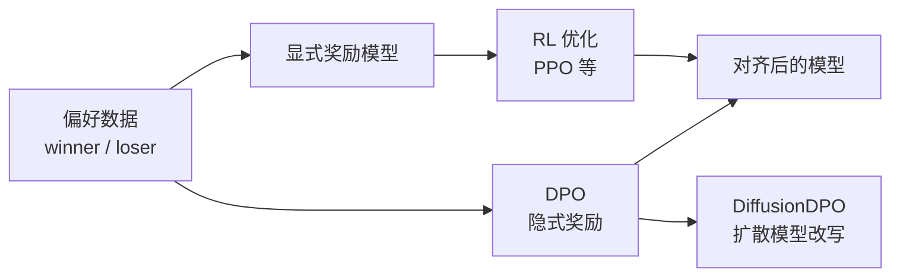
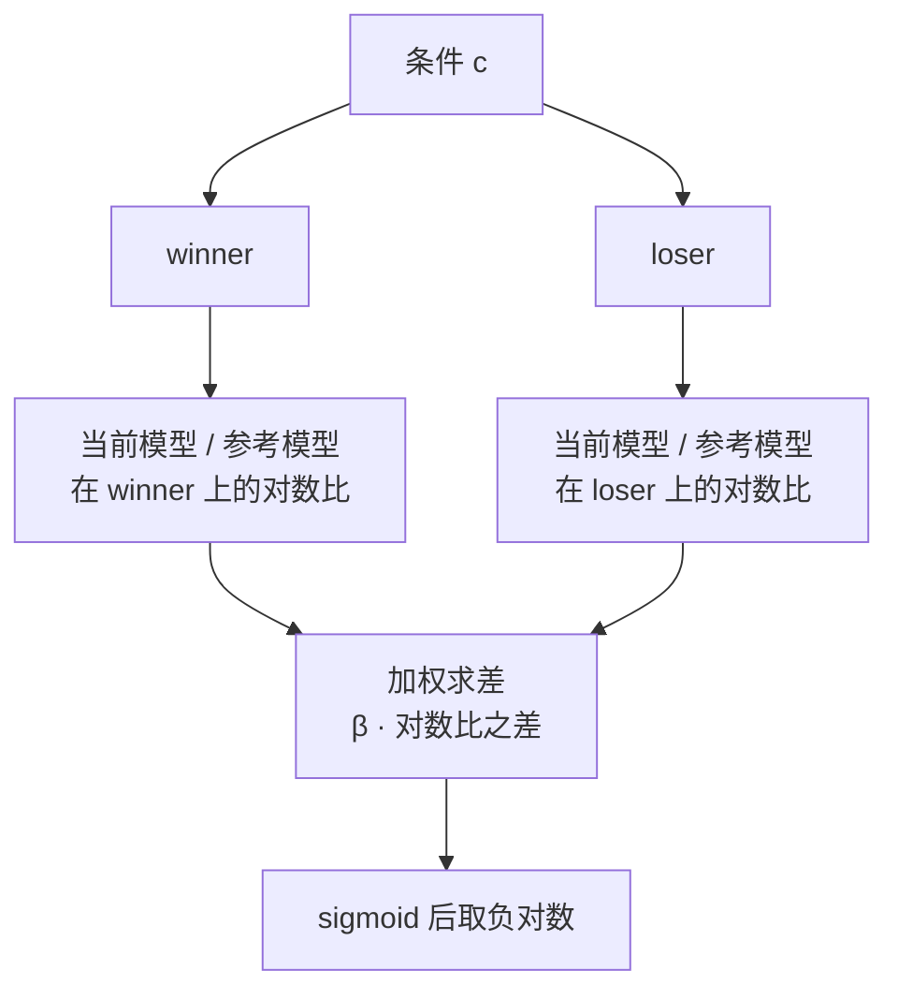
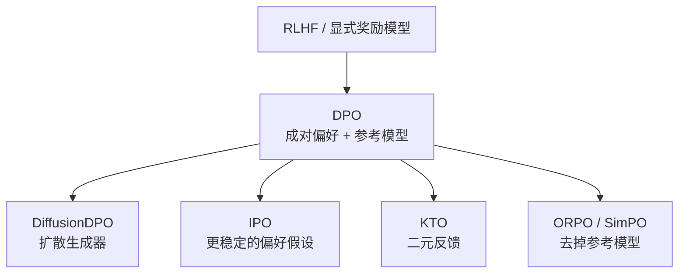

# 直接偏好优化（DPO）

## DPO 解决什么问题

同一个条件下，生成模型往往有多个都说得通的输出。监督微调只把示例的似然推高，无法表达"这两个都行，但我更想要那一个"。而人的**相对判断**（A 比 B 好）通常比写出标准答案更容易收集，于是偏好数据成了对齐阶段最常用的监督信号。

经典路线（RLHF / InstructGPT）分三段：先用偏好数据训练一个显式奖励模型，再用强化学习（如 PPO）在奖励上优化策略，同时用 KL 项约束策略不要偏离参考模型太远。它的代价是奖励模型要单独训练调参，RL 环节对超参敏感、训练不稳定。

DPO 换了一条路：用一次变量替换把奖励直接写成"当前策略与参考策略的对数比"，于是偏好损失可以只关于策略本身，跳过显式奖励模型和 RL 循环，最终退化成一个二分类交叉熵形式的损失。



**结论**：DPO 省掉的是显式奖励模型与 RL 环节，**不省偏好数据**，也不省参考模型——它把复杂度从"多训一个模型 + 一轮 RL"搬到了"多存一份冻结权重"。

读后面公式前先约定几个词：

| 术语 | 含义 |
|---|---|
| 条件 `c` | 采样时的输入（问题、提示、对话上下文或驱动信号） |
| winner `x^w` | 一对样本中更受偏好的那个 |
| loser `x^l` | 一对样本中次之的那个 |
| 当前模型 `π_θ` | 正在被优化的策略 |
| 参考模型 `π_ref` | 冻结的基准策略，通常是优化前的权重 |
| `β` | 偏离参数，控制允许偏离参考模型的程度 |

## 通用 DPO 目标如何比较偏好对

原始 DPO 的训练目标是：

```text
L_DPO(θ) = − E_{(c, x^w, x^l) ~ D} [
             log σ( β · log( π_θ(x^w | c) / π_ref(x^w | c) )
                  − β · log( π_θ(x^l | c) / π_ref(x^l | c) ) ) ]
```

逐个看它的构成：

- `π_θ(·|c) / π_ref(·|c)` 是**当前模型相对参考模型在同一条件下的对数概率变化**；
- 括号里是"winner 的相对变化"减去"loser 的相对变化"，因此被优化的是**相对参考模型的偏移**，而不是任何绝对概率；
- 外层 `log σ(·)` 把"winner 的相对提升是否大于 loser"转成一个可微的损失：只要前者更大，括号内为正，损失下降；
- `β` 控制允许偏离参考模型的程度。`β` 越大，偏离参考分布被惩罚得越重，优化越保守；`β` 越小，模型越敢离开参考分布。



这里有一个容易读错的地方：两个对数比是**各自独立**在完整条件下评估的，DPO 并不会去"生成一个比较器"，也不会给单个样本打一个可累加的绝对分数。它约束的是：相对于参考模型，winner 该被抬高多少、loser 该被压低多少。

## DPO 为什么不需要奖励模型

"不需要奖励模型"不是说奖励消失了，而是奖励被重新参数化进了策略本身。推理链条只有四步。

**第一步**，RLHF 的目标是 KL 约束下的奖励最大化：

```text
max_π  E[ r(c, x) ]  −  β · D_KL[ π(x | c) ‖ π_ref(x | c) ]
```

**第二步**，这个目标存在闭式最优解——偏离参考分布的代价是 `β` 倍的 KL，因此最优策略是在参考分布上按奖励指数加权：

```text
π_r(x | c) = (1 / Z(c)) · π_ref(x | c) · exp( r(c, x) / β )
```

**第三步**，把上式反解，用策略表达奖励：

```text
r(c, x) = β · log( π_r(x | c) / π_ref(x | c) ) + β · log Z(c)
```

**第四步**，把该奖励代回 Bradley-Terry 偏好模型——它把成对偏好概率写成两个奖励的指数比：

```text
p(c, x^w ≻ x^l) = exp(r(c, x^w)) / ( exp(r(c, x^w)) + exp(r(c, x^l)) )
```

代入后 `exp(β · log Z(c))` 在分子分母中被约掉，只剩策略本身的对数比，于是偏好概率变成 `σ(β·log(π/π_ref) 的 winner 项减 loser 项)`——正是上一节的损失。

**结论**：策略网络同时扮演了"生成模型"和"隐式奖励"两个角色；`β · log(π_θ / π_ref)` 就是那个不再单独存在的奖励。理解这一点之后，"DPO 免奖励模型"和"DPO 仍然在优化一个奖励"就不矛盾了。

它没有解决的问题同样重要：

| DPO 解决的 | DPO 未解决的 |
|---|---|
| 不必单独训练显式奖励模型 | 仍需成对偏好数据（winner / loser） |
| 去掉 RL 循环，训练接近监督学习 | 依赖 Bradley-Terry 式假设：成对偏好可约简为点式奖励之差 |
| 有闭式最优解可推导，超参少 | 偏好数据可能被过拟合，也可能被长度等表面特征带偏 |
| 参考模型提供偏离约束 | 参考模型仍需额外一份权重与前向计算 |
| 隐含奖励可用于解释模型倾向 | 偏好信号本身仍要靠人或其他模型提供 |

## 从序列概率到扩散模型

语言模型可以直接算 `log π(y | x)`，DPO 的概率比因此可直接评估。扩散 / 流匹配模型没有这个接口：`p_θ(x_0 | c)` 需要对所有可能的扩散路径 `x_{1:T}` 求边缘，不可解。所以"比较对数概率"这一步必须改写。

DiffusionDPO 的改写分几步：

1. 用 ELBO 引入隐变量链 `x_{1:T}`，把**整条路径**当作被比较的对象，KL 约束相应改为联合路径之间的 KL；
2. 直接对 `p_θ(x_{0:T})` 写出路径级的 DPO 目标；
3. 代入反向过程分解，利用 `−log σ` 的凸性把期望外提，得到逐时间步的界；
4. 用前向过程近似反向过程并化简；
5. 最终落到**去噪预测误差**的比较：

```text
L(θ) = − E log σ( −β T ω(λ_t) [
        ‖ε^w − ε_θ(x_t^w, t)‖² − ‖ε^w − ε_ref(x_t^w, t)‖²
      − ( ‖ε^l − ε_θ(x_t^l, t)‖² − ‖ε^l − ε_ref(x_t^l, t)‖² ) ] )
```

其中 `x_t = α_t x_0 + σ_t ε` 是前向过程加噪后的样本，`ε_θ` 与 `ε_ref` 分别是当前模型与参考模型预测的噪声（等价于去噪向量场），`λ_t = α_t² / σ_t²` 是信噪比，`ω(λ_t)` 是为去噪误差加权的时间函数，实践中常取常数。

方括号内的两项含义与文本版完全对应：

- `‖ε^w − ε_θ‖² − ‖ε^w − ε_ref‖²` 是当前模型相对参考模型在 winner 上的**去噪误差改善**；
- 后面一项同形式地算 loser 的改善；
- 最小化损失就是要求当前模型在 winner 上的改善**多于** loser。


**结论**：扩散版 DPO 把"比较对数概率"换成"比较去噪预测误差"，机制不变，也不需要给扩散模型额外加一个奖励网络。这是把 DPO 用到扩散 / 流匹配生成器上时共用的改写方式；具体到某个模型，还会按自己的加噪约定与损失形式（范数是否平方、有无时间权重）做实例化。一个落在运动隐变量上的实例可参见 [[论文笔记/avatar-forcing|Avatar Forcing 模型笔记]]。

## 常见变体与适用边界

DPO 之后的方法大多在回答同一个问题的不同侧面：参考模型是否必要、偏好数据是否必须成对、损失是否稳定。

| 方法 | 代表工作 | 相对 DPO 的改变 | 处理的问题 |
|---|---|---|---|
| DPO | Direct Preference Optimization（arXiv:2305.18290） | 基线：成对偏好 + 冻结参考模型 | 免去显式奖励模型与 RL |
| DiffusionDPO | Diffusion Model Alignment Using Direct Preference Optimization（arXiv:2311.12908） | 把概率比改写为去噪误差比 | 让 DPO 可用于扩散 / 流匹配生成器 |
| IPO | A General Theoretical Paradigm to Understand Learning from Human Preferences（arXiv:2310.12036） | 用恒等映射替代 Bradley-Terry 式的 sigmoid 损失 | 缓解偏好数据上的过拟合与训练不稳定 |
| KTO | KTO: Model Alignment as Prospect Theoretic Optimization（arXiv:2402.01306） | 只用"好 / 坏"二元标签，不需要成对样本 | 偏好难以凑成对、只有单点反馈时 |
| ORPO | ORPO: Monolithic Preference Optimization without Reference Model（arXiv:2403.07691） | 把监督微调与偏好优化合并为单阶段，去掉参考模型 | 省去单独的 SFT 阶段与参考模型 |
| SimPO | SimPO: Simple Preference Optimization with a Reference-Free Reward（arXiv:2405.14734） | 用序列平均对数概率作隐式奖励并做长度归一化，无需参考模型 | 去掉参考模型，同时缓解长度偏置 |



选择哪一条取决于两件事：偏好数据是成对还是单点，以及能否承担额外一份参考模型的前向开销。除 DPO 这一支之外，RLHF、显式奖励模型以及其他偏好优化路线仍在被使用，DPO 只是它们之中工程接口最简单的一类。

## 术语与符号表

| 术语 | 英文 / 全称 | 含义 |
|---|---|---|
| 偏好优化 | preference optimization | 用相对偏好信号而非单点标注来调整模型 |
| DPO | Direct Preference Optimization | 直接把偏好损失写成策略函数的对齐方法 |
| RLHF | Reinforcement Learning from Human Feedback | 偏好数据 → 奖励模型 → RL 优化的三段式路线 |
| 奖励模型 | reward model | 把响应映射为标量分数的模型；DPO 以隐式奖励替代 |
| 参考模型 | reference model | 冻结的基准策略，约束当前模型不要偏离太远 |
| 隐式奖励 | implicit reward | 由当前策略与参考策略的对数比表达的奖励 |
| Bradley-Terry 模型 | Bradley-Terry model | 把成对偏好概率写成两个奖励指数比的理论模型 |
| ELBO | Evidence Lower Bound | 对数似然的下界，DiffusionDPO 用它改写不可解的概率比 |
| 去噪向量场 | denoising vector field | 生成器预测的量；扩散版 DPO 比较的就是它的预测误差 |

| 符号 | 含义 |
|---|---|
| `c` | 条件（提示、对话上下文或驱动信号） |
| `x^w` / `x^l` | winner（更受偏好）/ loser（次之）样本 |
| `π_θ` / `π_ref` | 当前策略 / 冻结参考策略 |
| `β` | 偏离参数，控制偏离参考模型的程度 |
| `σ(·)` | sigmoid 函数 |
| `Z(c)` | 配分函数，随条件变化的归一化项 |
| `D_KL` | KL 散度 |
| `x_t` | 第 `t` 步加噪后的样本 |
| `ε_θ` / `ε_ref` | 当前 / 参考模型预测的噪声（去噪向量场） |
| `λ_t` | 信噪比 `α_t² / σ_t²` |
| `ω(λ_t)` | 去噪误差的时间权重函数 |
| `T` | 扩散步数 |
