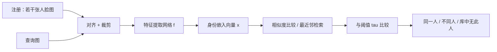
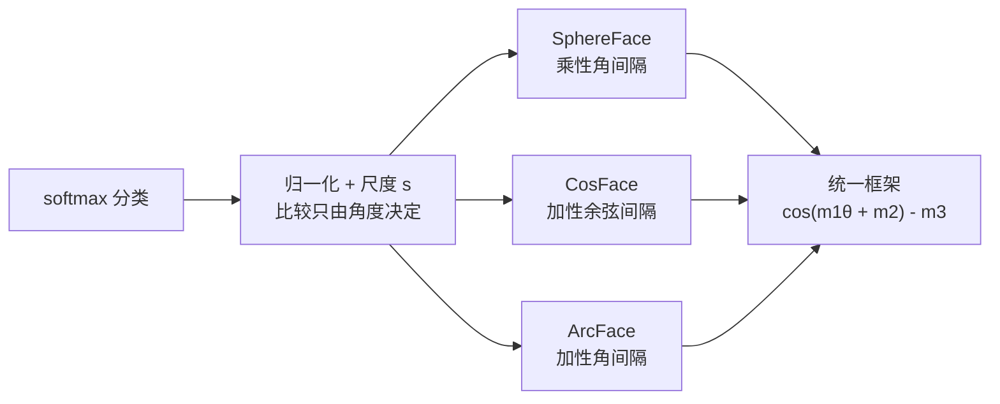
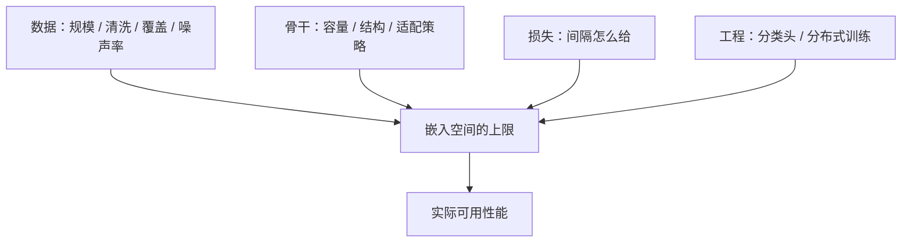
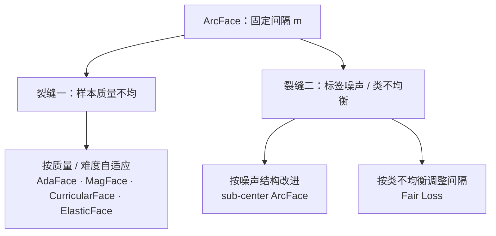
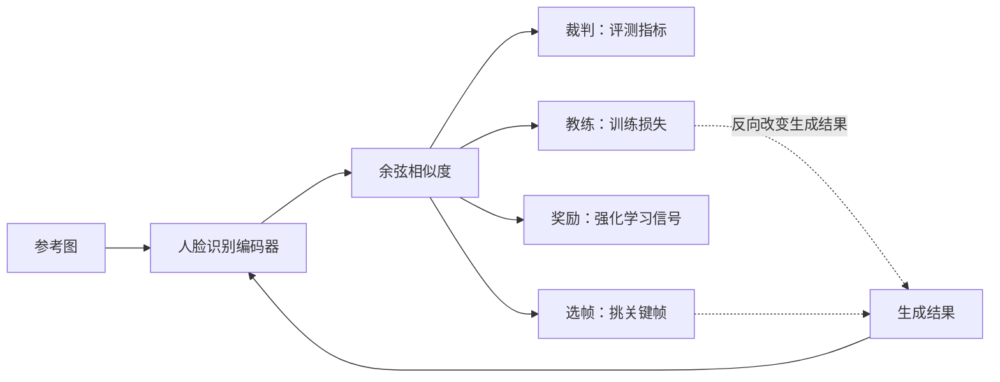

# 人脸身份验证模型

## 身份验证到底在解什么

人脸身份验证（face verification）要回答的是一个判定问题："这两张脸是不是同一个人"。但落地时它通常以三种形态出现，三者的输入输出并不一样：

| 任务 | 形态 | 输入 | 输出 | 典型指标 |
|---|---|---|---|---|
| 验证 | 1:1 比对 | 两张人脸图 + 一个阈值 | 是 / 否 | TAR@FAR、EER |
| 识别 / 检索 | 1:N 检索 | 一张查询图 + 一个注册库 | 排名列表，或"库中没有此人" | CMC、TPIR@FPIR |
| 聚类 | N:N 无监督分组 | 一批未标注人脸图 | 若干身份簇 | 成对聚类指标 |

三者的共同基础是同一个东西：把每张脸映射成一个向量，让"同一个人的向量靠近、不同人的向量远离"，于是判定退化成向量之间的距离比较。

$$\mathbf{x} = f(I) \in \mathbb{R}^{d}, \qquad \text{判定} = \left[\, \mathrm{sim}(\mathbf{x}_a, \mathbf{x}_b) > \tau \,\right]$$

| 符号 | 含义 |
|---|---|
| $I$ | 对齐后的人脸图像 |
| $f$ | 特征提取网络（骨干 + 嵌入层） |
| $\mathbf{x}$ | $d$ 维嵌入向量，通常归一化到单位超球面 |
| $\mathrm{sim}(\cdot,\cdot)$ | 相似度，实践中主流是余弦相似度 |
| $\tau$ | 判定阈值，按目标误接受率标定 |

这里有一个关键的任务错位：**训练时身份类别是固定的，部署时要认的是训练时没出现过的人**。这就是开集（open-set）设定——模型不可能靠"把这个人分到第几类"完成任务，只能靠"嵌入空间本身是否足够可泛化"。

所以训练目标不是分类准确率，而是嵌入空间的几何性质：

- **类内紧致**：同一个人在不同姿态、光照、表情、年龄下的向量要聚拢；
- **类间分离**：不同人的向量之间要有足够大的间隔；
- **跨条件稳定**：上面两条要在没见过的拍摄条件下依然成立。

**结论**：身份验证真正要的是一个**跨身份可比、跨条件稳定的嵌入空间**；"把人分对"只是训练手段，不是目标。理解这一点，后面所有损失函数的设计动机才讲得通。

## 怎么衡量一个验证模型

指标分两族，对应上面两类任务，**不可互换**。

| 族 | 指标 | 含义 | 适用 |
|---|---|---|---|
| 验证 | ROC / TAR@FAR | 把误接受率固定到某个量级（如 $10^{-4}$、$10^{-6}$）时，同一人的通过率有多高 | 门禁、核验等"一对一"场景 |
| 验证 | EER | 误接受率等于误拒绝率时的错误率，单一标量 | 快速横向比较 |
| 识别 / 检索 | CMC（rank-$k$） | 结果前 $k$ 个里命中正确身份的比例 | 闭集检索，没有"查无此人"选项 |
| 识别 / 检索 | TPIR@FPIR | 开集检索：给定误报率下的正确命中率 | 真实 1:N，允许拒识 |

基准的代际演进，本质上是在**不断拆掉前一代的简化假设**：

| 基准 | 补上了什么 | 局限 / 为什么被后一代取代 |
|---|---|---|
| LFW | 非约束场景下的 1:1 验证 | 规模小、基本是单人近景；模型很快逼近饱和，失去区分度 |
| MegaFace | 百万级干扰项下的 1:N 检索与验证 | 仍是照片域，不考察视频与遮挡 |
| IJB-C | 非受限视频、跨姿态、遮挡，以及端到端协议 | 数据不公开、须提交在线评测；但正因如此更接近实际用法 |
| MFR Challenge | 口罩遮挡场景，另设儿童与多种族测试集 | 测试集不公开，只提供在线评分 |
| 数据侧：MS-Celeb-1M → WebFace260M | 训练数据规模上量，并给出自动清洗管线与带时间约束的评测协议 | 反映"数据规模与清洗"对上限的影响（见第四节） |

**结论**：排行榜数字**只在协议内可比**。同一批生成视频换一个人脸识别编码器去算余弦，读数可以差数倍，甚至让模型排名整个翻转——这一点有专门的实测证据，见 [[knowledge/digital-human-identity-consistency|身份一致性：CSIM 的黄昏与度量的新生]]（本页转引其结论，未自行复现）。跨协议、跨编码器、跨数据集的数字不能直接比大小。

## 从分类损失到度量学习

这一节讲嵌入空间是怎么被训出来的。理解这条链，才能理解 ArcFace 究竟解决了什么、又留下了什么。

### 从 softmax 到归一化超球面

最朴素的起点是分类 softmax。设第 $i$ 个样本的特征为 $\mathbf{x}_i$、真实身份为 $y_i$、第 $j$ 类的分类器权重为 $W_j$：

$$L_1 = -\log \frac{e^{W_{y_i}^{T}\mathbf{x}_i + b_{y_i}}}{\sum_{j=1}^{N} e^{W_j^{T}\mathbf{x}_i + b_j}}$$

| 符号 | 含义 |
|---|---|
| $N$ | 训练集身份总数 |
| $W_j$ | 第 $j$ 个身份的分类器权重，可视作该类中心 |
| $b_j$ | 偏置项 |
| $y_i$ | 样本 $i$ 的真实身份标签 |

softmax 只要求"分对"，不要求类内紧致或类间留白；而且特征向量的**模长**会变成判别捷径——模长大的样本天然占优，这与"方向即身份"的部署方式无关。

NormFace 把这条路收干净：令偏置 $b_j = 0$、权重与特征都归一化、特征模长固定为 $s$，内积就退化成角度：

$$L_2 = -\log \frac{e^{s\cos\theta_{y_i}}}{e^{s\cos\theta_{y_i}} + \sum_{j \neq y_i} e^{s\cos\theta_j}}$$

| 符号 | 含义 |
|---|---|
| $\theta_j$ | 特征 $\mathbf{x}_i$ 与第 $j$ 个类中心 $W_j$ 的夹角 |
| $s$ | 特征尺度，决定 softmax 的"锐度" |

到这一步，分类问题被搬到了单位超球面上，判别只由角度决定，径向自由度被消掉。

### 在角上加 margin

归一化解决了"在哪里比较"，没解决"要求多严"。大间隔家族在此基础上要求：正确类别的角度必须**比其他类别明显更近**，才允许被判对。

三种加间隔的方式，差别只在"加在哪"：

| 方法 | 间隔形式 | 直觉 | 代价 |
|---|---|---|---|
| SphereFace | $\cos(m\theta_{y_i})$ | 乘性角间隔 | 目标 logit 在低角度处曲线极陡，训练初期不稳定，需退火等策略配合 |
| CosFace | $\cos\theta_{y_i} - m$ | 加性**余弦**间隔 | 间隔加在余弦域，换算回角度后非线性，没有恒定测地距离的几何含义 |
| ArcFace | $\cos(\theta_{y_i} + m)$ | 加性**角度**间隔 | 多一次 $\arccos$ 与三角运算，开销可忽略 |

ArcFace 的损失即：

$$L_3 = -\log \frac{e^{s\cos(\theta_{y_i} + m)}}{e^{s\cos(\theta_{y_i} + m)} + \sum_{j \neq y_i} e^{s\cos\theta_j}}, \qquad \theta_{y_i} = \arccos\!\left(W_{y_i}^{T}\mathbf{x}_i\right)$$

| 符号 | 含义 |
|---|---|
| $m$ | 角度间隔：要求正确类别的夹角额外让出 $m$ 弧度 |
| $\theta_{y_i}$ | 特征与正确类中心的夹角 |

三者其实是同一个公式的特例：

$$L_4 = -\log \frac{e^{s\left(\cos(m_1\theta_{y_i} + m_2) - m_3\right)}}{e^{s\left(\cos(m_1\theta_{y_i} + m_2) - m_3\right)} + \sum_{j \neq y_i} e^{s\cos\theta_j}}$$

| 符号 / 设定 | 含义 |
|---|---|
| $m_1$ | 乘性角间隔系数 |
| $m_2$ | 加性角间隔 |
| $m_3$ | 加性余弦间隔 |
| $(1,\, m,\, 0)$ | 即 ArcFace（加性角间隔） |
| $(m,\, 0,\, 0)$ | 即 SphereFace（乘性角间隔） |
| $(1,\, 0,\, m_3)$ | 即 CosFace（加性余弦间隔） |

**为什么"加在角度上"更干净**：归一化超球面上，角度 $\theta$ 与球面弧长 $L$ 满足 $L = s\theta$——弧长与角度成正比。因此在角度上加 $m$，等价于在球面上把特征与类中心推开一段**固定弧长** $s \cdot m$，这个间隔是恒定、线性、各向同性的。乘性角间隔随 $\theta$ 非线性变化，加性余弦间隔换算到角度域后同样非线性，都不具备这种"恒定测地距离"的性质。

### 尺度与间隔各控制什么

两个超参各管一件事：

- $s$ 控制判别的**锐度**。它同时缩放所有类别的 logit：太小则分布平缓、判别力弱；太大则训练不稳定。论文的常用设定是 $s = 64$。
- $m$ 控制要求的**角间隔**。太小判别力不足；太大则类内被过度压缩、训练更难。论文在 $0.4 \sim 0.55$ 之间扫描后取 $m = 0.5$。

**结论**：归一化 + 大间隔是当前主流范式，ArcFace 是其中几何解释最干净的代表，但**不是唯一**——下一节的改进都建立在"间隔该怎么给"这同一个问题上。

## 决定上限的不只是损失

把损失选对只是一个变量。同一套损失换掉数据或骨干，收益常常大于换损失函数。

**数据**。规模与清洗同等重要：MS-Celeb-1M 把训练数据规模推上一个量级；WebFace260M 从网上收集 400 万身份 / 2.6 亿张图，再用自动清洗管线筛出 200 万身份 / 4200 万张图，并给出带时间约束的评测协议来贴近实际部署。覆盖面同样关键——VGGFace2 刻意在姿态、年龄、光照、族裔、职业上拉开分布，并用自动 + 人工两级过滤压低标签噪声。而噪声压不住是常态：公开的大规模噪声集上标签错误率可达 47% 以上，这正是下一节"噪声鲁棒"支线存在的理由。

**骨干**。从改进版 ResNet（无 bottleneck）一路到轻量网与 Transformer：MobileFaceNets 用不到 100 万参数、约 4 MB 的模型，在精细清洗后的 MS-Celeb-1M 上用 ArcFace 训练，单模型即可在 LFW 与 MegaFace 上接近大型模型的水平。TransFace 则指出 Transformer 类骨干在超大规模身份数据上反而脆弱——根因是常规数据增强与难样本挖掘会破坏人脸结构信息、浪费局部 token，于是补上 patch 级增强与对应的难样本挖掘策略。

**大规模分类器的工程代价**。分类头 $W$ 的参数量随身份数 $N$ 线性增长，logit 的显存与计算同理。当身份数到千万级，全量 softmax 即使骨干放得下也已不可行。Partial FC 的做法是：**保留全部正类中心，每个 batch 只激活采样出来的负类子集**，再把分类器切分到多卡、在各自分片内采样——既减少矩阵乘与 logit 存储，又免掉跨卡同步类梯度。其后续工作改用稀疏更新，顺带降低了类间冲突概率、缓解长尾分布。

| 影响因素 | 具体形态 | 代表做法 |
|---|---|---|
| 数据规模与清洗 | 百万图 → 亿级图；自动清洗管线 | MS-Celeb-1M、WebFace260M |
| 数据覆盖 | 姿态 / 年龄 / 光照 / 族裔分布 | VGGFace2 |
| 标签噪声 | 网络爬取数据的错标率可达 47% 以上 | sub-center ArcFace（见下一节） |
| 骨干容量与结构 | 从重骨干到轻量网、Transformer | MobileFaceNets、TransFace、GhostFaceNets |
| 分类头工程 | 参数量 / logit 显存 / 计算随 $N$ 线性增长 | Partial FC 及其后续 |

**结论**：**先看数据与骨干，再谈损失选型**。损失决定"在给定数据上还能压榨出多少判别力"，数据与骨干决定天花板在哪。

## 自适应 margin 与鲁棒性改进

### 固定 margin 在哪两处不成立

ArcFace 对所有类别、所有样本使用同一个 $m$。这个假设在真实数据上至少有两处裂缝：

1. **样本质量不均**。模糊、遮挡、小脸、极端光照的样本本身信息不足，却和清晰正脸吃同样的强约束——它们被强行推向类中心，产生并不可靠的梯度。
2. **标签噪声与类别不均衡**。错标样本被强行拉向错误的类中心，梯度被放大后污染整个类；同时长尾分布下"每类都该让出同样大的间隔"也不成立。

围绕这两处裂缝，改进分成两支。

### 按样本质量与难度自适应

这一支不改结构，只改"间隔给多少、力度多大"：

| 方法 | 核心改变 | 处理的问题 | 适用场景 |
|---|---|---|---|
| CurricularFace | 把课程学习嵌进损失：早期主攻易样本，后期逐步强调难样本 | 难样本挖掘"要么没强调、要么过早强调" | 大规模训练、难负样本多 |
| AdaFace | 用特征范数近似图像质量，按质量调节对难样本的强调力度 | 低质样本被同等硬约束 | 模糊 / 低分辨率 / 遮挡 / 监控视角 |
| MagFace | 让嵌入**模长**编码质量，并自适应地拉易样本、推难样本 | 质量差异导致性能下降；同时要在识别之外给出质量 | 需要质量评估或拒识的场景 |
| ElasticFace | 把固定间隔放松为弹性（随机）间隔 | 类间 / 类内测地距离不可能用同一个固定间隔学好 | 希望提升泛化、缓解固定间隔僵化 |
| Fair Loss | 用强化学习为每个类学各自的间隔 | 固定间隔忽略类不均衡 | 长尾、类别样本数悬殊 |
| SFace | 用两个 sigmoid 梯度重标定函数分别控制类内 / 类间约束 | 低质训练图不该被严格优化 | 训练集质量参差、过拟合风险高 |
| UniFace | 把"最小正相似 > 最大负相似"直接写成损失约束 | softmax 不保证存在统一可分阈值 | 需要统一阈值判定的部署形态 |

### 按噪声结构改进

这一支不动间隔，动类中心的结构。**sub-center ArcFace** 给每个类配 $K$ 个子中心，样本只需靠近其中任意一个（取相似度最大的那个子中心），再套用角度间隔：

$$\theta_j = \arccos\!\left(\max_{k} W_{j,k}^{T}\mathbf{x}_i\right)$$

| 符号 | 含义 |
|---|---|
| $K$ | 每个身份的子中心个数 |
| $W_{j,k}$ | 第 $j$ 个身份的第 $k$ 个子中心 |
| $k$ | 对 $K$ 个子中心取最大相似度的那个下标 |

机制上它是一次自发分区：干净样本聚成 dominant 子类，困难样本与噪声被"兜"进 non-dominant 子类，互不干扰。隔离效果可以被量化——$K=1$ 时 dominant 子类内噪声占比 38.47%，$K=3$ 时压到 12.40%。这条支线还顺带给出了一条零人工标注成本的清洗管线：先用 $K=3$ 训练，再丢弃 non-dominant 子中心与高置信噪声样本，然后在干净子集上用标准 ArcFace 从零重训。子中心数需要权衡：太小容错不足，太大稀释类内紧致。

**结论**：ArcFace 之后这条线的主线是**让间隔更懂数据**，而不是造出一个在所有场景都更好的单一替代品。默认基线仍可从 ArcFace 起步；图像质量差的场景优先对比 AdaFace 与 MagFace；身份数到千万级则叠加 Partial FC 这类工程方案。

**"后面哪一个模型全线比 ArcFace 更强"这个问题没有答案**，原因不在"还没做出来"，而在于下面四点：

- **常规基准已经饱和**：LFW / YTF 这类指标早已贴顶，可比较的空间只剩小数点后两三位，真正的区分度转移到难子集与低工作点（如 IJB-C 的 $10^{-4}$ 以下）；
- **提升是按分布分叉的**：AdaFace / MagFace 赢在低质与遮挡，sub-center ArcFace 赢在高噪声数据，Partial FC 赢在规模可行性（不是精度），TransFace 赢在 Transformer 骨干——没有一个覆盖全部质量分布、全部协议、全部骨干；
- **交叉比较不可控**：论文报告的收益常常同时换掉了训练数据、骨干与清洗管线；这三样不对齐时，"比 ArcFace 强"往往只是"数据更好"（见第四节）；
- **工作点会改变排名**：把误接受率从 $10^{-4}$ 换到 $10^{-6}$ 或 $10^{-8}$，排序可能发生变化（第二节已给过同一现象在其他场景的实测证据）。

所以公平的比较必须写明三个前提：**同一份训练数据、同一个骨干、同一个协议与工作点**。只有在这个前提下，"某方法在某个子分布上更强"才是可检验的说法；脱离这三个前提去问"谁全线更强"，得到的通常是数据规模或骨干容量的差异，而不是方法本身的差异。

## 作为数字人度量与损失时，人脸识别模型的边界

### 从"验证照片"到"评价生成"

前面所有模型都有一个共同前提：输入是**真实照片**，任务是**判定两张照片是否同一人**。数字人这一侧把它挪了过来，场景却变了：

- 被评价的对象是**生成结果**，可能是动漫、素描、油画、赛博朋克；
- 关心的问题不是"是不是同一人"，而是"生成有没有保持参考身份"；
- 参考图与生成帧之间天然存在姿态、表情、尺度的合法变化，而这些都不该被算成身份变化。

模型的训练分布没有覆盖这些条件。这正是后面所有失效的**共同根因**：不是模型坏了，而是它被用在了分布之外。

### 四种挪用角色

同一把"余弦相似度"尺子在生成侧被当成四种角色使用，这是分数语义失真的直接来源：

- **裁判**：作为 benchmark 的身份维度——最常见，也最容易被误读为客观；
- **教练**：作为训练损失直接优化生成模型；
- **奖励**：作为强化学习的奖励信号；
- **选帧**：用相似度挑关键帧，再用同一把尺子给自己打分。

一把尺子同时承担这四者，分数语义就会失真："更高的相似度"未必等于"身份保持更好"，也可能只是"更会讨好这把尺子"。

### 失效的机理

| 失效 | 机理 | 触发条件 |
|---|---|---|
| 照片域依赖 | 编码器的判别依赖照片域的纹理与灰度统计；风格化改变的正是纹理与配色，这些变化在嵌入空间里与身份变化同向 | 动漫 / 3D 渲染 / 素描 / 油画等非照片参考或输出 |
| 时序漂移被平均掉 | 单帧相似度是静态量，帧对之间的关联结构不在它的表达范围内；用随机帧对汇总会系统性低估端到端漂移 | 长视频、片头与片尾的外观渐变 |
| 环境不鲁棒 | 光照、姿态属于"不该改变身份"的变量，却会移动嵌入；编码器没有对这些变量做不变性约束 | 侧脸、强光、硬阴影、跨机位 |
| 长时演变无法处理 | 嵌入容量有限，年龄、妆造、医美带来的变化被编码成身份差异；而现有评测的锚（参考图 / 首帧）全是静态的 | 跨年龄、跨阶段的长时跟踪 |
| 度量循环性 | 尺子同时当损失、奖励与打分器时，优化目标与评测指标同源，高分可能只代表"更会讨好这把尺子" | 用同一编码器既训又评 |

这些机制的量化证据，以及它们在不同 benchmark 上的具体读数，已在 [[knowledge/digital-human-identity-consistency|身份一致性：CSIM 的黄昏与度量的新生]] 中系统整理；本页只做机理层面的归纳，不复制数字。

### 必要条件而非充分条件

由此得到三条可直接使用的判据：

1. **身份指标只作必要条件**：指标不过一定不行；指标过了不代表可用。
2. **必须配人工检查与动作稳定性检查**：实测中出现过身份分更高、但人眼观察画面在抖的反例（见 [[数字人概述/数字人身份|数字人身份]] 的 Learned Anchor Force 一组）。
3. **跨域使用必须显式声明度量边界**：风格化、长时、跨环境场景不能拿照片域的读数直接比。

**结论**：人脸识别模型的训练分布决定了它在哪里有效。把它挪到数字人侧当度量或损失用时，它是一个**有用但需要标注边界的必要条件**，不是真理。

## 场景到模型的选型对照

| 场景 | 推荐起点 | 理由 | 注意 |
|---|---|---|---|
| 照片域 1:1 验证 / 常规 1:N 检索 | ArcFace 系基线 | 几何最干净、工具链与预训练权重最成熟 | 按目标误接受率标定阈值，别只看 rank-1 |
| 模糊、遮挡、低照度、监控视角 | AdaFace 或 MagFace | 前者按质量调间隔；后者让模长编码质量并支持拒识 | 训练集的质量分布要与目标场景接近 |
| 训练数据噪声大、清洗困难 | sub-center ArcFace | 用子中心隔离噪声，并顺带得到自动清洗管线 | 子中心数 $K$ 要调，太大稀释类内紧致 |
| 类别长尾、样本数悬殊 | Fair Loss 一类按类调间隔的做法 | 间隔随类不均衡自适应 | 引入额外学习环节，训练更复杂 |
| 千万级以上身份库 | ArcFace + Partial FC | 损失不变，只把分类头改成采样 + 分片 | 采样率是精度与吞吐之间的取舍 |
| 轻量端侧 | MobileFaceNets、GhostFaceNets 一类 | 参数量与体积小，配 margin 损失仍可达可用精度 | 精度与容量的权衡按端上算力实测 |
| 超大数据集 + Transformer 骨干 | TransFace 一类做过数据侧适配的方案 | ViT 在人脸识别上需要专门的增强与难样本策略 | 直接套用通用视觉配方会退化 |
| 生成侧评测 / 风格化域 | 可从 ArcFace 系起步，但必须声明边界 | 照片域仍是最成熟的默认尺子 | 风格化域上它会失效，需要感知类或专用度量补位 |

**结论**：默认从 ArcFace 系基线起步，然后按**数据质量、数据规模、是否跨域**三个维度分叉；任何一项选择都要配套与场景匹配的评测协议和人工检查。

## 术语与符号表

| 术语 | 英文 | 含义 |
|---|---|---|
| 人脸验证 | face verification | 1:1 判定两张脸是否同一人 |
| 人脸识别 / 检索 | face identification / retrieval | 1:N 在注册库中查找最近邻 |
| 开集 | open-set | 待识别身份不在训练类别中 |
| 注册库 / 查询 | gallery / probe | 检索时的底库与查询样本 |
| 嵌入 | embedding | 人脸图经网络得到的高维向量 |
| 角度间隔 | angular margin | 在角度上加的惩罚项 |
| 测地距离 | geodesic distance | 超球面上两点之间的大圆弧长 |
| 部分 FC | Partial FC | 每步只激活部分负类中心的分类头训练方式 |
| 子中心 | sub-center | 每个身份配多个类中心，用于隔离噪声 |

| 符号 | 含义 |
|---|---|
| $I$ | 对齐裁剪后的人脸图像 |
| $f$ | 特征提取网络 |
| $\mathbf{x}_i$ | 第 $i$ 个样本的嵌入向量 |
| $W_j$ | 第 $j$ 个身份的分类器权重（类中心） |
| $N$ | 训练集身份总数 |
| $y_i$ | 样本 $i$ 的真实身份 |
| $\theta_j$ | 特征与第 $j$ 个类中心的夹角 |
| $s$ | 特征尺度，控制 logit 锐度 |
| $m$ | 角度间隔 |
| $m_1, m_2, m_3$ | 统一框架下的乘性角间隔 / 加性角间隔 / 加性余弦间隔 |
| $K$ | 每个身份的子中心个数 |
| $\tau$ | 判定阈值 |
