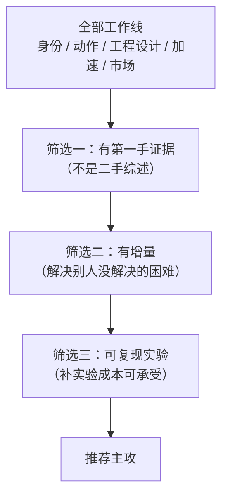

# 总结

## 实习背景与主线

方向是**会议面试官数字人**。要回答的核心问题就一句：**实时、可控、可插拔的数字人系统怎么做出来。**

主线分五段：

时间轴（关键节点）：

| 时间 | 节点 |
|------|------|
| 06-01 | 入职，确定数字人方向 |
| 06-08 | 技术方案调研启动（2D talking-head / 3D 高斯头像 / 扩散式生成三条路线） |
| **06-22** | 调研完成：确定以前馈式 3D 资产方案为主要方向；同期评测框架落地（脚手架 / 核心接口 / 指标 / CLI / 报告，177 项单测通过） |
| 06-24 | FlashHead 接入与推理管线打通 |
| 07-06 | 梳理并行方向：卡通数字人 / 产品调研 / 评测框架优化 / 模型部署测试 / 对话评测集 |
| 07-09 | 评测能力扩展，FlexAvatar 接入 |
| 07-13 | 竞品调研与选型确认 |
| 07-25 起 | CyberVerse 侧主线：流式接入 → 卡死修复 → 实时性测量 → 编码链路 → 二级修复 → 内存与稳定性 → 实时性改进系列 |

**这五段的关系**：调研与选型决定方向，接入把模型变成可替换的插件，优化让链路真的能跑，治理解决"跑起来之后质量会漂"的问题。前两段是判断，后三段是工程与实验。

## 核心工作导览

每条一句话：**问题 → 方法 → 结果**。

- **身份**：长视频里脸会逐渐漂移 → 先把漂移拆成"模长撑开"与"方向游走"两个假说逐个测 → 模长被否证、方向游走得到单身份支持；推理期锚点引导把 300 秒的身份相似度从 0.645 提到 0.935。详见 [[数字人概述/数字人身份|数字人身份]]
- **动作**：原模型听不懂中文音频，眼嘴也分不开 → 蒸馏桥 + 几何约束 + 关系蒸馏，另外把 Ditto 的眼嘴控制拆成四层机制 → 同步指标优于对照锚；并明确了可控性是四层叠出来的。详见 [[数字人概述/数字人动作|数字人动作]]
- **工程设计**：生成帧是裁剪区域要贴回原画面，还要稳定发出去 → 贴回六阶段设计 + 传输与发布设计 + 音频链路与生命周期兜底 → 丢包隐藏占比从 3.6% 降到 0.022%，会话约 35 秒回收。详见 [[数字人概述/工程设计|工程设计]]
- **数字人加速**：GPU 预算只剩几毫秒余量 → 分"生成侧"与"系统侧"两条路径分别压 → Decoder 推理提速 4.2×，首响应从 3.5s 到 2.9s；同时明确"局部变快 ≠ 用户侧变快"。详见 [[数字人概述/数字人加速|数字人加速]]
- **行业全景**：要知道市场做到哪一步、我们用的是什么位置 → 五层技术栈 + 开源与产品侧调研 + 未采纳与待复跑清单 → 得出"实时 + 可插拔 3D/扩散模型"这一段是当时缺口。详见 [[数字人概述/数字人行业全景|数字人行业全景]]

## 工作方法沉淀

这一节是给未来的自己用的——哪些做法值得复用。

**任务树管理。** 每项任务写清四件事：**目标、范围、验收标准、非目标**。尤其"非目标"最有价值：它挡掉了范围蔓延（例如"性能优化本身"被明确列为非目标，避免测量任务变成调优任务）。进展按时间追加，状态如实标注——**进行中不写成已完成**。

**负结论与正结论同等保留。** 我们有几条"失败"是有分量的：
- 打断后立即止声：**四个版本全部被推翻**（画面冻结 / 长度难调 / 尾音被一起丢弃）——它给出的判据是"这条链路的正确性由人眼与听感决定"
- 训练期参考条件化：v1 干净失败（训练库含答案 + 尾层注入容量不足），v2 多 seed 回退（同步退化）
- 一次"不可用"的结论被自己的复测推翻（显存不是瓶颈，主机内存才是）

**证据等级。** 待复跑 → 初步观察 → 已复现 → 已否决。每档规定"能写什么、不能写什么"：只有口头观察就不写分数与排序，避免把印象写成结论。

**探针与消融。**
- **先审计注入位置，再做消融**：把挂载点从"三个轴"改成路径后缀精确匹配，并在训练前打印命中清单——否则消融结果不可信
- **隐式表示靠扰动观察反推控制**：眼、嘴的控制索引不是模型给的标签，而是逐维扰动看画面变化后建立的映射
- **先分层定位瓶颈再决定改哪一层**：音频表征 / 桥 / 生成 / 渲染 / 评测口径，各层分别 probe

**共享脚手架协作。** 通用能力（隐藏项配置、文档系统、列表排序等）标为共享项并登记回灌，避免每个项目重造；同时把"什么该进共享层"的判断写进文档，而不是留在个人记忆里。

## 量化成果总表

数字全部来自前七篇，逐项标注来源；本篇不做二次加工。

| 主题 | 关键数字 | 来源 |
|------|---------|------|
| **身份** | 模长假说被否证（各臂模长近乎恒定）· 方向游走 **+2.1°/min**（峰值离参考 24.8°）· 锚点引导 300 秒相似度 **0.645 → 0.935** · 训练期条件化 v2 同步退化 · 学习式锚力指标更高但人眼头抖 | 数字人身份 |
| **动作** | 桥系列同步指标 **6.299 / 8.853**（对照锚 6.122 / 9.044，多域 257 clips）· 注入点收益 **+0.39** · 全开放 4.565 对纯桥 5.719 对桥内 LoRA 5.483 · 眼嘴控制索引各 5–6 维 | 数字人动作 |
| **工程设计** | 丢包隐藏 **2.5–3.6% → 0.022%** · 发布节奏稳态 **1.000** · 会话 **35 秒**归零、空闲 3 分钟卸载 · 插件每周期残留 **约 1.4GB** · 进程 RSS **9.8 → 20.5GB**（基准路径恒 6.6GB）· 贴回 p95 **67.3 → 12.7ms**、RTF 0.698 → 0.588、TTFF 1.39 → 1.18s、像素 max diff 为 0 | 工程设计 |
| **数字人加速** | GPU **38.5ms/帧 vs 40ms 预算（96%）** · Decoder **4.2×** · 首响应 **3.5 → 2.9s** · 编码耗时拆解 **679ms**（进程与初始化约 400ms 为主）· 大模型方案在 A10 上是 **0.8–0.9 FPS**（主机内存要求 ≥110 GiB） | 数字人加速 |
| **平台资产** | 论文库 **117 篇** · 知识库 **52 个文件** · 复盘文档 **8 篇**（本篇为收口篇）+ 论文笔记库骨架 · 共享层回灌项：1 项已回灌、3 项待回灌 | 本仓库 |

## 选型结论

调研分两步：先做三路线初筛，得出以前馈式 3D 资产方案为主要探索方向；再在实际链路里收敛到最终体系：

**CyberVerse（实时 Agent 框架）+ AvatarForcing / Ditto（模型插件）**

依据：

- **主线落在"动作空间 + 快速渲染器"**：算力集中在运动生成上，便于实时化与逐区域控制
- **3D 资产侧优先前馈式**：单图建资产、成本低、适合快速换形象（专人训练类资产不适合频繁换形象）
- **可插拔**：框架把模型变成插件，换模型不改链路

代价与未选：

| 未选 | 原因 |
|------|------|
| 整帧视频基座路线 | 全画幅表达强，但训练与推理都重，实时化困难 |
| 3DGS / NeRF 专人资产 | 身份可复用、质量高，但换形象要重训 |
| 多卡大模型方案 | 效果可能与算力成正比，但硬件门槛直接排除 |

## 趋势判断

每条都标了是**观察**还是**推断**：

1. **模型层与推理层的开源共生**（观察）：开放权重的语音模型与开源多模态推理框架在互相适配——一边开放权重、一边为其做优化，形成对闭源 API 的集体反制
2. **开源做底座、闭源做产品**（观察）：数字人视频层的底层模型几乎全是中国团队开源；企业视频的 SaaS 商业化由海外公司领跑。这更像产业链上下游分工，而不是谁打败谁
3. **芯片厂商沿技术栈向上渗透**（观察 + 推断）：有厂商同时横跨算力、推理框架与数字人微服务，并反向投资推理云。"卖铲子"正在变成"卖整条流水线"——**方向清晰，但节奏无法预测**
4. **"合成问题"正在变成"编辑问题"**（推断）：从"生成一段说话视频"转向"改内容、改表情强度、动注视点、改语速，同时保持身份"——这条方向公开工作还很薄
5. **实时性的瓶颈会继续留在系统层**（观察 + 推断）：模型侧的算力红利很容易被音频窗口与传输吃掉；谁把系统编排做好，谁才真正可用

## 选题漏斗

把全部工作倒进漏斗，三层筛选：

判据说明：

- **第一手证据**：我们自己跑出来的数字与结论，而不是转述别人的
- **增量**：相对已有工作，是不是解决了一个具体的困难（而不是又刷了一遍指标）
- **可复现**：补实验需要多少硬件与时间——这条最容易被忽略，却能直接决定一篇论文能不能收尾

## 候选 A 身份漂移的诊断与治理

- **主张**：把"身份漂移"从现象拆成可测的维度（模长 / 方向 / 尺度），给出推理期锚点引导的有效性与边界，并附失败裁决
- **已有证据**：三段模长表（否定模长撑开）· 夹角曲线（方向游走 **+2.1°/min**）· 锚点引导 **0.645 → 0.935** · 两组失败（训练期条件化、学习式锚力）
- **缺口**：结论来自**单身份 300 秒**轨迹，跨身份未验证；尺度漂移目前只有工程侧的归一化处理，缺机制解释
- **要补的实验**：多身份 × 多素材复核夹角结论；治理手段在同一判据下消融（身份 / 同步 / 动作稳定性三项 + 人工检查）
- **撞车风险**：**中**——库内最近邻是"大姿态身份一致性"与"ID 一致人脸基座"这类生成机制改进工作，我们做的是"诊断维度 + 推理期治理 + 失败裁决"，角度不同；但身份一致性本身是热区，投稿时需明确差异化

## 候选 B 流式 Talking-Head 系统论文

- **主张**：系统层的工程设计本身可以成文——贴回设计、发布节奏、音频链路、会话生命周期与可观测
- **已有证据**：贴回三轮迭代与参数化 · 丢包隐藏 **3.6% → 0.022%** · 发布节奏稳态 1.000 · 贴回像素 max diff 为 0 · 跨端定位方法（把发布时长 / 节奏 / 丢包隐藏放到同一条时间线上）
- **缺口**：目前都是工程指标，**缺一套系统级指标体系**来支撑论文叙事
- **要补的实验**：与一个开源实时系统做同协议对照（端到端延迟分解 + 主观质量评测）
- **撞车风险**：**高**——库内已有多个流式 talking-head 工作（含我们接入的 AvatarForcing 本体、SoulX-FlashHead、LeapTalk 的延迟-质量权衡）与 Ditto 的实时化；必须把增量锚在"系统层设计与跨端可观测"，而不是"模型更快"

## 候选 C 数字人评测基准

- **主张**：身份 / 同步 / 动作的评测口径混乱，可以做一套**协议明确、可复现**的数字人评测
- **已有证据**：三族尺子的梳理与失效分析 · 口径不统一的具体数字（同一模型换评测子集读数 0.46–0.73、跨 benchmark 0.466 → 0.242）· 我们自己踩过的评测坑（口径混用、锚定方式不一致）
- **缺口**：要做多模型同协议评测，**评测协议、锚定方式与编码器选择都得自己定**，前期成本高
- **要补的工作**：定协议并小范围试跑；补齐长时与跨环境指标；把"指标口径"写成可执行规范
- **撞车风险**：**中**——既有工作是单点指标或大规模 benchmark；我们的切口是"协议一致性 + 小规模但同协议的多模型对照"，可行但需要明确与既有 benchmark 的差异

## 候选 D 动作分层与听态生成

- **主张**：动作是分层能力（音唇 → 情绪与听态 → 手部/全身），当前层的**听态**缺乏评价口径，是可以切进去的空位
- **已有证据**：桥系列的中文适配结果 · 眼嘴拆分的四层机制 · 听态的实现路径（双路条件编码，把"用户在做什么"与"avatar 要说什么"编成同一种条件）
- **缺口**：**听态没有评价指标**；手部与全身未接入
- **要补的实验**：设计并验证听态的评价口径；情绪可控性的可编辑接口（改内容 → 换情绪 → 调强度）
- **撞车风险**：**中低**——库内最近邻是"统一听说的端到端方案"和"实时共语手势"；听态评价这一块相对空白，但单点创新强度需要再论证

## 决策建议

**优先级**：**A > D > B > C**。

- **A 先做**：证据最完整（有正结论也有失败裁决）、补实验成本最低（多身份复核即可），最容易形成闭环
- **D 次之**：切口明确（听态评价空白），但需要先解决"怎么评"这个前置问题
- **B 价值高但难**：系统设计有真东西，但撞车风险高、缺系统级指标体系，需要先决定指标体系怎么建
- **C 排队**：需要自建评测，前期成本最高，适合在其他方向稳定后再做

**下一步 30 天清单**：

1. 多身份复核夹角结论（候选 A 的关键缺口）
2. 听态评价口径的设计与最小验证（候选 D 的前置）
3. 候选 B 的同协议对照方案（选对手、定指标、定场景）
4. 候选 C 的最小重跑范围评估（几个模型 / 几套指标才不会失控）
5. 把"探针与消融"流程写成可复用的检查表（新模型接入时固定动作）
