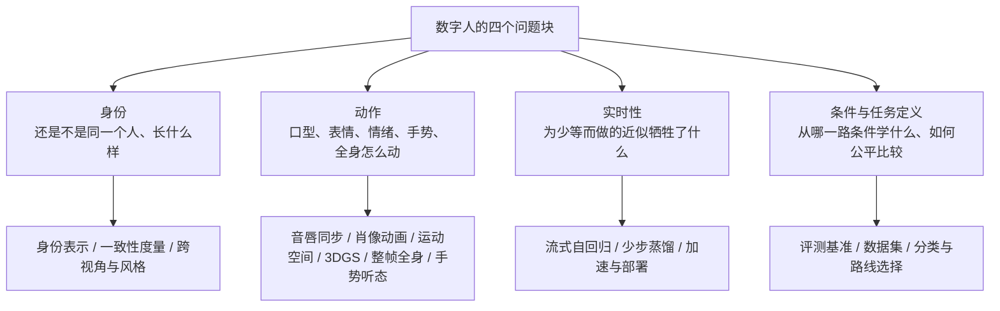
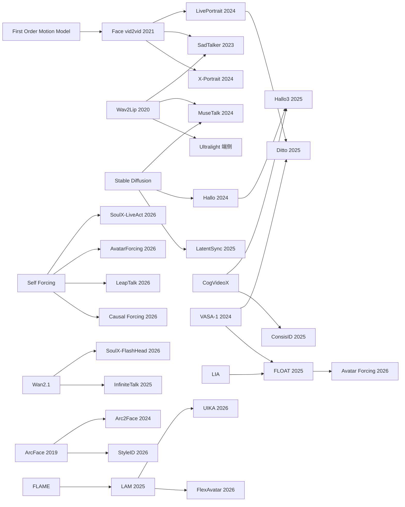
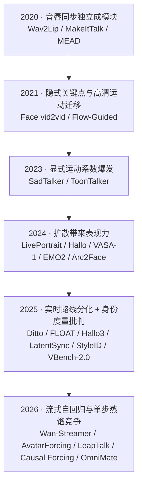

## 这份地图回答什么

这份文档不做「某一篇论文讲了什么」的复述，而是把数字人方向已有的一百多篇调研文章横向拉通，回答三个问题：**每篇文章提出的问题是什么、它用什么解法回答、这些工作之间谁继承了谁。**

与同目录既有文档的分工：

| 文档 | 回答什么 | 本文档的处理 |
|---|---|---|
| 数字人介绍与技术路线 | 数字人是什么、有哪几条路线、两个核心因素 | 只沿用其路线命名，不重述定义 |
| 数字人领域问题 | 当前真正难在哪里、已有解法到哪一步 | 本文只补关键问题，不重述其数字 |
| 数字人身份、数字人动作、数字人加速 | 项目自身的实测与治理 | 不复述其数字，表格「笔记」列指向详读 |
| 本文档 | 每篇的问题-解法对、技术分线、继承谱系、机构与时间 | 以 110 条结构化记录为唯一数据源 |

文末的《论文信息对总表》不是手写的，而是由同名 sidecar JSON（`数字人关键技术地图.json`）的 `papers` 字段驱动渲染：表支持按列排序、按方法族筛选、关键词搜索与分页，改数据即可更新，不必改正文。

## 语料与方法

语料由三部分去重合并，共 **110 条**：

| 来源 | 数量 | 说明 |
|---|---|---|
| 博客 `AI/数字人` 已发布 | 100 | 论文精读 67 + 系列综述 19 + 工程解读 10 + 评测/产业 4 |
| 库内 `论文笔记/` 独有论文 | 9 | Face vid2vid、FLOAT、FPSAttention、Causal Forcing、OmniMate、Talker-T2AV、Vorch-Streamer、BLADE、ZipAR 等博客未覆盖者 |
| 手工补录 | 1 | Causal Forcing++（arXiv 2605.15141，博客仅作摘要收录，无独立精读） |

每条记录的结构单元是一个**问题-解法对**：一篇文章可以提出多个问题，因此 `qa` 是一个数组，每个元素含 `question` 与 `answer`。全部 110 条共抽出 **162 组问题-解法对**。

抽取口径：

- `question` 是这篇文章**自己提出的**核心问题，不是泛泛的领域问题；`answer` 是它给出的主要技术解法。
- 粒度取「关键文章多句、次要文章一句」：有库内笔记的重点工作 `question`/`answer` 各可两到三句，其余一句。
- 时间分两列：`blog_date` 是博客精读发布日，`year` 是论文发表年（arXiv v1 或会议年）。下文时间线一律用 `year`。
- 机构与 venue 优先取自文章 frontmatter 的 `hero_sub`，缺失时从正文与参考来源补全；补不到的显式标「未标注」或留空，不臆造。
- `derives_from` 只记录语料中确有依据的继承/借鉴关系（如 LivePortrait 继承 Face Vid2vid），不做推测。

## 关键任务与问题空间

数字人的技术分线围绕四个问题块展开，与 [[数字人概述/数字人领域问题|数字人领域问题]] 的分类对齐：

一句话概括本领域的张力：**画质、可控、实时、长时稳定这四件事几乎两两冲突**。后面的每一条分线，本质上都是在其中做取舍。

## 关键技术地图

每条分线统一给出：问题 → 方法族 → 代表工作（机构 · venue/时间）→ 边界。表格中的「继承自」一列用于快速看出谱系。

### 音唇同步与视频配音

**问题**：给定一段已有视频和一段新音频，如何让嘴型精确对上声音，同时不改变人物的头动、表情与背景？这是最早独立、也最容易上线的一支。

代表工作：

| 工作 | 机构 · 时间 | 解法要点 | 继承自 |
|---|---|---|---|
| Wav2Lip | IIIT Hyderabad · ACM MM 2020 | 用唇读预训练的同步专家判别器（架构同 SyncNet）做监督，5 帧时间窗对齐音素 | SyncNet |
| MuseTalk | TMElyralab · arXiv 2024 | 冻结 VAE + 单步 latent inpainting（只重绘脸部 ROI），两阶段训练拆开重建与对抗目标 | Wav2Lip、Stable Diffusion |
| LatentSync | ByteDance / 北交大 / Monash · ICCV 2025 | 用 StableSyncNet 解决潜空间扩散的捷径学习问题 | SyncNet、Stable Diffusion 1.5 |
| InfiniteTalk | MeiGen-AI · arXiv 2025 | 稀疏帧配音：保留少量关键帧锚定身份，其余交给音频驱动全身生成，滑窗接力做无限长 | MultiTalk、Wan2.1 |
| Ultralight-Digital-Human | 工程解读 | 遮嘴重建 + MobileNetV2 深度可分离卷积，塞进手机端 | Wav2Lip |

**边界**：这一支只重绘嘴部与脸部 ROI，原片动作全保留，因此最稳、最易上线，但也最「像贴图」——它不解决表情、头动与身体的表达。

### 2D 肖像动画与运动空间

**问题**：只有一张照片时，模型必须自己生成表情、头动与眼动；直接从音频回归像素会得到表情寡淡的「平均脸」，如何解耦出可控的运动？

代表工作：

| 工作 | 机构 · 时间 | 解法要点 | 继承自 |
|---|---|---|---|
| MakeItTalk | UMass Amherst × Adobe Research · SIGGRAPH Asia 2020 | speaker-aware，把语音内容与说话人身份解耦，跨域驱动卡通角色 | AutoVC、VisemeNet |
| Face vid2vid | NVIDIA · CVPR 2021 Oral | 无监督可分解 3D 隐式关键点：头姿 6 个 + 表情形变 3K 个标量，身份 canonical 关键点跨帧复用 | First Order Motion Model |
| SadTalker | 西安交大 / 腾讯 AI Lab · CVPR 2023 | 嘴型走确定性 ExpNet、头姿走条件 PoseVAE 采样，再驱动 3D-aware 渲染器 | Wav2Lip、Face vid2vid |
| LivePortrait | 快手 · arXiv 2024 | 在 Face vid2vid 框架上加可缩放运动变换与拼接/眼唇重定向模块 | Face vid2vid |
| AniPortrait | 腾讯游戏知几 · arXiv 2024 | 音频 → 3D 中间表示 → 扩散肖像动画 | AnimateAnyone、ControlNet |
| X-Portrait | ByteDance · SIGGRAPH 2024 | 用视频的 RGB 驱动信号作表达力条件，跨身份迁移表情 | Face vid2vid、ControlNet |
| LIA-X | Shanghai AI Lab / Inria · ICCV 2025 | 用稀疏运动字典把运动解耦成可解释因子，edit-warp-render | LIA |
| PerformRecast | 虎鲸文娱 · CVPR 2026 | 用 3DMM 把表情与头部姿态解耦，做肖像视频编辑 | LivePortrait、FLAME |

**边界**：运动空间路线以低维、可控制的运动序列为中间表示，天然适合流式与实时，但表达上限受运动空间容量约束，且身份纹理依赖参考图或渲染器。

### 隐式关键点与潜空间导航

**问题**：显式 landmark 稀疏、显式 3DMM 受参数空间限制，能否学到更隐式、更可控的运动表示？这一支常被混为一谈，其实是**两条不同的线**：

- **隐式 3D 关键点线**：First Order Motion Model → Face vid2vid → LivePortrait。运动被表示为学到的 3D 关键点及其形变，身份由 canonical 关键点跨帧复用。
- **潜空间导航线**：LIA → LIA-X。不用关键点，而是把运动表示为潜空间线性导航 $z_{s\to d}=z_{s\to r}+w_{r\to d}$，LIA-X 再用稀疏运动字典把位移分解为可单独的语义因子。

两条线都属「表示 + warp + render」、都不是 diffusion、也都把身份留在源图侧，但**表示形态不同，且没有直接继承关系**——LIA-X 的前身是 LIA，不是 Face vid2vid。**边界**：隐式关键点的几何含义靠探针显影、可解释性弱；潜空间导航的可解释性依赖稀疏约束，而 LIA-X 的稀疏/解耦只有定性证据。

### 3D 头像：NeRF / 3DGS / 参数模型

**问题**：固定身份的高保真数字人需要真正的三维可渲染资产，如何在秒级从少量甚至单张图前馈重建、并实时驱动？

代表工作：

| 工作 | 机构 · 时间 | 解法要点 | 继承自 |
|---|---|---|---|
| LAM | 通义实验室 · arXiv 2025 | 把高斯建在 FLAME canonical 空间，细分到 8 万点继承 blendshape，纯 3D 实时 | GAGAvatar、FLAME、DINOv2 |
| AniGS | 阿里巴巴 + 中山大学 · CVPR 2025 | 视频生成模型出多视角 canonical，再用 4D 高斯做不一致重建 | CogVideoX、4D Gaussian Splatting |
| LHM | 阿里巴巴通义实验室 · ICCV 2025 | 前馈 Transformer 秒级生成可动画 3D 人体 | AniGS、LRM |
| UIKA | 蚂蚁集团 & 南京大学 · CVPR 2026 Highlight | UV 引导的显式对应建模，任意数量无位姿图像一次前馈成高斯头 | Pixel3DMM、LAM |
| MATCH | ETH Zürich / Google · CVPR 2026 | 预测 UV 对齐的密集语义对应，把创建时间从 45 小时压到 4.6 小时 | GEM、Avat3r、FLAME |
| FlexAvatar | 清华大学 + 字节 PICO · CVPR 2026 | 无位姿照片前馈重建，UV 空间解码高频表情形变 | DINOv3、LAM、FLAME |
| HyperGaussians | ETH Zurich · CVPR 2026 | 高维高斯提升人脸虚拟人的表达力 | 3D Gaussian Splatting、FlashAvatar |
| EmoTaG | MSU / Qualcomm / UNC · arXiv 2026 | FLAME-Gaussian 空间 + 情绪残差分支，5 秒个性化说话头 | Real3D-Portrait、MimicTalk、FLAME |
| CapTalk | 东京大学 / Snap Research · arXiv 2025 | 文本描述控制 3D 说话头的风格与情绪 | FaceFormer、CodeTalker |
| ARTalk | 东京大学 MI Lab · SIGGRAPH Asia 2025 | 多尺度自回归生成实时 3D 头部动画 | VAR、CodeTalker |

**边界**：3DGS 路线的单图泛化仍不可靠，头发、口腔等边界区域是主要失败点；参数模型（FLAME/3DMM）提供了解剖约束，但也限制了表达上限。

### 扩散基模与整帧 / 全身生成

**问题**：把自由度从嘴部扩大到身份、脸、身体、手势与背景，通用视频扩散基模怎样被音频、参考身份与流式状态约束成数字人生成器？

代表工作：

| 工作 | 机构 · 时间 | 解法要点 | 继承自 |
|---|---|---|---|
| Hallo | Fudan / Baidu / ETH Zurich / NJU · arXiv 2024 | 分层音频视觉对齐，生成高质量说话肖像 | Stable Diffusion 1.5、AnimateDiff |
| Hallo3 | Fudan Generative Vision Lab / Baidu · CVPR 2025 | 视频扩散 Transformer 驱动的高动态肖像动画 | Hallo、CogVideoX |
| HunyuanVideo-Avatar | 腾讯混元 · arXiv 2025 | 多角色高保真音频驱动，MM-DiT 架构 | HunyuanVideo、Sonic |
| OmniAvatar | arXiv 2025 | 把音频注入视频 latent 的全身数字人 | Wan2.1 |
| One Shot, One Talk | arXiv 2024 | 从单张照片造可渲染全身 Avatar | MimicMotion、Portrait4D-v2 |

**边界**：自由度越大失败空间越大——身份漂移、手部畸变、背景闪烁、手势与语义不符、唇音同步衰减会同时出现；全身生成主流转向 DiT，但必须配套蒸馏、量化与流式系统才能落地。

### 实时流式、自回归与蒸馏

**问题**：这是本领域最热、也最工程的一支。双向扩散延迟高，改成自回归流式又会因暴露偏差导致长时漂移、身份崩坏；如何在固定延迟预算下同时拿到即时响应与长程稳定？

代表工作：

| 工作 | 机构 · 时间 | 解法要点 | 继承自 |
|---|---|---|---|
| SoulX-FlashHead | Soul AI Lab · arXiv 2026 | 1.3B 主干 + oracle 双向蒸馏，长时自回归不漂移 | Wan2.1、DMD |
| SoulX-LiveAct | Soul AI Lab · arXiv 2026 | Neighbor Forcing 让所有 block 共享扩散步、KV 可复用；ConvKV 把历史压成定长 | Self Forcing、Wan2.1 |
| Avatar Forcing | KAIST · arXiv 2026 | FLOAT 运动空间块因果 Diffusion Forcing + 免标注 DPO，交互延迟约 0.5 秒 | FLOAT、Diffusion Forcing |
| AvatarForcing | 快手 Kling AI Research · CVPR 2026 | 有界前瞻 + 双锚 KV Cache，34 ms/帧、分钟级稳定 | Self-Forcing |
| LeapTalk | arXiv 2026 | 布朗桥把 noise-to-data 改为 data-to-data，单步蒸馏到 200 FPS | Self-Forcing |
| Causal Forcing | 清华 / ShengShu 等 · ICML 2026 | 指出 ODE 初始化的理论缺陷，改用自回归教师做因果蒸馏 | Self Forcing、CausVid |
| Causal Forcing++ | 清华 / ShengShu 等 · arXiv 2026 | 用因果一致性蒸馏（causal CD）做少步 AR 初始化：单次在线教师 ODE 步做监督，免存完整 PF-ODE 轨迹；逐帧 1–2 步 | Causal Forcing |
| Wan-Streamer | Alibaba Wan Team · arXiv 2026 | 单个 block-causal Transformer 统一六路流，文本/音频/视频联合建模 | Qwen2.5、Wan、Moshi |
| Live Avatar | 阿里巴巴 Quark · ECCV 2026 | 14B 扩散模型的实时流式无限长生成 | Wan-S2V、Self Forcing |
| OmniMate | 西安交大 + 中国电信 AI · arXiv 2026 | 生成进度控制器 GPC 控制「说多久」，多参考模块锁跨模态身份 | OmniAvatar、LTX-2.3 |
| Vorch-Streamer | Vorch Team · 2026 | 在 22B 双向音视频基座上做三阶段后训练成流式生成器 | LTX-2.3 |
| Teller | Shanghai Soulgate · CVPR 2025 | 自回归运动 token 做实时流式肖像动画 | LivePortrait |

**边界**：蒸馏真正省下的是并发预算，而不是无代价提速——少步蒸馏后的质量—速度边界、长时漂移的起始时刻与加速度，仍是开放问题。Causal Forcing 与 Avatar Forcing 在「diffusion forcing 是否适合训 AR 学生」上给出了相反结论，说明这一支尚无定论。

这一支内部有一条清晰的三代继承链：**Self Forcing**（两阶段：ODE 蒸馏 + asymmetric DMD）→ **Causal Forcing**（换用因果教师做 ODE 蒸馏）→ **Causal Forcing++**（改用 online 一致性蒸馏初始化，把设定推到逐帧 1–2 步）。

### 动作生成：口型 / 表情 / 手势 / 听态 / 全身

**问题**：口型之外，「怎么动」还包含情绪、听态、手势与全身协调。手势与语音是语义级弱对应（同一句话可有多种动作），比音唇同步难得多。

代表工作：

| 工作 | 机构 · 时间 | 解法要点 | 继承自 |
|---|---|---|---|
| DiffSHEG | HKUST / IDEA · CVPR 2024 | 扩散模型同时生成表情与手势 | DiffGesture、DiffuseStyleGesture |
| EMO2 | arXiv 2025 | 把手当作语音表达的末端执行器 | AnimateDiff |
| SentiAvatar | RUC / SentiPulse · arXiv 2026 | LLM 规划语义关键帧 + 音频填充节奏细节 | — |
| UniLS | Shanda AI Research Tokyo · CVPR 2026 | 首个端到端统一「说-听」数字人 | FLAME |
| 手部生成专题 | 系列综述 | 归纳 3D 参数空间 / 2D 像素空间 / 级联三条路线 | — |

**边界**：听态长期被忽略；手势的动作学评价与语义对齐指标仍不成熟。

### 身份表示与身份一致性

**问题**：「像不像」不是一个分数。同一段视频在不同人脸编码器下可能给出相差很大的相似度；照片域的人脸识别模型遇到卡通、大姿态、特殊光照时测到的往往只是外观相近。

代表工作：

| 工作 | 机构 · 时间 | 解法要点 | 继承自 |
|---|---|---|---|
| ArcFace | Imperial College London 等 · CVPR 2019 Oral | 加性角度间隔损失，人脸识别的分水岭 | SphereFace、CosFace、NormFace |
| Arc2Face | Imperial College London × FAU · ECCV 2024 Oral | 把 ArcFace 身份嵌入直接变成生成条件 | Stable Diffusion 1.5、ArcFace |
| ConsisID | PKU-YuanGroup · CVPR 2025 Highlight | 频率分解的身份保持文生视频 | CogVideoX、IP-Adapter |
| MoFE | 上海交大 & 腾讯优图 & NUS · arXiv 2025 | 多面部专家融合攻克大姿态身份一致性 | ConsisID、Wan2.1 |
| StyleID | KAIST VML · SIGGRAPH 2026 | 风格化无关的人脸身份识别度量与基准 | ArcFace、CLIP |
| ID-Sim | MIT CSAIL × Adobe Research · CVPR 2026 | 学出对背景/视角/光照不敏感、只对身份敏感的度量 | DINOv3、LPIPS |
| CDFS / StyleDiT | Tencent AI Lab / Academia Sinica | 可控后代人脸合成与统一子代/配偶合成 | CAAE / StyleGAN2 |

**边界**：CSIM（ArcFace 余弦）被同时当作裁判、训练 loss、RL 奖励与选帧器，分数语义已失真；「对画质敏感」与「对身份敏感」是两条不同的敏感轴，必须分开输出。相关缺口见 [[技术介绍/face-verification-models|人脸身份验证模型]] 与 [[knowledge/digital-human-identity-consistency|身份一致性]]。

### Agent 化与后端系统

**问题**：生成模型只解决「会动的脸」，如何把 ASR、LLM、TTS、口型驱动、WebRTC 推流、记忆与工具调用拼成一个能实时对话、还能调用工具的数字人系统？

代表工作：

| 工作 | 机构 · 时间 | 解法要点 | 继承自 |
|---|---|---|---|
| EMO-Avatar | BUPT / Team AI4AI · ACM MM 2025 | 用 LLM Agent 把共情回复变成会说会动的数字人 | ESC framework |
| SmartAvatar | HKUST & Dartmouth · arXiv 2025 | VLM 智能体驱动的 3D 人体头像生成 | HumGen3D |
| Ex-Omni-2D | CUHK-Shenzhen / LIGHTSPEED · arXiv 2026 | 对话原生的全模态视觉存在对话模型 | Wan2.1、OmniAvatar |
| 工具增强型数字人 Agent | 专题 | 数字人调用工具、MCP 与互操作协议 | — |
| 后端 Agent 设计 | 专题 | 级联/端到端/混合、延迟预算、双工与记忆 | — |

**边界**：后端 Agent 的设计空间在 8 个维度上尚未收敛；「人作为可调用工具」与工具使用优化仍是前沿。

### 工程化、加速与部署

**问题**：模型只是链路的一环。延迟到底花在哪一段、什么卡能跑到什么程度、瓶颈在模型还是在编码与传输？

代表工作：

| 工作 | 机构 · 时间 | 解法要点 |
|---|---|---|
| FPSAttention | Monash / DAMO / ZIP Lab · NeurIPS 2025 Spotlight | 量化与稀疏在训练期联合优化，视频扩散端到端约 5× 加速 |
| CyberVerse | 工程解读 | 三进程划界（Go 编排 / Python 推理 / Vue 前端）+ 插件化模型 |
| OpenAvatarChat + LiteAvatar | 工程解读 | Handler Pipeline 编排 + 纯 CPU 30fps 的 2D 口型驱动 |
| 推理 Benchmark 汇总 | 工程解读 | A10 单卡实测 FPS/显存，纠正 LiveAct「不可用」的旧结论 |
| 实时性 GPU 对比 | 系列综述 | 30+ 模型分四档硬件，拆五个延迟环节并给选型决策树 |
| 训练全景 | 系列综述 | 7 大 Loss 族 × 5 条路线 × 12 个系统 |

**边界**：FPS 只是必要条件——必须同时报告音频窗口长度与首帧延迟，因为首帧常由音频窗口而非模型推理决定。

### 评测、数据集与度量

**问题**：惯用的 FID/FVD/SyncNet/CSIM 真的与人类感知相关吗？当指标饱和后，评测的下一个前沿是什么？

代表工作：

| 工作 | 机构 · 时间 | 解法要点 |
|---|---|---|
| MEAD | SenseTime / NTU / CMU / CASIA · ECCV 2020 | 60 演员 × 8 情绪 × 3 强度的情绪 talking face 数据集 |
| VBench-2.0 | 上海 AI Lab + NTU S-Lab + 中山大学 · arXiv 2025 | 面向「内在忠实性」的视频生成基准套件，18 项能力 |
| OpenS2V-Nexus | 北大深研院 / Rochester / Rabbitpre · arXiv 2025 | 主体到视频生成的七类任务 × 六维指标，暴露 copy-paste 捷径 |
| THEval | Inria / 上海 AI Lab · CVPR Findings 2026 | 八指标框架，证明传统指标与人类偏好不显著相关 |
| 4DHumanQA | Inria · arXiv 2025 | 第一个经人类感知验证的 3D 动画质量度量 |
| DSL-FIQA | Snap Research / 台湾大学 · CVPR 2024 | 双集合退化学习与关键点引导的人脸图像质量评估 |
| Face Consistency Benchmark | TCL Research · PP-RAI 2025 | GenAI 视频的角色面部一致性专项基准 |

**边界**：没有单一评测器全能；自动指标无法替代主观用户研究。评测的与人类感知脱节，是这一领域最系统性的问题之一。

### 风格化、卡通与跨域

**问题**：当目标不是「像真人」时，为真人设计的模型与指标会同时失效；卡通数据稀缺、与真人又没有配对样本。

代表工作：

| 工作 | 机构 · 时间 | 解法要点 | 继承自 |
|---|---|---|---|
| ToonTalker | 清华深研院 / 腾讯 AI Lab / 蚂蚁集团 · ICCV 2023 | 无配对数据下的真实↔卡通双向人脸重演，用类比约束保证语义一致 | Perceiver、FOMM、LIA |
| Co-Speech NPR | Sony · SIGGRAPH 2025 | 语义优先的动漫角色共语音手势生成，含约 130 类符号化表情 | — |
| GenEAva | Boston University / Georgetown · IEEE FG 2025 | 135 类细粒度表情卡通头像数据集与生成 | SDXL、DCTNet、POSTER |
| MakeItTalk | UMass Amherst × Adobe Research · SIGGRAPH Asia 2020 | speaker-aware 跨域说话头（见上） | AutoVC、VisemeNet |

**边界**：FID/SyncNet/ArcFace 在卡通域全部失效，主张以 User Study/MOS/2AFC 为主。详见系列综述《卡通与风格化数字人》。

### 产业与产品图谱

**问题**：支撑实时数字人的产业链由哪些层构成，每层靠什么竞争？

这一支把整条链条拆成五层技术栈：语音模型（可控 TTS/声音克隆与全双工语音 LLM）、推理框架（SGLang/vLLM/TensorRT-LLM）、数字人视频（开源说话头模型对企业级视频平台）、Agent 平台与实时通信（CyberVerse/Pipecat/LiveKit）、云与算力（NVIDIA GPU 与 serving）。

**边界**：许可证与合规约束常被低估；开源与闭源在每一层同时竞争。详见 [[数字人概述/数字人行业全景|数字人行业全景]]。

## 技术谱系与继承关系

这是本文档相对其他调研最独特的一块：数字人的多数工作并非凭空出现，而是在少数几个「根节点」上不断改造。下面画出主要继承链。

几条关键继承链值得单说：

- **隐式关键点链**：First Order Motion Model → Face vid2vid → LivePortrait → {Ditto, ChatAnyone, PerformRecast, JoyVASA}。Face vid2vid 用无监督可分解 3D 隐式关键点把运动压成标量，LivePortrait 在其上加可缩放运动变换与拼接/重定向，Ditto 又把它的 265 维运动空间当作扩散目标——**这是全领域最清晰、影响最大的一条链**。
- **音唇同步链**：SyncNet → Wav2Lip → {MuseTalk, LatentSync, Ultralight, SadTalker 的同步约束}。Wav2Lip 把同步专家判别器引入监督，后续工作几乎都在这条线上改中间表示或训练方式。
- **扩散基模链**：Stable Diffusion/AnimateDiff → Hallo → Hallo3，以及 CogVideoX → {AniGS, ConsisID, Hallo3}。整帧生成基本都建立在通用视频扩散基座上。
- **流式蒸馏链**：Self Forcing → {AvatarForcing, SoulX-LiveAct, LeapTalk, Causal Forcing, Live Avatar}。2026 年的实时工作几乎都在同一个蒸馏母题下竞争，但结论尚未收敛。
- **FLAME/3DGS 链**：FLAME → LAM → {UIKA, FlexAvatar, MATCH, EmoTaG}。参数模型提供解剖骨架，高斯提供表达。
- **身份度量链**：ArcFace → {Arc2Face, StyleID, ID-Sim, VBench-2.0 的 Human Identity}。新度量普遍想把身份与画质、风格、视角解耦。

## 演进时间线（2020—2026）

一句话总结：**2020 解决「嘴对上」，2021 解决「单图动起来」，2024 用扩散换表现力，2025 开始算实时账，2026 全面进入流式自回归与蒸馏的路线之争。**

## 机构与团队分布

主要机构（按在语料中的代表工作统计）：

| 机构 | 代表工作 | 方向 |
|---|---|---|
| ByteDance | X-Portrait、LatentSync（与北交大/Monash）、字节 PICO | 肖像动画、音唇同步、3D 头像 |
| 阿里巴巴 / 通义 | LAM、LHM、AniGS（与中山大学）、Live Avatar、Wan-Streamer | 3DGS 资产、实时流式 |
| 腾讯 | 混元 HunyuanVideo-Avatar、腾讯 AI Lab（SadTalker 合作）、腾讯游戏知几 | 整帧生成、肖像动画 |
| 快手 / Kling | LivePortrait、AvatarForcing | 运动空间、流式自回归 |
| KAIST | FLOAT（与 DeepBrain AI）、Avatar Forcing、StyleID | 运动隐空间、身份度量 |
| Soul AI Lab | SoulX-FlashHead、SoulX-LiveAct | 实时流式与蒸馏 |
| Microsoft Research | VASA-1 | 整体面部动力学 |
| 蚂蚁集团 | Ditto、UIKA（与南京大学）、EMO-Avatar 相关 | 运动空间、3D 头像 |
| ETH Zürich / Google | MATCH、HyperGaussians | 高斯头像与配准 |
| MIT CSAIL / Adobe | ID-Sim、MakeItTalk | 身份度量、跨域说话头 |
| Inria / 上海 AI Lab | LIA-X、THEval、4DHumanQA、VBench-2.0 | 肖像动画、评测 |
| 清华 / 上海交大 / 复旦 / 中科大 / 南京大学 | FlexAvatar、MoFE、Hallo、Causal Forcing | 高校侧主力 |

两组观察：

- **工业界负责把方法做成能跑的产品**（快手、阿里、字节、腾讯、Soul），**高校与研究机构负责度量与理论**（KAIST、ETH、MIT、Inria、上海 AI Lab）。
- 中国团队在运动空间与实时流式上贡献密集；欧洲机构在身份度量与评测基准上更系统。

## 关键问题补充

以下是语料中反复出现、而既有问题清单未覆盖或未收口的条目。每条给出「为什么关键 / 现有解到哪一步 / 还缺什么 / 语料证据」。

### 说话风格与情绪的连续可控

**为什么关键**：对话场景要的是「像这个人、表达这个情绪、强度和风格可调」，而不是「有没有表情」。**现有解**：CapTalk 用文本描述控制风格与情绪，StyleTalk++ 尝试统一说话风格控制，MEAD 提供情绪强度数据，GenEAva 提供 135 类表情。**还缺**：风格强度目前多是离散档或文本条件，缺连续、可解释的强度轴与跨角色的通用性。

### 听态与双向交互

**为什么关键**：真实对话里听的时间不比说少，但多数数字人只在「说」时有反应。**现有解**：UniLS 做统一说-听，OmniMate 支持静默倾听，Avatar Forcing 覆盖听/说/注视多种状态。**还缺**：听态的表达度天然低于说话，且缺评价标准。

### 全双工流式因果性与首帧/持续延迟权衡

**为什么关键**：级联式「理解→生成→事后对齐」靠工程修补恢复不了低延迟全双工。**现有解**：Wan-Streamer 用单 Transformer 统一六路流，AvatarForcing 用有界前瞻换稳定性，LeapTalk 用布朗桥单步化。**还缺**：严格因果下的长时崩溃是结构性的，有界前瞻与稳定性的最优折中尚无共识。

### 动作表示（motion latent）的可解释与可编辑

**为什么关键**：低维运动空间带来了实时与可控，但「哪一维管什么」往往是黑盒。**现有解**：Ditto 的运动空间、LIA-X 的稀疏运动字典、VASA-1 的整体面部动力学 latent。**还缺**：可解释性依赖探针，尚无通用的语义编辑接口。

### 少步 / 单步蒸馏后的质量—速度边界

**为什么关键**：蒸馏真正省下的是并发预算，但激进少步会牺牲什么并不清楚。**现有解**：FlashHead 的 oracle 蒸馏、LeapTalk 的单步布朗桥、AvatarForcing 的两阶段流式蒸馏。**还缺**：质量—速度—稳定性的三维边界还没有统一报告口径。

### 长时身份漂移的起始时刻与加速度

**为什么关键**：身份漂移不是标量，它有模长、方向、尺度多个维度，平均值会掩盖真实失败。**现有解**：Avatar Forcing 的锚帧库与方向约束、双锚 KV Cache、CSIM 的批判性讨论。**还缺**：漂移的起始时刻与加速度尚无标准刻画；相关缺口见 [[数字人概述/数字人身份|数字人身份]]。

### 评测与人类感知脱节

**为什么关键**：THEval 证明 FID/FVD/SyncNet/LMD 与人类偏好不显著相关，甚至 SynNet 训练的 Wav2Lip 在用户研究中最差。**现有解**：THEval 八指标、4DHumanQA 的感知验证度量、VBench-2.0、OpenS2V-Nexus。**还缺**：没有单一评测器全能，自动指标无法替代主观研究。

### 端侧 / 纯 CPU 实时

**为什么关键**：不是所有场景都有数据中心 GPU。**现有解**：LiteAvatar 纯 CPU 30fps、Ultralight 塞进手机。**还缺**：端侧方案普遍牺牲表达力与全身能力，缺「端侧 + 3D/扩散」的可行路径。

### 多人 / 双人对话场景的身份归属

**为什么关键**：真实会议与访谈是多人的。**现有解**：HunyuanVideo-Avatar 支持多角色，DyStream 面向双人 talking head。**还缺**：多人身份归属错误（张三的脸长在李四身上）尚无专门判据。

### 手部与全身协调的动作层级

**为什么关键**：全身生成把自由度扩大一个量级。**现有解**：手部生成专题归纳三条路线，EMO2 把手当末端执行器，One Shot One Talk 造可渲染全身资产。**还缺**：手部在像素空间欠拟合、跨部位协调难，且缺动作学评价。

### 文本驱动 / 语义动作

**为什么关键**：从「跟得上语音节奏」到「说得对、动得对」是质变。**现有解**：CapTalk 文本控风格，SentiAvatar 用 LLM 规划语义关键帧，工具增强 Agent 引入语义层。**还缺**：语义与动作的对应是弱约束，评价标准缺失。

### 3DGS 单图泛化的可靠性边界

**为什么关键**：单图生成可动画资产是产品化的关键一步。**现有解**：LAM、AniGS、LHM、MATCH 把重建压到秒级。**还缺**：头发与口腔等边界区域仍不可靠，泛化边界未被量化。

### Agent 工具调用与全模态对话

**为什么关键**：数字人要成为「存在」而非「一张嘴」，必须能调用工具、感知环境。**现有解**：Ex-Omni-2D 的对话原生全模态、EMO-Avatar 的共情 Agent、SmartAvatar 的 VLM 生成 Agent。**还缺**：工具使用与实时生成的耦合尚无稳定架构。

> 这些条目全部写入本文档；后续如需沉淀进 [[数字人概述/数字人领域问题|数字人领域问题]]，再单独回流。

## 论文信息对总表

下表由同名 sidecar JSON 的 `papers` 字段驱动渲染：支持列排序、按方法族筛选、关键词搜索与分页；「笔记」列把有库内详细解读的文章引向对应笔记。改 JSON 即可更新，无需改正文。

<!-- papers-table -->

## 附录：抽取方法与未获取项

**抽取流程**（脚本 `scripts/collect_dh_paper_units.py`，可复跑）：

1. **扫描博客**：解析 `~/gongshangzheng.github.io/src/pages/*.html` 中 `aliases` 含 `categories/AI/数字人` 的页面，得到骨架。
2. **扫描库内**：解析 `management/docs/论文笔记/*.md`，把博客未覆盖的论文并入。
3. **合并去重**：按归一化 id 合并，博客条目为主、笔记补全 `note`/`arxiv_id`。
4. **元信息解析**：从 `hero_sub`（venue · 机构）或笔记 `summary`（机构，venue 年）解析机构、venue、年份。
5. **内容提炼**：逐篇读正文抽出 `question`/`answer`/`method_family`/`derives_from`（人工或 Agent 完成，脚本只出骨架）。
6. **增量合并**：重跑时保留已填内容字段，只刷新骨架字段。

**未获取项统计**：机构缺失 62 条（多为系列综述与工程解读，本就无单一机构）、venue 缺失 49 条、年份缺失 51 条、论文作者缺失 34 条（其中多数为综述/工程类无作者，少数因无网络未能核对）。这些条目在总表中标为「未标注」或留空，不做臆造。

**覆盖范围**：博客 100 篇 + 库内论文笔记独有 9 篇 + 手工补录 1 篇 = 110 条；共 162 组问题-解法对。
