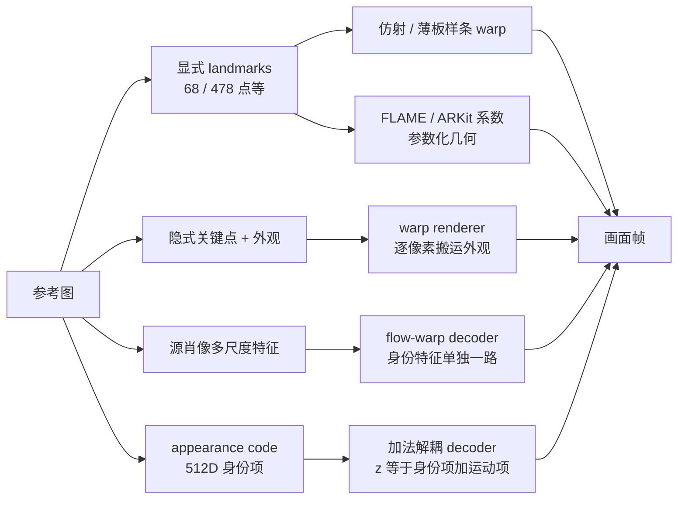
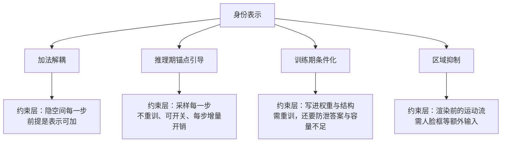
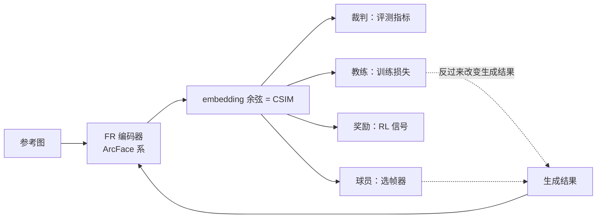
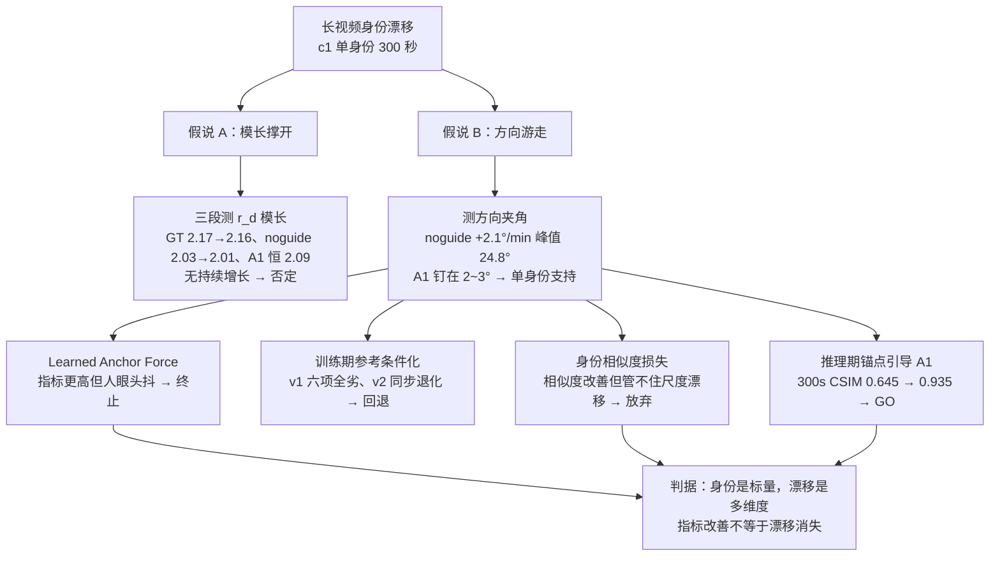

# 数字人身份

## 为什么重要

身份是数字人两个核心因素之一（另一个是动作，见 [[数字人概述/数字人介绍与技术路线|数字人介绍与技术路线]]）。它回答的是"**还是不是同一个人**"——这和画质不是一回事：画面再清晰，脸变了就是失败。

三件事让它在工程上格外要紧：

- **长视频会漂**：短时间内像不像容易，几百秒之后还像不像才是门槛。我们的实测里，无引导的 300 秒轨迹会持续往外走
- **对话场景反复暴露**：一次通话里用户会一直看着同一张脸，任何渐进偏移都藏不住
- **它和音唇同步是并列门槛，不是可选项**：身份稳了但嘴不对、嘴对了但脸变了，都是不可用

最反直觉的一点：**身份指标好看，不代表体验可用**。我们后续几组实验（见后文 [Avatar Forcing 上的身份改进](#avatar-forcing-上的身份改进)）反复验证了这句话——身份分数更高的一版，人眼看上去头在抖；加了身份损失的一版，脸还是会忽大忽小。身份漂移不是一个标量能概括的，它有模长、方向、尺度好几个维度。

## 身份表示与渲染后端

身份以什么形态存在（**表示**），决定了它后来能被怎样约束；而身份最终呈现成什么样，由**渲染后端**决定。所以这两件事要一起讲——**表示决定渲染器能吃什么，渲染器决定身份怎么落地**。

### 显式表示（landmarks、参数化模型与身份编码器）

在动作空间模型与扩散模型之前，数字人主要靠**显式表示**驱动：先检测并对齐人脸，得到若干有语义的量，再据此把参考外观搬到目标姿态。理解这一族，才能看懂后面那些更隐式的表示。

**关键点**是最常用的一类，常见协议有好几种：

- **68 点**（iBUG 300-W 协议，dlib / ERT 一类实现）：眉、眼、鼻、嘴与下颌轮廓，落地最早、工具链最全
- **MediaPipe Face Mesh（468 / 478 点）**：把面部铺成密集网格并含虹膜点，能表达更细的局部形变
- **BlazeFace**：轻量人脸检测器，输出人脸框加少量关键点，常作为移动端管线的前置
- **3D 关键点 / 3DMM 拟合**：点带深度，可同时给出头姿与几何

**参数化 3D 模型**：**FLAME**（shape / expression / pose 参数加 LBS 蒙皮，输出 mesh 与 blendshape）、3DMM / BFM 系属于这一类——显式几何参数，语义清晰、可跨软件复用。

**标准接口**：**ARKit 52 维 blendshape**，是工业实时角色与游戏引擎之间通用的那套"语言"。

**专门设计的身份编码器**：**BlendFace**（ICCV 2023）值得单独一提——它指出直接把 ArcFace 这类人脸识别 embedding 用于换脸与生成会造成**属性泄漏**（表情、姿态、光照混进身份特征），于是重新设计编码器，只保留身份、剥离属性，并把它同时用作生成器的身份输入与身份损失。

这一族的共同点是**语义由人定义**：每个点或每个系数都对应一个可命名的东西，所以可以直接读写、直接可视化、直接用规则做动画（"抬眉"就是抬某几个点、某个系数）。这也是它在工程上长期好用的原因。

局限也很清楚：

- **覆盖有限**：皱纹、纹理、光影不在这些量能表达的范围内
- **协议不统一**：68 点、478 点、52 维 blendshape、FLAME 参数互不兼容，跨模型复用要先做转换
- **遮挡与大姿态下不稳**：关键点一丢，整条链路就断
- **身份仍多来自参考图**：关键点只负责几何，外观还是靠 warp 从参考帧搬运

隐式关键点正是针对前两条局限：不做标注、让模型自己从数据里学出点与形变，于是能表达"眼睛再睁大一点"这类没有对应 landmark 的变化——代价是维度失去天然语义，控制要靠扰动观察反推（Ditto 的 21×3 位移表就是这么来的）。

### 2D 换嘴 / latent inpainting

身份就是参考帧的外观（像素或 latent），渲染器只在嘴部区域做局部重绘，其余像素原样保留。代表工作：MuseTalk、SadTalker（后者学 3DMM 系数，再接 3D-aware warping）。身份保住的原因是"**没碰**"——除了嘴和下半脸，其它区域直接沿用参考帧。

### 动作空间 + 快速渲染器（我们的主线）

这是身份表示最丰富的一条路，按"身份信号从哪来"分成三支：

**隐式关键点 + warping renderer**（与显式关键点相对：显式由人工定义、每点有解剖含义、可直接编辑，隐式不做标注、从数据里学出来，表达力更强但维度没有天然语义）：身份是参考图的隐式关键点与外观，渲染器靠逐像素 warp 把外观搬到目标姿态。**LivePortrait** 是典型代表——紧凑隐式关键点（论文称 implicit blendshape）加上 stitching 与 retargeting 控制，把"身份"和"动作"分开搬运。更早的 **MegaPortraits / Face-vid2vid** 系走 canonical 身份容积，是这条支线的源头；FOMM 类是更轻量的同族做法。**换身份 = 换一张参考图**，这是全谱系里最便宜的一档。

**Ditto 在这条支线里走得更彻底：它压根不把身份编码成向量。** 外观完全由参考帧提供（渲染器的输入契约就是"参考外观 + canonical keypoints"），运动侧只生成 265 维——scale、pitch/yaw/roll、translation、expression，**其中不含关键点**；关键点由参考帧回填，生成的运动叠加在参考骨架上（`x̂ = c_ref · R̂ + δ̂ + t̂`）。这样做的好处是运动表示低维、算力集中在"怎么动"，代价是身份与运动靠 warp 对齐而非法向解耦——论文自己也承认两者没有完全解耦。

**外观特征 + flow-warp decoder**：身份以源肖像的多尺度外观特征进入模型，与动作接口分开注入。**LIA-X** 是代表——源肖像身份特征与 40D motion code 各走各的路径，经 motion dictionary、ToFlow、warp 与风格调制卷积出帧。身份和动作在表示层就分了岔，代价是身份特征与它的 flow-warp 结构绑得紧。

**appearance code + 加法解耦 decoder**：身份被编码成一个固定向量，与运动项在隐空间相加。**FLOAT / Avatar Forcing decoder** 是代表——`z = z_S + m_S`，其中 512D 的 `z_S` 是身份项，整个对话中保持固定；运动侧再经 `r = Bα` 交给 Flow / renderer，而 α 只有 20 个独立方向。身份项每步恒等，是"把身份钉住"最干净的实现。

三支的边界要记住：**动作表示的深度在《数字人动作》，这里只讲身份那一半**。

### 视频基座模型

身份当条件注入：参考图配 ReferenceNet 或 LoRA，身份基本长在权重与适配器里，没有独立的后端可换。代表工作有 VASA-1（latent + 扩散解码）、HunyuanVideo-Avatar、OmniAvatar。**换身份 = 换适配器或重训**，代价最高。

### 3D 资产（学习式与参数化装配式）

**学习式**：身份被训练进 3D 表示本身（3DGS 高斯、NeRF 场），推理时与输入无关。GaussianTalker、GAGAvatar、UIKA、FlexAvatar 属于这一路。身份可复用、几何一致，但要先为这个人训练资产——换身份就是重新训练。

**参数化装配式**：身份在美术制作的 rig 与材质里，动作回归出 blendshape / FLAME 系数再交给引擎渲染，工业实时角色（虚拟主播、游戏 NPC）走得最多。我们没实测过这条路线，只作版图条目。

### 掩码局部多人控制

参考图加 mask 指定"谁在被驱动"，身份仍来自参考图，掩码解决的是多人场景下的归属问题。代表工作是 HunyuanVideo-Avatar 的 localized cross-attention 变体。

### 跨路线对照

| 路线 | 身份表示 | 渲染后端 | 身份怎么被保持 | 换身份代价 |
|------|---------|---------|--------------|-----------|
| 2D 换嘴 / latent inpainting | 参考帧外观（像素 / latent） | 局部 inpainting 解码器 | 只重绘嘴部区域，其余原样保留 | 低：换参考帧 |
| 动作空间 + 快速渲染器（隐式关键点支） | 隐式关键点 + 参考图外观 | warping renderer | 逐像素 warp 搬运参考外观 | 低：换参考图 |
| 动作空间 + 快速渲染器（外观特征支） | 源肖像多尺度外观特征 | flow-warp + 风格调制 decoder | 身份特征单独注入，与 motion code 分路 | 低到中 |
| 动作空间 + 快速渲染器（appearance code 支） | 512D 身份向量 `z_S` | 加法解耦 decoder + Flow | 身份项每步恒等，与运动相加 | 低：重新编码一张参考图 |
| 视频基座模型 | 参考图 + 适配器条件 | 模型自带 DiT / 视频解码 | 身份长在权重或 LoRA 里 | 高：换适配器或重训 |
| 3D 资产（学习式） | 3DGS / NeRF 资产 | 光栅化 / 体渲染 | 身份被训练进 3D 表示 | 高：重训 |
| 3D 资产（参数化装配式） | mesh + blendshape / FLAME rig | 游戏引擎 / 离线渲染 | 身份在材质与 rig 资产里 | 中：美术重做 |
| 掩码局部多人控制 | 参考图 + mask | 视频模型自带解码 | 掩码限定谁被驱动，身份仍来自参考图 | 中到高 |

一句话读这张表：**越靠"参考图搬运"这端，换身份越便宜；越靠"身份进权重或资产"这端，身份越稳但代价陡增**。

## 身份注入与保持

上节讲"身份是什么形态"，这里讲"这个形态通过什么路径进到生成过程里"。业界常见四类，可以叠加使用：

**加法解耦**：把身份与运动在表示层分开，身份做成每步恒等的常量项（`z = z_S + m_S`）。在**哪一层约束**：隐空间，每步生成都带上同一个身份项。**代价**：要求身份表示支持加法——latent 可以，像素不行，所以 LivePortrait 这类只能靠 warp 而不是加法。

**推理期锚点引导**：用该身份的特征字典（锚帧库）在推理时逐步约束生成方向。**在哪一层约束**：采样过程的每一步。**时机与开销**：初始化时编码一次身份表示，之后每步引导都带来增量计算，不重训、可随时开关——这是它相对训练期手段最大的优势。

**训练期条件化**：把参考条件注进模型（单层注入或逐层拼接），让模型自己学会用参考。**在哪一层约束**：训练时写进权重与结构。**代价**：要重训，且必须防两类坑——参考库里混进答案、注入层容量不足；训推分布不一致还会造成额外落差。

**区域抑制**：压掉某片区域（如下半脸、颈部）的运动噪声，避免无关区域的抖动被当成身份变化。**在哪一层约束**：渲染前的运动流。**代价**：需要人脸框等额外输入。

四类手段的共同思路是"**把身份钉住、把运动放开**"，分歧只在**在哪一层约束、用什么信号约束**。我们对其中三类做过实测，结论见第五节。

## 一致性度量

判断"还是不是同一个人"，需要一个可比的数字。这个领域的尺子不止一把，按底层假设分三族：

| 族 | 代表度量 | 底层假设 | 边界 |
|----|---------|---------|------|
| **FR embedding 余弦族**（事实标准） | **CSIM**：两张脸过同一个 FR 模型，算 embedding 余弦。编码器常用 **ArcFace** 系（VBench-2.0 的 Human Identity、ConsisID 的 FaceSim-Arc），也有 **CurricularFace**（OpenS2V 的 FaceSim-Cur、PuLID 的评测尺）、**AdaFace**（ID-V2V）、FaceNet / CosFace 系 | FR embedding 是身份的忠实向量表示，余弦单调代理身份失配 | 照片域、裁剪对齐的单人近景；**换一把编码器或换协议，排名可能翻转** |
| **感知类** | DINO Subject Consistency（VBench 1.0）、CLIP-I（IP-Adapter / PuLID 的插入污染代理）、DreamSim | 人类感知的"像不像"可由通用视觉特征距离近似 | **身份不可知**：换了人但服装场景构图不变，全帧特征照样给高分 |
| **结构 / 生成类** | Arc2Face 反演：以"能否从 embedding 重建出人脸"来探嵌入的信息量 | embedding 含足够身份信息 ⇔ 存在生成器能逆回去 | 不产出可直接排名的分数；天花板就是嵌入容量本身 |

另外还有一批专用与新生的度量值得知道名字：CCIP（人物重识别系编码器算相似度，用于个性化生成一致性）、FaceSim-Arc / FaceSim-Cur、StyleID 的感知对齐度量与 StyleBench、ID-Sim（把"对环境不变、对身份敏感"写成公理）、OpenS2V 的 NexusScore（弃用 FR，人脸身份单列 FaceSim-Cur）。时序/漂移侧另有 CSIM-drift、LPIPS-drift；注意 **Dino-S 量的是相邻帧平滑，不是身份漂移**。

CSIM 是事实标准，但它是**从人脸识别借来的尺子**——FR 模型为"验证两张真实照片是否同一人"而训练，生成社区把它挪用成"生成是否保持了参考身份"。它**没有标准化协议**（阈值、锚定方式、预处理各论文自定），而且它同时被当成四种角色使用：

- **裁判**：评测指标（各大 benchmark 的身份维度）
- **教练**：训练损失（我们试过，见 [CSIM 当损失函数（已放弃）](#csim-当损失函数已放弃)）——PuLID 把身份分推到 **0.761** 的代价是文本可控性从 **29.06 掉到 24.91**，作者自己承认面部变模糊
- **奖励**：强化学习的奖励信号——Identity-GRPO 在 500 个人类偏好对上实测 ArcFace 作奖励的预测准确率只有 **0.772**（低于其自设的 0.8 可用线），最终换用自训奖励模型（0.890）
- **球员**：选帧器（用相似度挑关键帧，再用同一把尺子评自己）——KeyID 就同时是选帧器和评测打分者

一把尺子同时是这四者，分数语义就会失真："更高的 CSIM"未必等于"身份保持更好"，也可能只是"更会讨好这把尺子"。（本节数字均转引自上述工作，未经我们复现；我们自己的直接证据是 Learned Anchor Force 那一组反例。）

**下面这五类失效，来自我们对多篇度量批判工作的整理，属于二手证据——我们只复现了其中一条**（"指标改善、人工检查仍不过关"，见 [三种治理手段与结果](#三种治理手段与结果)）。每一类都有具体实测数字支撑：

| 失效 | 会发生什么 | 已报告的实测证据（二手） |
|------|-----------|----------------------|
| 照片域依赖 | 动漫 / 3D 渲染 / 素描角色跨图跨视频保脸，工具说"查无此人" | StyleID 在风格化人像上实测 ArcFace 的判定准确率约 **0.50**（等于抛硬币），手绘集约 0.53 |
| 时序漂移 | 片头像、片尾走样，排行榜身份分依然漂亮 | FCB 用双协议 × 六个编码器实测：同一模型排名会反转（0.2951 ↔ 0.1962）；其随机帧对协议平均只覆盖约 **1/3** 的端到端漂移 |
| 环境不鲁棒 | 换个灯光、转个侧脸就被判成另一个人 | MoFE 实测 ConsisID 在大姿态场景崩到 **0.269**，反而低于裸底座的 **0.471**；FCB 同视频跨编码器分差 2–2.7 倍 |
| 长时演变 | 角色跨十年成长或做过医美，系统认不出"还是她" | 跨年龄敏感在人脸识别社区十几年前就已被实证；而现有身份评测的锚（参考图 / 首帧）**全是静态**，没有一套协议处理长时演变 |
| 风格化不可度量 | 真人参考做成油画 / 赛博朋克后，身份保住几分没人答得出 | OpenS2V 横评里身份分**最高**的模型（76.45%）自然度**最低**（47.08%）；StyleID 另实测两类失效：风格偏移被误判成身份变化、几何劣化被漏检 |

同一个问题还有两个更直观的读法：

- **同一把尺子，换个子集就能差三成以上**：ConsisID 的 FaceSim-Arc 随评测子集在 **0.46 到 0.73** 之间漂移
- **跨 benchmark 近乎腰斩**：Concat-ID 自报 CurSim **0.466**，换到另一套测试集只剩 **0.242**

由此有三点要注意：

1. 身份指标只作**必要条件**——指标不过一定不行，指标过了不代表可用
2. **必须配人工检查**：[三种治理手段与结果](#三种治理手段与结果) 里的 Learned Anchor Force 就是反例（身份分更高，三版人眼观察全在抖）
3. 跨域 / 长时 / 风格化场景要**显式声明度量边界**，不能拿照片域的数直接比

## Avatar Forcing 上的身份改进

以下是我们在 **Avatar Forcing** 这条线上做的身份相关工作。载体先说清楚：改造对象是它的流式路径，被测量是逐帧 motion latent 向量 `r_d`，身份侧表示固定为参考图编码出的 appearance code `z_S`；观测对象是 **c1 单身份、300 秒长视频**，源视频 GT 作上限基线。接入与改动细节写在论文笔记，这里只讲身份视角的诊断、治理与结论。

先把整条路径放在一张图上，后面几小节逐段展开：

### 原生怎么保身份，又为什么会漂

在讲我们做了什么之前，先把这个模型**原本**的身份机制说清楚。

Avatar Forcing 保身份的办法很简单：**参考图只在开头的初始化里被编码一次**，得到一个 512 维的 appearance code（身份项），此后整个对话都不再更新；每一帧的重建是"**固定的身份项 + 当前的运动项**"相加（`z = z_S + m_S`）。运动侧还有一层接口：交给 Flow / renderer 的是 `r = Bα`，形式上是 512 维，但落在一个最多 20 维的子空间里——真正的自由度是那 20 维。这套做法来自 MegaPortraits / FLOAT 一系的 reenactment 思路：外观固定在 canonical 空间，运动只负责搬运几何与表情。

注意它**原生没有任何推理期身份锚定**：没有锚帧库、没有参考条件注入、也没有区域级抑制。身份一致性完全押在两件事上——身份项保持固定，以及加法解耦真的成立。

漂移正是从这两处漏出来的，原因可以分三层看：

1. **解耦只是近似（模型根因）**：加法分解让身份与运动"尽量"分开，但论文自己写明没有任何一种表示能保证完全解耦——运动项的变化会渗透进外观重建。**身份项固定，不等于输出身份固定。**
2. **流式因果生成把误差滚动累积（系统放大器）**：这个模型按 block 因果滚动生成，块与块之间靠历史 offset 与 KV / 条件缓存衔接——每一块都建立在前一块的输出之上。于是误差不是随机抖动，而是被逐块带下去、**单调累积**。我们实测到的形状正是如此：无引导时角度以 **+2.1°/min 线性增长**，300 秒里从 10° 走到 17.5°。
3. **长时没有"回头看"的闭环（缺失的一环）**：身份只在第 0 帧被钉过一次，之后没有任何机制把当前生成拉回参考身份。方向一路走偏，也没人纠偏——这正需要外部加一道锚定，也是我们后面做锚点引导的动机。

还要留意一个诊断细节：漂移过程中**模长没有持续增长，是方向在转**。这说明问题出在 latent 的"指向"上，而不是运动量越滚越大；而方向恰好是 renderer 决定外观的接口。

### 漂移出在哪（模长还是方向）

把每帧 motion latent 当向量看：**模长代表运动量，方向代表它在 latent 空间往哪走**。于是漂移有两个候选解释——向量越来越大挤压了固定的身份项，或者大小没变、方向却一路转偏。先测清楚，再决定怎么治。

**假说 A（模长撑开）：不成立。** 把 300 秒视频分成首、中、末三段测 `|r_d|`：

| 臂 | 首 1/3 | 中 1/3 | 末 1/3 | 斜率 |
|----|--------|--------|--------|------|
| 源视频 GT | 2.17 | 2.18 | 2.16 | ≈0 |
| noguide（漂移中） | 2.03 | 2.04 | 2.01 | -0.01/min |
| A1 引导 | 2.09 | 2.09 | 2.09 | ≈0 |

模长没有持续增长。附带一个未解释的现象：模长恒定偏低约 14%，可能与模糊有关，机制和跨身份是否成立都没验证——所以**不能反过来断定模长与漂移完全无关**。

**假说 B（方向游走）：单身份结果支持。** 测相邻段方向与首帧方向的夹角：

| 臂 | vs 首帧方向 | 离 GT 方向字典最近邻 | 斜率 |
|----|------------|---------------------|------|
| 源视频 GT | 4° 左右波动 | 0°（自己） | — |
| noguide 300s | 10.1° → 15.1° → 17.5° | 7.1° → 12.4° → 14.1°（峰值 24.8°） | **+2.1°/min 持续增长** |
| A1 引导 300s | 3.4° → 3.3° → 2.5° | 2.5° → 2.4° → 2.2°（峰值 6.2°） | **≈0，全程钉住** |

GT 自身的方向游走带宽约 3~5°，无引导时升到 17.5° 以上，加上引导后回到 2~3°。**但这组证据只来自 c1 单身份 300 秒轨迹**——它支持"方向游走"这个假说，还不足以把它写成跨身份的主要机制。

结论很直接：既然范数没有持续撑开、方向却在走，那就先约束方向。

### 三种治理手段与结果

围绕"约束方向"，我们试了三条路，得到三种不同结局。

**推理期锚点引导（A1）：GO。** 推理时用锚帧库（该身份的特征字典）引导生成方向，`c_hi=0.99` 时 300 秒 CSIM 从 **0.645 升到 0.935**，后半段塌方消失，唇同步没观察到下降，也不需要重训。**边界**：这是单身份实验，跨身份、跨素材的稳健性还没验证，所以不写成通用部署默认值。

**训练期参考条件化 v1：干净失败。** 两个原因——训练库里有 GT 帧，模型学会了"回放答案"的捷径（换一个参考库，输出差小于 0.001，说明参考条件压根没被用上）；而且条件只在最后一层注入，容量不够。6/6 指标全都劣于零条件臂。

**训练期参考条件化 v2：多 seed 裁决失败并回退。** 按 v1 的教训改成逐层拼接、参考帧策略三档（fixed / rolling / reset-N），但多 seed 结果反而让同步退化（sync_c 5.342 对 6.437，sync_d 10.022 对 9.294），同步税没过门，300 秒验证没有继续跑。

**Learned Anchor Force：指标高，体验不可用，终止。** 这条学出来的锚力控制器在 300 秒双身份上指标更好（CSIM 0.728 高于 A1 的 0.665，DINO 0.913 高于 0.841），但三个版本的人眼观察都出现头抖，动作流也更抖（motion flow 0.043，对比 GT 的 0.022）。**这是一条重要的反例：身份指标上升不够，还得看动作稳定性和人工视频检查。**

四条路径合起来给出一条判据：**身份治理不能只看身份指标**——同步和动作稳定性会交"税"，而且这个税只有人工检查能看见。

### 锚帧库与参考图怎么选

A1 依赖一个身份方向库，它的构建口径直接影响引导效果。

**锚帧库当前怎么建**：首帧跑人脸裁剪器得到一个固定裁剪框，后续帧全部用同一个框裁剪并缩放到 512×512，不做旋转校正、不做质量筛选、全帧入库，输出一个含方向与范数的 `.npz`。需要强调的是：**"姿态聚类采样 + 人工抽检"是可行的未来策略，但不是当前脚本的行为**，不能写成已经做了。

**参考帧策略**（v2 设计的三档，取舍对训练期手段尤其关键）：

- `fixed`：参考恒为首帧，训推语义一致，最稳
- `rolling`：参考用上一块生成的尾帧，信息量更大，但训推分布差变大，需要扰动混合（p=0.3）来补偿
- `reset-N`：滚动若干块后拍回首帧，取两者的折中

**成本**：推理期引导只需初始化时编码一次身份表示，之后每步带增量开销，换参考图即可换身份；训练期手段则要重训，换身份等于重走一遍训练。这条成本差是 A1 能当保底、v2 只能当后续方向的主要原因。

### CSIM 当损失函数（已放弃）

另一条思路是把**身份相似度**直接当训练损失：生成帧与参考帧各过同一个 FR 模型，优化两者 embedding 的余弦。注意这里的措辞——我们优化的是**度量**（CSIM 的定义），业界也把这类损失叫 **ID loss / Face Sim loss**；它**不等于** ArcFace 原论文的 AAM softmax 分类损失（那是训练人脸识别模型用的，需要多个身份类别标签），单身份微调只有参考图，只能走相似度这条路。

**结果：相似度确实改善，但放弃了。** 原因是它**管不住脸部尺度漂移**——脸会越变越大、忽大忽小。而尺度漂移才是流式体验上最刺眼的问题，身份相似度损失对它是**盲的**。

为什么？因为**身份相似度是一个标量，漂移却有好几个维度**：[漂移出在哪（模长还是方向）](#漂移出在哪模长还是方向) 测的是模长与方向，这条损失管的是"像不像"，管不了"脸多大"。三者不重合，所以指标改善不等于漂移消失。这条尺度漂移后来是在**流式侧按归一化处理**的（细节归《工程设计》的音频链路设计），不属于身份损失能覆盖的范围。

证据状态需要说明白：放弃原因是口述确认的，**这次实验的指标记录在知识库、博客与代码里都没有留下**，所以本节不写任何数字。

## 可能的改进方向

- **把单身份结论做成跨身份结论**：夹角实验目前只有 c1 一条 300 秒轨迹，需要在更多身份、更多素材上复核，才能把"支持的假说"升级成"主要机制"
- **治理手段的消融与统一判据**：A1（推理期）与参考条件化（训练期）应在同一套评分下对照；评分至少要包含身份、同步、动作稳定性三项，外加人工检查
- **身份资产协议化**：锚帧库怎么建、参考帧策略怎么选、注入时机与开销如何标注——目前都是各实验自定义，缺少可复用的约定
- **度量侧补强**：接入长时与跨环境的指标（而不只有照片域 CSIM），并在跨域场景显式声明边界
- **尺度漂移的身份侧解释**：尺度漂移目前只在流式侧按归一化处理，它在身份表示层面意味着什么，还没有回答

## 汇报要点

一页可直取：

- **三个结论**：模长撑开假说被否证；方向游走假说在单身份上得到支持（+2.1°/min 持续转偏）；推理期锚点引导有效（300 秒 CSIM 0.645 → 0.935，后半段塌方消失，不重训即可开关）
- **两个反例**：训练期参考条件化 v1/v2 失败并回退（v2 同步退化，sync_c 5.342 对 6.437）；Learned Anchor Force 身份指标更高但人眼头抖，终止
- **一个放弃**：把身份相似度当训练损失，相似度确实改善，但管不住脸部尺度漂移——身份是标量，漂移是多维度
- **一个缺口**：身份损失那次实验的指标记录缺失，目前只有口述结论
- **证据边界**：以上结论全部来自 c1 单身份 300 秒轨迹，尚未跨身份验证
