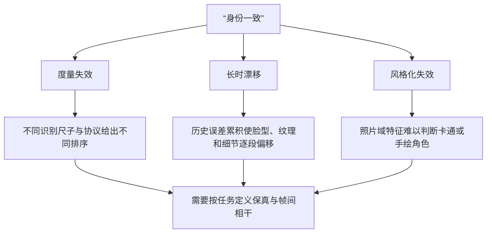
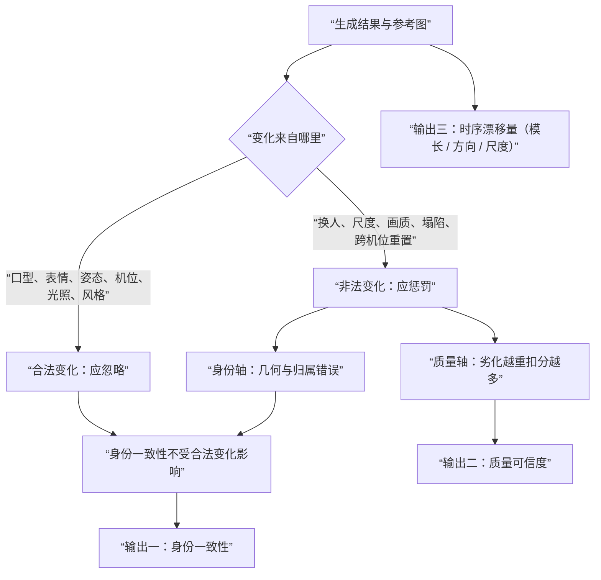
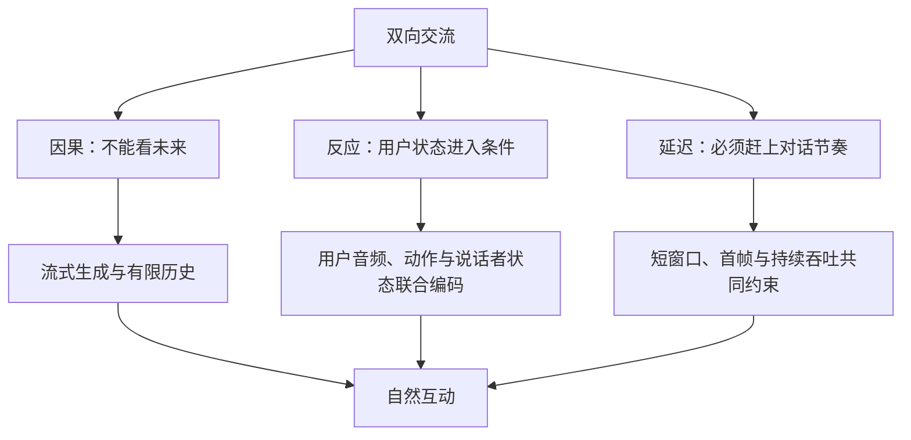
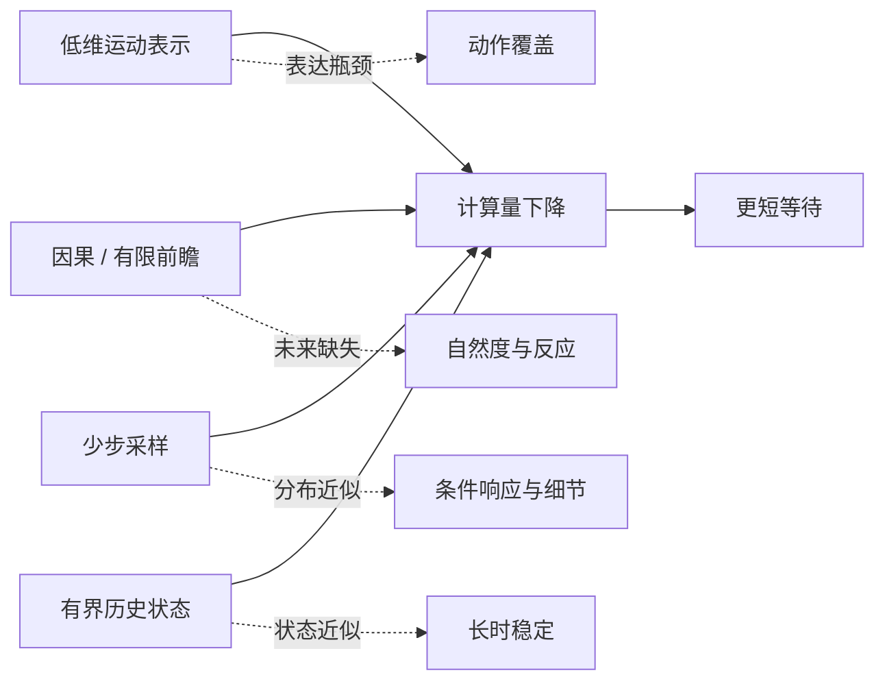

# 数字人领域问题

这里的数字人覆盖由音频、文本、视频或交互状态驱动的头部、上半身和全身形象，并把动作、身份与实时交互中的生成约束放在同一问题范围内。身份问题按“换了条件后还是不是同一个人”归类。动作问题按“在一轮对话中怎么动”归类，数字只说明问题的规模、代价或口径，不能脱离条件直接横比。

| 块 | 回答的问题 | 收录判据 |
|---|---|---|
| 身份 | 还是不是同一个人、长什么样 | 身份、外观、多参考、跨机位、风格与度量 |
| 动作 | 怎么动 | 口型、表情、情绪、语义、互动、手与全身 |
| 实时性 | 为少等而做的近似会牺牲什么、怎样补回 | 表示、因果性、采样、有限状态与分段建模的质量—等待权衡 |
| 路线 | 用什么手段解问题 | 各生成路径作出的承诺与代价 |
| 条件与任务定义 | 模型从哪一路条件学到什么、输入不完美时怎样做、如何公平比较 | 条件可辨识性、鲁棒性与条件预算相同的评测协议 |
| 跨域问题 | 能否在真实环境中成立 | 数据、授权安全与复现口径 |

## 一、身份

### 身份一致性：长视频为什么会漂

“像不像”不是一个单一分数。第一层是度量：同一段生成视频在不同人脸识别编码器下可能得到相差很大的相似度；第二层是时间：短片里像参考人，不代表生成持续后五官比例、肤色和局部纹理仍稳定；第三层是域：照片域的人脸特征遇到手绘、卡通、特殊光照或大姿态时，往往测到的只是外观相近，而不是人是否仍可被识别。

现有基准已经暴露出这个裂缝：六个常用人脸识别量尺的分歧可达 2.7 倍；以参考帧为锚和随机帧对相干两种协议会让模型排序反转；即便在同一协议下，较强模型与真实视频仍有约 1.25–4 倍的差距。纯 ArcFace 身份条件在未见身份上的 CSIM 峰值约为 0.85，这个数字更接近照片域条件的上限提示，而不是通用身份一致性的答案。

长时问题因此不能靠单帧分数掩盖。LiveAvatar 用历史扰动、锚点选择和滚动位置编码把稳定推演延长到 10,000 秒以上；另一类工作以参考锚定的 data-to-data 生成替代每段从噪声重建，减少逐段重置带来的身份偏移；多轮交互又要求身份锚跨轮保存。它们说明身份漂移已经有可操作的抑制机制，但还没有一个跨时长、跨机位、跨风格的统一判据。

| 问题 | 已有解法 | 说明问题的数字 |
|---|---|---|
| 量尺不一致 | 参考锚定与帧间相干分开评测；训练身份选择性度量 | 六个量尺分歧 2.7 倍 |
| 身份随时长漂移 | 历史状态、参考锚、位置编码重置、误差抑制 | 10,000+ 秒稳定推演 |
| 纯身份条件的边界 | 以人脸嵌入直接作为生成条件 | 未见身份 CSIM 约 0.85 |
| 风格域失效 | 用感知校准的风格化身份特征替代照片域余弦 | Cross-Method TPR 0.37 到 0.74 |

在这一语境中，参考保真和帧间相干应被并列观察：前者问生成是否仍靠近给定身份，后者问相邻或远隔帧是否仍彼此一致。两者可以同时较低，也可以一高一低；后一种情况尤其容易被单一 CSIM 掩盖。长序列还应记录漂移从何时开始、是否在表情或姿态变化后加速，而不是只截取稳定片段报告平均值。
### 多参考注入：从一张图到任意多角度

一张参考图只告诉模型某个姿态、表情和光照下的外观；一旦转头、遮挡或出现另一侧脸，模型只能补全未见区域。多参考的目标不是把更多图片堆进条件，而是把数量不定、位姿未知、质量不一的图像聚合成稳定身份表示，并让它能随动作驱动。

前馈式 3D 头像开始把这个过程做成一次推理：UIKA 用 UV 对应和双流注意力聚合任意数量无位姿图像，报告 220 FPS 渲染，但训练用了 7,500 多个合成身份与 32 张 H20 持续两周；FlexAvatar 处理 1–4 张无位姿、无表情标签的输入，重建约 0.4 秒，驱动约 22 毫秒每帧。大姿态仍是专门难题：CoFE 把 ArcFace、CLIP、DINOv2 多个专家按层门控，代价是参数增加约 18.5%；DiT 身份注入还需要在低频轮廓与高频纹理之间分流，ConsisID 仅为此增加约 0.5B 参数。

多参考目前能改善“看不到的角度怎么办”，不能自动解决“所有角度是否是同一人”。训练代价、姿态覆盖、风格化定义和跨视角度量仍相互牵制。输入张数变多也不等于条件更干净：重复、模糊或互相矛盾的参考会把不确定性直接送进生成器。

参考数量增加还带来聚合顺序与冲突处理的问题。清晰正脸、模糊侧脸和不同时间拍摄的照片未必给出一致外观；简单拼接会让高质量信息被重复样本稀释，固定数量的编码器又会在输入数变化时失效。UV 对应、查询 token 和分层注意力试图把“看见了哪里”与“该相信什么”分开，但遮挡区域和未覆盖角度仍只能依赖先验补全。
### 切分镜与多视角：换机位之后还是不是同一个人

切分镜的难点不只是相机能否移动，而是换机位后五官比例、材质、发型、光照和背景关系是否仍连续。这个问题归身份，因为“能否生成新视角”由路线决定，而“新视角是否还是同一人”需要身份与外观一致性的判据。

3D 资产路线天然拥有相机位姿：高斯或网格资产可以在新视角渲染，LAM 报告 A100 上 280 FPS，HyperGaussians 在 512² 报告 300 FPS。学习式资产却仍会受多视角数据本身的不一致影响；AniGS 正是把扩散生成多视角之间的差异作为需要建模的时间变化来处理。反过来，2D 换嘴和局部驱动通常只在固定人脸裁剪中改动，换机位意味着重新生成另一段画面，而不是移动已有相机。

困难在于现有身份度量往往故意对视角、背景和光照不变，这对判断“是否同一人”有益，却无法判断跨机位的外观连续性。常见视频基准也多测同一段内的锚定保真或帧间相干，而不是镜头切换前后的人、光线与环境是否连续。数据侧已有 MEAD 的七个同步视角、NeRSemble-v2 的十六相机和九视角合成身份，但跨机位一致性还没有形成普遍协议。

跨机位检查不能只比较脸部嵌入。切换前后的镜头可能故意改变焦距、构图和照明，这些变化不应被误判为身份错误；但发际线、五官比例、服饰纹理与角色和背景的遮挡关系若无规律跳变，也不能因“视角不变性”而被忽略。问题需要同时允许合理的相机变化，并对不合理的外观重置保持敏感。
### 说话风格：从几张图或一段视频学到“这个人怎么说话”

身份回答“是谁”，风格回答“这个人怎样说话、怎样动”。两者容易纠缠：某些嘴形、点头频率或眉眼运动既可能被误当作身份，也可能来自说话习惯。现有方法有三种入口。几何解耦把输出压到 68 个三维关键点的相对位移，并把语音拆成内容与说话人残差，因而能在真人训练后零样本驱动油画和卡通；显式条件把文本风格、情绪或参考片段作为控制；few-shot 方法则从几秒视频适配某个个体，例如 5 秒个性化视频、约 11 分钟适配和 76.4 FPS 的组合。

这些入口分别交换跨域能力、控制粒度与数据效率，没有自然汇合成同一表示。文本能给出“热情”“克制”一类高层描述，却未必落到可重复的运动参数；参考片段保留节奏，容易同时带入内容和姿态；隐式运动空间可表达丰富细节，却难以指出哪一维是“更快的眨眼”或“更强的强调”。缺口不是再增加一个风格标签，而是让风格、身份、语义与情绪在同一生成中可分离地进入条件。

说话风格还具有时间尺度：一次强调可以是语义需要，持续的点头节奏才更接近个体习惯。短参考片段常不足以区分二者，而长参考又可能把具体内容、情绪和姿态一并带入。因而适配后的动作若只复现参考中的局部模式，不能说明模型学到了可迁移风格；需要在内容、情绪和驱动语音改变后继续观察其稳定性。
### 风格化：跨风格评测与风格化程度

卡通、手绘、非真实感角色把身份问题放大：照片域 CSIM 可能把同一角色判低，也可能把不同角色判高；以自然图像训练的 FID 对风格变化并不敏感；用户研究的被试数、量表和任务常常不能横比。StyleID 用感知校准训练让跨方法识别率从 0.37 提至 0.74，说明“人类还能否认出”与“照片特征距离是否接近”并非同一问题。

更难的是风格化程度没有连续尺子。从轻微滤镜到高度抽象角色，何时身份应当被认为保留、何时风格本身已改变身份定义，尚缺可比较的协议。风格化数据、风格感知视觉编码器和稳定的人类评价设计必须一起变化；单独替换一个指标无法让跨风格结论可靠。

跨风格比较还必须防止把“风格越接近照片”误作“身份越准确”。写实化可能提高照片域识别分数，却偏离角色原有设计；高度抽象的角色则可能保留了人类可辨认的关键线索而缺少可用的照片特征。有效的评价应明确风格保留和身份保留分别由什么判断，并让不同抽象程度的样本进入同一协议，而不是将它们排除在测试之外。

### 身份一致性判别器：缺的是什么，要满足什么条件

现有的身份判定手段几乎全是借来的。照片域的人脸识别编码器把“与参考图的余弦距离”当作身份，遇到风格化、尺度变化和大姿态就失真；感知类度量（DINO、CLIP、DreamSim 一类）身份不可知，只要服装、场景与构图没变，换了人也能给高分；结构或生成类探针（以“能否从嵌入重建出人脸”探嵌入容量）只回答嵌入里装了多少身份信息，不产出可排名的分数。非照片域的身份判定这条支线确实存在：卡通与动漫人脸识别已有基准、用图拼图削弱纹理捷径的解法以及动漫风格识别基准，但它服务的是检索既有作品里的角色，没有接到生成管线上，也不含时序与质量；面向生成的身份编码器（为换脸重新设计，只保留身份而剥离属性）做的是身份表示，不是判别。缺的因此不是精度更高的编码器，而是**敏感方向与数字人任务对齐的判别器**。

一个能用的判别器，先要明确哪些变化**不该扣分**。下面这些变化都由驱动信号或镜头决定，而不是身份的函数：

| 变化类型 | 在数字人里的剧烈程度 | 期望行为 |
|---|---|---|
| 口型与嘴部形变 | 音素级，一秒内即可大幅变化 | 不敏感 |
| 表情，含夸张表情 | 眉眼嘴大范围形变 | 不敏感 |
| 姿态、头动、大角度侧脸 | 跨分镜可达侧脸甚至后脑 | 不敏感 |
| 说话风格（点头节奏、眨眼频率） | 分钟级的个体习惯 | 不敏感 |
| 机位、焦距与构图 | 跨分镜剧烈变化 | 不敏感 |
| 光照、色温与背景 | 场景切换级变化 | 不敏感 |
| 渲染风格与风格化强度 | 写实、卡通、手绘之间连续变化 | 不敏感 |
| 正常时间演化 | 长视频内的自然渐变 | 不敏感 |

同时必须明确哪些变化**必须给出负面评价**。它们要么说明换人了，要么说明画面已经不可信：

| 变化类型 | 具体形态 | 期望行为 |
|---|---|---|
| 换人与几何漂移 | 五官比例、脸型、发际线偏移 | 强敏感，给负分 |
| 画质劣化 | 模糊、失焦、压缩伪影、噪点、低分辨率 | 强敏感，但走质量通道 |
| 尺度漂移 | 脸忽大忽小、越变越大 | 敏感 |
| 遮挡与局部塌陷 | 伪影蔓延、五官糊成一团 | 敏感 |
| 跨机位外观重置 | 发际线、五官比例、服饰纹理无规律跳变 | 敏感，同时容忍合理相机变化 |
| 多人身份归属错误 | 一张脸长在另一个人身上 | 敏感 |
| 时序漂移量 | 起始时刻与加速度，而非平均值 | 作为独立量输出 |

这里最容易做错的一步，是把“画质”和“身份”揉进同一个标量。一旦揉在一起，两种错误会同时出现：模糊被读成“换人了”，于是有人去改身份通道来修清晰度；或者模糊被读成“一致”，而后者正是当前 CSIM 的实际行为。正确的做法是让两条敏感轴分开，输出至少三个通道——身份一致性只对身份类变化敏感，质量可信度对劣化单调下降，时序漂移量给出模长、方向与尺度三条曲线。质量通道的意义在于把低质帧标记为不可信，使其在选帧、加权与拒识等下游环节被抑制，而不是被当成身份证据。

验收这把尺子是否合格，需要四条硬性要求：风格化强度轴必须是连续的，不能把高度抽象的角色排除在测试之外；必须带视频长度轴，单帧分数看不到漂移；必须报告跨编码器与跨协议的方差，因为本章前面的量尺分歧已经表明换一把尺子就能翻转排序；必须做反度量循环性检查，不允许“更会讨好这把尺子”得高分。人类判定仍是不可替代的锚，可复用的素材也已经存在——StyleID 的感知校准数据与评测框架、ID-Sim 把“对环境不变、对身份敏感”写成公理的做法、MagFace 用嵌入模长编码质量、FCB 的协议反转证据，以及卡通与动漫人脸识别的数据设定。

代价与未决同样要写清楚。数据是瓶颈：训练这样一个判别器需要“同一数字人跨风格、跨动作、跨机位”的成对标注，构造成本高于通用人脸识别；虚拟角色的身份可能没有真人对应，判别对象实际上是**角色同一性**，与真人核验不是同一个任务；底座该用语义基座还是人脸识别基座微调，尚无定论。这三项就是后续立项首先要回答的问题。

## 二、动作

| 梯度 | 问题焦点 | 典型失效 |
|---|---|---|
| 口型 | 音素到嘴形及其语言差异 | 时间错位、英语中心的判据 |
| 整脸 | 嘴以外的脸部生命感 | 上半脸静止、头动僵硬 |
| 表情 | 情绪是否匹配、是否能编辑 | 韵律替代语义、控制维度不可读 |
| 语义 | 指代、意图与动作是否对应 | 没有文本或场景条件 |
| 双向 | 是否真正对用户反应 | 只生成单向回应 |
| 多人 | 谁说、谁听、谁该动 | 发言权依赖外部指定 |
| 全身 | 手、身体、脸的协调 | 数据模糊、分辨率与实时预算冲突 |

### 音唇同步：嘴对得上为什么仍然难

音唇同步看似最直接：音频中有发音，画面中有口型。但训练目标很容易让模型走捷径——从参考视频延续视觉，而不真正使用音频。Wav2Lip 用预训练唇形同步专家把音画关联作为监督，解决了真实场景里大量不同步的问题；LatentSync 进一步用只保留唇形—音频关联的特征和时间关系约束，报告 94% 的 SyncNet 准确率。局部 latent inpainting 能提升清晰度和速度，例如 MuseTalk 在 V100 报告 30 FPS，却也把问题限制在 256² 人脸区域。

同步、牙齿细节、画质和身份会相互拉扯。更重要的是指标本身并不总与人类判断一致：对 17 个模型、5,011 段视频的评测显示，传统 FID、FVD、SyncNet 与人类偏好都可能失相关。不同工作所报的 LSE-C、LSE-D、Sync-C、同步置信度也不是同一口径。先确认音画 offset，再讨论数值，仍是最基本的前提。

时间对齐还应拆成整体偏移与局部共发音两件事。前者表现为整段嘴形持续领先或滞后，后者则可能只在爆破音、闭口音或快速连读处出错。平均同步分数可能忽略这种局部失败；而只以嘴部监督训练又会让下半脸之外的运动失去协调。对口型的判断需要保留语音片段、画幅和评测器训练语言等前提。
### 跨语言适配：口型与同步是不是语言的函数

大量唇形同步损失和评测器在英语语料上训练。语言切换不只是把音频换成中文、日语或方言：音素库存、音节时长、共发音规律和可见发音方式都会变化，原有判别器可能既看不准，也会把正确口型判成不同步。

因此跨语言有两层问题。模型侧需要覆盖目标语言的音素—口型映射，或学习语言无关的视觉—语音关联；评测侧需要确认同步量尺没有继承英语数据偏差。只在目标语言上继续微调可能改善生成，却无法证明评测器仍然可信。跨语言适配应该把训练语言、驱动语言和评分器训练语言并列说明。

跨语言数据不足时，模型容易把训练语言中高频的嘴形规律迁移到不存在的音素上。方言、代码切换、借词和不同说话速度又会让同一文字或音素序列呈现不同可见运动。因而不能只用“语言标签”概括困难；训练语料中的音素覆盖、实际驱动语音的发音方式和评分器的训练来源，都决定同步结果是否有解释力。
### 整体面部动力学：口型对了，脸为什么还是假

嘴动只是最低门槛。真实说话伴随眼动、眉毛、脸颊、下巴、头部微动和停顿节奏；若其他区域静止，观众看到的是“嘴在动，脸没有说话”。VASA-1 将整体面部动力学放进潜在表示并报告 512²、40 FPS 的生成；Hallo 把音频对齐拆为 lip、expression、pose；Ditto 的运动表示也同时容纳头姿和表情。它们都在回应同一事实：同步分数合格并不等于动作自然。

问题仍在于整脸运动比口型一对多。相同语音可以对应不同的注视、点头和停顿，参考图无法给出这些选择；强行采用平均运动又会带来僵硬。音频驱动方法常在头部运动上缺少变化，这不是局部嘴形模型加几个参数就能修复的缺口。

整体面部动力学还包含不随音素逐帧变化的微运动，例如注视的短暂停留、眉眼的延后反应与呼吸式头部摆动。这些量没有唯一正确答案，训练数据中的多样性若被平均，就会输出看似平滑却缺乏生命感的动作。解决办法不能只增加随机噪声；随机性需要受身份、情绪、语境和历史姿态约束，才不会变成无意义抖动。
### 情绪匹配：表情跟不跟说得内容走

情绪匹配至少有两条不同的映射。语音韵律可以提示兴奋、犹豫或平静，MEAD 提供了 60 名演员、八类情绪、三档强度和七个视角，为这种受控学习建立了起点。EmoTaG 等方法把情绪语音转为上半脸、下颌和口腔运动；UniLS 专门处理听者表情僵硬，报告听者分布指标提升 44.1%。

另一条映射是“说的内容应该呈现什么情绪”。平静语调说出悲伤事件、反讽或安慰语时，仅靠韵律并没有足够信号。语义规划与语音节奏分开建模是一个开始，但文本、上下文和角色意图还没有成为普遍的运动条件。现阶段不少“情绪对齐”实质上仍是“韵律对齐”，内容—情绪一致性缺少稳定输入和评价。

受控情绪数据的标签也有边界：同一情绪名称在不同角色、语境和强度下会对应不同脸部动作，演员表演中的夸张程度未必等于自然对话。把类别标签直接作为控制量，容易得到可辨别却不合时宜的表情。内容、上下文与语音韵律发生冲突时，模型应如何分配权重仍缺少明确训练目标，这也是情绪匹配不能仅由分类准确率说明的原因。
### 情绪控制与可编辑性：把情绪拧进去的通路

可控性取决于运动表示是否有可读维度。情绪标签是粗粒度条件，往往只能规定一段视频的大致状态；参考视频或前缀可借用节奏和头动，控制质量受参考本身限制；FLAME、blendshape 等显式参数可按维编辑，例如 FLAP 将 120 维 FLAME 系数作为条件，使表情与头姿可以单独写入。文本指令能表达高层意图，却需要把语言映射到连续运动。

隐式关键点和整体 latent 容量更大，但没有天然语义。想把“更强的微笑”或“更少的点头”写进去，通常要逐维扰动并观察结果，控制映射靠实验反推。情绪只是编辑问题的一部分：注视、眨眼、头姿、动作幅度与风格都共享同一边界——模型是否真的把可编辑因素解耦出来。

可编辑性的检验应关注干预后的副作用。例如只提高微笑强度时，口型、头姿、身份纹理和说话节奏是否仍被保留；只改注视方向时，是否意外改变情绪或带来脸部变形。显式参数便于提出这种检查，却受拟合误差影响；隐式表示可容纳更丰富运动，却需要证明不同方向确实对应稳定语义。控制入口越多，条件冲突的处理规则越需要被说清。
### 语义 grounding：动作怎么跟“说的内容”对上

情绪问“这句话该带什么感受”，语义 grounding 问“这句话指向什么对象、何时该做什么手势”。指代“这里”“那边”“这个数字很大”需要文字、场景对象、目光和手势共同落到同一参照物上。当前许多动作模型主要接收音频韵律、风格或历史运动，能够生成自然的节奏，却不一定理解动作的指向。

SentiAvatar 的 plan-then-infill 先做语义动作规划，再与语音节奏补全，是向这个问题靠近的一步；其 SuSuInterActs 数据包含 21K 段、37 小时多模态对话动捕。它仍没有把文本含义、物体位置和视觉场景变成通用条件。没有 grounding，模型可以“像在做手势”，却无法保证手势与所说内容对应。

grounding 的困难不止在语言理解，还在参照物是否可见及何时可用。说“这边”可能指向画内对象、此前话题或双方共享但未入画的事物；同一手势也可能承担强调、指向或礼貌性的不同作用。文本条件能补足部分语义，视觉场景能给出部分位置，但二者都不保证意图已被消歧。评价因此要检验动作与具体指代是否匹配，而不只是统计手势是否出现。
### 双向交流：为什么“能回应”不等于“在交流”

单向数字人的条件通常只有自己的输出音频，于是模型只能把一段话演完；它不知道对方是否点头、困惑、停顿或改变表情。交互感缺失首先是输入缺失，而不是画质不足。Avatar Forcing 将用户音频、用户动作和数字人音频同时放进条件，明确把现有单向回应缺少情感投入的问题变成因果生成约束。

早期双向尝试各有硬边界：有人需要人工切换角色，有人需要完整时序窗口和数秒未来上下文，因而不能在线响应；也有人只处理表情层，无法协调说话、倾听和姿态。双向的基础不是“把两个单人模型并排运行”，而是让对方状态在不能偷看未来的条件下持续进入当前动作决策。

互动还要求模型区分相关反应与机械同步。用户点头后立即复制点头可能产生相关性，却未必符合谈话角色；在对方停顿、皱眉或转移目光时，合适动作取决于数字人当时是在说、听还是准备交接。双向条件的价值在于提供这些状态的证据，而不是把两段运动强行锁成同一节奏。因果限制下可见信息不足时，模型还必须保留不确定性而非假装预测未来。
### 反应性与听态：用户的状态怎么进条件

反应不是和用户同步地复制动作。用户微笑时，合适的回应可能是微笑、点头、停顿、注视转移或继续倾听；同一个用户状态对不同角色也有不同含义。Avatar Forcing 的双运动编码器将用户音频、用户动作和数字人音频编码到统一条件中，去掉用户动作后反应会退化为静态，说明用户状态不是可有可无的附加信息。它还用条件缺失时的结果构造偏好对，避免把人工偏好标注作为唯一来源。

现有反应性指标如表情、头姿残差相关，能测到是否与用户有统计关联，却不等于“反应得体”。听态模型能够减少 listening stiffness，例如 UniLS 报告 F-FID 从 13.143 降到 4.304，但自然互动还涉及回应时机、社会距离与对话意图。统计同步、动作多样性和人类主观判断之间仍缺少稳固连接。

听态的错误常比说话动作更隐蔽：静止并非总是僵硬，频繁点头也不等于专注。需要区分由用户状态触发的变化、角色固有风格造成的变化和无意义的随机运动。残差相关能够发现部分共同变化，却无法判断反应是否过早、过晚或与当前对话意图相反。把用户动作删去后的退化是有价值的因果检验，但仍应配合不同用户状态与不同角色的对照。
### 打断与回合边界：因果联合生成怎样转换连续状态

打断与回合边界的研究对象是**因果条件变化后的连续状态转换**。新的用户语音、表情或动作到来时，模型既要判断当前角色从说话转为倾听，还是继续、停顿或交接，又要使正在形成的口型、尾音、视线和姿态沿着合理轨迹收束。固定长度回答把边界藏在样本切分中，无法学习犹豫、重叠发言和重新倾听这些开放对话状态。

因果统一模型尝试把文本、音频与视频放进同一时序分布：Wan-Streamer 在 160ms 流式单元中联合建模多模态输出，OmniMate 以生成进度控制器表示开放回应已推进到何处。它们要回答的不是如何拼接模块，而是当前有限历史能否表征“谁在说、将要停止到什么程度、哪些动作尚未完成”，以及新条件注入后如何避免语义、声音和动作彼此矛盾。实验应固定可见历史和条件到达时刻，测量回合切换后的动作收束、口型/音频一致性、重叠语音处理和身份稳定性。

回合变化时，错误并不会只出现在声音终止点。若数字人已开始抬眉、转头或形成某个口型，新的用户状态到来后这些动作需要自然地收束或转向；若历史上下文被直接丢弃，又可能造成突然的姿态跳变。固定长度回应绕开了“何时结束”的判断，却无法覆盖开放对话中的犹豫、重叠说话和重新倾听。因而回合边界需要被当作连续动作状态的转换，而不是文本序列的截断。
### 多人场景：谁在说、谁说给谁听

多人场景不是把单人生成重复多次。系统需要判断当前谁在发言、谁在倾听、不同听者应如何反应，以及插话与注意力转移何时发生。严格双人模型通常把角色关系写死；扩展到多人后，注意力分配、轮流发言检测和差异化听态都变成新条件。

掩码与局部交叉注意力可以指定“哪一个人被驱动”，但这个指定来自外部，并不表示模型理解了发言权。多人互动中真正困难的恰是外部 mask 未提供的部分：谁该开始说、谁应先看向谁、多人同时反应时动作如何不互相冲突。

多人还增加了关系层的歧义：发言者面向谁、旁观者是否应有可见反应、两人同时出声时哪一路条件应占主导，都不能由单个人脸的音唇同步解决。外部指定的 mask 可以限制变化区域，却不提供角色意图或注意力关系。数据若主要来自轮流说话的双人片段，模型也难以学习多人重叠、沉默者反应和视线传递等低频事件。
### 手部与全身：最后一块拼图

手和全身要求脸、躯干、手势、接触关系和相机视野协调，改变的不只是输出部位。面部模型常把容量集中在高占比的脸部；在 640×384 这类全身画幅里，脸和手占比很小，VAE 与生成器很容易丢失手指细节。训练数据中的手部模糊又会反向限制模型，即使引入 Hand Clarity Score 也只能筛出问题，不能补回缺失动作。

路线之间的评价也不统一：三维动作常看运动分布与身体约束，二维像素视频则看手部关键点、视频感知质量和人类偏好；mesh 上表现好的方法未必在照片级画面中自然。UMo 可生成 3D 运动并达到 44 FPS，而像素级全身生成的实时因子仍可能远高于可交互范围。手部与全身需要同时处理表示、数据、画面生成和评测，不能视作面部模型“再多加一个区域”。

手部错误具有很强的时空耦合：手指形状、手臂轨迹、躯干平衡、面部表情和镜头裁切会互相影响。只在单帧修复手指可能破坏前后帧的轨迹，只提高身体动作多样性又可能让手势与语义脱节。全身数据中远处手部的像素证据往往不足，三维动作数据则未必提供照片级外观细节。需要分别验证运动合理性、接触关系和视觉清晰度，而不能将它们折算为同一种质量。
## 三、实时性

### 运动表示的计算—表达权衡：为什么不生成像素会更快

实时生成首先要决定预测对象。若模型直接在视频像素或高维视频 latent 上采样，每个时间步都要同时重建身份纹理、背景、光照和动作；若先预测低维运动，再把运动交给画面模型还原，生成器只需建模“这一刻怎样动”。Ditto 的速度来自这项任务分解：它在 265 维运动空间而非整帧像素空间完成十步去噪，随后以运动条件恢复画面，因而在其设定下报告约 385ms 首帧和 0.895 的在线实时因子。

这不是简单地把向量维度变小。一个运动空间必须保留音素到嘴形、表情、头姿和节奏等会被条件改变的自由度，同时排除不应每次重新生成的身份与背景变化；维度过低会把细微表情、大幅姿态或互动反应压成平均动作，维度过高则失去计算优势。Teller 用残差向量量化（RVQ）把运动表示为 token 并以 200ms 片段自回归，Avatar Forcing 的可加运动接口虽然接入 512 维空间，但真正独立的 motion bottleneck 是 20 维，说明“什么表示能承载哪些动作”而非“维度越低越好”才是共同问题。

应将表示容量、运动重建、条件干预后的可控性、不同身份上的可迁移性和画面还原可信度一起测量。仅在短片中重建得好，不能说明它能承载长时、双向或全身动作；仅报告 FPS 也不能说明降低的计算没有被转化为动作表现的损失。Ditto 为什么快的第一个答案正是：它将昂贵的生成目标限制到可学习、可渲染的运动变量，而这种限制的表达边界仍是可研究的。

### 因果时序生成：不等未来，怎样仍生成自然动作

离线生成可以读取整段语音或视频，在某一帧利用未来的停顿、重音与动作；交互式生成不能等待未来到齐。于是问题不是“有没有缓存”，而是如何在因果约束下近似未来依赖：历史里应保留什么，局部未来能在训练中暴露到什么程度，模型怎样避免把缺失未来补成僵硬的平均动作。

Avatar Forcing 给出了一种具体答案。它不是使用整段双向时序窗口，而是把 motion 序列划为块：训练时的块因果注意力允许有限 look-ahead，推理时没有真实未来，便以已生成块末尾的历史 offset 替代。该设计将“等待整个片段”改成“只等待当前块”，在论文设定下报告约 0.5 秒延迟；需要完整时序窗口的 INFP\* 为 3.4 秒。速度差的学术含义不在于谁的系统链路更短，而在于 Avatar Forcing 把全局双向时序依赖近似成了**块因果、有限前瞻与历史状态**的联合建模问题。

因果近似不是免费午餐。块越短，反应可以越早开始，却越难从局部上下文判断完整语气、情绪和头动趋势；前瞻越长，边界越平滑，却越接近离线等待。Wan-Streamer 以因果 Transformer 在 160ms 流式单元上统一处理多模态输入输出，说明端到端结构可以缩短跨模块等待，但仍需要回答有限历史是否足以判定当前表情和回合动作。研究上应固定输入条件，改变未来可见范围、块大小、offset 内容和注意力掩码，观察动作自然度、用户反应、口型和边界误差如何变化，而不是只把 TTFF 当作结论。

### 少步生成的质量保持：采样步数压缩后，什么先坏

扩散或流模型的每一步都在修正条件化分布。把多步采样压缩成少步甚至一步，节省的是推理迭代，但学生模型必须在更少的更新中保留教师对音频、身份和历史状态的响应。其困难不应被概括为“画质下降”：口型可能仍对齐而动态幅度变小，单帧身份仍像但长时细节开始漂移，平均视频指标不变而条件切换时的动作变得迟钝。这些是不同的误差模式。

LiveAvatar 将 14B 模型蒸馏为四步，并额外以 History Corrupt、AAS 和 Rolling RoPE 处理长时误差；LeapTalk 则不再让每段从高斯噪声重建，而以参考锚定的 data-to-data Brownian bridge 配合异构 DMD 蒸馏，在其 Lite 设定中报告一步、200 FPS；SoulX-FlashHead 采用 Oracle-guided bidirectional distillation 并报告 Lite 96 FPS。它们都不是单纯减少步数：生成起点、教师—学生分布匹配和历史条件的训练方式也被一并改写。

可研究的核心是采样预算与失真类型之间的关系，以及蒸馏目标如何保留条件响应而非只拟合视觉平均值。比较少步模型时，应分别检查同步、表情/姿态幅度、身份细节、跨条件变化和长序列稳定性，并在相同模型容量、输入窗口和画幅下报告 NFE。这样才能分辨一个方法是真的以较少迭代近似了原分布，还是把误差转移到了短样例和常用指标之外。

### 有界历史状态：怎样记住过去又不无限累积误差

流式生成需要把理论上无限长的历史压缩为有限状态。状态过短，模型会遗忘先前的身份锚、说话节奏、情绪或尚未完成的动作；状态过长，计算和存储随时间增长，且已生成的误差会不断作为下一步条件写回。这一矛盾的本质是**有限状态近似**：应该保留哪些历史变量，何时刷新、压缩或重置，训练时怎样让模型见到自己的错误历史。

Avatar Forcing 将上一块末尾的干净运动与条件作为 offset，并限制 KV cache 上限为 $M = 38$；这不仅是缓存节省，而是指定何种局部历史被允许影响下一块。LiveAct 的 Neighbor Forcing 与 ConvKV memory 试图让自回归扩散在更长时间内使用邻近状态；LiveAvatar 用历史扰动、音频自适应调度与滚动位置编码，使训练和推理中的历史分布更接近；LeapTalk 用参考锚避免每一段从独立噪声起点偏离。OmniMate 的生成进度控制器又说明开放对话中的“已经生成到哪里”本身也是状态的一部分。

因此，长时漂移、状态遗忘、显存随长度增长和开放回合难以收束不是互不相关的工程故障。它们要求在同一条长序列上做状态消融：删除较早历史、注入历史误差、改变参考锚更新时机、限制状态容量，并分别测量身份、口型、动作节奏、反应与计算增长。只有这样，才能判断一种记忆机制是保存了有用信息，还是只是暂时掩盖了误差。

### 分段连续性与延迟—质量权衡：短块为什么更快却更容易断

把连续运动切为 chunk 或 block 会直接改变模型能同时联合建模的时间范围。短块降低等待，并允许更快响应新输入，却增加状态交接次数；长块包含更多共同上下文，局部动作更易连贯，却提高等待并更依赖未来条件。段间接缝因此不是简单的实现瑕疵，而是离散时间切分与连续面部动力学之间的建模误差。

UniLS 即使以 100 帧 chunk 建模，仍在边界处观察到细微运动不连续。Avatar Forcing 通过 look-ahead 与 offset 缓解块交界，并在不同 block 数的消融中显示延迟、反应性、FVD 与唇同步彼此牵制；Teller 的 200ms token chunk 与 LiveAct 的邻近记忆同样是在选择不同的时间粒度和跨段耦合方式。它们共同指向一个研究设计空间：块大小、前瞻长度、跨块状态、噪声/位置时间安排和边界专项损失。

评价也必须落在边界附近。两段首尾姿态相同不表示速度没有突变，动作轨迹连续不表示嘴形仍随新音频变化。应测量接缝两侧的位置、速度、表情节奏和音画关系，并与整段平均质量分开报告。这样才可回答短块究竟通过什么机制换来更低等待、又在什么条件下损失自然度，而不是把“分段更快”误写成单纯的工程结论。

## 四、路线

### 路线一：2D 换嘴与 latent inpainting——解“嘴”，不解“人”

这一路径以最小改动重写嘴部。Wav2Lip 用同步专家让原视频对齐新音频；MuseTalk 在潜变量中重绘局部人脸，报告 V100 上 30 FPS。它保住身份并非重新理解了身份，而是大部分原始像素根本没有被改动。

代价是动作范围受限：头动、眼动、手势、身体和场景都继承原视频。它独有的价值也因此清楚——视频配音需要保留原有表演和环境，只改说话内容时，局部换嘴是最直接的手段。

局部重绘的边界来自“被保留区域”与“必须变化区域”的接壤处。说话时嘴唇、下巴、牙齿、脸颊阴影甚至胡须都可能同时变化，掩码过小会留下不连续，掩码过大又会改写原有身份细节。原视频提供了强外观和场景约束，因此这条路线能将难题集中在口型；但一旦目标是生成新的头动、表情或镜头关系，原有像素不再足以承担条件。
### 路线二：结构化动作策略——解可控性，不解画面上限

结构化路线输出 SMPL-X、FLAME、MANO 或离散 motion token，把“怎么动”写成可读、可编辑、可独立评估的变量。EMO2 甚至先从音频生成双手这个末端执行器的 134 维 MANO 运动，再以手、身体关键点和参考图补全上半身。

参数空间也就是上限：强情绪、眼神细节、细粒度肌肉变化和复杂风格化容易被压平；motion 不是最终像素，还需要画面生成方式。它独有的是动作复用和动作—画面分离评价：同一套动作可在不同角色表示中复用，并可将动作质量与像素结果分开判断，这是纯像素生成难以提供的。

结构化动作的难点在于参数正确不必然等于视觉可信。SMPL-X、FLAME 或 MANO 可以约束骨架、关节和部分表情，但遮挡、衣物、软组织、发丝及细微视线变化不完全由这些变量决定。反过来，参数估计中的小误差也会在画面中形成可见偏差。路线的优势是可将“动作是否合理”单独观察，限制则是可观察的参数集合不能自动覆盖人物表现的全部细节。
### 路线三：动作扩散加快速画面生成——解实时可控

这条路线在低维 motion 上做扩散或自回归，再接快速画面生成。Ditto 使用 265 维运动表示，约 385ms 首帧、十步去噪；Avatar Forcing 在 FLOAT 空间生成动作，以约 0.5 秒延迟满足因果互动；Teller 以 200ms chunk 生成离散 motion token。低维生成减轻了实时负担，也保留了显式条件和局部编辑入口。

它的代价是 motion 表示与画面生成方式常强绑定，画面自由度也低于整帧视频生成。其独占之处不是“质量最高”，而是在有限算力约束下同时处理可控、连续生成与快速画面还原。

低维动作空间把生成负担前移到“预测怎样动”，从而降低整帧采样压力；但它要求该空间同时承载口型、表情、头姿乃至互动反应。若表示只在单人说话数据上形成，双向条件或大幅动作进入后可能落到稀疏区域；若为了覆盖更多变化而扩展维度，实时优势又会被削弱。应分别检验动作空间在短时、长时、条件切换和不同身份下是否仍可被同一种画面还原方式忠实表达。
### 路线四：视频基座与整帧生成——解画面上限与场景，难解低延迟

整帧视频模型让脸、身体、背景和环境在同一生成空间协同变化。OmniAvatar 将音频注入视频 latent，HunyuanVideo-Avatar 以掩码局部控制多角色，Hallo3 用预训练视频 DiT 处理非正面视角与动态前后景，OmniMate 则联合生成视觉、语音和音效。

代价首先是时间。离线双向注意力模型的 TTFF 可从数十秒到 658 秒，因果流式的 OmniForcing 与 OmniMate 则在约 3.5 秒附近；两者同属视频基座，却被因果约束隔开了是否可交互的鸿沟。身份通常保存在权重或适配器中，换身份、长时稳定和低延迟都需要额外成本。其独占的是场景、背景与全身自由度，以及文本提示与视觉变化共同进入生成空间的能力。

整帧模型的困难在于它必须在同一时刻决定人物、身体、背景和环境变化，局部条件的影响更容易被全局生成先验稀释。参考图可以提供身份，音频可以提供节奏，但二者怎样约束未见视角、遮挡与场景变化仍需模型在高维空间中学习。因果生成缩小未来可见范围后，画面一致性与即时响应会同时受到影响；离线样例中的长上下文优势也不能直接移到交互设定。
### 路线五：3D 资产——解身份复用与视角自由

学习式 3D 资产把身份训练进 NeRF 或 3D Gaussian。EGSTalker 报告 68.51 FPS，LAM 以单图创建可动画高斯头像并在 A100 上报告 280 FPS，MATCH 将头像创建时间从 45.3 小时压至 4.63 小时。参数化表示则把身份保存在角色几何与材质中，动作通过 blendshape 或 FLAME 系数驱动画面变化。

学习式资产换身份仍可能需要重训，并受大姿态、遮挡与自交影响；参数化资产的写实度依赖制作质量，成本转移到美术流程。两种方式共同独有的是资产化：相机可以移动、同一身份可跨镜头复用，切分镜与多视角不必重新生成一个陌生的人。

资产化并不自动保证跨视角正确。单图或少图重建时，背面、遮挡区与极端表情本就缺少观测；生成式补全若在不同视角给出互不兼容的细节，就会在相机移动时暴露。显式三维表示有助于将相机变化与身份外观区分开，但几何、材质和可动画变化仍须相互一致。学习式重建与参数化角色都要面对这种“可转动”与“仍可信”之间的差别。
### 路线六：掩码局部多人控制——解“谁被驱动”

掩码和局部交叉注意力把说话者位置明确交给模型，适合多人画面中限制局部变化。它解的是归属约束：这一轮哪张脸应随语音改变。

边界也同样明确：mask 是外部指定，不等于模型理解了对话。插话、多人同时反应、注意力转移和非语言互动仍缺少内部发言权机制。它解决的是多人问题的一种手段，不是多人交流本身。

局部掩码还面临边界和关联区域的问题。说话者的嘴部变化可能伴随头部、肩部和附近遮挡物变化，严格局部限制会造成不自然断裂；扩大区域又可能无意改变其他人的状态。更根本的是，掩码提供的是空间归属而非交互归属：它不说明谁正在回应谁，也不说明沉默者应当保持静止还是作出细微反应。因此它能减少错误波及范围，却不能替代对多人对话关系的建模。
## 五、条件与任务定义

### 条件因素的可辨识性：模型究竟从哪一路输入学到了什么

数字人常同时接收参考图、驱动音频、文本、参考语音、参考动作、情绪标签、用户状态或场景信息。它们并不天然对应互不重叠的属性：一段参考音频可同时带有音色、语速、情绪和内容残留；参考视频同时带来身份、姿态与动作习惯；用户动作既可能提示互动反应，也可能与当前音频高度相关。若训练数据中的这些因素总是一起出现，模型可以依靠相关性完成训练样例，却没有学会“哪一路应控制什么”。

这使条件化生成成为可辨识性问题。音频驱动头像理应让驱动音频逐帧约束嘴形与节奏，文本到音视频联合生成则让文本提供内容、参考音频提供音色或风格、参考 motion 提供动作先验。Talker-T2AV 以共享骨干同步生成 32 维语音 latent 与 40 维 motion latent，二者按 25Hz 对齐，是多条件共同决定输出的实例；Avatar Forcing 将用户音频、用户动作和 avatar 音频共同编码，以学习与用户有关的反应。输入接口存在并不能证明模型没有把文本内容泄漏当作风格，或把用户音频的相关性误当作用户动作的因果作用。

研究上应采用条件替换、遮蔽、反事实组合和独立变化数据：固定文本而替换风格，固定身份而替换动作，或让音频与视觉证据人为解耦，再测应变与不应变的属性。只有在此类干预下仍能说明口型由驱动音频、身份由参考、反应由用户状态、风格由指定条件所控制，条件入口才具有可解释的可控性。

### 缺失、噪声与冲突条件鲁棒性：不完整输入下该信谁

真实输入很少完美同步且完整。单张参考图没有背面和侧脸，用户表情可能被遮挡，音频可含噪或晚到，参考片段可能与目标文本的情绪相反。多条件系统不能只在“每一路都正确”的平均样例上学习融合，它还要判断证据可靠性、在冲突时选择或延迟决定，并在无法判断时不把不确定性伪装成确定动作。

已有路线已经显露问题边界。单图冷启动、任意多张无位姿参考、多视角参考与专人训练资产提供的身份信息量不同；Avatar Forcing 的消融显示，删除用户动作后，静音时的非语言反应会明显退化；多参考聚合、条件 dropout 与 classifier-free guidance 则是对条件缺失的已有处理。但这些机制通常只覆盖单一路缺失，较少测试“参考图不足 + 音频延迟”“文本语义与韵律相反”“用户动作与用户音频不同步”等组合失效。

因此，鲁棒性不应以“条件数更多”定义。需要系统删除、延迟、加噪、错配或互换条件，分别观察身份保持、口型同步、表情、互动反应和失败检测。模型若在冲突时仍强行综合全部输入，可能得到看似平滑却不符合任何条件的动作；若能估计哪一路不可信并保留可恢复状态，才说明它对条件质量而非仅对条件格式稳健。

### 条件化任务的可比评测：相同输出不等于相同难度

输出同为一段会说话的视频，并不意味着任务难度相同。离线模型可见完整未来语音、完整视频或长参考；因果模型只能使用有限历史。单图、少图、多视角与训练过的专人资产也提供了不同覆盖度的身份信息；文本到音视频联合生成同时给出文本、参考音频和 motion，与只给身份图和驱动音频的 talking-head 任务有不同的不确定性来源。

这不是报表备注，而是决定评测结论是否成立的协议问题。Ditto 与 Avatar Forcing 的低延迟设定依赖有限输入窗口与因果生成，INFP 则依赖完整时序窗口；Talker-T2AV 的多条件联合任务不能仅以视频质量与普通音频驱动方法横比。相同的身份分数、同步指标、FPS 或人类偏好，在条件来源、参考数量、未来可见范围和输出责任不同时不再对应同一个能力。

可比基准需要明确记录每一路条件提供的属性、数量、质量、时间范围、是否同步以及模型在何处可见未来；比较时应固定条件预算，或至少按预算分组报告。还应将任务责任拆开：文本内容是否正确、参考身份是否保持、语音风格是否延续、口型是否随目标语音变化、动作是否对用户状态作出反应，不能被一个总分混合。这样才能排除“输入信息更多”被误认成“模型更强”的可能。

## 六、跨域问题

### 数据分布：公开集与真实业务之间的缝

公开数据集很少覆盖真实交流里的方言、快语速、笑声、打断、长沉默、侧脸、遮挡、低码率、移动端摄像头和弱网。训练与测试集逐渐分离后，IID holdout 分数更难外推到客服、直播、教育、会议或陪伴场景。手部模糊、极端头姿和长时序偏差只是同一分布缺口的不同表现。

业务分布问题不能靠更大的公开 benchmark 自动解决：需要明确目标人群、相机、语言、交互方式与失败代价，再构造覆盖这些条件的测试。否则模型可能在公开集上自然、同步，却在真实输入里持续退化。

分布偏移常以组合方式出现，而不是单个标签缺失。例如侧脸同时伴随低照度、移动模糊与快语速，打断又常与重叠说话和表情变化相连。分别补充这些因素的样本，未必覆盖它们共同出现时的困难。训练集和测试集还可能共享人物、拍摄环境或语言习惯，使看似严格的留出评测高估泛化。数据说明应让这些关联可被检查，而不是只列总时长和样本量。
### 合规与安全：授权、水印、滥用与许可

单图与语音驱动天然可以复刻他人形象和声音。肖像授权、声音授权、生成标识、水印与滥用检测不是画质优化的附属物，而是进入真实环境前必须厘清的边界。代码许可、权重许可和训练数据许可也需要分别审查；“开源”并不自动赋予商业使用或人物复刻的权限。

安全问题还影响训练和评价：匿名化会改变身份条件，水印会影响画面分布，滥用检测可能对风格化或低清输入失效。模型能力越接近真实交互，授权边界、可追溯性和拒绝机制越不能留在最后补。

授权边界也会反过来改变可用数据和评测条件。可公开的肖像与声音未必允许生成式再利用，能够授权的样本又可能在人群、语言或风格上形成新的偏差。水印和生成标识需要在裁剪、重编码、风格化或局部修改后仍可辨认，而滥用检测面对低清、遮挡与非真实感角色时也可能失效。安全判断因此不是在生成结果之后附加一个标签，而是与数据来源、身份条件和输出形式共同构成的问题。
### 复现与口径：论文数字能不能对上

复现差距常来自没有发布的预处理、数据划分、条件构造或评测细节。UniLS 的公开讨论中，FLAME 权重命名、逐帧 tracking pipeline 和多项指标复核都出现过未闭合问题；类似地，checkpoint 能运行不表示论文的协议、质量和速度可以复现。

复现不是只看最终表格。条件、版本、预处理、随机种子、硬件、评价脚本和失败样本都决定数字的含义。只有把这些口径固定下来，模型比较才不会建立在无法追溯的分数上。

复现时最容易被忽略的是“同名步骤是否实际相同”：人脸追踪、裁剪规则、音频对齐、随机采样、参考选取和指标预处理只要有一项变化，最终分数就可能移动。速度也依赖画幅、硬件、精度与批量，不能从一个命令是否运行推出另一个设置的性能。除了公开权重，能够重建条件构造和评价协议的最小信息同样必要；否则失败无法定位在模型、数据还是测量过程。
