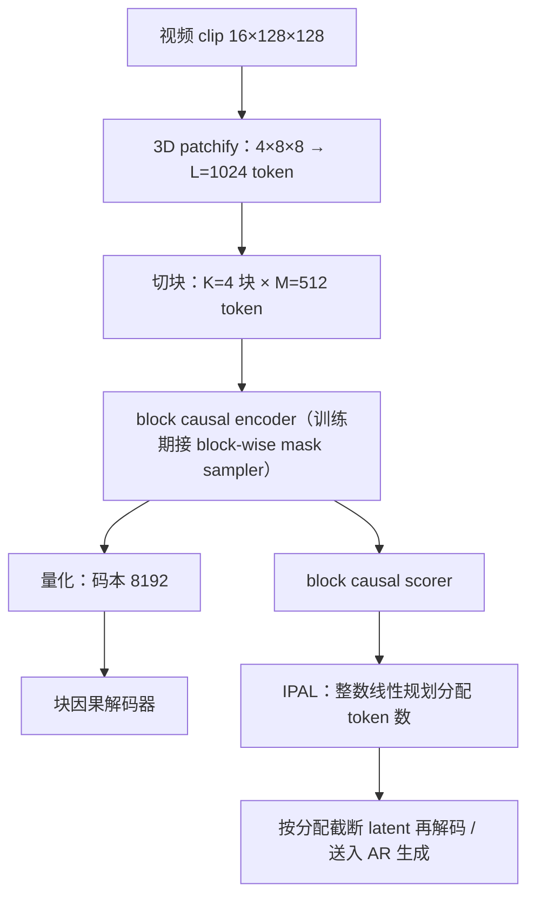
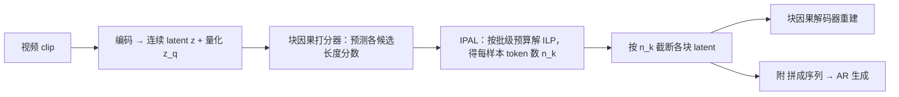

# AdapTok

## 论文信息

| 项 | 值 |
|---|---|
| 标题 | Learning Adaptive and Temporally Causal Video Tokenization in a 1D Latent Space |
| 作者 | Yan Li\*、Changyao Tian\*、Renqiu Xia、Ning Liao、Weiwei Guo、Junchi Yan、Hongsheng Li、Jifeng Dai、Hao Li†、Xue Yang†（\* 同等贡献，† 通讯） |
| 单位 | 上海交通大学、香港中文大学 MMLab、上海 AI Lab OpenGVLab、同济大学、清华大学 |
| venue / 年份 | arXiv `2505.17011`（v1 2025-05-22；v2 2025-10-14）。PDF 标注 Preprint–Under Review，**最终会议未确认** |
| 代码仓库 | https://github.com/VisionXLab/AdapTok |
| papers 库 | 未入库（frontmatter 只写 `arxiv_id`） |

> **作者口径说明**：OpenAlex 对应该 arXiv DOI 的记录把第一作者写成 Menqqi Li，与论文正文的 `Yan Li` 不符；本笔记以论文为准，不采用 OpenAlex 的作者字段。

## 一句话总结

视频 tokenizer 通常给每帧（或每块）分配**固定**数量的 token，于是静止背景与剧烈运动的片段拿到同样的预算，token 被大量花在时间冗余上。AdapTok 把"用多少 token"变成可学习的决策：**训练期**用块掩码让模型见过各种长度，**推理期**用块因果打分器预测"这个块用多少 token 能重建得多好"，再用**整数线性规划**在批级平均预算下把 token 分给最需要的块与样本。

四条贡献：

1. **变长训练**：block-wise mask sampler，训练时逐块从截断高斯采样 token 数，让 block causal 编解码器见过从 32 到 512 的各种长度。
2. **块因果打分器**：一个 transformer encoder，一次前向就预测该块所有候选 token 长度对应的重建质量（以感知损失为标签）；它学的是"质量"，不是"该给多少 token"。
3. **IPAL 推理期分配**：把"给每个样本分多少 token"写成整数线性规划，目标是最小化批内预测感知损失之和，约束是每个样本恰选一个长度、批级总预算固定。
4. **端到端验证**：重建（UCF-101）与生成（UCF-101 类条件、Kinetics-600 帧预测）都验证了自适应分配的收益，且延迟远低于 ElasticTok。

## 问题与动机

token 数量直接决定视频生成的计算成本与可建模时长，因此"压缩到更少 token"一直是 tokenizer 的主要方向。但论文指出一个被忽略的浪费来源：**持久内容在帧与块之间被反复表示**——静止的背景、几乎不变的外观，在每一帧里都占着 token。

于是固定预算有两个方向上的错配：

- **时间方向**：同一段视频里，静止段与运动段的信息密度不同，却拿同样的预算；
- **样本方向**：一段几乎不动的视频与一段剧烈运动的视频，在固定预算下前者被过度编码、后者被压缩到失真。

已有的因果视频 tokenizer（ElasticTok、OmniTokenizer、Cosmos-Tokenizer 等）都采用固定分配。论文的主张是：把"分配"本身做成模型的一部分——先让 tokenizer 具备变长能力，再让一个小的打分器在推理时决定每块用多少。

## 方法精析

整条链路可以压成一句话：**编码器支持变长 → 打分器预测变长下的质量 → 规划器在预算约束下挑长度 → 解码器按分配重建**。

图中的三段分别是：左侧的自适应 tokenizer、中间的块掩码采样（训练期变长）、右侧的打分器（推理期质量预测）；解码器与打分器共用同一套块因果注意力模式。

### 自适应 tokenizer 与变长训练

输入是 `16×128×128` 的 clip，patch 大小为 `4×8×8`，得到 $L = 1024$ 个 token；这串 latent 被切成 $K = 4$ 个块，每块最多 $M = 512$ 个 token。编码器是 block causal transformer——**因果的粒度是块**，不是帧（论文图 1 的题注写明每块对应 4 帧）。

要让模型支持"这个块只用前 200 个 token"，训练时必须让它见过各种长度，这就是 block-wise mask sampler：**每个块随机丢弃尾部 token**，块内保留的 token 数从截断高斯分布采样（均值 $\mu = 256$、标准差 $\sigma = 128$、范围 $[M_{\min}, M_{\max}] = [32, 512]$）。

一个有趣的副作用写在论文的可视化一节：尾部丢弃策略**鼓励头部 token 承载全局信息**——早段 token 捕获全局上下文，后段 token 关注局部细节（见后文图 5）。这一点对"用 token 表示什么"很关键，后文会回到它。

### 块因果打分器

要自适应分配，就得先知道"这个块用多少 token 够"。论文用一个 $S_\phi$ 来预测：给定块内候选长度，输出该长度下的重建质量。

**标签怎么来**：训练时采样一个目标块 $q$，把 latent 序列复制若干份，每份施加不同的 latent mask（对应不同 token 数），前序块的长度随机采样、后续块整体掩掉，然后计算第 $q$ 块在感知损失下的质量作为分数。

$$m'_{p} = \left[\, m_{p,1} \oplus m_{p,2} \oplus \cdots \oplus m_{p,q} \oplus \mathbf{0} \,\right], \qquad m_{p,i<q} = \left[\mathbb{1}_{j \le \ell_i}\right]_{j=1}^{M}, \qquad m_{p,q} = \left[\mathbb{1}_{j \le p}\right]_{j=1}^{M}$$

| 符号 | 含义 |
|---|---|
| $m'_{p}$ | 第 $p$ 份复制样本的 latent 掩码 |
| $q$ | 本次采样的目标块索引 |
| $\ell_i$ | 第 $i$ 块随机采样的 token 数（$i < q$） |
| $p$ | 目标块 $q$ 的候选 token 数 |
| $\mathbf{0}$ | 后续块整体掩掉（长度 0） |

**打分器怎么算**：$S_\phi$ 是带块因果注意力的 transformer encoder，输入是连续 latent 与量化后 token 的拼接，一次前向就给出该块**所有候选长度**的分数：

$$\hat{s} = S_\phi\!\left(z \oplus z_q,\ \mathcal{M}'_{s}\right)_{qM:(q+1)M}$$

| 符号 | 含义 |
|---|---|
| $z$ / $z_q$ | 连续 latent / 量化后 token |
| $\mathcal{M}'_{s}$ | 由基础块因果掩码加 dropout 得到的注意力掩码 |
| $\hat{s}$ | 目标块各候选长度下的预测分数 |

训练目标是预测分数 $\hat{s}$ 与标签分数 $s$（感知损失）之间的 MSE。

### IPAL：推理期的整数线性规划分配

推理时真正要解的是"每个样本给多少 token"。论文把它写成一个整数线性规划（IPAL）：二值变量 $b_{kj}$ 表示第 $k$ 个样本是否被分到 $j$ 个 token，目标是最小化批内预测分数之和，约束是每个样本恰选一个长度、且批级平均预算固定。

$$\min_{b} \sum_{k,j} \hat{s}_{kj} \cdot b_{kj} \quad \text{s.t.} \quad \sum_{j} b_{kj} = 1\ \ \forall k, \qquad \sum_{k,j} j \cdot b_{kj} = B \cdot N_b$$

| 符号 | 含义 |
|---|---|
| $b_{kj} \in \{0,1\}$ | 样本 $k$ 是否分配到 $j$ 个 token |
| $\hat{s}_{kj}$ | 样本 $k$ 用 $j$ 个 token 时的预测分数 |
| $B$ | 批大小 |
| $N_b$ | 每块的平均 token 预算 |

最优解 $b^{*}$ 给出每个样本的 token 数 $n_k = \sum_j j \cdot b^{*}_{kj}$。

论文还比了三种替代策略，作为消融对照：

| 策略 | 做法 |
|---|---|
| Fixed | 所有块固定同样的 token 数 |
| BiThr（score-threshold binary search） | 二分一个全局分数阈值，每块取"分数低于阈值"的最小 token 数 |
| BiDelta（delta-score binary search） | 二分一个增益阈值，取"相邻长度的分数增益低于阈值"的最小 token 数 |
| **IPAL（本文）** | 在批级平均预算约束下联合优化所有样本的分配 |

需要说清一点：IPAL 优化的是**预测感知损失之和在预算约束下的最小化**，不是"理论上最优的 token 分配"——它的质量上限取决于打分器的预测准确度。

### 接生成：变长序列怎么自回归

分配完成后，每块末尾附一个块结束标记 `<EOB>`，把所有块拼成一条自适应长度的序列，交给 Llama 式 transformer 做自回归建模：

$$\mathcal{L} = -\sum_{i=1}^{S} \log P\!\left(\hat{y}_i \mid c,\ y_{1:i-1};\ \theta\right)$$

| 符号 | 含义 |
|---|---|
| $S$ | 自适应序列长度 |
| $y_{1:i-1}$ | 已生成 token |
| $c$ | 条件（类标签，或帧预测的上下文 token） |
| $\theta$ | transformer 参数 |

## 训练与实现细节

| 项 | 值 |
|---|---|
| 数据集 | UCF-101（重建、类条件生成）、Kinetics-600（帧预测，5 帧条件） |
| 数据规模 | 训练数据 **< 0.5M** 公开视频（作者自述受算力限制） |
| 预处理 | `16×128×128` clip；patch `4×8×8` → $L=1024$ token；切 $K=4$ 块、每块 $M=512$ |
| 模型初始化 | 从零训练；变体 S / L / XL 参数量 59M / 259M / 913M；AR 模型 633M 参数 |
| batch size | 128 |
| 学习率 / 调度 | 线性 warmup 到 $10^{-4}$，再用 cosine 退火到 $10^{-6}$ |
| 优化器 | Adam，$\beta_1 = 0.5$、$\beta_2 = 0.9$ |
| 训练轮数 / 步数 | 250 epochs |
| 量化 | 离散 VQ-VAE，码本 8,192 |
| 硬件 / 成本 | **未披露**（作者只说明算力受限、数据规模 <0.5M） |
| 随机种子 / 复现 | **未披露**；代码已开源 |

变长训练的具体分布：块内 token 数从截断高斯采样，$\mu = 256$、$\sigma = 128$、界 $[32, 512]$。

## 推理与系统链路

两个工程读数：

- **延迟**：AdapTok **50.9 ms/video**，ElasticTok **571.7 ms/video**，约 **11×** 差距。
- **因果粒度**：block causal，每块 4 帧。这意味着把它接进流式管线时，**最小延迟粒度是块（4 帧）而不是单帧**——本文并没有提供帧级因果的变体。

（延迟的测量硬件与批设置在正文未说明，本笔记只给相对倍数。）

## 实验与结果

全部实验在 `16×128×128` 上做，**与他篇常见的 `256²` 分辨率不可直接横比**；表中带 `†` 的是作者**同数据同配方复现**的版本，与其原论文数字也不可混读。

### 重建（UCF-101，rFVD ↓）

| 方法 | 数据规模 | 码本 | token 数 | rFVD ↓ |
|---|---|---|---|---|
| OmniTokenizer | 1.4M | 8,192 | 1,280 | 42 |
| ElasticTok | 356M | 64,000 | 1,024 | 390 |
| ElasticTok | 356M | 64,000 | 2,048 | 93 |
| Cosmos-Tokenizer-DV | 100M | 64,000 | 1,280 | 140 |
| OmniTokenizer† | <0.5M | 8,192 | 1,280 | 94 |
| ElasticTok† | <0.5M | 64,000 | 1,022 | 230 |
| CausalTok†（作者自建基线） | <0.5M | 8,192 | 1,024 | 37 |
| **AdapTok** | <0.5M | 8,192 | 512 | 60 |
| **AdapTok** | <0.5M | 8,192 | 1,024 | **36** |
| **AdapTok** | <0.5M | 8,192 | 2,048 | **28** |

读法：AdapTok 在**数据规模小两个数量级**、token 数更少的情况下拿到更好的 rFVD；与同架构但固定分配的 CausalTok† 相比，1024 token 时 36 对 37，论文另称达到可比性能时少用 **1.8×** token。

### 生成

| 任务 | 模型 | 参数量 | gFVD ↓ |
|---|---|---|---|
| 帧预测（Kinetics-600） | AdapTok-AR | 633M | **11** |
| 类条件生成（UCF-101） | AdapTok-AR | 633M | **67** |

论文称在重建性能相当的情况下，自适应分配带来的生成质量优于固定分配的 CausalTok。

### 模型规模

| 变体 | 参数量 | rFVD ↓ | PSNR ↑ | LPIPS ↓ |
|---|---|---|---|---|
| AdapTok-S | 59M | 87.32 | 24.23 | 0.151 |
| AdapTok-L | 259M | 36.36 | 25.72 | 0.144 |
| AdapTok-XL | 913M | 32.43 | 26.29 | 0.103 |

规模增大持续改善，说明收益不是靠小模型取巧。

### 自适应机制消融

| token 预算 | 掩码采样 | 打分器 | rFVD ↓ | PSNR ↑ | LPIPS ↓ |
|---|---|---|---|---|---|
| 1024 | ✗ | ✗ | 37.13 | 25.92 | 0.111 |
| 1024 | ✓ | ✗ | 38.79 | 25.29 | 0.122 |
| 1024 | ✓ | ✓ | **36.36** | 25.72 | 0.114 |
| 512 | ✗ | ✗ | 509.95 | 14.38 | 0.368 |
| 512 | ✓ | ✗ | 121.88 | 22.89 | 0.170 |
| 512 | ✓ | ✓ | **59.96** | 24.06 | 0.144 |

这组数字最能说明问题：**预算越紧，自适应机制的价值越大**——1024 时只从 37.13 改善到 36.36，512 时从 509.95 改善到 59.96（近 8.5 倍）。

### 分配策略与打分指标

| 分配策略 | rFVD ↓ | PSNR ↑ | LPIPS ↓ |
|---|---|---|---|
| Fixed | 38.79 | 25.29 | 0.122 |
| BiThr | 42.12 | 25.23 | 0.120 |
| BiDelta | 38.13 | 25.65 | 0.115 |
| **ILP（IPAL）** | **36.36** | **25.72** | **0.114** |

| 打分指标 | rFVD ↓ | PSNR ↑ | LPIPS ↓ |
|---|---|---|---|
| SSIM | 37.12 | 25.74 | 0.115 |
| PSNR | 36.56 | 25.84 | 0.115 |
| MSE | 36.97 | 25.75 | 0.115 |
| **Perceptual** | **36.28** | 25.72 | **0.113** |

打分指标的选择也值得注意：用某个指标当分数，它会在对应指标上最好（PSNR 分数 → 最高 PSNR），但**用感知损失当分数对 rFVD 与 LPIPS 都最好**，说明它和整体感知质量的相关性更强。

## 相关工作与定位

| 脉络 | 代表 | 与本文的关系 |
|---|---|---|
| 离散视频 tokenizer | MAGVIT、OmniTokenizer、Cosmos-Tokenizer、VidTok、ElasticTok | 都是**固定分配**的因果 / 非因果 tokenizer；本文的直接对照面 |
| 自适应 tokenizer | LaViT、ElasticTok | 已有自适应工作主要在图像侧或非时间因果设定；本文把自适应搬到**时间因果的视频**上 |
| 生成侧 | MAGVIT-AR 一类的 token 自回归建模 | 本文沿用 `<EOB>` + Llama 式自回归，不新造生成范式 |

定位一句话：**本文的贡献不在压缩率本身，而在"把分配决策从人工常数变成模型可预测的量"**，并用 ILP 把它与全局预算耦合起来。

## 局限与启发

### 论文自己承认的局限

- **只做离散 VQ-VAE**：作者把"换成连续 tokenizer 以验证框架通用性"留作未来工作。
- **数据与算力受限**：训练数据 <0.5M 公开视频，作者自述受计算资源限制，未来打算扩大模型容量与数据多样性。

### 我们需要注意的口径

- rFVD 在 `16×128×128` 上测，与他篇 `256²` 不可横比。
- 延迟只给相对倍数（正文未说明测量硬件与批设置）。
- 打分器的上限即分配质量的上限：IPAL 最优的是"预测分数之和"，预测不准则分配次优。
- 会议状态未确认。

### 与数字人的关系（本篇的主要增值）

我们关心的问题是：**能不能用视频 token 来承载数字人的身份表示**。AdapTok 在这个问题上有明确的对上项，也有明确的缺项：

| 维度 | AdapTok 的情况 |
|---|---|
| 时间因果 | ✅ **块级因果**（每块 4 帧），可作为流式链路的因果约束；但**不是帧级**，最小延迟粒度按块计 |
| 预算效率 | ✅ 按内容密度分配 token，静止段少给、运动段多给——正是"把算力花在有信息的帧上" |
| 可控性 | ⚠️ 分配由一个"预算 + 预测质量"的规划控制，可干预预算 $N_b$，但没有语义级控制接口 |
| **身份—运动解耦** | ❌ **没有任何机制**：整套设计里没有"跨帧不变 vs 逐帧变化"的分解，token 是按时间顺序排列的变长序列 |
| **判别/身份监督** | ❌ **完全没有**：分配依据是感知损失（重建质量），不是判别性 |
| 可比性 | ❌ 未知：token 距离是否单调代理身份失配，论文没有涉及 |

由此有两条**必须先验证**的判据（也是 `数字人领域问题` 第七章首条目要用的）：

1. **token 分配是否与身份信息量相关**：AdapTok 按运动/复杂度分配预算，而身份恰恰是**运动之外**的那部分——很可能出现"运动越剧烈、给 token 越多，但身份信息量并没有变"的情况。这可以直接测：固定身份、改变动作，看分配到的 token 数如何变化，以及身份表示是否随之漂移。
2. **跨条件身份 token 的可比性**：把同一人的不同片段、不同人的片段都编码成"身份表示"后，距离分布是否可分——AdapTok 没有任何训练目标保证这一点。

另外论文那条"头部 token 承载全局信息"的观察值得记下：如果要在 AdapTok 里找"最像身份"的部分，**头部 token 是第一个候选**；但"全局上下文"同时包含背景与场景，所以这仍是一条待验证的线索，而不是结论。真正把"跨帧不变"与"逐帧残差"显式分开的是 TivTok 那类分解——本篇与之互补而非替代。

### 可操作启发

- 若要在数字人里做视频 tokenizer 层面的预算优化，AdapTok 的**训练期掩码 + 推理期规划**是可直接借用的两段式做法，且不需要改生成器。
- 块级因果意味着它可以接 4 帧粒度的流式，但若要更低延迟，需要自己把块改小（论文没有做这个消融）。
- 打分器的思路（"预测某个 token 预算下的质量"）可以迁移成"预测某段生成的身份保持分"，但要注意：一旦用它做训练信号就进入度量循环性的风险区（见 [[数字人概述/数字人身份|数字人身份]]）。

## 术语与符号表

| 术语 | 英文 | 含义 |
|---|---|---|
| 1D latent 空间 | 1D latent space | token 排成一维序列、不再与分辨率绑定成二维网格 |
| 块因果 | block causal | 因果粒度是块，块内可见整块信息，跨块只能看历史 |
| 块掩码采样 | block-wise mask sampler | 训练期逐块随机丢弃尾部 token，使模型见过变长输入 |
| 打分器 | adaptive scorer | 预测某块在不同 token 数下的重建质量 |
| IPAL | integer programming-based adaptive allocation | 推理期用整数线性规划分配 token |
| 块结束标记 | `<EOB>` | 变长块序列的分隔符，供自回归建模 |
| 重建 FVD | rFVD | 重建任务的 Fréchet Video Distance |
| 生成 FVD | gFVD | 生成任务的 Fréchet Video Distance |

| 符号 | 含义 |
|---|---|
| $L$ | 一个 clip 的 token 总数（本为 1024） |
| $K$ | 块数（本为 4） |
| $M$ | 每块最大 token 数（本为 512） |
| $N_b$ | 每块的平均 token 预算 |
| $\ell_i$ | 第 $i$ 块实际分配的 token 数 |
| $z$ / $z_q$ | 连续 latent / 量化后 token |
| $S_\phi$ | 块因果打分器 |
| $b_{kj}$ | 分配二值变量 |
| $n_k$ | 样本 $k$ 最终分到的 token 数 |

**四处易错命名**：`IPAL` 是推理期策略、`block-wise mask sampler` 是训练期机制，二者不同；`block causal` 不等于 `frame causal`；`rFVD` 与 `gFVD` 是两个任务的指标；打分器预测的是**质量**，不是**该分配多少 token**。

## 相关文档

- [[数字人概述/数字人领域问题|数字人领域问题]]（第七章「技术适用性」首条目的两篇素材之一）
- [[论文笔记/causal-forcing|Causal Forcing 模型笔记]]（同属"因果 + 表示/蒸馏"这条线）
- [[论文笔记/float|FLOAT 模型笔记]]（低维运动隐空间：与本篇的 token 空间形成对照）
- [[论文笔记/liveact|SoulX-LiveAct 模型笔记]]、[[论文笔记/ditto|Ditto 模型笔记]]（实时流式的另一条路线）
- [[数字人概述/数字人加速|数字人加速]]
