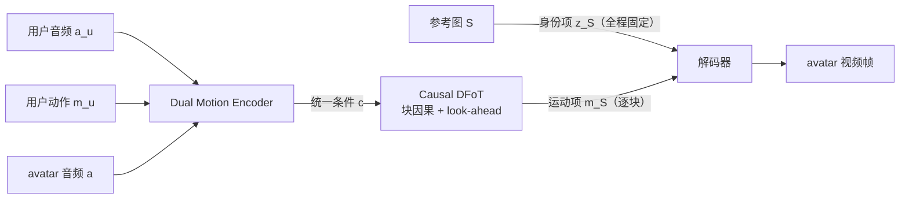
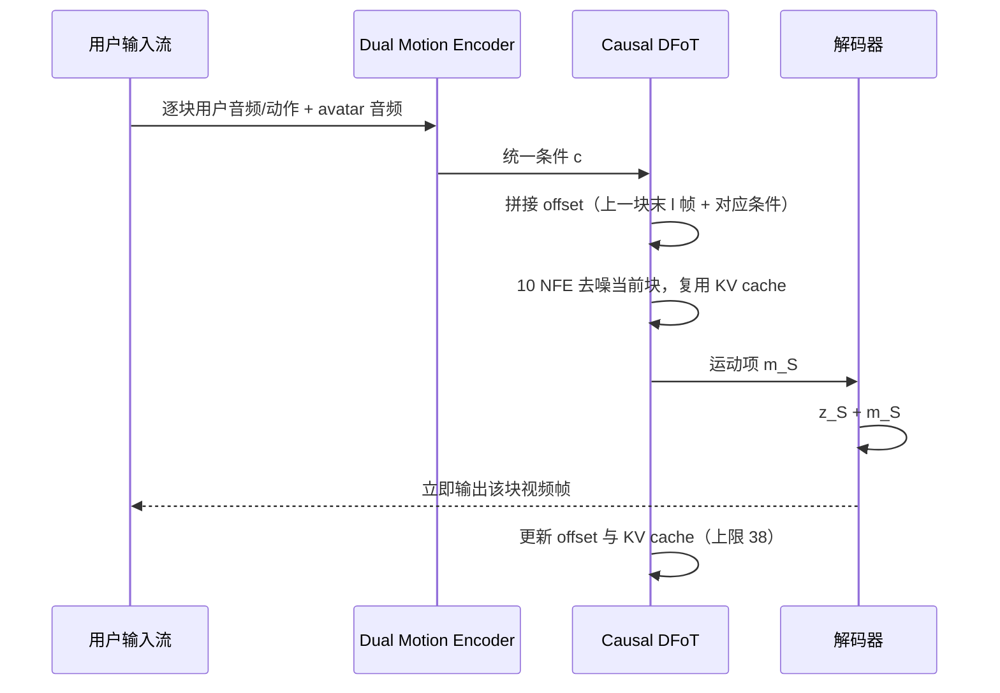

# Avatar Forcing

## 论文信息

| 项 | 值 |
|---|---|
| 标题 | Avatar Forcing: Real-Time Interactive Head Avatar Generation for Natural Conversation |
| 作者 | Taekyung Ki\*、Sangwon Jang\*、Jaehyeong Jo、Jaehong Yoon、Sung Ju Hwang |
| 单位 | KAIST、NTU Singapore、DeepAuto.ai |
| venue / 年份 | CVPR 2026 |
| arXiv | `2601.00664`（v2，2026-01-02） |
| 项目页 | https://taekyungki.github.io/AvatarForcing |
| 代码仓库 | 未公开；我们接入的是 CyberVerse `models/avatarforcing/`（核对基准 `4968280`） |
| papers 库 | `arxiv-2601.00664` |

> **易混提示**：另有一篇 `arXiv:2603.14331`「AvatarForcing: One-Step Streaming Talking Avatars via Local-Future Sliding-Window Denoising」（浙江大学 + 快手 Kling，DiT + 双有界前瞻 + 双锚 KV Cache），与本篇**同名易混但完全是两个模型**。本笔记只写 `2601.00664`；本仓库早期版本的笔记曾把两者的信息缝在一起，已在本篇修正（见 sidecar changelog）。

## 一句话总结

**把「身份」钉死、只让模型逐块预测「运动」，再用块因果扩散往前滚，从而在动作空间里做到可实时交互的双向对话头像。**

- **因果实时**：不依赖完整对话上下文与未来帧，靠 rolling KV cache 复用历史，延迟约 0.5s（对照 INFP\* 3.4s）。
- **双路条件**：用户侧（动作 + 音频）与 avatar 音频先被编码成同一套条件，因此能生成「听」的画面而不只是「说」。
- **免标注表达力**：把「丢掉用户条件」的生成结果当作差样本做 [[技术介绍/dpo-直接偏好优化|直接偏好优化（DPO）]]，不需要人工偏好标注就把动作推得更有反应。
- **覆盖听/说/注视**：同一模型同时输出说话、头动、倾听与注视等整体头动。

## 问题与动机

论文指出真正「面对面感」缺失的两个原因：

1. **实时性受制于因果约束**。交互头像必须持续接收用户的多模态线索（语音、头动、表情）。已有方法（INFP）虽然也在运动隐空间里做快速推理，但**双向 Transformer 需要整段对话上下文**（超过 3 秒，且包含未来帧），必须先等够长的一段音频才能开始生成，交互延迟明显。
2. **表达力缺乏监督信号**。倾听行为本质上「一对多」，没有唯一正确答案；而训练数据里**倾听片段普遍比说话片段单调**（论文用 3DMM 表情的 L2 范数方差对比了说话人/倾听方，见下图），模型于是学会了被动、僵硬的倾听。

## 方法精析

整体链路：**用户动作 + 用户音频 + avatar 音频 → Dual Motion Encoder 统一条件 → Causal DFoT 逐块生成运动 → 用固定身份项解码出画面**。

### 表示：显式拆成身份项与运动项

沿用 FLOAT 的 motion latent auto-encoder，把图像映射成可加分解的隐变量：

$$
z = z_S + m_S, \qquad z \in \mathbb{R}^d, \qquad d = 512
$$

$z_S$ 编码身份/外观，整段对话中**保持固定**；$m_S$ 编码口头与非口头运动（表情、头动）。模型只预测运动项，身份项不参与生成——这既是「把身份钉住」的实现，也是**训练用视频、推理用单图**得以成立的原因。

### 生成：块因果 Diffusion Forcing

条件三元组与自回归分解：

$$
p_\theta\!\left(m^{1:N}\right)
= \prod_i p_\theta\!\left(m^i \mid m^{<i}, c^i\right),
\qquad
c^i = \left(a_u^i, m_u^i, a^i\right)
$$

其中 $a_u^i$、$m_u^i$ 与 $a^i$ 分别表示第 $i$ 个位置的用户音频、用户动作与 avatar 音频。

生成器是带块因果结构的 diffusion forcing transformer（DFoT）：**一个 block 内所有帧共享同一个噪声时间步**，block 之间严格因果（当前块不能看未来块）。但严格因果会在块边界产生逐帧抖动，因此给 mask 加**有界前瞻（look-ahead）**：

$$
M_{i,j} =
\begin{cases}
1, & \left\lfloor j / B \right\rfloor \le \left\lfloor i / B \right\rfloor + l, \\
0, & \text{否则}.
\end{cases}
$$

$B$ 是块大小、$l$ 是前瞻帧数。训练时允许看未来 $l$ 帧；推理时真实未来帧不存在，改用上一块末尾 $l$ 帧作为历史 offset 替代。

### 条件：Dual Motion Encoder

用户侧信号（$m_u$、$a_u$）先经一层 cross-attention 对齐出整体用户运动表征，再与 avatar 音频 $a$ 经第二层 cross-attention 融合，得到统一条件。**用户动作 $m_u$ 是必需的**——论文消融显示，去掉它之后用户在静音时头像完全不动，也看不到微笑这类非语言线索。

### 表达力：把 DPO 用在运动隐变量上

论文先诊断出一个数据侧偏差：真实对话里倾听片段比说话片段单调（用 3DMM 表情的 L2 范数方差对比说话人/倾听方即可看出），模型因此学成被动、不回应的倾听。而「合适的反应」本身没有唯一答案，做不到像唇同步那样逐帧对齐，于是论文把它当作对齐问题处理，用的是免奖励模型的 [[技术介绍/dpo-直接偏好优化|直接偏好优化（DPO）]]。

**两阶段训练**。Stage 1 先用扩散强制目标把运动生成训到收敛；Stage 2 才做偏好微调，并把 Stage 1 的权重复制一份、冻结为参考向量场 `v_ref`：

$$
\mathcal{L}_{\mathrm{ft}}(\theta)
= \mathcal{L}_{\mathrm{DF}}(\theta)
+ \lambda\,\mathcal{L}_{\mathrm{DPO}}(\theta)
$$

保留 $\mathcal{L}_{\mathrm{DF}}$ 意味着偏好项只调整倾向，不替换原本的条件生成能力。

**偏好判别从哪来**。论文既不收集人工偏好标注，也不训练奖励模型，而是用同一段双人对话构造一对运动隐变量：

| 角色 | 来源 | 生成时看到的条件 |
|---|---|---|
| preferred $m^w$ | 真实视频编码出的运动隐变量 | 完整互动条件 $c = (a_u, m_u, a)$ |
| less-preferred $m^l$ | 单独训练的 FLOAT talking-avatar 模型生成 | **只有 avatar 音频**，用户音频与用户动作被丢弃 |

关键在「丢弃用户条件」发生在**造负样本**这一步：`m^l` 是一个会说、但不回应你的反面例子。到了 DPO 训练，两侧都按完整条件评估，模型要学的是「有用户线索时应该怎么动」，而不是去模仿一段没有用户线索的独白。

**损失怎么落到每一帧**。附录把目标逐帧展开：winner 与 loser 共用同一个噪声序列，按帧各自取流时间 `t_n` 加噪后，当前模型 `v_θ` 与冻结的 `v_ref` 分别对两侧预测向量场，再比较预测误差的相对变化：

$$
\mathcal{L}_{\mathrm{DPO}}(\theta)
= - \mathbb{E}\!\left[
  \log \sigma \!\left(
    -\beta \left[
      \left\lVert v^w_{t_n} - v_\theta(m^w_{t_n}, t_n, c^n) \right\rVert_1
      - \left\lVert v^w_{t_n} - v_{\mathrm{ref}}(m^w_{t_n}, t_n, c^n) \right\rVert_1
      - \left(
        \left\lVert v^l_{t_n} - v_\theta(m^l_{t_n}, t_n, c^n) \right\rVert_1
        - \left\lVert v^l_{t_n} - v_{\mathrm{ref}}(m^l_{t_n}, t_n, c^n) \right\rVert_1
      \right)
    \right]
  \right)
\right]
$$

$c^n$ 是第 $n$ 帧的统一条件，$m_{t_n}$ 是加噪后的运动隐变量，$v_{t_n} = m - m_0$ 是目标向量场。方括号内是「当前模型比参考模型在真实运动上改善了多少」减去「在仅音频样本上改善了多少」；最小化它，就是要求模型相对参考模型更拟合真实互动，同时相对更不迁就那个不回应用户的反例。论文这里用的是 $L_1$ 距离，也没有引入扩散 DPO 中的时间权重项——机制相同，损失形式按流匹配的加噪约定实例化。

**效果**。$\lambda = 0.1$、$\beta = 1000$，只微调 5k 步，继续训练未见额外增益。消融中固定「有用户运动 $m_u$」、只切换 DPO 时（数值见 [消融](#消融)）：反应性 rPCC-Exp 0.042→0.003、rPCC-Pose 0.146→0.036，动作丰富度 SID 2.236→2.442、Var 1.408→1.734，FID/FVD 同步改善；代价是身份相似度 CSIM 0.854→0.833、唇同步 LSE-C 6.803→6.723 的小幅回落。所以这不是「全指标提升」，收益集中在反应性与动作丰富度上。可视化结论一致：去掉 DPO 后表情与头动明显更单调、也不再回应用户的微笑；启用后头动更自然，会跟着用户微笑而笑得更开。

## 训练与实现细节

| 项 | 值 |
|---|---|
| 数据集 | RealTalk + ViCo（双人对话）；另从 HDTF 随机取 50 条评 talking head |
| 数据规模 | 未披露（论文未给片段数/小时数） |
| 预处理 | PySceneDetect 切场景 → Face-Alignment 检测追踪并裁到 512×512 → IIANet 视觉引导语音分离（区分说话人/倾听方）→ 统一 25 fps / 16 kHz |
| 模型初始化 | motion latent auto-encoder 从 FLOAT 权重出发，**在本数据集上重训**；latent 维度 $d = 512$ |
| 生成器配置 | 8 个注意力头、hidden $h = 1024$、1D RoPE |
| 训练窗口 | $N = 50$ 帧、$B = 5$ 个 block（**10 帧/块**）、look-ahead $l = 2$ |
| 音频编码 | Wav2Vec2.0 提取 **12 个多尺度特征** |
| batch size | 8 |
| 学习率 / 调度 | Adam，`1e-4`（调度未披露） |
| 优化器 | Adam |
| 训练步数 | Stage 1（diffusion forcing，冻结 motion AE，L1 损失）**2000k steps**；Stage 2（DPO 微调）**5k steps**，再训无额外增益 |
| 硬件 / 成本 | 单张 NVIDIA H100（总机时未披露） |
| 随机种子 / 复现设置 | 未披露 |
| 采样 | 10 NFE（Euler 求解器）+ classifier-free guidance |
| DPO 超参 | 平衡系数 $\lambda = 0.1$、偏离参数 $\beta = 1000$，参考模型 $v_{\mathrm{ref}}$ 用 Stage 1 权重初始化 |

## 推理与系统链路

推理的核心是「一次只生成一个块，但用缓存与 offset 维持连续性」：

三个关键机制：

1. **Offset 替代未来帧**。第 $i+1$ 块的 offset 由上一块末尾 $l$ 帧的运动隐变量与对应条件组成：

   $$
   O^{i+1} = \left(m_1^i[-l:],\; c^i([-l:])\right).
   $$

   因为这些帧已经是「干净」的，可以给它们单独的流时间步（$t = 1$），与当前噪声块（$t = t_j$）拼接后一起送入。
2. **独立 CFG 三路缓存**。CFG 并行比较「无条件」「只有 avatar 音频」「avatar 音频 + 用户条件」三种预测再合成。三路分别缓存 KV，避免重复计算；由于用了 look-ahead 与 offset，最后 $l$ 帧不进缓存，因此**最大缓存长度为 $M = L - B - l = 38$**。
3. **块因果 vs 双向**。与 INFP 的双向 DiT 需要整段时序窗口不同，块因果结构只看历史 + 有限前瞻，天然支持 KV 缓存与恒定延迟。

工程侧落点：我们把这条链路接成生产者/消费者结构（逐块喂音频、连续出帧、缓存窗口有界），并接入静默运行时（倾听态画面）。细节见 [[数字人概述/工程设计|工程设计]]。

## 实验与结果

### 评估口径

论文从五方面评：**延迟、反应性（rPCC-exp / rPCC-pose）、动作丰富度（SID / Var）、画质（FID / FVD / CSIM）、唇同步（LSE-D / LSE-C）**。其中 rPCC/SID/Var/FD 基于 SPECTRE 提取的 3DMM 表情与姿态参数。

### 交互头像主结果（RealTalk）

| 方法 | 用户输入 | 延迟↓ | rPCC-Exp↓ | rPCC-Pose↓ | SID↑ | Var↑ | FID↓ | FVD↓ | CSIM↑ | LSE-D↓ | LSE-C↑ |
|---|---|---|---|---|---|---|---|---|---|---|---|
| FLOAT（非交互参照） | ✗ | 2.4s | 0.054 | 0.182 | 2.785 | 2.778 | 81.297 | 438.817 | 0.845 | 8.135 | 6.361 |
| INFP\*（复现） | ✓ | 3.4s | 0.035 | 0.064 | 2.343 | 1.638 | 24.551 | **159.000** | **0.867** | **8.027** | 6.536 |
| **Ours** | ✓ | **0.5s** | **0.003** | **0.036** | **2.442** | **1.734** | **24.328** | 170.874 | 0.833 | 8.060 | **6.723** |
| GT（上限） | — | — | 0.000 | 0.000 | 3.972 | 1.658 | — | — | 0.796 | 7.790 | 6.940 |

读法：**延迟与反应性全面领先**（0.5s vs 3.4s；rPCC 越低越好），动作丰富度（SID/Var）也更高；画质与唇同步与 INFP\* 同档（FVD 略高、CSIM 略低、LSE-C 略高）。摘要里「6.8× 加速」应为对基线的推理加速比，**论文未给出细口径**（未说明是同硬件同设置下的哪个量），引用时需注明。

### 人类偏好研究

42 名参与者、12 组视频，按 Reactiveness / Motion Richness / Verbal Alignment / Non-verbal Alignment / Overall 五项偏好打分。整体偏好 **>80%**，其中非语言对齐与反应性优势最明显，论文归因于 DPO 的效果。

### 与 talking head / listening head 的对比

**Talking head（HDTF，丢用户条件推理）**

| 方法 | FID↓ | FVD↓ | CSIM↑ | LSE-D↓ | LSE-C↑ |
|---|---|---|---|---|---|
| SadTalker | 64.744 | 342.996 | 0.697 | 8.046 | 7.171 |
| Hallo3 | 32.794 | 184.341 | 0.865 | 8.498 | 7.487 |
| FLOAT | 25.110 | 167.463 | **0.881** | **7.553** | **8.006** |
| INFP\* | 27.155 | 187.977 | 0.840 | 7.810 | 7.325 |
| **Ours** | **20.332** | **149.798** | 0.870 | 7.700 | 7.560 |

**Listening head（ViCo，`†` 表示数字继承自 DIM）**

| 方法 | FD-Exp↓ | FD-Pose↓ | rPCC-Exp↓ | rPCC-Pose↓ | SID-Exp↑ | SID-Pose↑ | Var-Exp↑ | Var-Pose↑ |
|---|---|---|---|---|---|---|---|---|
| RLHG† | 39.02 | 0.07 | 0.08 | 0.02 | 3.62 | 3.17 | 1.52 | 0.02 |
| L2L† | 33.93 | 0.06 | 0.06 | 0.08 | 2.77 | 2.66 | 0.83 | 0.02 |
| DIM† | 23.88 | 0.06 | 0.06 | 0.03 | **3.71** | 2.35 | 1.53 | 0.02 |
| INFP\* | 17.52 | 0.07 | **0.01** | 0.07 | 2.19 | **3.20** | 2.10 | 0.03 |
| **Ours** | **16.64** | **0.05** | **0.01** | **0.01** | 3.12 | 3.00 | **2.80** | **0.03** |

倾听侧几乎全指标最优，尤其用户-头像同步（rPCC）最好。注意基线数字来自 DIM 而非自跑，属跨协议比较。

### 消融

| 配置 | rPCC-Exp↓ | rPCC-Pose↓ | SID↑ | Var↑ | FID↓ | FVD↓ | CSIM↑ | LSE-D↓ | LSE-C↑ |
|---|---|---|---|---|---|---|---|---|---|
| 无 `m_u`、无 DPO | 0.052 | 0.175 | 2.165 | 1.586 | 28.746 | 185.593 | 0.818 | 8.260 | 6.423 |
| 有 `m_u`、无 DPO | 0.042 | 0.146 | 2.236 | 1.408 | 25.600 | 175.322 | **0.854** | 8.160 | **6.803** |
| 有 `m_u`、有 DPO（完整） | **0.003** | **0.036** | **2.442** | **1.734** | **24.328** | **170.874** | 0.833 | **8.060** | 6.723 |

- **去掉用户动作 `m_u`**：反应性与丰富度显著下降，且用户静音时头像静止不动（即使有微笑这类非语言线索）。
- **去掉 DPO**：表情与头动多样性下降、不再回应微笑；反过来，启用 DPO 换来的收益集中在反应性与丰富度，代价是身份相似度与一项唇同步指标的小幅回落（见上一节）。
- **块大小权衡**（固定 50 帧训练）：

| block 数 | 延迟↓ | rPCC-Exp↓ | rPCC-Pose↓ | FVD↓ | SID↑ | LSE-D↓ |
|---|---|---|---|---|---|---|
| 10（块更小） | **0.3s** | 0.012 | 0.056 | 222.47 | 2.355 | 7.290 |
| 2（块更大） | 1.5s | **0.003** | **0.031** | **155.81** | 2.145 | **6.555** |
| **5（本文）** | 0.5s | **0.003** | 0.036 | 170.87 | **2.442** | 6.723 |

块越小延迟越低但时序一致性（FVD）与唇同步变差；块越大则相反。
- **DF vs 普通自回归扩散**：自回归扩散（条件只用干净历史块）在长时程上出现明显的运动漂移，而 diffusion forcing 稳定得多。

## 相关工作与定位

| 方法 | 运动表示 | 需要未来上下文 | 需要人工角色切换 | 实时性 |
|---|---|---|---|---|
| DIM | 量化成 verbal / non-verbal 两个离散空间 | — | **是**（说话/倾听状态切换不连续） | 未针对实时 |
| INFP | 运动隐空间 + 双向 Transformer | **是**（整段对话、>3s） | 否（统一 memory bank） | 不适合（延迟 3.4s） |
| ARIG | 隐式 3D 关键点 | 否 | 否 | 时序一致性差、缺整体头动 |
| **Avatar Forcing** | FLOAT motion latent（身份/运动可加分解） | 否（块因果 + 有限前瞻） | 否 | **约 0.5s** |

论文把工作落在第三条线「dyadic conversational avatar」：不再靠显式控制信号或人工角色切换，而是让两端的多模态信号在同一个因果生成模型里持续互相影响。

## 局限与启发

### 论文自己承认的局限

- 只建模头部运动，**无法表达手势等更丰富的身体线索**。
- 用户线索虽经运动隐变量进入模型，但**缺少更显式的可控性**（如指定注视方向、强调情绪变化）。论文认为可加入眼动/情绪追踪等新条件，且框架对此没有架构限制。
- **Diffusion forcing 并不能完全解决 exposure bias**，论文把在运动隐空间里彻底解决它留作未来工作。
- 伦理风险：更逼真的交互头像加剧身份伪造与深度伪造风险，论文建议水印、限制性许可，并鼓励用生成数据训练伪造检测器。

### 我们的实测（这条线是论文留的「未来工作」，我们把它做成了实验）

- **漂移诊断**：把逐帧运动向量拆成模长与方向两个假说。实测**模长撑开被否证**（没有持续增长），**方向游走**在单身份长轨迹上得到支持，因此治理应优先约束方向。
- **治理裁决**：推理期**锚点引导有效**（用该身份的特征字典引导生成方向，长视频身份相似度显著回升，且不需要重训、可随时开关）；训练期参考条件化**两轮失败并回退**；学习式锚力**终止**（身份指标更好但人眼出现头部抖动）；把身份相似度当损失**放弃**（管不住脸部尺度漂移，根因是标量指标管不了多维度漂移）。
- **中文音频适配**：原模型吃英文音频特征。做法不是在中文数据上重训主干，而是在中文编码器与冻结主干之间加桥（蒸馏桥 → 几何约束桥 → 关系蒸馏），主干保持冻结。
- **微调注入点**：从「碰得最少」到「最开放」排了四档（全冻结+桥 / LoRA / 单层解冻 / 桥内 LoRA），结论是**注入点比 rank 更影响结果**，全开放会让桥与主干失去配合。

### 可操作启发

1. **把「必须等未来」换成「用干净历史 + 有限前瞻」**：这是延迟从 3.4s 降到 0.5s 的关键，也是任何流式生成系统都值得复用的思路。
2. **偏好学习的负样本可以「造」出来**：不需要标注，只要找到一种会系统性变差的退化路径（此处是「丢掉用户条件」）就能构造偏好对。
3. **指标高不等于可用**：我们的「学习式锚力」身份指标更好却出现头抖，说明身份相似度是标量、漂移是多维的——评估口径的裂缝比模型缺陷更值得警惕。

## 术语与符号表

| 术语 | 英文 | 含义 |
|---|---|---|
| 扩散强制 | Diffusion Forcing (DF) | 每个 token 有独立噪声水平的因果序列扩散训练范式 |
| DFoT | Diffusion Forcing Transformer | 本文的块因果生成器 |
| 有界前瞻 | look-ahead | 允许每个块额外看到 `l` 帧未来以平滑块边界 |
| 块因果掩码 | blockwise causal mask | 块内双向、块间因果的注意力掩码 |
| 双路运动编码器 | Dual Motion Encoder | 把用户侧信号与 avatar 音频编码成统一条件的模块 |
| 身份-运动分解 | identity-motion decomposition | $z = z_S + m_S$，身份项全程固定 |
| 运动丰富度 | Motion Richness | 用 SID 与 Var 衡量的动作多样性 |
| 反应性 | Reactiveness | 用户与头像动作的同步程度（rPCC） |

| 符号 | 含义 |
|---|---|
| `S` | 输入参考图像 |
| $z$, $z_S$, $m_S$ | 总隐变量、身份项、运动项 |
| $d$ | 运动隐变量维度（512） |
| $v_\theta$ | 预测向量场的模型（Dual Motion Encoder + Causal DFoT） |
| $c^i = (a_u^i, m_u^i, a^i)$ | 第 $i$ 帧条件三元组（用户音频、用户动作、avatar 音频） |
| $N$, $B$, $l$ | 训练帧数 50、块数 5（10 帧/块）、前瞻 2 帧 |
| $O^i$ | 第 $i$ 块生成时拼接的历史 offset |
| $M$ | KV cache 上限，$L - B - l = 38$ |
| $\lambda$, $\beta$ | DPO 的平衡系数 0.1 与偏离参数 1000 |

## 相关文档

- 论文层深读：[[knowledge/Avatar Forcing 模型精读|Avatar Forcing 模型精读]]、[[knowledge/Avatar Forcing Motion Latent AutoEncoder|Avatar Forcing Motion Latent AutoEncoder]]
- 工程与微调：[[knowledge/Avatar Forcing 微调实践|Avatar Forcing 微调实践]]、[[knowledge/微调策略专题|微调策略专题]]
- 背景与定位：[[knowledge/数字人基础|数字人基础]]、[[数字人概述/数字人介绍与技术路线|数字人介绍与技术路线]]
- 我们这条线上的复盘：[[数字人概述/数字人身份|数字人身份]]、[[数字人概述/数字人动作|数字人动作]]、[[数字人概述/工程设计|工程设计]]
- papers 库条目：`arxiv-2601.00664`
- 易混对照：`arXiv:2603.14331`「AvatarForcing: One-Step Streaming Talking Avatars via Local-Future Sliding-Window Denoising」（浙大 + 快手 Kling），博客精读见 `avatarforcing-2026.html`
