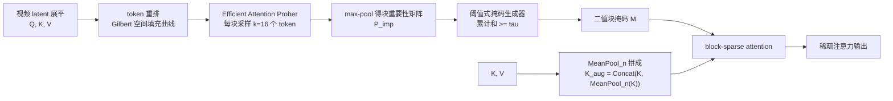

# BLADE

## 论文信息

| 项 | 值 |
|---|---|
| 标题 | BLADE: Block-Sparse Attention Meets Step Distillation for Efficient Video Generation |
| 单位 | 浙江大学 / 华为中央媒体技术院（Central Media Technology Institute, Huawei Technologies，见 §6 Acknowledgement） |
| venue / 年份 | arXiv 预印本（正文 HTML 路径含 `v2/ICLR26`），年份未在正文标注 |
| arXiv | `2508.10774v2` |
| 项目页 | http://ziplab.co/BLADE-Homepage/ |
| 代码仓库 | **论文正文未给出任何仓库地址**（全文无 GitHub 链接）；项目页是否含开源代码**待核** |
| papers 库 | **未入本地 papers 库**，故按命名规范写 `papers_id: arxiv-2508.10774` |

> **素材来源性质**：本篇主源为 arXiv LaTeXML 全文 HTML，**无 PDF**（抓取记录 `IncompleteRead`、source tarball HTTP 406），因此全文引用只用**章节号 / 公式号 / 图号 / 表号 / 算法号，不写页码**。证据等级与训练定位引用**本仓库知识库整理**（`knowledge/视频生成训练与推理加速专题.md`，下称「我方整理」），属二手性质，已逐处标注。

## 一句话总结

**BLADE = 自适应块稀疏注意力（ASA）+ 稀疏感知的 data-free 步数蒸馏（建立在 TDM 之上）的联合训练框架**，它把「每步的注意力内核成本」和「去噪步数」两段开销放在同一个训练回路里一起压，代价是**必须做蒸馏训练（LoRA 微调）**。

- **两段成本同时命中**：block-sparse 把注意力从稠密换掉（kernel 73.25 ms → 22.21 ms，**3.30×**，有效稀疏率 0.798），步数从官方 50 步蒸到 **8 步**；合起来在 Wan2.1-1.3B 上拿到端到端 **14.10×**，CogVideoX-5B **8.89×**（表 2、表 1）。
- **联合而非拼接**：不是「先蒸馏再套稀疏」（那样要重新引入昂贵的高质量视频数据），而是在 TDM 训练回路内**每步都用 ASA 生成轨迹**，让分布匹配损失在稀疏约束下更新权重（§3.4）。
- **data-free 的准确含义**：不需要原始真实视频训练集，但**仍需要 10,000 条文本 prompt**（JourneyDB 采样 + Qwen2.5-3B-Instruct 增强）和冻结教师模型（§4.1、§2.2）。
- **另有一个零训练变体**：标准 ASA（无 `_G` 后缀）可不改权重直接推理；主结果 14.10× / 8.89× 用的是蒸馏版 ASA_G。
- **增益是亚线性的**：kernel 3.30× 但相对同步数稠密模型端到端只有 **1.504×**，论文自述蒸馏后注意力已非主导瓶颈（§4.2）。

## 问题与动机

视频 DiT 的推理成本可以拆成两份：**每步的注意力开销**（token 数平方增长）与**总步数**（少步采样难保质量）。两条加速线各自都有成熟做法，但论文指出的矛盾在于**两者的组合方式**：

- **训练无关地叠加不行**：直接把稀疏注意力套到已蒸馏的少步模型上，质量会掉（§1 第 2 段；表 3 里训练无关稀疏方法的 PSNR 只有 16.7–22.2 区间）。
- **先蒸馏、再训稀疏也不行**：稀疏化要改注意力结构，训完再改就得重新引入**昂贵的高质量视频数据**做补训（§1 第 2 段）。
- **已有稀疏方法各有取舍**（§2.3）：STA 是固定局部窗、SVG 只能在两种预定义掩码里二选一、Radial Attention 在短序列上稀疏收益不显著、SpargeAttention 训练无关但不能训练且稀疏度必须保守、VSA 可训练但用固定 attention cube 影响可用分辨率。

由此论文的 insight 是**把加速约束放回训练阶段**：让 student 模型**在稀疏约束下**学一条少步生成轨迹——即 `sparsity-aware distillation`（§3.4）。这样做还有两个副作用被论文当作收益：① 稀疏掩码是**内容自适应**的（在线按内容生成），不必手工设固定窗口；② 稀疏感知训练被作者解释为带正则化效应，使质量**不低于** 50 步基线（§4.2，作者解释，非独立因果证据）。

图 1 是理解 BLADE 的钥匙：它画的**不是**一个「蒸馏完再稀疏」的两段流水线，而是**同一个区间内三方闭环**——学生（稀疏）、教师（真分数）、假分数模型并行更新。也就是说稀疏注意力从训练第一步就参与生成轨迹，蒸馏损失衡量的是「稀疏学生」与「稠密教师」的分布差，而不是「先训好再近似」。

## 方法精析

BLADE 由三层可独立读的模块组成：**(A) ASA 掩码生成**（免训练即可用）→ **(B) ASA_G 全局 token 增强**（供蒸馏训练）→ **(C) 稀疏感知步数蒸馏回路**。以下公式的 LaTeX 均照抄论文 HTML 的 `alttext` 原文。

### A. ASA 掩码生成（免训练即可用）

流程三步（§3.3；算法 1–3）：

1. **局部性保持的重排**：用 **Gilbert 空间填充曲线**（引自 SpargeAttention）重排 token，把被 raster-scan 打散的空间邻接恢复回来，使同一块内语义更连贯（§3.3 Preprocessing）。消融显示重排让 VBench-1.0 quality 从 0.779 升到 **0.788**（表 4）。
2. **块重要性估计（在线近似）**：每块**随机采样 k 个 token**（`k = 16 < b = 128`）算低分辨率注意力，再对块做 max-pool 得重要性矩阵。其思想来自稠密注意力：

$$
P=\operatorname{softmax}\!\left(\frac{QK^{\top}}{\sqrt{d_{k}}}\right),\qquad P_{\text{imp}}=\operatorname{MaxPool}_{b\times b}(P)
$$

| 符号 | 含义 |
|---|---|
| $P$ | 稠密注意力矩阵 |
| $Q,K$ | 查询 / 键矩阵（展平后的视频 token） |
| $d_k$ | 键维度 |
| $P_{\text{imp}}$ | 块重要性矩阵：把 $P$ 按 $b\times b$ 分块后取 max-pool |
| $b$ | 块大小（默认 128） |

这一步把理论复杂度从 $\mathcal{O}(N^{2})$ 降到约 $\mathcal{O}\!\left(N^{2}\cdot(k/b)^{2}\right)$（$N$ 为序列长度）：只对采样的 $k\times k$ 小块算注意力，而不算整个 $b\times b$ 块。

3. **阈值式掩码构造**：对 $P_{\text{imp}}$ 逐行归一化、降序排序，取**最小的 m 使累计和 ≥ τ**，并把 m 夹到保留率区间，得到二值掩码 $M$：

$$
\sum_{j=1}^{m}\tilde{P}_{\text{imp}}(i,j)\ \ge\ \tau,\qquad \tilde{P}_{\text{imp}}(i,j)=\frac{P_{\text{imp}}(i,j)}{\sum_{k}P_{\text{imp}}(i,k)}
$$

| 符号 | 含义 |
|---|---|
| $\tilde{P}_{\text{imp}}(i,j)$ | 按行归一化后的块重要性 |
| $m$ | 该行保留的 key 块数量（取最小满足累计阈值者） |
| $\tau$ | 累计注意力阈值；正文举例 **90%**、图 2 题注举例 **95%**（两处不一致，主结果取值**未披露**） |
| 保留率上下界 | 算法 3 提到把 m 夹在最小/最大保留比之间，**具体数值未披露** |

图 2 证明「稀疏选中的位置不是随机的」：论文把稀疏掩码 (a) 与全注意力 (b) 叠加到帧上 (c)，三个场景（鸟 / 卡通 / 老人）里稀疏方法都对准了关键语义物体（附录 B）。这解释了为什么高稀疏率下质量仍能守住，也提示读者：ASA 的稀疏是**内容感知**的，不是固定窗口或固定 stride。

### B. ASA_G：全局 token 增强（供蒸馏训练）

高稀疏率下，块稀疏会丢掉全局上下文；ASA_G 把 K/V 的 mean-pool 版本拼到原序列上，给全局 token 一个固定加性掩码 $\ln n$ 以补偿 pooling 的 1/n 平均效应（§3.3 Step 2.2；图 2 题注）：

$$
K_{\text{aug}}=\operatorname{Concat}\!\left(K,\ \operatorname{MeanPool}_{n}(K)\right)
$$

| 符号 | 含义 |
|---|---|
| $K_{\text{aug}}$ | 增强后的键序列 |
| $\operatorname{MeanPool}_{n}(K)$ | 对 K 做窗口 $n$ 的均值池化，序列长度降为 $1/n$ |
| $\ln n$ | 加在 pooled「全局 token」区的固定加性掩码，补偿均值带来的分数衰减 |

消融显示两个部件都"不可或缺"：ASA 0.539 → 加全局 token 后 **0.569** → 再去掉加性掩码降到 0.559（表 5，均高于 50 步基线 0.534）。**注意 $n$ 的具体取值未披露**。

### C. 稀疏感知步数蒸馏回路（Video-BLADE）

蒸馏建立在 **TDM（Trajectory Distribution Matching，Luo et al. 2025）**之上，由三方角色构成（§3.1、§3.2）：教师 $f_\phi$（冻结的 50 步预训练模型）提供真分数 $s_\phi$；学生 $G_\theta$（**与教师同架构同权重初始化，仅把 self-attention 换成 ASA**）提供轨迹；假分数模型 $f_\psi$ 逼近学生不可解的分数 $s_\psi$。学生侧的对齐目标是**分布**而非逐实例轨迹：

$$
\mathcal{L}(\theta)=\sum_{i=0}^{K-1}\lambda_{i}D_{\text{KL}}\!\left(p_{\theta,t_{i}}(\mathbf{x}_{t_{i}})\,\|\,p_{\phi,t_{i}}(\mathbf{x}_{t_{i}})\right)
$$

| 符号 | 含义 |
|---|---|
| $K$ | 蒸馏阶段（区间）数 |
| $\lambda_i$ | 第 i 阶段权重 |
| $p_{\theta,t_i}$ / $p_{\phi,t_i}$ | 学生 / 教师在第 i 阶段的轨迹分布 |
| $D_{\text{KL}}$ | 分布对齐的 KL 散度；对齐的是分布，非实例级轨迹 |

学生不可解的 true score 用假分数模型替换，得到可实现的梯度近似（式 4）：

$$
\nabla_{\theta}\mathcal{L}(\theta)\approx\sum_{i=0}^{K-1}\sum_{j=t_{i}}^{t_{i+1}}\lambda_{j}\left[s_{\psi}(\mathbf{x}_{j},j)-s_{\phi}(\mathbf{x}_{j},j)\right]\frac{\partial \mathbf{x}_{t_{i}}}{\partial\theta}
$$

| 符号 | 含义 |
|---|---|
| $s_\phi$ / $s_\psi$ | 教师真分数 / 假分数模型输出 |
| $\mathbf{x}_{t_i}$ | 第 i 阶段学生去噪出的干净目标 |
| $\mathbf{x}_j$、$j\in[t_i,t_{i+1})$ | 对目标再扰动得到的中间加噪样本 |
| $\partial \mathbf{x}_{t_i}/\partial\theta$ | 学生参数对阶段样本的梯度 |

**两个省显存的实现选择**（§3.2 末）：① 蒸馏区间 $[t_i,t_{i+1})$ **互不重叠**，因此一个假分数模型就能覆盖所有阶段；② 学生反传**一次只走一个 ODE step**。这两条是把 TDM 从理论变成可跑的关键工程细节。

## 训练与实现细节

| 项 | 值 | 披露状态 |
|---|---|---|
| 数据集 | 10,000 条文本 prompt，从 JourneyDB 采样，Qwen2.5-3B-Instruct 增强质量与多样性；**无真实视频训练集**（data-free） | 已披露（增强方法与筛选标准**未披露**） |
| 模型初始化 | 学生与教师同 DiT 架构、同权重初始化，仅替换 self-attention 为 ASA | 已披露 |
| batch size | **未披露** | 未披露 |
| 学习率 / 调度 | student `1e-4`、fake score model `5e-4`；AdamW（β1=0，β2=0.95，grad clip 1.0） | 已披露 |
| 训练轮数 / 步数 | **100–200 iterations**（区间） | 部分披露（收敛判据、总时长**未披露**） |
| 微调方式 | **LoRA Enabled = True**（alpha 64，rank **未披露**） | 部分披露 |
| 并行 / 显存 | Training Mode = **Zero2**；gradient checkpointing True | 已披露 |
| 硬件 | 训练 **8×A800(80GB)** 集群 | 已披露 |
| 随机种子 | 42 | 已披露 |
| 采样超参 | CFG 5（Wan2.1）/ 6（CogVideoX）；Wan2.1-1.3B：480×832、16 FPS、序列 32760 token；CogVideoX-5B：480×720、8 FPS、序列 17550 token | 已披露 |
| ASA 超参 | block size $b=128$、每块采样 $k=16$；阈值 $\tau$ 与 pool 窗口 $n$ **未披露** | 部分披露 |

**一句话**：这不是从头训练（学生直接继承教师权重），也不是纯量化/低比特路线（全文无 FP8/INT8/QAT 相关词），而是**蒸馏式后训练微调**——训练量级很小（100–200 iterations），但必须有**教师 + 假分数模型 + 文本 prompt**这套前置。

## 推理与系统链路

推理链路的每一段如下（输入 → 生成 → 输出）：

| 阶段 | 处理 | 是否被 BLADE 加速 |
|---|---|---|
| 文本 + 初始噪声 | prompt 编码、采样初始 latent | 否 |
| VAE encoder | latent 编码 | **否**（论文明确指出它成为新瓶颈） |
| 去噪主体（8 步） | 每步在线生成块稀疏掩码 M；block-sparse attention（Triton kernel） | **是**——掩码生成 + 稀疏注意力，训练/推理共用同一套逻辑 |
| 非注意力层 | transformer 内 FFN 等 | **否** |
| VAE decoder | latent 解码为视频帧 | **否** |

掩码**在线生成**（Prober 采样 → max-pool → 阈值筛选），训练与推理共用同一套掩码逻辑（§3.3 Step 2.2）。系统层**没有**做序列并行、量化、算子融合栈或 offload；kernel 是 **Triton** 实现，论文自承这"prevents it from fully realizing its theoretical speedup"，未来才做 CUDA 优化（§5）。

## 实验与结果

### 主结果：质量与效率（两套口径必须分开读）

**效率（表 2，Wan2.1-1.3B，单张 H20）**：

| 指标 | FA2-50 | FA2-8 | ASA-8 |
|---|---|---|---|
| Kernel Time (ms) | 73.25 | 73.25 | **22.21** |
| Kernel Speedup | 1.00× | 1.00× | **3.30×** |
| E2E Time (s) | 338.41 | 36.11 | **24.00** |
| E2E Speedup | 1.00× | 9.37× | **14.10×** |

**读法**：14.10× 是**两段成本相乘**的结果——步数 9.37×（50 步 → 8 步）× 稀疏注意力 1.504×（24.00 s vs 同 8 步的 36.11 s），不是单点突破。kernel 3.30× 与端到端 1.504× 之间的落差是全文最有工程价值的一条观察。

**质量（表 1，VBench-2.0，baseline 为官方 50 步）**：

| 模型 | 方法 | Sparsity | Total | Speedup |
|---|---|---|---|---|
| CogVideoX-5B（17550 token） | Baseline-50 | — | 0.534 | 1× |
| | ASA_G（Ours） | 0.82 | **0.569** | **8.89×** |
| Wan2.1-1.3B（32760 token） | Baseline-50 | — | 0.563 | 1× |
| | FA2-8 | — | **0.580** | 9.37× |
| | ASA_G（Ours） | 0.8 | 0.570 | **14.10×** |

**两处必须如实写的边界**：① Wan2.1 上 **FA2-8 的 Total（0.580）比 ASA_G（0.570）更高**，论文自己承认（§4.2）；② 质量提升只能说「**相对 50 步 baseline 提升**」，不能说「全面优于所有 8 步稠密蒸馏模型」。

### 消融与训练无关对比

| 表 | 结论 |
|---|---|
| 表 4（token 重排） | 无重排 0.779 → 有重排 **0.788**（VBench-1.0，CogVideoX-5B） |
| 表 5（全局 token G 与加性掩码 AM） | ASA 0.539 → ASA_G **0.569** → 去掉 AM 0.559（baseline-50 为 0.534） |
| 表 3（训练无关稀疏，8 步蒸馏模型） | 同为 0.50 稀疏率下 ASA **22.20** PSNR / 0.8290 SSIM，略优于 RaA 22.07 / 0.8191；0.75 档 ASA 19.55 / 0.7433 明显优于 STA 16.72 / SVG 16.68 |
| 表 6（人工偏好，50 prompt） | CogVideoX ASA_G vs Baseline：16 胜 / 10 负 / 24 平；Wan：10 / 12 / 28；STA 对照组 0 胜 / 26 负 / 24 平 |

**表 3 有一个值得记的细节**：高稀疏（0.50）免训练场景下 ASA 只小幅领先 RaA，优势幅度有限——ASA 的主要价值更可能体现在「可训练/可联合蒸馏」这一维度，而不是免训练 PSNR 的绝对领先（这是本文正文未展开的判断，属**待自测**项）。

### 报告口径与边界（不可与其它论文直接横比）

| 维度 | 口径 |
|---|---|
| 模型规模 | **Wan2.1-1.3B（1.3B）** 与 **CogVideoX-5B（5B）**，两者规模不同，**14.10× 与 8.89× 之间不可互相解释** |
| 分辨率 / FPS / 序列 | 480×832 / 16fps / 32760 token（Wan）与 480×720 / 8fps / 17550 token（CogVideoX），口径不对称 |
| 硬件 | **训练** 8×A800(80GB)；**效率计时** "test on an H20"（表 2 只针对 Wan2.1-1.3B，未写明卡数） |
| 步数口径 | baseline = 官方 50 步；其余方法统一用 TDM 蒸到 **8 步**（表 1 注） |
| 质量口径 | VBench-2.0（主）、VBench-1.0（重排消融）、PSNR/SSIM（免训练）、人工偏好（50 prompt） |
| 不可横比声明 | 不同模型规模、分辨率、token 长度、测试硬件、基线与步数口径下的倍数**不可与 FPSAttention / WorldAttention / DAX / TurboDiffusion 等论文直接横比** |

## 相关工作与定位

| 类别 | 代表工作 | 与本文的关系 |
|---|---|---|
| 步数蒸馏 | Progressive Distillation、InstaFlow、DMD2 | 本文直接建立在 **TDM** 之上并采纳其 data-free 特性 |
| 稀疏注意力 | STA（固定局部窗）、Radial Attention（启发式）、SVG（两种预定义掩码二选一）、SpargeAttention（training-free 但不能训练）、VSA（可训练但固定 attention cube）、FlashAttention-2（稠密基线） | 本文的差异是**把「动态内容感知稀疏」与「步数蒸馏」联合、data-free 训练**，而非训练无关叠加或先蒸馏后补训 |
| 定位（**我方整理**） | `knowledge/视频生成训练与推理加速专题.md` | BLADE 被归入「**需要蒸馏**」一档（§2.1 表、§三 训练费光谱），共同点段写「FPSAttention/BLADE 都把加速约束放回训练阶段」 |

## 局限与启发

### 论文自陈的局限（§5）

1. 实验**限于中等长度序列**，分钟级、十万级 token 尚未验证。
2. ASA kernel 仅有 **Triton** 实现，未吃满理论加速上限，未来才做 CUDA 优化。
3. 未来工作是把方法扩展到长视频、3D 与图像生成。

### 论文局限 vs 我们结论

**我方未接入 BLADE**（本地训练源码矩阵中没有 CogVideoX-5B / Wan2.1-1.3B 条目），因此本表只记**定位与可复用点**，不给任何"本地可用"的承诺：

| 维度 | 论文口径 | 我们的结论 |
|---|---|---|
| 本地是否接入 | — | **未接入**；本地无对应 T2V 训练链与权重，只作方法参考 |
| 证据等级 | 论文自身给出 VBench-2.0 / H20 计时 / 人工偏好 | **论文已验证（中等长度序列为主）**，来源**我方整理（知识库 视频生成训练与推理加速专题）**；论文未给开源仓库链接，**不能升格为「代码或 README 证据」** |
| 本地复现 | 100–200 iterations | **待自测**；batch size、训练总时长、GPU hours **未披露**，无法估本地成本 |
| 可复用点 1 | kernel 3.30× 但端到端仅 1.504× | 「**只换 attention 函数不够**」——蒸馏后注意力已非瓶颈，VAE 与非注意力层开始主导运行时。这是给本地数字人选优化方向时最有用的判断 |
| 可复用点 2 | 在训练回路内注入稀疏约束（§3.4） | 机制可迁移：把近似约束放进训练/蒸馏目标，而不是推理期后贴；对应本地「补齐训练链才谈得上这类加速」的前置条件 |
| 可复用点 3 | 算法 1 ComputeMaxPooledAttnMap（在线 softmax + running max） | 若做二次实现，这是一份比正文更精确的规格来源（附录 D） |

### 可操作启发

1. **加速倍数是乘积，不是单点**：引用 BLADE 时务必带三件套（模型规模 + 分辨率/序列长 + 硬件口径），并说明 14.10× 里既有步数也有稀疏。
2. **蒸馏之后的战场会转移**：注意力被压下去后，`VAE encoder/decoder` 与非注意力层成为主导——本地数字人做加速时应先 profiling 再决定要不要做注意力优化。
3. **data-free 要加限定语**：写成「不依赖原始真实视频训练集（仍需 10,000 条 prompt 与教师模型）」，避免被读成零数据。
4. **不要把它读成即插即用**：ASA 有免训练变体，但 14.10× / 8.89× 属于需要蒸馏的 ASA_G；混写会误导选型。

## 术语与符号表

| 术语 | 英文 | 含义 |
|---|---|---|
| 自适应块稀疏注意力 | ASA（Adaptive Block-Sparse Attention） | 内容自适应、硬件友好的块稀疏注意力，可免训练推理 |
| 带全局 token 的 ASA | ASA_G | 蒸馏用增强版，把 mean-pool 全局 token 拼到 K/V 缓解全局信息丢失 |
| 轨迹分布匹配 | TDM | 本文蒸馏底座；对齐分布而非逐实例轨迹，且 data-free |
| 稀疏感知蒸馏 | sparsity-aware distillation | 把 ASA 直接嵌进 TDM 训练回路，在稀疏约束下学轨迹（§3.4） |
| 无数据 | data-free | 不依赖原始真实视频训练集，但仍用 1 万条文本 prompt |
| 假分数模型 | fake score model $f_\psi$ | 与学生并发训练，逼近学生不可解样本的分数 |
| 高效注意力探针 | Efficient Attention Prober | 每块采样少量代表 token 算出 max-pooled 注意力矩阵 |
| 阈值式掩码生成器 | Threshold-based Mask Generator | 排序后取覆盖阈值 τ 的 top 块，生成二值掩码 |
| 加性掩码 | additive mask（AM） | 对全局 token 区在 softmax 前加固定偏置 $\ln n$ |
| 空间填充曲线 | Gilbert space-filling curve | token 重排方式，恢复被 raster-scan 破坏的空间局部性 |
| 有效稀疏率 | effective sparsity rate | 效率分析中报 **0.798**（Wan2.1-1.3B ASA-8） |
| 端到端 / 内核时间 | E2E / kernel time | 表 2 的两档口径；E2E 含 VAE 编解码与非注意力层 |

| 符号 | 含义 |
|---|---|
| $f_\phi$, $s_\phi$ | 教师（真分数）模型及其真分数 |
| $G_\theta$ | 学生生成器（稀疏） |
| $f_\psi$, $s_\psi$ | 假分数模型及其输出 |
| $K$ | （蒸馏式中）阶段数；同一字母在注意力部分表示 Key 矩阵，论文未区分 |
| $b$, $k$, $n$, $\tau$ | block size(128) / 每块采样数(16) / mean-pool 窗口（**未披露**）/ 累计阈值（90% 或 95%，**未披露**主值） |
| $P$, $P_{\text{imp}}$, $M$ | 稠密注意力 / 块重要性矩阵 / 二值块掩码 |
| $K_{\text{aug}}$ | $K_{\text{aug}}=\operatorname{Concat}(K,\operatorname{MeanPool}_n(K))$ |
| $\lambda_i$ | 各蒸馏阶段权重 |
| $\mathbf{x}_{t_i}, \mathbf{x}_j$ | 学生干净目标 / 再扰动后的中间样本 |

## 相关文档

- 加速专题与定位：[[knowledge/视频生成训练与推理加速专题|视频生成训练与推理加速专题]]、[[数字人概述/数字人加速|数字人加速]]（正文已点名本组十个工作，链接待补）
- 最直接的同类对照：[[论文笔记/fpsattention|FPSAttention 模型笔记]]（同样把加速约束放回训练阶段，但走 FP8 量化 × 稀疏）
- 生成空间/范式的另一条解法：[[论文笔记/ditto|Ditto 模型笔记]]、[[论文笔记/avatar-forcing|Avatar Forcing 模型笔记]]
- 篇目与索引：[[论文笔记/README|论文笔记]]（本篇属「生成侧加速十篇」，papers 库未入库，仅登记 arXiv）
