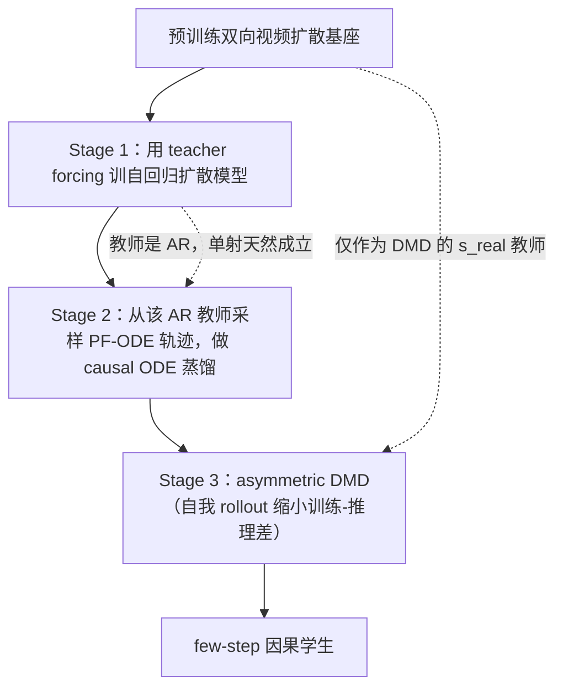
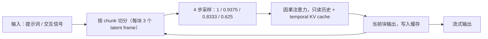

# Causal Forcing

## 论文信息

| 项 | 值 |
|---|---|
| 标题 | Causal Forcing: Autoregressive Diffusion Distillation Done Right for High-Quality Real-Time Interactive Video Generation |
| 作者 | Hongzhou Zhu\*、Min Zhao\*、Guande He、Hang Su、Chongxuan Li、Jun Zhu†（\* 同等贡献，† 通讯） |
| 单位 | 清华大学（计算机系 / BNRist / THU-Bosch ML Center）、ShengShu、The University of Texas at Austin、中国人民大学高瓴人工智能学院 |
| venue / 年份 | ICML 2026 |
| arXiv | `2602.02214`（v1 2026-02-02；v5 2026-06-01） |
| 项目页 | https://thu-ml.github.io/CausalForcing.github.io/ |
| 代码仓库 | 开源：https://github.com/thu-ml/Causal-Forcing |
| papers 库 | 未入库（frontmatter 只写 `arxiv_id`） |

> **定位提示**：本篇不提出生成架构，而是论证「双向基座 → 因果学生」的蒸馏**错在哪**、该怎么改。它与 [[论文笔记/avatar-forcing|Avatar Forcing 模型笔记]] 有直接张力：Avatar Forcing 用 block-causal diffusion forcing 训运动隐变量，本篇则论证 diffusion forcing 存在训练—推理分布失配、会导致塌陷。两者的对照写在「局限与启发」。

## 一句话总结

把预训练**双向**视频扩散模型蒸馏成 **few-step 自回归（AR）** 生成器时，除了"少步采样"还有一道 **architectural gap**（全注意力 → 因果注意力）。论文指出：现有 SOTA（Self Forcing）的两阶段流程中，**DMD 阶段补不上这道 gap**，责任全在 **ODE 初始化**；而这类 MSE 回归式 ODE 蒸馏要求配对数据**单射**，双向教师只在 **video level** 单射，AR 学生需要的却是 **frame level** 单射，于是最优解塌成条件期望、画面发糊。

四条贡献：

1. **诊断**：给出 frame-level injectivity 这个必要条件，并证明 Self Forcing 的 ODE 初始化（双向教师 → AR 学生）必然违反它，最优解是条件期望而非数据分布。
2. **换教师**：用 **teacher forcing 训出的自回归扩散模型**当 ODE 蒸馏的教师，单射条件天然成立；顺带给出反直觉结论——**teacher forcing 比 diffusion forcing 更适合训 AR 扩散模型**（DF 存在 KL > 0 的训练—推理失配）。
3. **三阶段方法**：TF 训 AR 扩散 → causal ODE 蒸馏 → asymmetric DMD；在**同等训练预算**下超过 Self Forcing 19.3%（Dynamic Degree）。
4. **推广到一致性蒸馏**：给出首个 **causal consistency distillation** 框架，优于用双向教师做初始化的 asymmetric CD。

## 问题与动机

实时交互式视频生成要求**因果、低延迟、可流式**的生成器，因此主流做法是把预训练的双向扩散模型蒸馏成 few-step 自回归模型（CausVid、Self Forcing 这一支）。这条路上有两道差：

- **sampling-step gap**：多步采样 → 少步采样；
- **architectural gap**：全注意力（可看未来帧）→ 因果注意力（只能看历史）。

前者是所有步数蒸馏都有的问题，后者才是"双向改因果"特有的。论文先确认了差距确实存在：在同一个双向基座上，SOTA 的 Self Forcing 在画面质量、动态程度与指令遵循上都明显弱于**标准的 DMD**——后者蒸的是双向学生，不存在架构差，可以作为上界参照。

这篇论文的 insight 是：既然差距出在"双向 → 因果"，那就该问**这道差是在哪一阶段被补上的**。论文用一组隔离实验回答：把标准 DMD 蒸出的 few-step **双向**模型直接拿去初始化 AR 学生（等于消掉 sampling-step gap、只留 architectural gap），结果仍然显著差于标准 DMD。

结论很直接：**architectural gap 必须在 ODE 初始化阶段解决**，DMD 无能为力。而 ODE 初始化本身有一个必须满足的前提，这正是论文明细攻击的地方。

## 方法精析

### Self Forcing 的两阶段与它漏掉的前提

Self Forcing 的先验流程是：先用 ODE 蒸馏把双向基座转成 few-step 因果学生，再用 asymmetric DMD 缩小训练—推理差。ODE 蒸馏阶段的目标是

$$\theta^{*} = \min_{\theta}\; \mathbb{E}_{t,\, x_t^{1:N},\, i}\left[\left\|G_\theta\left(x_t^{i},\, x_t^{<i},\, t\right) - x_0^{i}\right\|^{2}\right]$$

| 符号 | 含义 |
|---|---|
| $G_\theta$ | 待训的自回归学生网络，输入噪声帧与历史，输出干净帧 |
| $x_t^{1:N}$ | 一条 PF-ODE 轨迹上第 $t$ 步的含噪视频（$N$ 帧） |
| $x_t^{i}$ / $x_t^{<i}$ | 第 $i$ 帧的噪声状态 / 第 $i$ 帧之前的历史 |
| $x_0^{i}$ | 第 $i$ 帧的干净目标 |
| $t \in S$ | 预定义的采样时间步集合 |

关键在于：这里的配对数据 $(x_t^{1:N}, x_0^{1:N})$ 来自**双向教师**的 PF-ODE 轨迹。

### 必要条件：frame-level injectivity

论文指出，MSE 回归式 ODE 蒸馏要成立，配对数据必须**单射**——同一时刻的每个含噪样本只能对应**唯一**的干净样本。在"双向教师 → 双向学生"的常规设定下，这个条件在 **video level** 天然成立：任意含噪视频 $x_t^{1:N}$ 唯一对应一条干净视频 $x_0^{1:N} = \phi^{\mathrm{Bi}}(x_t^{1:N}, t)$。

但 AR 模型逐帧生成，单射要求被下移到 **frame level**：

$$\forall i \in [N],\quad x_t^{i} = y_t^{i} \;\Rightarrow\; \phi^{\mathrm{AR}}\left(x_t^{i}, t\right) = \phi^{\mathrm{AR}}\left(y_t^{i}, t\right)$$

| 符号 | 含义 |
|---|---|
| $\phi^{\mathrm{AR}}$ | AR 模型把单帧噪声状态映射到干净帧的流映射 |
| $\phi^{\mathrm{Bi}}$ | 双向模型的 video-level 流映射 |
| $[N]$ | 帧索引集合 |

**双向教师必然违反它。** 直觉是：双向模型去噪第 $i$ 帧时用了**所有**帧——固定 $x_t^{i}$ 而改变 $x_t^{>i}$，得到的干净帧 $x_0^{i}$ 会不同。而 AR 学生在监督时没有未来帧，于是同一张含噪帧在训练数据里可能对应多张不同的干净帧，条件以正概率被违反。论文用引理形式化了这一点（$\mathrm{Var}(\phi^{\mathrm{Bi}}(x_t^{1:N},t)^{i} \mid x_t^{i}, t) > 0$ 的概率为正）。

一旦违反，回归目标的最优解就不再是教师的流映射，而是**条件期望**：

$$G_\theta^{*}\left(x_t^{i},\, x_t^{<i},\, t\right) = \mathbb{E}\left[x_0 \mid x_t^{i},\, x_t^{<i},\, t\right] \;\not\sim\; p_{\mathrm{data}}\left(x_0^{i}\right)$$

学条件均值等于对多张候选帧做平均，表现就是画面发糊。命题给出的是"最优解不服从数据分布"这一步的正式陈述。

### 三阶段：Causal Forcing

既然病根是"教师不是因果的"，修法就是**换教师**。论文的三阶段：

**Stage 1：用 teacher forcing 训练 AR 扩散模型。** 这一阶段论文推翻了一个常见信念：它发现 **teacher forcing（TF）比 diffusion forcing（DF）更适合训 AR 扩散模型**。理由是分布失配——DF 在训练第 $i$ 帧时条件在**高噪**的历史帧 $x_t^{<i}$ 上，而推理时条件在**干净**历史 $x_0^{<i}$ 上，两者的 KL 严格为正；TF 用干净历史做条件，与推理对齐。论文用命题形式给出该失配，并用实验佐证：沿路径塌陷会**虚高**动态指标（DF 的 Dynamic Degree 更高，但论文判定那是病态）。

**Stage 2：causal ODE 蒸馏。** 教师换成 AR 扩散模型后，先按所需时间步 $S$ 采样并存储 PF-ODE 轨迹（记作数据集 $\mathcal{D}_{\mathrm{Causal}}$）：以真实干净前缀 $x_{\mathrm{gt}}^{<i}$ 为条件、从高斯噪声起步，用教师生成当前帧。学生的回归目标变成

$$\theta^{*} = \min_{\theta}\; \mathbb{E}_{x_{\mathrm{gt}}^{<i},\, t \in S,\, i,\, x_t^{i}}\left[\left\|G_\theta\left(x_t^{i},\, x_{\mathrm{gt}}^{<i},\, t\right) - x_0^{i}\right\|^{2}\right]$$

形式与 Stage 相同，唯一变更是**教师从双向换成自回归**。因为 AR 教师的 PF-ODE 在 frame level 天然单射，条件期望塌陷不再发生，学生可以真正学回教师的流映射。

**Stage 3：asymmetric DMD。** 沿用 Self Forcing 的做法，让学生条件在自己的生成前缀上做自我 rollout。DMD 的梯度形式为

$$\nabla_\theta \mathbb{E}_t\left[\mathrm{KL}\left(p_{\theta,t} \,\Vert\, p_{\mathrm{data},t}\right)\right] = -\,\mathbb{E}_{\tilde{x},\, t,\, \tilde{x}_t}\left[\left(s_{\mathrm{real}}(\tilde{x}_t, t) - s_{\mathrm{fake}}(\tilde{x}_t, t)\right)\frac{\partial \tilde{x}}{\partial \theta}\right]$$

| 符号 | 含义 |
|---|---|
| $\tilde{x}$ | 学生自身生成的样本 |
| $\tilde{x}_t$ | 对其加噪后的样本，诱导分布 $p_{\theta,t}$ |
| $s_{\mathrm{real}}$ | 冻结的扩散模型，给出数据分布下的 score |
| $s_{\mathrm{fake}}$ | 在线可训的扩散模型，给出学生分布下的 score |

论文强调 DMD 阶段本身**没有变化**，变的是它的初始化：初始化对了，DMD 才能把差距压下去。

### 扩展：causal consistency distillation

论文指出 ODE 蒸馏可视为一致性蒸馏（CD）的简化形式，因此同一套"教师必须是因果的"论证可以外推到 CD，并给出**首个 causal CD 框架**。它用上述原生 AR 扩散模型当教师，按 teacher forcing 训练因果一致性模型：

$$\theta^{*} = \min_\theta \mathbb{E}_{x_\mathrm{gt},\, \epsilon,\, t,\, i}\left[w(t)\, d\left(G_\theta\left(x_t^{i}, x_\mathrm{gt}^{<i}, t\right),\ G_{\theta^-}\left(\hat{x}^{i}_{t-\Delta t}, x_\mathrm{gt}^{<i}, t-\Delta t\right)\right)\right]$$

| 符号 | 含义 |
|---|---|
| $\hat{x}^{i}_{t-\Delta t}$ | 从 $x_t^{i}$ 出发、用 AR 教师条件在干净前缀上解一步 ODE 得到的中间状态 |
| $G_{\theta^-}$ | 目标网络（EMA 副本） |
| $w(t)$ / $d(\cdot,\cdot)$ | 时间权重 / 距离度量 |

一个实现上的简化值得记下：离散时间 CD 需要边界条件 $G_\theta(x^{i}, x_\mathrm{gt}^{<i}, 0) \equiv x^{i}$，通常要引入 $c_\mathrm{skip}(t)$、$c_\mathrm{out}(t)$ 包裹网络；而论文用的是 flow matching 的 $v$-预测参数化，直接写成

$$G_\theta\left(x^{i}, x_\mathrm{gt}^{<i}, t\right) = x^{i} - t\, v_\theta\left(x^{i}, x_\mathrm{gt}^{<i}, t\right)$$

就自动满足边界条件，无需额外设计。论文自述这只是 vanilla LCM 的初步实例、弱于 score distillation，但论证了方向。

## 训练与实现细节

三阶段的总步数与数据构造如下（全部沿用 Self Forcing 的协议，只有教师与初始化不同）：

| 项 | 值 |
|---|---|
| 基座 | Wan2.1-T2V-1.3B（沿用 Self Forcing），生成 81 帧、832×480 |
| 数据集 | $\mathcal{D}_{\mathrm{Bi}}$ ≈ 3K 条（由双向 Wan 依 VidProM 提示词合成，同时存下噪声中间态供基线 ODE 消融用）；$\mathcal{D}_{\mathrm{Causal}}$ = 3K 条（由 AR 教师采样）；Stage 3 用 VidProM |
| 数据规模 | 2×3K 内部合成 + VidProM；两套合成数据使用近似相同的提示词，作者以此保证数据质量无差 |
| 预处理 | chunk-wise 设定下每块 3 个 latent frame；另有 frame-wise 设定 |
| 模型初始化 | Stage 2 的学生由 Stage 1 的 AR 扩散教师初始化；Stage 3 的 DMD 教师 $s_\mathrm{real}$ = Wan2.1-14B，$s_\mathrm{fake}$ = Wan2.1-1.3B |
| batch size | 64（全阶段一致） |
| 学习率 / 调度 | Adam，lr $2\times10^{-6}$，$\beta_1=0$，$\beta_2=0.999$；其余设置与 Self Forcing 相同 |
| 优化器 | Adam |
| 训练轮数 / 步数 | Stage 1 = 2K 步；Stage 2 = 1K 步；Stage 3 = 750 步收敛；消融中两个 ODE 变体都是 3K 总步（2K+1K），两个 CD 变体都是 3K 步 |
| 硬件 / 成本 | 训练硬件**未披露**；吞吐与延迟的评测在单张 H100 上 |
| 随机种子 / 复现 | **未披露**；代码已开源（`thu-ml/Causal-Forcing`） |

推理侧：4 步采样，时间步固定为 $1,\ 0.9375,\ 0.8333,\ 0.625$，且 causal ODE 初始化与 asymmetric DMD 共用同一组时间步。causal CD 变体沿用 LCM 方案（48 个离散时间步、UniPC 求解器、EMA 率 0.99、3K 步训练）。

## 推理与系统链路

| 项 | 值 / 口径 |
|---|---|
| 采样步数 | 4 步（ODE 初始化与 DMD 共用时间步） |
| 分块 | chunk-wise：每块 3 个 latent frame；另有 frame-wise 设定 |
| 历史读取 | 因果注意力 + temporal KV cache（论文在与其他 AR 蒸馏范式的区别中明确声称支持） |
| 吞吐 | 17.0 FPS（单张 H100） |
| 延迟 | 0.69 s（单张 H100） |
| 口径警告 | 论文附录写明「基线的吞吐与延迟直接取自 Self Forcing 论文」，非本文实测；本文与 Self Forcing 的 17.0 FPS / 0.69 s 完全相同，因为实现与协议一致 |

## 实验与结果

### 评测口径

主基准是 VBench。整体视觉质量用 VisionReward（与人类判断相关性好），并额外报告它的 prompt 对齐子分作为 **Instruction Following**。因为 VBench 的许多提示词几乎没有运动，作者另建了 **100 条运动丰富的提示词集**，Dynamic Degree、VisionReward、Instruction Following 都在这个集上评测；而 VBench 的 Total / Quality / Semantic 仍走**官方提示词**（连其中的 Dynamic Degree 项也来自官方提示词）。所有指标都乘了 100 便于阅读。VisionReward 的分值域为 $[-1, 1]$，**可为负**，越高越好。此外做了 10 人 × 10 条提示词的用户研究，只要求对整体质量排序。

### 主结果

| 模型 | 吞吐↑ | 延迟↓ | Total↑ | Quality↑ | Semantic↑ | Dynamic↑ | Vision↑ | Instruct↑ | Rating↓ |
|---|---|---|---|---|---|---|---|---|---|
| *双向视频扩散* | | | | | | | | | |
| LTX-1.9B | 8.98 | 13.5 | 79.83 | 81.88 | 71.62 | 46 | −6.218 | −38 | 6.40 |
| Wan2.1-1.3B | 0.78 | 103 | 83.37 | 84.30 | 79.65 | 61 | 5.275 | 42 | 2.29 |
| *自回归视频扩散* | | | | | | | | | |
| NOVA | 0.88 | 4.1 | 80.31 | 80.66 | 78.92 | 46 | −7.381 | −16 | 8.41 |
| Pyramid Flow | 6.70 | 2.5 | 80.75 | 83.41 | 70.11 | 16 | 4.055 | −2 | 6.11 |
| SkyReels-V2-1.3B | 0.49 | 112 | 81.97 | 83.96 | 74.01 | 37 | 3.584 | 32 | 6.57 |
| MAGI-1-4.5B | 0.19 | 282 | 78.88 | 81.67 | 67.72 | 42 | 0.773 | 8 | 6.44 |
| *蒸馏自回归* | | | | | | | | | |
| CausVid | 17.0 | 0.69 | 81.33 | 83.98 | 70.72 | 62 | 5.741 | 12 | 4.27 |
| Self Forcing | 17.0 | 0.69 | 83.74 | 84.48 | 80.77 | 57 | 5.820 | 48 | 2.87 |
| **Causal Forcing** | 17.0 | 0.69 | **84.04** | **84.59** | **81.84** | **68** | **6.326** | **56** | **1.64** |

三类基线要分开读：

- **对比双向基座**：Total 上超过同量级的 Wan2.1-1.3B（84.04 对 83.37），吞吐是它的 **2079%**（0.78 → 17.0 FPS）。
- **对比自回归（未蒸馏）**：相对该组最好的 Dynamic（NOVA 46）、Vision（Pyramid 4.055）、Instruct（SkyReels 32）分别提升 **47.8% / 56.0% / 75.0%**。
- **对比蒸馏自回归**：吞吐与延迟完全相同（同为 17.0 FPS / 0.69 s），相对 Self Forcing 提升 Dynamic **19.3%**（57→68）、VisionReward **8.7%**（5.820→6.326）、Instruction Following **16.7%**（48→56），Rating 从 2.87 降到 1.64。论文特别指出两条蒸馏基线在 DMD 前都做了至少 3K 步 ODE 初始化，与方法的总预算相同——即**同等预算下的净收益**。

### 消融

| 方法 | Total↑ | Quality↑ | Semantic↑ | Dynamic↑ | Vision↑ | Instruct↑ |
|---|---|---|---|---|---|---|
| *自回归扩散训练* | | | | | | |
| Diffusion Forcing | 81.76 | 82.52 | 78.71 | **60** | 1.583 | 30 |
| Teacher Forcing | **82.12** | **82.73** | **79.67** | 50 | **3.343** | **32** |
| *Score Distillation（chunk-wise）* | | | | | | |
| Self Forcing 的 ODE + DMD | 82.00 | 82.18 | 81.29 | 24 | 3.330 | 38 |
| Causal ODE + DMD | **84.04** | **84.59** | **81.84** | **68** | **6.326** | **56** |
| *Score Distillation（frame-wise）* | | | | | | |
| Self Forcing 的 ODE + DMD | 81.83 | 82.66 | 78.50 | 2 | 1.951 | −4 |
| Causal ODE + DMD | **83.75** | **84.35** | **81.37** | **64** | **6.204** | **42** |
| *一致性蒸馏* | | | | | | |
| Asymmetric CD | 79.07 | 79.99 | 75.37 | **59** | −7.983 | −42 |
| Causal CD | **81.48** | **82.13** | **78.88** | 51 | **1.798** | **18** |

四个读数值得逐一说明：

- **TF vs DF**：TF 在 Total/Quality/Semantic/Vision/Instruct 上全面更好，VisionReward 是 DF 的 **2.1 倍**（3.343 对 1.583，即论文表述的 +111.2%）。DF 的 Dynamic Degree 更高（60 对 50），但论文判定**这个高值来自塌陷导致的病态虚高**，不是更好的运动。这条是整篇最反直觉的结论。
- **chunk-wise 下换初始化**：同样的 DMD，只把 ODE 初始化从 Self Forcing 换成 causal，VisionReward +90.0%（3.330→6.326）、Dynamic +183.3%（24→68）、Instruct +47.4%（38→56）。
- **frame-wise 下差距更大**：Self Forcing 初始化的 Dynamic 只有 2（几乎不动）、Instruct 为负（−4），换成 causal 后为 64 / 42，即 Dynamic +3100%、Vision +218.0%。这说明架构差在**帧级**设定下更致命——与它需要 frame-level injectivity 的论证一致。
- **CD 分支**：causal CD 相对 asymmetric CD 的 VisionReward 高 9.781 个点（1.798 对 −7.983）、Instruct 高 60 个点（18 对 −42）。论文自述 CD 只是初步实例，仍弱于 score distillation。

## 相关工作与定位

| 脉络 | 代表 | 与本文的关系 |
|---|---|---|
| 双向视频扩散基座 | Wan2.1、LTX | 提供起点；本文沿用它作为 DMD 的 $s_\mathrm{real}$ 教师 |
| 自回归视频扩散 | NOVA、Pyramid Flow、SkyReels-V2、MAGI-1 | 未蒸馏的自回归路线，吞吐与质量不可兼得 |
| 少步蒸馏 / 一致性蒸馏 | LCM、一致性蒸馏系列 | ODE 蒸馏是其简化形式；本文把"教师必须因果"的论证推广到 CD |
| Score distillation / DMD | DMD、CausVid、Self Forcing | 本文的直接前作；沿用其 asymmetric DMD 流程，只改初始化 |
| 长视频适配 | LongLive、Rolling Forcing（训练式）；Infinity-RoPE、Deep Forcing（免训练） | 与本文**正交**：本文训在 5 s / 5 s 注意力上，直接外推会出现训练—推理差 |

与 GAN 派 AR 蒸馏（APT2）的三点区别，论文自己写得很明确：其一，本文首次从理论上论证 forward-KL 蒸馏（含 ODE/CD）**必须用 AR 教师训 AR 学生**，APT2 无理论分析；其二，本文沿用 asymmetric DMD 范式、用双向模型当 DMD 教师、并支持 temporal KV cache，APT2 是 GAN 派、没有双向教师形式、不做 KV cache 而是把噪声与条件拼接；其三，本文开源了首个用 causal ODE 初始化的 few-step AR 模型，APT2 未开源，因此论文**没有与它做数字比较**。

## 局限与启发

### 论文自己承认的局限

- **长视频不是免费的**：与 Self Forcing 一样训练在 5 s 视频、最多 5 s 注意力上，直接外推更长会引入训练—推理差并退化；需要 LongLive / Rolling Forcing / Infinity-RoPE / Deep Forcing 这类正交方法配合。
- **causal CD 只是初步实例**：直接采用 vanilla LCM，弱于 score distillation；作者认为它打开了设计空间（后续可换更好的 CD 目标）。
- **未与 APT2 比较**：对方未开源，因此只能做算法与架构层面的区别陈述，没有数字。

### 与 Avatar Forcing 的 diffusion forcing 张力（我们的对照）

这是本篇对我们最有价值的一点，需要分三层写清楚。

**论文的结论**：diffusion forcing 在训练时条件在**高噪**历史帧、推理时条件在**干净**历史帧，二者 KL 严格为正，因此 DF 训出的 AR 扩散模型不服从数据分布；消融里 DF 的 VisionReward（1.583）远低于 TF（3.343），而 DF 更高的 Dynamic Degree 被判为塌陷导致的虚高。

**我们的结论**：[[论文笔记/avatar-forcing|Avatar Forcing]] 用的正是 **block-causal diffusion forcing**，训的是 512 维运动隐变量；在它的消融里，**普通的自回归扩散**在长时程上出现明显运动漂移，**diffusion forcing 稳定得多**。也就是说，在我们复现过的那个设定里，DF 是更稳的一方。

**我们的推断（未验证）**：两边结论方向相反，最可能来自三处设定差异，但论文都没有直接覆盖：

1. **模态不同**：本文在像素 / latent 视频上做像素级回归，Avatar Forcing 在运动隐空间上生成低维向量。条件在"高噪历史"对像素是严重的输入分布偏移，对低维运动 latent 可能轻得多。
2. **判据不同**：本文用 VBench / VisionReward 这类**画面质量**判据，且指出 DF 的高 Dynamic 是病态；Avatar Forcing 的判据是**长时运动漂移**（方向夹角随时间的增长率）。两者量的不是同一个东西——同一现象可能在一边表现为"画质塌陷"，在另一边表现为"漂移更小"。
3. **前提不同**：本文的 DF 失败路径叠加了"**双向**教师 + 因果学生"这一层；单看 DF 本身（因果教师 + 因果学生）论文没有单独对照。

这条张力的实际含义是：**"DF 好还是 TF 好"不是普适结论，取决于模态、判据与教师**。我们后续若要在这条线上做蒸馏或改动，应该先在一个统一判据下把两边对齐，而不是直接采信任一方。

### 可操作启发

- **任何"双向 → 因果"的蒸馏都要先问教师是否因果**。这是我们自己流式管线里可以直接检查的一条：如果某条加速路径用双向教师做 ODE/一致性初始化、再蒸成因果学生，本文预言它会塌向条件期望。
- **TF 与 DF 的取舍要按模态与判据实验**，不能按论文标题采信。本文给了理论（KL 失配），Avatar Forcing 给了反例（运动隐空间 + 长时漂移判据）。
- **CD 路线可以复用一个便宜的实现技巧**：flow matching 的 $v$-预测参数化下，直接用 $G_\theta = x^{i} - t\,v_\theta$ 就能满足离散 CD 的边界条件，省掉 $c_\mathrm{skip}/c_\mathrm{out}$ 包裹网络。
- **评测集不要混读**：自建运动集与官方提示词集的分数不能拼成"全面领先"，这一点对我们也适用。

## 术语与符号表

| 术语 | 英文 | 含义 |
|---|---|---|
| 架构差 | architectural gap | 双向全注意力 → 因果注意力之间的差 |
| 采样步数差 | sampling-step gap | 多步采样 → 少步采样之间的差 |
| 教师强制 | teacher forcing | 训练时条件在**干净**的历史帧上 |
| 扩散强制 | diffusion forcing | 训练时条件在**含噪**的历史帧上 |
| ODE 蒸馏 | ODE distillation | 沿教师的 PF-ODE 轨迹做回归式蒸馏 |
| 一致性蒸馏 | consistency distillation | 用相邻时间步的映射一致性做蒸馏 |
| 分数蒸馏 | score distillation | 用 score 差异引导学生分布，DMD 属此类 |
| 帧级单射 | frame-level injectivity | 每张含噪帧唯一对应一张干净帧 |
| 条件期望塌陷 | conditional-expectation collapse | 违反单射后最优解退化为条件均值 |
| 分块 / 逐帧 | chunk-wise / frame-wise | 每次生成 3 个 latent frame / 每次生成 1 帧 |
| 动态程度 | Dynamic Degree | VBench 的动态指标；本文在自建运动集上测 |

| 符号 | 含义 |
|---|---|
| $G_\theta$ | 待训的自回归学生 |
| $x_t^{i}$ | 第 $i$ 帧在时刻 $t$ 的含噪状态 |
| $x_0^{i}$ | 第 $i$ 帧的干净目标 |
| $x_{\mathrm{gt}}^{<i}$ | 真实干净历史前缀 |
| $\phi^{\mathrm{Bi}}$ / $\phi^{\mathrm{AR}}$ | 双向 / 自回归模型的 PF-ODE 流映射 |
| $t \in S$ | 采样时间步集合 |
| $\tilde{x}$ | 学生自身生成的样本 |
| $s_{\mathrm{real}}$ / $s_{\mathrm{fake}}$ | 真实 / 学生分布下的 score |
| $G_{\theta^-}$ | 一致性蒸馏中的目标网络（EMA 副本） |
| $v_\theta$ | flow matching 的 $v$-预测网络 |

**三处易错命名**：`ODE distillation`、`consistency distillation`、`score distillation` 是三种不同的蒸馏目标，本文的主线是第一种、扩展是第二种、DMD 属第三种；`teacher forcing` 与 `diffusion forcing` 的差别只在"条件用干净还是含噪历史"；`Dynamic Degree` 是 VBench 的指标名，不宜当作"动态能力"的泛称。

## 相关文档

- [[论文笔记/avatar-forcing|Avatar Forcing 模型笔记]]：本篇的引用来源；其 diffusion forcing 结论与本文相反，对照见「局限与启发」
- [[论文笔记/vorch-streamer|Vorch-Streamer 模型笔记]]：同为目的后训练把双向基座转因果流式，但对象是 T2AV 长时自强制
- [[论文笔记/liveact|SoulX-LiveAct 模型笔记]]、[[论文笔记/ditto|Ditto 模型笔记]]
- [[数字人概述/数字人加速|数字人加速]]、[[数字人概述/数字人领域问题|数字人领域问题]]
- [[knowledge/视频生成训练与推理加速专题|视频生成训练与推理加速专题]]
