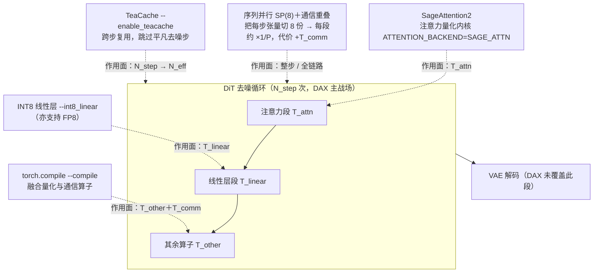

# DAX

> **素材来源性质**：本篇是**仓库/报告类笔记**（无 arXiv 论文），因此**不套论文 10 节骨架**，改用 D2「能力与边界」骨架（是什么 / 机制与依赖 / 报告口径与证据等级 / 能否落到我们的管线 / 参考与延伸）。主源为**官方仓库 README 与代码目录**（一手），辅助源为**本仓库知识库整理**（`management/docs/knowledge/视频生成训练与推理加速专题.md` §2.4，下称「我方整理」），后者属**二手性质**，文中逐处标注。截至 2026-09-24，**未检索到同行评议论文**（arXiv / HuggingFace Papers 检索均无 DAX 条目）。上游联网调研 brief 见 `.cache/article-note/dax/repo-brief.md`。

## 是什么

DAX **不是一个「新模型」，而是一套面向视频扩散推理的算子 / 系统优化组合**，以**官方开源仓库**的形态发布。它不改模型权重、不训练，只把若干已知的加速手段（多卡并行 + 注意力量化内核 + 图编译 + 低比特线性层 + 跨步缓存）**拼成一条可叠加的推理配方**，对应《数字人加速》「生成侧加速」里的**「并行与推理引擎」**档，并顺带命中「内核与稀疏」与「缓存复用」。

| 项 | 值 |
|---|---|
| 形态 | 扩散推理加速引擎（算子与系统组合），**不是模型**；以代码仓库发布，无技术报告 PDF |
| 全名（README 原文） | *DAX (Diffusion Accelerated eXecution) is an inference acceleration engine for diffusion models.* |
| 公开仓库 | <https://github.com/RiseAI-Sys/DAX> |
| 许可 | **Apache-2.0**（`LICENSE.txt:190`：`Copyright [2025] [RiseAI-Sys]`） |
| 仓库存续（GitHub API，2026-09-24） | 创建 `2025-07-31T06:01:54Z`，最近推送 `2025-09-05T03:38:08Z`；stars 107、forks 4、default branch `main`；**无 release、无 tag**、`homepage = null` |
| 底座 | Wan2.1（示例默认 `Wan-AI/Wan2.1-T2V-14B-Diffusers`） |
| 论文 | **无论文（未检索到同行评议论文）**——见「报告口径与证据等级」 |
| papers 库 | **未入本地 papers 库**（`data/papers.db` 无该条），故 `papers_id: none` |

**上游的真实来源是阿里巴巴内部 GitLab，不是这个 GitHub 仓库。** 公开仓库 `RiseAI-Sys/DAX` 是**镜像 / 衍生**，判定依据（本次调研的一手证据，见 `repo-brief.md`）：

- DAX **首版 README**（commit `ec114233f9a1`，`2025-08-01T09:03:28Z`）的安装段写的是 `git clone http://gitlab.alibaba-inc.com/cvl/DAX.git`；
- **仅 2 小时后**的提交 `2f1e00c04bbb`（message: `fix url`，`2025-08-01T11:18:56Z`）把它替换为 `https://github.com/RiseAI-Sys/DAX.git`（**diff 只有这一行**）。

即代码最初托管在阿里内部 `cvl` 团队的 GitLab 上，对外发布时才改指 GitHub；`RiseAI-Sys` 是该对外发布用的 GitHub org（org 创建于 `2025-07-30T11:21:31Z`，即仓库创建前一天；同 org 下另有 `attention-gym`、`ParaVAE`、`.github`，共 4 个公开仓库，**均无论文入口**）。公开仓库只暴露了**面向公众的取舍**，内部版本是否更全，不作推测。

一句话：它想解决的是**视频扩散推理中「每一步太贵」与「有些步不必要」这两笔成本**，做法是把五个系统侧手段叠成一条链路。

## 机制与依赖

DAX 由**五个可独立开关、也可叠加的优化项**组成；五个全开才能得到 README 里那组数字。**这是一个多卡推理配方，不是 `pip install` 就能生效的单卡加速器**。各优化项作用在链路的哪一段，见 Mermaid 1。

Mermaid 1 读三件事：① **前四项降「每步成本」**——序列并行把每步算力摊到 8 卡、SageAttention2 降注意力段、INT8 降线性层段、`torch.compile` 融合量化与通信算子；② **TeaCache 是唯一的「跨步复用」**——它不降单步成本，而是**跳过平凡去噪步**，减少有效步数；③ **VAE 解码不在覆盖范围内**，所以 DAX 的倍率只对「去噪段」负责。

| 优化项 | 官方口径（README / 代码） | 作用面 | 我方定位 |
|---|---|---|---|
| 序列并行 | *Sequence parallelism with carefully tuned communication overlap*；示例 `--sequence_parallel`；代码 `dax/parallel/**`（`all_to_all.py`、`split_gather.py`、`wanx2_1_t2v_opt`） | **降每步成本**（多卡拆分），代价是通信 | 「并行与推理引擎」 |
| SageAttention | *SageAttention2 for attention quantization*；示例 `export ATTENTION_BACKEND=SAGE_ATTN`（README 另注 *for wan2.1, SageAttention is recommended*） | **降每步成本**（注意力内核） | 「内核与稀疏」 |
| `torch.compile` | *torch.compile, which is crucial for achieving expected performance ... by fusing quantization and communication ops*；示例 `--compile` | **降每步成本**（融合量化/通信算子） | 「并行与推理引擎」 |
| INT8 线性层 | *FP8/INT8 quantization for linear layers*；示例 `--int8_linear`；代码 `dax/quant/nn/quantized/linear.py`、`dax/quant/qscheme.py` | **降每步成本**（线性层低比特） | 「内核与稀疏」 |
| TeaCache | *Teacache, accelerating DiT model inference by skipping trivial denoising steps*；示例 `--enable_teacache`；代码 `dax/cache/teacache.py` | **跨步复用**（减有效步数） | 「缓存复用」 |

**通信重叠的官方量化**：仓库 `docs/communication_overlap.md` 明确该 overlap 策略带来 **4%–5%** 的 E2E 加速——即序列并行是「用通信换算力」，通信开销需要被专门压掉。

**训练前提：零训练（系统侧组合）**。我方整理 §2.4 把 DAX 的训练要求记为**「零训练」**，与仓库实况一致：仓库目录里能看到的只有 `dax/quant/**`（量化）、`dax/parallel/**`（并行）、`dax/cache/**`（缓存）等推理期组件，**没有训练脚本、没有 QAT/蒸馏、也没有需要加载的改训权重**；底座直接用现成的 Wan2.1 权重（示例 `Wan-AI/Wan2.1-T2V-14B-Diffusers`）。也就是说：**质量由原模型承担，DAX 只负责把同样的计算跑得更快**。

**运行依赖**（README 示例命令）：`torchrun --nproc_per_node=8` + `--sequence_parallel --int8_linear --overlap_comm --enable_teacache --compile` + `ATTENTION_BACKEND=SAGE_ATTN`。⇒ **必须有多卡环境**（示例为 8 卡），且硬件口径为 **NVIDIA H20**（README 第 5 行 *on Nvidia H20*）。

### 公式

> **来源声明**：README 与仓库代码**没有给出任何编号公式**，官方也没有提供延迟分解说明。以下两个块级公式是**我方形式化 / 我方派生**，用于把「谁降每步、谁减步数」和「累积倍率怎么来的」写清楚，**不归到官方名下**。

**式 1：端到端延迟分解（谁降每步成本，谁减步数）**

$$
T_{\text{e2e}} \;=\; N_{\text{eff}}\Bigl(T_{\text{attn}}+T_{\text{linear}}+T_{\text{other}}\Bigr)+T_{\text{comm}},
\qquad T_{\text{attn}},\,T_{\text{linear}} \;\propto\; \frac{1}{P}
$$

| 符号 | 含义 |
|---|---|
| $T_{\text{e2e}}$ | 端到端去噪段墙钟时间（per-video wall time） |
| $N_{\text{eff}}$ | **有效**去噪步数：原始步数减去 TeaCache 跳过的平凡步 |
| $T_{\text{attn}}$ | 每步的注意力段成本（SageAttention2 作用于此） |
| $T_{\text{linear}}$ | 每步的线性层段成本（INT8 作用于此） |
| $T_{\text{other}}$ | 每步的其余算子成本（`torch.compile` 的算子融合作用于此） |
| $T_{\text{comm}}$ | 序列并行引入的跨卡通信开销（`overlap_comm` 试图把它藏进计算里） |
| $P$ | 序列并行路数（示例为 8） |

**中文解释**：总延迟 = 「有效步数 × 每步成本」＋通信开销。五个优化项各自只碰一个因子：**序列并行 / SageAttention2 / INT8 / compile 降低每步内的分段成本**（$1/P$ 或算子级），**TeaCache 只降 $N_{\text{eff}}$**（不降单步成本），而序列并行同时**给总延迟加了一项 $T_{\text{comm}}$**——这解释了官方为何专门为通信重叠做优化。**关键推论**：把 DAX 搬到单卡（$P=1$）时，$1/P$ 与 $T_{\text{comm}}$ 两项同时消失，特征与收益结构都变了，因此**不能把多卡倍率直接搬成单卡预期**。

**式 2：README benchmark 累积消融的倍率分解（我方派生）**

$$
S_{\text{e2e}}=\frac{6836}{188}
= S_{\text{SP}}\cdot S_{\text{SageAttn}}\cdot S_{\text{compile}}\cdot S_{\text{comm}}\cdot S_{\text{int8}}\cdot S_{\text{cache}}
\approx 36.4
$$

| 因子 | 对应消融台阶（README `assets/benchmark.png`，累积） | 数值（我方由图上秒数相除得出） |
|---|---|---|
| $S_{\text{SP}}$ | `baseline 6836 → +SP(8) 925` | 6836 / 925 ≈ **7.4×** |
| $S_{\text{SageAttn}}$ | `925 → +SageAttn 474` | 925 / 474 ≈ **2.0×** |
| $S_{\text{compile}}$ | `474 → +compile 448` | 474 / 448 ≈ **1.06×** |
| $S_{\text{comm}}$ | `448 → +overlap comm 432` | 448 / 432 ≈ **1.04×**（与官方 4%–5% 口径一致） |
| $S_{\text{int8}}$ | `432 → +int8 linear 357` | 432 / 357 ≈ **1.21×** |
| $S_{\text{cache}}$ | `357 → +teacache 188` | 357 / 188 ≈ **1.9×** |

**中文解释**：$36.4\times$ 是这张图上**首尾两根柱子的派生值**（$6836/188\approx36.36$），官方**从未在任何地方写出「36.4×」这个字面数字**（图上只有绝对秒数，无倍率标注）。分解显示收益**高度集中在两步**：序列并行（≈7.4×，因为它同时换了算力口径）与 TeaCache（≈1.9×，减步数）。**但要特别注意**这是**累积消融**：每一步的倍率都是「在上一步已开启的前提下」的边际收益，**不能把 7.4× 单独摘出来当作「序列并行的孤立加速比」**。

## 报告口径与证据等级

**知识库口径（我方整理 §2.4）**：`DAX | 序列并行、SageAttention、compile、INT8线性层、TeaCache | 零训练 | Wan2.1-T2V-14B、720p、5s、8×H20：6836s→188s，36.4× | **仓库benchmark**；8卡结果，不能当单卡速度`。

| 指标 | 数值 | 口径 | 证据等级 |
|---|---|---|---|
| 延迟 | **6836s → 188s** | Wan2.1-T2V-14B、720p、5s、**8×H20**、全优化开启 | **仓库 benchmark**（我方整理口径） |
| 加速比 | **36.4×** | 由 6836 / 188 派生（官方无此字面数字） | **仓库 benchmark（派生值）** |

**证据等级 = 仓库 benchmark（我方整理口径）**——原样带出知识库等级，**不升格**为「论文已验证」，更不与他篇拼成统一速度排行榜。三条边界必须一并记住：

1. **无论文**。截至 2026-09-24，**未检索到同行评议论文、也未检索到任何 arXiv 预印本或技术报告**：仓库无 `Citation` 段、无 arXiv/Paper badge、无 release/tag、无 project page；HuggingFace Papers API 与 arXiv 站内检索均无 DAX 条目（检索命中的 `SageAttention2`、`Wan` 等是 DAX **引用的上游工作**，不是它自己的论文）。因此本笔记**不写 `arxiv_id`**。
2. **数字的唯一出处是一张 PNG**。所有数字只存在于 README 的 `assets/benchmark.png`（累积消融条形），README 文字里**没有延迟表、没有倍率**。本次调研用 tesseract 5.5.2 + rapidocr 双引擎交叉 OCR 读出同一组秒数（6836 / 925 / 474 / 448 / 432 / 357 / 188），两引擎互证一致。
3. **36.4× 是 8 卡结果，不能当单卡速度**。$+SP(8)$ 这一柱表明序列并行（8 路）是被叠加到 baseline 之上的第一步增量，终点 188s 是 **8 路序列并行**下的结果，README 完整优化示例同样是 `--nproc_per_node=8`。同时**baseline 6836s 的卡数官方未明示**（图上未标；「未启用 SP 的单卡等效 baseline」是从消融结构推出的最合理读法，属**推断**）→ 更稳妥的表述是「**per-video wall time：未启用 SP 的 baseline 6836s → 8×H20 + 全优化 188s**」。

**不可横比**：本组的 8 卡 H20 口径与其它工作**不是同一硬件 / 同一测量协议**，不能直接对比。例如 [TurboDiffusion](turbodiffusion.md) 的 199× 是**单张 RTX 5090**、且**需要训练**的蒸馏方案；把 199× 与 36.4× 并列排成榜单是**错误的口径拼接**（知识库已明令禁止）。二者的关系是**互补**：DAX 优化算子与系统（零训练），TurboDiffusion 用训练把步数压低。

**未披露项（一律写「未披露」，不猜）**：

| 项 | 状态 |
|---|---|
| baseline（6836s）的卡数 | **未披露**（官方未明写） |
| benchmark 的精度组合（BF16 / FP8 / INT8 具体搭配） | **未披露** |
| 是否含 VAE decode、`torch.compile` 编译时间是否计入、是否 warmup、prompt / seed | **未披露**（示例脚本默认 `seed=0`） |
| H20 的 SKU 与集群形态（单机 8 卡 NVLink 还是 8 节点） | **未披露** |
| 「5s」与示例默认 `num_frames=81` 的绑定 | **未在 README 文字中写明**（81 帧 @ 16fps ≈ 5s，属推断） |
| 上游内部仓库 `gitlab.alibaba-inc.com/cvl/DAX` 的现状 | **未确认**（内网域名，公网不可达） |
| `RiseAI-Sys` 与阿里 `cvl` 团队的正式关系 | **未核实**（org 无主页、无描述） |

## 能否落到我们的管线

**结论先行：思路高度相关、可借鉴度高于 WorldAttention，但当前不能直接套用它的倍率。** 原因有三：① **前置是 8 卡环境**（序列并行是收益最大的一步）；② 需要把 SageAttention2、INT8 量化、TeaCache、`torch.compile` **逐个接进我们自己的 DiT 推理栈**（DAX 是面向 Wan2.1 的参考实现，不是通用插件）；③ 我们的链路是 **chunk 流式**，与「整段 14B T2V 离线批算」的成本结构不同。

| 前置条件 | 具体内容 | 我方现状 / 待评估点 |
|---|---|---|
| 多卡环境 | 序列并行需要多卡 + 高效互联（示例 `--nproc_per_node=8`） | 单卡 / 少量卡场景下，**收益最大的一步直接失效** |
| 算子层改造 | SageAttention2 内核、INT8（或 FP8）线性层、`torch.compile` 融合 | 需要逐个接入并验证我们的模型结构 / dtype 兼容性 |
| 缓存层改造 | TeaCache 跨步复用需要改去噪循环（缓存 + 相似度判定） | 我们 chunk 内**步数更少**，跨步复用的可复用空间更小，**需实测收益** |
| 链路兼容 | 序列并行的通信开销 vs 我们的 **chunk 延迟 / 首帧延迟**目标 | 流式链路更在意**单 chunk 时延与抖动**，而非离线总吞吐；通信重叠（4%–5%）能否藏住需以延迟最坏值为准评估 |

**单卡场景下不能直接复用该倍数。** **36.4×** 是「未启用 SP 的 baseline → 8 卡全优化」的派生值，其中约 7.4× 来自序列并行本身；单卡部署时这一项不存在，可预期收益会**大幅缩水**，且必须**自行测量**，不得引用 DAX 的数字。

**与《数字人加速》的关系**：该篇「生成侧加速」四方向里点名了 DAX，但**未加链接**（待回补）。DAX 一次性命中其中**三格**——**「并行与推理引擎」**（序列并行 + 通信重叠）、**「内核与稀疏」**（SageAttention2 量化注意力 + INT8 线性层）、**「缓存复用」**（TeaCache）。它与我方管线的连接点是**「在既有模型上做系统侧提速」**：因为它是**零训练**的，改造风险低于任何蒸馏 / QAT 路线，适合作为**「不换模型、先把推理栈榨干」**的第一优先级候选。

**可借鉴 vs 不可借用**：

- **可借鉴（工程层，风险最低）**：① **TeaCache 的跨步复用**——与 [[论文笔记/latent-spatial-memory|Latent Spatial Memory]] 同属「缓存复用」思路，但要先在我们的 chunk 步数下实测；② **序列并行 + 通信重叠**——若上多卡，「把通信藏进计算」的做法（官方称 4%–5%）可直接参考；③ **INT8 / FP8 线性层 + `torch.compile` 融合**——是通用算子层手段，与 [[论文笔记/turbodiffusion|TurboDiffusion]] 的 W8A8 思路同源。
- **不可借用（数字层）**：**36.4× 与 6836s→188s 是 8×H20 的仓库自测结果，不属于我方在自有硬件 / 自有模型上的承诺**；也不得与单卡论文口径并列横比。

## 参考与延伸

| 类型 | 位置 |
|---|---|
| 上游公开仓库 | <https://github.com/RiseAI-Sys/DAX>（Apache-2.0；`README.md`、`assets/benchmark.png`、`docs/communication_overlap.md`、`examples/wan2_1_t2v_example.py`、`dax/quant/**`、`dax/parallel/**`、`dax/cache/teacache.py`） |
| 上游真实来源（内部） | `gitlab.alibaba-inc.com/cvl/DAX`（阿里内网，**公网不可达、未确认现状**） |
| 联网调研 brief | `.cache/article-note/dax/repo-brief.md`（官方仓库、上游来源、来源清单、与知识库口径核对、未确认项） |
| 配图实况 | `.cache/article-note/dax/analysis/image-collection.md`（**无图可发**及理由） |

**相关笔记**：

- [[论文笔记/turbodiffusion|TurboDiffusion 模型笔记]]——**互补对照**：TurboDiffusion 用**训练**（rCM 蒸馏）把步数压到 3–4 步、单卡 RTX 5090；DAX 用**零训练的系统组合**提速、8×H20。两篇合看可覆盖「训练侧 vs 系统侧」两条加速主线，但**口径不同、不可横比**。
- [[数字人概述/数字人加速|数字人加速]]——生成侧加速四方向（内核与稀疏 / 步数变少 / 缓存复用 / 并行与推理引擎），本篇命中「并行与推理引擎」「内核与稀疏」「缓存复用」三格；链接待回补。
- [[数字人概述/工程设计|工程设计]]——序列并行、通信重叠、量化与 `compile` 属于工程部署决策，需与 chunk 流式链路的延迟预算一起权衡。
- [[knowledge/视频生成训练与推理加速专题|视频生成训练与推理加速专题]]——§2.4 登记了 DAX 的口径与证据等级（**我方整理**，本篇证据等级来源）。
