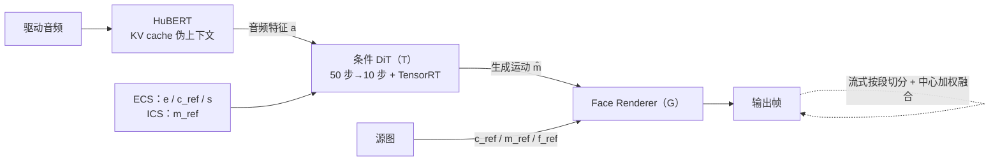
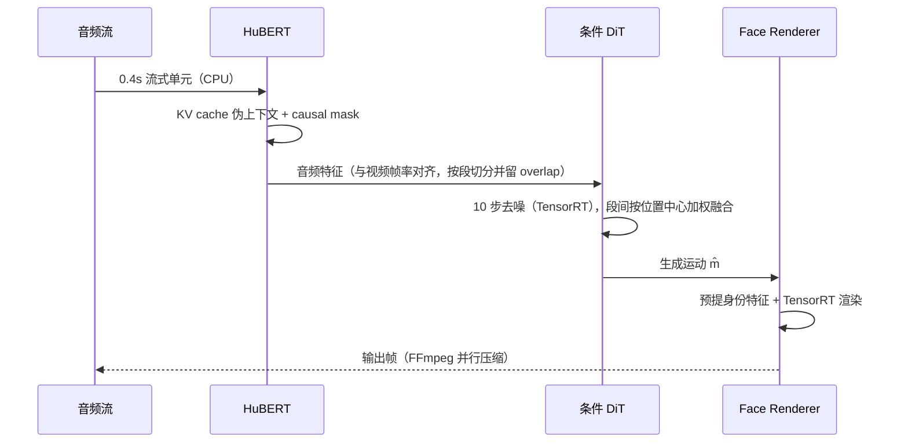

# Ditto

## 论文信息

| 项 | 值 |
|---|---|
| 标题 | Ditto: Motion-Space Diffusion for Controllable Realtime Talking Head Synthesis |
| 作者 | Tianqi Li、Ruobing Zheng†、Minghui Yang、Jingdong Chen、Ming Yang |
| 单位 | Ant Group（论文首页署名，全部作者） |
| venue / 年份 | ACM MM 2025（本地 arXiv `v3` 页首标注 `Preprint, compiled May 1, 2025`，该版本未自行声明 venue） |
| arXiv | `2411.19509v3`（`[cs.CV]`，2025-04-30；初版 2024-11） |
| 项目页 | https://digital-avatar.github.io/ai/Ditto/ |
| 代码仓库 | 论文声明开源；项目页指向 https://github.com/antgroup/ditto-talkinghead；**我们接入的是 CyberVerse `models/ditto/`**（核对基准 `4968280`） |
| papers 库 | `arxiv-2411.19509` |

## 一句话总结

**换掉生成的「空间」——不生成像素、也不生成 VAE latent，只生成 265 维身份无关运动，身份交给参考锚定的渲染器**，于是同一套扩散主干既拿到了细粒度控制，也拿到了单卡实时。

- **换空间**：论文指出通用 VAE latent 有两条毛病——冗余（运动与纹理纠缠）且隐式（与面部属性无对应），因此在 LivePortrait 的运动空间里训扩散，只学生成运动。
- **可控制**：把 63 维表情形变逐维探针化，建立维度与面部语义的对应（如第 34 维管右眼开合、第 58 维管张嘴），从而支持区域控制、幅度控制与注视修正。
- **实时**：音频侧用 KV cache 伪上下文撑住极短音频段；运动侧把去噪从 50 步压到 10 步并转 TensorRT；渲染侧复用预提身份特征。端到端 RTF 0.635（离线）/ 0.895（在线），首帧 385ms。
- **解耦**：扩散只负责运动，身份由「规范关键点 + 参考外观」在渲染入口处钉住，因此身份一致性 CSIM 0.864 高于同表所有基线。

## 问题与动机

论文把扩散式 talking head 难以落地归为两个问题。

1. **对生成的面部运动缺乏控制**。既有方法难以对表情、基本情绪、头部旋转做细粒度控制，用户除了重新生成没有别的调整手段；而生成质量又带随机性，得到想要的结果费时。VASA-1 虽然在运动–外观解耦空间里训 DiT 并实现了实时，但它用的是**隐式运动表示，不支持对结果的控制或调整**，且**源码未公开**，后续工作有限。
2. **推理慢**。多数方法在单张 GPU 上做不到实时，而 AI 助手、直播这类交互场景对实时是硬要求。论文在结果节给出量级：扩散类方法的推理速度比实时慢 **30–50 倍**。

两条问题背后是同一个技术选择：**生成目标放在哪个空间**。

| 路线 | 生成什么 | 论文指出的代价 |
|---|---|---|
| GAN / 显式系数 | 像素、关键点 | 早期方案的纹理与口型不错，但表情与头动自然度不足 |
| 通用 VAE latent 扩散（EMO、EchoMimic、Hallo 系） | VAE latent | 空间冗余、运动与纹理纠缠、表示隐式 ⇒ 学习复杂度高 + 推理慢 |
| motion space 扩散（VASA-1、Ditto） | 低维运动表示 | 目标维度低、利于实时与控制；上限受运动表示约束 |

## 方法精析

整体链路：**音频 + 四路条件 → 条件 DiT 生成运动 $\hat{\mathbf{m}}$ → 渲染器把运动套回参考身份 → 画面**。

### 运动空间里只生成身份无关的运动

单帧 $I$ 经 Motion Extractor $\mathcal{M}$ 得到四项：规范关键点 $\mathbf{c}\in\mathbb{R}^{K\times3}$、表情形变 $\boldsymbol{\delta}\in\mathbb{R}^{K\times3}$、头部旋转 $\mathbf{R}\in\mathbb{R}^{3\times3}$、平移 $\mathbf{t}\in\mathbb{R}^{3}$。论文把其中三项定义为**身份无关的运动表示**：

$$
\mathbf{m}=\{\boldsymbol{\delta},\mathbf{R},\mathbf{t}\}
$$

注意 $\mathbf{c}$ **不在** $\mathbf{m}$ 里——它是身份几何，不参与生成。这一点后面会反复用到：部署侧 265 维运动向量同样不含关键点。论文未给出 $K$，由后文「63 维形变 = 21 个隐式 3D 关键点的 xyz」反推为 $K=21$。

渲染侧由 Appearance Feature Extractor $\mathcal{F}$ 与 Face Renderer $\mathcal{G}$ 组成。给定目标肖像，$\mathcal{M}$ 先提取 $\mathbf{c_{ref}}$ 与 $\mathbf{m_{ref}}$，随后：

$$
\mathbf{x_{ref}} = \mathbf{c_{ref}}\mathbf{R_{ref}} + \boldsymbol{\delta_{ref}} + \mathbf{t_{ref}}
$$

$$
\hat{\mathbf{x}} = \mathbf{c_{ref}}\hat{\mathbf{R}} + \hat{\boldsymbol{\delta}} + \hat{\mathbf{t}}
$$

$$
\hat{I} = \mathcal{G}\!\left(\mathbf{f_{ref}}, \mathbf{x_{ref}}, \hat{\mathbf{x}}\right)
$$

$K$ 是关键点数、$\mathbf{f_{ref}}$ 是参考外观特征。式(1) 与式(2) 只差在运动项：参考侧用真实 $\mathbf{m_{ref}}$，生成侧用预测的 $\hat{\mathbf{m}}$，而 $\mathbf{c_{ref}}$ 与 $\mathbf{f_{ref}}$ 两侧共用。也就是说，**身份被钉在渲染入口，全流程唯一被生成的量是运动**——式(3) 让 $\mathcal{G}$ 学一个把 $\mathbf{f_{ref}}$ 形变到生成运动的场，再解码回图像空间。

### 条件信号与两种注入通道

论文承认，即便 LivePortrait 也难以把运动与身份完全解耦，不纯的运动表示会加大训练难度。因此条件信号不是随便加的，四路各有分工：

| 信号 | 论文里的角色 | 解决什么 |
|---|---|---|
| $\mathbf{c_{ref}}$ 规范关键点 | 当作**身份特征**引导运动生成 | 让生成运动匹配目标身份几何，缓解运动/身份解耦不完全 |
| $\mathbf{s}$ 情绪标签 | 从视频帧提取，**clip 级**唯一标签 | 建立可直接控制的对应关系，而不是只学音频到表情的隐式映射 |
| $\mathbf{e}$ 眼态 | 眼睛纵横比 + 相对瞳孔位置 | 管眨眼与注视——这两件事与音频相关性弱 |
| $\mathbf{m_{ref}}$ 参考初始运动 | 引导 clip 内运动生成 | ① 增强跨 clip 连续性；② **周期性把运动拉回目标状态**，缓解长序列误差累积 |

注入通道分两类，这两个名字是论文原文术语：

- **ECS（Enhanced Conditional Signals）**：$\mathbf{e}$、$\mathbf{c_{ref}}$、$\mathbf{s}$ 与音频特征 $\mathbf{a}$ 时间对齐后 channel-wise 拼接，**走 cross-attention**，全程有效。
- **ICS（Initial Conditional Signal）**：$\mathbf{m_{ref}}$ 复制到与噪声序列等长后 channel-wise 拼接，**主要影响生成起始段**。

总条件为 $\mathbf{C}=\{\mathbf{a},\mathbf{e},\mathbf{c_{ref}},\mathbf{s},\mathbf{m_{ref}}\}$。

### 训练策略与目标函数

三项策略都是为「运动表示本身不好学」准备的：

- **水平翻转**。语音相关的面部运动大体对称，但野外数据的头朝向分布不均；这种不平衡会污染提取出的运动特征，让生成运动偏向一侧。翻转是为两侧建立均衡的音频到运动对应——**这是修正数据分布，不是普通数据增强**。
- **自适应损失权重**。唇动、表情、眨眼、头姿与音频的关系及幅度差异很大，统一权重训不好。做法是按控制区域分组，用**当前 epoch 与上一 epoch 的平均 loss 之差**做组间 softmax 归一化得到调整系数，动态调权。
- **验证指标用 lipsync score**。唇动是面部运动的首要描述量，且需把验证视频**渲染出来**再算该分数，用它选 checkpoint——因为扩散模型的 loss 曲线常常反映不了生成质量。

$$
\mathcal{L} = \mathcal{L}_{d} + \mathcal{L}_{t} + \mathcal{L}_{ini}
$$

$\mathcal{L}_{d}$ 是跟随 DDPM 的去噪均方误差，$\mathcal{L}_{t}$ 额外回归运动的一阶（速度）与二阶（加速度）导数以增强时序稳定性，$\mathcal{L}_{ini}$ 约束参考初始运动与生成片段首元素的一致性以强化引导。**三项权重系数论文未披露，式(6) 的写法是等权相加。**

### 可控性从哪来

隐式关键点表示与面部属性没有明确对应，头姿之外没法直接读写。论文的做法是**逐维探针**：把表情形变表示成 63 维（21 个隐式 3D 关键点 × 3 坐标），对**每一维**施加小幅度正负 offset，对固定身份渲染出图，观察哪块区域变了。

论文点名两个读数：**第 34 维控制右眼开合**，**第 58 维控制张嘴**，后者类似 ARKit 的 "jaw open"。由此支持两类控制：

1. **区域控制**：把运动生成约束到特定局部（例如限制在靠近颈部的面部区域，便于与躯干融合）。
2. **幅度控制**：约束形变取值，避免不自然表情这类伪影。

另有第三种能力是**修正**而非控制：早期测试发现生成的注视方向被头姿绑架——视线随头动漂移、看不住镜头。原因是训练时用**逐帧**眼态 $\mathbf{e}$ 控制注视，推理时却只能用从单张参考图提取的**固定** $\mathbf{e}$，训练/推理条件不一致。解法是录一段模板视频：演员保持注视镜头、表情恒定、平滑转动头部；提取每帧的 $\mathbf{R}$ 与 $\boldsymbol{\delta}$ 并减去首帧值，因为表情恒定，剩下的变化只反映注视；回归

$$
\boldsymbol{\delta_{e}} = \mathcal{K}\!\left(\mathbf{R_{e}}\right)
$$

得到注视变化与头姿变化的映射，推理时按当前头姿补偿 $\boldsymbol{\delta}_{correct}=\boldsymbol{\delta}+\boldsymbol{\delta_{e}}$。消融前后的效果见图 6。

## 训练与实现细节

| 项 | 值 |
|---|---|
| 训练数据 | 约 **50 小时**广播场景视频，**330** 个身份，平均单条 150 秒 |
| 评测数据 | 主量化 **Talk9**（9 条视频）；额外量化 **HDTF100**（HDTF 随机采 100 条）；定性样本取自 Hallo / EchoMimic 的数据 |
| 运动表示 | headpose 欧拉角用**离散 bin** 表示；最终运动表示 **265 维** |
| 训练硬件 | **8 × NVIDIA A100** |
| batch size | 1024 |
| 优化器 | Adan |
| 学习率 / 权重衰减 | `1e-4` / `0.02` |
| 训练轮数 | 500 epochs（总机时未披露） |
| 时间对齐 | 音频特征、视频帧、条件信号统一 **25 fps** |
| 训练片段 | **$L=80$ 帧（3.2 秒）** |
| checkpoint 选择 | 渲染后用 lipsync score 选（非 val loss） |
| 采样配置 | 训练 50 步；推理降到 10 步（论文称 10 步与 50 步质量可比） |
| 随机种子 / 复现设置 | 未披露 |

**训练与推理的参考条件取法不同**，这一点容易被忽略：训练期 $\mathbf{m_{ref}}$ 取当前片段的**前一帧**、$\mathbf{c_{ref}}$ 取同一条 clip 的**随机帧**；推理期两者都取自**源图**。ICS 在训练时学到的是「从真实前一帧接上」，推理时接的是源图给定的起点。

### 265 维到底由什么组成

论文正文只给出两个线索：headpose 用离散 bin（§4.1）与形变 63 维（§3.2.3）；**论文全文没有拆解过 265 这个数**。我们按部署代码可以确证拆分：

$$
265 = \underbrace{1}_{\text{scale}} + \underbrace{66\times 3}_{\text{pitch/yaw/roll}} + \underbrace{3}_{\mathbf{t}} + \underbrace{63}_{\text{exp}}
$$

| 分量 | 维度 | 说明 |
|---|---|---|
| scale | 1 | 全局尺度（代码内存的是相对 1 的偏移）；论文式(2) 未单列 |
| pitch / yaw / roll | 66 × 3 | **66 个离散 bin**，不是 66 个连续自由度 |
| $\mathbf{t}$ | 3 | 平移；代码里只作用于 x/y，z 不施加 |
| exp | 63 | 表情形变 = 21 关键点 × 3 坐标 |
| kp | （63） | **不进 265**——由源侧回填，与论文把 $\mathbf{c}$ 排除在 $\mathbf{m}$ 之外一致 |

**「66 是 bin」值得单独强调**：读角度时先对 66 维做 softmax、取序号期望再乘 3° 减 97.5°，即角度范围约 $[-97.5°, +97.5°]$、步长 3°。所以 265 维里只有 scale、$\mathbf{t}$、exp 共 **67 维是连续量**，其余 198 维是三个角度的分类分布。把 66 当成 66 个独立角度自由度会高估这个表示的容量。

## 推理与系统链路

论文对实时的要求拆成两条：模块内低延迟 + 模块间高效数据流，分别落在三个模块上。

1. **音频特征**：HuBERT 用 **KV cache** 提供从固定语料提取的伪上下文，与到来的音频片段拼接——这使得在长句上预训练的 HuBERT 面对**极短**音频段仍能给出高质量特征；再配 **causal mask** 保证注意力分给真实输入并降低复杂度。论文称这使其能在 **CPU 上实时处理 0.4 秒的音频流单元**，训练与推理都用这套增强特征。
2. **运动生成**：把流式音频特征切成定长区间、相邻区间留**预定义 overlap**；借用长视频生成的**分段融合**策略（把 progressive latent fusion 换成对生成运动序列的 segment-wise fusion），融合权重由帧在段内的相对位置决定，**越靠段中心权重越高**。为实时把去噪步数从 50 降到 10，并把 DiT 转成 TensorRT。
3. **视频合成**：渲染器顺序出图，**与目标身份相关的特征预提取并常驻**；TensorRT 化后在 GPU 上实时出流；需要视频文件时由 CPU 侧 FFmpeg 并行压缩。

模块级与端到端性能如下（测试环境：12 核 Intel Xeon Platinum 8369B @2.90GHz + 1 × A100 + 100G 内存）。

| 模块 | Audio2Feat | Motion DiT | Face Rendering |
|---|---|---|---|
| 单步耗时 | 23ms | 62ms | 15ms |
| RTF | 0.115 | 0.310 | 0.375 |

| Pipeline | RTF ↓ | FFD ↓ |
|---|---|---|
| talking-head offline | 0.635 | — |
| talking-head online | 0.895 | 385ms |
| full-body offline | 0.648 | — |
| full-body online | 0.914 | 392ms |

在线流式比离线需要**更长的段间重叠**来压低首帧延迟，代价是 RTF 更高；全身体只比纯头部略慢，开销主要在把头合成进身体。论文的 RTF 口径是「单步推理时间 ÷ 有效段长（**排除重叠部分**）」。

**三层 RTF 不能合并成一个倍数**——它们测量的对象、硬件与统计窗口都不同：

| 口径 | 数值 | 对象与硬件 | 来源 |
|---|---|---|---|
| 论文模型侧 | 0.635（离线）/ 0.895（在线，FFD 385ms） | 单模块单步 ÷ 有效段长，1 × A100 + TensorRT | 论文 Table 6 |
| 我们生产端到端 | mean ≈ 0.997、p95 ≈ 1.00，浏览器 ≈ 25fps，stalls 0 | 发布链路端到端 | 我们的实测 |
| 我们编排层生成侧 | 2.80 / 3.27+ → **0.937 / 1.07** | 会话编排的生成阶段 | 我们的实测 |

工程优化的细节（Decoder / Warp / LMDM 的 TensorRT 化、GPU 直传、已回退项）与编排层修复不在此展开，见 [[knowledge/Ditto 实时化与 TensorRT 加速复盘|Ditto 实时化与 TensorRT 加速复盘]] 与 [[数字人概述/数字人加速|数字人加速]]。

## 实验与结果

### 评估口径

对比方法：**MuseTalk**（非扩散的嘴唇编辑）、**EchoMimic**、**Hallo**、**Hallo2**（扩散式）。指标：**FID** 帧级画质、**FVD** 视频级画质、**CSIM** 人脸识别特征余弦相似度（身份一致性）、**Sync-C / Sync-D** 音画同步、**RTF** 与 **FFD** 推理性能。

### 主结果（Talk9）

| 方法 | FID↓ | FVD↓ | CSIM↑ | Sync-C↑ | Sync-D↓ | RTF↓ |
|---|---|---|---|---|---|---|
| GT | — | — | — | 8.044 | 6.943 | — |
| MuseTalk | 21.445 | 436.862 | 0.807 | 5.586 | 8.400 | 2.248 |
| EchoMimic | 42.554 | 395.754 | 0.840 | 5.733 | 9.204 | 35.528 |
| Hallo | 22.996 | 271.680 | 0.812 | 7.652 | 7.590 | 53.082 |
| Hallo2 | 22.899 | 245.236 | 0.806 | 7.737 | 7.608 | 56.838 |
| **Ours-s50** | 17.254 | **219.368** | **0.864** | 8.069 | **7.114** | 2.121 |
| **Ours-s10** | **17.060** | 231.182 | 0.861 | **8.111** | 7.291 | **0.635** |

读法：论文的粗体只落在自己两行上——**FID 与 Sync-C 最好的是 10 步版本**，**FVD、CSIM、Sync-D 最好是 50 步版本**；10 步与 50 步在端到端评测上差异很小，这是「压步数不掉质量」的直接证据。GT 行只作参考、不参与排名。RTF 一列最直观：扩散基线比实时慢 30–50 倍，而 Ditto 已越过实时，甚至快于非扩散的 MuseTalk。注意 `Ours-s10` 的 0.635 与下文 Table 6 的离线值同数，但本表未披露测试环境，**两者只能并列、不能断言同口径**。

### 额外量化（HDTF100）

| 方法 | FID↓ | FVD↓ | SyncC↑ | SyncD↓ |
|---|---|---|---|---|
| EchoMimic† | 47.331 | 532.733 | 5.930 | 9.143 |
| Hallo† | 16.748 | 366.066 | 7.268 | 7.714 |
| Hallo2† | 16.616 | 239.517 | 7.379 | 7.697 |
| **Ours** | **16.430** | **134.640** | **8.939** | **6.913** |

带 † 的三个方法数字**来自 Hallo2 论文**，属跨来源引用，不是本文复跑——引用时必须带这个标注。

### 用户研究

10 名参与者，随机取 5 组图文对、每个方法各生成 5 段，共 20 段；同一输入下两两比较，重复全部组合。三项偏好百分比如下。

| 方法 | 视觉质量 | 唇同步 | 自然度 |
|---|---|---|---|
| EchoMimic | 54.0% | 38.0% | 58.7% |
| Hallo | 21.3% | 36.0% | 33.3% |
| Hallo2 | 40.7% | 45.3% | **59.3%** |
| **Ours** | **84.0%** | **80.7%** | 48.7% |

**这不是「全面最优」**：Ditto 在视觉质量与唇同步上大幅领先，但「表情与头动的自然度」只有 48.7%，低于 Hallo2 的 59.3%。论文自己解释为**运动表示衰减了部分高频运动信息的学习**，仍需持续优化。另外该研究只有 10 人，未给置信区间与显著性检验。

### 消融

| 配置 | FID↓ | FVD↓ | CSIM↑ | SyncC↑ | SyncD↓ |
|---|---|---|---|---|---|
| 完整模型 | 17.254 | 219.368 | 0.864 | 8.069 | 7.114 |
| 去掉规范关键点条件 | 17.438 | 261.693 | 0.849 | 6.932 | 8.476 |
| 去掉情绪标签 | 23.036 | 324.078 | 0.792 | 6.310 | 8.990 |
| 去掉自适应损失权重 | 18.978 | **588.821** | 0.844 | **0.289** | **14.992** |

- **去掉 $\mathbf{c_{ref}}$**：全指标下降，FVD 与同步尤其明显——身份几何信息确实在帮扩散学「怎么把运动适配到目标身份」。
- **去掉情绪标签**：全指标显著下降。只从音频学表情更难，画质与唇同步一起变差；补充材料里展示了表情突变与夸张表情（**补充材料不在本工作区，此处不引其视频证据**）。
- **去掉自适应权重**：最刺眼的一行——头姿与表情收敛不平衡，模型学不到音频与面部运动的对应，生成视频**几乎不动**，于是 SyncC 掉到 0.289、FVD 涨到 588.821，而 **CSIM 与 FID 反而受影响较小**。这说明「画质指标好看」与「动作是否真的对」是两件事。
- **注视修正**属定性消融（无数字），见图 6。

### 定性结论

同音频同帧位对比下，Ditto 的优势集中在**细节一致性**（例如基线的牙齿形状与纹理逐帧变化）；基线另有夸张表情、模糊、口型不准等问题。论文还报告 Hallo / Hallo2 在**风格化人像**上可能随时间逐渐劣化（皱纹变多、阴影异常、背景伪影），而本方法跨风格更稳。头身拼接方面，生成的头部可与原身体无缝拼接，避免端到端扩散方法常见的错位，因此能接 body-driven 模型。

## 相关工作与定位

| 方法 | 生成空间 | 单图 one-shot | 可控性 | 实时性 |
|---|---|---|---|---|
| MuseTalk | 像素（嘴唇编辑，非扩散） | ✓ | 低（只改口型区） | RTF 2.248 |
| EchoMimic | 通用 VAE latent 扩散 | ✓ | 弱控制 | RTF 35.528 |
| Hallo / Hallo2 | 通用 VAE latent 扩散 | ✓ | 弱控制 | RTF 53.082 / 56.838 |
| VASA-1 | 运动–外观解耦空间 + DiT | ✓ | **隐式表示，不支持控制**；源码未公开 | 论文作为实时先例引用 |
| **Ditto** | LivePortrait 运动空间（265 维）+ 条件 DiT | ✓ | **细粒度**（区域/幅度/注视/情绪） | 0.635 离线、0.895 在线 |

论文自述的脉络是两条：一条是 GAN → EMO（音频 + 弱控制的条件扩散、Dual U-Net + 两阶段训练）→ EchoMimic / Hallo / Loopy 在层次化映射、驱动信号、长时建模上改进，但**都还在通用 VAE 空间里**；另一条是 VASA-1 打开的运动空间路线。Ditto 的位置是在第二条路线上补齐 VASA-1 缺的两件事——**开源可复现**与**细粒度可控**——并把运动空间的载体换成现成的 LivePortrait 组件。

两点引用纪律：**VASA-1 没有公开代码，论文也没有给出与它的同协议数值比较**，不得写成「Ditto 优于 VASA-1」；Table 1/2 的对照范围只有 MuseTalk、EchoMimic、Hallo、Hallo2。

## 局限与启发

### 论文自己承认的局限

- **高频运动信息被衰减**：用户研究中自然度只拿到 48.7%，低于 Hallo2；论文归因于运动表示本身衰减了部分高频运动，属未解问题。
- **依赖外部 reenactment 组件**：运动提取与渲染都基于 LivePortrait 系组件，论文承认连它也做不到运动与身份的完全解耦，因此要用 $\mathbf{c_{ref}}$ 条件去补。
- **补充材料之外未展开的边界**：论文把表情突变等证据放在补充材料里，正文只有结论。

### 我们的实测

**视频源模式下的唇动隔离**。单图模式只需要身份，视频源模式则每帧都读源帧，于是源视频里本来就在张合的嘴会绕过音频驱动直接出现在输出里。我们先用噪声驱动（不给音频信号）跑基线，源视频张嘴时输出嘴仍跟随开合、嘴动相关系数 0.995，确认泄露成立；随后定位到外观通道才是主导泄露路径（只改运动通道的 v1 几乎无效），v2 把外观整帧钉到源首帧。再修掉关键点回填泄露——生成的 265 维不含 kp，回填时若用逐帧源帧 kp，源视频的下颌位移会被带进生成目标，改为钉回首帧骨架后单 case 的 LSE-C 从 3.74 升到 4.87、LSE-D 从 10.93 降到 8.81（单图模式上限参考值是 5.01 / 8.75）。这条线也踩过坑：把身份相似度当训练目标的一路实验指标上升但嘴部变糊，已被否决；最终收敛为一个**默认关闭、仅视频源模式生效、不改权重**的推理期开关。

**前 3.2 秒音画错位仍未定因**。我们观察到开头约 3.2 秒音画不齐，试过「HuBERT 左上下文的静音垫稀释首窗特征」假说（前置 15 帧静音垫后丢弃），复测无效（0–3 秒分窗 LSE 仅改善 0.09、人工无变化）并已回滚；首窗锚值、二次生成、贴回几何等假设也逐一否定或撤回。**这个问题尚未修复**，只能留给固定随机种子的参考帧一致性与预热窗实验继续定位。

**长时稳定性与一件反直觉的机制**。Ditto 在 3 分钟窗口内没有观察到 RTF 漂移或内存泄漏，稳态 RTF 平直、常驻内存的大头来自 363 帧全分辨率源信息的静态成本（30 分钟档未做）。机制上，部署代码里确实存在「周期性回锚」：每窗结束时默认把下一窗的初始条件设为**上一窗生成结果的末帧**（天然递归），但另有一个开关可以每 N 个窗口把初始条件**重置回源首帧**，而**代码默认为关闭**。也就是说，Ditto 的长时稳定并不依赖这个回锚开关，而是同时吃到了另外两层锚定：源视频逐帧注册出的参考外观，以及逐帧仿射贴回。这与 [[论文笔记/avatar-forcing|Avatar Forcing]] 一侧「生成结果经 offset 与 KV cache 成为下一段历史、方向逐步游走」的机制形成对照——两边都在递归，但 Ditto 每帧都在用参考外观与参考几何重新落地。

**两条口径边界**（避免把结论用错地方）：「头部逐渐放大的漂移」那条结论来自 **Avatar Forcing** 线的逐 0.4 秒块独立音频归一化，**不属于 Ditto**；论文的 0.635/0.895 与我们生产的 ≈0.997、编排层的 0.937 是三层不同口径，不能合并成单一倍数。

### 论文局限 vs 我们结论

| 论文承认的问题 | 我们的实测结论 |
|---|---|
| 运动表示衰减高频运动，自然度偏弱 | 未消解。我们改的是泄露与同步（LSE-C 3.74 → 4.87），没有改善自然度 |
| 依赖 LivePortrait 系组件、解耦不完全 | 部分利用了这一点：源侧逐帧注册的参考外观与几何，正好成为长时稳定的一层锚定 |
| 显式可控性停留在形变维度 | 后验 probe 的成果被工程固化（唇/眼固定索引掩码），可控性在部署侧确实可用 |
| 未讨论视频源模式的泄露（论文只做单图） | 泄露真实存在且可量化（相关系数 0.995），已用推理期开关处理，但跨素材与人工判定未完成 |

### 可操作启发

1. **换生成空间比换主干更划算**。同一个扩散范式，把目标从 VAE latent 换成 265 维运动空间，就同时换来可控性与 30–50 倍的推理差距——但要接受「上限被表示约束」这个代价。
2. **消融要盯着动作而不是画质**。去掉自适应权重时 FID/CSIM 看着还行，SyncC 已经掉到 0.289——只看画质指标会漏掉「动作根本没学对」这类故障。
3. **先复现现象再谈修复**。唇动泄露是靠噪声驱动对照先证明存在（相关系数 0.995）才开始改的；前 3.2 秒错位则因为没定位成功，至今没写成「已修复」——这条纪律比任何单次修复都值钱。

## 术语与符号表

| 术语 | 英文 | 含义 |
|---|---|---|
| 运动空间 | motion space | 由面部 reenactment 模型定义的运动表示空间，Ditto 用它替代 VAE latent 作为扩散目标 |
| 身份无关运动表示 | identity-agnostic motion representation | $\mathbf{m}=\{\boldsymbol{\delta},\mathbf{R},\mathbf{t}\}$，只描述运动 |
| 规范关键点 | canonical keypoints | $\mathbf{c}$，身份几何骨架，不在 $\mathbf{m}$ 内、不被生成 |
| 表情形变 | expression deformation | $\boldsymbol{\delta}$，21 个隐式 3D 关键点位移，共 63 维 |
| 增强条件信号 | ECS | $\mathbf{e}$、$\mathbf{c_{ref}}$、$\mathbf{s}$ 与音频对齐后走 cross-attention，全程有效 |
| 初始条件信号 | ICS | $\mathbf{m_{ref}}$ 与噪声序列拼接，主要影响起始段 |
| 分段融合 | segment-wise fusion | 流式推理的段间融合，权重按帧在段内位置取值，越靠中心越高 |
| 实时因子 | RTF | 论文口径：单步推理时间 ÷ 有效段长（排除重叠） |
| 首帧延迟 | FFD | 输入到首帧输出的延迟 |
| 混合形变 | blendshape | 论文用来类比 63 维形变语义的说法（如第 58 维 ≈ ARKit "jaw open"） |

| 符号 | 含义 |
|---|---|
| $I$ | 输入单帧图像 |
| $\mathcal{M}$ | Motion Extractor，提取关键点与运动 |
| $\mathbf{c}\in\mathbb{R}^{K\times3}$ | 规范关键点；论文未给 $K$，由 21 点反推 |
| $\boldsymbol{\delta},\mathbf{R},\mathbf{t}$ | 表情形变、头部旋转、平移 |
| $\mathbf{m}$ / $\hat{\mathbf{m}}$ | 身份无关运动表示 / 其生成值 |
| $\mathbf{m_{ref}},\mathbf{c_{ref}}$ | 参考初始运动、参考规范关键点 |
| $\mathbf{x_{ref}},\hat{\mathbf{x}}$ | 参考 / 生成的隐式 3D 关键点，式(1)(2) 构造 |
| $\mathcal{F},\mathbf{f_{ref}},\mathcal{G}$ | 外观特征提取器与参考外观特征 / Face Renderer |
| $\mathbf{a},\mathbf{C}$ | 音频特征 / 总条件 |
| $\mathbf{s},\mathbf{e}$ | clip 级情绪标签 / 眼态 |
| $\mathcal{T}$ | 去噪网络（条件 DiT） |
| $\mathcal{L}_{d},\mathcal{L}_{t},\mathcal{L}_{ini}$ | 去噪损失、速度/加速度损失、初始运动损失 |
| $\boldsymbol{\delta_{e}}=\mathcal{K}(\mathbf{R_{e}})$ | 注视变化与头姿变化的回归映射 |
| $L=80$ | 训练片段帧数（@25fps = 3.2 秒） |

**三处符号易冲突**：$K$ 既是关键点数又出现在花体 $\mathcal{K}$ 的注视回归里；$L$ 既是片段长度、损失又写作花体 $\mathcal{L}$；论文的抽象 $\mathbf{m}$ 与部署侧 265 维向量不是同一个对象（对应关系见「265 维到底由什么组成」）。

## 相关文档

- 论文层与工程层深读：[[knowledge/Ditto 模型精读|Ditto 模型精读]]、[[knowledge/Ditto 改动实践|Ditto 改动实践]]、[[knowledge/Ditto 实时化与 TensorRT 加速复盘|Ditto 实时化与 TensorRT 加速复盘]]
- 专题：[[knowledge/动作空间专题|动作空间专题]]、[[knowledge/音画同步专题|音画同步专题]]、[[knowledge/数据集整理专题|数据集整理专题]]、[[knowledge/评测指标专题|评测指标专题]]
- 我们在这一线的复盘：[[数字人概述/数字人身份|数字人身份]]、[[数字人概述/数字人动作|数字人动作]]、[[数字人概述/数字人加速|数字人加速]]、[[数字人概述/工程设计|工程设计]]
- 对照篇：[[论文笔记/avatar-forcing|Avatar Forcing 模型笔记]]
- papers 库条目：`arxiv-2411.19509`
