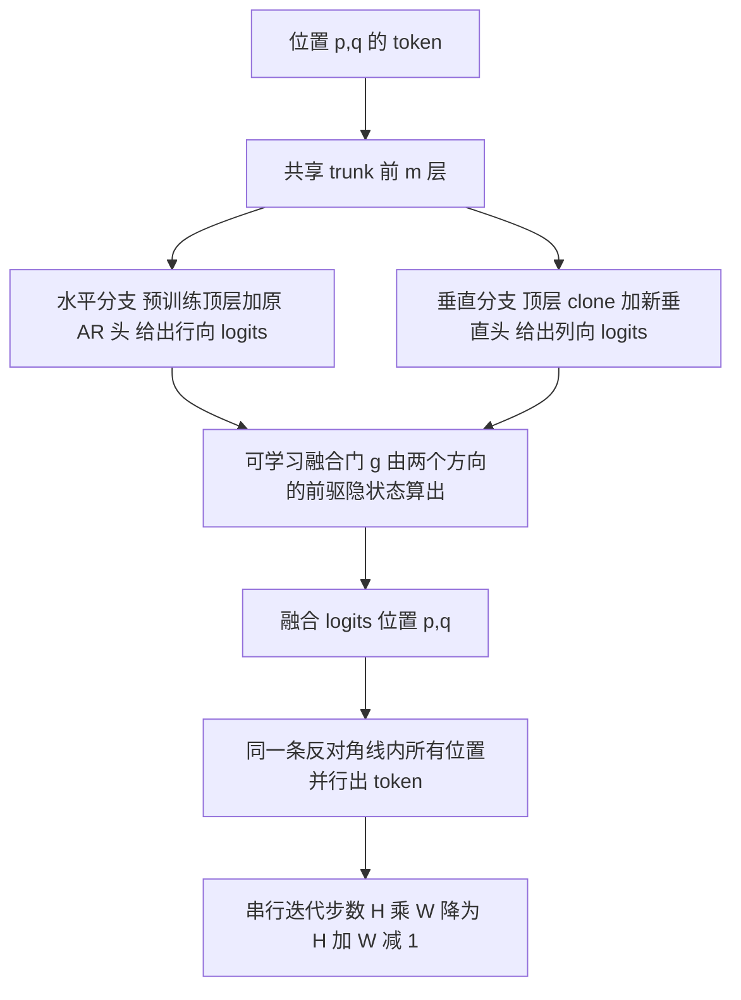
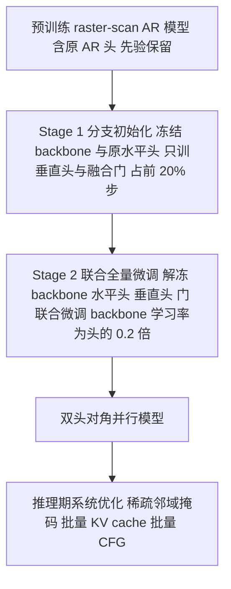

# FlashAR

## 论文信息

| 项 | 值 |
|---|---|
| 标题 | FlashAR: Efficient Post-Training Acceleration for Autoregressive Image Generation |
| 作者 / 单位 | 本次分析产物**未登记**作者列表与单位，引用时按**未披露**处理 |
| venue / 年份 | arXiv 预印本 `v3`（2026-09-16），[cs.CV]，CC BY 4.0；会议收录**未披露** |
| arXiv | `2605.09430v3` |
| 代码 / 项目页 | 摘要末句 "Our code is available at here"，HTML 中指向项目页 `https://lxazjk.github.io/FlashAR/`；**全文无 GitHub 仓库链接**，本工作区也未抓取仓库内容 → **待核**（不能进「代码或 README 证据」档） |
| papers 库 | **未入本地 papers 库**（`data/papers.db` 无 `arxiv-2605.09430`），按命名规范登记 `papers_id: arxiv-2605.09430` |

> **素材来源性质**：主源为 arXiv LaTeXML 全文 HTML（`raw/sources/flashar.html`）；**无 PDF**（抓取记录：PDF `HTTP 406`、source tarball `IncompleteRead`），因此全文只用**章节号 / 公式号 / 图号 / 表号，不写页码**。训练定位与证据等级引用**本仓库知识库整理**（`management/docs/knowledge/视频生成训练与推理加速专题.md` §2.3，下称「**我方整理**」），属二手性质，已逐处标注。

## 一句话总结

**FlashAR 是「后训练适配」的 AR 图像生成加速方案**：站在现成的光栅扫描（raster-scan）AR 权重上，**保留原 AR 头作水平头**，只在倒数第二层（pre-final）新挂一个轻量**垂直头**并加**可学习融合门**，把逐 token 串行解码改成**沿反对角线并行**——优化的是**解码步数**（$H\cdot W \rightarrow H+W-1$），不换范式、不从头训练、也不动预训练先验。

- **旗舰加速**：Emu3.5-Image-34B、512×512，串行解码步数 **1024 → 63**；单图延迟（单卡 H20-96G、batch size 1、100 样本平均）**103.57s → 7.95s，13.03×**（论文 v3 Table 4）。
- **训练代价小但非零**：两阶段后训练；Emu3.5-Image 用 **50K steps / 80M tokens ≈ backbone 预训练 token 的 0.053%**（摘要取约数 ≈0.05%）。
- **质量代价同样非零**：GenEval 80.48 → **80.17**（Emu3.5-Image）；GLM-Image 70.34 → 68.97；T2I-CompBench 的 shape（0.63→0.61）与 texture（0.75→0.73）小幅下降。
- **⚠️ 口径冲突必须并列**：我方整理记该工作为「**130.10s→5.68s，22.9×**」并自注"部分报告人补充数字待核"，与本论文 v3 Table 4 的 103.57s→7.95s / 13.03× **不一致**，两组数字不可混用（见第 6 节）。
- **只验证图像**：全篇无视频 / 时间维实验；论文把 3D 时空视频 AR 解码列为 **future work**（§6），无实验证据。

### 四问速答

| 问题 | 回答 |
|---|---|
| ① 加速哪一段成本 | **自回归解码步数（主项）**：保留预训练**水平头**、新增**垂直头**，把串行迭代从 $H\cdot W$ 压到 $H+W-1$（512×512：1024→63），实现**对角线并行**；**次项是系统与算子**（§4.4：FlexAttention 现场编译稀疏 2D 邻域掩码、批量 KV cache 写入、批量 CFG 前向）。**不涉及**注意力数学形式替换、权重量化/蒸馏、KV cache 容量压缩、去噪步数（本方法不是 diffusion 范式） |
| ② 训练前提 | **后训练**（post-training adaptation），**既非零训练、也非从头训练**：必须已有预训练光栅 AR 权重**及其原 AR 头**；两阶段执行（Stage 1 冻结 backbone 只训新头+门 → Stage 2 全解冻联合微调）。定位恰好在 ZipAR（零训练）与 NAR/VAR/PAR（从头训练）**之间** |
| ③ 证据等级 | **论文已验证（部分报告人补充数字待核）**，来源：**我方整理（知识库 视频生成训练与推理加速专题 §2.3）**。本笔记原样带出、不升格：论文侧有 Table 1–7 与 Figure 4 消融；「代码或 README 证据」「仓库 benchmark」两档**为空**（仓库未抓取）；「待自测」项需在我方硬件上复盘 |
| ④ 报告口径 | **Emu3.5-Image 34B、H20：130.10s→5.68s（22.9×）；质量口径为 GenEval**（**我方整理**，自注"部分报告人补充数字待核"）。论文 v3 同名模型/硬件口径为 103.57s→7.95s（13.03×）；训练 8×H20 bf16，延迟为单卡 H20-96G、batch=1、512×512、CFG=5.0。**与 ZipAR（零训练、LlamaGen-XL-512、A100）和 NAR（从头训练、UCF-101）的训练前提与测量口径都不同，不可直接横比** |

## 问题与动机

自回归（AR）视觉生成把图像 token 按光栅序展平成一维序列，用下一 token 预测（NTP）逐个生成。论文的问题陈述是：**成本结在「串行步数」上**——$H\times W$ 个 token 就要 $H\times W$ 次前向，一张高分辨率图要执行数千次，且解码过程 "heavily memory-bandwidth-bound"，GPU 并行度利用不起来（§2.1；该句是论文的问题陈述，非实测数据）。

论文把已有路线归为三类，并逐类给出代价（§2.2）：

| 路线 | 代表 | 论文指出的代价 |
|---|---|---|
| 改预测顺序 / 多尺度并行 AR | VAR（next-scale）、PAR、NAR（next-neighbor） | 需要双向注意力、**必须从头预训练**，与现成 raster-scan AR 权重不兼容 |
| 改预测目标的后训练 | Block Diffusion / 离散扩散适配（Emu3.5 采用） | 改变 AR backbone 的因果结构，需多阶段微调，**常损害细粒度结构一致性** |
| 投机解码 | Medusa / SJD / draft-model 系 | 免训练插件，但加速受 draft 接受率限制；论文明确**不作为主要基线** |

由此得到的 insight 是：**既然「并行」是必须的，那就把预训练先验留住，只付出少量后训练代价去买并行度**——即用预训练的水平预测头继续管行方向，另加一个垂直头管列方向，两个方向在同一反对角线上同时出 token（§2.2 末段；两向解码的构造沿用 NAR 的思路，§3.2 首句明确写 "Following NAR"）。

**动机的第二个支点来自探针**：论文用线性探针（Figure 3）观测到预训练模型的**倒数第二层特征**比最后一层更适合喂给垂直头（图 3(b)：探针给 pre-final 特征的权重高于 final 层），因为顶层表征已被「水平 next-token」目标特化；同时，把分支挂在深度 $m$ 而非最后一层之后，**不拉长关键路径**，水平/垂直两块可以在共享 trunk 上并发执行（§4.1 末段）。

## 方法精析

FlashAR 可以拆成五块独立读：**(A) 对角步分解**（谁和谁并行）→ **(B) 双头结构**（水平头保留、垂直头新增）→ **(C) pre-final 分支**（从哪里分叉）→ **(D) 可学习融合门**（两个方向怎么合）→ **(E) 推理期系统优化**（把理论并行变成 wall-clock 加速）。

### A. 对角步分解：把 $H\cdot W$ 步压到 $H+W-1$ 步

标准光栅扫描 AR 的因式分解是严格串行的（§3.1 式(1)）：

$$
p(Y\mid c)=\prod_{i=0}^{HW-1}p(y_{i}\mid y_{<i},c).
$$

| 符号 | 含义 |
|---|---|
| $Y=\{y_{p,q}\}_{p=0,q=0}^{H-1,W-1}$ | 尺寸 $H\times W$ 的离散图像 token 网格 |
| $y_{p,q}$ | 位置 $(p,q)$ 的 token（$p$ 行、$q$ 列） |
| $c$ | 生成条件（类别标签或文本） |
| $i$ | 一维展平序列索引，取值 $0,\dots,HW-1$ |

**中文解释**：每个 token 都依赖它之前的**全部** token，因此前向次数等于 token 数；这是被加速的基线成本项。

论文把网格按**反对角线**分组（§3.2 式(2)）：

$$
\mathcal{D}_{t}=\{y_{p,q}\mid p+q=t\},\qquad t=0,1,\dots,H+W-2.
$$

| 符号 | 含义 |
|---|---|
| $\mathcal{D}_{t}$ | 第 $t$ 条反对角线（满足 $p+q=t$ 的 token 集合） |
| $H,W$ | 网格高、宽（token 数） |
| $t$ | 对角线索引，共 $H+W-1$ 条 |

于是解码分解成「按对角线推进」（§3.2 式(3)）：

$$
p(Y\mid c)=\prod_{t=0}^{H+W-2}p(\mathcal{D}_{t}\mid\mathcal{D}_{<t},c).
$$

| 符号 | 含义 |
|---|---|
| $\mathcal{D}_{<t}$ | 所有 $t'<t$ 的对角线集合（已生成前缀） |
| $p(\mathcal{D}_{t}\mid\mathcal{D}_{<t},c)$ | 一条对角线上**所有 token 的联合条件分布**，同一对角线内并行采样 |

**中文解释**：这条式子是全篇加速的来源——迭代次数由 $HW$ 降为 $H+W-1$，复杂度从「对 2D 网格二次」变成「对空间维度线性」（§3.2）。512×512 的 32×32 token 网格正好对应 1024 → 63 步（$H+W-1=63$），与论文 §5.2 报告一致。**代价是同一个对角线内的 token 互相不可见**（论文自陈局限，见第 8 节）：并行的是「对角线内部」，不是「跨对角线流水」。

### B. 双头结构：保留水平头，只新增垂直头

模型在共享 trunk 之后分成两个分支（§4.1 式(4)(5)(6)）：

$$
h_{p,q}=F_{0:m-1}(y_{p,q}),
$$

$$
z^{H}_{p,q}=Head^{H}\!\left(F_{m:L-1}(h_{p,q})\right),\qquad
z^{V}_{p,q}=Head^{V}\!\left(\widetilde{F}_{m:L-1}(h_{p,q})\right).
$$

| 符号 | 含义 |
|---|---|
| $F=(F_{0},\dots,F_{L-1})$ | 预训练 decoder 的 $L$ 层 transformer（LlamaGen-L 为 $L=24$） |
| $m$ | **分支深度**：从第 $m$ 层分叉；最优 $m=23$（$L=24$，Table 6） |
| $F_{0:m-1}$ | 前 $m$ 层组成的**共享 trunk** |
| $F_{m:L-1}$ | 原模型顶层 $L-m$ 层（水平分支复用） |
| $\widetilde{F}_{m:L-1}$ | **顶层 clone**，独立可训练（垂直分支使用） |
| $Head^{H}$ | **预训练原 AR 头**（水平头，行向 next-token） |
| $Head^{V}$ | **新增的轻量垂直头**（列向预测） |
| $z^{H}_{p,q}$ / $z^{V}_{p,q}$ | 水平 / 垂直分支的 logits |

**中文解释**：水平分支**完全复用**预训练权重，这是「保留先验」的落点；垂直分支拿「顶层 clone + 新头」，是唯一的架构新增。两条分支在 trunk 上并发，因此**关键路径深度不变**——论文用它对比 NAR「在最后一层之后接块会拉长 critical path」的代价（§4.1 末段）。

图注：**双头并行解码机制**（依据 §4.1–§4.2 式(4)–(8) 重绘）。读图要点是：并行发生在**同一条对角线内部**，跨对角线仍是串行的；两个分支共享 trunk，所以新增的只有「顶层 clone + 新头 + 门」这一小段。

### C. 融合门与边界处理

两个方向的 logits 用**逐位置的可学习门**加权融合，而不是简单平均（§4.2 式(7)(8)）：

$$
g_{p,q}=\sigma\!\left(\mathrm{MLP}\!\left([\,h^{H}_{p,q-1};\;h^{V}_{p-1,q}\,]\right)\right),
$$

$$
z_{p,q}=g_{p,q}\,z^{H}_{p,q-1}+(1-g_{p,q})\,z^{V}_{p-1,q}.
$$

| 符号 | 含义 |
|---|---|
| $h^{H}_{p,q-1}$ / $h^{V}_{p-1,q}$ | 水平方向左侧前驱、垂直方向上方前驱的隐状态 |
| $[\cdot;\cdot]$ | 拼接 |
| $\sigma$ | sigmoid，把门控压到 $(0,1)$ |
| $g_{p,q}$ | 位置相关门控标量 |
| $z_{p,q}$ | 融合后的最终 logits（用 CE 监督） |

**中文解释**：门控按位置动态决定「听行方向还是听列方向」。消融显示固定平均（$g=0.5$）在 FID / sFID / IS 上全面劣于可学习门（Table 7：FID 4.36 → 4.12）。**边界位置退化**：论文明确写首行只用水平 logits、首列只用垂直 logits、角点 $(0,0)$ 由条件前缀预测（§4.2），即图像边缘处并行收益为零。

### D. 后训练目标与两阶段流程

三个损失项（§4.3 式(9)(10)）——最终 logits 的 CE + 两个方向的辅助 CE：

$$
\mathcal{L}_{\text{fuse}}=\frac{1}{HW}\sum_{p=0}^{H-1}\sum_{q=0}^{W-1}\mathrm{CE}\!\left(z_{p,q},\,y_{p,q}\right).
$$

| 符号 | 含义 |
|---|---|
| $\mathrm{CE}$ | 交叉熵 |
| $y_{p,q}$ | 位置 $(p,q)$ 的真值 token |
| $\mathcal{L}_{\text{fuse}}$ | 对**融合 logits** 的监督（主损失） |

$$
\mathcal{L}_{H}=\frac{1}{H(W-1)}\sum_{p=0}^{H-1}\sum_{q=0}^{W-2}\mathrm{CE}\!\left(z^{H}_{p,q},\,y_{p,q+1}\right),\qquad
\mathcal{L}_{V}=\frac{1}{(H-1)W}\sum_{p=0}^{H-2}\sum_{q=0}^{W-1}\mathrm{CE}\!\left(z^{V}_{p,q},\,y_{p+1,q}\right).
$$

| 符号 | 含义 |
|---|---|
| $\mathcal{L}_{H}$ | 水平通路的辅助 CE：用**行内下一个** token $y_{p,q+1}$ 作目标（保持原 NTP 语义） |
| $\mathcal{L}_{V}$ | 垂直通路的辅助 CE：用**列向下一个** token $y_{p+1,q}$ 作目标（教会新头列方向预测） |

$$
\mathcal{L}=\mathcal{L}_{\text{fuse}}+\lambda_{\text{aux}}\left(\mathcal{L}_{H}+\mathcal{L}_{V}\right),\qquad \lambda_{\text{aux}}=0.05.
$$

| 符号 | 含义 |
|---|---|
| $\lambda_{\text{aux}}$ | 辅助损失权重，论文取 $0.05$（§5.1） |

**中文解释**：辅助项的作用是给两条通路提供**方向明确**的梯度，避免只有融合 logits 时两路学习信号混淆。

两阶段后训练（§4.3）：

图注：**后训练流程**（依据 §4.3、§5.1 重绘）。要点是整条链**没有动预训练目标**——Stage 1 冻结 backbone 与原水平头是为了避免破坏预训练视觉流形（论文写 "catastrophic forgetting"）并让新组件快速稳定；Stage 2 才全解冻联合微调。因此 FlashAR **不能套在没有现成 NTP 权重的范式上**。

### E. 推理期系统优化

理论上的对角线并行要变成 wall-clock 加速，还要三件事（§4.4，论文明确描述）：

1. **FlexAttention 现场编译高度稀疏的 2D 邻域掩码**：避免物化完整注意力矩阵，也避免稠密零填充造成的显存碎片；
2. **批量 KV cache 写入**：一条对角线上并发采样出的全部 token，一次性 append 到各分支自己的 KV cache；
3. **批量 CFG**：条件 / 无条件前向合并成一个 batch，摊薄 kernel launch 开销、提高 GPU 算术强度。

**归因边界**：Table 4 只报告「结构并行 + 系统优化」的**合成**结果（FlashAR 一行绑定 FlexAttention + batched CFG），论文**未拆分**步数贡献与算子贡献，本笔记不做单因素归因。

### 本篇配图受抓取限制

> **本篇配图受抓取限制**：论文 Figure 1（teaser）与 Figure 3（linear probing 分析）在抓取时被 arXiv 限流（HTTP 406，多次重试失败），**本篇只有 1 张原图可用**（论文 Figure 5，补充材料的复杂文本引导生成样例），另用上述 **2 张 Mermaid**（双头并行解码机制、后训练流程）补结构。**不要把本笔记的图 1 当成 Figure 1 或 Figure 3**。

## 训练与实现细节

| 项 | 值 | 披露状态 |
|---|---|---|
| 数据集 | LlamaGen：ImageNet；Emu3.5-Image-34B：自 OpenGPT-4o-Image 与 ShareGPT-4o-Image 筛出约 **80K 文本-图像对**；GLM-Image：**数据来源未披露** | 部分披露（§5.1） |
| 数据规模 | Emu3.5-Image **50K steps / 80M tokens**（≈ backbone 预训练 token 的 **0.053%**，摘要取约数 ≈0.05%）；GLM-Image **40M post-training tokens** | 已披露（§5.1、§5.2） |
| 预处理 / tokenizer | 视觉 tokenizer 与 codebook 设置**未披露** | **未披露** |
| 模型初始化 | 预训练 raster-scan AR checkpoint + 原 AR 头；垂直分支的顶层块由**顶层 clone** 初始化 | 已披露（§4.1、§4.3） |
| batch size | LlamaGen 后训练 **512**；Emu3.5 / GLM-Image 的 batch **未披露** | 部分披露 |
| 学习率 / 调度 | 两阶段 base lr $2\times10^{-5}$ + cosine decay；Stage 2 backbone 学习率 = 头的 **0.2 倍** | 已披露（§5.1） |
| 优化器 / warmup / weight decay | **未披露** | **未披露** |
| 训练轮数 / 步数 | LlamaGen **25 epochs**；Emu3.5-Image **50K steps**；GLM-Image **40M tokens**；Stage 1 占**前 20% 训练步** | 已披露（§5.1） |
| 超参 | $\lambda_{\text{aux}}=0.05$；CFG 默认 **2.0**（LlamaGen）/ **5.0**（Emu3.5）；分支深度 $m=23$（$L=24$） | 已披露（§5.1、Table 6） |
| 硬件 / 成本 | 训练 **8 × NVIDIA H20**、bf16；GPU-hours、显存占用、wall-clock 时长**未披露** | 部分披露 |
| 随机种子 / 复现设置 | **未披露**；代码链接未经核实 | **未披露** |

**一句话**：训练代价的口径是「约 0.05% 预训练 token 量级」，但这是一次**货真价实的后训练**——需要现成 AR 权重、配对数据与 8 卡级算力，不能当零成本插件用。

## 推理与系统链路

| 阶段 | 处理 | 是否被 FlashAR 改变 |
|---|---|---|
| 条件输入 | 文本 prompt / 类别标签编码 | 否 |
| 对角线调度 | 沿 $\mathcal{D}_{t}$ **严格并行**出 token，logits 直接由 $\mathcal{D}_{t-1}$ 融合得到 | **是** |
| 共享 trunk 前向 | 前 $m$ 层（$m=23$ of 24） | 是（分叉点前移） |
| 双头前向 | 水平：预训练顶层 + 原 AR 头；垂直：顶层 clone + 新垂直头 | **是**（新增分支） |
| 融合门 | 逐位置 $g_{p,q}$ 加权两个方向的前驱 logits | **是**（新增模块） |
| 注意力后端 | FlexAttention 现场编译稀疏 2D 邻域掩码 | 是（系统层） |
| KV cache | 一条对角线的 token **批量** append 到分支专属 cache | 是（系统层，容量未压缩） |
| CFG | 条件 / 无条件前向批量合并 | 是（系统层） |
| 视觉解码 | token 网格 → 像素（视觉 tokenizer 解码） | 否 |
| 输出 | 图像（512×512 文生图 / 256×256 类条件等） | 否 |

**边界条件**（论文明确描述，§4.2）：首行只用水平 logits、首列只用垂直 logits、角点 $(0,0)$ 由条件前缀预测——边界处的并行收益为零。**未披露**：单步耗时 / FLOPs、mask 稀疏度、KV cache 显存占用、VQ 解码是否计入延迟。

## 实验与结果

### 主结果一：ImageNet 256×256 类条件生成（Table 1，§5.2）

| 规模 | LlamaGen（256 步，FID↓） | NAR（31 步，FID↓） | BlockDiffusion（75 epoch，FID↓） | **FlashAR（25 epoch / 31 步）** | FlashAR 吞吐（img/s） |
|---|---|---|---|---|---|
| B（≈120M） | 5.46 | 4.65 | 5.91 | **4.68**（IS 208.3，P/R-F1 0.605） | **447.2**（NAR 419.7） |
| L（≈360M） | 3.80 | 3.06 | 4.55 | **3.16**（IS 289.0，0.656） | 224.7 |
| XL（≈700M） | 3.39 | 2.70 | 4.13 | **2.94**（IS 293.7，0.672） | 109.3 |
| XXL（≈1.4B） | 3.09 | 2.58 | 3.78 | **2.79**（IS 289.4，0.690） | 63.4 |

**读法**：步数 256 → 31（即 $H+W-1$，16×16 网格）是方法内自洽的结果；质量上 FlashAR 全面优于**同类后训练方法** BlockDiffusion（L 规模 FID 3.16 vs 4.55，且只用其 1/3 训练预算：25 vs 75 epochs），IS 甚至超过从头训练的 NAR-L（289.0 vs 263.9）。**但训练预算并不对等**：NAR 是 300 epochs 从头训练，FlashAR 是 25 epochs 后训练——表中数字不能读成「同预算下的质量排序」。

### 主结果二：Emu3.5-Image-34B 文生图（512×512，CFG=5.0）

**质量（Table 2 / Table 3，§5.2）**

| 方法 | GenEval 总分 ↑ | DPG-Bench ↑ | PickScore ↑ | T2I-CompBench Shape ↑ | Texture ↑ |
|---|---|---|---|---|---|
| Original AR | 80.48 | 86.74 | 0.2309 | 0.63 | 0.75 |
| BlockDiffusion | 74.22 | — | — | — | — |
| **FlashAR** | **80.17**（Table 3 单列 80.29） | 86.12 | 0.2262 | 0.61 | 0.73 |

**加速（Table 4，表题口径："Speedups are relative to the fastest evaluated AR baseline; both it and FlashAR use batched CFG."）**

| 方法 | 注意力后端 | 批量 CFG | 延迟（s） | 加速 |
|---|---|---|---|---|
| Original AR | FlashAttention-2 | No | 189.36 | 0.55× |
| Original AR | FlexAttention | Yes | 121.83 | 0.85× |
| Original AR | FlashAttention-2 | Yes | 103.57 | 1.00×（**最快 AR 基线**） |
| **FlashAR** | FlexAttention | Yes | **7.95** | **13.03×** |

**步数与训练量**：串行解码步数 **1024 → 63**；50K steps / 80M tokens ≈ 预训练 token 的 **0.053%**（§5.2）。**注意倍率对基线高度敏感**：分母是最快的 AR 配置（103.57s），不是 189.36s 那一行；表中也说明系统项本身对基线有收益（189.36s → 103.57s）。

### 主结果三：GLM-Image（Table 5，§5.2）

| 方法 | 延迟（s）↓ | 加速 | GenEval ↑ |
|---|---|---|---|
| Original AR | 110.17 | 1.00× | 70.34 |
| **FlashAR** | **8.92** | **12.35×** | **68.97** |

**口径缺口**：Table 5 **未给分辨率、未给模型规模、未给延迟硬件**，表题只写 "relative to the original AR implementation used in this experiment"，因此 12.35× **不可与 13.03× 并排**。

### 消融（§5.3）

| 消融项 | 数字 | 结论 |
|---|---|---|
| 两阶段 vs 单阶段（Figure 4(a)） | 第 25 epoch：两阶段 FID **3.16** vs 单阶段 **3.27** | 两阶段稳定化有效；**仅 5 epochs** 即达 FID 3.98，已优于 BlockDiffusion 25 epochs 的 4.55 |
| 分支深度 $m$（Table 6，$L=24$） | $m=24$：3.29 / $m=23$：**3.16** / $m=21$：3.20 | pre-final 最优，但差异在小数第二位（增益不大、方向一致） |
| 融合策略（Table 7） | 固定平均 $g=0.5$：FID 4.36 → **可学习门 4.12** | 动态门优于固定平均 |
| 组件（Figure 4(b)） | Naive 4.36 → +垂直分支 4.16 → +融合门 4.12 → FlashAR 3.98 | 三件套各有贡献；**未披露**各组件与 $m$ 的耦合 |

**未披露**：Stage 1/2 在图中的具体分界 epoch、线性探针的具体权重数值与数据集、FlexAttention 的独立贡献、推理峰值显存。

### 定性样例（本篇唯一原图）

图 1 是论文附录 A 的 Figure 5，标题为 *Complex text-guided image generation samples by Emu3.5-Image-FlashAR*——**34B 模型经 FlashAR 后训练之后**、在复杂文本提示下生成的样图画廊。它的用途是给主结果补一个**定性旁证**：经过「加头 + 对角并行」的后训练，模型对复杂提示的跟随能力没有明显塌陷，这与 Table 2/3 中 GenEval 80.48→80.17、DPG-Bench 86.74→86.12 的「基本持平」结论方向一致。**读图时的三点边界**：① 它是**定性画廊**，图注未标注每张样例的提示文本、分辨率与采样配置，也**不含任何指标数值**，因此证据强度**低于表格级**，不能与 Table 2/3 并列当量化证据；② 它**只展示成功样例**，不含失败案例，Table 3 中 shape/texture 两维的小幅下降在这张图里看不出来；③ 本环节**无法目视核验**该图的细粒度内容（见 `.cache/article-note/flashar/analysis/image-collection.md`），以上解读基于论文图注与章节语义，不做像素级断言。

### 报告口径与边界（不可与其它论文直接横比）

| 维度 | 论文口径 | 边界 |
|---|---|---|
| 模型 | LlamaGen B/L/XL/XXL（≈120M/360M/700M/1.4B）、Emu3.5-Image-**34B**、GLM-Image（规模未披露） | 全部是**图像** AR 模型，**无视频** |
| 分辨率 | ImageNet 256×256（类条件）、512×512（Emu3.5-Image 文生图）；GLM-Image **未披露** | 对角线步数依赖网格尺寸，$H+W-1$ 的具体值**随分辨率变化** |
| 硬件 | 训练 **8×NVIDIA H20、bf16**；延迟 **单卡 H20-96G、batch size 1、100 样本平均** | 训练多卡 / 推理单卡，两个口径**不可互换解读** |
| CFG | LlamaGen 2.0（消融另有 1.5）、Emu3.5 5.0；Table 4 中对比双方**都开 batched CFG** | 倍率分母 = 最快 AR 基线（103.57s），不是 189.36s |
| 证据等级 | 论文已验证：Table 1–7 + Figure 4 消融 | 代码 / 仓库 benchmark 两档**为空**；待自测未做 |
| **我方整理口径** | **Emu3.5-Image 34B、H20：130.10s→5.68s，22.9×；质量口径为 GenEval**（自注"部分报告人补充数字待核"） | 与论文 v3 Table 4 的 **103.57s→7.95s、13.03× 不一致**（可能来自更早版本 v1/v2 或不同 CFG 批量配置）。**两组数字并列登记、不合并、不混用** |
| 与邻居的横比 | — | **ZipAR**（零训练、推理调度改造、A100、LlamaGen-XL-512、33.17s→5.86s）与 **NAR**（从头训练、改训练目标、UCF-101）与本篇的**训练前提与测量口径都不同**，13.03× / 22.9× 均**不可与它们的倍率直接比较** |

## 相关工作与定位

| 方法 / 路线 | 训练前提 | 加速段 | 与 FlashAR 的机制差异 |
|---|---|---|---|
| LlamaGen（原始 raster-scan AR） | 从头训练 | — | 严格串行，$HW$ 步；本篇的基线与被适配对象 |
| **PAR** | 从头训练 | 步数 | 子集内 next-token，需双向注意力；与现成 AR 权重不兼容 |
| **NAR**（next-neighbor） | 从头训练 | 步数 | 按邻域等距层并行；FlashAR 借用了它的两向解码分解，但**不重新预训练**，另加 pre-final 垂直头 + 门控，且**不拉长关键路径** |
| VAR（next-scale） | 从头训练 | 步数 | 多尺度预测，范式不同 |
| Block Diffusion（离散扩散适配） | 后训练 | 步数 | 同为后训练，但改的是**预测目标 / 因果结构**；FlashAR 保留 AR 目标与预训练先验，只加头 |
| 投机解码（Medusa / SJD 一类） | 零训练 | 步数 | 受 draft 接受率限制；论文明确不列为主要基线 |
| **ZipAR**（[[论文笔记/zipar|ZipAR 模型笔记]]） | **零训练** | 步数 | 纯推理调度改造（空间局部性窗口准入），不动权重、不加头；FlashAR 需要后训练但换来更强的并行结构 |
| **FlashAR（本篇）** | **后训练** | 步数 + 系统算子 | 保留水平头 + 新增垂直头 + 可学习门 → 对角线并行 |

**定位一句话**（**我方整理**，知识库 §2.3）：ZipAR 是推理调度改造、NAR 改的是训练范式，**FlashAR 在两者之间**——保留预训练先验，用少量后训练增加并行头。三者与扩散式方法（Ditto / Avatar Forcing 一类）不是即插即用关系，价值在于「若自训 AR 视觉模型，如何从训练目标 / 后训练层面消除串行瓶颈」。

## 局限与启发

### 论文自陈与素材层面的局限

1. **对角内条件独立**（论文自陈，§6）：同一条反对角线上的 token **严格并行**，缺少对角线内的互相感知；论文提出未来用轻量 intra-step 通信（如迭代精修）弥补，**当前无方案、无实验**。
2. **分支深度靠经验搜索**（论文自陈，§6）：$m=23$ 是试出来的最优值，无自动搜索方案；迁移到新 backbone 需**重搜**，属复现成本。
3. **只验证图像**：全篇 token 均为 2D 图像特征图，**无视频 / 时间维 / 音频实验**；扩展到 3D 时空视频 AR 解码只是 **future work**（§6），**无实验证据**。
4. **质量代价非零**：GenEval 80.48→80.17（Table 2）、GLM-Image 70.34→68.97（Table 5）、T2I-CompBench shape/texture 小幅下降（Table 3）——不能写成「无损加速」。
5. **加速归因未拆分**：Table 4 中步数并行与系统优化（FlexAttention / 批量 KV / 批量 CFG）绑定报告，**未披露**单步耗时、mask 稀疏度、显存占用，因此「13.03× 中多少来自步数、多少来自算子」无从判断。
6. **代码可复现性待核**：只有项目页链接、无仓库内容被抓取；垂直头/门的参数量级、GPU-hours、mask 实现细节均**未披露**。
7. **GLM-Image 口径不全**：分辨率、模型规模、延迟硬件均**未披露**，其 12.35× 与 13.03× **不可并排**。

### 我们的实测（我方未接入）

**我方未接入 FlashAR**：本地没有 raster-scan NTP 图像 AR 训练链与对应权重（参考我方整理 §四的本地可用性矩阵），因此本小节**只写定位与可复用点，不给出任何「本地可用 / 已复现」结论，也不给加速承诺**。

### 论文局限 vs 我们结论

| 维度 | 论文口径 | 我们的结论 |
|---|---|---|
| 本地是否接入 | — | **未接入**；无预训练 raster-scan AR 权重与训练链，只作方法参考与规划方向 |
| 加速的是哪一段 | 解码步数为主，系统算子为辅 | **自回归解码步数**（+ 系统算子）；不涉及注意力数学形式、量化、KV 压缩、去噪步数——**不要与 FPSAttention / BLADE 一类单步内核路线混为一类** |
| 训练前提 | 后训练（两阶段） | **后训练**；前置条件为「现成 AR 权重 + 原 AR 头 + 配对数据 + 8 卡级算力」，缺一不可 |
| 证据等级 | Table 1–7 + Figure 4 消融 | **论文已验证（部分报告人补充数字待核）**，来源**我方整理（知识库 §2.3）**；**不升格**（代码证据为空） |
| 报告口径 | Emu3.5-Image-34B、512×512、8×H20 训练 / 单卡 H20-96G 测延迟、batch=1、CFG=5.0；v3 为 103.57s→7.95s（13.03×） | **130.10s→5.68s（22.9×）**（我方整理、待核）与 v3 口径**不一致**，两套并列登记、不可混用；**不可与 ZipAR / NAR 横比** |
| 质量代价 | GenEval 80.17 vs 80.48；shape/texture 小幅下降 | 记为**「基本持平但非无损」**；定性样例（Figure 5）只作旁证 |
| 对角内条件独立 | 论文自陈局限 + future work | 我方无实测；登记为**复现风险点**（高纹理/精细结构可能受损） |
| 分支深度 $m$ | 经验搜索，$L=24$ 时取 23 | 迁移到新 backbone **需重搜**；差异仅在小数第二位，收益有限 |
| 视频 / 数字人可用性 | **未验证**（3D 时空列 future work） | **待自测**；与本仓库知识库「迁到视频需定义时间维窗口」（ZipAR 条目）的判断方向一致，但这是**我方推断**，不是论文结论 |
| 本地复现成本 | — | **高**：需现成 AR 权重 + 两阶段后训练 + FlexAttention 实现；无代码/配置可核，只能停在「方法可借鉴」 |
| 可复用点 | 对角步分解；双头 + 可学习门；两阶段稳定化（先冻 backbone 再联合微调）；批量 KV / 批量 CFG | **机制可搬**（若将来自训 AR 视觉模型，可按 §4.1–§4.3 的最小闭环搭：保留原头、加垂直头、门控、两阶段微调）；**当前不承诺本地可用** |
| 未披露项 | 垂直头 / 门参数量、GPU-hours、mask 实现细节、tokenizer codebook、优化器与随机种子、推理显存 | 一律记 **未披露**，不猜测、不补数 |

### 可操作启发

1. **归类到「减少串行解码步数（后训练档）」**，不写成「注意力加速」或「缓存加速」；四问表里第 1 问已经把它与单步内核路线区分开。
2. **引用倍率必带四件套 + 两套口径**：模型（Emu3.5-Image-34B）、分辨率（512×512）、硬件（单卡 H20-96G、batch=1；训练 8×H20 bf16）、质量口径（GenEval），并同时给出论文 v3 的 13.03× 与我方整理的 22.9×（标注待核）。
3. **训练费光谱上的位置**（我方整理 §三）：`零训练（ZipAR / DAX）→ 后训练（FlashAR）→ 蒸馏或 QAT（BLADE / FPSAttention / TurboDiffusion）→ 从头训练（NAR）`；本篇落在**后训练**一格。
4. **诚实点写进结论**：对角内条件独立、分支深度需重搜、质量小幅下降、代码证据为空、视频未验证——五项都不能省略。
5. **与前序判据对齐**：知识库已声明「不同论文口径不可拼排行榜」，本笔记的 13.03× / 12.35× / 22.9× 均只用于**同表同口径**对比。

## 术语与符号表

| 术语 | 英文 | 含义 |
|---|---|---|
| 自回归生成 | autoregressive (AR) generation | 逐 token 的下一 token 预测生成范式 |
| 光栅扫描解码 | raster-scan decoding | 从左到右、从上到下的 1D 展平顺序串行解码（被加速的基线） |
| 后训练适配 | post-training adaptation | 在现成预训练权重上做轻量适配训练；本篇的训练前提 |
| 两向下一 token 预测 | two-way next-token prediction | 同时用水平（行）与垂直（列）两个方向做 next-token 预测 |
| 对角线步分解 | diagonal-step factorization | 按反对角线 $\mathcal{D}_{t}$ 分组解码，步数 $HW \rightarrow H+W-1$ |
| 反对角线 | anti-diagonal $\mathcal{D}_{t}$ | 满足 $p+q=t$ 的 token 集合，同一线上并行生成 |
| 双头解码 | dual-head decoding | 保留原 AR 头（水平头）+ 新增垂直头 |
| 水平头 / 垂直头 | horizontal head / vertical head | 原 AR 头（行向）/ 新增轻量头（列向） |
| 倒数第二层分支 | pre-final branching | 垂直头从第 $m$ 层（$m=23$ of 24）分叉，而非最后一层之后 |
| 线性探针 | linear probing | Figure 3 的分析实验：冻结 backbone 训练层权重聚合 + 垂直头，观测权重偏向 pre-final 特征 |
| 可学习融合门 | learnable fusion gate | 逐位置动态加权水平 / 垂直 logits，替代固定平均 |
| 融合 logits | fused logits $z_{p,q}$ | 门控加权后的最终 logits，用 CE 监督 |
| 分支初始化 | Branch Initialization（Stage 1） | 冻结 backbone 与原水平头，只训垂直头 + 门（前 20% 步） |
| 联合全量微调 | Joint Full Fine-Tuning（Stage 2） | 解冻全网联合微调，backbone 学习率为头的 0.2 倍 |
| 灾难性遗忘 | catastrophic forgetting | Stage 1 冻结 backbone 的动机（保护预训练视觉流形） |
| 关键路径深度 | critical-path depth | 在深度 $m$ 分叉使两分支可并发，不加深关键路径 |
| 对角内条件独立 | intra-diagonal conditional independence | 论文自陈局限：同一对角线内 token 并行、互相不可见 |
| KV 缓存 | KV cache | 自回归推理缓存；本篇使用分支专属 cache + 批量写入 |
| FlexAttention | FlexAttention | 现场编译稀疏 2D 邻域掩码的注意力实现（避免物化完整注意力矩阵与稠密零填充） |
| 无分类器引导 | classifier-free guidance (CFG) | 条件 / 无条件前向；本篇把两者批量合并以摊薄 kernel launch |
| 块扩散 | Block Diffusion | Emu3.5 采用的离散扩散后训练路线，本篇的直接对比基线 |
| 下一邻居预测 | next-neighbor prediction | NAR 的并行范式；本篇的对角分解沿用其两向解码思路 |

| 符号 | 含义 |
|---|---|
| $c$ | 生成条件（类别标签或文本） |
| $Y=\{y_{p,q}\}$ | $H\times W$ 的离散图像 token 网格 |
| $y_{p,q}$ / $p$ / $q$ | 位置 $(p,q)$ 的 token / 行索引 / 列索引 |
| $i$ | 一维展平序列索引（$0..HW-1$） |
| $\mathcal{D}_{t}$ | 第 $t$ 条反对角线，$t=0,\dots,H+W-2$ |
| $L$ | 预训练 decoder 层数（LlamaGen-L：$L=24$） |
| $F=(F_{0},\dots,F_{L-1})$ | 层序列；$F_{0:m-1}$ 为共享 trunk |
| $m$ | 分支深度（最优 $m=23$） |
| $h_{p,q}$ | 共享 trunk 的中间状态 |
| $Head^{H}$ / $Head^{V}$ | 水平头（预训练原 AR 头）/ 垂直头（新头） |
| $\widetilde{F}_{m:L-1}$ | 顶层 clone、独立可训练（垂直分支） |
| $z^{H}_{p,q}$ / $z^{V}_{p,q}$ / $z_{p,q}$ | 水平 logits / 垂直 logits / 融合 logits |
| $g_{p,q}$ / $\sigma$ | 逐位置门控标量 / sigmoid |
| $\mathrm{CE}$ | 交叉熵 |
| $\mathcal{L}_{\text{fuse}}$ / $\mathcal{L}_{H}$ / $\mathcal{L}_{V}$ | 融合损失 / 水平辅助损失 / 垂直辅助损失 |
| $\lambda_{\text{aux}}$ | 辅助损失权重（$=0.05$） |

## 相关文档

- 加速专题与定位：[[knowledge/视频生成训练与推理加速专题|视频生成训练与推理加速专题]] §2.3「自回归并行」（本笔记四问中训练要求与证据等级的来源）、[[数字人概述/数字人加速|数字人加速]]
- 同组对照（自回归并行三路线）：[[论文笔记/zipar|ZipAR 模型笔记]]（零训练、推理调度改造）、[[论文笔记/nar|NAR 模型笔记]]（从头训练、改训练目标）
- 相邻方向对照：[[论文笔记/fpsattention|FPSAttention 模型笔记]]（单步内核侧）、相邻的 BLADE（块稀疏 + 步数蒸馏联合训练）
- 篇目与索引：[[论文笔记/README|论文笔记]]（本篇属「生成侧加速十篇」，未入 papers 库，仅登记 arXiv）
