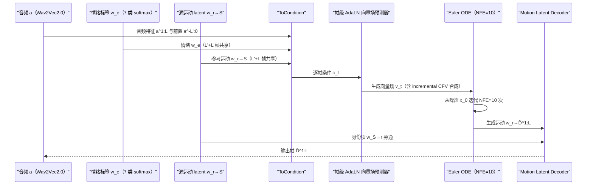

# FLOAT

## 论文信息

| 项 | 值 |
|---|---|
| 标题 | FLOAT: Generative Motion Latent Flow Matching for Audio-driven Talking Portrait |
| 作者 | Taekyung Ki、Dongchan Min、Gyeongsu Chae |
| 单位 | KAIST + DeepBrain AI（论文首页署名邮箱与脚注） |
| venue / 年份 | ICCV 2025（arXiv comment；论文正文未自行声明会议） |
| arXiv | `2412.01064v5`（`[cs.CV]`；v1 2024-12-02，v5 2025-09-19） |
| 项目页 | https://deepbrainai-research.github.io/float/ |
| 代码仓库 | 论文未给出（LaTeX 源码内无 GitHub 链接） |
| papers 库条目 | `arxiv-2412.01064`（**FLOAT 未入本地 papers 库**：`data/papers.db` 无此条目） |

> 命名说明：`FLOAT` = "**flo**w matching based **a**udio-driven **t**alking portrait generation model"（`sec/1_intro.tex` 贡献列表）。它是方法名，与数值类型 float、以及 flow matching 泛称无关。引用图号统一按编译后 PDF 编号（本笔记图题均标注对应「论文 Figure N」）。

## 一句话总结

**先造一个好的「运动空间」，再在其中做少步流匹配——把生成目标从像素或整体面部 latent 换到具显式身份-运动分解、可计算正交基的运动隐空间，于是同一套生成主干同时拿到低 NFE、可编辑性与语音驱动情绪控制。**

- **两阶段**：① 用 LIA 系自编码器预训练一个具**显式身份-运动分解**与**正交基**的 motion latent 空间；② 在该空间用 **OT 路径流匹配**采样 talking motion latent，再由 motion latent decoder 解码成视频（`sec/3_methods.tex` §4；论文 Figure 2）。
- **少步生成**：默认 **NFE=10**、Euler 一阶 ODE 求解器，单张 V100 上 41.37 FPS（Table 5）；消融显示 NFE=2 仍有竞争力，但运动时序变差（补充 §B.3）。
- **可编辑**：基 $V$ 正交，可在 test-time 用内积**闭式**解出运动系数并线性编辑（$\lambda$-control），不改其他运动分量（`sec/4_experiments.tex` §5.4，Eq.(15)）。
- **情绪可控**：预训练 speech emotion predictor 给出 **7 类** softmax 概率 $w_e$ 注入条件，再用 **incremental CFV** 把音频条件与情绪条件分开调节（默认 $\gamma_a=2$、$\gamma_e=1$）。
- **主结果**：HDTF / RAVDESS 上 FID **21.100 / 31.681**、FVD **162.052 / 166.359**、LSE-D **7.290 / 6.994**、LSE-C **8.222 / 5.730** 均列最优；但 CSIM 输 Hallo，E-FID / P-FID 部分输 Hallo、EchoMimic（Table 1）。

## 问题与动机

任务设定：给定单张源图 $S\in\mathbb{R}^{3\times H\times W}$ 与驱动音频 $a^{1:L}$，生成说话视频 $\hat{D}^{1:L}\in\mathbb{R}^{L\times 3\times H\times W}$（`sec/3_methods.tex` §4）。论文把已有路线的代价归到三处（`sec/1_intro.tex`；`sec/2_related.tex` §2.2）：

| 路线 | 代表 | 论文指出的缺口 |
|---|---|---|
| 像素空间扩散 | Hallo、EchoMimic、EMO | 依赖 StableDiffusion 先验与辅助面部先验（bbox / landmark / skeleton / 3D mesh），计算昂贵、易视频级伪影、头动多样性受限 |
| 整体面部 latent | VASA-1 | 采样 motion latent 缓解了耗时，但 latent 是**隐式**的，缺乏可计算结构，无法 test-time 直接编辑 |
| 运动空间（本文） | FLOAT | 用 LIA 系自编码器构造**具正交基的运动潜空间**，把条件与时间轴注意力解耦，条件接口可插拔 |

两个直接把技术选择推出来的动机数据：

1. **一对多映射**：音频到面部运动本质一对多，纯音频条件难以决定表达到什么程度——这正是「情绪」需要被单独建模、单独调节的原因（`sec/1_intro.tex`；`sec/3_methods.tex` §4.2）。
2. **条件接口缺失**：既有工作的情绪多来自 image-emotion 配对或 image-driven predictor，与 audio-driven 场景不贴合；FLOAT 改用 speech-driven emotion，让情绪在音频驱动下自然可控（`sec/3_methods.tex` §4.2）。

insight 即一句话：**把生成目标换到一个低维、可分解、基正交的运动空间，再配 OT 直线路径的流匹配与逐帧条件调制，就能同时压低 NFE 与打开可编辑接口。**

## 方法精析

主链路（两阶段）：源图编码并**显式分解**为身份项与运动项 → 构造驱动条件 $\mathbf{c}_t$ → flow matching transformer 逐帧估计生成向量场 → 解 ODE 得到运动隐变量序列 → 加回身份项后解码成视频。

图 1（论文 Figure 2）是全文的数据流契约，但它本身不含数字、不构成证据，作用是交代三件事的顺序：**先分解、再生成运动、最后解码**。注意图中身份项 $w_{S\to r}$ 直接旁通到解码端——全流程唯一被「生成」的量是运动隐变量，身份只在编码与解码两端出现。

### 阶段一：显式身份-运动分解与正交基

沿用 LIA 作为基座自编码器，把源图 latent $w_S$ 显式拆成两项，其中运动项在一个学习到的 source-agnostic 正交基上展开（`sec/3_methods.tex` §4.1，Eq.(8)(9)）：

$$
w_S := w_{S\to r} + w_{r\to S}, \qquad w_{r\to S} = \sum_{m=1}^{M} \lambda_m(S)\,\mathbf{v}_m \in \mathbb{R}^d
$$

| 符号 | 含义 | 取值 / 说明 |
|---|---|---|
| $w_S\in\mathbb{R}^d$ | 源图编码出的 latent | $d=512$ |
| $w_{S\to r}$ | 身份（identity）latent | 解码后为平均头姿/表情/视野的画面 |
| $w_{r\to S}$ | 运动（motion）latent，即 reference motion | 在基 $V$ 上展开 |
| $M$ | 正交运动方向数 | $M=20$ |
| $\lambda_m(S)$ | source-dependent 运动系数（该方向的强度） | $\lambda(S)\in\mathbb{R}^{M}$ |
| $\mathbf{v}_m$ | source-agnostic 学习基向量 | $V:=\{\mathbf{v}_m\}_{m=1}^{M}\subseteq\mathbb{R}^d$ |
| $\langle\mathbf{v}_m,\mathbf{v}_k\rangle=\delta_{m,k}$ | 基正交（Kronecker delta） | test-time 编辑的前提 |

**为什么这个分解有用**：身份项与运动项相加即可还原，意味着解码端只需「身份项 + 生成的运动项」；而运动项落在 20 维正交基上，使「读某个方向的强度」退化为一次内积。论文明确描述这一正交结构是相对 VASA-1 隐式 latent 的差异化点（`sec/2_related.tex` §2.2）。

> 符号纪律：正文训练段把 reference motion 简写为 $w_r$，条件定义处用 $w_{r\to S}$；论文**未披露**二者是否严格同量，本笔记统一按 $w_{r\to S}$（源图运动隐变量）理解并注明这一点。overview 图题另写小写 $w_{r\to s}$，属同一对象的排版差异。

### 阶段二：OT 路径流匹配目标

生成不直接回归运动，而是学生成一个向量场 $v_t$，沿最优传输（OT）直线路径从噪声插值到目标运动，用常速目标场作监督（`sec/3_methods.tex` §3，Eq.(5)）：

$$
\mathcal{L}_{\text{OT}}(\theta) := \left\| v_t\big((1-t)x_0 + t x_1;\theta\big) - (x_1 - x_0) \right\|_2^2
$$

| 符号 | 含义 |
|---|---|
| $\mathcal{L}_{\text{OT}}(\theta)$ | OT 路径下的流匹配损失 |
| $v_t(\cdot;\theta)$ | 网络预测的生成向量场，$\theta$ 为参数 |
| $x_0\sim p_0$ | 先验样本（噪声 $x_0\sim\mathcal{N}(0^{1:L},I)$） |
| $x_1\sim q$ | 目标运动隐变量样本 |
| $(1-t)x_0 + t x_1$ | OT 直线插值轨迹 $x_t$，$t\sim\mathcal{U}[0,1]$ |
| $x_1 - x_0$ | 常速目标向量场 $u_t$ |

**与扩散的差别**：目标不是估计噪声或信号，而是估计「直线插值的速度」；因此 ODE 可用一阶 Euler 少步求解。实际训练时把上式扩展为窗口项加前序项，并对时间轴一帧差分加一个 velocity loss $\mathcal{L}_{\text{vel}}$ 以稳住时序，总目标为 $\mathcal{L}_{\text{total}}=\lambda_{\text{OT}}\mathcal{L}_{\text{OT}}+\lambda_{\text{vel}}\mathcal{L}_{\text{vel}}$（$\lambda_{\text{OT}}=\lambda_{\text{vel}}=1$；`sec/3_methods.tex` §4.2 Training）。

### 帧级条件：AdaLN + gating 与掩码自注意力

向量场预测器基于 DiT/Transformer encoder，但把**帧级条件与时间轴注意力解耦**：每帧由 `ToScaleShift` 从该帧条件 $\mathbf{c}_t^l$ 产生自适应层归一化与门控系数，再用掩码自注意力在 $2T$ 邻帧上建模时序（`sec/3_methods.tex` §4.2，Eq.(10)）：

$$
\gamma_i^{l} \times \text{LN}\!\left(X_t^{l}\right) + \beta_i^{l} \in \mathbb{R}^h \quad\text{and}\quad \alpha_i^{l} \times X_{t}^{l} \in \mathbb{R}^h
$$

| 符号 | 含义 |
|---|---|
| $l$ | 帧索引；$X_t^l$ 为第 $l$ 帧在流时间 $t$ 的输入 |
| $\text{LN}(\cdot)$ | layer norm |
| $\gamma_i^l,\beta_i^l$ | 帧级 AdaLN 的缩放 / 偏移系数 |
| $\alpha_i^l$ | 帧级门控（gating）系数 |
| $i\in\{1,2\}$ | 两处操作（AdaLN 与 gating） |
| $h$ | hidden 维度，$h=1024$（8 头注意力） |
| $\mathbf{c}_t^l\in\mathbb{R}^h$ | 该帧条件，由 `ToScaleShift` 线性层变换而来 |

驱动条件 $\mathbf{c}_t$ 由音频 $a^{1:L}$（Wav2Vec2.0 表征）、情绪标签 $w_e$、源运动 latent $w_{r\to S}$，加上流时间步嵌入 $\text{Emb}(t)$（正弦位置嵌入）经 `ToCondition` 线性层拼接而成；$w_e$ 与 $w_{r\to S}$ 在 $L'+L$ 帧间共享，另接入前序窗口的 $L'$ 帧音频与运动 latent 以平滑长序列过渡。掩码自注意力实际只关注 $[l-2,l-1,l,l+1,l+2]$（$T=2$）。

> 维度口径：正文一处写 $\mathbf{c}_t\in\mathbb{R}^{L\times h}$、另一处与 Figure 18 图题写 $(L'+L)\times h$，属论文表述不一致，本笔记按 $L'+L$ 帧理解。参数上的具体数值见第 4 节。

### 正交基带来的 test-time 线性编辑

因基正交，采样的运动 latent 在某个基方向上的系数可由内积**闭式**取出（`sec/4_experiments.tex` §5.4，Eq.(15)）：

$$
\langle w_{r\to\hat{D}},\ \mathbf{v}_k\rangle = \Big\langle \sum_{m=1}^{M} \lambda_m(\hat{D})\,\mathbf{v}_m,\ \mathbf{v}_k\Big\rangle = \lambda_k(\hat{D})
$$

| 符号 | 含义 |
|---|---|
| $\langle\cdot,\cdot\rangle$ | 内积 |
| $w_{r\to\hat{D}}$ | 采样（生成）得到的运动 latent |
| $\mathbf{v}_k$ | 第 $k$ 个正交基向量 |
| $\lambda_k(\hat{D})$ | 采样运动在第 $k$ 个方向上的系数 |
| $\delta_{m,k}$ | Kronecker delta，保证只有 $m=k$ 的项存活 |

**与 VASA-1 的机制差异**：拿到可读写的系数后，可直接线性编辑 $\lambda_k$ 再组合回 latent，从而在不干扰其他运动分量的前提下改头方向——论文称之 $\lambda$-control。这是「正交基」相对「隐式 latent」唯一无法替代的收益：编辑无需外部信号、无需重训。

### 面部部件感知损失 L_comp-lp

阶段一引入 **facial component perceptual loss**：在 VGG-19 四级特征金字塔（$N=4$）上，用面部部件二值掩码做 masked L1，专门监督牙齿、眼球这类小区域（`sec/6_suppl.tex` §A.2）。它的消融效果放在第 6 节（图 3）。论文明确：该损失能直接监督细粒度运动（如眼球运动），无需外部驱动。

## 训练与实现细节

两阶段分别训练，超参披露程度远高于同类工作。

### 阶段一：Motion Latent Auto-encoder（`sec/6_suppl.tex` §A.4）

| 项 | 值 |
|---|---|
| 优化器 | Adam |
| batch size | 8 |
| 学习率 | $2\times10^{-4}$ |
| 训练步数 | 460k steps |
| 训练时长 | 约 9 天 |
| 硬件 | 单张 NVIDIA A100 |
| 训练数据 | HDTF + RAVDESS + VFHQ；预处理后 **14,362** 训练片段、**49** 测试片段 |
| 损失项 | $\mathcal{L}_{L1}$、$\mathcal{L}_{\text{lp}}$、$\mathcal{L}_{\text{comp-lp}}$、$\mathcal{L}_{\text{full-adv}}$、$\mathcal{L}_{\text{eye-adv}}$、$\mathcal{L}_{\text{eye-FSM}}$、$\mathcal{L}_{\text{lip-adv}}$、$\mathcal{L}_{\text{lip-FSM}}$ |
| 平衡系数 | $\lambda_{\text{lp}}=10$、$\lambda_{\text{comp-lp}}=100$、$\lambda_{\text{eye-adv}}=1$、$\lambda_{\text{eye-FSM}}=100$、$\lambda_{\text{lip-adv}}=1$、$\lambda_{\text{lip-FSM}}=100$、$\lambda_{\text{full-adv}}=1$ |
| 判别器 | StyleGAN2（2-scale，非饱和损失）；FSM 参照 GFPGAN 的 Gram 矩阵匹配 |
| $\mathcal{L}_{\text{comp-lp}}$ 尺度数 | $N=4$（VGG-19 特征金字塔） |
| latent 维度 / 正交方向数 | $d=512$、$M=20$ |
| 随机种子 / 权重初始化 / 学习率 schedule | 未披露 |

### 阶段二：FLOAT 向量场预测器（`sec/4_experiments.tex` §5.2）

| 项 | 值 |
|---|---|
| 运动 latent 维度 | $d=512$ |
| 正交方向数 | $M=20$ |
| attention heads | 8 |
| hidden 维度 | $h=1024$ |
| attention window | $T=2$（attend $2T$ 邻帧，即 $[l-2,l+2]$） |
| 窗口长度 | $L=50$ 帧 + 前序 $L'=10$ 帧（合计 60 帧，约 2.4 s @25fps） |
| 优化器 | Adam |
| batch size | 8 |
| 学习率 | $10^{-5}$ |
| 训练步数 | 2,000k steps |
| 训练时长 | 约 2 天 |
| 硬件 | 单张 NVIDIA A100 |
| 损失范数 / 平衡系数 | L1；$\lambda_{\text{OT}}=\lambda_{\text{vel}}=1$ |
| ODE solver | 一阶 Euler（mid-point、Dopri5 无显著提升） |
| 默认 NFE / guidance | NFE $=10$；$\gamma_a=2$、$\gamma_e=1$ |
| CFV dropout | 对 $w_r$、$w_e$、$a^{1:L}$ 以概率 0.1 dropout；前序 audio 与 motion latent 以概率 0.5 dropout |
| 向量场预测器层数 / 参数量 | **未披露**（论文只给 heads、$h$、$T$） |
| 音频特征维度 $d_a$ | **未披露**（Wav2Vec2.0 输出维度未给） |
| 随机种子 / 数据增强 / 多卡设置 | 未披露 |

### 数据与预处理（`sec/4_experiments.tex` §5.1）

- 沿用 FOMM 策略：视频转 25 FPS、音频重采样 16 kHz、裁脸并 resize 到 $512^2$（人脸对齐模型）。
- 阶段一用 HDTF + RAVDESS + VFHQ；阶段二**排除 VFHQ**（无同步音频）。
- HDTF：训练 11.3 h / 240 视频 / 230 身份，测试 78 身份（各 15 s）；RAVDESS：训练 22 身份、测试 2 身份（各 3–4 s，14 种情绪强度）；两数据集训练/测试身份不重叠。

## 推理与系统链路

推理只需源图 + 音频（+ 情绪标签）：从噪声 $x_0$ 出发，用驱动条件 $w_{r\to S}$、$w_e$、$a^{1:L}$ 以及前序 $L'$ 帧生成运动 latent，按 Euler 逐帧估计向量场，把 $w_{r\to S}$ 换成生成的 $w_{r\to\hat{D}^{1:L}}$ 后交给运动 latent decoder 出帧。

推理时的条件分离由 **incremental CFV** 完成——它不是单一 guidance 标量，而是把音频与情绪分开调（`sec/3_methods.tex` §4.2 Inference）：

$$
\tilde{v}_t \approx v_t(x_0, \mathbf{c}_t|_{\{a^{1:L}, w_e\}}) + \gamma_a\left[\,v_t(x_0, \mathbf{c}_t|_{w_e}) - v_t(x_0, \mathbf{c}_t|_{\{a^{1:L}, w_e\}})\,\right] + \gamma_e\left[\,v_t(x_0, \mathbf{c}_t) - v_t(x_0, \mathbf{c}_t|_{w_e})\,\right]
$$

| 符号 | 含义 |
|---|---|
| $\tilde{v}_t$ | 经增量引导修正后的向量场 |
| $v_t(\cdot)$ | 基础向量场预测 |
| $\mathbf{c}_t$ | 全条件（音频 + 情绪 + 运动 + 时间步） |
| $\mathbf{c}_t\mid_{\{a^{1:L}, w_e\}}$ | 去掉音频与情绪后的条件 |
| $\mathbf{c}_t\mid_{w_e}$ | 只保留情绪（去掉音频）的条件 |
| $\gamma_a$ / $\gamma_e$ | 音频 / 情绪引导尺度，默认 2 / 1 |

**读法**：第一项是「有情绪但无音频」的基础预测，第二项按 $\gamma_a$ 补回音频的贡献，第三项按 $\gamma_e$ 补回情绪相对于「仅音频」的增量——两条增益互不干扰，故音频与情绪可分别调。原 LaTeX 第二行**缺一个右括号**（源码即如此），上式按物理含义补齐了闭合括号，未改动任何符号。

图 2（论文 Figure 4）把「逐帧条件化」画成可执行结构：条件是**逐帧注入**（每帧一套 AdaLN/门控系数），时序关系由掩码自注意力单独在邻帧上处理。这正是论文主张「条件与 attention 解耦」的形态依据，也是它能同时支持音频、情绪、3DPose、I2E 等多种可插拔条件的原因。

**与我们的链路的关系**：本仓库主线（Avatar Forcing 一线）复用的正是 FLOAT 定义的这个 motion latent 空间——低维运动空间 + 轻量解码器是主线的基本形态；但**我们未接入 FLOAT 原权重**，见第 8 节。

## 实验与结果

### 协议与基线

- 指标：FID（画质）、FVD（视频时空一致性）、CSIM（ArcFace 身份相似度）、E-FID / P-FID（3DMM 表情 64 维 / 头姿 6 维的 FID）、LSE-D / LSE-C（唇音同步）；阶段一另用 LPIPS。评测用每段视频的**第一帧**作 source image。
- 定量基线：SadTalker、EDTalk、AniTalker、Hallo、EchoMimic；**EMO 与 VASA-1 因实现不可得，只用其 demo 视频做定性对比**，无定量指标，不得写成可比基线。

### 主结果（Table 1，HDTF / RAVDESS 双数据集）

每格为 **HDTF / RAVDESS**；加粗为论文标注的最优值。

| 方法 | FID ↓ | FVD ↓ | CSIM ↑ | E-FID ↓ | P-FID ↓ | LSE-D ↓ | LSE-C ↑ |
|---|---|---|---|---|---|---|---|
| SadTalker$^{\dagger}$ | 71.952 / 119.430 | 339.058 / 376.294 | 0.644 / 0.644 | 1.914 / 3.500 | 1.456 / 2.045 | 7.947 / 7.273 | 7.305 / 4.748 |
| EDTalk$^{\dagger}$ | 50.078 / 75.020 | 211.284 / 304.933 | 0.626 / 0.676 | 1.579 / 3.468 | 0.054 / 0.090 | 8.123 / 7.682 | 7.623 / 5.318 |
| AniTalker$^{\dagger}$ | 39.512 / 70.430 | 184.454 / 265.341 | 0.643 / 0.725 | 1.830 / 2.330 | 0.092 / 0.126 | 7.907 / 8.176 | 7.288 / 4.555 |
| Hallo | 25.363 / 57.648 | 197.196 / 375.557 | **0.869 / 0.860** | **1.039** / 2.492 | 0.037 / 0.050 | 7.792 / 7.613 | 7.582 / 4.795 |
| EchoMimic | 33.552 / 81.839 | 296.757 / 320.220 | 0.823 / 0.805 | 1.234 / 3.201 | **0.023** / 0.047 | 8.903 / 8.161 | 6.242 / 4.144 |
| **FLOAT (Ours)** | **21.100 / 31.681** | **162.052 / 166.359** | 0.843 / 0.810 | 1.229 / **1.367** | 0.032 / **0.031** | **7.290 / 6.994** | **8.222 / 5.730** |

> $^{\dagger}$：**用原始 $256\times256$ 分辨率输出评测**（Table 1 脚注原文口径）。论文**未明示 FLOAT、Hallo、EchoMimic 的评测分辨率**，也未说明是否所有方法都在同一分辨率下比较——引用此表时不能默认为同分辨率对比。
> 读法纪律：FLOAT 在 FID、FVD、LSE-D、LSE-C 上最优；但 **CSIM 输 Hallo**（0.843 / 0.810 vs 0.869 / 0.860），**E-FID 在 HDTF 上输 Hallo，P-FID 在 HDTF 上输 Hallo 与 EchoMimic**。论文原文措辞是「在多数指标上优于 SOTA」，不是「全面最优」。

### 附加条件结果（Table 2，HDTF / RAVDESS）

| 配置 | FID ↓ | FVD ↓ | E-FID ↓ | P-FID ↓ | LSE-D ↓ |
|---|---|---|---|---|---|
| A **FLOAT (Ours)** | 21.100 / 31.681 | 162.052 / 166.359 | 1.229 / 1.367 | 0.032 / 0.031 | 7.290 / 6.994 |
| B A + 3DPose | 19.721 / 29.721 | 126.663 / 112.894 | 0.926 / 1.152 | 0.012 / 0.016 | 7.516 / 7.047 |
| C A − S2E | 21.235 / 32.035 | 155.032 / 166.866 | 1.254 / 1.502 | 0.031 / 0.025 | 7.264 / 7.222 |
| D A − S2E + I2E | 21/528 / 31.609 | 158.577 / 162.369 | 1.158 / 1.305 | 0.034 / 0.022 | 7.183 / 7.150 |

> S2E = speech-to-emotion，I2E = image-to-emotion，3DPose = 3DMM 头姿参数 $p\in\mathbb{R}^6$。
> 配置 D 的 FID（HDTF）源码写作 `21/528`，与同表其他数值格式（`21.xxx`）不一致，**疑为 `21.528` 的排版笔误**，此处按源码原样照录。论文正文未对 A→B→C→D 逐项解读，仅泛述「能有效容纳附加条件」。

### 消融（Table 3，HDTF）

| 方法 | FID ↓ | FVD ↓ | E-FID ↓ | LSE-D ↓ | # NFEs ↓ |
|---|---|---|---|---|---|
| Ours (w. Cross-Attn.) | 21.873 | 162.702 | 1.452 | 7.757 | **10** |
| Ours (w. Diff., $\epsilon$-pred.) | 21.190 | **161.666** | **1.213** | 9.922 | 50 |
| Ours (w. Diff., $x_0$-pred.) | 21.697 | 162.847 | 1.278 | 9.048 | 50 |
| **FLOAT (Ours)** | **21.100** | 162.052 | 1.229 | **7.290** | **10** |

- **帧级 AdaLN vs cross-attention**：两者画质相当，但帧级 AdaLN 的表达生成与唇同步更好（LSE-D 7.290 vs 7.757），且头动更多样——cross-attention 把「条件化」与「聚合」揉在一次注意力里。
- **Flow matching vs 扩散**：两种扩散参数化（$\epsilon$-pred. 与 $x_0$-pred.）都用作者的向量场预测器作去噪网络、沿用 VASA-1 训练设置（500 扩散步 + cosine scheduler，50 步 DDIM）。画质相当，但**流匹配唇同步明显更好（LSE-D 7.290 vs 9.922 / 9.048），且 NFE 从 50 降到 10**。

图 3（论文 Figure 3）是 $\mathcal{L}_{\text{comp-lp}}$ 有效性的直观证据：红框（牙齿纹理）与黄框（眼球运动）是普通感知损失容易失守的区域，该损失在 VGG-19 四级特征金字塔上加部件掩码监督后，这些局部不再糊。论文明确：它能直接监督细粒度运动，无需外部驱动。这解释了为何 FLOAT 在**没有** 3DMM/landmark 先验的情况下仍能守住牙齿与眼球。

### 效率（Table 5，HDTF；FPS 在单张 V100 上）

| Ours-NFE | FID ↓ | FVD ↓ | E-FID ↓ | LSE-D ↓ | FPS ↑ |
|---|---|---|---|---|---|
| Ours-2 | 21.785 | 178.831 | 1.542 | 7.559 | 45.22 |
| Ours-5 | 21.440 | 164.463 | 1.331 | 7.155 | 44.74 |
| Ours-10 **(default)** | 21.100 | 162.052 | 1.229 | 7.290 | 41.37 |
| Ours-20 | 21.158 | 164.392 | 1.293 | 7.343 | 38.20 |

图 4（论文 Figure 9）与 Table 5 对应：NFE 从 2 增到 20，FPS 从 45.22 单调降到 38.20，而 FID 在 NFE=10 处最优。论文指出 NFE=2 时图像质量仍有竞争力、但 FVD / E-FID 变差（头抖、表情静态）——原因是**画质由自编码器决定，而时序由 ODE 求解精度决定**，在潜空间生成本就比像素空间省，步数压得太低先坏的是运动而非图像。

### 情绪重定向与 guidance 消融

图 5（论文 Figure 8）展示的是控制接口而非自动流程：当语音情绪预测模糊时，推理期可把标签**重定向**到指定的 one-hot，再由 CFV 强化。配合 Table 6 的 guidance 消融即可读出两个方向——增大 $\gamma_a$ 提升时序一致性（FVD）与唇同步（LSE-D），增大 $\gamma_e$ 提升视频一致性（FVD）与表达力（E-FID）；默认取 $\gamma_a=2$、$\gamma_e=1$。

| Guidance scales | FID ↓ | FVD ↓ | E-FID ↓ | LSE-D ↓ |
|---|---|---|---|---|
| $\gamma_a=1,\ \gamma_e=1$ | 33.066 | 171.047 | 1.555 | 7.049 |
| $\gamma_a=1,\ \gamma_e=2$ | 31.844 | 166.041 | 1.334 | 7.212 |
| $\gamma_a=2,\ \gamma_e=1$ **(default)** | 31.681 | 166.359 | 1.367 | 6.994 |
| $\gamma_a=2,\ \gamma_e=2$ | 32.253 | 162.658 | 1.351 | 6.994 |

> 说明：单帧端到端延迟、显存占用、参数量、推理硬件（A100 还是 V100）**未披露**；所有指标均为单次报告，无重复实验方差与显著性检验。

## 相关工作与定位

| 方法 | 类别 | 机制要点 | 与 FLOAT 的差异（论文明确描述） |
|---|---|---|---|
| SadTalker | 非扩散 | audio-conditional VAE 生成头动与眨眼，需 3DMM 中间表示 | 表达力受限；FLOAT 不用 3DMM 先验，直接在运动隐空间生成 |
| EDTalk | 非扩散 | normalizing flow 生成头动，可分离控制唇部与头动 | normalizing flow 受架构约束；FLOAT 用 OT 流匹配而非似然流 |
| AniTalker | 扩散 | 在学到的运动潜空间做扩散 + variance adapter | 同为「运动潜空间」路线，但 FLOAT 的潜空间具**正交基结构**且用 OT 流匹配压低 NFE |
| Hallo | 扩散 | StableDiffusion 为图像生成器 + 层级音频注意力分控唇/表情/头姿 | 依赖 SD 先验与额外模块，算力开销大、易视频级伪影 |
| EchoMimic | 扩散 | 基于 StableDiffusion，facial skeleton 作附加驱动 | 结构化面部先验带来强空间偏置，限制头动多样性与保真度 |
| EMO | 扩散（不可直接跑） | 预训练 SD 升为视频生成，需辅助 facial prior | 依赖 bbox/landmark/skeleton/3D mesh 等先验；仅 demo 视频定性对比 |
| VASA-1 | 潜空间（不可直接跑） | 采样 motion latents 解决采样时间 | FLOAT 的运动潜空间具**可计算正交基**，支持 test-time 编辑，并据此用 OT 直线采样减步数 |
| MegaPortrait | 潜空间 | motion latent 表示的思想来源 | FLOAT 强调自身 latent 的正交线性结构，可沿直线采样、可 λ 编辑 |

**定位**：FLOAT 处在「运动潜空间」一条线上（MegaPortrait → VASA-1 → FLOAT），其单点差异集中在两处——**frame-wise condition 与时间轴注意力解耦**，以及**正交基带来的 test-time 可编辑性**；其余（LIA 自编码器、DiT 主干、CFV）是已有组件的适配。相对像素/VAE-latent 扩散线（Hallo / EchoMimic / EMO），它的主要卖点是更少 NFE 与更强的时序一致性。

**两条引用纪律**：① EMO 与 VASA-1 只做 demo 视频定性对比，其实现不可得，**不得当作可比定量基线**；② 定性对比图（论文 Figure 5）文件名含 `no-dreamtalk-legacy`，但 **DreamTalk 并未参与对比**（仅作相关工作被引用），勿据此误判。

## 局限与启发

### 论文自己承认的局限（`sec/6_suppl.tex` §D）

- **情绪只覆盖 7 类基本情感**（angry, disgust, fear, happy, neutral, sad, surprise），更细的情绪层次无法表达；且 `speech2emotion` 预测器的类别顺序与 $w_e$ 七维排列的对应**未披露**。
- **训练数据偏正面**：失败集中在非正面脸（$|\text{yaw}|\ge 20^\circ$）与戴配件（如眼镜）的场景。
- **方法学缺口**：向量场预测器 / 自编码器的层数与参数量、音频特征维度 $d_a$、正交基如何保证正交性、首窗前序条件的初始化策略、阶段二是否冻结解码器，**均未披露**；ODE 时间网格亦未给出。

### 我们的实测（未接入原权重）

**我们没有接入 FLOAT 的原权重/原代码**，因此本笔记不写对 FLOAT 原模型的实测。我们在这一线的实际做法是：**Avatar Forcing 复用了 FLOAT 定义的 motion latent 空间（身份/运动可加分解），其 motion latent auto-encoder 从 FLOAT 权重出发、在我们的数据集上重训**（`d=512`），并在此基础上叠加两项改造——**块因果的流式生成（causal diffusion forcing）** 与 **免标注 DPO 微调**。因此 FLOAT 对本仓库的定位是「**上游源头 + 主线基座**」，而非被我们评测的对象。长时漂移治理与流式改造的结论归 [[数字人概述/数字人身份|数字人身份]] 与 [[论文笔记/avatar-forcing|Avatar Forcing]] 两篇，本篇不复制。

### 论文局限 vs 我们结论

| 论文承认的问题 | 我们的结论 |
|---|---|
| 情绪仅 7 类基本情感 | 未消解。我们沿用其情绪条件接口，未扩展情感类别 |
| 训练数据偏正面，非正面/配饰易失败（图 6） | 与我们观察到的一致：低维运动空间对极端头姿泛化有限，属表示层面的边界 |
| 方法学多处未披露（层数、正交性保证等） | 我们未接触原权重，无法补测；只能按论文披露口径转述 |
| 未讨论长时流式与漂移 | **我们改了**：Avatar Forcing 在同一 motion latent 空间上重训并加因果流式 + DPO，把双向生成改成块因果以支持流式 |

图 6（论文 Figure 16，补充材料 Figure 编号）把局限可视化：非正面脸与配饰是最稳定的失败模式，与「训练数据 yaw 分布偏正」互为因果（论文 Figure 15 给出训练集 yaw 分布）。这也解释了为何失败结论应写成**「表示与数据分布的边界」**，而非「实现 bug」——同一正交基在正面场景是优势，在极端视角是短板。

### 可操作启发

1. **换生成空间比换主干更划算**。把目标从像素/VAE latent 压到低维可分解运动空间，直接换来更少 NFE 与更低的代价；代价是上限被运动表示本身约束（极端视角、配饰）。
2. **正交基是「可编辑」而非「更准」**。$\lambda$-control 的价值在于无需外部信号即可编辑，不保证生成质量更高——引用时应分清这两件事。
3. **解耦条件化与聚合**。把帧级条件从时间轴注意力里拆出来（AdaLN + 掩码自注意力），换来条件接口的可插拔与更稳的头动；这是相对把两者揉在一起的 cross-attention 的结构性收益。
4. **画质与时序是两套机制**。NFE 消融显示画质由自编码器定、时序由 ODE 精度定，压步数先坏运动——评估低步数方案时要分开看这两类指标。

## 术语与符号表

| 术语 | 英文 | 含义 |
|---|---|---|
| 运动隐空间 | motion latent space | LIA 系自编码器学到的空间，替代 SD 的 pixel-based latent；FLOAT 的核心载体 |
| 身份隐变量 / 运动隐变量 | identity latent / motion latent | $w_{S\to r}$ 与 $w_{r\to S}$，二者相加还原 $w_S$ |
| 正交基 | orthonormal basis $V$ | source-agnostic 运动基 $\{\mathbf{v}_m\}_{m=1}^{M}$，使系数可由内积读出 |
| 流匹配 | flow matching (FM) | 估计把先验映射到目标分布的时变向量场，解 ODE 生成流 |
| 最优传输路径 | optimal transport (OT) path | 连接 $x_0$ 与 $x_1$ 的直线路径、常速目标场，FLOAT 采样用 |
| 无分类器向量场 | CFV (classifier-free vector field) | 用引导尺度混合有条件/无条件**向量场**（不是 CFG 的噪声） |
| 增量式 CFV | incremental CFV | 分别用 $\gamma_a$、$\gamma_e$ 调音频与情绪 |
| 函数评估次数 | NFE | ODE 求解时向量场调用次数；FLOAT 默认 10 |
| 逐帧自适应层归一化 | frame-wise AdaLN | 每帧用其条件生成 AdaLN 系数，替代 DiT 的全局时间步调制 |
| 逐帧门控 | frame-wise gating | $\alpha_i^l\times X_t^l$，与 AdaLN 并列的调制项 |
| $\lambda$ 控制 | $\lambda$-control | test-time 用内积闭式解出系数再线性编辑运动 |
| 面部部件感知损失 | $\mathcal{L}_{\text{comp-lp}}$ | VGG-19 多尺度特征 + 部件掩码的 masked L1，监督牙齿/眼球等 |
| 速度损失 | velocity loss | 沿时间轴一帧差分的时序监督 |
| 语音驱动情绪增强 | speech-driven emotion enhancement | 预训练 speech emotion predictor 产 7 类 softmax，注入条件 |
| $\dagger$ 口径 | raw $256\times256$ | Table 1 中带此标注的方法用原始低分辨率输出评测 |

| 符号 | 含义 | 取值 / 说明 |
|---|---|---|
| $S$ / $\hat{D}^{1:L}$ | 源图 / 生成视频 | $3\times H\times W$ / $L\times 3\times H\times W$ |
| $D$ / $\hat{D}$ | 驱动帧 / 生成帧 | 训练时同片段采样 |
| $L$ / $L'$ | 主窗口帧数 / 前序帧数 | 50 / 10（合计 2.4 s @25fps） |
| $T$ | 注意力窗口参数 | 2（attend $[l-2,l+2]$） |
| $d$ / $h$ | 运动 latent 维度 / hidden 维度 | 512 / 1024 |
| $M$ | 正交基方向数 | 20 |
| $d_a$ | Wav2Vec2.0 音频特征维度 | **未披露** |
| $w_S$、$w_{S\to r}$、$w_{r\to S}$ | 源 latent、身份 latent、运动 latent | $\mathbb{R}^d$ |
| $w_e$ | 语音情绪标签（softmax 概率） | $\mathbb{R}^7$ |
| $\mathbf{v}_m$ / $\lambda_m(S)$ | 基向量 / 运动系数 | $\langle\mathbf{v}_m,\mathbf{v}_k\rangle=\delta_{m,k}$ |
| $c$ / $\mathbf{c}_t$ | 驱动条件（逐帧） | 由 `ToCondition` 拼接，含 $[t,w_{r\to S},w_e,a^{1:L},a^{-L':0}]$ |
| $x_0$ / $x_1$ | 先验（噪声）/ 目标运动隐变量 | OT 路径端点 |
| $v_t$ / $u_t$ | 生成向量场 / 目标向量场 | $u_t=x_1-x_0$ |
| $\mathcal{L}_{\text{OT}},\mathcal{L}_{\text{vel}},\mathcal{L}_{\text{total}}$ | OT 损失、速度损失、总损失 | $\lambda_{\text{OT}}=\lambda_{\text{vel}}=1$ |
| $\mathcal{L}_{\text{comp-lp}}$、$\lambda_{\text{comp-lp}}$ | 部件感知损失及其权重 | 权重 100，$N=4$ |
| $\gamma_a$ / $\gamma_e$ | 音频 / 情绪引导尺度 | 2 / 1 |
| $\lambda_k(\hat{D})$ | 采样运动在第 $k$ 维的系数 | 由内积闭式解出 |
| $p\in\mathbb{R}^6$ / $p^{1:L}$ | 3DMM 头姿参数 / 其序列 | 附加条件 3DPose |

## 相关文档

- 上游基座与我们的复用：[[论文笔记/avatar-forcing|Avatar Forcing 模型笔记]]（复用本 space 的 motion latent，重训 + 因果流式 + DPO）
- 运动空间专题：[[论文笔记/ditto|Ditto 模型笔记]]、[[论文笔记/liveportrait|LivePortrait 模型笔记]]
- 我们体系的关联节点：[[数字人概述/数字人身份|数字人身份]]、[[数字人概述/数字人动作|数字人动作]]、[[数字人概述/数字人加速|数字人加速]]
- knowledge 层：[[knowledge/Avatar Forcing Motion Latent AutoEncoder|Avatar Forcing Motion Latent AutoEncoder]]
- 项目页：https://deepbrainai-research.github.io/float/
- papers 库条目：`arxiv-2412.01064`（**未入本地 papers 库**）
