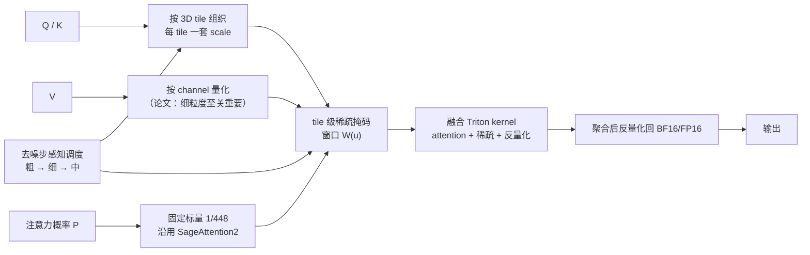

# FPSAttention

## 论文信息

| 项 | 值 |
|---|---|
| 标题 | FPSAttention: Training-Aware FP8 and Sparsity Co-Design for Fast Video Diffusion |
| 作者 | Akide Liu\*、Zeyu Zhang\*、Zhexin Li†、Xuehai Bai†、Yizeng Han、Jiasheng Tang‡、Yuanjie Xing、Jichao Wu、Mingyang Yang、Weihua Chen、Jiahao He、Yuanyu He、Fan Wang、Gholamreza Haffari、Bohan Zhuang‡（\* 共同一作，† 共同二作，‡ 项目负责人） |
| 单位 | Monash University、DAMO Academy (Alibaba Group)、ZIP Lab (Zhejiang University)、Hupan Lab |
| venue / 年份 | **NeurIPS 2025 Spotlight** |
| arXiv | `2506.04648v2`（2026-06-06） |
| 项目页 | https://fps.ziplab.co |
| 代码仓库 | 论文正文未给出仓库地址（项目页存在）；本篇不写仓库 |
| papers 库 | **未入库**，因此只登记 `arxiv_id`，不写 `papers_id` |

## 一句话总结

**把「量化 + 稀疏」这对本该互补的加速手段从推理期挪到训练期一起做**：注意力权重与键按 3D tile 量化、值按 channel 量化、注意力概率用固定标量，稀疏度与精度再按去噪步调度；配 Hopper 取向的融合 kernel，拿到 kernel **7.09×**、端到端 **4.96×**，而朴素叠加会把 VBench 总分打掉 **21.1%**。

- **动机是两类加速之间的内在张力**：稀疏优先保留**高幅值**注意力分数的 token，而量化**恰恰在高幅值处**误差最大——所以「先量化再稀疏」不是加法，是互相放大。
- **粒度不是一把尺子**：$Q/K$ 用 tile 级、$V$ 用 channel 级、$P$ 用固定标量，三套粒度各有理由，其中「**保持 $V$ 的细粒度对性能至关重要**」是论文原话。
- **步感知调度**：早/晚去噪步容忍更粗的量化与更高稀疏度，**中期最需要细粒度与稠密注意力**，所以三段是**粗 → 细 → 中**（非单调）。
- **训练感知**：调度参数先在推理期选定、再迁移进训练，让模型自己学会补偿联合误差；代价是需要 QAT。

## 问题与动机

论文的动机链是三段，缺一段就会读错。

**第一段：注意力是主瓶颈。** 视频 DiT 处理 $T\times H\times W$ 规模的时空 token，标准注意力复杂度随 token 数平方增长；在高分辨率与长时长下，**注意力常占推理时间 70% 以上**。论文给了一个具体量级：**Wan2.1-14B 在单张 H20 上生成 5 秒视频约需 2.5 小时**。

**第二段：两条加速线各自都还不够。** 量化一侧，FP8 保留了浮点的动态范围（不同于 INT8 的整数网格），但**训练无关的 FP8 量化会带来显著量化误差**；论文把同类量化方法（如 INT8 路线的 SageAttention）定性为「中等加速 + 质量下降」。稀疏一侧，SparseVideoGen（按 head 的时空 mask）、SpargeAttn（两阶段过滤）、STA（局部 3D 滑窗）都做到了可观的注意力加速，但它们**通常只做推理期加速、没有和训练过程集成、与量化不兼容**。

**第三段（关键）：朴素叠加会更差。** 论文的原话是：「稀疏技术优先保留**高幅值**注意力分数的 token，而量化**恰恰在高幅值处**引入不成比例的误差」。也就是说，两类加速选中的是同一个位置——**稀疏留下的正是量化最不准的那些 token**。Appendix C 把后果量化了：训练无关的朴素组合在 Wan 1.3B 上总分 **0.6325**，对比全精度基线 **0.8019**，**下降 21.1%**，其中 Human Action 掉到 0.02、Multiple Objects 干脆 0.0000、Object Class 0.0109、Spatial Relationship 0.0008。论文把这一现象解释为「稀疏放大了高幅值分数上的量化误差，量化噪声与稀疏选择的交互导致灾难性信息损失」。

由此论文的解法不是「更聪明的组合方式」，而是**换到训练期去联合优化**——它把稀疏化视作一种「0-bit 量化」的特例，把二者放进同一个可训练框架。论文对既有工作的判断是：视频扩散模型的 **QAT 仍 largely unexplored**。

## 方法精析

### 3D tile 与三种量化粒度

**tile 的定义**沿用 STA：3D token 空间被切成 $M$ 个**不重叠**的 tile $\{\mathcal{T}_u\}$，每块尺寸 $(T_t,T_h,T_w)$；局部注意力窗口由 tile 中心距离的 $\ell_\infty$ 约束给出：

$$
\mathcal{W}(u)=\left\{v:\left\lVert c_u-c_v\right\rVert_\infty\le\left(\frac{W_t}{2T_t},\frac{W_h}{2T_h},\frac{W_w}{2T_w}\right)\right\}
$$

$c_u,c_v$ 是 tile 中心，$(W_t,W_h,W_w)$ 是**以 tile 为单位**的窗口尺寸。不属于窗口的位置在 softmax 里置为 $-\infty$，于是产物是 $M\times|\mathcal{W}(u)|$ 个**稠密块**——这正是它能兼容 FlashAttention 类实现的原因：把「token 级滑窗的不规则稀疏」换成「tile 级的结构化计算」，从而对齐 GPU 存储层次。

**粒度分工是这篇最值得记的工程细节**——同一个注意力里有三套不同的量化粒度：

| 对象 | 粒度 | 缩放因子 | 论文的理由 |
|---|---|---|---|
| $Q$、$K$ | **tile-wise**（每 tile 一套） | $s_u^{Q}=\max_{(i,j)\in\mathcal{T}_u}\lvert Q_{i,j}\rvert/M_{\mathrm{FP8\_max}}$（$s_u^{K}$ 同理） | per-tile 缩放比全局缩放更能保留注意力动态，并保存 head 级与帧级激活特性 |
| $V$ | **channel-wise** | $s^{V}_j=\max_{i\in L}\lvert V_{i,j}\rvert/M_{\mathrm{FP8\_max}}$ | 论文原话：**保持 $V$ 的细粒度对性能至关重要** |
| $P$（注意力权重） | **张量级固定标量** | 固定 $1/448$ | 论文注明沿用 **SageAttention2** |

逐元素量化写作 $\hat{Q}_{i,j}=\mathrm{FP8}(Q_{i,j};s_u^{Q})$。整体流程四步：把 $Q,K$ 按 GPU 缓存布局组织成连续 3D tile → 每 tile 用局部 scale 量化到 FP8 → 施加 tile 级稀疏模式 → 聚合输出 $\widehat{X}=\widehat{P}\widehat{V}$ 后**反量化回 BF16/FP16**，保证后续层数值稳定。

**为什么选 3D tile 而不是更常见的粒度**（图 3）论文给了三条理由：① 常规的 per-token / per-channel / per-group 常与底层硬件不对齐，其中 **per-group 虽折中但忽略了 GPU 的 compute tile 模式**，降低利用率；② 与 STA 的稀疏粒度匹配，使量化与稀疏落在同一粒度上；③ 与 FlashAttention 等优化 kernel 的 compute tile **精确对齐**，把理论上的计算节省真正转成墙钟时间。

### 步感知调度：粗 → 细 → 中

论文先给了一个机制性判断：扩散模型**能够容忍甚至自我纠正**注意力的近似误差，而且这种韧性在模型**通过 QAT 知道近似存在**时更明显——这是把调度从「纯推理技巧」升级为「训练感知方案」的核心理由。

调度形式是三段（$D$ 为总去噪步数，阈值 $t_1=\alpha_1D$、$t_2=\alpha_2D$，$0<\alpha_1<\alpha_2<1$）：

$$
S(t)=
\begin{cases}
\left[g_{\mathrm{coarse}},\,W_{\mathrm{sparse}}\right], & t\le t_1 \quad(\text{Early}),\\
\left[g_{\mathrm{fine}},\,W_{\mathrm{dense}}\right], & t_1<t\le t_2 \quad(\text{Mid}),\\
\left[g_{\mathrm{intermediate}},\,W_{\mathrm{medium\_density}}\right], & t>t_2 \quad(\text{Late}).
\end{cases}
$$

$g$ 是量化粒度（越小越细），$W$ 是注意力窗口（越大越稠密）。**注意三段不是单调的**：早期最粗、**中期最细**、晚期取中间档。支撑它的是论文用三种误差指标（cosine 相似度、MSE、SNR）按去噪步扫出来的误差模式，结论有两条：① 早/晚步容忍更粗的量化与更高稀疏度，中间步需要更细粒度与更稠密注意力；② **性能差距主要来自 FP8 量化，而不是稀疏约束**。

一个容易被漏掉的口径：这些超参**先在推理期选定**（匹配模型在不同去噪阶段的容忍度），**然后迁移到训练中**，以避免代价过高的搜索；论文称这样模型还能自适应地补偿联合误差。

### kernel 设计

论文给了四个实现取向：**内存访问合并**（用结构化操作支撑高效访存与 tiling）、**最大化并行**（tile 级独立处理）、**利用专用加速单元**（NVIDIA Hopper/Ada 的 Tensor Core 做混合精度与 FP8 计算）、**算子融合**（把 attention、稀疏、反量化融进**单个 Triton kernel**，减少访存与启动开销，同时保持张量核心利用率）。实现路径上，量化与稀疏通过 **FlexAttention 的 `score_mod`/`mask_mod` 接口**接入（`mask_mod` 判断 tile 是否属于 $\mathcal{W}(u)$，`score_mod` 对量化输入取恒等），融合 kernel 用 **Triton** 编译在 Hopper 上执行。

## 训练与实现细节

| 项 | 值 |
|---|---|
| 基座与规模 | Wan 架构；**1.3B 与 14B** 两个规模（论文不同处写作 13B/14B，按实验表以 14B 为准） |
| 量化范围 | **注意力与前馈（feed-forward）组件都做 FP8 量化** |
| 训练硬件 | 单节点 192 CPU 核 + 960GB 内存 + **8×NVIDIA H20（96GB）**，InfiniBand 互联 |
| 训练规模 | **16 节点（1.3B）→ 64 节点（14B）**，每个配置约 **7 天**收敛 |
| 数据与过滤 | 去字幕 → 裁黑边 → 排除单色视频 → 质量过滤（**Q-Align > 3.5、Aesthetic > 2.0、光流幅值 0.05–2.0**）→ 去重；统一 **480p / 16fps / 5 秒** |
| 学习率 / 调度 | `5e-6`；warmup **200**；scheduler `rflow-wanx`；weight decay `1e-4`；grad clip `1.0` |
| EMA / 优化器细节 | EMA decay `0.99`；Adam ε `1e-15` |
| 采样设置 | 1000 timesteps、**50 sample steps**、**CFG 5.0**、sample shift 与 transform scale 均 5.0、logit-normal |
| 序列与文本 | text length 512、max sequence length 75600、prompt 无条件概率 0.1 |
| 并行与精度 | **dtype = fp8**、FSDP、gradient checkpointing、sequence parallel **1（1.3B）/ 4（14B）** |
| tile 与窗口取值 | 质量最优 tile **(24,32,32)**，实际采用**分段调度**并以硬件友好的 **(6,8,8)** 取吞吐；稀疏窗口最优 **(6,6,1)** |
| **QAT 步数** | **未披露**（最接近的线索是「2,000 步后收敛轨迹与全精度基线差异 < 2%」） |
| 随机种子 / 评测重复次数 | **未披露**（只说明每个 prompt 采 5 条视频） |

## 推理与系统链路

**先记住两套加速口径，它们是同一个系统的两个切面**：

| 配置 | kernel 加速 | 端到端（E2E）加速 |
|---|---|---|
| BF16 基线 | 1.00× | 1.00× |
| FP8 量化 | 1.84× | 1.26× |
| STA（稀疏） | 5.15× | 3.60× |
| **FPSAttention** | **7.09×** | **4.96×** |

上表是 **Wan2.1-14B、720p、单张 NVIDIA H20**、相对 BF16 基线的结果。单独引用 kernel 会高估用户可感收益——生成管线的端到端时间还包括不能同时加速的部分。

**评测口径**：质量与效率的主表基于 **480p** 视频，表中带 ‡ 的一列才是 **720p 更长序列**的加速；生成与评测遵循 VBench 的 16 个维度，每个 prompt 采 5 条视频。论文在 Appendix E 专门解释了**为什么复现的基线 VBench 分数可能低于其各自官方报告值**——随机性、部分前作使用 prompt extension（本文未采用）、CFG scale 等采样参数差异——并强调**本文与所有对比方法在同一评测管线与参数下评测**以保证公平。（这一节讲的是**跨论文分数的可比性受限**，不是说 VBench 指标在量化场景下失效。）

## 实验与结果

### 主结果：质量与效率

| 方法 | PSNR↑ | SSIM↑ | LPIPS↓ | VBench 图像质量↑ | 主体一致性↑ | FLOPS↓ | 时延↓ | 加速↑ | 加速（720p 长序列）↑ |
|---|---|---|---|---|---|---|---|---|---|
| Wan2.1-1.3B† | — | — | — | 0.6708 | 0.9536 | 77.52 P | 271s | 1.00× | — |
| SageAttention | 20.18990 | 0.78241 | 0.18811 | 0.6699 | 0.9453 | 37.61 P | 141s | 1.91× | — |
| SpargeAtten | 17.72979 | 0.72628 | 0.26183 | 0.6541 | 0.8982 | 43.15 P | 205s | 1.32× | — |
| SparseVideoGen | 19.51276 | 0.78891 | 0.20513 | 0.6729 | 0.9292 | 30.67 P | 152s | 1.78× | — |
| STA | 18.78546 | 0.76335 | 0.23187 | 0.6626 | 0.8992 | 31.78 P | 143s | 1.89× | — |
| 本文（仅量化） | 20.99712 | 0.79820 | 0.15114 | 0.6798 | 0.9458 | 32.01 P | 144s | 1.88× | — |
| **本文（量化 + 稀疏）** | **21.35417** | **0.80835** | 0.15398 | **0.7103** | 0.9338 | 32.01 P | **110s** | **2.45×** | — |
| Wan2.1-14B† | — | — | — | 0.6715 | 0.9528 | 637.52 P | 1301s | 1.00× | 1.00× |
| SageAttention | 24.33985 | 0.82283 | 0.15607 | 0.6724 | 0.9530 | 301.98 P | 646s | 2.01× | 1.94× |

**读法**：1.3B 上本文（量化 + 稀疏）端到端 **2.45×**，同时 PSNR/SSIM/图像质量都是同表最好；论文另报 **14B 上平均 PSNR 25.74353**，以及在 720p 长序列上的 **4.96×**。要注意「仅量化」这一行也是本文的（`Ours Quant`），它的存在说明**量化与稀疏的收益可以分开看**——只做量化就已经优于同表的量化类基线。

### 消融：tile 尺寸与稀疏窗口

| tile (t,h,w) | PSNR↑ | SSIM↑ | LPIPS↓ |
|---|---|---|---|
| (3,4,4) | 19.87452 | 0.77634 | 0.16521 |
| (6,8,8) | 20.12358 | 0.78147 | 0.15982 |
| (12,16,16) | 20.45621 | 0.78932 | 0.15743 |
| **(24,32,32)** | **20.99712** | **0.79820** | **0.15114** |

| 稀疏窗口 (t,h,w) | PSNR↑ | SSIM↑ | LPIPS↓ | kernel 加速↑ |
|---|---|---|---|---|
| (3,3,1) | 19.23465 | 0.76128 | 0.17251 | 3.24× |
| (5,6,10) | 19.94731 | 0.77926 | 0.16327 | 3.07× |
| (6,6,6) | 20.12482 | 0.78341 | 0.16014 | 1.69× |
| **(6,6,1)** | **20.45621** | **0.78932** | **0.15743** | **5.16×** |

两点要一起说：**质量最优的 tile 是最大的 (24,32,32)**，但 (6,8,8) 到 (24,32,32) 的差距很小，而**吞吐最优的是 (6,8,8)**（与 FlashAttention 的 block size 对齐、面向 Hopper 优化）——这就是它采用**分阶段调度**而不是固定最大 tile 的原因；**不平衡的 (3,4,4) 明显掉点**，论文归因于与 block size 不匹配导致低效。稀疏窗口一侧，(6,6,1) 拿到 **5.16× kernel 加速**且质量最好，但继续缩小窗口存在阈值——越过之后质量显著下降。

**一处需要提醒的数值重合**：稀疏窗口表的 (6,6,1) 行与 tile 表的 (12,16,16) 行 PSNR/SSIM/LPIPS **完全相同**（20.45621 / 0.78932 / 0.15743）。这说明两张表在该配置上报告的是同一组测量，**不应被当成两处独立证据**。

### 朴素组合 vs 训练感知（全 VBench，Wan 1.3B）

| 指标 | Baseline | Training-Free | **FPSAttention** |
|---|---|---|---|
| Aesthetic Quality | 0.6105 | 0.2892 | **0.6240** |
| Color | 0.9049 | 0.4836 | 0.8932 |
| Dynamic Degree | 0.3014 | 0.3750 | **0.4195** |
| Human Action | 0.7720 | 0.0200 | **0.7780** |
| Imaging Quality | 0.6708 | 0.6868 | **0.7103** |
| Multiple Objects | 0.6091 | 0.0000 | **0.6665** |
| Object Class | 0.7710 | 0.0109 | **0.8185** |
| Overall Consistency | 0.6453 | 0.1206 | **0.6893** |
| Scene | 0.3030 | 0.0129 | **0.3870** |
| Spatial Relationship | 0.7317 | 0.0008 | **0.7659** |
| Subject Consistency | 0.9457 | 0.8887 | 0.9338 |
| Motion Smoothness | 0.9527 | 0.9513 | 0.9413 |
| Background Consistency | 0.9503 | 0.9280 | 0.9156 |
| **总分** | 0.8019 | **0.6325** | **0.8160** |
| **相对变化** | — | **−21.1%** | **+1.8%** |

这张表是全文最有说服力的一处对照：**同一套加速目标，训练无关的朴素组合掉 21.1%，训练感知的联合设计反而 +1.8%**。三项在朴素组合里近乎归零（Human Action 0.02、Multiple Objects 0.0000、Object Class 0.0109 / Spatial Relationship 0.0008），说明失败不是「画质略降」而是**语义与空间关系被破坏**。

**但不要把它读成「本文全面更好」**：Background Consistency（0.9503 → 0.9156）、Motion Smoothness（0.9527 → 0.9413）、Subject Consistency（0.9457 → 0.9338）三项**相对基线是下降的**。论文对总分上升给出的解释是局部性带来的归纳偏置、以及量化噪声起了类似正则化的作用，并明确「这不是白赚质量，而是付了训练费、质量至少没丢」。

### 训练稳定性与定性

联合 FP8 量化与结构化稀疏让**初期训练损失比全精度基线高约 15%**，通过自适应学习率调度与梯度累积缓解后，**2,000 步起收敛轨迹几乎一致（差距 < 2%）**。Appendix H 给出 Wan 1.3B 与本文方法的逐帧对比，覆盖 boat / fish / dog / desert / couple / train 等 12 组 prompt。

**一个必须读准的图内数字**（Figure 7，训练损失曲线）：图内给出的两组值是——本文 Initial 0.2020 / Final 0.0959 / Min 0.0875，基线 Initial 0.1913 / Final 0.0831 / Min 0.0830。也就是说**基线的最终与最低损失都更低**。这与正文「初期略高、最终可比」是同一件事的两种说法，**不能写成「本文训练损失更低」**。

## 相关工作与定位

论文的对话对象分两条线，本文的位置在它们的交叉点上：

| 类别 | 代表工作 | 与本文的关系 |
|---|---|---|
| 量化（PTQ 路线） | SageAttention（论文中定义为 **INT8 PTQ**）、按时间步校准 / 自适应量化 / 动态平滑一类 | 论文承认 PTQ 已有进展（难点是激活统计随去噪步变化），但**视频扩散的 QAT 基本空白**——本文补这一格 |
| 稀疏注意力 | SparseVideoGen（按 head 的时空 mask）、STA（tile 化滑窗）、SpargeAttn（两阶段过滤）、DiTFastAttn（动态过滤 patch） | 论文对这条线有三点批评：**只做推理期加速、未与训练过程集成、与量化不兼容**；其中 **SpargeAtten 是最直接的对照**（同为稀疏 + 量化混合，差别是训练无关 vs 训练感知，结果即上表的 −21.1% vs +1.8%） |
| 本文 | 训练感知的 FP8 × 稀疏协同 | 把「联合优化」从推理期挪到训练期；稀疏化被视作「0-bit 量化」的特例 |

论文另外声明：本文方法与**步数蒸馏正交互补**，叠加可以获得额外加速。**这是定性声明，论文没有给出叠加后的实测数字**，引用时要写明这一点。

## 局限与启发

### 论文自己承认的局限（Appendix G 五条，逐条）

1. **硬件依赖**：方法在支持 FP8 的现代 GPU（如 NVIDIA Hopper）上效果最好；**在老硬件上仍能受益，只是 FP8 加速会打折**。
2. **需要量化感知训练**：达到最优效果需要 QAT，相对训练后量化（PTQ）会带来**训练时间的适度增加**。
3. **引入多个超参**：步感知调度含过渡点 $\alpha_1,\alpha_2$、量化粒度、窗口尺寸等，需要针对不同模型架构与数据集调优。
4. **架构覆盖有限**：评测集中在 **Wan2.1**，论文认为扩展到 HunyuanVideo、CogVideoX 等其他视频 DiT 有较强前景（但未做）。
5. **硬件细节仍有优化空间**：tile 级方法在测试配置上利用率良好，但针对不同 GPU 内存层级仍可继续优化。

§5 另补两条边界：**因资源限制只在 Wan2.1 上验证**；未来工作是把协同设计从注意力扩展到其他组件。

### 我们的实测

本篇**没有接入实测**（我们没有这条链路的权重与训练链），但有一条一手经验正好落在它的边界上：在 [[论文笔记/liveact|SoulX-LiveAct]] 篇我们记录过，**单张 A10（Ampere）上不存在可用的 FP8 内核路径，因此「用 FP8 把 KV cache 砍半」这条路线在该卡上直接作废**。

把两边放在一起，可以给出一条可操作的选型判据——**但要分清是谁的结论**：

| 陈述 | 来源 |
|---|---|
| 老硬件仍能受益，只是 FP8 加速打折 | **论文 Limitations 的原话**（未给具体回退方案，全文没有提到 Ampere/A10/INT8 回退） |
| A10 上没有可用的 FP8 内核路径，该路线在 Ampere 上不可用 | **我们的实测**（见 liveact 篇与《数字人加速》） |

两者的差别正是「理论可受益」与「工程上有没有内核可跑」的差别。**选型时应当先问硬件代际，再谈精度格式**——这与我们在 `liveact` 篇得到的结论是同一句话。

### 本地素材的出入（写作时按论文口径修正）

把知识库与博客对本文的表述逐条核对后，有三处需要按论文口径读：

| 本地素材的说法 | 论文口径 |
|---|---|
| 博客页把 **1.26×** 归给 SageAttention | 1.26× 是 **FP8 那一行**的端到端加速；SageAttention 是 **INT8 PTQ**，其端到端为 **1.91×**（1.3B） |
| 博客页有「A10/Ampere 跑不了完整版」+「约 STA 级 3.6× kernel」 | 论文全文**没有** Ampere/A10 的表述，原话是「老硬件仍受益但 FP8 加速打折」；且 **3.60× 是 STA 的端到端**，不是 kernel |
| 知识库《视频生成训练与推理加速专题》写「VBench 未降」 | 准确说法是总分 **+1.8%**，且有三项维度相对基线下降 |

**另一处需要避免的误读**：Appendix E 讲的是**跨论文分数的可比性受限**（随机性、prompt extension、CFG 差异）与本文的公平评测口径，**不是**「VBench 某些指标在量化场景下失效」。

### 可操作启发

1. **两类加速手段可能互相放大，而不是叠加**。当两个方法各自都「只在某类元素上有效」，要先问它们选中的是不是同一批元素——稀疏保留高幅值 token、量化在高幅值处误差最大，就是这种撞车。这与我们在 [[论文笔记/vorch-streamer|Vorch-Streamer]] 篇看到的「同一主干换条件组织方式」是同一类判断。
2. **粒度不必统一，但要与硬件对齐**。$Q/K$ 用 tile、$V$ 用 channel 是质量要求，选 3D tile 则是硬件要求——论文给的三条理由里两条与硬件对齐有关。做同类优化时，「与 compute tile / block size 对齐」应当排在「理论计算量」之前。
3. **加速器的调度要跟着误差的分布走**。本文的步感知调度不是均匀分配精度，而是**粗 → 细 → 中**；这一形状只有把误差按步扫出来才知道，不能凭直觉假设「越晚越不重要」。
4. **训练感知的代价要用选型问题回答**。本文需要 QAT（论文承认训练时间增加），这与我们在《数字人加速》里记的那条谱系一致：**零训练 → 后训练 → 蒸馏/量化感知训练 → 从头训练**，训练代价越高通常能改变的上限越大；选型前先问「手里是完整训练链、部分微调入口，还是只有推理权重」。

## 术语与符号表

| 术语 | 英文 | 含义 |
|---|---|---|
| 训练感知协同设计 | training-aware co-design | 把量化与稀疏的联合优化放进训练过程（QAT），而非只做推理期加速 |
| 训练后量化 / 量化感知训练 | PTQ / QAT | 前者不训练只校准；后者在训练中模拟量化误差，本文采用 |
| FP8 | 8-bit floating point | 本文的数值格式；收益依赖支持 FP8 的现代 GPU |
| 结构化稀疏 | structured sparsity | 按结构化模式（tile）跳过计算，而非按元素随机丢弃 |
| 3D tile | 3D tile | 注意力按时间/高/宽切出的块，是量化粒度与稀疏模式的共同单位 |
| 量化粒度 | quantization granularity | 多少个元素共享一套 scale；本文按 $Q/K$、$V$、$P$ 分工 |
| 去噪步感知调度 | denoising step-aware strategy | 不同去噪步用不同粒度与稀疏度 |
| 稀疏窗口 | sparsity window | 按 (t,h,w) 给定的保留邻域 |
| 核函数 | kernel | 本文的硬件优化对象，收益以 kernel 级加速比报告 |
| 局部性归纳偏置 | inductive bias of locality | 论文对训练后 VBench 略升的解释之一 |
| 提示扩展 | prompt extension | 部分前作使用的输入增强；本文未采用，是附录 E 解释基线分数偏低的因素之一 |

| 符号 | 含义 |
|---|---|
| $Q,K,V$ | 注意力查询 / 键 / 值；三者粒度不同 |
| $P$ | 注意力概率矩阵；用固定标量 $1/448$ 缩放 |
| $\mathcal{T}_u$、$c_u$ | 第 $u$ 个 tile 与其中心 |
| $\mathcal{W}(u)$ | tile $u$ 的稀疏注意力窗口 |
| $(T_t,T_h,T_w)$ / $(W_t,W_h,W_w)$ | tile 尺寸 / 以 tile 为单位的窗口尺寸 |
| $s_u^{Q},s_u^{K},s^{V}_j$ | 各对象的量化缩放因子 |
| $M_{\mathrm{FP8\_max}}$ | FP8 可表示的最大幅值 |
| $\alpha_1,\alpha_2$、$t_1,t_2$ | 步感知调度的过渡点系数与阈值（$D$ 为总步数） |
| $g$ / $W$ | 量化粒度（越小越细）/ 注意力窗口（越大越稠密） |

**六条口径易错**：① **kernel 加速与端到端加速是两套数**（7.09× / 4.96×）；② SageAttention 在本文里是 **INT8 PTQ**，**1.26× 属于 FP8 行**；③ 「VBench 未降」应写为 **+1.8%**，并列出下降的三个维度；④ 附录 E 是**跨论文可比性**，不是「指标失效」；⑤ **不能写「老卡跑不了」**（论文说的是打折），但可以写我们自己的 A10 实测；⑥ Figure 7 图内**基线损失更低**，不要写成本文更低。

## 相关文档

- 加速专题与定位：[[knowledge/视频生成训练与推理加速专题|视频生成训练与推理加速专题]]、[[数字人概述/数字人加速|数字人加速]]（正文已点名本组十个工作，链接待补）
- 硬件口径与我们的 A10 经验：[[论文笔记/liveact|SoulX-LiveAct 模型笔记]]、[[knowledge/digital-human-realtime-gpu-comparison|实时数字人 GPU 横评]]
- 同属「算得慢怎么办」的另一类解法：[[论文笔记/vorch-streamer|Vorch-Streamer 模型笔记]]（换范式）、[[论文笔记/ditto|Ditto 模型笔记]]（换生成空间）
- 本篇在本组中的位置：`论文笔记/README.md` 的「生成侧加速十篇」（papers 库未入库，仅登记 arXiv）
