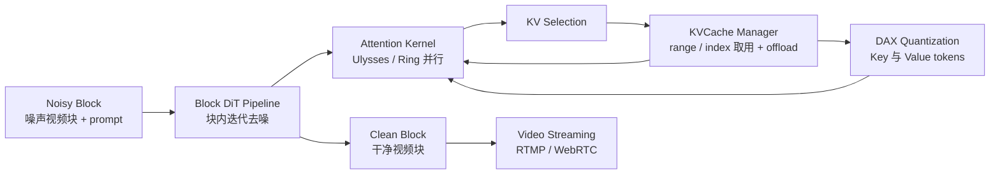
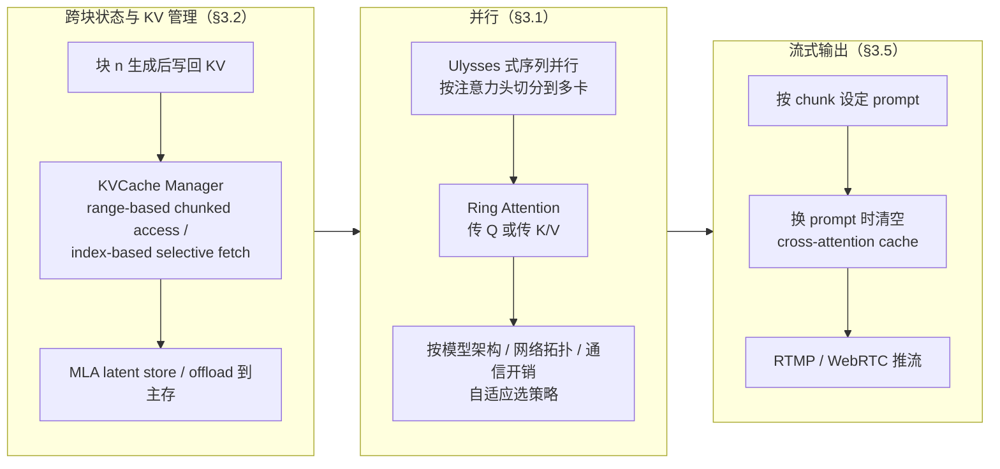

# Inferix

## 论文信息

| 项 | 值 |
|---|---|
| 标题 | Inferix: A Block-Diffusion based Next-Generation Inference Engine for World Simulation |
| 作者 / 单位 | Inferix Team（浙江大学 / 香港科技大学 / 阿里巴巴达摩院 / 阿里巴巴 TRE，见 Appendix A；论文列出 15 位 contributor） |
| venue / 年份 | arXiv 预印本；HTML 页首标注 `2511.20714v2 [cs.CV] 28 Apr 2026`，PDF 正文标注 `Date: April 30, 2026`（**版本日期口径不一致，引用需另核**） |
| arXiv | [`2511.20714`](https://arxiv.org/abs/2511.20714) |
| 代码仓库 | `https://github.com/alibaba-damo-academy/Inferix`（论文首页脚注；**本次分析未核验**，不含 README/代码级证据） |
| papers 库 | **未入本地 papers 库**（`data/papers.db` 无该条目），故按命名规范写 `papers_id: arxiv-2511.20714` |

> **素材来源性质**：本篇主源为 arXiv LaTeXML 全文 HTML（本地 `raw/sources/inferix.html`）+ 9 页 PDF（用于页码与图题定位），**未读原始仓库/代码**。训练要求、证据等级与报告口径三项引用**本仓库知识库整理**（`knowledge/视频生成训练与推理加速专题.md` §2.4「端到端系统」Inferix 行，下称「我方整理」），属二手性质，正文逐处标注。论文全文**无编号公式、无实验章节、无任何加速数字**，因此第 3 节的块级公式均标注为**我方形式化**（把论文机制写成可计算式，非论文原式）。

## 一句话总结

**Inferix = 服务 block-diffusion（半自回归）世界模拟的推理引擎**，它不发明新的去噪算法，而是把范式要求的基础设施做成一套互联组件：跨块 KV 状态怎么管、多卡怎么并行、结果怎么流式推出去。

- **范式定位**：AR 与 Diffusion 之外的第三条路——Block Diffusion，块间自回归、块内并行扩散，因此重新引入 LLM 式 KV Cache，同时保住块内高并行度（§1、Figure 1）。
- **组件清单**：高效并行策略 + 块级 KV Cache 管理 + DAX 量化 + 实时视频流式 + 细粒度视频评测（§3、Figure 2）。
- **接入面**：先把 MAGI-1 / CausVid / Self Forcing 三条 block-diffusion 管线的共享计算模式抽象成通用推理流水线，再挂接 KV Manager 与并行策略（§3.3）。
- **附带产出**：提出长视频基准 **InterVBench**（1,000 条、>50 秒）与漂移指标 **VDE**（5 个子指标）+ VBench 5 维评测协议（§4）。
- **关键缺口**：论文**未公开加速数值**——没有吞吐、延迟、显存、加速比、多卡 scaling，也没有任何模型在 InterVBench/VBench 上的成绩；唯一量化数字是 §2 的**背景成本**（Wan2.1-14B 单卡 H20 生成 5 秒视频约 6,800 秒）与 §3.4 的 profiler 开销 `< 5%`（§2、§3.4）。

> 四问速答：① 加速面 = **系统与算子**（block-diffusion 推理引擎：KV 管理、并行、流式输出）；② 训练前提 = **需要特定模型范式**（需 block-diffusion 模型，不是标准全序列 DiT 的直接加速器）；③ 证据等级 = **引擎能力/待自测**（**我方整理**口径：未公开加速数值）；④ 报告口径 = 论文**无可用加速数字，不能与其它论文比较**。

## 问题与动机

世界模拟（视频世界模型）要长时、物理合理、可交互，但视频扩散的推理成本极高：论文给出的背景数字是**单张 NVIDIA H20 生成一段 5 秒的 Wan2.1 14B 视频约需 6,800 秒**（§2，论文自述、分辨率与基线口径均未披露）。这个数字的作用是**论证「为什么需要推理引擎」**，**不是 Inferix 的加速前基线**，全文也没有对应的加速后数字。

论文把矛盾拆成三层：

1. **计算侧**：自注意力随时空 token 平方增长，每步都要完整前向，于是量化、稀疏注意力、减步数、冗余缓存、分布式计算都被列为「需要引入世界模拟推理」的候选手段（§2，方法清单，**不等于 Inferix 已全部实现**）。
2. **存储侧**：block diffusion 每个块去噪时都要读**此前所有块**的全局 KV Cache，KV 显存随块数线性增长，成为**存储瓶颈**（§2）。论文主张把 LLM 推理的技术（PageAttention、offload、KV Cache compression）迁移过来。
3. **质量侧**：长视频会出现 **drifting / forgetting**（质量随时间退化），跨块 KV 上下文正是缓解手段（§2）。

**已有系统的空白**：论文自比三类前作并指出都不对口——LLM 时代的 vLLM / SGLang 服务高并发文本、视觉扩散时代的 xDiT / FastVideo 服务**全序列双向注意力**扩散、后训练时代的 OpenRLHF / verl 管训练。它们都没有「块间自回归 + 块内扩散 + 跨块 KV」这一形态（§1）。

**insight**：block diffusion 介于 AR 与 diffusion 之间，它**重新引入了 KV Cache**，也**保住了块内并行**；要把它跑起来，缺的不是算法而是「跨块状态管理 + 并行策略 + 流式输出」这一层系统设施。

图 1 是全文的「选址图」，决定了 Inferix 的边界：它把中间那一列当成自己的地盘，因此**对左右两列都不承诺即插即用**。这也直接解释了后面的训练前提——Inferix 的 KV 管理与流式输出只有在「块间自回归」这条路径上才有对象可管；标准全序列 DiT（右列）没有跨块 KV，接不上这套设施。反过来，AR 那条路（左列）的块内没有扩散迭代，也不是它的服务对象。

## 方法精析

Inferix 由六个模块拼成（§3–§4）：**M1 并行 → M2 KV 管理 → M3 模型与管线抽象 → M4 profiling → M5 流式 → M6 InterVBench 评测**。以下机制均按论文原文描述，LaTeX 公式为**我方形式化**（论文无编号公式）。

### M0 推理主循环（generate-and-cache）

block diffusion 的每一步内 attention 都要读「此前所有块」的 KV；一个块生成干净后，再把它的 K/V 写回缓存，形成循环（§1、Figure 2）。这个循环可用三行式形式化：

$$
x^{(n)} \;=\; \mathrm{Dec}_{\theta}\!\left(\epsilon,\ \mathrm{KV}_{1:n-1}\right),\qquad \mathrm{KV}_{n} \;=\; \mathrm{Write}\!\left(x^{(n)}\right),\qquad \mathrm{KV}_{1:n} \;=\; \mathrm{KV}_{1:n-1} \cup \mathrm{KV}_{n}
$$

| 符号 | 含义 |
|---|---|
| $x^{(n)}$ | 第 $n$ 个干净视频块（clean block） |
| $\epsilon$ | 该块的初始噪声（noisy block tokens） |
| $\mathrm{Dec}_{\theta}$ | 块内迭代去噪（`applying diffusion within each block`） |
| $\mathrm{KV}_{1:n-1}$ | 前序所有块构成的跨块 KV 上下文（global KV Cache） |
| $\mathrm{Write}(\cdot)$ | 把新生成块的 K/V 写回缓存 |
| $\mathrm{KV}_{1:n}$ | 累积到第 $n$ 块的完整 KV 集合 |

**解释**：这句话的工程含义是「显存与状态随块数单调增长，而计算可以按块流水」。之所以能生成任意长度视频，是因为第 $n$ 块的输入始终只有 $\epsilon$ 与 $\mathrm{KV}_{1:n-1}$ 两项，视频长度只体现在 KV 集合的大小上——这正是 Inferix 全部系统设计（KV 管理、offload、并行）要服务的对象。

### M1 并行（§3.1）：摊薄注意力与显存

- **Ulysses 式序列并行**：把独立注意力头切到多张卡上，在保持计算效率的同时降低单卡显存。
- **Ring Attention**：在环形拓扑上分布注意力，可**传 query 或传 K/V**，两种选择对应不同性能画像。
- **自适应选择**：按「模型架构 / 网络拓扑 / 通信开销」三条依据在策略间选择（§3.1）。

### M2 块级 KV 管理（§3.2）：论文的主战场

统一 KV 管理接口 + `block-wise KV memory management`，提供两种取用方式——**range-based chunked access**（按区间批量取）与 **index-based selective fetch**（按索引选择性取），并支持 **MLA 的 latent store**（缓存 latent 而非直接缓存 K/V）与 **offload 到主存**（§3.2）。它的目标是给「未来需要 sliding-window + 选择性全局依赖」的模型留扩展性（§3.2 原文措辞）。

KV 显存的规模可形式化为：

$$
M_{\mathrm{KV}}(N) \;=\; 2\,L\,H\,d_{h}\,T_{\mathrm{blk}}\,b\,\cdot N
$$

| 符号 | 含义 |
|---|---|
| $N$ | 已生成的块数 |
| $T_{\mathrm{blk}}$ | 每块 token 数（块大小口径**未披露**） |
| $L$ | 模型层数 |
| $H$ | 注意力头数 |
| $d_{h}$ | 单头维度 |
| $b$ | 每个缓存元素的字节数（与是否走 DAX 量化相关） |
| 系数 $2$ | K 与 V 两份 |

**解释**：$M_{\mathrm{KV}}$ 对 $N$ 是**线性**的——不像全序列注意力的计算是平方关系，这里的压力落在**存储**。所以 Inferix 的存储侧手段（选择性取用、MLA latent store、offload、量化）的目标都是压 $M_{\mathrm{KV}}$ 或把它挪出显存，而**不是**减少去噪步数。论文只描述这些能力，**未给出任何显存收益数字**。

### M3 模型与管线抽象（§3.3）

先把支持模型的共享计算模式抽象成通用推理流水线，再挂 KV Manager 与并行策略，从而「用户可用这些抽象与接口接入自己的模型」（§3.3）。当前支持三条管线：

- **MAGI-1**：从零训练、基础设施不同。
- **CausVid** / **Self Forcing**：建在 **Wan2.1**（一个 5 秒、全注意力的基座扩散视频模型）之上。

**论文未展开** CausVid / Self Forcing 从 Wan2.1 转成块扩散的训练配方，也没说 Inferix 是否包含该转换训练——「把全注意力扩散微调成 semi-AR」「蒸馏到少步」都排在 §5 路线图里，属**当前版本未提供**。

### M4 系统 profiling（§3.4）

两个入口：Python **decorator**（函数级）与 **context manager**（块级）；自定义指标通过轻量 hooks/callbacks 内联执行。论文声称全量 profile 开销 **`< 5%`**（HTML 原文 `5\%`，§3.4）——**未披露**测量环境、模型、硬件与比较基线。

### M5 视频流式与连续提示（§3.5）

长视频不同 chunk 可用**不同 prompt**（continuous prompt）；若新 chunk 换了 prompt，就**清空 cross-attention cache** 以消除前序 prompt 的影响（§3.5）。输出侧支持 **RTMP / WebRTC** 两种流协议（§1 特性列表）。论文把流式列为「basic capabilities」，**未给首块延迟、块粒度或 chunk 长度**。

### M6 InterVBench 与 VDE（§4）

- **数据**：从 DanceTrack(66)、GOT-10k(272)、HD-VILA-100M(117)、ShareGPT4V(545) 里筛「高分辨率且时长超过 50 秒」的片段，合成 **1,000 条**长视频（Table 1）；类别分布 Humans 67% / Animals 17% / Environment 16%。
- **标注**：GPT-4o 作 data engine，每 2–3 秒生成一条细粒度 caption（提示模板见 §4.3）；三级 human-in-the-loop（data sourcing / chunk segmentation / caption verification），每级 ≥2 名独立标注者；数据按 **80/20 train–eval** 划分。
- **指标**：**VDE**（Video Drift Error，受 MAPE/Weighted MAPE 启发）5 项——Clarity / Motion / Aesthetic / Background / Subject，**越低越好**；**VBench** 5 维——Subject Consistency / Background Consistency / Motion Smoothness / Aesthetic Quality / Image Quality，**越高越好**（HTML 中 5 处 `\uparrow`）。

**VDE 与所有子指标只有文字定义、没有任何公式**（论文无编号公式），也**未报告任何模型在这些指标上的数值**。

图 2 要按「哪块是已实现的机制、哪块是集成/引用」分开读：**KV Manager、KV Selection、并行、流式**对应 §3.1/§3.2/§3.5 有正文小节，属论文明确描述的能力；**DAX quantization 只出现在图题与参考文献 [1]**，正文 §3 没有对应小节，位宽、作用算子、精度损失**全部未披露**（§2 提到的 PageAttention / KV Cache compression 也只是「需要引入」的清单，是否落地未明确）；**CP = 4** 是图中示例值，是否对应实测配置、对应几张卡**未说明**。因此这张图是**能力地图，不是性能结果**。

### 引擎侧延迟的形式化（我方整理，用于对照论文空白）

论文未给任何延迟量值，但机制决定了本地自测该测什么量。设单块去噪步数为 $S$，稳态每块延迟与端到端延迟可写为：

$$
T_{\mathrm{chunk}} \;\approx\; \frac{t_{\mathrm{attn}}}{P_{\mathrm{cp}}} \;+\; t_{\mathrm{base}},\qquad T_{\mathrm{first}} \;=\; S\,t_{\mathrm{step}} + t_{\mathrm{vae}},\qquad T_{\mathrm{E2E}} \;=\; T_{\mathrm{first}} + (N-1)\,T_{\mathrm{chunk}}
$$

| 符号 | 含义 |
|---|---|
| $t_{\mathrm{attn}}$ | 单块注意力耗时（含读跨块 KV） |
| $P_{\mathrm{cp}}$ | 上下文并行度（Figure 2 示例 `CP = 4`；**实际取值未披露**） |
| $t_{\mathrm{base}}$ | 单块的非注意力层、量化/取用开销等 |
| $S$ | 单块去噪步数（**未披露**） |
| $t_{\mathrm{step}}$ | 单步耗时（**未披露**） |
| $t_{\mathrm{vae}}$ | 编解码耗时（**未披露**，且不在这套引擎的加速范围内） |
| $T_{\mathrm{first}}$ | 首块（首帧可播）延迟——流式体验的真正门槛 |
| $T_{\mathrm{E2E}}$ | 端到端总延迟（$N$ 块） |

**解释**：这个式子说明两件事——① 并行（$P_{\mathrm{cp}}$）只摊薄注意力项，KV 管理与流式并不改变 $t_{\mathrm{step}}$ 与 $t_{\mathrm{vae}}$；② **首块延迟与稳态吞吐是两个不同的 KPI**，论文对流式只给了协议名，两者都**未披露**。要判断 Inferix 对数字人是否有用，必须先自测 $T_{\mathrm{first}}$ 与 $T_{\mathrm{chunk}}$，而不是等论文给倍数。

## 训练与实现细节

论文是**推理引擎**设计报告，**通篇没有训练流程**：不改权重、不需要训练的机制描述。下表分两组如实登记——(a) 引擎侧实现参数、(b) InterVBench 数据构造参数。

| 项 | 值 | 披露状态 |
|---|---|---|
| 数据集（引擎侧） | 无（推理引擎不改权重） | 不适用 |
| 数据规模 | — | 不适用 |
| 预处理 | — | 不适用 |
| 模型初始化 | 接入已有的 MAGI-1 / CausVid / Self Forcing | 已披露（模型版本、参数量、权重来源**未披露**） |
| batch size | — | 未披露 |
| 学习率 / 调度 | — | 不适用 |
| 优化器 | — | 不适用 |
| 训练轮数 / 步数 | — | 不适用（`Diffusion → Semi-AR` 微调与少步蒸馏在 §5 路线图，**当前未提供**） |
| 硬件 / 成本 | 引擎实测配置**未披露**；文中唯一硬件是 §2 背景例子的**单卡 NVIDIA H20** | 未披露 |
| 随机种子 / 复现设置 | — | 未披露 |
| 块大小 / 去噪步数 / 每块帧数 | — | 未披露 |
| 并行配置（卡数 / 互联 / 拓扑 / CP） | 设计支持多卡（Ulysses / Ring Attention），图 2 示意 `CP = 4` | 未披露（仅示意） |
| profiler `< 5%` 的测量配置 | — | 未披露 |
| InterVBench 数据集 | DanceTrack / GOT-10k / HD-VILA-100M / ShareGPT4V，筛 >50 秒高分辨率片段，共 1,000 条 | 已披露（具体分辨率**未披露**） |
| InterVBench 标注 | GPT-4o data engine，每 2–3 秒一条 caption；三级人审，每级 ≥2 人；80/20 train–eval | 已披露（划分名单、评测脚本**未披露**） |

**一句话**：这不是「零训练可插拔」也不是「需要训练」——它是**服务特定范式（block-diffusion）的推理引擎**：引擎自身不改权重，但**只有 block-diffusion 模型才接得上**。

## 推理与系统链路

把第 3 节的机制按运行时顺序串起来，就是 Inferix 的引擎流程：**跨块状态与 KV 管理 → 并行 → 流式输出**。

| 阶段 | 输入 | 处理 | 输出 | 论文是否给数 |
|---|---|---|---|---|
| 跨块状态与 KV 管理 | 前序块 KV、当前块噪声 | 写入/选择性取用、MLA latent、offload | 可复用的跨块 context | 否（无显存收益数字） |
| 并行 | 长序列 attention 的 Q/K/V | Ulysses 分头、Ring 环形传递、自适应选策略 | 多卡注意力结果 | 否（无 scaling 数字） |
| 块内去噪 | 噪声块 + 跨块 KV | 块内扩散迭代（DAX 量化 KV） | 干净视频块 | 否（无延迟数字） |
| 流式输出 | 干净块 + chunk 级 prompt | 换 prompt 清 cross-attention cache | RTMP / WebRTC 流 | 否（无首块/块延迟） |
| 评测 | 长视频输出 | VDE×5 + VBench×5 | 指标 | 否（只有定义） |

**链路的关键含义**：这套流程**没有一段是「减少计算量」的算法**（不降步数、不换注意力稀疏模式），它做的是**把跨块状态管起来、把计算摊到多卡、把结果尽早推出去**。因此它带来的是「能不能跑长视频 / 能不能流式」的可行性，而非可直接写进选型表的倍率——**论文也未提供任何倍率**。

## 实验与结果

**本节的核心事实：论文没有结果章节，也没有任何方法对比表。** 全文只有两处量化数字，且都不是 Inferix 的加速结果。

| 方法 / 对象 | 指标 | 数值 | 口径 | 来源锚点 |
|---|---|---|---|---|
| （背景例子，非 Inferix）Wan2.1 14B | 生成耗时 | 约 **6,800 秒** | 生成 5 秒视频、单卡 NVIDIA H20；分辨率未披露 | §2（论文自述，**背景成本，不是加速前后基线**） |
| Inferix profiler | 性能开销 | **< 5%** | 相对「不开 profiling」；模型、硬件、分辨率、并行度均未披露 | §3.4（论文单句声称） |
| Inferix 本体 | 吞吐 / 延迟 / 显存 / 加速比 / 多卡 scaling | **无可用加速数字** | — | 全文（无表、无图、无曲线） |
| 任意模型 × InterVBench（VDE×5 + VBench×5） | 质量指标 | **无任何数值** | 只有指标定义与协议 | §4.2 |
| DAX（**我方整理**） | 端到端 | 6836s → 188s，**36.4×** | Wan2.1-T2V-14B、720p、5s、8×H20 | **仓库 benchmark** |
| TurboDiffusion（**我方整理**） | 端到端 | 4767s → 24s，**199×** | Wan2.1-14B、720p、RTX5090 | **论文已验证**（质量证据主要是视觉对比） |

**读法**：上表最后两行**只用于说明「不可横比」**，不是 Inferix 的对照结果。**论文未公开加速数值，因此 Inferix 无可用加速数字，不能与其它论文比较**——论证如下：

| 横比维度 | Inferix | DAX（我方整理） | TurboDiffusion（我方整理） |
|---|---|---|---|
| 加速数字 | **未公开** | 36.4× | 199× |
| 模型规模 | 未披露（列出 MAGI-1 / CausVid / Self Forcing 名称） | Wan2.1-T2V-14B | Wan2.1-14B |
| 分辨率 | 未披露 | 720p | 720p |
| 硬件 / 卡数 | 未披露（§2 的 H20 属背景例子） | 8×H20（**不能当单卡速度**） | RTX5090 |
| 质量口径 | VDE×5 + VBench×5 仅定义 | — | 视觉对比为主，缺 VBench/FVD 量化 |
| 证据等级 | **引擎能力/待自测** | 仓库 benchmark | 论文已验证 |

**不可横比的结论**：Inferix 一列应记「**未公开加速数值**」，任何把它写成「相比 xDiT 提速 N 倍」的说法在论文里找不到依据。**我方整理**（知识库 视频生成训练与推理加速专题 §2.4）对 Inferix 的原口径是：「**引擎能力/待自测**；不是标准全序列 DiT 的直接加速器」——本笔记原样带出，**未升格为「已验证加速倍数」**。

### 我们最该自测的量（论文空白清单）

| 待测项 | 论文状态 |
|---|---|
| 用哪个模型（MAGI-1 / CausVid / Self Forcing） | 未披露 |
| 分辨率 / 帧率 / 块大小 / 块内步数 | 未披露 |
| 卡数、互联、CP 度 | 未披露（仅示意图 CP = 4） |
| 首块延迟 $T_{\mathrm{first}}$、稳态块延迟 $T_{\mathrm{chunk}}$ | 未披露 |
| 开/关 KV 管理、开/关并行的显存峰值差异 | 未披露 |
| DAX 量化的位宽、精度损失、速度收益 | 未披露 |
| VDE×5 与 VBench×5 实测值 | 未披露（论文未报任何模型结果） |

## 相关工作与定位

| 类别 | 代表工作 | 与 Inferix 的关系 |
|---|---|---|
| LLM 推理引擎 | vLLM / SGLang | 论文自比对象之一；但它们是**高并发文本**场景，Inferix 明确区别于该赛道（§1） |
| 视觉扩散推理引擎 | xDiT / FastVideo | 服务**全序列全注意力**扩散；没有跨块 KV 概念，因此 Inferix 的设施接不上（§1） |
| 后训练框架 | OpenRLHF / verl | 管训练；Inferix 是推理侧（§1） |
| 存储侧技术（引用） | PageAttention（vLLM）、offload（FlexGen / InfiniGen）、KV 压缩（KIVI / SnapKV） | §2 列为「需要迁到世界模型推理」的技术；**Inferix 明确实现的是 offload 与 MLA latent store**，其余是否落地未明确 |
| 计算侧技术（引用） | 量化（ViDiT-Q、SVDQuant）、稀疏注意力（SparseVideoGen2、SpargeAttention）、减步数（DMD、BLADE）、冗余缓存（TeaCache 类）、分布式（PipeFusion、USP） | §2 的加速技术谱系；**是引用背景，不是 Inferix 的实现清单**（我的解释） |
| 被支持模型 | MAGI-1、CausVid、Self Forcing | Inferix 的接入对象（§3.3） |
| 系统侧同类拼图（**我方整理**） | DAX（算子与系统）、TurboDiffusion（用训练压步数） | 「互补拼图」：DAX 优化算子和系统、TurboDiffusion 训练压步数、**Inferix 服务 block-diffusion 的跨块状态和流式输出**；但不能靠叠名字直接让数字人实时（**我方整理** §2.4） |

## 局限与启发

### 论文已披露的边界（§5 路线图 / §6 future work）

论文自陈为路线图性质，明确把以下能力放在未来：**块稀疏注意力**、**Diffusion → Semi-AR 的微调**、**少步蒸馏（step distillation）**、**高并发部署**、更复杂的分布式、流式增强。也就是说当前版本**不做降步数、不做稀疏注意力**（§5、§6）。

### 论文局限 vs 我们结论

**我方未接入 Inferix**（本地推理源码矩阵无该引擎条目，且它需要 block-diffusion 权重），因此本表只记**定位与可复用点**，不给任何「本地可用」承诺：

| 维度 | 论文口径 | 我们的结论 |
|---|---|---|
| 本地是否接入 | — | **未接入**；本地无 block-diffusion 权重与训练链，仅作方法/系统参考 |
| 加速哪一段 | 系统与算子 + 缓存与记忆（并行 / KV 管理 / 流式 / 量化集成）；去噪步数在路线图 | **系统与算子**（block-diffusion 推理引擎：KV 管理、并行、流式输出）；训练前提 = **需要特定模型范式** |
| 证据等级 | 论文给出框架与能力清单 | **引擎能力/待自测**，来源 **我方整理（知识库 视频生成训练与推理加速专题 §2.4）**，口径「**未公开加速数值**」；**不得升格**为「已验证加速倍数」 |
| 评测协议 | InterVBench 1,000 条、VDE×5 + VBench×5 | **论文未报任何模型数值**；若自测需自己跑，协议可复用但结果不能反推论文 |
| 可复用点 1 | 块级 KV 管理接口（range / index 取用、MLA latent store、offload，§3.2） | **可迁移的规格**：跨块上下文应该被当作一等资源管理；对应本地长视频/流式方案的状态管理设计 |
| 可复用点 2 | 首块延迟与稳态块延迟应分开观测（§3.5 流式 + 我方形式化） | 接数字人时，**「首帧可播时间」比「总加速倍数」更关键**；这是它最有用的选型提醒 |
| 可复用点 3 | 换 prompt 清 cross-attention cache（§3.5） | 连续提示下的条件切换机制，可直接借鉴到多段脚本驱动的数字人 |
| 可复用点 4 | 自适应并行选择依据（模型架构 / 拓扑 / 通信开销，§3.1） | 本地多卡部署的选路清单；但**无论文数字支撑收益** |
| DAX 量化集成 | 仅出现在 Figure 2 图题与参考文献 | **未披露**实现细节；其「仓库 benchmark」等级来自**我方整理** §2.4，不是本文结论 |
| 分辨率 / 硬件 / 卡数 | 未披露（§2 的 H20 属背景例子） | **未披露**，无法据论文估算本地资源需求 |
| 质量指标 | VDE 与 VBench 只有定义、无公式、无数值 | **未披露**；不能声称「论文已验证指标数值」 |
| 与其它论文横比 | 无自测数字 | **无可用加速数字，不能与其它论文比较** |

### 可操作启发

1. **先问范式，再谈接入**：Inferix 只服务 block-diffusion（半自回归）模型。本地若用的是全序列 DiT 数字人基座，接它之前先要完成「Diffusion → Semi-AR」的转换训练——而这条训练链论文**没有提供**（§5 路线图）。
2. **首块延迟是一等 KPI**：数字人要求的是「说话前不能卡」，这与长视频世界模拟的吞吐目标不同；Inferix 给了流式协议（RTMP/WebRTC）与 chunk 级 prompt 机制，但**没有任何可引用的延迟数字**。
3. **引用纪律**：全文唯一可引的两个数字是 §2 的 6,800 秒（**背景成本，非 Inferix 成绩**）与 §3.4 的 `< 5%`（**未披露测量环境**）；引用时必须带上这两句限定，否则会被读成加速结果。
4. **把它当成「系统设计参考 + 自测起点」**：真正可复用的不是倍率，而是三张清单——KV 管理的取用接口、并行选路依据、流式 chunk 契约。

## 术语与符号表

| 术语 | 英文 | 含义 |
|---|---|---|
| 世界模型 | World Model | 智能体/具身/游戏的核心模拟器，要求长时、物理合理、可交互 |
| 块扩散 | Block Diffusion | 块间自回归、块内做扩散的解码范式 |
| 半自回归 | Semi-Autoregressive (Semi-AR) | Block Diffusion 的同义标签（Figure 1） |
| 扩散 Transformer | DiT | 全序列双向注意力骨干，无 KV 缓存、定长 |
| 键值缓存 | KV Cache | 前序块上下文，跨块复用；block diffusion 相对标准扩散的关键新增能力 |
| 块级 KV 内存管理 | Block-wise KV Memory Management | 统一 KV 管理接口的底层机制（§3.2） |
| 基于范围的块式取用 | Range-based Chunked Access | 按区间批量取 KV（§3.2） |
| 基于索引的选择性取用 | Index-based Selective Fetch | 按索引选择取 KV，面向滑窗 + 选择性全局依赖（§3.2） |
| 多隐向量注意力 / 隐向量存储 | MLA / Latent Store | 缓存 latent 而非直接缓存 K/V（§3.2） |
| 卸载 | Offload | 把 KV 移到主存以缓解显存压力（§2、§3.2） |
| Ulysses 式序列并行 | Ulysses-style Sequence Parallelism | 把独立注意力头切到多卡（§3.1） |
| 环形注意力 | Ring Attention | 环形拓扑上分布注意力，可传 Q 或传 K/V（§3.1） |
| 上下文并行度 | Context Parallelism (CP) | 图 2 示例 `CP = 4`（示意，非实测口径） |
| 扩散加速执行 | DAX (Diffusion Accelerated Execution) | 外部量化/加速方案，被 Inferix 列为框架组件（图题 + 参考文献，正文未展开） |
| 视频流式输出 | Video Streaming | 流式推流能力，支持 RTMP 与 WebRTC（§1、§3.5） |
| 连续提示支持 | Continuous Prompt Support | 长视频不同 chunk 用不同 prompt；换 prompt 清 cross-attention cache（§3.5） |
| 性能剖析 | Profiling | 内置资源可见性；论文称开销 `< 5%`（§3.4） |
| InterVBench | — | 本论文提出的长视频（分钟级）细粒度评测基准，1,000 条（§4） |
| 视频漂移误差 | Video Drift Error (VDE) | 衡量质量沿时间轴的相对变化；**无公式**（§4.2） |
| 漂移与遗忘 | Drifting and Forgetting | 长视频质量退化问题，跨块 KV 用于缓解（§2） |
| 全注意力基座扩散视频模型 | Full-attention Base Diffusion Video Model | 对 Wan2.1 的定性（5 秒、全注意力） |

| 符号 | 含义 |
|---|---|
| $x^{(n)}$, $\epsilon$ | 第 $n$ 个干净视频块 / 块内初始噪声 |
| $\mathrm{Dec}_{\theta}$, $\mathrm{Write}(\cdot)$ | 块内去噪算子 / 块 KV 写回 |
| $\mathrm{KV}_{1:n}$ | 累积到第 $n$ 块的跨块 KV 上下文 |
| $M_{\mathrm{KV}}(N)$ | 跨块 KV 显存规模（随块数 $N$ 线性） |
| $N$, $T_{\mathrm{blk}}$, $L$, $H$, $d_h$, $b$ | 块数 / 每块 token 数 / 层数 / 头数 / 头维 / 每元素字节（除 $N$ 外**未披露**） |
| $P_{\mathrm{cp}}$ | 上下文并行度（示意 CP = 4，**实际取值未披露**） |
| $t_{\mathrm{attn}}$, $t_{\mathrm{base}}$, $t_{\mathrm{step}}$, $t_{\mathrm{vae}}$ | 单块注意力 / 非注意力 / 单步 / 编解码耗时（均**未披露**） |
| $S$ | 单块去噪步数（**未披露**） |
| $T_{\mathrm{first}}$, $T_{\mathrm{chunk}}$, $T_{\mathrm{E2E}}$ | 首块延迟 / 稳态块延迟 / 端到端延迟（均**未披露**） |
| `5\%`, `\uparrow` | 论文仅有的两处 inline 记号：profiler 开销上界 `< 5%`；VBench 指标方向（越大越好） |

## 相关文档

- 定位来源：[[knowledge/视频生成训练与推理加速专题|视频生成训练与推理加速专题]] §2.4「端到端系统」（**我方整理**：block-diffusion 推理引擎、KV 管理、并行、流式输出；需 block-diffusion 模型；未公开加速数值；引擎能力/待自测）
- 方向总纲：[[数字人概述/数字人加速|数字人加速]]「并行与推理引擎」（已点名 DAX / Inferix / TurboDiffusion，链接待回补）
- 工程落点：[[数字人概述/工程设计|工程设计]]
- 同类拼图：TurboDiffusion、DAX（同属「端到端系统」一档，本篇写作时二者笔记尚未落盘，登记见 [[论文笔记/README|论文笔记]] 清单；口径不同**不可横比**）
- 篇目与索引：[[论文笔记/README|论文笔记]]（本篇属「生成侧加速十篇」，papers 库未入库，仅登记 arXiv）
