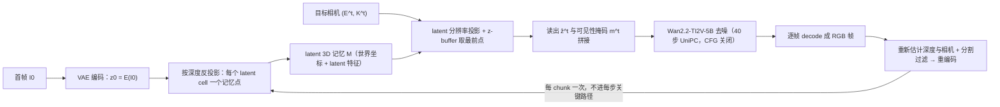

# Latent Spatial Memory

## 论文信息

| 项 | 值 |
|---|---|
| 标题 | Latent Spatial Memory for Video World Models |
| 系统名 | **LSM-World**（论文对其方法的简称） |
| 一句话定位 | 把持久 3D 空间记忆从 RGB 点云搬到 diffusion latent 空间 |
| 作者 / 单位 | 作者：Weijie Wang、Haoyu Zhao、Yifan Yang、Feng Chen、Zeyu Zhang、Yefei He、Zicheng Duan、Donny Y. Chen、Yuqing Yang、Bohan Zhuang（取自 arXiv 元信息）；单位：浙江大学、Microsoft Research、Adelaide University、Monash University（取自论文首页） |
| venue / 年份 | arXiv 预印本，未见会议录用标注 |
| arXiv | `2606.09828v2 [cs.CV]`；HTML 首页标注 27 Aug 2026（同页 Date 为 June 8, 2026），License CC BY-NC-SA 4.0。时间戳按原文保留，不自行改写 |
| 项目页 | `aka.ms/latent-spatial-memory`（全文唯一的外部链接） |
| 代码仓库 | `https://github.com/microsoft/LatentSpatialMemory`（**arXiv 元信息 comment 字段给出**；论文正文未见 code/weights/release 语句） |
| papers 库 | **未入库**（本地 `data/papers.db` 无该篇）；按命名规范登记 `papers_id: arxiv-2606.09828`，与 `arxiv_id` 对齐 |
| 素材实况 | 只取到 arXiv LaTeXML HTML 全文（source tarball HTTP 406、PDF `IncompleteRead` 失败）→ 本篇所有指针为**章节号 / 公式号 / 图号 / 表号 / 算法号**，一律不写页码 |

> 来源性质提示：以下「论文明确描述」均出自 arXiv `2606.09828v2` HTML 全文；凡引用我方知识库整理处，均显式标注**我方整理**。

## 一句话总结

**它把「场景记忆」从像素空间搬进生成器的 latent 空间**：LSM-World 用 VAE latent 特征而不是 RGB 颜色构成 3D 记忆，读出时只做一次 latent 分辨率投影，于是每个 conditioning step 的 `render → VAE encode` 往返整段消失；在 Wan2.2-TI2V-5B 上报告端到端 **10.57×**、3D cache 显存 **55×** 下降（单张 H100，均相对 RGB 点云缓存管线）。

- **加速的是「缓存与记忆」这一段**：不改注意力内核（全文无 FP8 / 稀疏注意力 / 算子融合）、不改去噪步数（仍是 40 步 UniPC、CFG 关闭）、不做系统算子工程。一句话：**把「每步付费」改成「每 chunk 付费」**。
- **需要训练**：两阶段后训练（Stage 1 训 ControlNet-style side branch，Stage 2 训 rank-32 LoRA），**32×A100**；不是即插即用、不是 QAT、不是蒸馏、不是从头训练。
- **证据等级：论文已验证**（原样引用、不升格）。论文未给代码/权重，我方也未接入 → 本地复现与数字人场景适用性都属**待自测**。
- **任务边界**：相机轨迹驱动的 world model（长时 3D 一致回访），**不是**通用 talking-head / 音频驱动数字人；论文明确**不维护动态主体跨 chunk 的状态**（§6 Limitations）。

### 四问速答

| 问题 | 答案 |
|---|---|
| ① 加速哪一段成本 | **缓存与记忆**：删掉每步 `rasterise → VAE encode` 往返，把像素空间操作从 per-step 关键路径下沉到 per-chunk（式 2 → 式 5；§Introduction；§Method-Overview；§Appendix B「Cost of cache reads」） |
| ② 训练前提 | **后训练 / 轻量适配（两阶段）**：冻结 backbone 与 VAE、只训 side branch（lr `10^{-5}`）→ 冻结 side branch、只训 rank-32 LoRA（$\alpha=32$，lr `10^{-4}`），两阶段均为 flow-matching 目标；采用规模 **32×A100**、global batch 64（§4.5；§Appendix C-Training；§5.1）。训练步数 / 时长 / GPU-hours **未披露** |
| ③ 证据等级 | **论文已验证**；任务是相机轨迹 world model，**不是数字人交互**。来源 **我方整理（知识库《视频生成训练与推理加速专题》§2.2）**，原样带出、不升格；无代码 / README 证据，无仓库 benchmark |
| ④ 报告口径 | **Wan2.2-TI2V-5B**、每 chunk 33 帧 @ **704×1280**、40 步 UniPC + CFG 关闭；**效率在单张 H100 上测量**；**E2E 10.57× 与 3D cache 显存 55× 均相对 RGB 点云缓存管线**。与数字人场景（动态主体、单图/音频驱动、无相机轨迹）差异大，**不可直接横比** |

## 问题与动机

论文的动机链分三段，缺一段就会把它的加速来源读错。

**第一段：视频扩散缺显式 3D。** 主流视频扩散 / 流匹配模型在压缩 latent 空间里做去噪，把生成当作二维问题；相机大范围运动或长时程 rollout 时会出现 geometric drift 与视差违和（§2.1；§3）。

**第二段：相机可控的方法不跨步维护场景状态。** 用额外控制模块、注意力机制或 3D-aware 渲染信号做相机条件的方法，每个 clip 独立生成，**重访已见区域或轨迹超出上下文窗口时就不一致**（§2.2）。

**第三段（关键）：已有持久空间记忆把记忆存在像素空间，于是每一步都要反复付费。** 这条线把观测/生成的 RGB 帧按估计深度抬成点云、累积成持久 3D cache，每次做条件时渲染目标视角（式 1、式 2）。记忆元素带的是 RGB 颜色：

$$
\mathcal{M}_{\text{rgb}}=\{(\mathbf{p}_i,\mathbf{c}_i)\},\qquad \mathbf{p}_i\in\mathbb{R}^3,\ \mathbf{c}_i\in[0,1]^3
$$

| 符号 | 含义 |
|---|---|
| $\mathcal{M}_{\text{rgb}}$ | RGB 点云形式的持久记忆 |
| $\mathbf{p}_i$ | 第 $i$ 个记忆点的世界坐标 |
| $\mathbf{c}_i$ | 该点观测到的颜色，取值 $[0,1]^3$ |

**中文解释**：这是被替代的基线表示——记忆里存的是**颜色**；要对齐到 diffusion backbone 的输入空间，就必须先渲染成图、再过一次编码器：

$$
\hat{\mathbf{z}}^t=\mathcal{E}\left(\mathrm{Rasterise}(\mathcal{M}_{\text{rgb}};\,\mathbf{E}^t,K^t)\right)
$$

| 符号 | 含义 |
|---|---|
| $\hat{\mathbf{z}}^t$ | 第 $t$ 个 conditioning step 注入去噪器的条件 latent |
| $\mathcal{E}(\cdot)$ | VAE 编码器 |
| $\mathrm{Rasterise}(\cdot)$ | 以目标位姿做 z-buffered 投影 + shading（论文给出的定义） |
| $\mathbf{E}^t,K^t$ | 目标视角的相机位姿与外参/内参 |

**中文解释**：式 (2) 就是本文要删掉的那一步——**光栅化在像素分辨率上进行，随后还要过一次 VAE encoder**，二者都落在**每一步** conditioning 的关键路径上。论文的 pipeline profiling 显示「维护显式记忆」本身就是主要效率瓶颈（§Introduction 图 2(c)）；定量归因见 §Appendix B「Per-step timing breakdown」：在 257 帧 rollout 上，rasterisation + VAE encoder 合计占 RGB 每步成本 **>98%**，而这两项在 LSM-World 的 conditioning loop 中**完全不存在**。

**论文的关键 insight 有两层**：① 条件信号本应落在 backbone 的**原生 latent 空间**（同分辨率、同分布），绕道像素空间既贵又丢信息——RGB 三个通道能表达的场景信息远少于 backbone 自己的 $C=48$ 维 latent 特征；② 所以记忆也应当**直接以 latent 特征为元素**，读出时只需一次 latent 分辨率投影（§4.3；§5.2）。论文的消融也反过来支持这一点：把特征升采样到像素分辨率再 lift（丢失原生分布）时 Avg 掉到 **60.85**（Table 3）。

## 方法精析

图 1 给出 LSM-World 的全貌。

**怎么读这张图**：整条链路是一个只有三步的循环——① 由 $I_0$ 编码出 latent 并用深度引导的反投影建立初始 3D latent 记忆；② 对每个目标视角，在 **latent 分辨率**上把记忆投影出来当条件，送进 backbone 生成该 chunk；③ **在每个 chunk 结束后**（不是每一步）才把新生成帧解码、重新估深、重编码、反投影，扩展记忆。它同时说明了本文的成本结构：**像素空间操作只出现在 chunk 级的记忆更新里**，per-step 关键路径上只剩一次 latent 投影（§Method-Overview；§4.1）。这一步也是论文自己的原话所指——"the per-step critical path is freed of pixel-space operations"、「amortised over an entire chunk and never appears in the conditioning loop」。

**Mermaid 读法**：与 RGB 记忆管线相比，机制差别只有一处——**记忆节点存的是 latent 特征**，因此读出路径不再经过 `rasterise → VAE encode`；右侧那条标着「每 chunk 一次」的回路是像素空间往返的唯一去处（§4.4；§Appendix B）。注意去噪步数**没有变**：仍是 40 步 UniPC、CFG 关闭（§5.1；§Appendix C-Training）。

### 记忆初始化

**输入**：latent 帧、度量深度 $D$、内参 $K$、相机位姿 $\mathbf{E}$（默认由前馈重建器 DepthAnything 3 给出）。

$$
\mathcal{M}=\{(\mathbf{p}_i,\mathbf{f}_i)\},\qquad \mathbf{p}_i\in\mathbb{R}^3,\ \mathbf{f}_i\in\mathbb{R}^C
$$

| 符号 | 含义 |
|---|---|
| $\mathcal{M}$ | latent 形式的空间记忆 |
| $\mathbf{f}_i$ | 该记忆点携带的 latent 特征，$C$ 为 VAE latent 通道数（本文 $C=48$） |
| $\mathbf{p}_i$ | 记忆点的世界坐标 |

**中文解释**：与式 (1) 相比，唯一的替换是 $[0,1]^3$ 的颜色 → $\mathbb{R}^C$ 的 latent 特征。构造方式是**每个 latent cell 一个记忆元素**（不是逐像素点云）：

$$
\mathbf{p}_{uv}=\pi^{-1}(u,v,D(u,v);\,K,\mathbf{E}),\qquad \mathbf{F}_{uv}=\mathbf{z}[:,v,u]
$$

| 符号 | 含义 |
|---|---|
| $\pi^{-1}$ | 针孔反投影（细节见 §Appendix A 式 8） |
| $D,K$ | 均为**下采样到 latent 分辨率**后的深度图与内参（论文明确说明） |
| $\mathbf{z}\in\mathbb{R}^{C\times h\times w}$ | VAE encoder 输出的 latent 帧 |
| $\mathbf{F}_{uv}$ | 锚定在该 cell 的记忆特征（直接取自 encoder 输出，不额外学习） |

**中文解释**：先把深度图下采样到 latent 网格、内参按各轴 stride 比例缩放，然后对每个 cell 反投影出一个 3D 锚点，特征直接取 $z[:,v,u]$——因此记忆的采样密度 = **latent 网格密度**，空间分辨率天然比点云方案粗、显存也按比例缩小。深度下采样方式正文未给，附录定为 **bilinear**（理由：投影后空 cell 比例最低，hole rate 42.53%，Table 5）。

### 记忆读出

**读出是整篇论文的加速核心**：把记忆点投影到目标视角的 **latent** 网格，每个 cell 用 z-buffering 保留最前面的点，取其 latent 特征。

$$
i^t(u,v)=\arg\min_{i\in\Omega^t(u,v)}\left[\mathbf{E}^t\mathbf{p}_i\right]_z,\qquad \hat{\mathbf{z}}^t(u,v)=\mathbf{F}_{i^t(u,v)}
$$

| 符号 | 含义 |
|---|---|
| $\Omega^t(u,v)$ | 在目标视角下正深度投影落到 latent cell $(u,v)$ 的记忆点集（定义见 §Appendix A 式 10） |
| $[\cdot]_z$ | 取相机坐标的深度分量 |
| $i^t(u,v)$ | 该 cell 的可见记忆点（z-buffer 胜者） |
| $\hat{\mathbf{z}}^t$ | 读出的条件 latent，**直接就是 backbone 输入空间**的表示 |

**中文解释**：式 (5) 与式 (2) 的差别就是全部的加速来源——同样是「对齐到目标视角」，式 (2) 在像素分辨率上光栅化 + 重编码，式 (5) 只在 latent 网格上做一次投影 + 一次取最前点。两个工程细节值得单独记住：

1. **空 cell 零填充 + 可见性掩码**：$\Omega^t(u,v)$ 为空的 cell 填 0，同时产出二值掩码 $\mathbf{m}^t\in\{0,1\}^{h\times w}$，让去噪器区分「真没见过的区域」与「见过但特征恰好为 0 的区域」。读出的 $\hat{\mathbf{z}}^t$ 与 $\mathbf{m}^t$ **拼接**后送入 ControlNet-style side branch，并用 segment-aware RoPE 在同一次前向里区分 noisy target / clean preceding / clean reference 帧（§4.3）。
2. **自洽性检验**：若从构造记忆的同一视角读出，式 (5) 能取回对应源视角的 token（离散化与遮挡除外）——论文用它论证读出的几何正确性（§4.3）。

**怎么读图 2**：三个面板对应本文论证链的三段。(a) 是「旧代价」——RGB 点云必须过 `render → encode` 才能变成条件，这一步**每个 conditioning step 都要做**；(b) 是「新做法」——记忆本身就是 latent，读出退化成一次投影，且 cache 体量按 $\text{stride}^2$ 缩小；(c) 是「为什么值得改」——profiling 显示显式记忆的维护是瓶颈，而不是去噪本身。把三张面板连起来读才成立：**只有先证明（c）瓶颈在记忆维护，才值得为（a）→（b）付出重训适配层的代价**。

### 记忆更新

**更新是「每 chunk 一次」的那一步**，负责让记忆随 rollout 扩张。

$$
\mathcal{M}\leftarrow\mathcal{M}\cup\{(\mathbf{p}_{uv},\mathbf{F}_{uv})\}_{(u,v)\in\Lambda^t}
$$

| 符号 | 含义 |
|---|---|
| $\Lambda^t$ | 深度有效、**且不在动态物体与天空掩码内**的 latent cell 集合 |
| $\cup$ | 并集更新（旧记忆保留，新 cell 追加） |

**中文解释**：本轮 chunk 的 latent 被反投影回记忆；关键是 $\Lambda^t$ 的过滤条件——用开放词表实体抽取器（Qwen3-VL-2B）+ 视频分割器（SAM3）检测动态主体与天空，把它们的 cell **排除在记忆之外**，避免 transient / 几何不可靠的内容污染持久记忆。这也解释了论文为什么把新 chunk 的 latent 同时当作下一 chunk 的短期时序上下文：**长期一致性交给记忆，短期连续性交给自回归上下文**。消融显示这个过滤很关键：去掉动态物体过滤 Avg 掉到 61.20，3D / 光度一致性受损最明显（Table 3）。

### 几何工具链（附录）

记忆、读出、更新共用同一套 latent 网格几何，这是「latent 空间记忆」成立的前提。像素内参按各轴 stride 比例缩放到 latent 分辨率：

$$
K^{\ell}=\mathrm{diag}(w/W,\,h/H,\,1)\,K
$$

| 符号 | 含义 |
|---|---|
| $K^{\ell}$ | latent 分辨率下的内参 |
| $W\times H$ / $w\times h$ | 像素分辨率 / latent 分辨率（本文空间 stride $s=16$） |

**中文解释**：焦距与主点按同一比例缩放，保证深度图降采样后透视投影仍然一致。反投影（式 8，针孔 ray-casting + camera-to-world）、投影到 latent 网格取整（式 9）、候选集与可并入集 $\Omega_t/\Lambda_t$ 的定义（式 10）都在 §Appendix A，此处不复制。

### 每步 vs 每 chunk 的成本边界

| 阶段 | RGB 记忆管线（基线） | LSM-World |
|---|---|---|
| 每个 conditioning step | `Rasterise`（像素分辨率）+ VAE encoder，每步都做 | 一次 latent 分辨率投影 + z-buffer（式 5） |
| 每个 chunk | 同上重复 | decode → 估深/分割 → 重编码 → 反投影（**一次**，扩展记忆） |
| 复杂度（§Appendix B） | $\Theta(N\log N+HW)+\Theta(\Phi_{\mathcal{E}}(H,W))$ | $\Theta(N\log N+hw)$ |
| cache 峰值显存比 | 基线 | 按 $s^2\cdot(3/C)$ 缩小（解析口径，非实测 55×） |

**读法**：latent cache 的复杂度里，光栅化项按 stride 平方缩小（$HW\to hw$），**每步的 VAE encoder 项整项消失**（$\Phi_{\mathcal{E}}$ 消失）。这不是「每步算得更快」，而是**每步少做一件事**；论文在 §Conclusion 把它总结为「像素空间操作被摊销到整个 chunk」。另注意 $s=16,C=48$ 时 $s^2\cdot(3/C)=16$，是逐元素的解析比值，与 55× 不可互相代入（见第 7 节口径）。

## 训练与实现细节

**本方法不可即插即用**：需要两阶段后训练把 latent 记忆的读出对齐到 backbone 特征空间（§4.5；§Appendix C-Training）。

| 阶段 | 冻结 | 训练 | 学习率 |
|---|---|---|---|
| **Stage 1** | backbone + VAE | 只训 ControlNet-style side branch（布局镜像 Wan2.2 的 VACE blocks），把 memory readout 对齐到骨干特征空间 | $10^{-5}$ |
| **Stage 2** | side branch（+backbone 除 LoRA 外） | 只训挂在 self-attention `{q,k,v,o,ffn}` 投影上的 rank-32 LoRA（$\alpha=32$） | $10^{-4}$ |

| 项 | 值 |
|---|---|
| 目标函数 | flow-matching（作用于监督目标帧） |
| 优化器与精度 | AdamW（$\beta=(0.0,0.999)$、weight decay $10^{-3}$）、bfloat16、FSDP 分片、gradient checkpointing、text-dropout 0.2 |
| 训练规模 | **32×A100**、global batch 64（§5.1） |
| 骨干 | Wan2.2-TI2V-5B；hidden 3072、FFN 14336、24 heads、30 blocks、text context 512 tokens；**VAE 全程冻结** |
| VAE / chunk | 空间 stride 16、时间 stride 4、$C=48$；每 chunk `9×44×80` latent = **33 帧 @ 704×1280**（chunk 间 1 帧重叠） |
| 数据 | RealEstate10K → 标注链路 ViPE（逐帧 depth/intrinsics/extrinsics）+ DepthAnything 3 + Qwen3-VL-2B 实体抽取 + SAM3 分割 → 掩码内 cell 排除出 $\Lambda_t$；数据预存 LMDB，**训练期不再重编码** |
| 消融依据（为什么两阶段） | 改成单阶段联合训 side branch + LoRA：Avg **70.36 → 63.18**（Table 3）——早期骨干会去适配尚未成熟的条件下信号 |
| 训练步数 / epoch / wall-clock / GPU-hours | **未披露** |
| LoRA 参数量、为何 rank 32、side branch 参数量 | **未披露** |
| RealEstate10K 训练片段数与 LMDB 体量 | **未披露** |

**一句话**：需要的是「**后训练 / 轻量适配**」——上游预训练权重可以复用，但必须重训一个 conditioning 分支 + LoRA，并准备一套带几何标注的数据引擎；这与「换个推理实现」不是一个量级的改动。

## 推理与系统链路

| 项 | 值 |
|---|---|
| 输入 | 单张首帧 $I_0$ + 用户指定的相机轨迹 $\{(\mathbf{E}_t,K_t)\}$（$\mathbf{E}_0$ 固定为世界坐标系） |
| 采样 | UniPC flow scheduler、**40 步**、**CFG 关闭**；步数与调度**未做任何压缩** |
| rollout 形式 | 仍是**串行 chunk rollout**（9 个 latent 帧 + 1 帧重叠推进），没有并行解码改造 |
| 条件注入 | 读出 $\hat{\mathbf{z}}^t$ 与可见性掩码 $\mathbf{m}^t$ 拼接 → ControlNet-style side branch；segment-aware RoPE 区分 noisy target / clean preceding / clean reference |
| 仍每 chunk 调用的开销 | DepthAnything 3 深度/位姿估计、SAM3 + Qwen3-VL 分割——**这些不在 10.57× 的覆盖范围内**（论文未披露其耗时占比） |
| 效率测量硬件 | **单张 NVIDIA H100**（**不是** 8 卡口径） |
| 质量 / 效率评测集 | WorldScore（10 项 + Average）、RealEstate10K（NVS 与 closed-loop） |

**效率口径（表下必须带的话）**：

| 指标 | 数值 | 口径 |
|---|---|---|
| 端到端视频生成加速 | **10.57×** | **相对 RGB 点云缓存管线**（论文称 "representative RGB point cloud baselines"，未点名具体实现）、matched rollout length、单张 H100；原文 Fig. 1 图题写 "up to" |
| 3D cache 显存下降 | **55×** | 明确限定为 **3D cache 自身**的峰值显存，**不是**端到端总显存 |
| 每帧 cache read 成本 | **0.25 s** | 单张 H100 跨 5 个 rollout chunk（首个 chunk 摊销一次性 setup 后）；这是 **cache read 时间，不是整帧生成时间，不能当 FPS 用** |
| cache footprint 增长 | **< 0.5 MiB / chunk** | 同上；对应右图 cache 占用曲线 |

**三条边界**：① 两个倍数都**不是**「相对无记忆 base 模型」，也**不含**深度/分割模块的开销；② **不可与其它论文横比**——DAX（8×H20、系统组合）、TurboDiffusion（RTX5090、蒸馏）、FPSAttention（H20、FP8 kernel）在模型、硬件、分辨率、任务、基线定义上全不同，不能拼成统一速度排行榜（**我方整理**知识库开篇亦明确禁止）；③ 论文**未披露**绝对延迟、FPS、单 chunk 耗时与峰值总显存（GB）。

## 实验与结果

### 主结果（WorldScore，Table 1；§5.2）

| 方法 | Avg↑ | Static↑ | Dynamic↑ | Camera Ctrl↑ | Content Align↑ | 3D Const↑ | Photo Const↑ | Style Const↑ |
|---|---|---|---|---|---|---|---|---|
| Spatia | 69.73 | 72.63 | 66.82 | **75.66** | **69.95** | 86.40 | 89.10 | 80.09 |
| Voyager | 66.08 | 77.62 | 54.53 | 85.95 | 68.92 | 81.56 | 85.99 | 84.89 |
| **LSM-World（本文）** | **70.36** | 73.60 | **67.11** | 55.36 | 42.09 | **92.21** | **93.95** | **96.91** |

**读法**：Avg 全表最高（次高 Spatia 69.73），且 3D / 光度 / 风格一致性三项第一——这与「把 latent 特征当记忆条件」的主张一致。**但必须同时指出 Camera Ctrl 55.36 明显低于 Spatia 75.66 与 Voyager 85.95、Content Align 42.09 偏低**，论文只强调 dynamic 分区与一致性领先，未解释相机跟随为何走低。不能只挑 Avg 说「全面 SOTA」。

### 主结果（RealEstate10K，Table 2；§5.2）

| 方法 | PSNR↑ | SSIM↑ | LPIPS↓ | PSNR_C↑ | SSIM_C↑ | LPIPS_C↓ |
|---|---|---|---|---|---|---|
| ViewCrafter | 15.78 | 0.580 | 0.396 | 14.79 | 0.481 | 0.365 |
| Voyager | 17.79 | 0.636 | 0.297 | 17.66 | 0.540 | 0.380 |
| Spatia | **18.58** | 0.646 | **0.254** | 19.38 | 0.579 | **0.213** |
| **LSM-World（本文）** | 18.38 | **0.779** | 0.250 | **20.05** | **0.825** | 0.228 |

**读法**：NVS 上取得**最优 SSIM / LPIPS**，PSNR 18.38 略低于 Spatia 18.58（第二）；closed-loop（带下标 C，相机回到起点的首末帧一致性，协议继承 Spatia）上 **PSNR_C / SSIM_C 最优**，LPIPS_C 0.228 为第二（Spatia 0.213）。论文把增益归因于两点：读出条件与 backbone 原生 latent **同分辨率同分布**，以及动态物体过滤抑制 drift。

**怎么读图 3**：闭环（closed-loop）测的是「绕一圈回到起点后还记不记得原来长什么样」——这是持久空间记忆最直接的裁判，也是 RGB 点云管线最容易累积漂移的地方。左侧/右侧分别是回到起点后的末帧与原始输入帧的对比，LSM-World 的末帧仍与首帧一致，对应表中 PSNR_C 20.05 / SSIM_C 0.825；RGB 点云类基线则在长轨迹后出现纹理拉伸与结构漂移（另见 §5.2 与 Fig. 5 open-domain、Fig. 7 的逐帧对比）。**注意这张图只证明「相机轨迹下的回访一致性」，不涉及任何动态主体一致性**——后者恰是本文主动放弃的部分（§6）。

### 效率与消融

| 实验 | 配置 | 结果 |
|---|---|---|
| 效率（Fig. 6 + §5.2 Efficiency） | 单张 H100、5 个 rollout chunk | E2E **10.57×**、3D cache 显存 **55×** 下降、cache read **0.25 s/帧**、footprint **<0.5 MiB/chunk** |
| 换回 RGB 点云（Table 3） | backbone 与训练配方不变，只换记忆表示 | Avg 70.36 → **67.71**（3D Cons 92.21 → 90.75） |
| 特征升采样到像素分辨率再 lift（Table 3） | 破坏 latent 原生分布 | Avg **60.85**（降幅最大） |
| 去掉动态物体/天空过滤（Table 3） | — | Avg **61.20**，3D/光度一致性受损最明显（陈旧动态内容被 splat 回未来 chunk） |
| 单阶段联合训练（Table 3） | side branch + LoRA 一起训 | Avg **63.18** |
| 深度源敏感性（Table 4） | DepthAnything 3（默认）/ MapAnything / UniDepth | Avg 70.36 / 69.66 / 69.13 |
| 深度下采样（Table 5） | bilinear / nearest / area / median | hole rate 42.53% / 47.78% / 53.72% / 52.22% |
| 人体盲测（§Appendix C.1 + Fig. 8） | 目标 25 名评分者、30 个场景，每 clip ≥5 次评分，0–5 分 | 回访一致性 **4.6**、相机跟随 4.3、外观保真 4.1、时序平滑 4.3、整体质量 4.2（**各基线分数未披露**，只给「五项均最高」） |

**两处需要注意的读法**：① **默认 bilinear 下仍有 42.53% 的 latent cell 投影为空**（零填充 + 掩码标为 unseen），论文未量化这部分对质量的影响；② 深度源敏感性说明收益**不依赖特定重建器**（side branch 把投影 cache 当**软几何提示**而非硬约束），但**分割误差的敏感性未做**——而分割恰恰决定哪些动态内容不进记忆。

## 相关工作与定位

| 类别 | 代表工作 | 与本文的关系 |
|---|---|---|
| 视频扩散（§2.1） | 主流视频 DiT / 流匹配模型 | 在压缩 latent 去噪，但**把生成当二维问题**，缺显式 3D 几何 → 大相机运动与长时程漂移 |
| 相机可控生成（§2.2） | 控制模块、注意力条件、3D-aware 渲染信号一类 | **不跨生成步维护持久场景表示**，每个 clip 独立生成 → 重访不一致 |
| 视频生成的空间记忆（§2.3） | Spatia（最直接竞品）、Voyager、WonderWorld、WonderJourney、InvisibleStitch、FlexWorld；view-memory 类的 VMem / SEVA | 已有空间记忆**全在 RGB 像素空间**，计算密集且对反复 encode-decode 的累积误差脆弱——本文把记忆表示换成 latent，是同一机制里换「存储空间」的一次改造 |
| 通用视频基座 | Wan2.1、CogVideoX-I2V、LTX-Video 等 | 与本文不同轴：本文**不是更强的生成器**，而是给 Wan2.2-TI2V-5B 外挂空间记忆条件 |
| 我方整理中的位置 | 《视频生成训练与推理加速专题》§2.2「长视频缓存：避免重复记忆和重复编码」 | 与 WorldAttention HKV 并列；原文记「直接把 3D 记忆存为 diffusion latent，避免每步 render→encode 往返」（**我方整理**） |

**归属判断**：它属「**缓存与记忆**」栏，**不属于**注意力/内核（无 FP8/稀疏/QAT）、**不属于**自回归并行（无步数压缩、无并行解码）、**不属于**端到端系统层（无 kernel / 量化 / compile / 序列并行改造）。这也是与同组 [[论文笔记/fpsattention|FPSAttention]]、BLADE 的根本差别：那两篇把加速约束放回训练阶段去改**每步的算力**，本篇改的是**每步要不要做那件事**。

## 局限与启发

### 论文自陈的局限（§6 Limitations and future work）

1. **不维护动态主体的状态**：动态物体被显式排除出持久记忆，所以**跨 chunk 的动态一致性不被保证**；运动普遍（pervasive motion）的场景收益会下降。
2. 记忆更新依赖 DepthAnything 3 与 SAM3 的估计结果，**误差会进入记忆**（论文只在 Table 4 做了深度源敏感性，未量化分割误差）。
3. 只验证 Wan2.2-TI2V-5B 一个 backbone；跨 backbone / 跨 VAE 的适用性未验证。

### 论文局限 vs 我们结论

**我方未接入 LSM-World**（无代码/权重，本地也没有相机轨迹 world model 的链），因此本表只记**定位与可复用点**，不给任何「本地可用」的承诺：

| 维度 | 论文口径 | 我们的结论 |
|---|---|---|
| 本地是否接入 | — | **未接入**；无权重、无训练链，只作方法参考 |
| 证据等级 | 论文自证：主表 + 消融 + 效率图（单 H100）+ 人体盲测 | **论文已验证**，来源**我方整理（知识库《视频生成训练与推理加速专题》§2.2）**，原样带出；论文**未给代码/仓库**，**不能升格为「代码或 README 证据」** |
| 本地复现 | 未提供代码与复现脚本 | **待自测**；训练步数 / 时长 / GPU-hours **未披露**，无法估本地成本，也不能对齐 10.57× |
| 任务形态边界 | 输入是单图 + 相机轨迹；评测是 WorldScore / RealEstate10K 的 NVS 与回访一致性 | **相机轨迹世界模型 ≠ 交互式数字人**：本文没有音频条件、没有口型/身份指标、没有交互时延口径；两边的加速倍数**不可互推** |
| 动态主体处理 | 动态物体**主动排除**出持久记忆，不保证跨 chunk 动态一致（§6） | 对以持续人形运动为主体的 talking-head 场景是**结构性不利**——恰好是数字人最需要的「跨 chunk 主体一致性」被放弃 |
| 可复用点 1 | 条件信号落在 backbone 原生 latent 空间（Table 3 的 Feature Upsample 崩到 60.85 是反例） | **「同分辨率同分布」原则**可直接搬到我们的 latent 条件注入类改动上：把条件升采样/变换到别的空间，往往比不过留在原生空间 |
| 可复用点 2 | 把像素操作从 per-step 下沉到 per-chunk（§Method-Overview；§Conclusion） | 与我们「减少 CPU↔GPU / 编解码往返」的工程经验同构，但本文是在**表示层**改，不是 runtime 层优化——可迁移的是「先问这一步是否每步都必须做」 |
| 可复用点 3 | 可见性掩码区分「未观测」与「特征为 0」 | 任何用零填充做条件的地方都可借鉴：**把「未知」显式告诉模型**，避免歧义 |
| 可复用点 4 | segment-aware RoPE 在同一次前向里区分 noisy target / clean preceding / clean reference | 与我们在自回归/流式生成里「用位置编码区分帧角色」的做法同源 |

**未披露清单（不得替论文补全）**：训练步数/时长/GPU-hours、LoRA 以外超参选择理由、side branch 参数量、RGB 基线的具体实现与绝对延迟、分割误差敏感性、跨 backbone 结果、代码/权重/许可证。

### 可操作启发

1. **先问「每步都在做的事是否必须每步做」**。本文的收益不来自更快的算子，而来自把一次像素空间往返摊到 chunk 级；做加速选型时这是比「换 attention 实现」更早该问的问题。
2. **表示层改造要连带训练成本一起算**。10.57× 的代价是两阶段后训练（32×A100）+ 一套几何标注数据引擎；只有上游权重、没有微调入口时，这条路走不通。
3. **别把它读成数字人加速方案**。它是相机轨迹 world model；对我们的 talking-head 主场景，动态主体一致性才是难点，而本文把它排除在记忆之外——可以借鉴机制（latent 记忆 + 掩码读出），不能借鉴结论。
4. **引用倍数必须带口径**：「10.57× 是相对 RGB 点云缓存、单 H100、704×1280、33 帧/chunk；55× 仅指 3D cache 显存」，并声明不可与 DAX / TurboDiffusion / FPSAttention 等横比。

## 术语与符号表

| 术语 | 英文 | 含义 |
|---|---|---|
| latent 空间记忆 | latent spatial memory | 以「世界坐标 + latent 特征」为元素的持久 3D 记忆，替代 RGB 点云 |
| 光栅化 | rasterise | 以目标位姿把点云投影成像素图（含 z-buffer 与 shading），RGB 记忆方案的每步开销来源 |
| z-buffer 读出 | z-buffered readout | 每个目标 cell 只保留投影中最靠前的记忆点，取其 latent 特征 |
| 可见性掩码 | visibility mask $\mathbf{m}^t$ | 标记哪些 cell 有真实观测，区分「未观测」与「特征为 0」 |
| 侧分支 | ControlNet-style side branch | 承载记忆条件的控制分支，布局镜像 Wan2.2 的 VACE blocks |
| 分段感知旋转编码 | segment-aware RoPE | 在同一次前向里区分 noisy target / clean preceding / clean reference 帧 |
| 记忆抬升 | lift / depth-guided back-projection | 用深度把 latent 升维到 3D 记忆锚点 |
| 空 cell 比例 | hole rate | 投影后无记忆点的 latent cell 占比（默认 bilinear：42.53%） |
| 闭环回访 | closed-loop revisit | 相机轨迹绕回起点，比较首帧与末帧一致性（协议继承 Spatia） |
| 流匹配 | flow matching | 本文两阶段训练的目标函数 |
| 动态物体过滤 | dynamic object filter | 用实体抽取 + 视频分割把动态主体与天空排除出记忆 |
| LMDB | Lightning Memory-Mapped Database | 训练数据存储格式（帧/latent/深度/相机参数预存，训练期不重编码） |

| 符号 | 含义 |
|---|---|
| $\mathcal{M}_{\text{rgb}}$ / $\mathcal{M}$ | RGB 点云记忆（基线）/ latent 空间记忆（本文） |
| $\mathbf{p}_i$ | 记忆点的世界坐标 |
| $\mathbf{c}_i$ / $\mathbf{f}_i$ | 记忆元素的颜色（$[0,1]^3$）/ latent 特征（$\mathbb{R}^C$） |
| $\mathbf{z}$ | VAE latent 帧，$\mathbb{R}^{C\times h\times w}$ |
| $C$ / $s$ | latent 通道数（48）/ 空间 stride（16） |
| $H,W$ / $h,w$ | 像素分辨率 / latent 分辨率 |
| $\mathbf{E}^t$ / $K^t$ | 目标视角的相机位姿 / 内参 |
| $D$ | 度量深度图（在下采样后按 latent 网格使用） |
| $\Omega^t(u,v)$ | 投影落在目标 cell $(u,v)$ 的记忆点集 |
| $\Lambda^t$ | 可并入记忆的 latent cell 集（深度有效、非动态物体、非天空） |
| $\hat{\mathbf{z}}^t$ | 读出的条件 latent（供 backbone 使用） |
| $\Phi_{\mathcal{E}}(H,W)$ | 一次 VAE encoder 前向的 FLOP 数（§Appendix B 复杂度） |

**六条口径易错**：① 加速段是**缓存与记忆**，不是注意力内核、不是步数（仍 40 步）；② **10.57× 是 E2E 相对 RGB 点云缓存管线**，基线未点名，**不是**相对无记忆 base；③ **55× 仅指 3D cache 显存**，不是总显存；④ **0.25 s 是 cache read 时间**，不是单帧生成时间，不能当 FPS；⑤ 证据等级是**论文已验证**，无代码/仓库证据，本地复现属待自测；⑥ 这是**相机轨迹 world model**，动态主体一致性不保证，与 talking-head 数字人不可横比。

## 相关文档

- 加速专题与定位：[[knowledge/视频生成训练与推理加速专题|视频生成训练与推理加速专题]]（§2.2 长视频缓存）、[[数字人概述/数字人加速|数字人加速]]
- 同组（生成侧加速十篇）：[[论文笔记/fpsattention|FPSAttention 模型笔记]]（FP8 × 稀疏，改每步算力）、[[论文笔记/blade|BLADE 模型笔记]]（块稀疏 × 步数蒸馏，需蒸馏）
- 方法对照（记忆/长时一致性路线）：[[论文笔记/ditto|Ditto 模型笔记]]（换生成空间）、[[论文笔记/liveact|SoulX-LiveAct 模型笔记]]（长时自回归生成）
- 素材与分析：`.cache/article-note/latent-spatial-memory/analysis/`（methodology / experiment / terminology / image-collection）、`management/docs/_assets/latent-spatial-memory/`（3 张 WebP）
