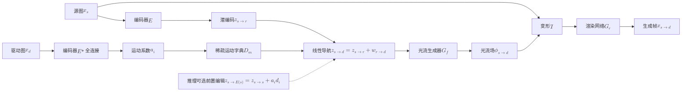

# lia-x

## 论文信息

| 项 | 值 |
|---|---|
| 标题 | LIA-X: Interpretable Latent Portrait Animator |
| 作者 | Yaohui Wang、Di Yang、Xinyuan Chen、François Brémond、Yu Qiao、Antitza Dantcheva |
| 单位 | Shanghai Artificial Intelligence Laboratory；Inria, Université Côte d'Azur |
| venue / 年份 | 未声明会议（arXiv 预印本，本稿不代标会议） |
| arXiv | `2508.09959v1`（`[cs.CV]`） |
| 项目页 | https://wyhsirius.github.io/LIA-X-project/ |
| 代码仓库 | 未见代码仓库（正文与页首均无代码/权重的开源声明） |
| papers 库 | `arxiv-2508.09959` |

> **命名易混提示**：本篇 LIA-X 是 LIA（Latent Image Animator，[48]/[45]）的放大与稀疏化版本，二者共享同一套 autoencoder + 线性导航骨架；论文 Eq. (1)–(8) 是 LIA 的既有推导，**只有 Eq. (9)–(11) 是本文新增**。读公式时不要把 Preliminary 部分当成本文贡献。

## 一句话总结

**不生成像素、也不生成显式结构，只在潜空间里给 motion code 做「线性导航」，再用一个稀疏运动字典把运动解耦成可解释因子——于是动画之前可以先「编辑」源图，把 warp-render 升级成 edit-warp-render。**

- **运动 = 线性导航**：$z_{s\to d}=z_{s\to r}+w_{r\to d}$，位移 $w_{r\to d}$ 是字典向量的线性组合 $w_{r\to d}=\sum_i a_i\mathbf{d_i}$（论文 Eq. (1)–(3)）。
- **稀疏 → 可解释**：对运动系数加 $L_1$ 稀疏惩罚 $\lambda_2 S(\mathcal{A}_{r\to d})$（论文 Eq. (9)），迫使每帧只用少数向量重构；论文称激活的向量几乎都对应人能理解的语义（嘴、眉、眼、pout、smile、yaw/pitch/roll）。
- **可解释 → 可编辑**：推理前用 $z_{s\to\mathcal{E}(s)}=z_{s\to s}+a_i\mathbf{d_i}$（论文 Eq. (11)）单向量扰动源图，把姿态/表情对齐到驱动首帧，再迁移运动（论文 Eq. (10)）——即 edit-warp-render。
- **规模**：受 StyleGAN-T 启发的残差块，最大约 **1 billion** 参数，**8×A100** 训练；训练数据约 0.5M 序列 / 约 94M 帧 / 55,000 身份。
- **结果**：跨重演（无 GT）以 ID Similarity **0.206**（↓）、Image Quality **58.74**（↑）两项最优；自重现多数指标最优，但 VoxCelebHQ-256 的 FID 10.74 高于 DaGAN 的 9.13（见下文事实核对）。

## 问题与动机

论文把「人像动画」当作一个从驱动视频向源图迁移面部动态的 domain-specific video generation 任务。已有路线的两难：

1. **显式结构路线依赖现成提取器**。用人脸关键点、3DMM、光流、dense pose 当运动引导，生成质量被外部的特征提取器性能绑死；LIA-X 选择**不用任何显式结构表示**的自监督 autoencoder。
2. **自监督结构表示不缺，但不可编辑**。关键点、motion region、depth map 这类自监督学出的结构，本质仍是「生成中介」，没有对用户暴露可控的手柄；要改源图姿态/表情只能重新生成。
3. **warp-render 类方法有一条硬要求**：源图与驱动首帧的头姿和表情要接近，最好是正面姿态 + 中性表情，否则质量骤降。这条要求在很多真实应用里满足不了，而论文指出**已有方法普遍缺少「把源图与驱动首帧对齐」的机制**。

LIA 的 motion dictionary 其实已有一定语义，但论文自述其**难以解耦、单个向量内部多个语义纠缠**，无法用做可控编辑。作者由此借用稀疏字典编码（sparse dictionary coding）的思想，把字典稀疏化——**这是本文的核心 insight：只要让每帧只激活少数运动向量，向量就会被迫承载可辨认、可单独操控的语义，运动迁移就从「黑盒 warp-render」变成「先编辑、再迁移」。**

## 方法精析

整体链路：**源图 → 潜编码；驱动图 → 运动系数 → 稀疏字典线性组合 → 线性导航 → 光流 → warp → render**；推理阶段可选地在最前面插入「编辑源图」一步。

从这张总览图能读出方法的三个骨架：**编码器 $E$**（源图与驱动图共用）、**生成器 $G$**（拆成光流生成器 $G_f$ 与渲染网络 $G_r$）、以及训练目标侧的**稀疏约束**。它支撑的是「自监督 + 稀疏约束 → 可解释运动字典」这条主结论：整条通路没有任何显式结构分支，唯一被要求「可解释」的地方就是字典 $D_m$。

### 表示：潜空间里的线性导航

运动迁移被写成 latent space 中一条线性路径：

$$
z_{s\rightarrow d}=z_{s\rightarrow r}+w_{r\rightarrow d},\qquad
w_{r\rightarrow d}=\sum_{i=1}^{M}a_{i}\mathbf{d_{i}},\qquad
z_{s\rightarrow d}=z_{s\rightarrow r}+\sum_{i=1}^{M}a_{i}\mathbf{d_{i}}
$$

| 符号 | 含义 |
|---|---|
| $z_{s\to r}$ | 源图经编码器得到的运动编码，$E(x_s)$ |
| $w_{r\to d}$ | 从隐式参考空间到驱动表示的线性位移 |
| $\mathbf{d_i}$ | 运动字典 $D_m=\{d_1,\dots,d_M\}$ 中第 $i$ 个（正交）运动向量 |
| $a_i$ | 第 $i$ 个向量的幅度系数，集合 $\mathcal{A}_{r\to d}=\{a_1,\dots,a_M\}$ 由 $\mathcal{FC}(E(x_d))$ 给出 |
| $M$ | 字典容量（向量个数），**具体数值未披露** |
| $z_{s\to d}$ | 源→驱动方向的运动编码 |

三式分别是：定义线性导航（Eq. 1）、把位移展开成字典线性组合（Eq. 2）、以及合并后的最终形式（Eq. 3）。**关键在 Eq. (2)：只要字典向量正交且系数稀疏，「改哪个语义」就等价于「调哪个 $a_i$」**——这是后面 edit-warp-render 的全部前提。

光流与渲染沿用 LIA 的 warp-render 流程：$x_{s\to d}=G_r(\mathcal{T}(\phi_{s\to d},x_s))$，其中 $\phi_{s\to d}=G_f(z_{s\to d})$ 是（多尺度）光流场，$\mathcal{T}$ 是 warp 操作，$G_r$ 是渲染网络。与 LIA 的区别是 $E$、$G_f$、$G_r$ 都换成了受 StyleGAN-T 启发的可扩展残差块。

### 训练目标：把稀疏项加进损失

LIA 的原始目标只有重建、感知、对抗三项；LIA-X 在其后加了一项稀疏惩罚：

$$
\mathcal{L}(x_{s\rightarrow d},x_{d})=\mathcal{L}_{recon}(x_{s\rightarrow d},x_{d})+\lambda_{1}\mathcal{L}_{vgg}(x_{s\rightarrow d},x_{d})+\mathcal{L}_{adv}(x_{s\rightarrow d})+\lambda_{2}S(\mathcal{A}_{r\rightarrow d})
$$

| 符号 | 含义 |
|---|---|
| $\mathcal{L}_{recon}$ | L1 重建损失 |
| $\mathcal{L}_{vgg}$ | VGG 感知损失 |
| $\mathcal{L}_{adv}$ | $x_{s\to d}$ 与 $x_d$ 之间的对抗损失 |
| $S(\cdot)$ | 作用于运动系数 $\mathcal{A}_{r\to d}$ 的稀疏惩罚，论文**实现为 $L_1$ 范数** |
| $\lambda_1,\lambda_2$ | 平衡系数，**具体取值未披露** |
| $\mathcal{A}_{r\to d}$ | 驱动图对应的运动系数集合 |

对照 LIA 的 Preliminary 目标（Eq. (5)）：$\mathcal{L}_{recon}+\lambda\mathcal{L}_{vgg}+\mathcal{L}_{adv}$。LIA-X 相对它的唯一改动就是末尾的 $\lambda_2 S(\mathcal{A}_{r\to d})$——**方法上的「关键单点」就是这一项**，它同时服务「少向量重构」（稀疏）和「向量承载单一语义」（解耦）两个目标。因此复现风险高度集中在 $\lambda_2$、字典规模 $M$ 与训练步数三者上，而这三者论文都未给出数值。

### 编辑与动画：把重建项换成编辑项

推理前对源图的编辑，以及编辑之后的动画，共用「基态 + 运动差分」这套结构：

$$
z_{s\rightarrow\mathcal{E}(s)}=z_{s\rightarrow s}+a_{i}\mathbf{d_{i}},\qquad
z_{s\rightarrow t}=z_{s\rightarrow\mathcal{E}(s)}+(w_{r\rightarrow t}-w_{r\rightarrow 1}),\quad t\in\{1,\dots,T\}
$$

| 符号 | 含义 |
|---|---|
| $z_{s\to s}$ | 源图自身重构出的 motion code |
| $\mathcal{E}(\cdot)$ | 对源图的编辑操作（**注意与编码器 $E$ 同字母不同字体**） |
| $z_{s\to\mathcal{E}(s)}$ | 编辑后的源编码 |
| $a_i$ | 单向量扰动幅度，论文设为 $[-0.5,0.5]$、步长 0.1 |
| $w_{r\to t}-w_{r\to 1}$ | reference 到第 $t$ 帧与到第 1 帧的**运动差分**（motion difference） |
| $T$ | 驱动序列帧数；$T$ 为帧数，与 warp 算子 $\mathcal{T}$ 同字母不同字体 |

左式（Eq. 11）是编辑：往某条语义方向 $d_i$ 上做小位移；右式（Eq. 10）是动画：把 Eq. (8) 跨重演里的重建项 $z_{s\to s}$ 直接替换成编辑项 $z_{s\to\mathcal{E}(s)}$。两式结构同构，**「warp-render → edit-warp-render」的演进在图上看就是这一个基态的替换**。论文强调这不是普通后处理——编辑发生在动画之前，作用于源图，可以与动画阶段解耦。

### 稀疏与可控的定性证据

读数只取图上最直接的一组对比：**同一段视频逐帧看运动系数 $\mathcal{A}$，无稀疏约束时每个重构都点亮近乎全部向量（缺乏选择性、语义纠缠在每个向量内部），加约束后每帧只剩少数几个活跃、其余贡献可忽略**。它支撑「稀疏约束确实提高了字典的稀疏度」这条结论。需要标注的是：论文对 $\mathcal{A}$ 的可视化用的是 $\mathcal{A}_{r\to s}$ 写法，而 Eq. (2) 只定义了 $\mathcal{A}_{r\to d}$，全文未见对 $\mathcal{A}_{r\to s}$ 的定义——**属论文原文符号不一致**，此处照录不改。

三个面板分别对应 yaw（左右转头）、pitch（俯仰）、roll（侧倾），每列只在某一语义上加大/减小 $a_i$。它支撑「单个运动向量对应可辨认的 3D 旋转语义，且不需要显式 3D 表示」这条可解释性结论。同样要点是**这是定性展示**：论文没有给出「yaw 向量 ↔ 实际旋转角」的定量标定或误差。

各行给出一个可单独操控的细粒度属性（口、眉、眼、pout、smile），每行内是同一属性的不同幅度。它支撑「除 3D 语义外，字典里还存在大量细粒度表情语义，且可**线性组合**多个操作完成复杂编辑」这条结论。前提是 $d_i$ 需由用户手工挑选、幅度人工给（$a_i\in[-0.5,0.5]$，步长 0.1）——论文未给出自动选择机制。

## 训练与实现细节

| 项 | 值 |
|---|---|
| 基础实现 | 基于原 LIA 实现构建 |
| 架构 | 编码器 $E$ + 光流生成器 $G_f$ + 渲染网络 $G_r$；$E$ 与生成器均用受 StyleGAN-T 启发的残差块 |
| 训练数据 | 4 个公开数据集（VoxCelebHQ、TalkingHead-1KH、HDTF、MEAD）+ 1 个内部数据集 |
| 数据规模 | 约 **0.5M**（50 万）talking-head 序列、约 **94M** 帧、**55,000** 个身份 |
| 最大模型规模 | 约 **1B**（10 亿）参数；消融档 0.05B / 0.3B / 0.9B |
| scaling 手段 | 增加通道数、增加 residual block 深度、使用比原 LIA 更大的 motion dictionary |
| 分辨率 | 256×256 与 512×512 两档（固定分辨率） |
| 硬件 | **8 × A100** |
| 大模型训练 | 用 gradient accumulation 增大 effective batch size |
| 稀疏惩罚实现 | $S(\cdot)$ 实现为 $L_1$ 范数 |
| 优化器 | 未披露 |
| 学习率 / 调度 / weight decay | 未披露 |
| 训练步数 / epoch / 收敛标准 | 未披露 |
| batch size / 梯度累积步数 | 未披露（仅称用于增大有效 batch） |
| 损失权重 $\lambda_1$ / $\lambda_2$ | 未披露 |
| 字典规模 $M$、向量维度 | 未披露（仅称「比原 LIA 更大」） |
| 三档模型的结构差异（block 数/通道数） | 未披露（只称三者不同） |
| 数据划分比例、预处理/对齐/裁剪、帧率、序列长度 $T$ | 未披露 |
| 训练时长 / 显存 | 未披露 |

**训练数据的可比性提醒**：训练集包含 1 个内部数据集，且各来源配比、预处理与划分比例均未披露，因此**论文的数据规模数字只能当作量级，不能当作可复现配方**。跨重演评测所用源图来自 AAHQ（论文从 HDTF 选 70 段驱动视频、每段随机取 2 张 AAHQ 图作源，共 140 段），论文未披露随机种子与重复次数。

## 推理与系统链路

推理链路与训练同构，区别只在最前面插入了可选的「编辑」阶段：

三个要点：

1. **编辑与动画解耦**。编辑只作用在源图上、发生在动画之前；同一次编辑后的源图可以反复用不同驱动视频去 animate，不必每次重跑编辑。
2. **可组合**。多个语义操作（如同时抬头 + 微笑）只是把若干 $a_i\mathbf{d_i}$ 线性叠加，因为导航本身是线性的。
3. **单向量 = 单个语义**。可编辑性完全依赖训练后字典已解耦；论文未提供自动挑选 $d_i$ 的手段，也未说明编辑幅度是否受训练分布约束（$a_i$ 越界的行为未披露）。

**与我们链路的关系（二手整理，非论文数字）**。《数字人身份》把 LIA-X 归入「外观特征 + flow-warp decoder」一类——源肖像身份特征与 40D motion code 分路注入，经 motion dictionary、ToFlow、warp 与风格调制卷积出帧（[[数字人概述/数字人身份|数字人身份]]）。在《数字人加速》里，LIA-X 渲染器被点名为 T2AV 链路的速度瓶颈与「decoder 蒸馏」现成候选，其口径为 **512²、bf16、batch=1 约 333ms/帧**——**这是我们的二手整理，不是论文披露的数字**（论文只说 autoencoder 相对 diffusion 更快，未给推理速度）。因此它的工程价值判断是：**稀疏字典带来的可解释接口对我们暂不构成直接收益，可作为加速候选的是 decoder 一侧的蒸馏**。

## 实验与结果

### 评估口径

- **自重现（self-reenactment）**：源图与驱动同身份。用 VoxCelebHQ 验证集（483 视频）与 TalkingHead-1KH 验证集（25 视频），以每段视频**首帧作源**、**整段作驱动**逐帧重构。指标 L1↓、LPIPS↓、SSIM↑、PSNR↑、FID↓。
- **跨重演（cross-reenactment）**：源图与驱动异身份，**无 ground truth**。用 HDTF 的 70 段驱动视频 × 每段 2 张 AAHQ 源图 = 140 段。指标为 Identity Similarity（生成帧与源图之间的平均 embedding 差异，**表中标 ↓，数值越低越好**）与 Image Quality（依 [33] 计算，↑）。
- **公平性**：LIA-X 分别在 256×256 与 512×512 两档训练，并与**同分辨率档**的方法比较；两档的对照集合不同（256 档为 FOMM、DaGAN、TPS、MCNet；512 档为 X-Portrait、LivePortrait、LIA）。

> **易误读提醒**：Identity Similarity 标 **↓**、语义是「embedding 差异」，与常见的「相似度越高越好」相反；另外两档方法集合不同，跨档位数字不可直接比较，定位结论应读作「各自分辨率档内最优」。

### 自重现主结果

**VoxCelebHQ**（同一表的两档，256 与 512 分列）

| 方法（分辨率档） | L1↓ | LPIPS↓ | SSIM↑ | PSNR↑ | FID↓ |
|---|---|---|---|---|---|
| FOMM [28]（256） | 0.046 | 0.27 | 0.66 | 22.40 | 12.67 |
| DaGAN [16]（256） | 0.044 | 0.110 | 0.69 | 23.04 | **9.13** |
| TPS [58]（256） | 0.043 | 0.112 | 0.70 | 23.24 | 10.82 |
| MCNet [15]（256） | 0.040 | 0.176 | 0.72 | 23.73 | 18.63 |
| **LIA-X（256）** | **0.036** | **0.095** | **0.73** | **24.82** | 10.74 |
| X-Portrait [49]（512） | 0.110 | 0.302 | 0.56 | 16.99 | 19.92 |
| LivePortrait [11]（512） | 0.087 | 0.264 | 0.67 | 17.45 | 12.90 |
| LIA [48]（512） | 0.052 | 0.211 | 0.68 | 22.14 | 21.86 |
| **LIA-X（512）** | **0.040** | **0.160** | **0.75** | **24.39** | **12.50** |

**TalkingHead-1KH**

| 方法（分辨率档） | L1↓ | LPIPS↓ | SSIM↑ | PSNR↑ | FID↓ |
|---|---|---|---|---|---|
| FOMM [28]（256） | 0.040 | 0.100 | 0.72 | 23.31 | 30.39 |
| DaGAN [16]（256） | 0.036 | 0.088 | 0.77 | 24.95 | 25.50 |
| TPS [58]（256） | 0.037 | 0.089 | 0.77 | 24.56 | 28.05 |
| MCNet [15]（256） | 0.030 | 0.097 | 0.79 | 25.70 | 28.06 |
| **LIA-X（256）** | 0.035 | **0.086** | 0.78 | **26.26** | **24.71** |
| X-Portrait [49]（512） | 0.058 | 0.134 | 0.63 | 19.46 | 41.19 |
| LivePortrait [11]（512） | 0.052 | 0.120 | 0.73 | 20.26 | 39.98 |
| LIA [48]（512） | 0.049 | 0.165 | 0.72 | 23.37 | 44.64 |
| **LIA-X（512）** | **0.035** | **0.115** | **0.80** | **26.07** | **38.93** |

读法：两档分辨率下 LIA-X 在 LPIPS/SSIM/PSNR 上稳定领先同档基线，512 档的领先幅度明显大于 256 档（因为 512 档的对手是 diffusion/高效重演类，画质基线本身更低）。

> **事实核对**：论文自述 LIA-X「在两种分辨率下于**所有指标**上优于 GAN 与 diffusion 类 SOTA」，但按同表原值，256×256 的 VoxCelebHQ 上 **LIA-X 的 FID = 10.74，高于 DaGAN 的 9.13**（FID 越低越好）。此处照录原值、不替论文改数；「所有指标最优」的表述与该格数字存在不一致，引用时应带上这一条。

### 跨重演主结果

| 方法 | ID Similarity ↓ | Image Quality ↑ |
|---|---|---|
| FOMM [28] | 0.262 | 37.08 |
| DaGAN [16] | 0.272 | 39.30 |
| TPS [58] | 0.216 | 38.27 |
| MCNet [15] | 0.252 | 37.88 |
| X-Portrait [49] | 0.217 | 55.41 |
| LivePortrait [11] | 0.243 | 51.41 |
| **LIA-X** | **0.206** | **58.74** |

LIA-X 两项均为最优：身份差异降到 0.206、图像质量升到 58.74，且相对第二好的 X-Portrait（0.217 / 55.41）有稳定优势。论文把这一优势归因于 edit-warp-render——**动画前先把源图编辑到接近驱动首帧**，从而缓解初始错位。

读数集中在**大差异样本**：当源图与驱动首帧的头姿/表情差距很大时，基线方法的画面出现明显的姿态错位或表情失真，而 LIA-X 因为先编辑、后迁移，画面与驱动的对齐更好；差异小的样本上各家差距不明显。它支撑 Table 2 里 LIA-X 的跨重演优势主要来自**初始错位的补偿**，而不是纯粹的渲染质量。注意这是**定性对比**（无论文标注的误差量或逐帧读数），与 Table 2 的定量结果互为补充。

### 规模消融

**Table 3 · VoxCelebHQ**

| 模型 | L1↓ | LPIPS↓ | SSIM↑ | PSNR↑ |
|---|---|---|---|---|
| Base（0.05B） | 0.043 | 0.171 | 0.72 | 23.62 |
| Middle（0.3B） | 0.040 | 0.16 | 0.74 | 24.31 |
| Large（0.9B） | 0.040 | 0.16 | 0.75 | 24.39 |

**Table 4 · TalkingHead-1KH**

| 模型 | L1↓ | LPIPS↓ | SSIM↑ | PSNR↑ |
|---|---|---|---|---|
| Base（0.05B） | 0.042 | 0.13 | 0.77 | 24.98 |
| Middle（0.3B） | 0.035 | 0.113 | 0.79 | 25.84 |
| Large（0.9B） | 0.035 | **0.115** | 0.80 | 26.07 |

三个变体保持相同训练配置，只改变 residual block 数量、通道数与 dictionary 规模。结论是 **scaling 有效但收益递减**：0.05B → 0.3B 提升明显（LPIPS 0.171→0.16 / 0.13→0.113），0.3B → 0.9B 几乎持平（L1 不动，LPIPS 只在 VoxCelebHQ 上再降 0.001）。作者把「0.3B→0.9B 提升有限」**假设**为当前数据规模不足——**这是作者的归因假设，不是对照实验结论**。

> **事实核对**：Table 4 里 **Large（0.9B）的 LPIPS = 0.115，略差于 Middle（0.3B）的 0.113**。论文未对此作说明，此处照录原值。

### 消融范围

论文只报告了**模型规模**一类消融。稀疏约束的作用只有 Fig. 3 的定性可视化（无「有/无稀疏惩罚」的定量指标），运动向量的「可解释性」也只有 Fig. 4/6 的定性操控展示（**无定量 disentanglement 指标**）。这是本篇证据结构里最需要注意的一点：**核心卖点的定量支撑是缺失的**。

## 相关工作与定位

| 方法 | 机制类别 | 与 LIA-X 的关键差异 |
|---|---|---|
| FOMM [28] | 自监督 2D/3D 关键点 + warp-render | 仅 warp-render；无编辑阶段，源/驱动差异大时性能下降 |
| TPS [58] | 关键点 + TPS 变换 + warp-render | 同上，无 edit 阶段 |
| DaGAN [16] | 自监督 depth/关键点 + warp-render | 学 depth map 作结构表示，仍为 warp-render |
| MCNet [15] | 隐式身份表示条件 + memory compensation | 无稀疏可解释字典 |
| X-Portrait [49] | diffusion-based（层级 motion attention） | 依赖大预训练扩散模型的泛化，推理更慢、编辑机制不同 |
| LivePortrait [11] | 高效人像动画（stitching/retargeting） | 无稀疏 motion dictionary 的线性导航机制 |
| LIA [48, 45] | autoencoder + 线性导航 + **稠密**正交运动字典 | LIA-X 的直接前身；加稀疏约束得到 Sparse Motion Dictionary |
| **LIA-X** | autoencoder + 线性导航 + **稀疏**运动字典 + edit-warp-render | 可解释、可编辑、可扩展 |

论文给自己的定位有三条：**（1）** 与显式结构方法（landmarks / 3DMM / optical flow / dense pose）相反，不用任何显式结构表示；**（2）** 与纯 warp-render 的关键点/depth 类相比，多了「先编辑源图对齐首帧」这一步；**（3）** 与 diffusion 类互补——autoencoder 推理更快且可控、可扩，但生成质量的模型容量上限不同。两条引用纪律：**论文未给出代码/权重、也未声明开源，且未给出与更大规模扩散模型的同协议比较**，不得据此说它全面优于扩散类；Table 1/2 的对照范围仅限上表所列方法，且跨分辨率档不可直接比较。

## 局限与启发

### 论文自己承认的局限

- **只支持固定分辨率**，论文认为动态分辨率可能进一步提升性能。
- **卷积架构的可扩展性受限**，论文建议未来探索 DiT 架构。
- 稀疏性与语义可控性**只有定性证据**（Fig. 3/4/6），没有定量 disentanglement 指标，也没有「带/不带稀疏惩罚」的定量对照。

### 论文局限 vs 我们结论

**我方状态：未接入 LIA-X**。目前只有《数字人身份》把 LIA-X 归入「外观特征 + flow-warp decoder」代表、以及《数字人加速》把它列为 T2AV 瓶颈与 decoder 蒸馏候选时的二手整理口径——因此下面我方一栏不写第一手结论，只写「已登记的判断」。

| 论文承认的问题 / 未披露项 | 我们的结论 |
|---|---|
| 稀疏性与语义可解释性只有定性证据，无 disentanglement 定量指标 | 未接入，无第一手结论；仅登记为「可控接口的学术证据尚弱」 |
| 关键超参未披露（$\lambda_1/\lambda_2$、字典规模 $M$、优化器、学习率、步数、batch、三档结构差异） | 未接入；作为加速候选评估时，这几项缺失意味着**复现其稀疏水平是高风险的** |
| 规模收益有限归因于「数据不足」，属假设而非对照实验 | 未接入；仅记录为该结论**未被对照实验支撑** |
| 只支持固定分辨率、卷积架构难再扩 | 未接入；我们的 T2AV 链路关心的是 decoder 一侧的蒸馏，不是主干换架构 |
| 论文未披露推理速度 | 我们仅有一条**二手整理**口径：LIA-X 渲染器 512² / bf16 / batch=1 约 **333ms/帧**，是当时 T2AV 的速度瓶颈——注意这是我们的口径，不是论文数字 |
| 代码与权重未见开源 | 未接入；无权重与代码，意味着**任何蒸馏/接入都需要先解决可获取性** |

### 可操作启发

1. **「latent 线性导航 + 稀疏字典」是一条值得复用的可控接口思路**。它把「可解释」和「可控制」压缩到同一个机制上：先让表示稀疏，再靠线性叠加去操控。任何在潜空间里做生成的链路，都可以问一句「我的运动表示能不能被稀疏化成可单独调节的因子」。
2. **判加速价值要看一侧而不是整块**。LIA-X 对我们更可能的落点是 decoder 蒸馏，而不是整体接入；把可解释性主张（定性）和工程价值（速度）分开评估，避免用「可解释」给「可加速」背书。
3. **核心卖点的定量缺口值得警惕**。本篇的稀疏/解耦主张全靠图，规模收益又只有一类消融——评估这类「机制新颖但证据偏定性」的工作时，应先确认复现风险（未披露超参）再决定投入。

## 术语与符号表

| 术语 | 英文 | 含义 |
|---|---|---|
| 运动编码 | motion code | 潜空间中的动作表示 $z$，LIA-X 用线性导航在其上做位移 |
| 运动字典 | motion dictionary | 一组运动向量 $D_m=\{d_1,\dots,d_M\}$ |
| 稀疏运动字典 | Sparse Motion Dictionary | LIA-X 的核心新构件，对系数加稀疏惩罚的字典 |
| 稠密运动字典 | dense motion dictionary | LIA 原版字典，语义有一定含义但纠缠、难单独控制 |
| 运动向量 | motion vector | 字典中的基向量，记 $\mathbf{d_i}$ |
| 运动系数 / 幅度 | motion coefficient | 每个向量的权重 $a_i$，集合 $\mathcal{A}$ |
| 线性导航 | linear navigation | $z_{s\to d}=z_{s\to r}+w_{r\to d}$，在潜空间沿方向做线性位移 |
| 稀疏字典编码 | sparse dictionary coding | 稀疏约束的思想来源（Olshausen & Field, Nature 1996） |
| warp-render | 「变形-渲染」策略 | LIA-X 之前的做法：$G_f$ 出光流 → warp 源图 → 渲染 |
| edit-warp-render | 「编辑-变形-渲染」策略 | LIA-X 的新流程：先编辑源图对齐驱动首帧，再 warp-render |
| 隐式参考图像 | implicit reference image | $x_r$，LIA 理论中源→驱动被拆成 $x_s\to x_r\to x_d$ 的中间参考 |
| 光流生成器 | optical-flow generator | $G_f$，$G_f(z_{s\to d})=\phi_{s\to d}$ |
| 渲染网络 | rendering network | $G_r$，渲染 warp 后特征得到生成图 |
| 自重现 / 跨重演 | self- / cross-reenactment | 源与驱动同身份 / 异身份；后者 $w_{r\to s}\neq w_{r\to 1}$ |
| 3D 感知操控 | 3D-aware manipulation | 用向量操控 yaw/pitch/roll，不依赖显式 3D 表示 |

| 符号 | 含义 |
|---|---|
| $x_s$ / $x_d$ | 源图 / 驱动图 |
| $x_{s\to d}$ | 源→驱动方向的生成结果 |
| $E$ | 编码器，$E(x_s)=z_{s\to r}$ |
| $G_f$ / $G_r$ | 光流生成器 / 渲染网络 |
| $D_m$ | 运动字典 $\{d_1,\dots,d_M\}$（LIA-X 为稀疏版） |
| $\mathbf{d_i}$ | 第 $i$ 个运动向量 |
| $a_i$ / $\mathcal{A}_{r\to d}$ | 第 $i$ 个系数 / 系数集合（由 $\mathcal{FC}(E(x_d))$ 给出） |
| $\mathcal{A}_{r\to s}$ | §5.1 与 Fig. 3 使用但**全文未定义**；应为与 $\mathcal{A}_{r\to d}$ 同类系数，属原文符号不一致 |
| $z_{s\to r}$ / $z_{s\to d}$ | 源图编码 / 源→驱动路径编码 |
| $z_{s\to s}$ / $z_{s\to\mathcal{E}(s)}$ | 源自身重构项 / 编辑后的源编码 |
| $w_{r\to d}$ | reference→驱动的线性位移，$=\sum_i a_i\mathbf{d_i}$ |
| $w_{r\to s}$ / $w_{r\to 1}$ / $w_{r\to t}$ | reference→源 / →驱动首帧 / →第 $t$ 帧的位移 |
| $\phi_{s\to d}$ / $\mathcal{T}$ | 光流场 / warp 操作 |
| $M$ / $T$ | 字典容量（未披露）/ 帧数 |
| $\mathcal{E}(\cdot)$ | 对源图的编辑操作（与编码器 $E$ 同字母不同字体） |
| $S(\cdot)$ | 稀疏惩罚，实现为 $L_1$ 范数 |
| $\lambda_1$ / $\lambda_2$ | 感知损失权重 / 稀疏惩罚权重（均未披露） |
| $\mathcal{L}_{recon},\mathcal{L}_{vgg},\mathcal{L}_{adv}$ | 重建、VGG 感知、对抗损失 |

**三处符号易冲突**：$E$（编码器）与 $\mathcal{E}(\cdot)$（编辑操作）同字母不同字体；$T$（帧数）与 $\mathcal{T}$（warp 算子）同字母不同字体；$\mathcal{A}_{r\to s}$ 与 $\mathcal{A}_{r\to d}$ 是原文未加说明的记法切换。

## 相关文档

- 同族/对照论文笔记：[[论文笔记/liveportrait|LivePortrait 模型笔记]]、[[论文笔记/ditto|Ditto 模型笔记]]、[[论文笔记/avatar-forcing|Avatar Forcing 模型笔记]]
- 定位与加速：[[数字人概述/数字人身份|数字人身份]]（外观特征 + flow-warp decoder 一类）、[[数字人概述/数字人加速|数字人加速]]（decoder 蒸馏候选）
- 专题：[[knowledge/音画同步专题|音画同步专题]]
- 背景：[[数字人概述/数字人介绍与技术路线|数字人介绍与技术路线]]、[[knowledge/数字人基础|数字人基础]]
- 项目页：https://wyhsirius.github.io/LIA-X-project/
- papers 库条目：`arxiv-2508.09959`
