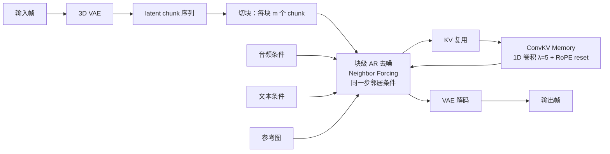
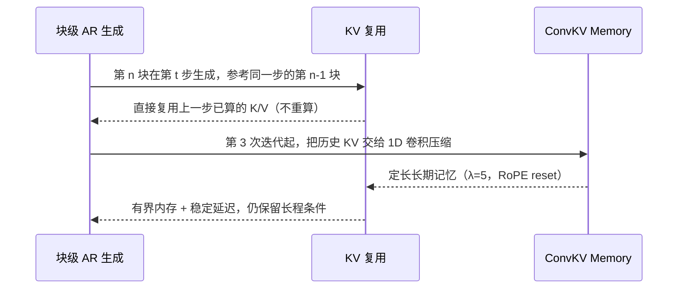

# SoulX-LiveAct

## 论文信息

| 项 | 值 |
|---|---|
| 标题 | SoulX-LiveAct: Towards Hour-Scale Real-Time Human Animation with Neighbor Forcing and ConvKV Memory |
| 作者 | Dingcheng Zhen\*†、Xu Zheng\*、Ruixin Zhang\*、Zhiqi Jiang\*、Yichao Yan、Ming Tao、Shunshun Yin（\* 同等贡献，† 通讯） |
| 单位 | Soul AI Lab（中国）、HKUST(GZ)、Soochow University |
| venue / 年份 | arXiv `v2`（2026-03-18）；该版本未声明 venue |
| arXiv | `2603.11746v2`（`[cs.CV]`） |
| 项目页 | https://soul-ailab.github.io/soulx-liveact/ |
| 代码仓库 | https://github.com/Soul-AILab/SoulX-LiveAct；**我们接入的是 CyberVerse `models/SoulX-LiveAct/`**（核对基准 `4968280`） |
| papers 库 | `arxiv-2603.11746` |

## 一句话总结

**把「自回归扩散该沿链传播什么」当成核心变量**：既有做法传播的是样本级状态（干净参考帧、人为加噪输入、自己上一步的生成结果），而本文传播**同一扩散步下的时间邻居 latent**——于是所有 block 能共享一个扩散步、KV 可复用、训练不再需要 ODE 初始化；再用 **ConvKV Memory** 把 KV 压成定长记忆，得到常数内存的实时长时生成。

- **ARPP 视角**：论文用「沿 AR 链传播的表示（ARPP）」与「能否复用 KV」两根轴重新给所有强制策略定位，把 Neighbor Forcing 与 Diffusion Forcing / Self Forcing 区分开。
- **Neighbor Forcing**：参考状态与目标处在**同一个扩散步**，训练损失可以在整条链上共享同一步，实测省掉了 Self Forcing 所需的 ODE 初始化训练，蒸馏步数从 1000 降到 300。
- **ConvKV Memory**：对因果注意力里的 K/V 做**逐通道 1D 卷积**（压缩比 $\lambda=5$），把无界历史压成定长记忆，论文称推理开销只增加 **1.9%**。
- **实时与长时**：**2 张 H100/H200** 上 **20 FPS**（512×512 或 720×416），单帧 **27.2 TFLOPs**；目标是 hour-scale / 无限长生成。

## 问题与动机

论文把 hour-scale 实时数字人的困难归为两条，都发生在**自回归链本身**：

1. **传播表示的扩散步不匹配**。多数强制策略在**不同扩散步**上传播样本级状态，模型需要跨「噪声语义」对齐时间依赖，学习信号因此不一致、收敛不稳。
2. **历史表示无界且无结构**。历史越长表示越大，缓存状态无法有效复用，推理效率被严重限制。

第二条的动机来自一个零样本观察：把因果注意力掩码直接套到**预训练的非 AR 扩散模型**上时，Diffusion Forcing / Self Forcing 这类既有策略**不额外训练就产不出时序连贯的视频**；而把参考 latent 取成「**上一 chunk 在同一扩散步的 latent**」后，**同一个模型零样本**就能生成主体一致、时序稳定的结果——尽管它本身有明显 chunk 级抖动。

论文由此断言：AR 扩散与非 AR 主干并非天生不兼容，**关键在条件表示的选择**。用表格表达这条轴（论文 Table 1，ARPP = the representation propagated along the AR chain）：

| 方法 | 沿 AR 链传播什么（ARPP） | 训练时的 AR 分解 | KV 复用 |
|---|---|---|---|
| Teacher Forcing | ground-truth samples | $p(\hat{x}_t^f \mid x^{1:f-1})$ | ✗ |
| Rolling / Resampling / **Diffusion Forcing** | noisy 或 resampled 的 ground truth | $p(\hat{x}_t^f \mid \tilde{x}_{t'}^{1:f-1})$ | ✗ |
| **Self Forcing** | 自身生成的「上一扩散步」样本 | $p(\hat{x}_t^f \mid \hat{x}_{t'}^{1:f-1})$ | ✓ |
| **Neighbor Forcing**（本文） | **同一步的邻居参考状态** | $p(\hat{x}_t^f \mid \hat{x}_t^{1:f-1})$ | ✓ |

**读法**：Diffusion Forcing 与 Self Forcing 的分解都带 $t'$（**异步**步），只有 Neighbor Forcing 写的是 $x_t$（**同步**）。所以本文与 Self Forcing 的差别不在「是否 AR」，而在**沿链传播的表示处在哪一步**。

## 方法精析

整体链路：**帧 → 3D VAE → latent chunk 序列 → 按 block 自回归去噪（Neighbor Forcing）→ ConvKV 压缩历史 → 解码出帧**。

### 块级自回归的形式化

3D VAE 把帧编成 latent chunk 序列 $\{z^1,\dots,z^F\}$，序列被切成**每块 $m$ 个连续 chunk** 的 block，每块是一个 latent 变量 $x^n$。生成过程（式 1）：

$$
\hat{x}^{1:N}=\left\{\Psi_{T:0}\!\left(G_{\theta},\,c^{n},\,t\right)\mid n=1,\dots,N\right\},
\qquad
c^{n}=\left\{x_{ref},\,x_t^{1:n-1},\,c_{audio},\,c_{text}\right\}
$$

$\Psi_{T:0}$ 是积分器（论文举例 UniPC Solver），$G_\theta$ 是去噪网络。注意条件里的历史写成 $x_t^{1:n-1}$——**带扩散步下标 $t$**，历史以含噪 latent 形式进入，而不是干净 latent；这正是它与 Teacher Forcing 一档的分界。

训练分两阶段：

| 阶段 | 做什么 | 论文口径的目的 |
|---|---|---|
| Stage 1 | Neighbor Forcing 训练 | 让 audio/text 条件（含情绪与动作 prompt）与生成视频对齐，保证唇动、手势、情绪表达 |
| Stage 2 | 把 ConvKV Memory 接进 DMD 式蒸馏的 rollout 中联合训练 | 让推理时 KV cache 上界固定，支撑稳定无限长生成 |

主干初始化不是本文贡献：self-attention 与 text/image cross-attention **从 Wan2.1 初始化**，audio cross-attention **从 InfiniteTalk 初始化**。另有辅助模块 **Emotion and Action Editing Module**，用于可控地修改表情与手势。

### Neighbor Forcing 把条件对齐到同一个扩散步

Flow-matching 的前向加噪（式 2）：

$$
x_t^{n}=(1-t)\,x_0^{n}+t\,\epsilon^{n},
\qquad \epsilon^{n}\sim\mathcal{N}(0,I)
$$

第 $n$ 块在该步上的去噪损失（式 3）：

$$
\mathcal{L}(\theta)=\mathbb{E}_{n\sim U(0,N),\,t\sim U(0,1)}
\left[\left\lVert(\epsilon^{n}-x^{n})-G_{\theta}\!\left(x_t^{n},\,t\mid x_t^{\,1:n-1}\right)\right\rVert^{2}\right]
$$

关键在条件项写的是 $x_t^{\,1:n-1}$——**与目标同一个 $t$ 的历史**，而非常见的 $x_{t'}^{\,1:n-1}$。论文对此的解释是：既有策略在异质扩散步上传播样本级状态，要求模型跨不匹配的噪声语义对齐时间依赖，因此**共用一个步**既稳定了学习信号，也让所有 block 能在**同一个扩散步**上被一起优化——代价高昂的逐块参考状态构造（如 Self Forcing 所需）因此不再必要，目标简化为（式 4）：

$$
\mathcal{L}(\theta)=\mathbb{E}_{t\sim U(0,1)}
\left[\left\lVert(\epsilon-x)-G_{\theta}\!\left(x_t,\,t,\,Mask\right)\right\rVert^{2}\right]
$$

块级因果掩码（式 5）：

$$
Mask_{i,j}=
\begin{cases}
1, & \left\lfloor j/m \right\rfloor \le \left\lfloor i/m \right\rfloor, \\
0, & \text{否则}.
\end{cases}
$$

**块大小 $m$ 的取值来自消融**：第一块取 **6**、后续块取 **8** 时性能最好（见「实验与结果」的块大小消融）。**式(3)→式(4) 的实质差别**是从「逐块各自一步」变成「整条链一步」，因此可一次前向算整段。

### ConvKV Memory 把历史压成定长记忆

Neighbor Forcing 带来的系统含义是：某一步的前一帧 latent 一旦构造好，其表示**不需要在后续步骤重算**——KV 可以复用。但历史会无界增长，于是论文用一个**很轻的压缩**把 KV 收进定长记忆（式 6）：

$$
M_t^{s:e}=\left(\mathrm{Conv}_{\theta}\!\left(k_t^{s:e}\right),\,\mathrm{Conv}_{\theta}\!\left(v_t^{s:e}\right)\right),
\qquad \mathrm{kernel}=\mathrm{stride}=\lambda=5
$$

即对 K/V 按 **压缩比 $\lambda=5$** 做 1D 卷积（每五个 chunk 的 KV 状态并成一个）。因为压缩后位置编码必须自洽，论文还把压缩后的 K/V 做一次 **RoPE reset**，把位置对齐到起始位置 $s$。

我们在部署代码里确证了它的实现形态：`memory_proj_k` / `memory_proj_v` 是逐通道 `Conv1d(dim, dim, kernel_size=5, stride=5, groups=dim, bias=False)`，权重初始化为常数 `1/5`——**等价于每 5 个 token 做一次均值池化**（压缩比 5×）。也就是说，论文所谓的「结构化记忆」在实现上不是新的网络，而是一层池化加位置重置。

推理时有一条容易漏掉的边界：**KV 压缩不对前两个生成的 latent block 执行，从第三次迭代开始启用**（图 3 右）。这条设计保证了开头几帧仍能拿到完整的局部上下文。

## 训练与实现细节

| 项 | 值 |
|---|---|
| 主干与初始化 | DiT + Flow Matching；self-attn 与 text/image cross-attn 来自 **Wan2.1**，audio cross-attn 来自 **InfiniteTalk** |
| 模型规模 | **18B = 14B Wan2.1 + 4B audio module**（该口径来自官方 README，非论文） |
| Stage 1 数据 | **300 小时** video + audio + emotion/action caption 多模态配对数据 |
| Stage 1 训练目标 | 优化 **audio cross-attention 模块** |
| Stage 2 训练 | ConvKV Memory 接入 **DMD 式蒸馏**，**3-step 推理**设置下联合优化；步数见下方不一致说明 |
| 推理步数 | **3 步** |
| 块大小 $m$ | 第一块 **6** 个 chunk、后续块 **8** 个 chunk（来自消融） |
| ConvKV 压缩比 | $\lambda=5$（kernel = stride = 5），带 RoPE reset |
| 评测集 | **HDTF**（面部动态）+ **EMTD**（含全身运动），各随机取 50 条、共 **100** 条测试视频 |
| 评测分辨率 | 512×512（两个数据集都是） |
| 指标 | FID、FVD、Sync-C / Sync-D（SyncNet）、VBench 的 Temporal / Image Quality、VBench-2.0 的 Human Fidelity |
| 实时系统优化 | 端到端 **adaptive FP8** 精度、**sequence parallelism**、**operator fusion** |
| 硬件目标 | **2 张 NVIDIA H100 或 H200** 上 720×416 或 512×512 达 **20 FPS** |
| 训练总机时 / 随机种子 / 数据清洗口径 | **未披露** |

**一处论文内部不一致（如实登记）**：蒸馏步数在 §3 实现细节写作「3-step 推理设置下 **400 training steps**」，而在 §3.3 与 Table 4 写作「**300 steps** of distillation」。两处并存，笔记不替论文取一个。

## 推理与系统链路

论文的推理侧围绕一个硬预算组织：要满足 **20 FPS**，平均单帧生成延迟必须 **< 50 ms**。

- **KV 复用**：Neighbor Forcing 使「前一步构造好的表示」在后续步骤无需重算，这是 KV 复用成立的前提。
- **有界内存**：历史经 ConvKV 压成定长表示，因此内存上界与延迟都稳定，同时保留长程条件。
- **系统侧优化**：端到端自适应 FP8、序列并行与算子融合共同支撑 2 卡 20 FPS。

块大小与实时约束的消融（论文 Table 5）：

| Memory-block Size | Current-block Size | 每帧成本 | 满足实时（< 50 ms） |
|---|---|---|---|
| 6 | 6 | 52 ms | 否 |
| 8 | 8 | 60 ms | 否 |
| **6** | **8** | **49 ms** | **是** |

只有 **6 / 8** 这一组落在预算内——这就是上表块大小取值的来源。（该表表头原文写作 "Meat Real-time Requirement"，应为 "Meet"，属论文笔误。）

**「hour-scale」是机制论证，不是实测指标**：论文的时长主张（hour-scale、truly infinite）建立在「常数内存 + 定长 KV 长度」的机制上，正文与消融里都没有给出「生成 1 小时视频、显存恒定在 X GB」这类实测数据。

## 实验与结果

### 评估口径

对比方法为 **OmniAvatar**、**InfiniteTalk**、**Live-Avatar**（论文把后者归为 AR counterpart）。指标为上表所列；论文未给出 FID/FVD 之外的质量指标定义细节。

### 主结果（HDTF 与 EMTD）

| 数据集 | 模型 | Sync-C↑ | Sync-D↓ | FID↓ | FVD↓ | VBench Temporal↑ | VBench Image↑ | VBench-2.0 Human Fidelity↑ |
|---|---|---|---|---|---|---|---|---|
| HDTF | OmniAvatar | 5.13 | 10.19 | 27.90 | 268.47 | 86.1 | 61.6 | 96.8 |
| HDTF | InfiniteTalk | 7.12 | 8.01 | 18.15 | 169.88 | 94.5 | 59.9 | 99.4 |
| HDTF | Live-Avatar | 7.68 | 8.38 | 15.85 | 206.20 | 91.8 | 59.2 | 99.8 |
| HDTF | **SoulX-LiveAct** | **9.40** | **6.76** | **10.05** | **69.43** | **97.6** | **63.0** | **99.9** |
| EMTD | OmniAvatar | 6.24 | 8.63 | **33.63** | 589.5 | 91.9 | 63.2 | 96.7 |
| EMTD | InfiniteTalk | 7.98 | 7.44 | 37.26 | **339.0** | 94.9 | 61.6 | 96.7 |
| EMTD | Live-Avatar | 6.93 | 8.23 | 42.52 | 365.0 | 93.6 | 63.0 | 96.6 |
| EMTD | **SoulX-LiveAct** | **8.61** | **7.29** | 80.90 | 771.6 | **97.3** | **65.7** | **98.9** |

**两点必须写清**：

1. **EMTD 上的 FID / FVD 是全文最差**：Ours 的 FID **80.90**、FVD **771.6**，而基线在同列更好（FID 最好 33.63、FVD 最好 339.0）。论文的 EMTD 段落**完全没有提这两项**，只讲 VBench 与唇同步。
2. **§3.1 的 EMTD 段引用了错数字**：正文写「attains **97.6** in Temporal Quality and **63.0** in Image Quality」，但 97.6 / 63.0 是 **HDTF 行**的数值；Table 2 里 EMTD 的 Ours 是 **97.3 / 65.7**。以表格为准。

同理，正文提到的 VBench-2.0 细分维度（Human_Anatomy 96.6、Human_Clothes 与 Human_Identity 各 1.0）**在主表里没有对应列**，仅在正文出现一次。

### 推理效率

| 模型 | 吞吐 | 延迟↓ | GPU 数↓ | 单帧 TFLOPs↓ |
|---|---|---|---|---|
| InfiniteTalk† | 25 FPS | 3.20 s | 8 | 50.2 |
| Live-Avatar | 20 FPS | 2.89 s | 5 | 39.1 |
| **Neighbor Forcing**（本文） | 20 FPS | **0.94 s** | **2** | **27.2** |

† 该行使用了 LightX2V 提供的 LoRA 加权 4 步蒸馏。注意本表把方法名写作 `Neighbor-forcing`，而主结果表写作 `Ours`——**同一个模型**。论文的读法是：单帧计算量显著低于双向基线（50.2）与 AR 对手（39.1），延迟降到 0.94 s、卡数降到 2 张。

### 训练成本对比

| 方法 | 需要 ODE 初始化训练 | 蒸馏步数 |
|---|---|---|
| Self Forcing | 是 | 1000 步 |
| **Neighbor Forcing** | **否** | **300 步** |

论文给出的解释是：Self Forcing 因需要对双向模型做较大改造，需要大量数据（如 16K）做 ODE 初始化训练再加 1000 步蒸馏；Neighbor Forcing 传播的是「同一扩散步上时间相邻帧的 latent」，**不需要 ODE 初始化**。（步数口径的 400/300 不一致见「训练与实现细节」。）

### 消融与定性

四组消融里只有一组是数值表（训练成本，见上），另外三组是定性或成本类：

- **ConvKV Memory 的作用**（图 6）：去掉后出现衣物与手部细节不一致；图内标注更具体——**w/o ConvKV 行标了 3 处 Texture Drift 与 3 处 Color Drift**，启用后无标注。
- **情绪与动作编辑模块**（图 7）：图内列头为 `Ref / Sad / Heart Gasture / Cover Face / Laughing`（原文拼写如此），论文称该模块能在保持身份与唇同步的前提下改头姿与手势，且过渡更平滑。
- **唇动与情绪-动作协同**（图 4）：本文在双唇音、开元音等音素上嘴形更准；基线的典型问题是 **lip–phoneme misalignment** 或 **temporal jitter**。
- **长视频一致性**（图 5）：红框标注的是**身份漂移**（OmniAvatar 与 Live-Avatar；论文特别点名 OmniAvatar 随序列推进累积误差），黄框标注的是**人相关细节不一致**（InfiniteTalk 与 Live-Avatar 的戒指等配饰间歇消失/重现）。图内具名标签为 **ID Drift** 与 **Lost of Ring**，论文把它们归因于长时生成中对身份相关属性约束不足。

**长时对比的具体时长未披露**（图注与正文都没给秒数或帧数），只有标题与摘要的 "hour-scale" 定性说法。

## 相关工作与定位

论文把自己放在两条脉络之后（Appendix B）：

- **自回归视频生成**：Teacher Forcing（训练/测试不匹配 ⇒ 误差累积）→ 规划式生成（先定远未来帧再插值）→ **Diffusion Forcing**（给各帧独立噪声水平）→ **Self Forcing**（直接以自身生成历史为条件）→ **Self-Forcing++**（引入 DMD）与 **Self-Resampling**（在线更新权重重采样过去帧）。论文对这条线的批评是**采样策略复杂、训练开销高**，因此主张「复用同一步的 latent」。
- **记忆压缩**：**FramePack**（把前序帧编码成定长 latent 特征作上下文）与 UNet 式历史压缩路线。论文以「复杂网络不适合实时数字人」为由，改用对 KV 的轻量 1D 卷积。

**与最近邻工作的边界**：与 Self Forcing 的差别**不在是否 AR、也不在能否复用 KV**（两者都 ✓），而在 **ARPP——传播的是「同一步的邻居参考状态」还是「上一扩散步的自生成样本」**。这条差别直接带来两个可观测后果：训练不需要 ODE 初始化，以及所有 block 能在同一步上一起优化。

| 方法 | 传播什么 | 步是否同步 | KV 复用 | 需要 ODE 初始化 |
|---|---|---|---|---|
| Diffusion Forcing | 加噪/重采样的真值 | 否（$t'$） | ✗ | — |
| Self Forcing | 自身生成的上一扩散步样本 | 否（$t'$） | ✓ | 是（16K 数据） |
| **Neighbor Forcing** | 同一步的邻居参考状态 | **是（$t$）** | ✓ | **否** |

## 局限与启发

### 论文的自述边界（本文未设 Limitations 节）

**一个必须写成事实的点：论文全文没有 Limitations 或 Future Work 一节**。可读到的边界只有以下几处，笔记不从别处替它补：

- 「hour-scale / truly infinite」是目标陈述与机制论证，**正文没有给出对应实测数字**；
- ConvKV 的开销只有引言里的一句「推理时间增加 **1.9%**」，没有对应表格；
- 块大小消融只在「20 FPS、< 50 ms/帧」这一个约束下选参数，未讨论其他约束下的表现。

### 我们的实测

**两条接入路径必须分开说**：

1. **官方 `generate.py` 单卡路线（我们跑通的就是这条）**。官方仓库在 2026-03 加入了消费级支持（FP8 KV cache + CPU offload），单卡路径在代码里是明确支持的（`world_size > 1` 才走序列并行分支）。我们用的是 offload 三件套 `--block_offload` / `--t5_cpu` / `--offload_cache`，在**单张 A10（24GB）** 上完整跑通两次：

| 项 | run 9（512×512） | run 11b（416×720） |
|---|---|---|
| 素材 | videoc1 首帧 + 55.8 s 音频 | 真人首帧 + 完整音频 |
| 迭代 | 42/42 完成，37.6 s/迭代 | 43/43 完成，47.4 s/迭代 |
| 速度 | **0.8–0.9 FPS** | **0.67 FPS** |
| 显存峰值 | **10.4 GiB** / 23028 MiB | **11.7 GiB** / 23028 MiB |
| 主机内存峰值 | **113 GiB** / 125 GiB | **118 GiB** / 125 GiB |
| 产物 | 完整 55.5 秒带音轨视频 | 完整 55.5 秒带音轨视频 |

主机内存之所以吃到 85–90 GiB，是 offload 的结构性成本：主干约 37.8 GiB 常驻 CPU + bf16 KV cache 35.2 GiB（3 个去噪步 × 40 层）+ T5 11.4 GiB + CLIP 约 5 GiB；换到 416×720 时 KV cache 涨到 40.2 GiB，与实测 118 GiB 峰值吻合。**结论是 A10 塞得下但很慢**：55.5 秒视频要跑约 39 分钟墙钟。

2. **CyberVerse 插件路线（未在 A10 跑通）**。`avatar.live_act` 插件封装了同一套权重，但它的多卡门槛是硬性的：`world_size > 1` 时必须 torchrun 分布式启动（要求 `WORLD_SIZE` / `RANK` / `MASTER_ADDR` / `MASTER_PORT` 齐全）。**我们走通的是官方直跑，不是插件路径**，两者不能混写成「LiveAct 接入完成」。

**两条被推翻的路**：不加 offload 全量装载约 36 GiB，单卡塞不进；A10 没有 FP8 硬件，所以「用 FP8 把 KV cache 砍半」这条最有效的路径在 Ampere 上不存在——**能救它的内核（FP8 矩阵乘、FP8 稀疏注意力）在这张卡上根本没有**。

**速度定位不能跨硬件比**：官方 20 FPS 是 **2×H100/H200 + 端到端 FP8 + 序列并行**的成绩；官方口径里单张 **RTX 5090 + FP8 + offload 约 6 FPS**、2×RTX PRO 6000（FP4）在 320×480 约 20 FPS。我们的 0.8–0.9 FPS 是 **单卡 A10 + bf16 + offload**，三者口径不同，不能合并成一个倍数。

### 论文缺口 vs 我们结论

| 论文的缺口或回避 | 我们的实测结论 |
|---|---|
| 无 Limitations 节，未讨论失败场景 | 单卡 A10 的实际瓶颈不在显存（10.4 GiB）而在**主机内存**（113/125 GiB），排障方向因此完全不同 |
| EMTD 上 FID/FVD 最差且在正文不提 | 我们不补跑该口径；引用时以表格为准，不引用正文的错数字 |
| hour-scale 只有机制论证 | 我们只验证到 55.5 秒单次生成；「无限长」在我们这边仍是机制推断 |
| 论文未讨论消费级硬件的可达性 | A10 可行但慢 20 倍量级，且**最有效的 FP8 路径在 Ampere 上不可用**——选型时应先看卡的精度能力，而不是参数量 |

### 可操作启发

1. **换「传播什么」比换主干更省**。同一批预训练权重（Wan2.1 + InfiniteTalk），只把条件表示从「上一扩散步的自生成样本」换成「同一步的邻居」，就省掉了 ODE 初始化训练并把蒸馏从 1000 步压到 300 步——这条经验与我们此前看到的「换生成空间比换主干更划算」是同一类判断。
2. **「常数内存」的代价要算在主机侧**。论文关注的是 KV 上界恒定，实际部署里 A10 的显存只用掉 10.4 GiB，真正卡住并发的是 113 GiB 的主机内存——**offload 类方案的选型指标应该是主机内存，不是显存**。
3. **推理期插件的「分布式门槛」常被低估**。插件在单卡上跑不通的原因不是精度或权重，而是 `world_size > 1` 的启动约束；把「官方直跑通了」当成「插件也通了」，会在集成阶段付出返工代价。
4. **精度特性要按卡代际查**。A10（Ampere）没有 FP8 路径，官方 20 FPS 依赖的正是这条路——**同一份代码在不同卡代上的可行优化集合不同**，性能结论必须带卡。

## 术语与符号表

| 术语 | 英文 | 含义 |
|---|---|---|
| 自回归扩散 | AR diffusion | 把扩散接成因果链的范式；本文的争论点是「沿链传播什么」 |
| 沿链传播的表示 | ARPP (the representation propagated along the AR chain) | 论文自造的核心轴 |
| 邻居强制 | Neighbor Forcing | 以**同一扩散步**的时间邻居 latent 作参考状态 |
| 步对齐 | step-aligned / step-consistent | 参考状态与目标处在同一扩散步 $t$ |
| 卷积 KV 记忆 | ConvKV Memory | 对因果注意力里的 K/V 做 1D 卷积（kernel = stride = 5）得到定长长期记忆 |
| 块 / 片段 | block / chunk | 帧经 3D VAE 编成 chunk；每个 block 含 $m$ 个连续 chunk，是 AR 的最小生成单元 |
| 位置重置 | RoPE reset | 压缩后把位置编码对齐回起始位置，保证位置自洽 |
| 分布匹配蒸馏 | DMD | 用于把少步推理蒸馏进生成器；本文以 3-step 设置联合训练 |
| 自适应 FP8 / 序列并行 / 算子融合 | adaptive FP8 / sequence parallelism / operator fusion | 系统侧三项优化，论文称共同支撑 2 卡 20 FPS |
| 情绪与动作编辑 | Emotion and Action Editing Module | 辅助可控模块，编辑表情与手势 |

| 符号 | 含义 |
|---|---|
| $\{z^1,\dots,z^F\}$ | 3D VAE 编出的 latent chunk 序列 |
| $x^n$ / $\hat{x}^n$ | 第 $n$ 个 block 的 latent 变量 / 其预测值 |
| $x_t^n$ | 加噪 latent，$x_t^n=(1-t)x_0^n+t\epsilon^n$ |
| $x_{ref}$ | 参考图的 latent |
| $c_{audio}$、$c_{text}$ | 音频与文本条件 |
| $c^n$ | 条件集合 $\{x_{ref},x_t^{1:n-1},c_{audio},c_{text}\}$ |
| $\Psi_{T:0}$ | 积分器（论文举例 UniPC Solver） |
| $G_\theta$ | 去噪网络（DiT） |
| $Mask$ | 块级因果注意力掩码 |
| $m$ | 每个 block 含的 chunk 数（首块 6、后续 8） |
| $\lambda$ | ConvKV 压缩比（= 5，同时是卷积的 kernel 与 stride） |
| $M_t^{s:e}$ | 第 $t$ 步经压缩后的长期记忆 |
| $t$ / $t'$ | 扩散步；$t$ 同步（本文）、$t'$ 异步（Diffusion Forcing / Self Forcing） |

**三条命名易错**：① 同一个模型在论文里有三种写法——主结果表 `Ours`、效率表 `Neighbor-forcing`、标题与正文 `SoulX-LiveAct`；② $m$ 只表示「每块 chunk 数」，不要与模型规模的「18B」混用；③ **hour-scale 不是实测指标**，是机制论证的口径。

## 相关文档

- 论文层与工程层深读：[[knowledge/cyberverse-realtime-digital-human-agent|CyberVerse 工程专题]]、[[knowledge/digital-human-engineering-benchmark|数字人工程解读（四）]]、[[knowledge/模型探索与未采纳实验复盘|模型探索与未采纳实验复盘]]
- 硬件与加速：[[knowledge/digital-human-realtime-gpu-comparison|实时数字人 GPU 横评]]、[[knowledge/视频生成训练与推理加速专题|视频生成训练与推理加速专题]]、[[knowledge/hardware-assessment|硬件评估]]
- 我们在这一线的复盘：[[数字人概述/数字人领域问题|数字人领域问题]]、[[数字人概述/数字人加速|数字人加速]]、[[数字人概述/数字人行业全景|数字人行业全景]]
- 对照篇：[[论文笔记/avatar-forcing|Avatar Forcing 模型笔记]]（块因果 + 历史 offset）、[[论文笔记/ditto|Ditto 模型笔记]]（参考锚定渲染）
- papers 库条目：`arxiv-2603.11746`
