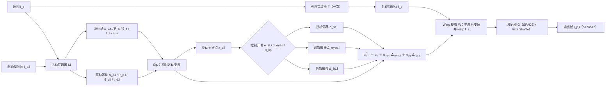

# liveportrait

## 论文信息

| 项 | 值 |
|---|---|
| 标题 | LivePortrait: Efficient Portrait Animation with Stitching and Retargeting Control |
| 作者 | Jianzhu Guo、Dingyun Zhang、Xiaoqiang Liu、Zhizhou Zhong、Yuan Zhang、Pengfei Wan、Di Zhang |
| 单位 | Kuaishou Technology、University of Science and Technology of China、Fudan University |
| venue / 年份 | arXiv 预印本（论文首页未见会议标注，本篇不声明会议） |
| arXiv | `2407.03168v2`（`[cs.CV]`，2024-07） |
| 代码仓库 | https://github.com/KwaiVGI/LivePortrait |
| papers 库 | `arxiv-2407.03168` |

## 一句话总结

**不换生成范式，把 [[论文笔记/face-vid2vid|Face Vid2vid]] 的隐式关键点框架往下做数据、架构、变换与损失的升级，再用三个小 MLP 补上「缝合」与「眼/唇重定向」两类精确控制**——于是一套非扩散管线同时拿到 12.8ms/帧的效率与之前只有扩散类才谈的可控性。

- **非扩散**：走隐式关键点 + warping 路线，把扩散类方法明确列为「计算昂贵、精确可控性弱」的对照（Abstract；Sec. 1）。
- **两阶段**：Stage I 从零训练基模型（外观提取器 $\mathcal{F}$、运动提取器 $\mathcal{M}$、warp 模块 $\mathcal{W}$、解码器 $\mathcal{G}$），Stage II 冻结这四个模块、只训练 stitching 与 eyes/lip retargeting 三个小 MLP（Sec. 3.2–3.3；Fig. 2、Fig. 3）。
- **规模与效率**：约 6900 万帧（过滤前 9200 万帧）、约 18.9K 身份；单帧生成 12.8ms（RTX 4090、naive PyTorch）（Abstract；Sec. 3.2；Sec. 5）。
- **可控性的解释框架**：把紧凑的隐式关键点当作一类「隐式 blendshape（implicit blendshape）」，其组合只用小 MLP 就能学到、算力开销可忽略（Sec. 3.3；Sec. 4「Implementation Details」）。

## 问题与动机

论文要同时补上两条已有路线的缺口（Abstract；Sec. 1；Sec. 3.2）。

1. **扩散路线昂贵、且精确可控性弱**。扩散式方法从噪声迭代去噪合成，多次前向带来高 FLOPs，论文据此把扩散类的推理时间描述为远大于非扩散方法（Sec. 4.2）；同时「精确可控」在扩散框架里只能靠条件注入间接达成。LivePortrait 的选择是留在隐式关键点框架内，把可控性做成显式的三个可插拔模块。
2. **隐式关键点框架效率够高，但泛化与可控性不足**。Face Vid2vid 一脉用无监督学出的关键点加光流 warp，效率上占优，但论文认为其泛化（风格化、跨身份、非人输入）与可控性都还没打开；原框架把规范关键点、头部姿态与表情形变交给三个独立子网，也与「一个运动提取器统一预测」的更新方向不匹配（Sec. 3.1–3.2）。
3. **两个抓手：数据质量与可扩展性**。第一个抓手是数据整理：把公开视频集、自采 4K 人像视频、200 小时 talking head 视频与私有 LightStage 素材切成 <30 秒片段、用跟踪与识别保证每段单人、再用 KVQ 过滤低质片段，最终留下约 6900 万帧、约 18.9K 身份（过滤前 9200 万帧；Sec. 3.2「High quality data curation」）。第二个抓手是「可缩放运动变换」：把尺度从表情形变中解耦成独立标量（Eq. 2），让同一套变换同时适配不同尺度的源图与驱动帧（Sec. 3.2「Scalable motion transformation」）。

## 方法精析

主链路是 Face Vid2vid 的四个组件：外观特征提取器 $\mathcal{F}$ 把源图 $I_s$ 编成 3D 外观特征体 $f_s$；统一的运动提取器 $\mathcal{M}$ 从源图或驱动帧预测规范隐式关键点 $x_{c,s}$、头部姿态 $R$、表情形变 $\delta$（论文明确列出的三个输出），运动变换式里还用到平移 $t$ 与尺度因子 $s$；关键点经运动变换得到源/驱动关键点对 $x_s,x_d$；warp 模块 $\mathcal{W}$ 用这对关键点生成形变场并作用在 $f_s$ 上；解码器 $\mathcal{G}$ 再把形变后的特征体解回图像空间（Sec. 3.1；Sec. 3.2）。

### 隐式关键点：2D 与 3D 的区别，以及「自由视角」从哪来

**「隐式」指的是这些点没有人工定义的解剖语义**：不是 68 点 landmark 或 ARKit 52 blendshape 那类带标签的点，而是网络无监督学出来的一小组点，哪个点管嘴角论文并没有说（本篇的 $K$ 甚至未披露）。

两层方法的关键差别在点的坐标空间：

| | 2D 隐式关键点（FOMM 一脉） | 3D 隐式关键点（Face Vid2vid 引入，本篇沿用） |
|---|---|---|
| 每个点是什么 | 图像平面坐标，另用局部仿射近似邻域运动 | 三维坐标 $x_{c,s}\in\mathbb{R}^{K\times3}$ |
| 有没有「朝向」维度 | 没有；深度与旋转只能间接、局部地近似 | 有；头姿是显式的 $R\in\mathbb{R}^{3\times3}$ |
| 运动如何分解 | 只能算源图→驱动帧的**相对**形变，本质是「把驱动帧里出现过的样子搬过来」 | 拆成刚体旋转 $R$（头姿）＋形变 $\delta$（表情）＋平移 $t$，三项可分别操作 |
| 能得到什么 | 相对运动迁移；驱动视频里没有的大角度朝向表达不了 | 头姿与表情解耦；可在 3D 里旋转 → **自由视角**（free-view） |

**「自由视角」的实现方式**（据 Face Vid2vid）：身份几何（canonical 关键点）跨帧复用，只有运动项随帧变化，因此可以在驱动头姿 $R_d,t_d$ 之上叠加一组用户给定的旋转/平移 $R_u,t_u$，把头部转到驱动视频中未出现的朝向。这也带来低带宽：每帧只需传 $3K+6$ 个标量。

两条需要写清的边界：① 它**不是 3D 重建**，几何不保证正确，只是表示层面允许旋转；② 源图只观测到正面，转过去后原本被遮挡的区域没有真值，只能由解码器生成，角度越大越依赖想象力——论文没有给出「最大多少度」的量化指标（本篇的 Figure 4 图题只给出 *handles large poses more stably* 这类相对表述）。机制细节与那篇的压缩方案见 [[论文笔记/face-vid2vid|Face Vid2vid]]。

### 隐式关键点运动变换：给 Face Vid2vid 的式子加一个尺度

$$
\begin{cases}
x_{s}=x_{c,s}R_{s}+\delta_{s}+t_{s},\\
x_{d}=x_{c,s}R_{d}+\delta_{d}+t_{d},
\end{cases}
\qquad\Longrightarrow\qquad
\begin{cases}
x_{s}=s_{s}\cdot(x_{c,s}R_{s}+\delta_{s})+t_{s},\\
x_{d}=s_{d}\cdot(x_{c,s}R_{d}+\delta_{d})+t_{d}.
\end{cases}
$$

| 符号 | 含义 |
|---|---|
| $x_{s},x_{d}$ | 源 / 驱动的 3D 隐式关键点 |
| $x_{c,s}\in\mathbb{R}^{K\times3}$ | 源图规范隐式关键点（$K$ 论文未披露） |
| $R_{s},R_{d}\in\mathbb{R}^{3\times3}$ | 源 / 驱动头部姿态旋转 |
| $\delta_{s},\delta_{d}\in\mathbb{R}^{K\times3}$ | 源 / 驱动表情形变 |
| $t_{s},t_{d}\in\mathbb{R}^{3}$ | 源 / 驱动平移 |
| $s_{s},s_{d}$ | 源 / 驱动尺度因子（Eq. 2 新增） |

左边是 Face Vid2vid 的原式（Eq. 1，Sec. 3.1），右边是本文的可缩放运动变换（Eq. 2，Sec. 3.2）：差别只在于把缩放提成独立标量 $s_s,s_d$。论文给出的动机是原式把缩放混进了表情形变 $\delta$，训练更难；作者还实验了另一种写法——尺度正交投影 $x=s\cdot\big((x_{c}+\delta)R\big)+t$，发现它让 $\delta$ 过于灵活、跨身份驱动时出现纹理闪烁，因此最终选择了「独立尺度因子」这个折中（Sec. 3.2）。推理期还会把驱动序列相对首帧归一化，得到 Eq. 7（见「推理与系统链路」）。

### Stage I：从零训练基模型

图 1 是论文 Stage I 的管线图（Figure 2）。图上四个被优化的模块恰好是后面 Stage II 要冻结的那四个：$\mathcal{F}$、$\mathcal{M}$、$\mathcal{W}$、$\mathcal{G}$；图题明确写着这一阶段「models are trained from scratch」。这张图支撑的第一条结论就是两阶段的分工边界——**可控性不是靠重训主干换来的**。Stage I 内部还有五项改动（Sec. 3.2）：

- **高质量数据整理**：见上一节的数据规模与过滤流程。
- **图像-视频混合训练**：把单张图像当作单帧视频片段与视频一起训。风格化人像视频稀缺（约 1.3K 段、不足 100 身份），所以用约 60K 张「每张一个独立身份」的风格化图像来补身份多样性——这是用「图像补身份」换「视频补运动」的折中。
- **网络结构升级**：把原来的规范关键点检测器、头部姿态网络、表情形变网络 $\mathcal{L}$、$\mathcal{H}$、$\Delta$ 合并成单个运动提取器 $\mathcal{M}$，骨干是 ConvNeXt-V2-Tiny，直接预测规范关键点、头部姿态与表情形变；生成器换成 SPADE decoder，把 warp 后的特征体逐通道当作语义图，末层加 PixelShuffle 把分辨率从 256×256 提到 512×512。
- **Landmark 引导的隐式关键点优化**：无监督学习在加速训练时学不好眨眼与眼球运动（作者观察到「视线被头部姿态绑住」），因此用能表达微表情的 2D landmark 做监督——对 $N=10$ 个取自眼睛与嘴唇的 landmark 与对应隐式关键点的前两维做 Wing loss（Eq. 3）。
- **级联损失**：在整图、人脸、嘴唇三个区域上叠加感知损失与 GAN 损失，总目标为

$$
\mathcal{L}_{\text{base}}=\mathcal{L}_{E}+\mathcal{L}_{L}+\mathcal{L}_{H}+\mathcal{L}_{\Delta}+\mathcal{L}_{P,\text{cascade}}+\mathcal{L}_{G,\text{cascade}}+\mathcal{L}_{\text{faceid}}+\mathcal{L}_{\text{guide}}.
$$

| 符号 | 含义 |
|---|---|
| $\mathcal{L}_{E},\mathcal{L}_{L},\mathcal{L}_{H},\mathcal{L}_{\Delta}$ | 隐式关键点等变性 / 关键点先验 / 头部姿态 / 形变先验损失，沿用 Face Vid2vid |
| $\mathcal{L}_{P,\text{cascade}}$ | 新增的级联感知损失 |
| $\mathcal{L}_{G,\text{cascade}}$ | 新增的级联 GAN 损失，由 $\mathcal{L}_{GAN,global}+\mathcal{L}_{GAN,face}+\mathcal{L}_{GAN,lip}$ 组成，对应三个从零训练的判别器 $\mathcal{D}_{global},\mathcal{D}_{face},\mathcal{D}_{lip}$ |
| $\mathcal{L}_{\text{faceid}}$ | 人脸身份损失 |
| $\mathcal{L}_{\text{guide}}$ | 关键点引导损失（Eq. 3，$N=10$，landmark 取自眼睛与嘴唇） |

这八项是等号右边并列的（Eq. 4），**各项权重论文未披露**，所以「级联」在数值上到底怎么平衡无法复现；论文也没有定义「级联」的确切含义，只说明判别器按 global / face / lip 分区（本节把「级联 = 区域由大到小」记为推断）。

### Stage II：冻结主干，只训三个小 MLP

图 2（论文 Figure 3）与图 1 的差别就是这阶段的全部内容：冻结外观/运动提取器、warp 模块与解码器，只优化缝合模块 $\mathcal{S}$（Stitching）与眼部、唇部两个重定向模块 $\mathcal{R}_{eyes}$、$\mathcal{R}_{lip}$。三个模块都是小 MLP，只输出一个关键点偏移量，加到驱动关键点上：

$$
\begin{aligned}
\mathcal{L}_{\text{st}}&=\bigl\|(I_{p,st}-I_{p,recon})\odot\bigl(1-M^{st}(I_{s})\bigr)\bigr\|_{1}+w_{reg}^{st}\bigl\|\Delta_{st}\bigr\|_{1},\\
\mathcal{L}_{\text{eyes}}&=\bigl\|(I_{p,eyes}-I_{p,recon})\odot\bigl(1-M^{eyes}(I_{s})\bigr)\bigr\|_{1}+w_{cond}^{eyes}\bigl\|c^{p}_{s,eyes}-c_{d,eyes}\bigr\|_{1}+w_{reg}^{eyes}\bigl\|\Delta_{eyes}\bigr\|_{1},\\
\mathcal{L}_{\text{lip}}&=\bigl\|(I_{p,lip}-I_{p,recon})\odot\bigl(1-M^{lip}(I_{s})\bigr)\bigr\|_{1}+w_{cond}^{lip}\bigl\|c^{p}_{s,lip}-c_{d,lip}\bigr\|_{1}+w_{reg}^{lip}\bigl\|\Delta_{lip}\bigr\|_{1}.
\end{aligned}
$$

| 符号 | 含义 |
|---|---|
| $\Delta_{st},\Delta_{eyes},\Delta_{lip}\in\mathbb{R}^{K\times3}$ | 三个模块输出的关键点偏移（$\Delta_{st}=\mathcal{S}(x_s,x_d)$，$\Delta_{eyes}=\mathcal{R}_{eyes}(x_s;c_{s,eyes},c_{d,eyes})$，$\Delta_{lip}=\mathcal{R}_{lip}(x_s;c_{s,lip},c_{d,lip})$） |
| $I_{p,st},I_{p,eyes},I_{p,lip}$ | 三个分支的预测图，形式都是 $\mathcal{D}(\mathcal{W}(f_s;x_s,x'_d))$ |
| $I_{p,recon}$ | 自重建图 $\mathcal{D}(\mathcal{W}(f_s;x_s,x_s))$，即用源关键点驱动自身，作为一致性参照 |
| $M^{st},M^{eyes},M^{lip}$ | 由源图产生的一致性损失掩码算子（方向表述存在冲突，见下方事实核对注） |
| $\odot$、$\lVert\cdot\rVert_{1}$ | 逐元素乘、L1 范数 |
| $w^{st}_{reg},w^{eyes}_{cond},w^{eyes}_{reg},w^{lip}_{cond},w^{lip}_{reg}$ | 正则项与条件一致性项权重（**数值均未披露**） |
| $c_{s,eyes},c_{d,eyes}$ | 源睁眼条件（元组）/ 驱动睁眼标量；训练期 $c_{d,eyes}\in[0,0.8]$ |
| $c_{s,lip},c_{d,lip}$ | 源张口条件（标量）/ 驱动张口标量 |
| $c^{p}_{s,eyes},c^{p}_{s,lip}$ | 从预测图里重新抽取的条件，用于条件一致性项 |

三项损失结构一致：**自重建图作参照的像素一致性 + 条件一致性 + 偏移量正则**。两个重定向模块的动机也一样——跨身份重演时「源人眼睛远大于驱动者」，直接搬驱动运动会导致闭眼不足；把驱动条件改写成可自由给定的标量后，输出就能落在任意目标睁眼 / 张口程度上（Sec. 3.3）。缝合模块的动机是另一处错位：动画在裁剪对齐空间里做，贴回原图空间时肩部会在驱动帧的带动下跟着动，于是论文让 $\mathcal{S}$ 只修肩部区域的一致性，并把训练时的 $x_d$ 刻意用**跨身份运动**生成以增加难度（Sec. 3.3）。缝合带来的直接好处是支持更大尺寸的原图与多人同时动画。

三个模块的规模（Sec. 4「Implementation Details」）：缝合是 4 层 MLP，层宽 `[126,128,128,64,65]`；眼部是 6 层 MLP，`[66,256,256,128,128,64,63]`；唇部是 4 层 MLP，`[65,128,128,64,63]`。这与论文「计算开销可忽略」的说法一致，也是 Stage II 只需约 2 天的原因。

**关键设计假设**：论文主张紧凑的隐式关键点可以视为一类「隐式 blendshape」，其组合只用小 MLP 就能学到（Sec. 3.3）。**这是作者提出的直觉类比**——论文没有给出数学等价性证明，也没有说明它与规范关键点 $x_{c,s}$、形变 $\delta$ 的显式对应关系；引用时应保留为假设性说法。

> **事实核对注（掩码方向与 K 值）**。Eq. 5 的说明文字写 $M^{st}$ 是「mask out the non-shoulder region」，同一句又说 $\mathcal{L}_{st,const}$ 是**肩部区域**的一致性像素损失，而式中用的是 $1-M^{st}$；Eq. 6 的说明则写 $M^{eyes},M^{lip}$ 是「mask out the eyes and lip regions」。两处的「保留/去掉」方向互相矛盾，论文未给判定，本篇按与损失语义一致的方向解释（即 $1-M$ 落在被约束区域），**该解释属推断**。此外 $K$ 全文未披露：由 MLP 层宽可反推 $K=21$（$126=2\times63$、$63=21\times3$），但缝合模块的输出维是 65 而论文称 $\Delta_{st}\in\mathbb{R}^{K\times3}$（$K=21$ 时 63），多出的 2 维用途论文未解释——$K=21$ 同样属推断。

图 3（论文 Figure 8）是「重定向能干什么」的直接证据，分两块。第一块**没有驱动帧**：只给源图，把驱动睁眼标量在 $[0,0.8]$ 内扫一遍，眼睛就能从闭到全开，且不影响画面其他区域——这说明眼部形变不是从驱动帧里搬来的，而是模块按标量**生成**的。第二块是跨身份重演：源人眼睛明显大于驱动者时，不做重定向则驱动幅度不足以闭上源人的眼睛。图题还注明这两块里的动画结果统一采用**源图头部旋转**，以便把差异归因到眼睛而非姿态。读数上要注意：**这里没有任何数字**——论文称这是「quantitative controllability」，但正文与附录都没给曲线或指标，所以本节把它当定性证据。

## 训练与实现细节

| # | 项 | 值 |
|---|---|---|
| 1 | 训练数据构成 | 公开视频集 VoxCeleb、MEAD、RAVDESS；风格化图像集 AAHQ；自采 4K 人像视频、200 小时 talking head 视频；私有 LightStage 数据集；若干风格化人像视频/图像 |
| 2 | 数据规模 | 约 **6900 万帧**（过滤前 9200 万帧）、约 **18.9K 身份**、**60K** 静态风格化肖像；风格化视频约 1.3K 段、不足 100 身份 |
| 3 | 数据整理 | 长视频切 <30 秒片段；人脸跟踪 + 识别保证每段仅一人；KVQ 过滤低质片段 |
| 4 | 图像-视频混合训练 | 单张图像当作单帧视频片段与视频同训，补风格化身份多样性 |
| 5 | 网络结构与分辨率 | 运动提取器 $\mathcal{M}$ 骨干 ConvNeXt-V2-Tiny；生成器 $\mathcal{G}$ = SPADE decoder + 末层 PixelShuffle；输入对齐裁剪 256×256、输出 512×512 |
| 6 | 优化器与 batch | Adam，学习率 $2\times10^{-4}$，$\beta_1=0.5$、$\beta_2=0.999$；batch size 104（论文未标注属于哪一阶段） |
| 7 | 三模块 MLP 层宽 | stitching `[126,128,128,64,65]`；eyes `[66,256,256,128,128,64,63]`；lip `[65,128,128,64,63]` |
| 8 | 训练成本 | Stage I：8 × NVIDIA A100、约 10 天；Stage II：约 2 天 |
| 9 | 训练步数 / epoch、Stage II 学习率与 batch | **未披露** |
| 10 | 损失权重（Eq. 4 各项，Eq. 5/6 的 $w_{reg}$、$w_{cond}$） | **未披露** |
| 11 | 隐式关键点数量 $K$ | **未披露**（正文只给 $x_{c,s}\in\mathbb{R}^{K\times3}$） |
| 12 | eyes / lip condition 的提取算法 | **未披露**（只说明 eyes 为「ratio of eye-opening」，未给从图像到标量的算法） |

除上表外还有两项附带的训练设定值得记：判别器 $\mathcal{D}_{global},\mathcal{D}_{face},\mathcal{D}_{lip}$ 的网络结构与损失形式**未披露**（只知道从零训练，人脸/嘴唇区域由 2D semantic landmarks 定义）；动物泛化实验（Appendix D）会丢掉头部姿态损失、lip GAN 损失与身份损失，理由是动物头部姿态估计不如人类可靠、唇部分布不同、身份损失不适用于动物。第 12 项是本篇复现风险最高的一条——**condition 的提取算法缺失，意味着第二节的「条件一致性项」在工程上无法原样重建**。

## 推理与系统链路

推理是「源图编码一次 + 驱动帧逐帧变换」的结构（Sec. 3.4；Algorithm 1）。源图侧只做一次：$f_s=\mathcal{F}(I_s)$、$x_{c,s}=\mathcal{M}(I_s)$；驱动侧逐帧取 $s_{d,i},\delta_{d,i},t_{d,i},R_{d,i}=\mathcal{M}(I_{d,i})$，再按 Eq. 7 把驱动运动表达成**相对首帧的增量**后叠加到源的关键点配置上：

$$
\begin{cases}
x_{s}=s_{s}\cdot(x_{c,s}R_{s}+\delta_{s})+t_{s},\\
x_{d,i}=s_{s}\cdot\dfrac{s_{d,i}}{s_{d,0}}\cdot\Big(x_{c,s}\bigl(R_{d,i}R_{d,0}^{-1}R_{s}\bigr)+(\delta_{s}+\delta_{d,i}-\delta_{d,0})\Big)+(t_{s}+t_{d,i}-t_{d,0}).
\end{cases}
$$

| 符号 | 含义 |
|---|---|
| $i$ | 驱动帧序号；下标 $0$ 表示驱动序列首帧，用作相对基准 |
| $s_{d,i},R_{d,i},\delta_{d,i},t_{d,i}$ | 第 $i$ 帧驱动帧的尺度、头部姿态、表情形变、平移 |
| $R_{d,i}R_{d,0}^{-1}R_{s}$ | 相对首帧的旋转增量再贴到源姿态上 |
| $\delta_{s}+\delta_{d,i}-\delta_{d,0}$ | 源表情形变加上驱动的相对形变增量 |
| $t_{s}+t_{d,i}-t_{d,0}$ | 源平移加上驱动的相对平移增量 |
| $x_{d,i}$ | 第 $i$ 帧的驱动关键点（未加控制偏移） |

三件事在式子里能读出来：尺度用比值 $s_{d,i}/s_{d,0}$ 归一化；旋转与形变都只取相对首帧的**增量**；源图的 $x_{c,s}$ 与 $s_s$ 全程充当「基准骨架」，因此换身份只需换源图。

（Eq. 7 在 arXiv HTML 版里把一对可伸缩括号渲染成了字面量 `CLOSE`／`OPEN`，属 LaTeXML 渲染 bug，本篇以 PDF 为准。）

控制偏移在关键点上叠加，并由三个 0/1 指示变量 $\alpha_{st},\alpha_{eyes},\alpha_{lip}$ 决定开关（Sec. 3.4；Algorithm 1）：

- 无控制：$x'_{d,i}=x_{d,i}$；
- 仅缝合：$x'_{d,i}=x_{d,i}+\Delta_{st,i}$；
- 有重定向：$x'_{d,i}=x_{s}+\alpha_{eyes}\Delta_{eyes,i}+\alpha_{lip}\Delta_{lip,i}$，若再打开缝合则继续叠加缝合偏移。

最后 $I_{p,i}=\mathcal{D}\bigl(\mathcal{W}(f_s;x_s,x'_{d,i})\bigr)$。这里有一个值得单独记的性质：**眼部与唇部的形变偏移彼此解耦，可以线性相加到驱动关键点上**（Sec. 3.4），论文用 Figure 10 给出两者同时生效的定性证据——两个模块是独立训练的，却能被直接相加使用。

图里只有一次性的量：$x_{c,s}$、$R_s$、$\delta_s$、$t_s$、$s_s$ 与 $f_s$ 都来自源图、只算一次；逐帧变化的只有驱动运动与三个控制偏移。

**效率口径**：论文报单帧 **12.8ms**，硬件与框架写明是 RTX 4090 与「naive PyTorch」（Abstract；Sec. 1；Sec. 5）。**批大小、是否包含预处理/后处理、精度设置论文均未披露**，也没有给出任何基线方法的实测推理时间——因此这个数字只能作为**论文宣称值**引用，不能与其它模型的速度数字直接比较。本仓库的资料里它另有两处登记：[[数字人概述/数字人加速|数字人加速]] 把它列为「RTX 4090 上 67 FPS、A10 上可运行」；[[knowledge/digital-human-realtime-gpu-comparison|实时数字人 GPU 对比]] 把它记成「1× RTX 4090（torch.compile）、512×512、约 67 FPS / 约 15ms、约 8 GB」并把来源标为论文。论文本身既没提 torch.compile、也没给 FPS 口径，因此这两处只能当**评估期登记值**——与 12.8ms **不是同一口径，不能互相换算**。

**与我们链路的接口**。这条表示的工程价值在本仓库已经有落点：Ditto 的 265 维运动向量里 exp 那 63 维就是「21×3 的位移表」，与 LivePortrait 的隐式关键点同源；而这些维度在预训练时并没有语义标签，控制映射是靠**逐维扰动 + 渲染观察**反推出来的（Ditto 论文点名第 34 维管右眼开合、第 58 维管张嘴）。也就是说，LivePortrait 的「隐式 blendshape」假设在工程上确实被用起来了，但用的是**后验控制映射**这条路，而不是论文 Stage II 那三个小 MLP（详见 [[数字人概述/数字人动作|数字人动作]] 与 [[knowledge/动作空间专题|动作空间专题]]）。

## 实验与结果

### 评估口径

自重现（self-reenactment）用 TalkingHead-1KH 官方 test split（35 段视频）与 VFHQ（50 段视频），每个测试视频取首帧作源、全部帧既作驱动又作 ground truth，比较时统一下采样到 256×256；跨身份重演（cross-reenactment）以 FFHQ 前 50 张图像作源图，驱动帧取自 TalkingHead-1KH、VFHQ 与 NeRSemble（Sec. 4「Benchmarks」；Sec. 4.1；Appendix A）。指标含像素/感知质量（PSNR、SSIM、LPIPS、$\text{L}_1$、FID）、身份保持（CSIM，人脸识别嵌入余弦相似度）与运动精度三类：AED、APD 是动画图与驱动图的表情/姿态参数平均 L1 距离（参数由 SMIRK 提取），MAE(°) 是**眼球方向**平均角度误差（由预训练眼球方向网络预测方向向量后取夹角）——注意这里的 MAE 不是「平均绝对误差」（Appendix A）。自重现的 CSIM 算在动画图与驱动图之间，跨身份重演则算在动画图与源图之间。

### 主结果：自重现六项领先，跨身份运动精度全胜

**自重现（Table 2）**，数值逐字照录：

| 方法 | 数据集 | PSNR↑ | SSIM↑ | LPIPS↓ | L₁↓ | CSIM↑ | MAE(°)↓ |
|---|---|---|---|---|---|---|---|
| FOMM | TalkingHead-1KH | 31.0681 | 0.7620 | 0.1201 | 0.0419 | 0.8805 | 10.1745 |
| Face Vid2vid | TalkingHead-1KH | 30.8438 | 0.7743 | 0.0940 | 0.0432 | 0.8774 | 10.8117 |
| DaGAN | TalkingHead-1KH | 31.3657 | 0.7903 | 0.0969 | 0.0389 | 0.8798 | 11.8655 |
| MCNet | TalkingHead-1KH | 32.0013 | 0.8042 | 0.1018 | 0.0349 | 0.8876 | 10.9035 |
| TPSM | TalkingHead-1KH | 31.2934 | 0.7965 | 0.0990 | 0.0395 | 0.8848 | 9.6036 |
| FADM | TalkingHead-1KH | 30.2141 | 0.7695 | 0.1049 | 0.0484 | 0.8708 | 11.4484 |
| AniPortrait | TalkingHead-1KH | 31.4669 | 0.7144 | 0.0922 | 0.0470 | 0.8550 | 12.0807 |
| X-Portrait | TalkingHead-1KH | 31.2716 | 0.7193 | 0.1007 | 0.0487 | 0.8773 | 9.2335 |
| **Ours** | TalkingHead-1KH | **32.0082** | **0.8193** | **0.0664** | **0.0347** | **0.9125** | **7.0535** |
| FOMM | VFHQ | 30.5912 | 0.7098 | 0.1410 | 0.0505 | 0.8700 | 10.9327 |
| Face Vid2vid | VFHQ | 30.5166 | 0.7247 | 0.1132 | 0.0500 | 0.8775 | 11.1500 |
| DaGAN | VFHQ | 30.7038 | 0.7315 | 0.1258 | 0.0481 | 0.8747 | 11.2051 |
| MCNet | VFHQ | 31.3459 | 0.7540 | 0.1209 | 0.0429 | 0.8849 | 9.6634 |
| TPSM | VFHQ | 31.0262 | 0.7476 | 0.1177 | 0.0466 | 0.8884 | 9.8169 |
| FADM | VFHQ | 30.0932 | 0.7180 | 0.1252 | 0.0535 | 0.8707 | 11.7523 |
| AniPortrait | VFHQ | 30.9013 | 0.6718 | 0.1073 | 0.0542 | 0.8570 | 14.2411 |
| X-Portrait | VFHQ | 30.5840 | 0.6479 | 0.1312 | 0.0627 | 0.8721 | 9.3846 |
| **Ours** | VFHQ | **31.5616** | **0.7653** | **0.0798** | **0.0422** | **0.9121** | **6.6966** |

读法：本方法在两个数据集的六项指标上全部取最优，其中 MAE(°) 为 **7.0535 / 6.6966**，比次优的 X-Portrait（9.2335 / 9.3846）低约 2.2 / 2.7 度，对应「眼球运动精度明显更好」这一结论；CSIM 0.9125 / 0.9121 也高于所有基线。注意 MCNet 在 TalkingHead-1KH 上的 PSNR 32.0013 与本文 32.0082 只差 0.0069，**「六项领先」里 PSNR 这一项的余量其实很小**，不宜写成显著优势。

**跨身份重演（Table 3）**，数值逐字照录：

| 方法 | 数据集 | FID↓ | CSIM↑ | AED↓ | APD↓ | MAE(°)↓ |
|---|---|---|---|---|---|---|
| FOMM | TalkingHead-1KH | 90.8068 | 0.3057 | 0.7934 | 0.0411 | 18.3946 |
| Face Vid2vid | TalkingHead-1KH | 82.9066 | 0.3687 | 0.8285 | 0.0559 | 20.2687 |
| DaGAN | TalkingHead-1KH | 81.1110 | 0.2937 | 0.7636 | 0.0405 | 21.0156 |
| MCNet | TalkingHead-1KH | 89.3218 | 0.2863 | 0.7163 | 0.0375 | 17.0721 |
| TPSM | TalkingHead-1KH | 80.5436 | 0.3289 | 0.7492 | 0.0387 | 17.4371 |
| FADM | TalkingHead-1KH | 95.4043 | 0.3755 | 0.8158 | 0.0525 | 18.8346 |
| AniPortrait | TalkingHead-1KH | **47.8739** | 0.3733 | 0.9127 | 0.0450 | 19.7136 |
| X-Portrait | TalkingHead-1KH | 60.7963 | **0.5843** | 0.8392 | 0.1070 | 20.9344 |
| **Ours** | TalkingHead-1KH | 58.0370 | 0.3909 | **0.6772** | **0.0333** | **14.7946** |
| FOMM | VFHQ | 94.1640 | 0.2011 | 0.7374 | 0.0336 | 18.6282 |
| Face Vid2vid | VFHQ | 83.8891 | 0.2360 | 0.7891 | 0.0470 | 19.9852 |
| DaGAN | VFHQ | 82.6255 | 0.1969 | 0.7108 | 0.0334 | 20.6918 |
| MCNet | VFHQ | 89.9694 | 0.1907 | 0.6545 | 0.0329 | 17.3642 |
| TPSM | VFHQ | 77.5867 | 0.2197 | 0.6700 | 0.0290 | 16.8058 |
| FADM | VFHQ | 98.2516 | 0.2473 | 0.7811 | 0.0438 | 18.9776 |
| AniPortrait | VFHQ | 70.8077 | 0.2538 | 0.9018 | 0.0501 | 20.1085 |
| X-Portrait | VFHQ | 58.6731 | **0.5881** | 0.8463 | 0.1226 | 22.5937 |
| **Ours** | VFHQ | **56.4165** | 0.2606 | **0.6476** | **0.0271** | **13.3464** |

> **事实核对注（跨身份重演的落后项）**。这张表**不是全面领先**，论文自己也这么写：TalkingHead-1KH 的 FID 上 AniPortrait 更好（47.8739 vs 58.0370）、两个数据集的 CSIM 上 X-Portrait 更好（0.5843 / 0.5881 vs 0.3909 / 0.2606）。也就是说，本文占优的是运动精度类指标（AED / APD / MAE 全胜）与 VFHQ 的 FID，身份保持与 TalkingHead-1KH 的生成质量分布仍有对手——论文没有分析 CSIM 落后的原因（一种常见猜测是扩散类方法的身份保持更强，但论文未给证据）。引用时**必须保留这两个例外**，不能写成「全面超越扩散类方法」。

### 与扩散类方法的时序一致性

图 4（论文 Figure 6）取 VFHQ 与 TalkingHead-1KH 各案例，把本文结果（带缝合、贴回原图空间）与四个扩散类方法逐帧并排。论文圈出的读数分两层：**竖直圈**是背景与道具——FADM 的后续帧里雕像消失、AniPortrait 出现类行人状的非自然背景位移、MegActor 某些帧里红色横幅消失；**水平圈**是前景与细节——AniPortrait 与 MegActor 出现类挥手状的前景位移，X-Portrait 衣物上的图案发生变化。这些现象对应的是扩散类方法「逐帧重新生成整个画面」的性质：非扩散的 warp 路线只搬运源图外观，背景与服饰本来就不被重新合成，因此不会出现这种「每次生成都重新掷一次骰子」的破坏。

读这张图要守住两条口径：**它是定性证据**，论文没有给任何自动时序一致性指标（如 warping error / 帧间一致性分数），圈注位置也是作者定的；**它证明的是稳定性而非画质峰值**，与上一节「自重现质量只是略优于扩散类」并不矛盾——论文关于扩散类推理更慢的描述同样只有定性口径。

### 定性对比：自重现

图 5（论文 Figure 4）是主结果的定性面板：前四组源图-驱动图对来自 TalkingHead-1KH，其余来自 VFHQ；论文在图题里声明本方法「更好地保住唇动与眼球注视、对大姿态处理更稳定、身份保持更好」。读数上它能与上一节的 Table 2 互相印证——六项指标的领先正是这三个方面（唇动/视线对应 MAE(°) 与 LPIPS，身份对应 CSIM），但**图本身不含数字**，逐方法优劣只能靠目视；本仓库若要用这张图做结论，建议只当作 Table 2 的配图，而不是独立证据。

### 消融：只有定性证据

论文的三组可控性消融（Fig. 7 缝合、Fig. 8 眼、Fig. 9 唇，以及 Fig. 10 眼唇同时）**全部是图示形式，没有任何定量指标表**。可供引用的观察只有三类：去掉缝合后肩部明显错位、贴回原图空间后错位更显著；不加眼部重定向时闭眼不足；两个重定向模块独立训练却可同时生效。

> **事实核对注（消融的证据性质）**。Figure 8、Figure 9 的第一块被论文称为「quantitative controllability」，但正文与附录都没有给出任何数值、曲线或误差表，因此**在本篇里只能作为定性证据**；不能把它写成「已验证的机制增益」。同样，缝合与重定向带来的画质收益没有任何量化消融支撑，这也意味着「12.8ms + 三个小 MLP = 可控性」这条链条里，**可控性的收益只被展示、未被测量**。

## 相关工作与定位

论文在 Table 1 里把视频驱动人像动画分成非扩散与扩散两派，并用四列刻画差异（生成能力星级、缝合、眼重定向、唇重定向；原表另有一列推理效率以图标表示）：

| 方法 | 框架 | 中间运动表示 | 生成能力（论文星级） | Stitching | Eyes retarget | Lip retarget |
|---|---|---|---|---|---|---|
| FOMM、MRAA、Face Vid2vid、IWA、TPSM、DaGAN、MCNet | 非扩散 | 隐式关键点 | ★★★ | ✗ | ✗ | ✗ |
| FADM | 扩散 | 隐式关键点 + 3DMM | ★★★ | ✗ | ✗ | ✗ |
| Face Adapter、AniPortrait | 扩散 | 显式关键点或掩码 | ★★★★ | ✗ | ✗ | ✗ |
| X-Portrait | 扩散 | 只用原始驱动图像 | ★★★★★ | ✗ | ✗ | ✗ |
| MegActor | 扩散 | 只用原始驱动图像 | ★★★★ | ✗ | ✗ | ✗ |
| **LivePortrait** | **非扩散** | **隐式关键点** | ★★★★ | **✓** | **✓** | **✓** |

三条读法：**三列可控性上除本方法外全部为 ✗**，这是论文最硬的定位差异；**生成能力星级不是本方法最高**（X-Portrait ★★★★★、本方法 ★★★★），所以论文的定位是「质量够用 + 效率与可控性换空间」，不是「画质最强」；**Table 1 的「Inference efficiency」一列在论文里用图标（笑脸/哭脸）而非数值表示**，星级评定标准与来源**未披露**，引用时不能把它当量化结论。

机制差异可以压成两条：

- **非扩散派**用隐式关键点 + 光流 warp。谱系上 FOMM 在关键点邻域做局部仿射、MRAA 用 PCA 表达关节运动、Face Vid2vid 引入 3D 隐式关键点实现自由视角、TPSM 用薄板样条表达复杂运动、DaGAN 用稠密深度估计关键点、MCNet 用身份条件记忆补偿——LivePortrait 全部继承其表示，只换组件与损失（Sec. 2.1）。
- **扩散派**从高斯噪声迭代去噪。FADM 先用隐式关键点模型出粗动画再用 3DMM 引导扩散精修；Face Adapter 用 identity adapter + 空间条件生成器；AniPortrait、X-Portrait、MegActor 共享 AnimateAnyone 式的 mutual self-attention + 插件式时序注意力，其中 AniPortrait 用显式关键点、X-Portrait 与 MegActor 直接用原始驱动视频（Sec. 2.2）。
- **本文的差异因此落在两处**：控制发生在**低维关键点空间**（warp 之前），而不是像素/潜空间里的条件注入；生成**不需要多次去噪**，单次前向即可出帧。代价是画面完全由源图外观 warp 而来——背景与服饰稳定，但「生成力」受源图约束，这也解释了 Table 1 里它的星级不占优。

## 局限与启发

### 论文自己承认的局限

- **大姿态跨身份重演不佳**。跨身份、且驱动与源的头姿差异大时表现不够好（Sec. 5「Limitations」）。
- **驱动视频带明显肩部运动时可能抖动**。论文写「有一定概率」，即不是稳定复现的失败模式；这与缝合模块的引入动机（肩部错位）正好互补——缝合约束的是贴回位置，管不了驱动帧本身的肩部运动幅度。

此外从方法范围还能读出第三条边界（**本笔记的归纳，非论文 Limitations 段自陈**）：方法围绕裁剪对齐的人脸区域展开，肩部以外由缝合与贴回处理，身体运动不在范围内。

### 我们的实测

**本篇没有第一手结论**：LivePortrait 在本仓库**未接入**（`CyberVerse/models` 下无对应目录），没跑过它的训练、推理或控制接口；因此本节只记它在表示谱系里的位置，不写实测数据。

- **表示层**：它是本仓库「隐式关键点」这一档的代表实现，与 [[数字人概述/数字人身份|数字人身份]] 里「身份 = 一张参考图 + 隐式关键点」的定价方式、以及 [[数字人概述/数字人动作|数字人动作]] 里「21×3 位移表 + 逐维扰动控制映射」的工程做法同源。
- **下游复用**：Ditto 直接复用这套运动空间（265 维里的 exp 63 维）与渲染入口，因此 LivePortrait 的这篇论文在链路上的作用是**定义表示与控制面**，而不是被当作一个可上线的模型（见 [[论文笔记/ditto|Ditto 模型笔记]]）。
- **两处口径核对**（都不是我们的实测，只是把已有资料对齐）：[[数字人概述/数字人加速|数字人加速]] 把 LivePortrait 记为「RTX 4090 上 67 FPS」「A10 可运行、实测可跑」，[[knowledge/digital-human-realtime-gpu-comparison|实时数字人 GPU 对比]] 则记为「1× RTX 4090（torch.compile）、约 67 FPS / 约 15ms」，与论文的「12.8ms、naive PyTorch」既不同口径、也不是同一测量主体；引用工程结论时应视为**评估期登记值**，不要与论文宣称值混用。

### 论文局限 vs 我们结论

| 论文承认的问题 | 我们的结论 |
|---|---|
| 大姿态跨身份重演表现不佳 | 未接入，无第一手结论；只在谱系里记录该短板与跨身份 CSIM 落后一致 |
| 驱动视频肩部大运动时可能抖动 | 未接入，无第一手结论；工程侧只用到它的运动表示，不涉及缝合与贴回链路 |
| 消融只有定性图示、无量化指标 | 未接入，无第一手结论；本篇按「可控性收益未被测量」标注证据性质 |
| 复现缺口（损失权重、训练步数、$K$、condition 提取算法均未披露） | 未接入，无第一手结论；这也正是本仓库只复用它的表示与控制面、不自建训练链路的原因之一 |

### 可操作启发

1. **「warp 空间 + 可插拔小 MLP」是可复用的控制架构**。把控制模块做成「冻结主干的输出偏移」而不是重训主干，代价是三个小 MLP 的层宽（本论文最小的模块只有几百维输入），收益是控制可以开关、可以叠加、可以独立迭代。这条思路在动作空间设计里比具体网络结构更值得抄。
2. **效率卖点要连着口径一起引用**。12.8ms 与「naive PyTorch + RTX 4090」是绑定的；同一模型在别的资料里以 torch.compile 口径出现时数值不同。跨模型的效率对比必须先对齐硬件、精度与是否含预处理。
3. **可控性主张需要自己的指标**。论文把「眼睛更开一点」「肩部对齐」这类控制做成图示，没有测量；如果我们要在这一层做工程承诺，需要自己定义可复核的控制精度指标（例如给定标量与输出眼开合度的单调性/误差），否则无法判断控制模块是否真的收敛。
4. **身份保持与生成质量是两条线**。跨身份重演里本方法运动精度全胜、身份相似度却输给 X-Portrait——这提示「运动迁移准」与「像不像本人」需要分开评估，不能用一个总分覆盖。

## 术语与符号表

| 术语 | 英文 | 含义 |
|---|---|---|
| 人像动画 | portrait animation | 用单张源图提供外观，把表情与头部姿态等运动迁移过去生成视频 |
| 自重现 / 跨身份重演 | self-reenactment / cross-reenactment | 驱动者与源图同身份 / 不同身份；后者检验运动迁移与身份保持 |
| 隐式关键点 | implicit keypoints | 无监督学出的 $K$ 个三维点，作为中间运动表示，经光流 warp 驱动外观 |
| 规范隐式关键点 | canonical implicit keypoints | $x_{c,s}$，源图的中性姿态关键点，运动变换的基准骨架 |
| 隐式 blendshape | implicit blendshape | 本文提出的类比：紧凑隐式关键点可视为一组混合形状，其组合可由小 MLP 学到（无形式化定义） |
| 缝合（控制） | stitching | 把裁剪空间里的动画无像素错位地贴回原图空间，主要修肩部错位；由此支持大图与多人 |
| 重定向 | retargeting | 用小 MLP 生成关键点偏移，使输出由任意目标睁眼/张口标量驱动，不受驱动者自身幅度限制 |
| 级联损失 | cascade loss | 在整图、人脸、嘴唇三个区域上叠加的感知损失与 GAN 损失 |
| 自重建图 | self-reconstruction image | $I_{p,recon}=\mathcal{D}(\mathcal{W}(f_s;x_s,x_s))$，用源关键点驱动自身，作一致性参照 |
| 尺度正交投影 | scale orthographic projection | 被本文否决的变换写法 $x=s\cdot((x_{c}+\delta)R)+t$，论文称其让 $\delta$ 过于灵活、跨身份时纹理闪烁 |
| 指示变量 | indicator variable | $\alpha_{st},\alpha_{eyes},\alpha_{lip}\in\{0,1\}$，控制推理时三个模块是否生效 |
| 运动提取器 | motion extractor | $\mathcal{M}$，把原框架的三个子网统一为一个 ConvNeXt-V2-Tiny 模型 |
| 眼球方向平均角度误差 | MAE(°) | 由预训练眼球方向网络预测方向向量后取夹角误差；**不是**平均绝对误差 |

| 符号 | 含义 |
|---|---|
| $\mathcal{F},\mathcal{M},\mathcal{W},\mathcal{G}$ | 外观特征提取器、运动提取器、warp 模块、解码器（Stage I 从零训练，Stage II 冻结） |
| $\mathcal{D}$ | 解码器的另一种写法（$\mathcal{D}=\mathcal{G}$，论文未声明二者等价） |
| $\mathcal{S},\mathcal{R}_{eyes},\mathcal{R}_{lip}$ | 缝合模块、眼部与唇部重定向模块（Stage II 只训这三个） |
| $I_s, I_{d,i}, I_{p,i}$ | 源图、第 $i$ 帧驱动图、第 $i$ 帧输出 |
| $f_s$ | 源图 3D 外观特征体（通道与尺寸未披露） |
| $x_{c,s}\in\mathbb{R}^{K\times3}$ | 源图规范隐式关键点；$K$**未披露**，由 MLP 层宽推断为 21 |
| $x_{s}, x_{d}, x'_{d,i}$ | 源关键点、驱动关键点、加控制偏移后的驱动关键点 |
| $R,\delta,t,s$ | 头部姿态、表情形变、平移、尺度因子（下标 $s$/$d$/$d,i$ 区分源/驱动/第 $i$ 驱动帧） |
| $\Delta_{st},\Delta_{eyes},\Delta_{lip}$ | 三个控制模块输出的关键点偏移，均 $\in\mathbb{R}^{K\times3}$ |
| $M^{st},M^{eyes},M^{lip}$ | 三个一致性损失掩码算子（保留/去掉方向表述冲突，见方法节注） |
| $c_{s,eyes},c_{d,eyes},c_{s,lip},c_{d,lip}$ | 源 / 驱动的睁眼与张口条件；$c_{d,eyes}\in[0,0.8]$，$c_{s,eyes}$ 为元组 |
| $K$ | 隐式关键点数量（未披露；推断 21） |
| $\mathcal{L}_{\text{base}}$ | Stage I 总目标（Eq. 4） |

## 相关文档

- 对照篇：[[论文笔记/ditto|Ditto 模型笔记]]（复用了本篇的运动空间与渲染入口）
- 所在谱系：[[数字人概述/数字人身份|数字人身份]]、[[数字人概述/数字人动作|数字人动作]]、[[数字人概述/数字人加速|数字人加速]]
- 专题：[[knowledge/动作空间专题|动作空间专题]]、[[knowledge/数字人渲染器专题|数字人渲染器专题]]、[[knowledge/gfvc-survey-2023|GFVC 综述]]、[[knowledge/评测指标专题|评测指标专题]]、[[knowledge/数据集整理专题|数据集整理专题]]
- 综述定位：[[数字人概述/数字人介绍与技术路线|数字人介绍与技术路线]]、[[knowledge/数字人基础|数字人基础]]
- papers 库条目：`arxiv-2407.03168`
- 历史博客精读（papers 库内）：`paper-liveportrait.html`
