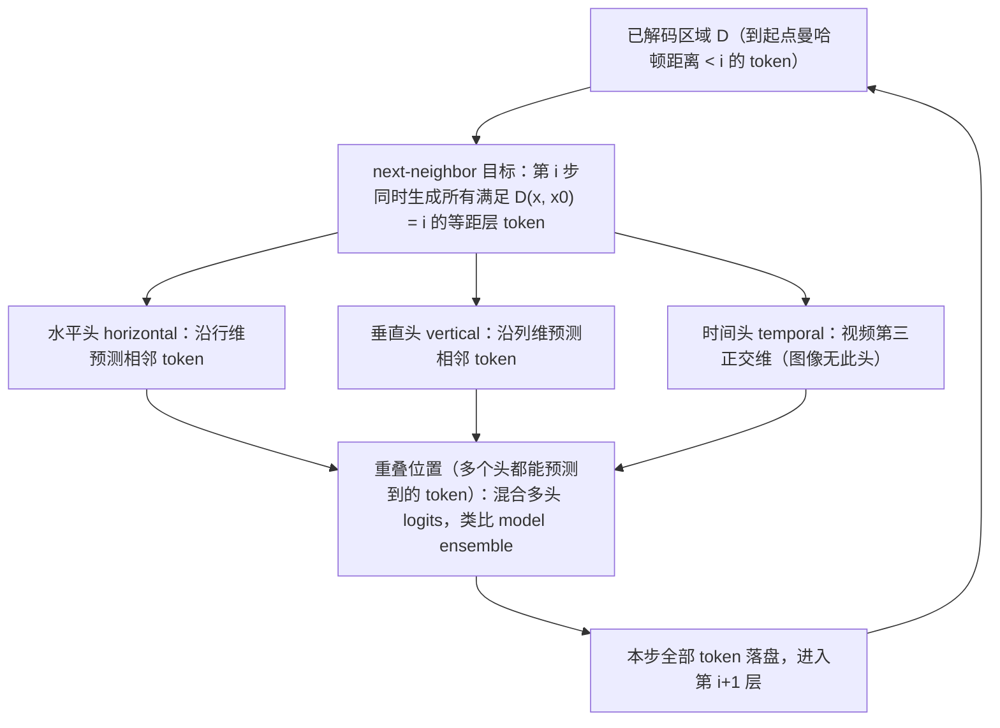

# NAR

## 论文信息

| 项 | 值 |
|---|---|
| 标题 | Neighboring Autoregressive Modeling for Efficient Visual Generation |
| 作者 / 单位 | 本次分析产物**未登记**完整作者列表与单位（主源为 arXiv LaTeXML 全文 HTML，无作者机构摘要可核）→ 按**未披露**处理，引用时不要臆造 |
| venue / 年份 | arXiv **预印本 v1**（2025-03-12，PDF CreationDate 2025-03-17）；CVPR 模板但**正文无收录声明**，会议归属**未披露** |
| arXiv | `2503.10696v1` [cs.CV]，16 页 |
| 代码仓库 | 摘要称 "Code is available at `https://github.com/ThisisBillhe/NAR`"；**本工作区未克隆、未运行、未核验** |
| papers 库 | **未入本地 papers 库**（`data/papers.db` 无 `arxiv-2503.10696`），按命名规范登记 `papers_id: arxiv-2503.10696` |

> **素材来源性质**：本篇主源为 arXiv LaTeXML 全文 HTML（另有 PDF 可核页码）。训练定位、证据等级与「不能直接套现成 NTP 权重」的判断，引用**本仓库知识库整理**（`management/docs/knowledge/视频生成训练与推理加速专题.md` §2.3，下称「**我方整理**」），属**二手性质**，正文逐处标注。**代码仓库证据未建立**，结论停留在「论文已验证」。

## 一句话总结

**NAR 是「改训练目标」的范式级加速——把 AR 视觉生成的串行解码从光栅序 next-token 改成邻域 next-neighbor**：以左上角初始 token 为中心，按**曼哈顿距离由近到远**逐圈解码，同一步内所有等距 token 一次性并行生成，于是图像步数 `n² → 2n−1`、视频 `tn² → 2n+t−2`。

- **成本口径唯一**：论文把成本定义为生成一张图/一段视频所需的**模型前向次数（Steps）**，收益也用**步数降幅 + 实测吞吐/延迟**度量；**不涉及**注意力内核、KV 缓存、量化、蒸馏或多卡（全文均未提出）。
- **并行能力写进训练目标**：新增**维度导向解码头**（图像 2 个、视频 3 个），每个头由一个 Transformer block + 一个 FC 输出层组成，各负责沿一个**正交维**预测下一个 token；同一步内的重叠位置**混合多个头的 logits**（类比 model ensemble）。
- **训练掩码是关键配套**：`proximity-aware causal mask`——**跨步因果、步内双向**，把「距离分层」编码成注意力可见性，否则并行生成会散架。
- **代价是训练前提**：结构（加解码头）与掩码都变了，属**从头训练**；直接把 NAR 解码顺序接到 NTP 目标上，NAR-L 的 FID 崩到 **66.31**（对照 LlamaGen-L 3.80）——**不能套现成 NTP 权重**。
- **复用现成单尺度 tokenizer**：不依赖 VAR 式多尺度 tokenizer，token 序列更短 → 训练/推理显存更低、可开更大 batch → 吞吐更高（论文对 VAR 的主要对照优势）。

### 四问速答

| 问题 | 回答 |
|---|---|
| ① 加速哪一段成本 | **自回归解码步数**：把训练目标从 next-token 改成 **next-neighbor**，按邻域同时生成，把「N 个 token ⇒ N 次前向」压成「**一圈等距 token 一步**」——图像 `n² → 2n−1`、视频 `tn² → 2n+t−2`。属**训练范式改造**，不是推理期调度、不是注意力内核/缓存/量化/算子优化 |
| ② 训练前提 | **从头训练（from scratch）**：需改模型结构（加维度导向解码头）与注意力 mask，复用同一 tokenizer 与训练管线；**不能直接套用现成 NTP 权重**（硬证据：去掉解码头后 FID 66.31，Table 4） |
| ③ 证据等级 | **论文已验证**（论文自训的 ImageNet 256² 类条件图像、UCF-101 类条件视频、GenEval 文生图三个 benchmark）。来源：**我方整理（知识库 视频生成训练与推理加速专题 §2.3）**。本笔记**原样带出、不升格**：**代码仓库未核验**，进不了「代码或 README 证据」或「仓库 benchmark」档 |
| ④ 报告口径 | **图像**：ImageNet 256×256、单张 **A100 80GB**、吞吐按**最大 batch** 计 → 步数 256→31、NAR-L FID 3.06 vs LlamaGen-XXL 3.09、**吞吐 13.8×**。**视频**：UCF-101、`16×128×128` → **44.0s→1.09s**、34 步。**模型规模/任务与其它加速工作不同**（类别条件小数据集、130M–1.46B），且 `44.0s→1.09s` 出自视频表、`13.8×` 出自图像表，**分属不同表/任务，不可拼成一句、也不可与其它论文直接横比** |

## 问题与动机

自回归（AR）视觉生成把一张图像展平成 raster order（行主序）的一维 token 序列，用 next-token prediction（NTP）逐个生成。成本结构因此很硬：**`n×n` 个图像 token 就要 `n²` 次前向**，视频 `t×n×n` token 更是 `t n²` 次（§2.1、§3.2）。

论文把已有的加速方向逐个否掉（§1、§2.1、Figure 3）：

- **在 NTP 框架内并行多 token**（Medusa/Jacobi/SJD、ZipAR、MAR、PAR）：把相邻**序列位置**、随机位置或空间上**相距很远**的子集同时预测；并行度越高，每个 token 的上下文越不足，质量下降，且 PAR/MAR 需要大量超参调优。
- **next-scale prediction（VAR）**：靠多尺度 tokenizer 由粗到细生成，**token 序列更长**，训练与推理显存开销更大。
- **矛盾所在**：视觉 token 有强**空间局部性**（相邻区域更相关），但光栅序把「空间相邻」拆成了序列上相隔一整行的远距离 token——**串行瓶颈是排序造成的，不是计算造成的**。

由此得到 insight：把生成建模为「**从起点向外的渐进式外绘（progressive outpainting）**」，按**到初始 token（左上角）的曼哈顿距离**由近到远逐圈扩张已解码区域。这样「离当前 token 更近的 token 一定先被解出」，**局部性被排序保证**，而同一圈（等距层）内的 token 可**同时**生成，从而把串行步数从「token 数」降到「层数」。

图 1 是全文的定位图，把「NTP 逐 token」「并行多 token」与「NAR 沿邻域外绘」放在同一张 token 网格上对照，还含 (e)(f) 的图像/视频 outpainting 流程。读图要点：NAR 的并行单位是**等距层**（同一曼哈顿距离的整圈 token），因此并行的「形状」是**由内向外扩张的波前**，而不是 ZigZag 式沿序列或跨行的跳跃。这一形状直接决定了步数公式 `2n−1`：n×n 网格上曼哈顿距离层共 `2n−1` 层。它同时暴露方法的**前提**——只有当依赖主要以「近邻」为主时，按邻域解码才不损失质量。

## 方法精析

NAR 由三个可独立读的部分组成：**(A) 解码顺序 = 曼哈顿距离等距层**（谁和谁同步）→ **(B) 维度导向解码头**（每个方向靠谁预测）→ **(C) 邻域感知因果掩码 + 重叠位置混合 logits**（怎么训练、怎么消歧）。

### A. 解码顺序：曼哈顿距离等距层

论文把第 *i* 步生成的 token 定义为「与初始 token 曼哈顿距离恰为 *i*」的集合（§3.2，式 (1)）：

$$
S=\{x_{i}\mid D(x_{i},x_{0})=i\},
$$

| 符号 | 含义 |
|---|---|
| $S$ | 当前（第 $i$ 步）生成/取出的 token 集合 |
| $x_{0}$ | 初始 token，位于图像特征图**左上角**，与光栅序对齐 |
| $x_{i}$ | 与初始 token 曼哈顿距离为 $i$ 的 token |
| $D(\cdot,\cdot)$ | **曼哈顿距离**（原文 " $D$ represents the Manhattan distance"） |
| $i$ | 生成步索引，同时等于该层的曼哈顿距离 |

**读法**：同一步 = 同一曼哈顿距离层，这是**并行粒度的唯一来源**——层内 token 之间没有先后，层与层之间严格由近到远。由此得到步数（§3.2，式 (1) 后行内式）：

$$
\text{Steps}_{\text{image}}=2n-1 \quad(\text{vs } n^{2}), 
\qquad 
\text{Steps}_{\text{video}}=2n+t-2 \quad(\text{vs } t n^{2})
$$

| 符号 | 含义 |
|---|---|
| $n$ | 图像 token 图的边长（`n×n` token）；下采样 16 时 256² 图像 → $n=16$（**由 2n−1=31 反推**） |
| $t$ | 视频时间维 token 数；UCF-101 为 `4×16×16` ⇒ $t=4,\ n=16$ |
| $n^{2}$ | vanilla next-token AR 生成一张图像的步数（每个 token 一次前向） |
| $t n^{2}$ | vanilla next-token AR 生成一段视频的步数 |
| $2n-1$ | NAR 生成 `n×n` 图像的步数（层数）；$n=16$ 时 = 31，与 Table 1 的 NAR Steps 一致 |
| $2n+t-2$ | NAR 生成 `t×n×n` 视频的步数；$n=16,t=4$ 时 = 34，与 Table 2 的 NAR Steps 一致 |

### B. 维度导向解码头（dimension-oriented decoding heads）

要让同一层内多个 token **一次前向全部产出**，模型必须能同时给出「沿不同方向的下一个 token」的条件分布，于是引入解码头（§3.1，Figure 4）：每个头 = **一个 Transformer block + 一个全连接输出层**，拼在主干之后；**每个头负责一个互相正交的维度**——

- **图像**：2 个头 —— **水平头**预测同行下一个 token、**垂直头**预测下一行同列 token；
- **视频**：3 个头 —— 再加**时间维头**（§3.1 末段、§4.1）。

推理时上一步生成的 token 作为本步输入，一步内生成全部相邻 token；**从第 3 步起出现重叠 token**（同一位置可被多个头预测到），论文对重叠位置**混合多个头的预测**（类比 model ensemble，§3.2「Inference with NAR」）。

图 2 解释「一次前向为什么能出多个方向的 token」：主干共享，在末端按**正交维**分叉出多个头，每个头只学「该维度的下一个 token」这一较简单的条件分布。读图要点是「**头数 = 正交维数**」这一设计原则：图像 2 维、视频 3 维，多了没必要、少了会塌（Table 5：只用 Horizontal 头 FID 75.91、只用 Vertical 头 25.73、两者混合 3.06）。它也提示了代价来源：多出的头会带来额外参数（Table 2 中 NAR-LP 694M vs NAR-L 369M），论文**未单列**「加头带来的参数/显存/时延增量」。

### C. 邻域感知因果掩码与重叠消歧

训练时各解码头用**交叉熵损失**；由于解码顺序由距离决定，注意力掩码必须与之一致（§3.2「Training with NAR」，Figure 5）：

- **跨步因果**：第 $i$ 步的 token 只能注意距离更近的（$<i$）已生成 token；
- **步内双向**：同一等距层内的 token 之间允许双向注意力，以增强并行生成的一致性。

推理时重叠位置的多头预测**混合 logits** 采样（论文类比 model ensemble，§3.2）。论文**未披露**混合的具体权重/融合规则，也**未给出**掩码逐元素构造公式（Figure 5 为示意）——这两点若要做二次实现是风险点。

## 训练与实现细节

| 项 | 值 | 披露状态 |
|---|---|---|
| 训练前提 | **从头训练（from scratch）**；"shares the same image tokenizer and training pipeline as vanilla next-token AR models, requiring only minor modifications to the model architecture and the attention mask"（§3.2） | 已披露 |
| 训练目标 | 各维度导向解码头用**交叉熵损失**；注意力采用 proximity-aware causal mask（跨步因果 + 步内双向） | 已披露（§3.2） |
| 骨干 | decoder-only Transformer（沿用 LlamaGen / LARP 等开源栈） | 已披露（§4.1） |
| tokenizer | 复用现成**单尺度** tokenizer：ImageNet 用 LlamaGen 的 **72M** VQVAE（下采样 16）；视频用 LARP 的 tokenizer；文生图用 LAION-COCO 微调的 LlamaGen tokenizer | 已披露（§4.1、Table 1 caption） |
| ImageNet 配方 | **300 epochs**，base lr **$10^{-4}$**，step scheduler；评测采样 **50,000** 张，ADM TensorFlow eval suite 算 FID/IS | 已披露（§4.1） |
| UCF-101 配方 | **3000 epochs**，base lr **$10^{-4}$**，step scheduler；`16×128×128` → `4×16×16` token；指标 FVD | 已披露（§4.1） |
| 文生图配方 | LAION-COCO 4M + 2M 高质量图文对；Stage1 256²/60 epochs → Stage2 512²/40 epochs；cosine-annealing lr；文本编码用 FLAN-T5 | 已披露（§4.1） |
| CFG | 图像 **2**；视频 **1.25**；Table 5 为 **2.0** | 已披露（各表 caption） |
| 训练硬件 / 成本 | 训练用卡型号、卡数、时长、总 FLOPs **未披露** | **未披露** |
| 解码头额外开销 | 加头带来的参数/显存/时延增量**未单列** | **未披露** |
| 优化器 / batch / warmup / EMA / 初始化 | **未披露** | **未披露** |
| 混合 logits 的融合系数 | **未披露** | **未披露** |
| 代码 / 权重 | 摘要给 GitHub 地址，**未核验** | **未核实** |

**一句话**：NAR 的训练流程与 vanilla NTP 近似（同 tokenizer、同管线），但**架构与掩码都变了**，因此必须重训；「训练开销更低」是相对 VAR 的**定性**说法（不依赖多尺度 tokenizer、序列更短），**未给**具体训练时长/GPU 时数/FLOPs。

## 推理与系统链路

| 阶段 | 处理 | 是否被 NAR 改变 |
|---|---|---|
| 条件输入 | 类别条件（ImageNet/UCF-101）或文本（FLAN-T5 嵌入，文生图） | 否 |
| token 生成主体 | **邻域并行解码**：按曼哈顿距离由近到远，每步产出整圈等距 token；多头混合 logits 消歧 | **是**（唯一改动点） |
| 单步前向 | 一次前向同时给出一圈内所有方向的下一个 token | 否（仍是主干前向，只是每步产出多个 token 的头分叉） |
| tokenizer 解码 | `n×n` / `t×n×n` token 图 → 像素 | 否（复用现成单尺度 tokenizer 解码器） |
| 输出 | 图像 / 视频片段 | 否 |

系统层**没有**任何 kernel、量化、序列并行、编译或多卡改造；显存收益来自「**单尺度短序列**」（§4.3 归因 "the shorter sequence length of NAR"），而非缓存复用——论文**未提出** KV cache 淘汰/压缩/分页机制。因此 NAR 与注意力内核类（FPSAttention）、系统类（DAX）工作**不同层**，理论上可叠加但**论文未验证**。

## 实验与结果

### 主结果一：ImageNet 256×256 类条件图像（Table 1，单卡 A100 最大 batch，CFG=2）

| 类型 | 模型 | Params | FID↓ | IS↑ | Steps | Throughput (img/s) |
|---|---|---|---|---|---|---|
| VAR | VAR-d16 | 310M | 3.30 | 274.4 | 10 | 129.3 |
| AR | LlamaGen-L | 343M | 3.80 | 248.3 | 256 | 47.1 |
| AR | LlamaGen-XXL | 1.4B | 3.09 | 253.6 | 256 | 14.1 |
| AR | PAR-L-4X | 343M | 4.32 | 189.4 | 67 | 93.8 |
| **NAR** | NAR-B | 130M | 4.65 | 212.3 | **31** | 419.7 |
| **NAR** | NAR-M† | 290M | 3.27 | 257.5 | **31** | 248.5 |
| **NAR** | NAR-L | 372M | **3.06** | 263.9 | **31** | 195.4 |
| **NAR** | NAR-XL | 816M | 2.70 | 277.5 | **31** | 98.1 |
| **NAR** | NAR-XXL | 1.46B | 2.58 | 293.5 | **31** | 56.9 |

- † NAR-M 与 L 同隐藏维但**少 6 层**（Table 1 caption）。
- 论文点名对照（§4.2.1）：**NAR-L（372M，3.06）优于 LlamaGen-XXL（1.4B，3.09）**，步数 **31 vs 256（−87.8%）**，吞吐 **195.4 vs 14.1 img/s（13.8×）**；**NAR-M（290M，3.27）优于 VAR-d16（310M，3.30）**，吞吐 248.5 vs 129.3（1.92×）。

> **口径警告**：摘要另写「reduces the number of generation steps by **91.8%** … lowering the FID by **0.81** over LlamaGen-XL」，与 Table 1/§4.2.1/§4.4 的 **87.8%（256→31）** 及 NAR-XL FID 2.70 vs 3.39（差 0.69）**不一致**（疑为摘要笔误）。**引用优先用表内可核数字（31 vs 256、87.8%、13.8×）**，不要只搬 91.8%/0.81。

### 主结果二：UCF-101 类条件视频（Table 2，FVD↓ / Steps / Time）

| 类型 | 方法 | Params | FVD↓ | Steps | Time (s) |
|---|---|---|---|---|---|
| AR | LARP-L-Long | 343M | 102 | 1280 | **44.0** |
| AR | MAGVIT-v2-AR | 840M | 109 | 1280 | - |
| AR | PAR-XL-4× | 792M | 99.5 | 323 | 11.27 |
| AR | PAR-XL-16× | 792M | 103.4 | 95 | 3.44 |
| **NAR** | NAR-L | 369M | 96.2 | **34** | **1.09** |
| **NAR** | NAR-LP† | 694M | 71.1 | **34** | 1.30 |

- † NAR-LP 与 XL 同隐藏维但**少 6 层**（Table 2 caption）。
- 论文点名对照（§4.2.2）：vs **LARP-L-Long**（同 video tokenizer、参数相当）FVD **−5.8**（102→96.2）、生成延迟 **−97.5%**（**44.0s→1.09s**）。
- 摘要「FVD **71.1** 且步数 −**97.3%**」对应 NAR-LP；**97.3%** 由 1280→34 推得（**我的解释**，以 1280 步的 AR 基线为准）。
- 摘要「**8.6×** higher throughput」在 Table 2 **无吞吐列**，只能由时间比推得（11.27s÷1.30s≈8.67，**我的解释**），原文写作 throughput，**口径未明说**。

### 主结果三：GenEval 文生图（Table 3）

| 模型 | Params | Training Data | Overall | Throughput (img/s) |
|---|---|---|---|---|
| LlamaGen-XL† | 0.8B | 60M | 0.32 | 3.40 |
| Chameleon† | 7B | 1.4B | 0.39 | 0.09 |
| SDv1.5 | 0.9B | 2B | 0.43 | 0.44 |
| **NAR-XL** | 0.8B | **6M** | **0.43** | **15.0** |

**NAR-XL 只用 6M 公开图文对**，overall 0.43 对 LlamaGen-XL 0.32（用 10% 数据、**4.4×** 吞吐），并超过 7B/1.4B 数据的 Chameleon（0.39），与扩散 SDv1.5 相当（0.43）而仅用其约 0.3–0.4% 训练数据（§4.2.3）。

### 部署效率（§4.3 + Figure 6）

- 延迟：batch<32 时 VAR-d16 延迟**更低**（解码期显存瓶颈）；batch=256 时 NAR-M **1.13s** vs VAR-d16 **2.02s**（−44%）。
- 吞吐：A100 80GB 下 VAR-d16 最大 batch 256 → **129.3 img/s**；NAR-M 最大 batch 512 → **248.5 img/s**（**+92.1%**，相对 LlamaGen-L **5.2×**）。
- 显存：同 batch 下 NAR-M 一致低于 VAR-d16（归因 NAR 序列更短）。
- 注意：**小 batch 下 NAR 不占优**（Figure 6a），收益来自「batch 放大 + 序列缩短」，不是全区间领先。

### 消融

| 方法 | 维度导向头 | Steps | FID↓ | 说明 |
|---|---|---|---|---|
| LlamaGen-L | ✗ | 256 | 3.80 | NTP 基线 |
| NAR-L | ✗ | 31 | **66.31** | 去掉解码头、只按邻域并行 ⇒ 崩 |
| NAR-L | ✓ | 31 | **3.06** | 有头 + 同 pipeline/超参 |

| 头配置（重叠位置） | FID↓ | IS↑ |
|---|---|---|
| 仅 Horizontal | 75.91 | 22.36 |
| 仅 Vertical | 25.73 | 96.08 |
| **Mixed（多头混合）** | **3.06** | **263.9** |

**读法**：Table 4 是「**不能套现成 NTP 权重**」的硬证据——解码顺序改了却沿用单头/旧目标，质量崩塌；Table 5 说明重叠位置**必须混合多头**预测，单头不可用。

图 3 是 NAR 视频侧唯一的定性证据（附录 A），用于说明邻域并行解码在**时序上的自洽性**：逐带外绘生成的连续帧没有出现明显的时序跳变。读图要点是它的**证据强度有限**——它是**定性画廊**（10 类 UCF-101 动作、16 帧、128×128），不含数值；视频的定量结论仍以 Table 2 的 FVD/Steps/Time 为准，且论文自陈**未在真实大规模视频数据上训练**，因此不能据此推断「通用文生视频」能力。

### 报告口径与边界（不可与其它论文直接横比）

| 维度 | 论文口径 | 边界 |
|---|---|---|
| 硬件 | 吞吐 "measured with the maximum batch size supported on a **single A100 GPU**"，§4.3 用 **A100 80GB** | 单卡；**多卡/分布式全文未提及** |
| 任务 / 规模 | ImageNet 256²（130M–1.46B）、UCF-101 `16×128×128`（369M/694M）、GenEval（0.8B/6M） | 视频为**类别条件小数据集**，非大规模文生视频；任务与规模**与其它加速工作不同** |
| tokenizer | NAR/LlamaGen/PAR 用 72M VQVAE（rFID=**2.19**）；VAR 用 108M（rFID=**1.00**） | 两个不同 FID 上界，**FID 不可跨这两组直接横比** |
| 吞吐 | 单卡**最大 batch** 下的 img/s | **不是同 batch、也不是延迟**；跨硬件/batch/精度不可比 |
| 数字拼接 | `44.0s→1.09s` 出自 **Table 2（视频）**；`13.8×` 出自 **§4.2.1/Table 1（图像，NAR-L vs LlamaGen-XXL）** | **两者分属不同表/任务**，不可拼成「UCF-101 加速 13.8×」 |

## 相关工作与定位

| 类别 | 代表工作 | 与 NAR 的差异 |
|---|---|---|
| NTP 框架内并行多 token | Medusa、Jacobi / SJD、ZipAR | 按**序列**或**随机**方向并行、并行度越高上下文越不足；ZipAR 免训练、NAR 改训练目标 |
| 空间子集并行 | PAR | 把 token 切成空间上**相距很远**的子集，子集内仍 NTP；NAR 按**邻域**整圈并行，无需超参搜索 |
| 随机序生成 | MAR | 随机位置并行，依赖不同训练目标 |
| next-scale prediction | VAR | 需**多尺度 tokenizer**、token 序列更长、显存更高；NAR 单尺度、序列更短 |
| 免训练调度 | ZipAR（同作者线） | 零训练、只改推理调度；NAR **从头训练**改范式 |
| 定位（**我方整理**） | `knowledge/视频生成训练与推理加速专题.md` §2.3 | 三分法：**ZipAR=推理调度（零训练）／FlashAR=后训练加头／NAR=从头训练改范式**；三者在「训练代价光谱」上递增，与扩散式（Ditto/Avatar Forcing）**不是即插即用关系**，价值在于「若自训 AR 视觉模型，如何从训练目标消除串行瓶颈」 |

## 局限与启发

### 论文自陈与素材层面的局限

1. **tokenizer 中等规模**：为保证与 [44,58] 公平比较用了中等图像 tokenizer，与更强 tokenizer 结合留作 future work（§5）。
2. **视频仅 UCF-101 类条件**：16 帧 128×128、10 类级，未在大规模视频数据训练（§5）。
3. **文生图单一规模**：仅 NAR-XL 一个规模、6M 数据。
4. **内部数字不一致**：摘要 91.8%/0.81 与 Table 1 的 87.8%/0.69 冲突（原文如此，未解释）。
5. **训练成本未量化**：只说「substantially reduces training overhead」并给「序列长度平方」的定性理由，**未给**时长/GPU 时数/FLOPs。
6. **解码头增量未单列**：Table 1/2 只给总参数量，未给「加头」的额外参数/显存/时延占比。
7. **掩码与混合规则未披露**：proximity-aware mask 的逐元素构造、重叠位置 logits 融合系数均**未披露**。
8. **证据边界**：arXiv v1 预印本、无同行评审；代码仓库**未核验**。

### 论文局限 vs 我们结论

**我方未接入 NAR**（本地无对应 NTP/邻域 AR 视觉训练链与权重），下表只记**定位与可复用点**，不给任何「本地可用」承诺：

| 维度 | 论文口径 | 我们的结论 |
|---|---|---|
| 本地是否接入 | — | **未接入**；本地无语料/权重对应此范式，仅作方法参考 |
| 加速的是哪一段 | 解码步数（前向次数）+ 序列缩短带来的显存/吞吐 | **自回归解码步数**（训练范式改造）；不涉及注意力内核、缓存、量化、系统层 |
| 训练前提 | 需改结构+掩码，复用同 tokenizer/管线 | **从头训练**；**不能直接套现成 NTP 权重**（硬证据 FID 66.31） |
| 证据等级 | Table 1–5、Figure 6；代码链接未核验 | **论文已验证**，来源：**我方整理（知识库 视频生成训练与推理加速专题 §2.3）**；**不升格** |
| 报告口径 | ImageNet 256² / UCF-101 / GenEval，单卡 A100 80GB，吞吐按最大 batch | UCF-101 上 **44.0s→1.09s**、吞吐 **13.8×（图像侧）**；模型规模/任务与其它加速工作不同，**不可直接横比** |
| 视频 / 数字人可用性 | 论文**未验证**大规模视频/真实人像 | **待自测**；迁移到 talking-head 实时场景属**外推**，无直接证据（论文无数字人场景） |
| 本地复现成本 | 无推理捷径，必须从头训练 | **高**（相对 ZipAR 的零训练、FlashAR 的后训练）；训练成本**未披露**，无法估工 |
| 可复用点 1 | 「等距层」解码顺序（式 1） | **思想可搬**：把生成顺序从光栅序改为距离分层，是消除串行瓶颈的通用思路 |
| 可复用点 2 | 维度正交解码头 + 邻域感知掩码 | **设计原则可搬**：多位置并行解码需为每个方向配独立条件分布头，并让掩码与解码顺序一致 |
| 可复用点 3 | 重叠位置多头混合 logits | **工程可搬**：并行解码出现「同位置多预测」时，混合优于任选一头（Table 5） |
| 与本地其它路线的关系 | 与 ZipAR / FlashAR 并列 | 三者是「**训练代价递增**」光谱：ZipAR 零训练、FlashAR 后训练、NAR 从头训练；NAR **不能**加速现有扩散式数字人管线 |

### 可操作启发

1. **归类到「减少串行解码步数」而非「注意力加速」**：引用时写「训练范式改造（从头训练）」，与 kernel/量化/系统路线分层。
2. **四问必须前置**：任何 NAR 数字都建立在**从头训练**上；用 Table 4 的 66.31 作为「不能套现成 NTP 权重」的硬证据，避免读者误以为可即插即用。
3. **引用数字必带口径**：任务 + 分辨率 + 硬件（单卡 A100 80GB）+ batch 策略，并显式声明**不可跨论文横比**（tokenizer rFID 上界不同）。
4. **不拼数字**：`44.0s→1.09s`（视频）与 `13.8×`（图像）分属不同表，**不要并成一句**；91.8%/0.81 若必须提，标注「原文如此，与正文表不符」。
5. **迁移措辞**：写「NAR **未验证**数字人/大规模视频；本地接入属**待自测**」，并注明这是**我方整理/推断**，不是论文结论。

## 术语与符号表

| 术语 | 英文 | 含义 |
|---|---|---|
| 邻域自回归建模 | Neighboring Autoregressive Modeling (NAR) | 本文范式：把 AR 视觉生成表述为渐进式外绘，按到起点的曼哈顿距离由近到远解码 |
| 下一邻域预测 | next-neighbor prediction | 相对 next-token 的新目标：每步预测「已解码区域的全部相邻 token」 |
| 下一 token 预测 | next-token prediction (NTP) | 经典自回归目标，按光栅序逐个生成；本文的加速基准 |
| 光栅序 | raster order | 视觉 token 从左到右逐行展平成一维序列 |
| 视觉局部性 | visual locality | 相邻像素/token 更相似；NAR 排序的动机 |
| 外绘 | outpainting / progressive outpainting | 从初始区域向边界外逐步扩展生成，NAR 借用此比喻 |
| 曼哈顿距离 | Manhattan distance | 决定生成顺序的度量 $D(\cdot,\cdot)$ |
| 维度导向解码头 | dimension-oriented decoding head | 每个头沿一个正交维预测下一 token；图像 2（行/列）、视频 3（时间/行/列） |
| 水平头 / 垂直头 | horizontal / vertical head | 分别预测同行下一 token、下一行同列 token |
| 邻域感知（因果）掩码 | proximity-aware (causal) attention mask | 跨步因果、步内双向的训练掩码 |
| 双向注意力 | bidirectional attention | 步内（等距）token 互相可见，提升并行一致性 |
| 混合 logits 采样 | mixed logits / model ensemble | 重叠位置混合多头预测，Table 5 证明优于单头 |
| 生成步 | Step / forward pass | 一次模型前向产生的整圈等距 token；文中的采样成本单位 |
| 吞吐 / 延迟 | throughput / latency | 单卡 A100 最大 batch 下的 img/s / 单次生成墙钟时间 |
| 图像 tokenizer | image/visual tokenizer | 把像素压成离散 token；NAR 复用现成单尺度 tokenizer |
| 重建 FID | rFID | tokenizer 自身重建质量，作为生成 FID 的**上界** |
| FID / IS / FVD | （指标） | 图像 FID↓/IS↑；视频 FVD↓ |
| GenEval | GenEval | 文生图细粒度 benchmark，总分 Overall |
| 无分类器引导 | classifier-free guidance (CFG) | 图像用 2、视频用 1.25（Table 5 用 2.0） |
| 下一尺度预测 | next-scale prediction | VAR 范式，NAR 的对照项 |

| 符号 | 含义 |
|---|---|
| $n$ | 图像 token 图边长（`n×n`）；下采样 16 时 256² → $n=16$ |
| $t$ | 视频时间维 token 数；UCF-101 为 $t=4$ |
| $x_{0}$ | 初始 token（左上角，与光栅序对齐） |
| $x_{i}$ | 与起点曼哈顿距离为 $i$ 的 token |
| $D(x_i,x_0)$ | $x_i$ 到起点的曼哈顿距离 |
| $S$ | 第 $i$ 步生成的等距层 token 集合 |
| $i$ | 生成步索引（= 曼哈顿距离层号） |
| $S_n$ | 第 $n$ 个生成步（Figure 5 掩码示意用） |
| $L$ | 骨干 Transformer block 数（Figure 4） |
| $2n-1$ / $2n+t-2$ | NAR 图像 / 视频生成步数 |
| $n^{2}$ / $t n^{2}$ | vanilla next-token AR 图像 / 视频步数 |

## 相关文档

- 加速专题与定位：[[knowledge/视频生成训练与推理加速专题|视频生成训练与推理加速专题]] §2.3（本笔记的证据等级与训练要求来源）、[[数字人概述/数字人加速|数字人加速]]
- 同组对照（自回归并行三路线）：ZipAR（[[论文笔记/zipar|ZipAR 模型笔记]]，零训练推理调度）与 FlashAR（`flashar.md`，后训练加头）——FlashAR 仍为「待写」，建成后回补链接；NAR 位于「从头训练」一端
- 相邻方向对照：[[论文笔记/fpsattention|FPSAttention 模型笔记]]（训练阶段注意力侧）、[[论文笔记/blade|BLADE 模型笔记]]（块稀疏 + 步数蒸馏联合训练）、[[论文笔记/latent-spatial-memory|Latent Spatial Memory 模型笔记]]（长视频缓存侧）
- 篇目与索引：[[论文笔记/README|论文笔记]]（本篇属「生成侧加速十篇」，papers 库未入库，仅登记 arXiv）
