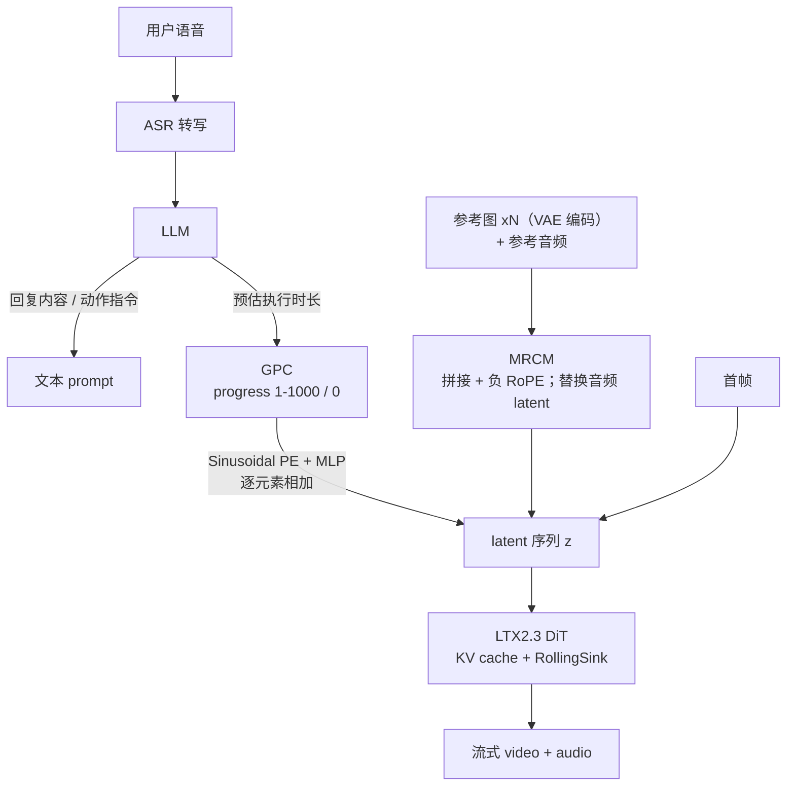
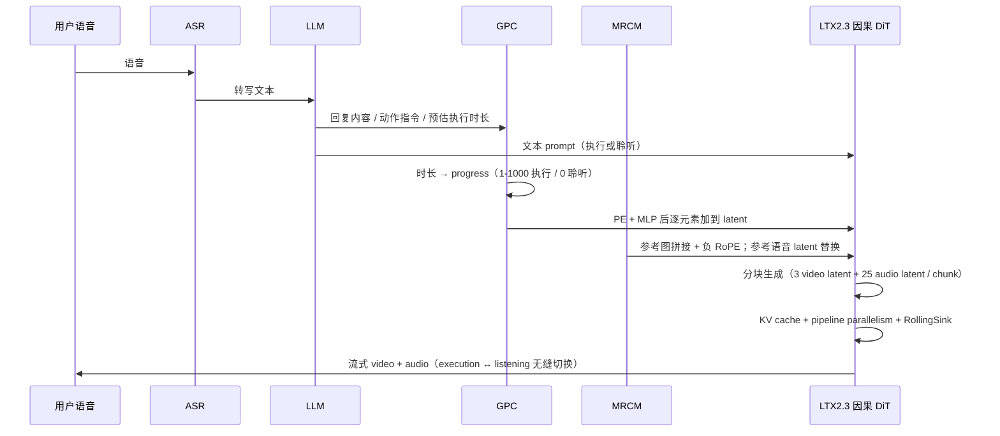

# OmniMate

## 论文信息

| 项 | 值 |
|---|---|
| 标题 | OmniMate: Open-Ended Real-Time Streaming Audio-Visual Generation for Interactive Avatars |
| 作者 | Quanyue Song、Yishan He、Yanbo Ding、Zhixiang He、Yongxiang Li、Caigui Jiang†、Zhizhi Guo†（†通讯） |
| 单位 | 西安交通大学（人机混合增强智能全国重点实验室 / 人工智能与机器人研究所）、中国电信人工智能科技（北京）有限公司、中国科学院深圳先进技术研究院（深圳市计算机视觉与模式识别重点实验室） |
| venue / 年份 | arXiv `2607.23023`（模板为 AAAI 2027，**未见录用标注**，本篇不声明会议） |
| arXiv | `2607.23023v2`（`[cs.CV]`，2026-07-25；v2 2026-07-28） |
| 项目页 / 代码仓库 | 未披露（源码中 `\begin{links}` 代码/数据链接块整体被注释） |
| papers 库条目 | `arxiv-2607.23023`（本篇**未作为独立 arXiv 条目入本地资料集**，`papers/data/` 下只有 `blog_papers.json`；`data/papers.db` 里该行 `source=blog`，来自博客精读导入，papers_id 按命名规范登记） |
| 历史博客精读 | `omnimate-2026`：数字人论文精读（六十七）：OmniMate，开放式流式的音视频联合交互 Avatar |
| 作者备注 | 第一作者标注「在中国电信人工智能科技（北京）实习期间完成」 |

## 一句话总结

**把「这条回应还要说多久」从隐含状态变成显式连续条件注入生成过程（GPC），再把身份从「最近的上下文」挪到「常驻的参考条件」（MRCM）——两个并列机制叠在同一个 LTX2.3 音视频骨干上，用四阶段蒸馏把它压成因果流式。**

图上给的是任务的完整能力面：同一段流式生成里要同时出**语音、面部动作、肢体动作与动作相关音效**（如鼓掌），并且要能在 **Execution State 与 Listening State 之间来回切**；左侧是三类条件入口（参考图、参考音频、首帧），中间是 LLM 给出的 Execution Prompt / Listening Prompt / 预估时长，右侧是长时一致与实时两个卖点。

- **GPC（Generation Progress Controller，生成进度控制器）**：给每个流式 chunk 一个显式进度值，`1–1000` 表示执行中、`0` 表示聆听中，让模型按计划说完并切回聆听；同时抑制过期历史 chunk 的影响，使新指令能低延迟接管。
- **MRCM（Multi-Reference Conditioning Module，多参考条件模块）**：多张参考图提供跨视角视觉身份线索，一段参考语音提供音色线索，两者共同对抗长时跨模态身份漂移。
- **轻量适配**：不改架构范式，在现成统一音视频模型 LTX2.3 上做流式化适配（论文用词 *lightweight adaptation*），对比 StreamChar / WanStream 的「大规模训练数据或大量额外参数」。
- **实时主张**：在交互化的 VerseBench 上自报 **27.64 FPS / TTFF 3.49s**，为同表最快；但这一列的口径风险见第 6 节。
- **可信度边界**：指标定义全部写在「appendix」里而本地 arXiv 版本**没有 appendix**，因此 13 个指标的实现口径**均未披露、不可复现验证**；且 AQ / VQ / Sync-D / LSE-C 四项并非第一。

## 问题与动机

论文把开放时长交互式音视频生成的两个难点并列提出，并让它们各自对应一个模块（Abstract；§Introduction p1–p2）。

1. **生成地平线（generation horizon）未知**。语音驱动视频生成通常有预定义语音段，模型知道该生成多长；交互式流式则要在不知道「指令内容是否已表达完」的情况下持续生成回应。后果是模型判不出何时该结束 execution 并切回 listening。论文把两条朴素解法都否掉：**固定生成时长**会截断未说完的回应或产生冗余语音与动作；**显式完成检测**会引入额外延迟、破坏实时交互。→ 对应 **GPC**。
2. **长时跨模态身份漂移**。时序上下文有限使身份线索逐渐衰减：单图或短相邻 chunk 在未见姿态/视角下保不住视觉身份（视觉漂移）；语音上下文有限则使多轮之间音色不一致（音色漂移）。→ 对应 **MRCM**。

两个问题的共同技术根因是同一件事：**流式生成能用到的上下文是有限的，而「进度」和「身份」恰恰是两类容易被有限上下文丢掉的全局信息**——一个属于时间轴，一个属于身份轴。论文的 insight 是把这两类信息从「必须从历史里读出来」改成「作为条件显式注入」。

| 路线 | 做法 | 论文指出的代价 |
|---|---|---|
| 离线双向 attention（Ovi-1.1 / MOVA / UniVerse-1 / DaVinci-Base / LTX-2.3） | 整段并行去噪 | 效率低：表 1 中 TTFF 从 45s 到 658s，无法交互 |
| 实时因果 attention（OmniForcing / Hallo-Live） | 蒸馏成因果、逐块生成 | 论文称其难以准确完成 listening↔execution 切换 |
| 大规模流式适配（StreamChar / WanStream） | 实时交互式音视频 | 依赖大规模训练数据或需额外训练大量参数的模型 |
| **OmniMate** | LTX2.3 轻量适配 + 显式进度条件 + 常驻身份条件 | 进度依赖 LLM 时长估计（见第 8 节局限） |

## 方法精析

主链路可以概括成一句话：**一路条件管「说到哪里了」（控制信号），一路条件管「像谁」（身份条件），两路同时注入同一个 DiT 骨干的 latent 序列**（§Overview；Figure 2）。

**引用这张图要先对齐字母**：TeX 图题写作「(a) 流式推理管线 / (b) GPC / (c) MRCM」，但图版实际排版是 **(a) Streaming Inference / (b) MRCM / (c) GPC**（图内文字可核对）。本笔记引用时以图内字母为准。

### 统一音视频骨干

骨干是 **LTX2.3**（论文理由：在生成质量与效率之间取得较好平衡），改造点集中在条件注入与流式化，不在架构。Figure 2 的 DiT Block 里可见 Video/Audio SelfAttn、V-VAE CrossAttn、Audio Text CrossAttn、V-A / A-V 互模块 FFN 与 V-VAE / A-VAE 解码器；编码器入口标有 **Only First Chunk**。训练/推理 480p 自适应长宽比（DMD 蒸馏阶段 384p）、每 chunk **3 个视频 latent + 25 个音频 latent**（§Experimental Setup）。

**未披露**：DiT 层数/隐藏维、参数量、音视频分支的具体结构改动、ASR 与 LLM 的型号。

### GPC：把进度做成可加的连续条件

GPC 由三部分组成：进度值定义、进度信号的注入方式、以及为了让模型学会「按进度切状态」而设计的数据构造与联合训练。三者的分工必须分清，否则很容易把训教师用的掩码当成推理时的控制器。

### 进度值：执行期 1–1000，聆听期 0

先由 LLM 预估的执行时长确定需要生成多少 token，再把这些 token 铺满 `1–1000`。视频是**帧级**定义：

$$
p_i^v = 1+\frac{i-1}{T_v-1}\times999,\quad i=1,\dots,T_v
$$

| 符号 | 含义 |
|---|---|
| $p_i^v$ | 第 $i$ 个视频帧的生成进度值，执行期落在 $[1,1000]$ |
| $T_v$ | 该段视频的帧数 |

音频是**token 级**定义，公式形状相同但定义域不同：

$$
p_j^a = 1+\frac{j-1}{T_a-1}\times999,\quad j=1,\dots,T_a
$$

| 符号 | 含义 |
|---|---|
| $p_j^a$ | 第 $j$ 个音频 token 的进度值 |
| $T_a$ | 该段音频的 token 数；与「每 chunk 25 个音频 latent」的换算关系论文未披露 |

两式都是**把离散序号线性映射到 1–1000 的连续区间**，端点固定：第一个 token 是 1、最后一个必须是 1000。这样「进度」既是位置也是剩余量——模型看到 999 就知道该收尾了。**超出预估时长的 token 一律赋 0，0 即聆听状态**。这是全篇最关键的语义约定：execution 与 listening 在条件空间里是**同一维度的两个取值**，而不是两个开关。

视频侧还有一个对齐细节：首个视频 latent 只对应 1 帧，后续每个 latent 代表 8 帧，因此把首帧进度**重复 8 次**，其余每 8 个帧级 embedding 聚合成 1 个 latent token，形状变换为 `[B,T_v+7,D] → [B,(T_v+7)/8,8D]`。音频侧不存在这一层聚合。

### 注入方式：相加，不是 cross-attention

进度信号经**正弦位置编码（PE）**与**多层 MLP** 编码后，**逐元素相加**到对应模态的 latent 上：

$$
\tilde{z}^{m}=z^{m}+\mathrm{MLP}(\mathrm{PE}(p^{m})),\quad m\in\{a,v\}
$$

| 符号 | 含义 |
|---|---|
| $z^m$ / $\tilde{z}^m$ | 原始 / 进度条件化后的 latent；$m\in\{a,v\}$ 表示音频或视频 |
| $\mathrm{PE}(\cdot)$ | Sinusoidal Positional Encoding（灵感来源论文标注为 OmniAvatar） |
| $\mathrm{MLP}(\cdot)$ | 多层感知机；**层数、宽度、进度 embedding 维度均未披露** |

**「相加」这一点必须记住**，因为消融表里专门把它换成了 cross-attention 版本作对照（`Use CrossAttn`），而论文报告该变体会产生「标题式叠字（title-like overlays）」并在聆听态错误压暗画面。**我的解释（非论文声明）**：加法注入让进度信号**无法被注意力忽略**，而 cross-attention 注入相当于把进度当作一个可被软忽略的语义 token，这可能是两者行为差异的来源。

### 状态切换数据怎么造：掩码 + 条件插值

要训练 GPC 学会「按 progress 切状态」，就得有一批带明确状态边界的数据。论文用**已 DMD 蒸馏的双向 teacher** 生成同时含执行与聆听的序列，并把不同去噪时间步的 latent 轨迹记录下来作监督。给定过渡边界 $\tau$，定义二值分段文本交叉注意力掩码：

$$
m_i=\begin{cases}1, & i < \tau,\\0, & \text{otherwise},\end{cases}
$$

| 符号 | 含义 |
|---|---|
| $m_i$ | 第 $i$ 个 latent 的分段文本交叉注意力掩码 |
| $1$ / $0$ | 执行状态 / 聆听状态 |
| $\tau$ | 状态过渡边界；**其采样分布与每条序列的切换次数未披露** |

第 $i$ 个 latent 拿到的文本条件是两端 prompt 的线性插值：

$$
P_i=m_iP_{\mathrm{exec}}+(1-m_i)P_{\mathrm{listen}}
$$

| 符号 | 含义 |
|---|---|
| $P_i$ | 第 $i$ 个 latent 的文本条件 |
| $P_{\mathrm{exec}}$ | 执行提示（execution prompt） |
| $P_{\mathrm{listen}}$ | 通用聆听提示（generic listening prompt） |

因为 $m_i$ 是二值的，上式实际是「按 $i$ 与 $\tau$ 的关系二选一」。通过变化初始状态与边界，论文构造出四类序列：**only execution、execution→listening、listening→execution、listening→execution→listening**。

这里有一个「为什么不用更简单方案」的关键论证：论文明确**弃用原始多步扩散 teacher**，改用 DMD 蒸馏后的双向 teacher，原因是前者存在 **temporal prompt leakage（时间提示泄漏）**——语义会跨过渡边界传播，使实际切换点偏离预设边界，监督信号不可靠。这是第 4 节第 ② 阶段存在、且消融里单列 `w/o DistillTeacher` 的原因。

### 联合训练时，student 只靠 progress 切状态

- **ODE 初始化阶段**：student 的视频/音频文本 cross-attention **全程只条件于执行 prompt**，状态切换**完全由注入的 progress 值控制**（1–1000 为执行、0 为聆听），由上面构造的序列监督。
- **后续 DMD 蒸馏阶段**：student 保持同一 progress 条件策略不变；改动在 **real / fake score 网络**——它们改用 **state-aware text conditioning**，按时间 token 选择执行或聆听 prompt。这样做的目的是把 teacher 的切换行为迁移给 student，而**推理时 student 只靠 progress 就能切**。

也就是说，掩码 $m_i$ 与插值 $P_i$ 是给**教师与 score 网络**用的；部署时真正驱动状态的只有 progress 值。理解这一点才不会把「数据构造的二值掩码」与「推理期的连续进度」混为一谈。

### MRCM：两条身份条件，一条要训练、一条不要

MRCM 的两条支路机制**不同质**，这也是它容易被读成一个整体模块的原因。

### 视觉身份：多参考图沿时间维拼接 + 负 RoPE（需训练）

给定 $N$ 张参考图，先编码成 latent：

$$
z_i^{ref}=E_{\mathrm{VAE}}(I_i), \quad i=1,\dots,N
$$

| 符号 | 含义 |
|---|---|
| $I_i$ | 第 $i$ 张参考图 |
| $E_{\mathrm{VAE}}(\cdot)$ | VAE 编码器（结构未披露） |
| $z_i^{ref}$ | 第 $i$ 张参考图的 latent |
| $N$ | 参考图数量：训练随机采 **4 帧**身份相关帧，推理最多 **4 张**、不足则 duplication 补齐 |

这一步只是把参考图搬到与生成同构的 latent 空间，还没有和生成过程发生关系——真正让它们「常驻」的是下面的拼接。

再与噪声视频 latent 沿**时间维**拼接：

$$
z_t^{in}=[z_1^{ref},z_2^{ref},...,z_N^{ref},z_t]
$$

| 符号 | 含义 |
|---|---|
| $z_t$ | 生成视频的噪声 latent |
| $z_t^{in}$ | 参考 latent 与噪声 latent 沿时间维拼接后的输入序列 |

为避免参考 token 干扰生成帧的时间位置，论文对参考 token 施加 **negative RoPE（负 RoPE）**。多视角参考比单图提供更丰富的身份线索，这是「大姿态/视角下保身份」的机制来源。**未披露**：duplication 的具体策略、负 RoPE 的具体取法、VAE 结构。这条支路参与第 1 阶段微调，所以是**需要训练**的。

### 说话人身份：推理期替换音频 latent（training-free）

音色支路**不训练**（论文原文 *training-free speaker identity conditioning strategy*）：先用模型自己产生的固定 **warm-up utterance** 初始化生成，去噪过程中把对应位置的音频 latent 换成参考语音 latent：

$$
z_t^{a} = \begin{cases} z_{\mathrm{ref}}^{a}, & \text{with reference audio},\\ z_{\mathrm{gen}}^{a}, & \text{otherwise},\end{cases}
$$

| 符号 | 含义 |
|---|---|
| $z_t^{a}$ | 实际使用的音频 latent |
| $z_{\mathrm{ref}}^{a}$ | 参考语音 latent |
| $z_{\mathrm{gen}}^{a}$ | 无参考音频时保留的原生成音频 latent |

**未披露**：warm-up utterance 的长度、文本与作用区间，替换发生在哪些时间位置，以及它与 KV cache 的交互细节。注意「training-free」只承诺**这一步替换不需要额外训练**，不能推广成「MRCM 整体免训练」——视觉支路是参与训练的。

### 两机制的关系

| | GPC（控制信号） | MRCM（身份条件） |
|---|---|---|
| 回答的问题 | 何时说、何时停（时间轴） | 像谁（身份轴） |
| 条件来源 | LLM 预估执行时长 | 多参考图 + 参考语音 |
| 注入方式 | PE + MLP 后**逐元素相加**到 latent | 视频：时间维**拼接** + 负 RoPE；音频：**条件替换** latent |
| 是否训练 | 是（ODE 初始化 + DMD 两阶段） | 视觉支路是；说话人支路 training-free |
| 消融证据 | Speech↓ 与状态切换 | A-ID / V-ID |

两者在功能上正交、共用同一注入点（latent 序列），因此论文把它们放进同一张消融表横向对比是合理的；但**论文没有显式讨论二者的耦合**——这一点属我的归纳，不是论文声明。

## 训练与实现细节

图内四块对应下面四个阶段的机制依赖：(a) 双向 teacher 的 DMD 蒸馏；(b) 用分段 TextAttn 掩码构造带状态切换的数据；(c) ODE 初始化（student 用 causal mask、MSE 回归 latent 轨迹）；(d) 用 DMD 继续蒸馏因果 student（带视频/音频 KV-cache）。图内还出现 `Bi-Student DMD`、`ODE Init`、`Pred Time: 8.0s`、`Video: 193 frames` 等文字，这些**正文没有对应定义**，引用时需注明来自图内。

### 四阶段训练（顺序不可打乱）

1. **微调 LTX2.3 的视觉身份条件**。对应 MRCM 视觉支路，把多参考图条件接进骨干。
2. **DMD 蒸馏出少步双向 teacher，并构造状态切换 ODE 轨迹**。teacher 生成执行/聆听混合序列，记录不同去噪步的 latent 轨迹，作为第 3 阶段的监督（对应上文对 τ 的采样与 $m_i$/$P_i$ 的构造）。**此阶段的关键选择是弃用原始多步 diffusion teacher**（temporal prompt leakage），消融里单列为 `w/o DistillTeacher`。
3. **ODE 初始化：联合优化 GPC 与学生模型（causal attention mask）**。student 的文本 cross-attention 只吃执行 prompt，状态切换全靠 progress。
4. **self-forcing DMD 再蒸馏**。把第 3 阶段的结果继续蒸馏成实时因果模型；此阶段约束每个 chunk 只允许关注 **reference chunk、first chunk 与两个相邻 chunk**，在强制自回归行为的同时提升长时连续性与稳定性。

必须分清：第 ② 阶段的「DMD 蒸馏教师」与第 ④ 阶段的「DMD 再蒸馏 student」是两个不同对象，第 ③ 阶段的「ODE 初始化」是独立的中间阶段——论文把它们写在一段话里，容易误读成三阶段。

### 配置披露表

| 项 | 值 / 状态 | 来源 |
|---|---|---|
| Backbone | LTX2.3（原文亦写作 LTX-2.3） | §Related Work；§Experimental Setup |
| 分辨率 | 480p 自适应长宽比；DMD 蒸馏阶段 384p | §Experimental Setup |
| 流式 chunk 尺寸 | 每 chunk 3 个视频 latent + 25 个音频 latent | §Experimental Setup |
| 四阶段步数 | 50K / 5K / 8K / 5K | §Experimental Setup |
| 学习率 | 非 DMD 阶段 $2\times10^{-5}$；DMD 阶段 student / fake score 为 $2\times10^{-6}$ / $4\times10^{-7}$ | §Experimental Setup |
| 并行 / 硬件 | FSDP；32 × NVIDIA H100 | §Experimental Setup；表 1 图注 |
| 推理加速 | KV cache + pipeline parallelism | §Experimental Setup |
| 长时稳定性机制 | RollingSink（机制未展开，仅给引用） | §Training and Streaming Inference |
| chunk 注意力范围 | reference chunk + first chunk + 两个相邻 chunk | §Training and Streaming Inference |
| 优化器 / batch size / 随机种子 | **未披露** | — |
| 训练片段时长、预处理与过滤准则 | **未披露**（只说「过滤后约 300 万」） | §Dataset |
| 时长估计模型（ASR / LLM） | **未披露** | §Overview |
| 损失函数定义 | **未披露**（正文无 DMD loss / MSE loss 公式，仅 Figure 3 图内有 `DMD Loss` / `MSE Loss` 标签） | §Method |

### 数据

约 **300 万**条过滤后高质量 clip，三类来源：① 公开 talking-head 数据集 HDTF / VFHQ / VoxCeleb2 / CelebV-Text / AVSpeech；② OpenHumanVid（影视通用视频，补场景与动态多样性）；③ **自建**中英文高质量 talking-head 数据集（含长时对话序列）。**未披露**：自建数据规模、许可、采集方式与三类来源配比——这意味着训练数据**不可得**。

## 推理与系统链路

推理链路的输入是首帧 + 可选参考图 + 可选参考音频 + 用户语音，输出是实时流式音视频（§Overview；§Training and Streaming Inference）。

要点：

1. **控制信号与身份条件在同一个注入点汇合**。progress 经 PE + MLP 加到 latent，参考图 latent 沿时间维拼在 latent 序列前段并加负 RoPE，参考语音 latent 在去噪中替换对应位置——三路都落在 latent 序列上。
2. **状态切换由 progress 驱动**，文本条件本身不需要切换（这是第 4 节第 ③④ 阶段训练出来的性质）；因此新指令到达时不必等一段「完成检测」，`progress=0` 就是切换到聆听态的显式信号。
3. **长时稳定靠 RollingSink**（论文只给一句「we use RollingSink to maintain visual stability」并指向引用），机制未披露；chunk 的注意力范围被限制在 reference / first / 相邻两块，是长时稳定与缓存节省的共同约束。
4. **TTFF 的计时口径未披露**（§Experimental Setup 只说用 KV cache 与 pipeline parallelism 加速），因此 3.49s 这个数只能当作论文自报值。

## 实验与结果

### 评测设置

- 评测集基于 **VerseBench 的 character-scene 子集**构造（原文两处大小写不一致：摘要写 `VerseBench`、评测节写 `Versebench`）：把原始 prompt 当作 **execution state**，额外补 **listening state prompt**，并设计**两种状态切换**模拟头像–用户的多轮交互。
- 指标分五类：生成速度；音频质量与文本对齐；视频质量与文本对齐；音视频同步；口型同步。表格实际用 13 列：`FPS↑ TTFF↓ AQ↑ A-ID↑ Speech↓ TA↑ VQ↑ TV↑ V-ID↑ Sync-D↓ IB-Score↑ LSE-C↑ LSE-D↓`。
- **口径风险（重要）**：论文写「Further details are provided in the appendix」，但本 arXiv 版本**没有 appendix**（9 页，第 8 页起为参考文献，源码里 `\input{ReproducibilityChecklist.tex}` 被注释）。因此**这 13 个指标的具体定义、评测模型、打分尺度、样本量与随机种子全部未披露**，本笔记不自行解释任何一个指标的公式。
- 基线覆盖两类：离线双向 attention（Ovi-1.1、MOVA-360P、UniVerse-1、DaVinci-Base、LTX-2.3）与实时因果 attention（OmniForcing、Hallo-Live）。

### 主结果（表 1 照录）

标记沿用论文图注：`**[粗体]**` = 原表 best，`**[下划线]**` = 原表 second best，数值逐字照录。

| 方法 | FPS↑ | TTFF↓ | AQ↑ | A-ID↑ | Speech↓ | TA↑ |
|---|---|---|---|---|---|---|
| Ovi-1.1 | 2.14 | 114s | 5.65 | 0.353 | 0.306 | 0.543 **[下划线]** |
| MOVA-360P | 0.29 | 658s | 6.46 **[粗体]** | 0.327 | 0.194 | 0.557 **[粗体]** |
| UniVerse-1 | 0.82 | 143s | 4.77 | 0.471 | 0.271 | 0.347 |
| DaVinci-Base | 4.27 | 45s | 5.95 | 0.339 | 0.277 | 0.475 |
| LTX-2.3 | 2.59 | 76s | 6.39 **[下划线]** | 0.464 | 0.121 **[下划线]** | 0.401 |
| OmniForcing | 24.83 **[下划线]** | 3.51s **[下划线]** | 5.92 | 0.487 | 0.675 | 0.246 |
| Hallo-Live | 19.22 | 3.63s | 5.43 | 0.593 **[粗体]** | 0.773 | 0.443 |
| **OmniMate(Ours)** | 27.64 **[粗体]** | 3.49s **[粗体]** | 6.22 | 0.529 **[下划线]** | 0.097 **[粗体]** | 0.449 |

| 方法 | VQ↑ | TV↑ | V-ID↑ | Sync-D↓ | IB-Score↑ | LSE-C↑ | LSE-D↓ |
|---|---|---|---|---|---|---|---|
| Ovi-1.1 | 3.93 | 25.27 | 0.932 | 0.112 | 0.200 | 4.12 **[粗体]** | 7.49 **[下划线]** |
| MOVA-360P | 3.97 **[粗体]** | 25.26 | 0.937 | 0.018 **[下划线]** | 0.345 **[下划线]** | 3.59 | 8.06 |
| UniVerse-1 | 3.61 | 25.17 | 0.953 **[下划线]** | 0.250 | 0.192 | 2.55 | 9.14 |
| DaVinci-Base | 3.68 | 25.43 **[粗体]** | 0.931 | 0.034 | 0.226 | 3.17 | 7.58 |
| LTX-2.3 | 3.69 | 25.30 **[下划线]** | 0.941 | 0.028 | 0.245 | 3.81 | 6.44 **[粗体]** |
| OmniForcing | 3.85 | 24.32 | 0.952 | 0.922 | 0.208 | 2.85 | 9.67 |
| Hallo-Live | 3.77 | 25.30 | 0.950 | 0.004 **[粗体]** | 0.192 | 1.51 | 7.66 |
| **OmniMate(Ours)** | 3.93 **[下划线]** | 25.19 | 0.957 **[粗体]** | 0.042 | 0.356 **[粗体]** | 4.06 **[下划线]** | 8.66 |

**读法（必须同段读）**：论文的自述是取得最高 FPS / 最低 TTFF（「best streaming efficiency」）、最强的 A-ID 与 V-ID、最高语音准确度（Speech 0.097）与最优跨模态一致性（IB-Score 0.356），并称 VQ 与 LSE-C「有竞争力」。**但两件事必须同时写明**：① **AQ（6.22，最优为 MOVA-360P 的 6.46）、VQ（3.93，最优为 MOVA-360P 的 3.97）、Sync-D（0.042，最优为 Hallo-Live 的 0.004）、LSE-C（4.06，最优为 Ovi-1.1 的 4.12）四项并非第一**；② 多数胜出指标——**FPS、TTFF、Speech、IB-Score——依赖论文未公开定义的实现**（无 appendix、无评测代码），因此它们**不可复现验证**，只能作为论文自报值引用，不得与其他论文的同类指标横比。此外 TTFF 的 3.49s 与 OmniForcing 3.51s、Hallo-Live 3.63s 属同一量级，且该列对比跨越离线与实时两类模型。TV 一列全表落在 24.32–25.43 区间，判别力弱。

论文对图 4 的解读是：Ovi-1.1、DaVinci-Base、UniVerse-1、Hallo-Live 在长时生成中**逐步视觉退化**；多数基线在**聆听段仍生成多余声音或动作**；DaVinci-Base、OmniForcing、Hallo-Live 的**状态切换不准**；OmniForcing 的视觉质量与唇同步也较差；本方法在长时交互中保持无缝切换与高保真。**这些定性断言没有对应的定量表**（无用户研究协议披露），证据强度低于定量部分。

### 消融（表 2 照录）

| 配置 | FPS↑ | TTFF↓ | AQ↑ | A-ID↑ | Speech↓ | TA↑ |
|---|---|---|---|---|---|---|
| Use CrossAttn | 26.17 | 3.53s | 5.85 | 0.504 | 0.115 | 0.501 **[粗体]** |
| w/o DistillTeacher | 27.64 | 3.49s | 6.25 **[粗体]** | 0.498 | 0.489 | 0.418 |
| w/o DataConstruct | 27.64 | 3.49s | 6.17 | 0.512 | 0.382 | 0.439 |
| w/o GPC | 28.13 | 3.47s | 5.98 | 0.515 | 0.239 | 0.435 |
| w/o VisualIdentity | 28.57 **[下划线]** | 3.43s **[下划线]** | 6.19 | 0.520 **[下划线]** | 0.121 | 0.441 |
| w/o SpeakerIdentity | 27.64 | 3.49s | 6.05 | 0.478 | 0.099 **[下划线]** | 0.439 |
| w/o MRCM | 28.57 **[粗体]** | 3.43s **[粗体]** | 6.13 | 0.462 | 0.104 | 0.442 |
| **OmniMate(Full)** | 27.64 | 3.49s | 6.22 **[下划线]** | 0.525 **[粗体]** | 0.097 **[粗体]** | 0.449 **[下划线]** |
| OmniMate(30s) | 27.64 **[粗体]** | 3.49s **[粗体]** | 6.20 | 0.519 | 0.117 | 0.441 **[粗体]** |
| OmniMate(60s) | 27.64 **[粗体]** | 3.49s **[粗体]** | 6.54 **[粗体]** | 0.540 **[粗体]** | 0.103 **[下划线]** | 0.402 |
| OmniMate(240s) | 27.64 **[粗体]** | 3.49s **[粗体]** | 6.31 **[下划线]** | 0.527 **[下划线]** | 0.099 **[粗体]** | 0.434 **[下划线]** |

| 配置 | VQ↑ | TV↑ | V-ID↑ | Sync-D↓ | IB-Score↑ | LSE-C↑ | LSE-D↓ |
|---|---|---|---|---|---|---|---|
| Use CrossAttn | 3.95 **[粗体]** | 25.03 | 0.954 | 0.038 **[粗体]** | 0.336 | 3.84 | 8.81 |
| w/o DistillTeacher | 3.83 | 24.89 | 0.951 | 0.045 | 0.339 | 3.98 | 8.89 |
| w/o DataConstruct | 3.93 **[下划线]** | 25.12 | 0.956 | 0.051 | 0.347 | 4.38 **[粗体]** | 8.94 |
| w/o GPC | 3.90 | 24.87 | 0.959 **[粗体]** | 0.050 | 0.320 | 3.71 | 8.56 |
| w/o VisualIdentity | 3.81 | 25.02 | 0.949 | 0.050 | 0.372 **[粗体]** | 4.23 **[下划线]** | 8.35 **[粗体]** |
| w/o SpeakerIdentity | 3.92 | 25.16 **[下划线]** | 0.953 | 0.045 | 0.359 **[下划线]** | 4.11 | 8.72 |
| w/o MRCM | 3.87 | 25.08 | 0.949 | 0.039 **[下划线]** | 0.342 | 4.17 | 8.54 **[下划线]** |
| **OmniMate(Full)** | 3.93 | 25.19 **[粗体]** | 0.957 **[下划线]** | 0.042 | 0.356 | 4.06 | 8.66 |
| OmniMate(30s) | 3.95 **[下划线]** | 25.15 **[下划线]** | 0.955 **[下划线]** | 0.038 **[粗体]** | 0.370 **[粗体]** | 4.03 | 8.69 |
| OmniMate(60s) | 3.97 **[粗体]** | 25.18 **[粗体]** | 0.957 **[粗体]** | 0.046 | 0.351 | 4.10 **[粗体]** | 8.62 **[下划线]** |
| OmniMate(240s) | 3.95 | 25.11 | 0.949 | 0.041 **[下划线]** | 0.357 **[下划线]** | 4.07 **[下划线]** | 8.57 **[粗体]** |

**消融的读法与论文解释**：

- `Use CrossAttn`：把 latent 加法式进度注入换成 **text cross-attention 式**注入 → 视觉伪影（title-like overlays）、聆听态错误压暗。**这是「为什么用相加」的直接证据**（机理解释见第 3 节，属我的归纳）。
- `w/o DistillTeacher`：用**原始多步 teacher** 的 ODE 轨迹替代 DMD 蒸馏 teacher → 过渡边界不准、初始化不可靠、响应生成不完整；数值上 **Speech 劣化到 0.489**（Full 为 0.097），是全部消融里最差的一项。
- `w/o DataConstruct`：去掉状态切换数据构造 → 学不会 execution–listening 切换、响应延迟；**Speech 0.382**。
- `w/o GPC`：无进度控制 → 切换不准、过早终止、语音重复；**Speech 0.239**。
- `w/o VisualIdentity`：视觉身份一致性在不同视角下下降；数值上 **V-ID 0.949 明显低于 Full 的 0.957**，A-ID 0.520 也略低于 Full 的 0.525（不过该行 A-ID 在整张消融表里排第二，单项数值的强弱不能只看一行）。
- `w/o SpeakerIdentity`：多轮之间说话人特征波动增大（**A-ID 0.478**，明显低于 Full 0.525）。
- `w/o MRCM`：两者同去 → 跨模态身份一致性进一步下降（**A-ID 0.462、V-ID 0.949**，A-ID 为全表最低）。

**证据主线建议按指标分组读**：GPC 相关变体的强证据是 **Speech↓**（0.239 / 0.382 / 0.489 三档劣化），MRCM 相关变体的强证据是 **A-ID / V-ID**。**不建议用 FPS/TTFF 论证消融**：`w/o GPC`（28.13）、`w/o MRCM`/`w/o VisualIdentity`（28.57）反而快于 Full（27.64），而论文**未披露各变体的训练预算/步数是否一致**，无法排除预算差异。

图 5 左边一组（Full / w/o GPC / w/o DataConstruct / w/o DistillTeacher / Use CrossAttn）显示去掉任一 GPC 相关环节后交互准确度与视觉质量下降，右边一组（Full / w/o MRCM / w/o SpeakerIdentity / w/o VisualIdentity 与 30s/240s）显示身份一致性变弱、长时质量下滑，并标出 `delay` 位置。定性结论同样**无对应数值与人工评测协议**。

### 时长鲁棒性

论文在 **30s / 60s / 240s** 三档下报告「视觉质量、音频质量与跨模态一致性无显著退化」。**证据强度需降级引用**：只有三档聚合指标，**没有逐秒身份漂移曲线或长时专项指标**，也没有三个时长档的评测样本构造方式。表 2 下半部分实际上还显示 60s 档的 AQ（6.54）与 VQ（3.97）均高于 Full 行，而 240s 档的 V-ID（0.949）低于 60s 档（0.957）——「无显著退化」是论文的措辞，不是逐项单调结论。

### 失败案例

论文只在 Limitations 中给出两条失败模式（未配图与数值）：极长回复或**时长估计不准**时偶发**漏词或重复**；身份保持目前**限制大外观变化或场景变化动作的生成**。这两条与 GPC 依赖 LLM 时长估计、MRCM 依赖固定参考图的设计直接对应。

## 相关工作与定位

| 维度 | 离线双向（Ovi-1.1 / MOVA / UniVerse-1 / DaVinci-Base / LTX-2.3） | 实时因果（OmniForcing / Hallo-Live） | 大规模流式适配（StreamChar / WanStream） | **OmniMate** |
|---|---|---|---|---|
| 注意力 | 双向整段 | 因果逐块 | 因果流式 | 因果逐块（chunk 只能看 reference/first/相邻 2 块） |
| 开放时长状态切换 | 不涉 | 论文称切换不准 | — | **GPC 显式进度控制** |
| 长时身份 | 依赖上下文 | 依赖上下文 | — | **MRCM 多参考图 + 参考语音** |
| 音视频联合 | 是 | 是 | 是 | 是 |
| 训练代价 | 大规模预训练 | 需蒸馏 | **大规模数据或大量额外参数** | 论文自述 **lightweight adaptation** |
| 表 1 中 TTFF | 45s–658s | 3.51s / 3.63s | 未列入同表 | 3.49s（自报） |

定位上的两点区别最值得记：

1. **与流式视频生成一脉**（把双向扩散蒸馏成因果架构，用 DMD 与 self-forcing）：本篇沿用这条技术路线，但**新增的差异化不在蒸馏技巧，而在把「生成进度」做成显式条件**。这是它相对 OmniForcing / Hallo-Live 的核心区分点。
2. **与 OmniAvatar 的关系是「灵感来源」而非基线**。GPC 的「进度信号经 PE + MLP 编码后注入」明确标注 inspired by OmniAvatar；但 OmniAvatar 不做流式交互，两者的机制目标不同。**易混三兄弟**：OmniMate（本文）/ OmniAvatar（引用灵感）/ OmniForcing（实时基线）。

## 局限与启发

### 论文自己承认的局限

- **进度依赖估计**：极长回复或预估时长不准时，偶发漏词或重复——根因是 GPC 的输入来自 LLM 估计，而不是模型自己观测到的「说到哪了」。
- **身份保持限制动作范围**：涉及大外观变化或场景变化的动作难以生成——根因是 MRCM 用固定参考图/参考语音作常驻条件，条件不随场景更新。

### 我们的实测

**本篇没有第一手结论**：OmniMate 在本仓库**未接入**，没有可运行的代码或权重（论文未披露项目页与代码仓库），因此本节只记它在机制谱系里的位置，不写实测数据。

- **它解决的问题与我们已有笔记同源**：[[数字人概述/数字人领域问题|数字人领域问题]] 把「当前有限历史能否表征『谁在说、将要停止到什么程度、哪些动作尚未完成』」写成交互式生成的核心矛盾，OmniMate 的 GPC 正是把「将要停止到什么程度」显式化成 1–1000 的进度标量；[[数字人概述/数字人身份|数字人身份]] 里「身份靠条件钉住而不是靠历史记住」的定价方式，与 MRCM 的「常驻参考条件」一致。
- **与相邻篇的机制对照**：[[论文笔记/avatar-forcing|Avatar Forcing]] 用历史 offset 与受限 KV cache 决定「哪种局部历史能影响下一块」，[[论文笔记/liveact|SoulX-LiveAct]] 用 Neighbor Forcing 与 ConvKV Memory 延长可用的邻近状态——两者都在**改「从历史里读什么」**；OmniMate 的 GPC 是在**往条件里加一个历史之外的状态量**。这是本谱系里目前唯一把「进度」独立参数化的做法。
- **口径核对（非实测）**：[[数字人概述/数字人领域问题|数字人领域问题]] 把 OmniForcing 与 OmniMate 的 TTFF 记为「约 3.5 秒附近」，与表 1 的 3.51s / 3.49s 一致；引用时应保留「跨离线/实时两组对比、且指标实现未公开」这一限定。

### 论文局限 vs 我们结论

| 论文承认的问题 | 我们的结论 |
|---|---|
| 时长估计不准 → 漏词/重复 | 未接入，无第一手结论；机制上确认这是 GPC 把控制权交给 LLM 估计的代价，属设计内风险而非工程 bug |
| 身份保持限制大外观/场景变化动作 | 未接入，无第一手结论；与 MRCM 用固定参考图作常驻条件的设计一致，参考不更新则身份锚定与场景变化互相牵制 |
| 13 个指标定义写在 appendix，本版本无 appendix | 未接入，无第一手结论；按证据缺口登记——FPS/TTFF/Speech/IB-Score 等胜出项不可复现验证，AQ/VQ/Sync-D/LSE-C 并非第一 |
| 消融未披露训练预算是否一致，`w/o GPC`/`w/o MRCM` 的 FPS 反高于 Full | 未接入，无第一手结论；消融结论只按 Speech↓ 与 A-ID/V-ID 采信，不采信 FPS/TTFF 方向 |
| 长时鲁棒性只有 30s/60s/240s 三档聚合指标，无逐秒漂移曲线 | 未接入，无第一手结论；「无显著退化」按论文措辞引用，证据强度低于可发表的长时实测 |

### 可操作启发

1. **把「还要说多久」参数化成连续条件，比让模型从历史里推断更省事**。固定时长会截断或冗余、完成检测会加延迟，而「显式进度标量 + 加法注入」既绕开了延迟，也天然给了一个可外部干预的旋钮（改 progress 就能改切换点）。这条思路可以脱离音视频生成单独移植到任何「有明确起止的任务」上。
2. **注入方式（相加 vs 交叉注意力）会改变条件是否真的生效**。`Use CrossAttn` 的伪影说明：可被注意力软忽略的条件，在需要**硬控制**时会失效。凡是「必须生效」的控制信号，优先选加法/拼接这类不可忽略的通道。
3. **对抗音色漂移可以不做训练**。MRCM 的说话人支路是 training-free 的 latent 替换——把「目标音色」作为一段常驻 latent 在去噪中反复写回，比训练一个音色适配器更轻。这是可直接复用的工程手段。
4. **引用实时指标前先问口径**。这篇的 FPS/TTFF 是卖点，也是最不可验证的一组（无 appendix、无代码）；同类笔记（如 [[论文笔记/vorch-streamer|Vorch-Streamer]] 的 TTFF/FPS）口径亦不同，**跨论文的实时性数字不可直接横比**。

## 术语与符号表

| 术语 | 英文 | 含义 |
|---|---|---|
| 开放时长 | open-ended | 生成时长事先未知、需持续响应指令的流式设定 |
| 交互式头像 | interactive avatar | 可与用户多轮对话、动态听/说切换的数字人 |
| 生成进度控制器 | GPC（Generation Progress Controller） | 把每 chunk 的生成进度显式编码为连续条件、驱动状态切换的模块 |
| 生成进度 | generation progress | 每个 token 上的连续标量：执行期 1–1000，聆听期 0 |
| 执行状态 / 聆听状态 | execution state / listening state | 数字人正在按指令表达 / 停止表达等待用户 |
| 状态切换 | state transition | 执行↔聆听之间的无缝转换 |
| 多参考条件模块 | MRCM（Multi-Reference Conditioning Module） | 用多参考图 + 参考语音提供常驻身份线索的模块 |
| 参考语音 | reference speech | 提供目标说话人音色的音频段；其 latent 在去噪中被替换写回 |
| 负 RoPE | negative RoPE | 对参考 token 施加的负位置编码，避免扰动生成帧的时间位置 |
| 分配匹配蒸馏 | DMD（Distribution Matching Distillation） | 把 teacher 蒸馏成少步/因果 student 的框架 |
| 自强制 | self-forcing | 让学生以自己的生成结果作条件的蒸馏训练方式 |
| ODE 初始化 | ODE initialization | 用 teacher 的 ODE 轨迹初始化并联合训练 GPC 与 student 的阶段 |
| 时间提示泄漏 | temporal prompt leakage | 原始多步 teacher 中语义跨状态边界传播、导致切换点偏离预设边界 |
| 预热语句 | warm-up utterance | 初始化生成过程的固定起始语句 |
| 首帧延迟 | TTFF（time-to-first-frame） | 从输入到首帧输出的延迟；本文未披露计时口径 |

| 符号 | 含义 |
|---|---|
| $p_i^v$ / $T_v$ | 视频帧级进度值 / 视频帧数 |
| $p_j^a$ / $T_a$ | 音频 token 级进度值 / 音频 token 数 |
| $z^m$ / $\tilde{z}^m$ | 原始 / 进度条件化后的 latent，$m\in\{a,v\}$ |
| $\mathrm{PE}(\cdot)$ / $\mathrm{MLP}(\cdot)$ | 正弦位置编码 / 多层感知机（结构与维度未披露） |
| $m_i$ / $\tau$ | 二值分段文本交叉注意力掩码 / 状态过渡边界 |
| $P_i$ / $P_{\mathrm{exec}}$ / $P_{\mathrm{listen}}$ | 第 $i$ 个 latent 的文本条件 / 执行提示 / 聆听提示 |
| $I_i$ / $z_i^{ref}$ / $E_{\mathrm{VAE}}$ | 第 $i$ 张参考图 / 其 latent / VAE 编码器 |
| $N$ | 参考图数量：训练 4 帧、推理最多 4 张 |
| $z_t$ / $z_t^{in}$ | 生成的噪声视频 latent / 与参考 latent 时间维拼接后的输入 |
| $z_t^{a}$ / $z_{\mathrm{ref}}^{a}$ / $z_{\mathrm{gen}}^{a}$ | 实际使用的音频 latent / 参考语音 latent / 原生成音频 latent |
| $\{a,v\}$ | 模态下标：audio / video |

**三处易混**：① `Speech↓` 是**误差**，越低越好，与正文「highest speech accuracy」一致，不能读成「越高越好」；② 状态判定有两套语言——数据构造用掩码 $m_i$ 与边界 $\tau$，推理用 progress 值 1–1000 / 0，**不可混用**；③ 视觉身份是**拼接 + 负 RoPE**（式 6–7）、说话人身份是**条件替换**（式 8），一个是 concat、一个是 replace，机制不可互换。另有两处原文自身写法不一致：`LTX2.3` 与 `LTX-2.3`、`VerseBench` 与 `Versebench`（同指）。

## 相关文档

- 问题与身份两条主线：[[数字人概述/数字人领域问题|数字人领域问题]]、[[数字人概述/数字人身份|数字人身份]]
- 同谱系对照篇：[[论文笔记/avatar-forcing|Avatar Forcing 模型笔记]]、[[论文笔记/liveact|SoulX-LiveAct 模型笔记]]
- 同基座/同任务对照：[[论文笔记/vorch-streamer|Vorch-Streamer 模型笔记]]（同在 LTX2.3 上做流式后训练）
- 历史博客精读：`omnimate-2026`（数字人论文精读（六十七）：OmniMate，开放式流式的音视频联合交互 Avatar）
- papers 库条目：`arxiv-2607.23023`
