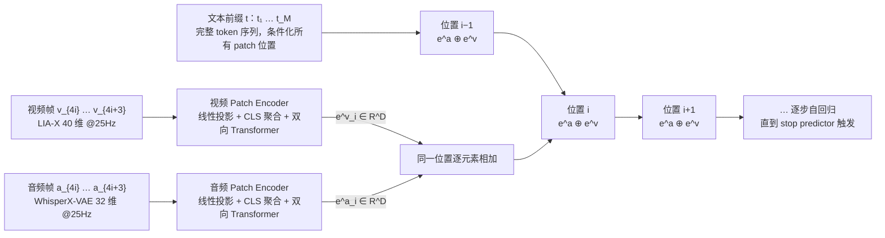
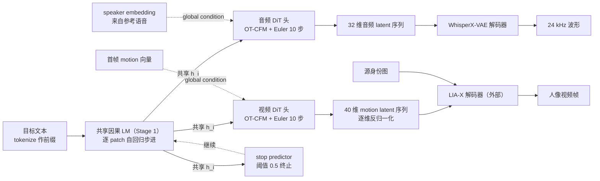

# Talker-T2AV

## 论文信息

| 项 | 值 |
|---|---|
| 标题 | Talker-T2AV: Joint Talking Audio-Video Generation with Autoregressive Diffusion Modeling |
| 作者 | Zhen Ye、Xu Tan、Aoxiong Yin、Hongzhan Lin、Guangyan Zhang、Peiwen Sun、Yiming Li、Chi-Min Chan、Wei Ye、Shikun Zhang、Wei Xue（首页脚注：前两位同等贡献，署名顺序任意） |
| 单位 | Hong Kong University of Science and Technology（Zhen Ye、Yiming Li、Chi-Min Chan、Wei Xue）、Independent Researcher（Xu Tan、Guangyan Zhang）、Zhejiang University（Aoxiong Yin）、National University of Singapore（Hongzhan Lin）、The Chinese University of Hong Kong（Peiwen Sun）、Peking University（Wei Ye、Shikun Zhang）；通讯作者 Wei Xue（`weixue@ust.hk`）——按 HTML 首页逐作者逐项核对，未做归属推测 |
| venue / 年份 | **不声明会议**。arXiv 页无 venue comment，首页只标 `arXiv:2604.23586v2 [cs.CV] 04 Aug 2026`（许可 CC BY 4.0），故本文统一写作「arXiv 2604.23586v2」，不写成任何会议论文 |
| arXiv | `2604.23586v2`（`[cs.CV]`；v1 2026-04-26，v2 2026-08-04） |
| 项目页 / 代码 / 数据 | https://talker-t2av.github.io/ ；https://github.com/zhenye234/Talker-T2AV ；https://huggingface.co/datasets/HKUSTAudio/Talker-T2AV-Data |
| papers 库条目 | `arxiv-2604.23586`（**本地 papers 库未入库**，`data/papers.db` 中查无此条） |
| 上游固定版本（我方材料） | knowledge 两篇固定阅读的上游版本 `6712f62` |

> **配图说明（本篇受论文限制）**：这篇论文正文只有 **1 张图（Figure 1）**，其余 6 个「Figure 块」全部是表格（Table 1–6），且表格都是 LaTeX 排版纯文本表、没有独立图片文件。因此本篇只发布 1 张论文原图，另按论文 §3.1–§3.3 的结构描述自绘 **2 张 Mermaid** 补结构表达（Mermaid 1 统一因果序列的 token 排布、Mermaid 2 流式推理管线），证据主要落在 6 张表上。这是论文本身的图源限制，不是本篇的取舍。

## 一句话总结

**把「跨模态对齐」从模型要学的目标改写成编码器的构造属性**：音频与视频各用一支冻结的编码器压成同帧率的纯 1-D 序列（LIA-X 每帧 40 维 motion、WhisperX-VAE 每帧 32 维 latent，都是 25 Hz），逐位置相加成联合 token 交给共享因果 LM 做高层规划（Eq. 2），同一 hidden state 再由两个参数独立的轻量 DiT 头解码成分帧 latent——跨模态交互只发生在短的高层序列里，低层渲染各自负责。

- **两级解耦**：Stage 1 共享自回归骨干（Qwen3-0.6B 初始化）在 patch 级统一 token 空间同时推理文本、语音、视频；Stage 2 两个模态专属 DiT 头分别输出音频 latent 与运动 latent（§3.1–§3.3）。
- **对齐免费**：两支编码器**冻结**且**同帧率 25 Hz**，所以第 $t$ 帧语音与第 $t$ 帧运动天然是同一物理时刻，「按构造对齐」，不需要任何 cross-attention 或学到的对齐模块（§3.2）。
- **一个模型、三条路径**：逐位置相加这一设计本身就让同一 checkpoint 零架构改动、零微调地支持 T2AV / A2V / 视频配音（§3.2；§4.5；§4.6）。
- **效率是结构性结果**：5 s 片段只有 `31.25` 个自回归 patch 步、骨干序列含文本前缀不到 50 token，单卡 NVIDIA H20 上 **24 FPS**（T2AV，1B 参数）/ **30 FPS**（A2V，0.8B）——比 UniVerse-1 快约 59×、比 UniAVGen 快约 75×、比 MoVA 快三个数量级（§4.4；Table 2）。
- **主张被作者主动收窄**：证据只覆盖 talking-head（音/脸运动可用紧凑、帧对齐的 1-D latent），论文明确**不声称**结论可迁移到通用场景级音视频生成（§5）。

## 问题与动机

论文的目标任务不是「给一条音频、让头像对口型」，而是**从文本联合生成新的语音与视频**（文本 transcript + 参考语音 + 身份图 → 音频 + 视频 latent）。它批评的对象是当前联合生成的主流范式 **dual-branch diffusion transformer（dual-DiT）**：两条并行 DiT 塔（一条音频、一条视频），在整条去噪轨迹上用双向跨模态注意力耦合（Ovi、MoVA / MOVA、UniVerse-1、JavisDiT、LTX-2 等，§2.1）。

### dual-DiT 的三点结构性局限

| # | 局限 | 论文的表述 | 位置 |
|---|---|---|---|
| 1 | **语义与渲染全程纠缠** | 贯穿式（pervasive）注意力把高层语义与低层信号细节在整条去噪轨迹上纠缠在一起；而音频与面部运动只在语义/时间层强相关，低层实现（声学信号、视觉纹理）走的是**不同的渲染过程**，不需要持续耦合 | §1；§2.1 |
| 2 | **天生非因果、固定长度** | 所有 dual-DiT 基线一次前向生成**预先定长**的音视频；当输入文本超出这个长度预算时，模型只能加速语速、截断或跳过内容，严重损伤可懂度。非因果也意味着不能增量输出、不能流式 | §2.1；§4.3 |
| 3 | **推理极慢** | 每一步去噪都要在稠密的 $T\times H\times W$ 时空 latent 体积上做注意力，代价在每个去噪步都付一次；论文实测已发布的 dual-DiT 比实时慢 2–3 个数量级 | §1；§2.1；§4.4 |

第三点与前两点同源：**表示选错了，成本结构就被锁死了**。论文的解法不是优化实现，而是换表示与换分工。

## 方法精析

整体链路：**文本前缀 + 逐位置相加的联合 patch token → 共享因果 LM → 两个模态专属 DiT 头 → 音频波形 / 运动 latent → 外部解码器出画出声**。

图 1 是全文唯一的机制图，也是唯一能看到「两阶段分工」整体形状的地方，值得按三块拆读：

- **Top（骨干与序列）**：一条统一因果序列，最前面是**完整文本 token 前缀**，之后每个位置是一个**联合 patch token**——音频 patch embedding 与视频 patch embedding 在该位置**逐元素相加**（Eq. 2 的输入）。这解释了为什么序列短：跨模态信息被压进同一个位置，而不是两套 token 交错排出两倍长度。
- **Bottom left（压缩）**：patch transformer encoder 把 $N$ 个音/视频帧压成一个 patch token，序列长度缩短 `P` 倍——这是「为什么 5 s 只要 31.25 步」的直接来源。
- **Bottom right（解码头）**：每个 DiT 头以 hidden state $\mathbf{h}_{i}$、一个 global embedding、一段历史帧 context window 为条件，用 flow matching 去噪当前 patch 的帧。注意**两个头参数独立、彼此不做跨模态注意力**——耦合只发生在上面那条共享序列里。

图 1 本身不含任何数值，它的作用是交代数据流；所有数字证据在 Table 1–6。

### 统一因果序列里的 token 排布

Mermaid 1 画的是 §3.2 描述的核心排布，三件事必须同时读到：

1. **前置文本、后继 patch**：文本是一条完整前缀（`t` 条件化所有位置），之后才是联合 patch token——这是「因果序列」里「因果」二字的来源。
2. **融合方式是逐位置相加，不是拼接**：同一位置的音频与视频 patch embedding 相加成一个 token，所以序列长度只由 patch 数 `N` 决定，不因双模态翻倍。论文在 §4.7 的消融里验证了这一点（Interleaved A-V 与 Add 相当，但交错会让序列长度翻倍、推理变慢，还固定了「音频先于视频」的方向，使视频配音不可能实现）。
3. **两条模态流各自有 Patch Encoder**：每支把 `P=4` 帧压成 1 个 `[CLS]` 位置的 token（`(P+1)` 长序列过一个小双向 Transformer），压缩比 `P` 直接决定自回归步数。

### 「对齐免费」来自哪里：冻结 + 同帧率 + 逐位置相加

论文的论证链条很短，但每一步都不可省（§3.2「Temporally Aligned Cross-Modal Features」）：

- **第一步，指出结构不匹配**。典型视频 VAE 把每帧编成 2-D 空间网格，得到 $T\times H\times W$ 的 token 体积；语音天然是 1-D 时序。这个不匹配导致没有直接办法逐帧对齐，所以 dual-DiT 只能靠 cross-attention 去**学**对应关系，优化难度大。
- **第二步，主张音视频在时间轴上本就对齐**。时刻 $t$ 的发声直接决定同一瞬间的语音内容、口型与面部表情。
- **第三步，据此选编码器**：故意挑两支产出**纯时序、同帧率**序列的编码器——视频侧 LIA-X（每帧一个 40 维向量，25 Hz），音频侧 WhisperX-VAE（每帧一个连续 latent，25 Hz）。**两支编码器在训练中都是冻结的。**
- **第四步，得到「按构造对齐」**：两流时间分辨率相同，第 $t$ 帧语音与第 $t$ 帧运动对应同一物理时刻，因此**不需要任何 cross-attention 或学习式时间对齐模块**。

这就是本篇所谓「对齐免费」的全部来源：它不是靠损失函数约束出来的，而是靠**表示层面对齐 + 编码器冻结 + 逐位置相加**三件事共同消掉的。需要留意的是，论文这一条是**设计选择 + 论证**，而不是消融证明——§4.7 只消融了 token 排布（Add / Interleaved / Delay-`k`），并没有单独消融「去掉跨模态注意力」本身。

融合本身只有一个式子（Eq. 2）。Stage 1 的联合建模从 patch 级自回归分解出发（Eq. 1）：

$$p(\mathbf{A},\mathbf{V}\mid\mathbf{t})=\prod_{i=1}^{N}p\!\bigl(\mathbf{a}_{i},\mathbf{v}_{i}\mid\mathbf{a}_{<i},\,\mathbf{v}_{<i},\,\mathbf{t}\bigr)$$

| 符号 | 含义 | 来源 |
|---|---|---|
| $\mathbf{A}$、$\mathbf{V}$ | 音频、视频 latent 序列 | §3.1 |
| $\mathbf{a}_{i}$、$\mathbf{v}_{i}$ | 第 $i$ 个音频、视频 patch（各含 $P$ 帧），$\mathbf{a}_{i}\in\mathbb{R}^{P\times d_{a}}$、$\mathbf{v}_{i}\in\mathbb{R}^{P\times d_{v}}$ | §3.1 |
| $P$ | 一个 patch 覆盖的帧数，实现取 $P=4$ | §3.1；§4.1 |
| $N$ | patch 数，由 stop predictor 决定（不预先固定） | §3.1 |
| $\mathbf{t}$ | 文本前缀 token 序列 $(t_{1},\dots,t_{M})$ | §3.1 |

Eq. 1 说的是：**联合分布按 patch 自回归分解**，第 $i$ 个 patch 的音频与视频同时以「更早的音频与视频 + 文本前缀」为条件——同一位置上两个模态是**联合预测**的，这正是后面能靠高层规划拿到同步的前提。

$$\mathbf{h}_{i}=\mathrm{LM}\!\bigl(\mathbf{e}^{a}_{\leq i}+\mathbf{e}^{v}_{\leq i},\;\mathbf{t}\bigr)$$

| 符号 | 含义 | 来源 |
|---|---|---|
| $\mathbf{e}^{a}_{i}$、$\mathbf{e}^{v}_{i}$ | 音频、视频 patch embedding（Patch Transformer Encoder 的 `[CLS]` 位置输出），$\in\mathbb{R}^{D}$ | §3.2 |
| $D$ | 骨干 hidden 维（补丁嵌入维）；论文只给头与编码器为 1024，$D$ 本身的数值**未披露** | §3.2；§4.1 |
| $\mathbf{h}_{i}$ | 共享 hidden state，同时送给音频头、视频头与 stop predictor | §3.2 |
| $\mathrm{LM}$ | 共享因果语言模型（自回归骨干），初始化自 Qwen3-0.6B | §3.2；§4.1 |

这就是 Eq. 2：**同一位置的音频与视频 patch embedding 逐元素相加**成一个联合 token，再与文本前缀一起送入因果 LM，输出共享 hidden state $\mathbf{h}_{i}$。关键读法有两点：一是两个模态在骨干里**共享同一组 hidden state**，跨模态信息在这里完成交换；二是这个「相加」不是单纯的融合技巧，它同时是**单模态条件生成的开关**——当某一模态已给定（A2V 的 GT 音频、配音的 GT motion），把它真实的 patch embedding 与另一模态的自回归预测相加即可，**架构不改、也不微调**（§3.2；§4.5；§4.6）。

变长输出由 stop predictor 负责。它不是独立模块，而是挂在最后一层 LM hidden state 上的 MLP，训练用 BCE，正类权重设为每个 batch 内「continue 标签数 / stop 标签数」以补偿极端的类别不平衡：

$$p_{\mathrm{stop}}(i)=\mathrm{sigmoid}\bigl(\mathrm{MLP}(\mathbf{h}_{i})\bigr)$$

| 符号 | 含义 | 来源 |
|---|---|---|
| $p_{\mathrm{stop}}(i)$ | 第 $i$ 个 patch 之后的停止概率 | §3.2 |
| $\mathbf{h}_{i}$ | LM 最后一个 hidden state | §3.2 |

推理时 $p_{\mathrm{stop}}>0.5$ 即终止（§4.2），因此输出长度随文本与语速自适应。论文强调纯 DiT 架构要实现同样的能力需要「额外机制」。

### Stage 2：两个模态专属的轻量 DiT 头

Stage 2 的理由是**latent 空间本身不同**：音频是 $d_{a}$ 维声学特征、视频是 $d_{v}$ 维面部运动系数，二者在维度、信号动态与噪声特性上都不同，用单一解码器同时重建会把两套低层属性混在一起（§3.3）。所以采用两个**参数完全独立**、架构相同的轻量 DiT 头，各自接收同一个 $\mathbf{h}_{i}$ 作语义条件，解码出对应模态的 $P$ 帧连续 latent。

每个头的输入序列由四部分拼接而成：

1. $\mathbf{h}_{i}$ **加**扩散步 $\tau$ 的正弦时间步 embedding，作为**语义锚**；
2. 一个 **global condition 向量**，提供身份信息——**音频头用 speaker embedding，视频头用首帧 motion 向量**；
3. 一个 **context window**，即紧邻前一个 patch 的 latent 帧，提供 patch 间的短时连续性；
4. **noisy target** $\mathbf{x}_{\tau}$，待去噪的目标。

这个复合序列做**全双向注意力**，输出在 $\mathbf{x}_{\tau}$ 对应位置投影回 latent 维作为预测的速度场。训练目标是最优传输条件流匹配（OT-CFM）：

$$\mathcal{L}_{\mathrm{cfm}}=\mathbb{E}_{\tau,\mathbf{z}}\Bigl[\bigl\lVert v_{\theta}\!\bigl(\mathbf{x}_{\tau},\,\tau,\,\mathbf{h}_{i},\,\mathbf{c}\bigr)-\mathbf{v}\bigr\rVert^{2}\Bigr]$$

| 符号 | 含义 | 来源 |
|---|---|---|
| $\tau$ | flow matching 连续时间步，采样自 logit-normal 分布 | §3.3 |
| $\mathbf{x}_{0}$ | 干净的 latent patch（$\in\mathbb{R}^{d\times P}$） | §3.3 |
| $\mathbf{z}$ | 标准高斯噪声，$\mathbf{z}\sim\mathcal{N}(\mathbf{0},\mathbf{I})$ | §3.3 |
| $\mathbf{x}_{\tau}$ | 加噪样本，$\mathbf{x}_{\tau}=(1-\tau)\mathbf{x}_{0}+\tau\mathbf{z}$ | §3.3 |
| $\mathbf{v}$ | 速度场目标，$\mathbf{v}=\mathbf{z}-\mathbf{x}_{0}$ | §3.3 |
| $v_{\theta}$ | DiT 头学到的速度场预测网络 | §3.3 |
| $\mathbf{c}$ | global condition 向量与 context window 的拼接 | §3.3 |
| $\mathbf{h}_{i}$ | 来自 Stage 1 的共享 hidden state（语义锚） | §3.3 |

Eq. 3 不要误读成普通的 CFG 去噪：$\mathbf{h}_{i}$ 是**语义锚**（决定「发什么音、做什么表情」），$\mathbf{c}$ 才是身份与短时连续性的拼接（决定「像谁、接得上」）。训练时以**小概率**随机丢弃 $\mathbf{h}_{i}$ 以支持推理期 CFG——**该概率数值论文未披露**。推理用 `CFG=2.0`、Euler ODE 10 步、温度 `t=0.7`（§4.2）。

### 视频侧只生成 40 维 motion，像素不由本模型产生

这条边界必须写清楚，否则会高估模型能力（§3.1；Appendix A；Figure 1）：

- LIA-X 编码器把每帧压成 **40 维 motion code**；模型生成的也**只是**这条 motion latent 序列（送解码器前先做逐维反归一化 $v_{t,d}=\tilde{v}_{t,d}\cdot\sigma_{d}+\mu_{d}$）。
- **像素由外部 LIA-X 解码器渲染**，且必须**配合一张源身份图**：论文原文是 "Combined with a source identity image, the decoder renders the final portrait video frames"。模型本身**不生成外观、不生成像素**。
- 音频侧由 WhisperX-VAE 解码器把 32 维 latent 还原为 24 kHz 波形。

至于为什么是 40 维，Appendix A 给了选型依据（这是本篇相对其它解读的差异化素材）：FLOAT / LIA 的 20 维正交 motion 在**非正脸姿态**下重建明显退化，而本文训练数据头姿多样；LivePortrait / Ditto 的 **265 维**表示对自回归扩散模型**太难可靠预测**（目标空间过大，分布难学）；40 维 LIA-X 是「容量够表达丰富面部动态、又紧凑到能被自回归扩散模型可靠建模」的折中。**注意：这三种表示的对比只有定性叙述，论文没有给出对应的 FID/FVD，因此不能读成「40 维优于 265 维」的量化结论。**

## 训练与实现细节

论文强调与 dual-DiT 的多阶段训练（分别预训练音频塔、视频塔再联合微调）不同，Talker-T2AV 是**单阶段多任务**训练：一条总损失把音频 CFM、视频 CFM、stop 损失相加（§3.4）：

$$\mathcal{L}=\mathcal{L}_{\mathrm{cfm}}^{\mathrm{audio}}+\lambda\,\mathcal{L}_{\mathrm{cfm}}^{\mathrm{video}}+\alpha\,\mathcal{L}_{\mathrm{stop}}$$

| 符号 | 含义 | 来源 |
|---|---|---|
| $\mathcal{L}_{\mathrm{cfm}}^{\mathrm{audio}}$、$\mathcal{L}_{\mathrm{cfm}}^{\mathrm{video}}$ | 音频头、视频头的条件流匹配损失（Eq. 3） | §3.4 |
| $\mathcal{L}_{\mathrm{stop}}$ | stop predictor 的加权 BCE 损失 | §3.4 |
| $\lambda$ | 视频 CFM 权重，实值 $\lambda=8$ | §3.4；§4.1 |
| $\alpha$ | stop 损失权重，实值 $\alpha=1$ | §3.4；§4.1 |

Eq. 4 的读法重点不在加权形式，而在**两类任务被塞进同一个 batch**：每个 mini-batch 由**等量**的 T2AV 样本与 TTS 样本组成，首位加一个可学习的 task tag embedding $\mathbf{e}_{\mathrm{task}}\in\{\mathbf{e}_{\mathrm{TTS}},\mathbf{e}_{\mathrm{T2AV}}\}$ 来区分；TTS-only 样本把运动分支的输入换成可学习的 padding embedding $\mathbf{e}_{\mathrm{pad}}$，并把运动损失**置零**（§3.4；§4.1）。这一手很关键——语音分支吃到了大规模 TTS 语料，而视频分支不受污染。

### 关键配置

| 项 | 值 | 来源 |
|---|---|---|
| T2AV 训练数据 | 约 **1M** 条 talking-head 音视频 clip（带对齐转写），来自公开在线来源，经多阶段过滤（人脸检测 / 质量打分 / 转写） | §4.1 |
| TTS 训练数据 | 与 UniAVGen 相同的 **Emilia** 数据集 | §4.1 |
| batch 混比 | 每个 mini-batch 中 T2AV 与 TTS 样本等量，由 task tag 机制控制 | §4.1 |
| 骨干 | 自回归因果 LM，初始化自 **Qwen3-0.6B**；所有组件端到端联合训练（论文原话 "trained jointly from scratch end-to-end"，与「骨干由 Qwen3-0.6B 初始化」并存，二者关系论文未显式拆开说明） | §3.4；§4.1 |
| 模态 DiT 头 | 每个 **8 层**双向 Transformer、**8 头**、hidden **1024**；音频头与视频头**参数独立** | §4.1 |
| Patch Transformer Encoder | 每个模态各一个：**4 层**、8 头、hidden 1024 | §4.1 |
| patch 大小 | $P=4$ 帧；每个头预测 4 帧 latent，条件于 4 帧 context window | §4.1 |
| 编码器冻结 | LIA-X（视频）与 WhisperX-VAE（音频）**训练中均冻结** | §3.2 |
| 视频侧归一化 | 对 40 维 motion latent 逐维做零均值单位方差归一化，统计量取自「partial training set」（**具体比例未披露**） | Appendix A |
| 音频侧结构 | DAC 卷积编解码骨干，编码器 stride `[2, 4, 10, 12]` → 总时间压缩 `960×` → latent 25 Hz；冻结 Whisper Large-v3 编码器提 1280 维 @50 Hz，两帧平均池化到 25 Hz 后与声学编码器输出逐元素相加；VAE bottleneck 由 weight-normalized $1\times1$ 卷积压到 64 维，拆成 32 维均值与 32 维尺度（训练重参数化 $\mathbf{z}=\boldsymbol{\mu}+\boldsymbol{\sigma}\odot\boldsymbol{\epsilon}$，推理直接用 $\boldsymbol{\mu}$）；解码器 stride `[12, 10, 4, 2]`、hidden 1536，另挂两层 MLP 语义头 $1280\to1280\to1280$（GELU）重建 Whisper 特征 | Appendix B |
| 训练步数 | **200,000** 步 | §4.1 |
| global batch size | **256** | §4.1 |
| 优化器 / 精度 | **AdamW** / **bfloat16** 混合精度 | §4.1 |
| 学习率 / warm-up | `1×10^{-4}`，前 **3%** 步线性 warm-up | §4.1 |
| 损失权重 | $\lambda=8$、$\alpha=1$ | §4.1 |
| 训练硬件、总 GPU 时、参数量分项 | **未披露**（只给 Table 2 的总参数 1B / 0.8B） | — |
| 文本 tokenizer / 位置编码 | **未披露** | — |
| stop 标签构造方式（如何判定最后一个 patch、句尾静音如何处理） | **未披露** | — |

## 推理与系统链路

推理设置（§4.2）：文本先 tokenize 作 prefix；逐步由骨干产出共享 $\mathbf{h}_{i}$ 送两个 DiT 头；每头用 flow matching + **Euler ODE、10 步**、温度 `t=0.7`、`CFG=2.0`；`p_{\mathrm{stop}}>0.5` 时终止；音频 latent 交音频 VAE 解码为波形，运动 latent 交 LIA-X 解码为肖像视频。

Mermaid 2 的两条主干与三条边值得分开看：

- **主干一（上）**：AR 步进 → 双头解码。两个头**消费同一个 $\mathbf{h}_{i}$**，但参数独立、彼此不通信——这正是「高层耦合、低层分离」在推理期的具体形态。
- **主干二（下）**：解码后的两串 latent **各走各的外部解码器**。音频侧闭环在模型内（自建 WhisperX-VAE）；**视频侧出模型即为一条依赖外部件的边**：LIA-X 解码器是论文选用的预训练冻结组件，且**必须再喂一张源身份图**才能出帧。
- **两条 global condition 边不是同一种信息**：音频头的 global condition 是 **speaker embedding**（身份/音色，来源模型论文未点名，只引用 Qwen3-TTS / MiniMax-Speech 一类工作）；视频头是**首帧 motion 向量**（起始姿态锚点）。把两者都笼统写成「身份条件」会丢掉这个差别。
- **stop predictor 是唯一形成回边的模块**：它决定循环何时停，从而使输出长度可变。

### 与我方接入的关系（我方材料）

论文机制归本篇；**上游固定版本 `6712f62` 的接入状态与验证细节归 knowledge 两篇**，本篇只做前向链接与边界提示：

- 我方材料显示本地已完成接入（adapter、权重与环境、输出规格演进、历史可运行性冒烟），并且明确把 A2V / V2A 标为「上游声称能力，本地未形成公平验证」，本地主路径是 T2AV——这与论文「单 checkpoint 零改动支持三任务」的宣称并不冲突，但**不能把论文表 3 / 表 4 读成我方已验证结论**。
- 我方材料另有一条术语错位需要留意：我方文档使用 **T2SV**、**WavLM speaker encoder**、`--gt-prefix-seconds`、**RTF 21.33 / 15.0 GB**、**512×512 中间尺寸**、FaceCropper 等表述，**这些都不在论文里**（论文只写 “a speaker embedding for speech”），引用时必须标注「我方材料」。
- 口径也不同类：论文的效率指标是 **FPS**（Table 2，越大越快，25 Hz 输出下 >25 即快于实时），我方的 **RTF** 方向相反（越小越快）且是本地历史冒烟口径——两者不可混用成一个倍数。详见 [[knowledge/Talker-T2AV 接入与验证|Talker-T2AV 接入与验证]]。

## 实验与结果

论文正文只有 6 张表，没有第 2 张图；本篇的关键数值按下表照录（含中/英双列）。**加粗标记的口径分两类**：Table 1、Table 3、Table 4、Table 5 的加粗沿用论文的最优标记（论文的「次优」下划线这里**未逐一复现**，需逐格核对的读者请回到原表）；**Table 2 与 Table 6 论文未做加粗标记**，本篇只把加粗用于标出 `Ours` 行。

### 主结果：联合 T2AV 对比（Table 1）

测试集：中文与英文各 **200 条**视频；中文采样自 DH-FaceVid-1K，英文由 HDTF 与 Hallo3 的片段组成；T2AV 与 A2V 共用同一测试集（§4.3）。指标：中文用 CER、英文用 WER（用 Qwen3-ASR 转写生成语音后计算）；UTMOS 测自然度；FID / FVD 测视频保真；SyncNet C（越高越好）/ D（越低越好）测音画同步。

**中文测试集**

| 方法 | CER↓ | UTMOS↑ | FID↓ | FVD↓ | C↑ | D↓ |
|---|---|---|---|---|---|---|
| MoVA | 0.359 | 1.979 | 38.87 | 249.20 | 3.008 | 10.719 |
| Ovi | 0.873 | 2.085 | 29.75 | 224.28 | 1.496 | 11.515 |
| LTX-2 | 0.461 | 2.053 | 32.49 | 318.13 | 1.656 | 12.387 |
| UniVerse-1 | 0.715 | 1.511 | 19.49 | 237.41 | 0.661 | 13.678 |
| UniAVGen | 0.265 | **2.197** | **15.30** | 157.92 | 3.168 | 9.956 |
| **Ours** | **0.148** | 2.136 | 17.63 | **103.31** | **5.470** | **8.793** |

**英文测试集**

| 方法 | WER↓ | UTMOS↑ | FID↓ | FVD↓ | C↑ | D↓ |
|---|---|---|---|---|---|---|
| MoVA | 0.317 | 3.033 | 34.75 | 301.82 | 2.982 | 11.107 |
| Ovi | 0.296 | 3.030 | 33.84 | 284.56 | 4.166 | 9.582 |
| LTX-2 | 0.257 | 2.769 | 27.46 | 272.78 | 4.671 | 9.642 |
| UniVerse-1 | 0.385 | 1.690 | 36.50 | 409.58 | 1.092 | 13.906 |
| UniAVGen | 0.302 | **3.459** | 35.27 | 298.27 | 2.555 | 11.378 |
| **Ours** | **0.055** | 3.458 | **24.32** | **246.39** | **6.330** | **8.505** |

论文自述的结论是：音频侧 CER（中）与 WER（英）最低；视频侧两个测试集 FVD 最优、FID 最优或次优；同步侧两个测试集 SyncNet Confidence 最高、Distance 最低（§4.3）。相对最强的人脸域基线 UniAVGen，论文认为增益主要体现在 FVD：中文 103.31 vs 157.92、英文 246.39 vs 298.27（对应近似降幅约 34.6% 与 17.4%，此降幅为本篇基于表内数值的推算，非论文原文数字）。

> **事实核对注（必须与上表同读，且不做跨来源横比）**
>
> 1. **英文 UTMOS 与措辞有张力**。论文正文写「our decoupled architecture yields substantially better speech content accuracy **and naturalness**」，但 Table 1 英文 UTMOS 上本文 **3.458** 略低于 UniAVGen 的 **3.459**（论文把 3.459 标为最优、3.458 标为次优）。也就是说，「音质更好」这条宣称只能由中/英 CER-WER 支撑，**UTMOS 并不支持 "substantially better naturalness" 这个说法**。引用时不要写成「音质全面领先」。
> 2. **SyncNet C / D 的量纲可疑**。表 1–表 5 的 C 落在 0.661–6.373、D 落在 8.441–13.906，与常见 SyncNet 置信度（约 0–1）不是同一量纲；论文**未说明所用 SyncNet 变体与后处理**（未披露）。在同一协议内做同表比较是成立的，但**不要把本文的 C / D 与其它论文的 SyncNet 数字直接横比**——本篇也不做这种横比。
> 3. **拼写伪影**：Table 1 行名写作 `MoVA`，而摘要 / 正文 / 参考文献写作 `MOVA`，是同一基线；引用时建议以一处为准并注明差异。
>
> 前两条属于「论文结论句覆盖过宽 / 指标口径未披露」，不是数值抄录错误。

### 推理效率（Table 2）

测试条件：**单卡 NVIDIA H20**、5 s 片段、指标为每秒墙钟时间生成的视频帧数（FPS）。输出视频 25 Hz，因此 **FPS > 25 即快于实时**。论文注明 A2V 参数量更低是因为音频给定时只跑视频头、跳过音频头。

**Text-to-Audio-Video**

| 方法 | Params | FPS↑ |
|---|---|---|
| UniVerse-1 | 7.1B | 0.41 |
| UniAVGen | 7.1B | 0.32 |
| Ovi | 10.9B | 0.20 |
| LTX-2 | 19B | 0.17 |
| MoVA | 32B | 0.02 |
| **Ours** | **1B** | **24** |

**Audio-to-Video**

| 方法 | Params | FPS↑ |
|---|---|---|
| FLOAT | 0.3B | 39 |
| Ditto | 0.2B | 47 |
| EchoMimic | 1.3B | 0.98 |
| Sonic | 1.5B | 0.77 |
| **Ours** | 0.8B | 30 |

§4.4 的数字与成因：24 FPS 比 UniVerse-1 快约 **59×**、比 UniAVGen 快约 **75×**、比 MoVA 快**三个数量级**，而参数是它们的 1/7 到 1/32；由于输出 25 Hz，这已接近实时，而每个 dual-DiT 基线每生成 1 秒内容需要数分钟计算。论文把这归因于**表示与分解，而不是实现调优**：两模态都是 25 Hz 纯 1-D latent、经 $P=4$ patching 压缩，所以 5 s 片段只有 **31.25** 个自回归 patch 步、含文本前缀的完整骨干序列**不到 50 token**；每个 DiT 头只去噪一个 4 帧 patch（注意力窗口**不到 10 个位置**）。对照之下 dual-DiT 要在 $T\times H\times W$ 的稠密 latent 体积（数千到数万 token）上去噪，并在**每个去噪步**都付这份二次注意力代价。A2V 设定下 30 FPS 也快于实时，与 FLOAT、Ditto 这类专用实时渲染器相当，同时比 EchoMimic、Sonic 这类扩散式肖像动画快一个数量级以上；此外因果骨干可增量输出，**单个自回归步后即可给出第一段音视频 chunk**，这是非因果 dual-DiT 无论多快都做不到的（必须先跑完整条去噪轨迹）。

> 事实核对注：摘要里的说法是「more than 50× faster than dual-branch diffusion baselines」，比 §4.4 分项宣称的 59×/75× 更保守；两者不矛盾，但引用时应指明是哪一处。表 2 **未披露**精度、显存、batch size 压测条件，**也未说明是否包含 VAE / LIA-X 解码耗时**，且只在单卡 H20 上测——**不能跨硬件外推到任何本地环境**。我方材料的历史冒烟口径（RTF 与显存）与这里的 FPS 不是同一件事，不可混算。

### A2V：音频驱动说话头（Table 3）

设定：给本文与所有基线**相同的 ground-truth 音频**，使视频质量与唇音同步的差异反映生成模型本身而非上游语音质量（§4.5）。每格为 **中文 / 英文**。

| 方法 | FID↓ | FVD↓ | Sync-C↑ | Sync-D↓ |
|---|---|---|---|---|
| FLOAT | 29.71 / 32.24 | 222.52 / 360.68 | 2.96 / 3.21 | 10.11 / 10.28 |
| EchoMimic | 33.43 / 42.65 | 273.65 / 513.64 | 2.19 / 3.41 | 10.88 / 10.23 |
| Sonic | **16.17 / 24.51** | **106.57 / 284.61** | 1.85 / 5.34 | **11.36 / 8.70** |
| Ditto | 17.98 / 28.73 | 187.54 / 304.72 | 1.77 / 4.24 | 11.81 / 10.04 |
| AniPortrait | 23.63 / 29.65 | 336.80 / 453.08 | 1.14 / 2.59 | 12.42 / 11.38 |
| **Ours** | **17.32 / 24.46** | **107.09 / 243.51** | **3.97 / 5.85** | **10.09 / 9.03** |

**这一列并非全面第一**：中文 FID / FVD 上 Sonic 为第一（16.17 / 106.57），本文第二；英文 FID / FVD 本文第一；Sync-C 中英均第一；Sync-D 中文本文第一（10.09，优于 FLOAT 的 10.11）、英文本文第二（9.03，Sonic 8.70 更低）。论文的自述是「FID/FVD 在每个测试集排名第一或第二、Sync-C 两个语言均第一，且未专门为该设定做优化」，与上表一致。论文把这种可迁移性归因于联合 T2AV 训练学到的跨模态对应。

> 事实核对注：表中加粗沿用论文，但 **Sonic 的 Sync-D 单元格加粗与数值不一致**——该单元格写作 `11.36 / 8.70`，其中文值 11.36 实际上不如 FLOAT 的 10.11 与本文的 10.09，只能认为它的加粗对应英文列 8.70。本篇**不改写数值**，只提示该标记不一致；同理 Ours 的 `10.09 / 9.03` 加粗只对中文列成立。

### 视频配音（Table 4，Chem benchmark）

基准：Chem（一名化学教师讲课的配音数据集）。指标：DD（Duration Distance，音素时长对齐误差，越低越好）、EMO-SIM（生成与参考语音的情感嵌入余弦相似度）、WER、UTMOS（协议沿用 Zhang et al. 2026）。

| 方法 | DD↓ | EMO-SIM (%)↑ | WER (%)↓ | UTMOS↑ |
|---|---|---|---|---|
| Speak2Dub | 0.5873 | 59.72 | 23.78 | 2.74 |
| StyleDubber | 0.5627 | 58.54 | 25.43 | 1.95 |
| DeepDubber | 0.5756 | 56.42 | 35.88 | 2.03 |
| ProDubber | 0.5650 | 65.98 | 14.33 | 2.91 |
| InstructDub | **0.5583** | 66.57 | 12.60 | 3.07 |
| **Ours** | 0.5592 | **68.26** | **6.33** | **3.256** |

四项中三项最优（EMO-SIM、WER、UTMOS），DD 排第二、与 InstructDub 差 **0.0009**（约 0.16%），论文称该差距可忽略（§4.6）。**注意 DD 的定义与量纲依赖 Zhang et al. (2026) 的协议，论文未就地复述公式**，因此 0.55x 这个绝对尺度不应脱离该协议单独解读。

### 唯一一组系统性消融：AR 序列的 token 排布（Table 5）

所有 T2AV 变体同数据同超参，只改 token 定位策略；A2V 变体只用说话头视频数据（不含 TTS 语料）训练，且驱动音频**用本文自己 T2AV 模型生成的语音**以保证跨设定公平（§4.7）。

| AR Position Design | WER↓ | UTMOS↑ | FID↓ | FVD↓ | C↑ | D↓ |
|---|---|---|---|---|---|---|
| Add (Ours) | **0.055** | 3.458 | 24.32 | **246.39** | **6.330** | **8.505** |
| Interleaved (A-V) | 0.057 | **3.472** | **24.18** | 249.71 | 6.287 | 8.552 |
| Interleaved (V-A) | 0.064 | 3.391 | 28.73 | 312.48 | 4.631 | 11.184 |
| Delay-1 | 0.142 | 3.146 | 27.95 | 298.63 | 5.784 | 9.027 |
| Delay-3 | 0.298 | 3.018 | 32.47 | 371.25 | 5.193 | 9.582 |
| Delay-1 (Audio-Driven) | – | – | 26.14 | 268.35 | 5.608 | 9.217 |
| Delay-3 (Audio-Driven) | – | – | 25.31 | 254.72 | 6.373 | 8.441 |

三条结论（§4.7）：

1. **A-V 交错与 Add 相当**，没有任何一方稳定占优——说明两种排布在每个生成步上提供的跨模态信息等价。但交错有**两个结构性代价**：序列长度翻倍、推理变慢；并且固定了「音频先于视频」的因果序，使需要反方向的**视频配音不可能实现**。
2. **反向（V-A）明显掉点**：音频质量轻度下降，视频保真与唇音同步大幅下降。论文的解释是语音在引导时间动态中占主导，把视频 token 放在语音之前会让视频分支失去同期语音上下文。
3. **Delay 的趋势是任务相关的**：T2AV 下 Delay-1 / Delay-3 全面退化、Delay-3 更严重（WER 从 0.055 涨到 0.298，近乎 5.4 倍；视频保真骤降）——说明联合生成时**位置对齐是必需的**，两个模态必须被同时规划。但在 A2V 下趋势**反转**：Delay-3 在视频保真与唇音同步上都优于 Delay-1，其中 Delay-3（Audio-Driven）的同步指标 C 6.373 / D 8.441 甚至**超过 T2AV 默认配置**（6.330 / 8.505）。论文的结论是：条件音频可用时，更大的延迟让视频分支在渲染每个 patch 前看到更丰富的音频上下文，恰好贴近传统级联管线的因果结构。

> 读表注意：Audio-Driven 两行的 WER / UTMOS 为 `–`（驱动音频已给定，音频指标不适用），因此**不能跨行比较音频质量**；这两行的趋势只说明视频侧。另外，A2V 变体的驱动音频来自本文 T2AV 模型，所以该子表同时受视频头与 T2AV 音频质量影响，不是纯粹的 A2V 条件对比。

### 音频自编码器重建（Table 6，Appendix B）

评测集 LibriTTS test-clean（24 kHz）。`Repr.` = 帧率 × latent 维度（或 VQ 码本数）；上半为离散 token codec，下半为连续表示。

| 模型 | Repr. | UTMOS↑ | PESQ WB↑ | PESQ NB↑ | STOI↑ | WER↓ |
|---|---|---|---|---|---|---|
| Ground Truth | – | 4.05 | 4.50 | 4.50 | 1.00 | 2.58% |
| EnCodec | 75 Hz × 8 VQ | 3.04 | 2.72 | 3.20 | 0.94 | 3.00% |
| Mimi | 12.5 Hz × 8 VQ | 3.63 | 2.27 | 2.90 | 0.91 | 3.80% |
| Vocos-Mel | 93.75 Hz × 100d | 3.74 | 3.67 | 4.02 | 0.98 | 2.66% |
| **Ours** | 25 Hz × 32d | 3.94 | 2.84 | 3.44 | 0.95 | 2.91% |

论文把 Vocos-Mel 明确定位为**上界参考**（高帧率 mel 近乎无损，PESQ / STOI 最佳）；在**压缩表示**中本文 UTMOS 最高（3.94），说明 25 Hz、单帧 32 维的连续 latent 仍保住较强感知质量与语义（Appendix B）。这张表是编解码重建评测，**不是端到端 T2AV 消融**，不能当成「音频链优于 T2AV 其他设计」的证据。

### 未做的消融与未披露项

- **未披露**：$P$、$\lambda$、$\alpha$、Euler 步数、CFG、温度、stop 阈值的任何敏感性 / 消融表。
- **未披露**：骨干规模与头的层数 / 宽度的 scaling 消融；数据规模 scaling 实验（§5 只有展望，无实验）。
- **未披露**：LIA-X / FLOAT / LivePortrait 三种 motion 表示的对比只有定性叙述，无 FID/FVD 数字。
- **未披露**：无任何人工主观评测（全部为 Qwen3-ASR、UTMOS、FID、FVD、SyncNet 自动指标），因此无法排除自动指标与人类感知的偏差。
- **未披露**：5 个 dual-DiT 基线用的是官方 checkpoint、重跑还是直接引用原论文数字；测试片段的分辨率、时长、采样帧数、SyncNet 模型版本、FID/FVD 特征网络均未给。
- **未披露**：stop predictor 正类权重的具体数值（只说按 batch 内标签比设定）、CFG 训练期随机丢弃概率、speaker embedding 的抽取模型与维度、训练硬件与总机时。

## 相关工作与定位

论文自述的脉络分两条（§2.1、§2.2）：

| 方向 | 代表 | 论文的对照点 |
|---|---|---|
| 通用联合音视频生成（dual-DiT） | Ovi、MoVA / MOVA、UniVerse-1、JavisDiT、LTX-2 | 两条 DiT 塔 + 双向跨模态注意力，在整条去噪轨迹上持续耦合；非因果、定长、每步都在稠密 latent 体积上做注意力 |
| 面向 talking portrait 的联合生成 | UniTalking（多模态 Transformer block + 共享 self-attention）、UniAVGen（dual-DiT + face-aware modulation）、OmniTalker（one-shot 多模态风格模仿）、Faces that Speak（TTS 与 talking face 两条解码管线共享中间特征）、AV-Flow（dual-DiT + highway layers 生成 4D avatar） | 与本文同应用域，但仍是「全程耦合」或「双管线」范式 |
| 级联式 A2V | Wav2Lip → SadTalker → GeneFace++ / Real3D-Portrait → EMO → Hallo 系 → EchoMimic → FLOAT / Ditto | 级联管线的根本假设是**音频已给定**，因此输出长度、语速、韵律结构都已知；当音频与视频都必须从文本生成时这些时间信息都不存在，需模型自行推断，对定长扩散范式构成额外挑战 |
| **本文** | Talker-T2AV | 换掉两件事：把跨模态交互**限制在短的高层序列**（共享因果 LM，逐位置相加融合），把**低层渲染交给各自解码器**（两个参数独立的轻量 DiT 头），并用**冻结、同帧率 1-D 编码器**把对齐问题从「要学的目标」变成「构造属性」 |

**与本仓库谱系的接点**：本文视频侧的表示正是 **LIA-X**——冻结的预训练人像运动自编码器（40 维 motion code @25 Hz），它同时是本文视频保真度的**上界来源**（§5 第二条局限）。该编码器本身的性质（稀疏 motion dictionary、flow-warp 渲染、参数量级、与 StyleGAN2 风格积木的关系）不在此展开，见 [[论文笔记/lia-x|LIA-X 模型笔记]]。与 [[论文笔记/ditto|Ditto]] 的对照点在于：两边都把生成目标从 VAE latent 挪到低维运动空间，但 Ditto 的运动空间只服务 audio-driven 实时渲染，而本文把它当成**联合音视频序列的一半**，并因此必须解决跨模态对齐与变长规划。

## 局限与启发

### 论文自己承认的局限

§5 明写两条，另有一条是主张边界的自我收窄：

1. **长序列误差累积**：骨干在**连续 latent 空间**（而非离散 token 空间）工作，因此每一步的预测误差更容易在长序列上传播累积，导致长句逐渐劣化。
2. **视频保真受 LIA-X 容量上界约束**：输出质量的上限由 LIA-X 这个视频运动自编码器的能力决定，换用表达力更强的视觉表示是未来工作。
3. **主张范围被主动收窄**：证据只覆盖 talking-head——音频与面部运动可以写成紧凑、帧对齐的 1-D latent，因而「高层规划足以保证同步、低层耦合不必要」；论文明确**不声称该结论可迁移到通用场景级音视频生成**（在那一类问题里声音事件与视觉内容的时间关系更松、视频通常表示为稠密时空 latent 体积，需要另行取证）。结论节再次重申了这条保留。

另有一条展望（非局限）：1M 配对数据已足够好用，论文预期继续扩数据还会有收益。

### 论文局限 vs 我们结论

| 论文的局限 / 缺口 | 我们的结论（我方材料；**我方未就该局限接入验证**） |
|---|---|
| 连续 latent 上长序列误差累积、长句逐渐劣化 | 未验证。我方历史冒烟只跑到官方样例 3.04 s / 76 帧，**远不足以观察长句退化**；没有长时稳定性实验 |
| 视频保真受 LIA-X 容量上界约束 | 未验证，但方向上与我们一致：我方材料把 LIA-X 解码器（512²、bf16、batch=1 约 333 ms/帧）视为视频侧主要成本与蒸馏目标，说明瓶颈确实落在该外部解码器上 |
| 不声称可迁移到通用场景级音视频生成 | 与本仓库定位一致：我们只把 T2AV 当 talking-head 路径用；不把它当通用音视频方案 |
| A2V / V2A 由同一模型零改动支持（论文表 3 / 表 4） | 未形成公平验证。我方材料明确把 A2V / V2A 标为「上游声称能力」，固定版本公开 CLI 的主路径是 T2AV，因此论文表 3 / 表 4 只能作论文证据，不写成我方已验证结论 |
| 效率宣称 24 FPS / 30 FPS（单卡 H20） | 口径不可混用。我方历史冒烟为 RTF 21.33、峰值显存 15.0 GB，当时口径远未实时；论文数字是 H20 + 论文输出规格，我方是本地环境 + 未完成定义的规格，两套数字必须各自带上硬件、输出规格、是否含解码才能并列 |
| 未披露项（CFG 丢弃概率、speaker encoder、tokenizer、stop 标签构造、输出分辨率） | 复现时最容易卡住的就是这几处。我方材料对 speaker encoder 给出的是上游实现事实（WavLM），**论文未点名**——这正是「论文缺口要靠实现事实补」的典型例子 |

> 上表右列的「未验证 / 未形成公平验证」是刻意写法：我方材料显示本地已用固定上游版本 `6712f62` 做过可运行性冒烟与几何 / 性能记录，但**没有针对论文这两条局限、也没有针对 A2V / V2A 路径做针对性验证**。因此本表不填「我们的实测结论」，只填证据状态。细节见 [[knowledge/Talker-T2AV 接入与验证|Talker-T2AV 接入与验证]] 与 [[knowledge/Talker-T2AV 模型精读|Talker-T2AV 模型精读]]。

### 可操作启发

1. **「同帧率 1-D token + 逐位置相加」是免对齐的工程杠杆**。跨模态对齐通常被视为要靠数据、损失或注意力去「学」的东西；本文的路径是把它变成**编码器的构造属性**：只要两支编码器都出纯时序、同帧率、够紧凑的向量，第 $t$ 帧就是第 $t$ 帧。这条杠杆与我们其它模型线（Ditto / Avatar Forcing 用运动空间替代 VAE latent）是同一类思路的两种用法——都是**先改表示，再谈模型**。
2. **「哪些交互必须在高层、哪些必须分开」值得当作架构问题显式回答**。论文的答案（同步规划在高层必要、低层耦合不必要）由 Table 5 反证：Delay 在 T2AV 崩、在 A2V 反而更好——同一个设计在不同条件可用性下最优解相反。这提示我们做比较评测时，**token / 帧的排布本身就是变量**，不能默认沿用。
3. **论文结论句要逐指标核对**。本文的「naturalness 更好」被 UTMOS 的 0.001 之差顶回来，是一份很好的样本：**结论句覆盖过宽**在联合生成这类多指标任务里非常常见，读与写都必须回到表格。
4. **效率宣称必须带口径**。24 FPS 是真数字，但它绑定「单卡 H20 + 5 s 片段 + 论文输出规格 + 未说明是否含解码」。我方 RTF 与它方向相反、口径不同——把两者合成一个倍数是本项目最容易被误读的一类错误。
5. **视频侧依赖外部渲染器是能力边界，不是实现细节**。模型只出 40 维 motion，出帧还得 LIA-X + 源身份图。任何「Talker-T2AV 生成人像视频」的表述都应附带这条依赖。

## 术语与符号表

| 术语 | 英文 | 含义 |
|---|---|---|
| 联合音视频生成 | joint audio-video generation | 在单一模型内同时生成音频与视频，而非串联两个模型 |
| T2AV | text-to-audio-video | 本文主任务缩写：输入文本（+参考语音+身份图），联合生成音频与视频 latent。注意它同时被用作任务名、task tag（$\mathbf{e}_{\mathrm{T2AV}}$）与「T2AV 变体」的简称 |
| 双分支扩散 Transformer | dual-branch diffusion transformer（dual-DiT） | 两条并行 DiT 塔（音频 / 视频）经双向跨模态注意力全程耦合的主流范式；本文的对照对象。**注意：本文低层也有两个 DiT 头，但参数独立、无跨模态注意力，二者不要都叫「双分支」** |
| Stage 1 跨模态建模 | Cross-Modal Modeling | 共享因果 LM 在统一 patch 序列上同时推理文本 / 语音 / 视频，输出共享 hidden state |
| Stage 2 模态专属精修 | Modality-Specific Refinement | 两个参数独立的轻量 DiT 头分别把 hidden state 解码为音频 / 视频 latent patch |
| 时间对齐跨模态特征 | temporally aligned cross-modal features | 两支编码器都输出纯时序序列且帧率相同，从而「按构造」对齐，无需 cross-attention 或学习式对齐模块 |
| 1-D 时序 latent 序列 | 1-D temporal latent sequence | 每帧压成一个向量得到长度为 $T$ 的序列；与 dual-DiT 的 $T\times H\times W$ 体数据相对 |
| patch / patch token | patch | $P$ 个连续帧压成 1 个 token，序列长度缩短 $P$ 倍 |
| `[CLS]` token | `[CLS]` token | Patch Transformer Encoder 里作为聚合位的可学习 token，输入序列长 $(P+1)$ |
| 逐元素求和融合 | element-wise summation | 同一位置音频与视频 patch embedding 相加成联合 token；既是融合方式，也是单模态条件生成的开关 |
| 交错排布 / 延迟排布 | Interleaved (A-V / V-A) / Delay-$k$ | Table 5 的两个替代方案：前者把两类 token 交替排列，后者让视频 token 落后音频 $k$ 个 patch（`Delay-3` 约 0.5 s） |
| 共享 hidden state | shared hidden state | $\mathbf{h}_{i}$，同时送往音频头、视频头与 stop predictor |
| 语义锚 | semantic anchor | 论文对 $\mathbf{h}_{i}$ + 正弦时间步嵌入这一分量的称呼 |
| global condition | global condition vector | 提供身份信息：**音频头用 speaker embedding，视频头用首帧 motion 向量**（两者不是同一种信息） |
| 上下文窗口 | context window | 紧邻前一个 patch 的 latent 帧，提供 patch 间短时连续性 |
| 停止预测器 | stop predictor | 挂在最后一层 LM hidden state 上的 MLP，输出停止概率，使输出长度可变 |
| 最优传输条件流匹配 | OT-CFM | 两个 DiT 头的训练目标；预测速度场 $\mathbf{v}=\mathbf{z}-\mathbf{x}_{0}$ |
| 无分类器引导 | CFG | 训练期以小概率丢弃 $\mathbf{h}_{i}$（**概率未披露**），推理用 `CFG=2.0` |
| 任务标签嵌入 / 填充嵌入 | task tag embedding $\mathbf{e}_{\mathrm{task}}$ / padding embedding $\mathbf{e}_{\mathrm{pad}}$ | 前者区分 TTS 与 T2AV 样本；后者替换 TTS-only 样本的运动分支输入并把运动损失置零 |
| LIA-X | LIA-X | 视频侧冻结的预训练人像运动自编码器：编码每帧 40 维 motion code @25 Hz，解码时**需配合源身份图**才能出帧 |
| WhisperX-VAE | WhisperX-VAE | 本文自建的连续音频 VAE：DAC 卷积编解码骨干 + 冻结 Whisper Large-v3 编码器语义增强；输出 25 Hz、32 维连续 latent，输入/重建 24 kHz 单声道波形。**名字含 Whisper，但主体不是 ASR 模型** |
| 表示记法 | Repr. | Table 6 列名：帧率 × latent 维度（或 VQ 码本数） |

| 符号 | 含义 | 来源 |
|---|---|---|
| $\mathbf{A}$、$\mathbf{V}$ | 音频、视频 latent 序列 | §3.1 |
| $\mathbf{a}_{i}$、$\mathbf{v}_{i}$ | 第 $i$ 个音频、视频 patch（各 $P$ 帧） | §3.1 |
| $\mathbf{t}$、$M$ | 文本前缀 token 序列与文本 token 数 | §3.1 |
| $P$ | patch 帧数；同一符号在 §4.1 中同时用于 context window 帧数与每头预测帧数（同一个超参复用，实值 4） | §3.1；§4.1 |
| $N$ | patch 数，由 stop predictor 决定 | §3.1 |
| $\mathbf{e}^{a}_{i}$、$\mathbf{e}^{v}_{i}$ | 音频、视频 patch embedding | §3.2 |
| $D$ | 骨干 hidden 维；**数值未披露**（头与编码器为 1024） | §3.2；§4.1 |
| $\mathbf{h}_{i}$、$\mathrm{LM}$ | 共享 hidden state；共享因果语言模型 | §3.2 |
| $p_{\mathrm{stop}}(i)$ | 第 $i$ 个 patch 后的停止概率，阈值 0.5 | §3.2；§4.2 |
| $d_{a}$、$d_{v}$ | 音频、视频单帧 latent 维，实值 32 / 40 | §3.3；Appendix B / A |
| $\tau$、$\mathbf{x}_{0}$、$\mathbf{x}_{\tau}$、$\mathbf{z}$ | flow matching 时间步、干净 latent patch、加噪样本、高斯噪声 | §3.3 |
| $\mathbf{v}$、$v_{\theta}$ | 速度场目标；DiT 头的速度场预测网络。**注意 $\mathbf{V}$（视频序列）与 $\mathbf{v}$（速度）同字母不同义** | §3.3 |
| $\mathbf{c}$ | global condition 与 context 的拼接 | §3.3 |
| $\lambda$、$\alpha$ | 视频 CFM 与 stop 损失权重，实值 8 / 1 | §3.4；§4.1 |
| $\boldsymbol{\mu}$、$\boldsymbol{\sigma}$、$\boldsymbol{\epsilon}$ | VAE 后验均值、尺度、采样噪声（重参数化 $\mathbf{z}=\boldsymbol{\mu}+\boldsymbol{\sigma}\odot\boldsymbol{\epsilon}$） | Appendix B |
| $\mu_{d}$、$\sigma_{d}$ | motion latent 第 $d$ 维的通道均值 / 标准差；归一化 $\tilde{v}_{t,d}=(v_{t,d}-\mu_{d})/\sigma_{d}$，推理反变换 $v_{t,d}=\tilde{v}_{t,d}\cdot\sigma_{d}+\mu_{d}$ | Appendix A |
| $T\times H\times W$ | dual-DiT 的稠密视频 latent 体积（对照项） | §3.2；§4.4 |
| C / D | SyncNet Confidence / minimum Distance（**不要与骨干 hidden 维 $D$、配音指标 DD 混**） | §4.3 |

**三处最易混的写法**：① $D$ 有三种含义（SyncNet Distance、骨干 hidden 维、DD 是 Duration Distance）；② `25 Hz` 是 **latent 帧率**（音视频对齐基准），`24 kHz` 是**音频波形采样率**，二者单位对象不同，25 Hz 不是 25 kHz；③ 任务方向的区别只在「哪一流喂 ground-truth」——T2AV 两条流都生成，A2V 喂 GT 音频只预测视频，V2A / 配音喂 GT motion 只预测语音。另有两处命名噪声：Table 1 的 `MoVA` 与正文 `MOVA` 指同一基线；"T2AV" 既是任务名、task tag（$\mathbf{e}_{\mathrm{T2AV}}$）也是「T2AV 变体」的简称，读 Table 5 时不要当成单一模型版本。

## 相关文档

- 论文层机制：[[论文笔记/lia-x|LIA-X 模型笔记]]（视频侧 tokenizer / 运动自编码器）、[[论文笔记/ditto|Ditto 模型笔记]]、[[论文笔记/avatar-forcing|Avatar Forcing 模型笔记]]
- 领域问题与加速：[[数字人概述/数字人领域问题|数字人领域问题]]、[[数字人概述/数字人加速|数字人加速]]
- 我方材料（上游固定版本 `6712f62`，只用于接入与工程事实）：[[knowledge/Talker-T2AV 模型精读|Talker-T2AV 模型精读]]、[[knowledge/Talker-T2AV 接入与验证|Talker-T2AV 接入与验证]]
- papers 库条目：`arxiv-2604.23586`（本地 papers 库未入库）
