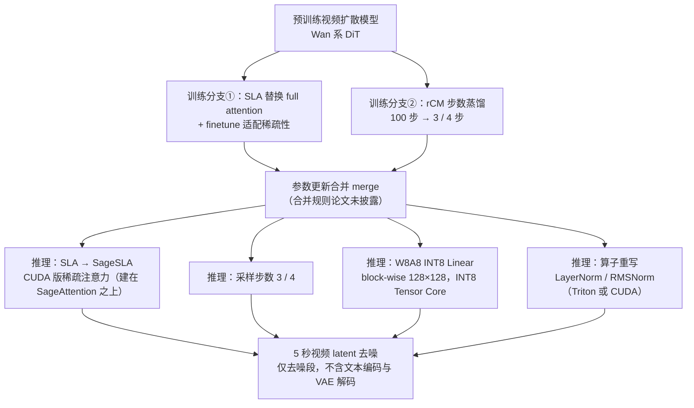
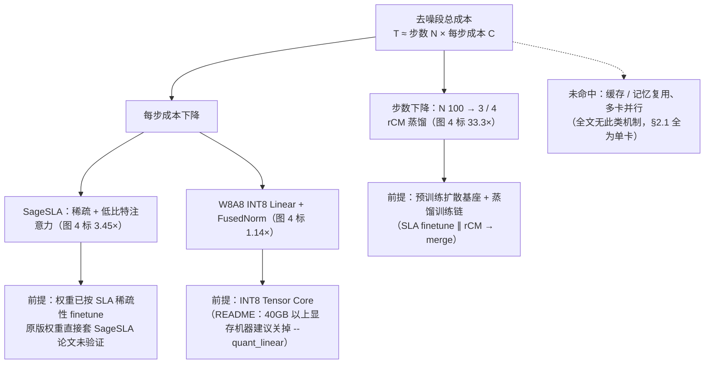

# TurboDiffusion

## 论文信息

| 项 | 值 |
|---|---|
| 标题 | TurboDiffusion: Accelerating Video Diffusion Models by 100–200 Times |
| 作者 | Jintao Zhang、Kaiwen Zheng、Kai Jiang、Haoxu Wang、Ion Stoica、Joseph E. Gonzalez、Jianfei Chen、Jun Zhu |
| 单位 | 清华大学 / 商汤（Shengshu Technology）/ UC Berkeley（analysis lane 记录） |
| venue / 年份 | arXiv 预印本 `2512.16093v1 [cs.CV]`，2025-12-18（HTML 页眉） |
| arXiv | `2512.16093` |
| 代码仓库 | https://github.com/thu-ml/TurboDiffusion（论文自称含 checkpoints / training / inference code，**本笔记未 clone 仓库复核**） |
| papers 库 | **未入本地 papers 库**（`data/papers.db` 无该条），故按命名规范写 `papers_id: arxiv-2512.16093` |

> **素材来源性质**：本篇主源为 arXiv LaTeXML 全文 HTML，**无可用 PDF**（`raw/sources/extraction-log.md`：PDF `IncompleteRead`、source tarball HTTP 406），因此全文引用只用**章节号 / 图号**，**不写页码**。证据等级与训练定位引用**本仓库知识库整理**（`management/docs/knowledge/视频生成训练与推理加速专题.md` §2.4，下称「我方整理」），属二手性质，已逐处标注。
>
> **本篇不含论文原图**：论文的图均为无图题的定性帧对比（同一 prompt 下 Original / FastVideo / TurboDiffusion 抽帧并排的拼图），没有可单独发布的机制图；因此本篇不发布任何论文原图，改用 2 张自绘 Mermaid（rCM 蒸馏 + 系统优化栈的组合关系；加速来源分解与依赖前提）+ 数值表格承载。图源实况（72 个 figure 块的实际形态）与不采用理由见 `.cache/article-note/turbodiffusion/analysis/image-collection.md`。
>
> **全文规模**：29 个编号图、**0 张表、0 个编号公式**（`ltx_table` / `ltx_equation` 计数均为 0）。所有效率数字都只存在于图题文字与 Abstract 里，正文没有公式与表格可引。

## 一句话总结

TurboDiffusion **不是一个新模型，而是一套「训练期改造 + 推理期部署」的端到端加速配方**：训练阶段把预训练视频扩散模型改成稀疏注意力的学生并做步数蒸馏，推理阶段把训练期的稀疏注意力换成 CUDA 版 SageSLA、把 Linear 层量化为 INT8（W8A8），再配合算子重写，得到论文报告的 100–200× 端到端去噪延迟下降。

- **它优化的是「步数 × 每步成本」这个乘积**：去噪步数由 rCM 蒸馏从 100 压到 3–4；每步成本由 SageSLA（稀疏 + 低比特注意力）、W8A8 INT8 线性层、算子重写共同压低（图 4）。
- **它需要训练，且是后训练式的**：起点是预训练 Wan 系视频扩散模型；训练分两支并行——SLA 替换 full attention 并微调（适配稀疏性）∥ rCM 蒸馏成少步学生，然后把两支参数更新**合并（merge）成单一模型**（§1.2）。不是零训练，也不是从头训练。
- **它的报告口径很窄**：单张 RTX 5090、5 秒视频、480P/720P、延迟只算**扩散生成段**（§2.2 明确排除文本编码与 VAE 解码）。Wan2.1-T2V-14B-720P 上 4767s→24s（约 199×）。
- **它的质量证据是定性视觉对比**：全文没有 VBench / FVD / PSNR / SSIM / CLIP / 人工偏好任何一种量化指标，只有图 5–29 的并排抽帧与「maintains the video quality」的断言。
- **它不涉及缓存、记忆复用与多卡并行**：全文既无 cache / KV 复用 / TeaCache 类机制，也没有多卡推理结果——这与 DAX（TeaCache + 序列并行 + 8×H20）形成正交互补。

### 四问速答

| 问 | 答（含来源与等级） |
|---|---|
| ① 加速的是哪一段成本 | **去噪步数 + 系统与算子**。步数：rCM 蒸馏把采样步数从 100 压到 3–4（图 4 标 33.3×，是收益最大的一级）；系统与算子：SageSLA 稀疏 + 低比特注意力（图 4 标 3.45×）、W8A8 INT8 线性层与算子重写 FusedNorm（图 4 标 1.14×）。**未命中缓存 / 记忆复用类**（全文无 cache / KV 复用 / offload 机制），**未命中多卡并行**（评测全为单卡）。来源：§1.1–§1.3、图 4（论文明确描述 / 论文已验证） |
| ② 训练前提 | **需要训练（蒸馏）**。§1.2 首句 "Given a pretrained video diffusion model..."：两支并行训练（SLA 微调 ∥ rCM 蒸馏）→ 权重合并；训练数据「real or synthetic」皆可，规模与超参**未披露**。属我方整理 §三 训练费光谱里的「蒸馏或 QAT」一档。只覆盖 Wan 系全序列 DiT，论文把自回归视频扩散列为未来工作（§3） |
| ③ 证据等级 | **论文已验证**（延迟与倍数，来源为论文图题与图内文字）；**但主要质量证据是视觉对比，缺 VBench/FVD 量化**。本条来源：**我方整理（知识库 视频生成训练与推理加速专题 §2.4）**，与本篇 analysis lane 复核一致（全文检索 `VBench`/`FVD`/`PSNR`/`SSIM` 均为 0 次） |
| ④ 报告口径与边界 | Wan2.1-T2V-14B、**720p**、5 秒、**RTX 5090（单卡消费级）**：4767s→24s（**约 199×**），口径为「扩散生成延迟，排除文本编码与 VAE 解码」。**与 DAX（Wan2.1-T2V-14B、720p、8×H20：6836s→188s，36.4×，仓库 benchmark）等口径不同、不可直接横比**（我方整理 §2.4 总调：两层的模型、硬件、质量口径不同，不能拼成统一速度排行榜） |

> **事实核对注（1）**：知识库 §2.4 记本工作为「Wan2.1-14B、720p、RTX5090：4767s→24s，199×」，与 analysis lane 从图 24/图 3 图题核算的 4767/24 ≈ 198.6 一致，**无冲突**。
> **事实核对注（2）**：标题与摘要写 100–200×，但图 3 中 **Wan2.1-T2V-1.3B-480P 的实测是 97×**（184s→1.9s，184/1.9 ≈ 96.8）；知识库 §2.4 未登记这一行，本篇照录并在此标注，**不写「最低 100×」**。
> **事实核对注（3）**：知识库 FAQ 有「其中原始基线还包含 CPU offload」一句；analysis lane 出现口径冲突——experiment lane 从 arXiv PDF 矢量文本层读到图 4 有 `CPU Offload` 行（4767→3182s，标注 `OOM, Cannot Run`），而 terminology lane 指出 HTML 全文无 `offload`/`CPU` 字样。**本篇照录两方口径并登记为待核**，不把该行纳入结论性叙述。

## 问题与动机

视频扩散的推理成本可以粗略拆成两件事：**要跑多少步（N）**，以及**每一步多贵（C）**。两条线各自都有成熟做法，但论文要解决的是"把它们放在一起"的问题：

- **单点优化收益有限**：只做系统与算子优化，图 4 给出的增量只有 **1.14×**（W8A8 + FusedNorm）与 **3.45×**（SageSLA）；单靠量化或算子重写无法把分钟级延迟拉到秒级。
- **步数蒸馏收益最大但会独吞瓶颈**：rCM 把 100 步压到 3–4 步，图 4 标了 **33.3×**——这一级的量级与系统优化高一个数量级（这一点直接呼应我方整理 §三「训练代价越高，通常能改变的上限越大」）。
- **已有加速技术的组合顺序是一个真问题**：训练无关地套稀疏注意力到已蒸馏的少步模型上，或先蒸馏再补训稀疏，都会遇到质量与数据代价问题（相邻工作的同类结论见 [[论文笔记/blade|BLADE 模型笔记]]）。论文的 insight 是**算法与系统协同优化（algorithm and system co-optimization）**：把稀疏约束**放进训练回路**（SLA 替换 full attention 并 finetune），再让步数蒸馏与它**并行训练后合并**，使两者叠加而不互相抵消（§1.1–§1.2）。
- **一条关键的论文主张**：稀疏计算与低比特 Tensor Core 加速**正交**，因此 SLA 可以叠在 SageAttention 上取得**累加**加速（§1.1 第 2 条）；又因「通过权重合并，rCM 天然继承注意力层级的加速」（§1.1 第 3 条），两支训练可以乘积式叠加。
- **代价是研究成本**：这是一条**必须训练**的路线（本方未接入、也无本地训练链，见 §8），而且论文把训练细节全部外链到 GitHub。

需要说明的是：论文**没有给出机制图、没有 pipeline 图**（图 1–4 分别是样例帧、样例帧、速度对比图、延迟分解图），下游要理解方法只能读 §1.1–§1.3 的纯文字叙述。本篇的两张 Mermaid 即为此自绘。

## 方法精析

TurboDiffusion 由**四个训练/推理模块**组成，其中两个在训练期生效（SLA finetune、rCM 蒸馏），两个在推理期生效（SageSLA、W8A8 + 算子重写）；训练期的两支结果必须**合并成单一模型**才能让推理期同时吃到两边的收益。

Mermaid 1 要看三件事：① 训练是**两条并行分支**而不是一条串联流水线；② 两条分支必须在**权重层面合并**才成为可推理的单一模型——这是 100–200× 复合加速的结构性前提，也是论文最模糊的一处（合并算法**未披露**，§1.2 只说 merge 两支参数更新，§1.1 却断言合并让 rCM「天然继承」注意力加速）；③ 推理期四项改造中，只有**步数**那一项来自蒸馏，其余三项都是实现层的替换与量化。

### 模块 A：注意力加速（训练期 SLA + 推理期 SageSLA）

- **输入**：预训练模型的 full attention 层（§1.2 第 1 点：把 full attention 换成 Sparse-Linear Attention）。
- **处理**：训练期用 SLA 替换并 finetune；推理期把 SLA 换成 **SageSLA**——"a CUDA implementation of SLA built on top of SageAttention"（§1.3 Attention acceleration）。
- **输出**：稀疏化的注意力计算路径，叠加低比特 Tensor Core 加速。
- **依赖**：SageAttention 家族（论文引用 [1][2][3][4]，实际选用 **SageAttention2++** [3]）；SLA 论文 [5]。
- **正交性论证（论文明确描述）**：稀疏计算与低比特 Tensor Core 加速正交，故可累加（§1.1 第 2 条）。
- **未披露**：kernel 级加速数字、稀疏度对训练收敛的影响、SageSLA 与 SLA/SageAttention 的逐项对照。

### 模块 B：步数蒸馏（rCM）

- **输入**：预训练教师模型（§1.2）。
- **处理**：用 rCM [6] 蒸馏成采样步数更少的学生模型；推理时步数从 100 降到 **4 或 3**（§1.1 第 3 条、§1.3 Step distillation）。
- **输出**：少步学生权重（图 4 中对应 84s 那一级）。
- **关键耦合**：论文称「Through model weights merging, rCM naturally inherits attention-level accelerations」（§1.1 第 3 条）——**推断**：这是"两支分开训练仍能叠加"的关键假设，但论文未给合并算法。
- **未披露**：rCM 的损失/目标函数、蒸馏步数配置、训练成本。

### 模块 C：W8A8 线性层量化

- **输入**：Linear 层的权重与推理期激活（§1.3）。
- **处理**：权重与激活都量化到 **INT8**，**block-wise，block size 128×128**，用 INT8 Tensor Core 做矩阵乘（§1.1 第 4 条、§1.3）。
- **输出**：模型体积**约减半**（§1.3 原文 "compress the model size by roughly half"），Linear 层更快。
- **未披露**：校准流程、离群点处理、是否 per-channel、是否有 QAT 参与（与 FPSAttention 那类 FP8 + QAT 路线不同，本文未见量化感知训练描述）。

### 模块 D：算子重写（系统层）

- **输入**：LayerNorm、RMSNorm 等逐元素/归约算子（§1.3 Other optimizations）。
- **处理**：用 **Triton 或 CUDA** 重实现；图 4 中记为 "FusedNorm"。
- **输出**：更高算子效率；**具体加速数字未披露**（论文以 "several other operations" 概括，未列清单）。

### 公式（照录与形式化）

> **来源声明**：论文**没有编号公式**（HTML 中 `ltx_equation` 计数为 0），也没有给出 SLA / SageSLA / rCM 的任何目标函数或算法伪代码（均外链引用 [5][6]）。因此下面 4 个块级公式**均标注为「我方形式化」**——它们是据图 4 的阶梯数值与 §1.1–§1.3 的文字描述建立的可核验关系式，**不归到论文名下**。

**式 1：去噪成本的两因子分解**

$$
T_{\text{denoise}}\approx N\cdot\bar{C},\qquad
S_{\text{total}}=\frac{T_{\text{orig}}}{T_{\text{turbo}}}
=\frac{N_{\text{orig}}\,\bar{C}_{\text{orig}}}{N_{\text{turbo}}\,\bar{C}_{\text{turbo}}}
=S_{\text{step}}\cdot S_{\text{per-step}}
$$

| 符号 | 含义 |
|---|---|
| $T_{\text{denoise}}$ | 去噪段总延迟（论文口径：不含文本编码与 VAE 解码） |
| $N$ | 采样步数（原 100，蒸馏后 3–4） |
| $\bar{C}$ | 单步平均成本（注意力 + Linear + Norm 等） |
| $S_{\text{total}}$ | 端到端加速比 |
| $S_{\text{step}}=N_{\text{orig}}/N_{\text{turbo}}$ | 步数维的倍率 |
| $S_{\text{per-step}}=\bar{C}_{\text{orig}}/\bar{C}_{\text{turbo}}$ | 每步成本维的倍率 |

这个式子是全文的读法总纲：**TurboDiffusion 的 199× 是「步数」与「每步成本」两个因子的乘积**，缺任一项都到不了秒级——这也是四问①「去噪步数 + 系统与算子」两段都要动的形式化表述。

**式 2：步数维倍率恰好解释了图 4 的 rCM 一级**

$$
S_{\text{step}}=\frac{N_{\text{orig}}}{N_{\text{student}}}=\frac{100}{3}\approx 33.3
$$

| 符号 | 含义 |
|---|---|
| $N_{\text{orig}}$ | 原始采样步数（论文口径给的是 100） |
| $N_{\text{student}}$ | 蒸馏后学生模型的步数（实验用 3，作者推荐 4） |

**这是本篇最有说服力的一个交叉验证**：图 4 在 "+rCM" 一级标注的正是 **33.3×**，与 $100/3$ 几乎相等。它说明这一级的收益基本**全部来自步数减少**，而不是每步变快——即蒸馏没有改变单步的计算结构（**我的解释**：因而不与 SageSLA / W8A8 的每步收益冲突，两者可乘）。反过来，若换成推荐的 4 步，同一级的理论倍率只有 25×。

**式 3：图 4 的逐级乘积（口径复原）**

$$
S_{\text{total}}=\prod_{k=1}^{4}S_k\approx 1.50\times 1.14\times 33.3\times 3.45\approx 199
$$

| 符号 | 含义 |
|---|---|
| $S_1\approx 1.50$ | 4767 → 3182s（图 4 的 `− CPU Offload` 一级；**该行语义未披露，登记待核**） |
| $S_2=1.14$ | + W8A8 & FusedNorm：3182 → 2783s（图 4 标注） |
| $S_3=33.3$ | + rCM：2783 → 84s（图 4 标注） |
| $S_4=3.45$ | + SageSLA：（图 4 标注；84/3.45 ≈ 24.3s 与终值 24s 吻合） |

**读法**：四级相乘 ≈ 199，与论文终值 24s（4767/24 ≈ 198.6）自洽。但要注意两个边界：① $S_4$ 对应的延迟值在图 4 中**没有单独标出**（24s 只出现在 `(final version)` 行），84/3.45 ≈ 24.3 是**我的推断**；② 若剔除 $S_1$ 那一行，四级乘积 1.14 × 33.3 × 3.45 ≈ 131，与 199 相差的正是那个语义不明的 CPU-offload 台阶。**结论性叙述只用 $S_2$–$S_4$ 三级。**

**式 4：W8A8 的块级量化（粒度来自 §1.1/§1.3）**

$$
x_q=\operatorname{clamp}\!\left(\left\lfloor\frac{x}{s}\right\rceil,\,-128,\,127\right)\cdot s,\qquad
s=\frac{\max_{b\in\mathcal{B}}|x_b|}{127}
$$

| 符号 | 含义 |
|---|---|
| $x$ | 原始 BF16/FP16 权重或激活元素 |
| $\mathcal{B}$ | 量化块，论文给出 block size **128×128**（权重与激活同粒度） |
| $s$ | 该块的缩放因子（block-wise scale） |
| $\lfloor\cdot\rceil$ | 就近取整 |
| $x_q$ | 反量化后的值；矩阵乘在 INT8 Tensor Core 上完成 |

论文只给了「权重与激活同为 INT8、block-wise、128×128、模型体积约减半」这几个事实，上式是把该粒度写成可实现的量化-反量化形（**我方形式化**）。它与非 block-wise 的 per-tensor 量化的差别藏在 $\mathcal{B}$ 里：块越小越能吸收离群值，代价是 scale 的存储与访存开销。

## 训练与实现细节

| 项 | 值 | 披露状态 |
|---|---|---|
| 数据集 | 论文只说 "All training can utilize either real or synthetic data"（§1.2 末），**未给数据集名称** | 部分披露 |
| 数据规模 | **论文未披露**；analysis lane 记录 README 提到 Wan2.1-14B 合成数据集（路径示例含 `Wan2.1_14B_480p_16:9_Euler-step100_shift-3.0_cfg-5.0_seed-0_250K`，即 250K 样本 / 100 步 / shift 3.0 / cfg 5.0 / seed 0）→ **代码或 README 证据**（本笔记未 clone 复核） | 论文未披露 |
| 预处理 | 未披露 | 未披露 |
| 模型初始化 | 从**预训练视频扩散模型**出发（Wan 系 DiT，§1.2 首句） | 已披露 |
| batch size | 未披露 | 未披露 |
| 学习率 / 调度 | 未披露 | 未披露 |
| 优化器 | 未披露 | 未披露 |
| 训练轮数 / 步数 | 未披露 | 未披露 |
| 硬件 / 成本 | **论文未披露**；README 训练示例为 `torchrun --nproc_per_node=8`（8 卡单节点），工程栈为 NVlabs/rcm + FSDP2 + Ulysses CP + selective activation checkpointing → **代码或 README 证据** | 论文未披露 |
| 随机种子 / 复现设置 | 未披露（README 推理脚本默认 `--seed 0`、`--num_samples 1`） | 未披露 |

**训练流程（§1.2，论文明确描述）**：

1. **分支①**：把 full attention 替换为 SLA，并 finetune 预训练模型以适配稀疏性（README 记为 **white-box SLA 训练**：对齐 SLA 模型的预测与 full-attention 教师模型的预测 → **代码或 README 证据**）。
2. **分支②**：同时用 rCM 把预训练模型蒸馏成步数更少的学生模型。
3. **合并**：把两支的参数更新 merge 进单一模型。README 给出合并脚本 `turbodiffusion/scripts/merge_models.py`（`--base=rCM, --diff_base=预训练, --diff_target=SLA 微调`）→ **代码或 README 证据**；**论文本身未披露合并规则**。

**一句话**：这不是零训练（对照我方整理 §2.4 的 DAX），也不是从头训练（对照 NAR），而是**在预训练扩散模型上的后训练（微调 + 蒸馏 + 权重合并）**；虽然论文把训练细节全部写「Please see our GitHub Code for more details」，但至少明确了一点：**没有蒸馏那一支，就没有图 4 里最大的 33.3×**。

## 推理与系统链路

| 阶段 | 处理 | 是否被 TurboDiffusion 加速 |
|---|---|---|
| 文本编码 | prompt 编码 | **否**（且被排除在延迟口径外，§2.2） |
| 初始 latent | 采样初始噪声 | 否 |
| 去噪主体（3–4 步） | SageSLA 稀疏 + 低比特注意力；INT8 Linear；FusedNorm 算子 | **是**——四招全部作用在这段 |
| VAE 解码 | latent 解码为视频帧 | **否**（同样被排除在延迟口径外） |

推理链路的三个工程边界必须一并记住：① 被加速的只有**去噪段**，论文的 "end-to-end" 是**扩散生成**的端到端（§2.2 原文：excluding the text encoding and VAE decoding stages），不是完整视频管线的端到端；② 评测全部在**单卡**（§2.1，各图题均写 "on a single RTX 5090"），没有序列并行 / TP / PP 结果；③ README 另记录了一条**硬件相关**的部署取舍——显存 40GB 以上的机器（如 H100）建议用非量化 checkpoint 并去掉 `--quant_linear`，即 **W8A8 的收益在高端卡上默认不启用**（**代码或 README 证据**；原因未解释，**我的解释**：算力充裕时 INT8 的精度代价可能不值得）；此外启用 SageSLA 需先装外部编译组件 `SpargeAttn`。

Mermaid 2 是四问①与②的合成视图：**左边两条边是两个加速来源，右边三个框是各自不可省的前提**。它同时把"我方能不能只拿推理侧三件套"这个问题问清楚了——可以，但图 4 给这三件的增量只有 1.14 × 3.45 ≈ 3.9×（且基线是已经过 CPU-offload 处理的形态），**33.3× 那一级必须有训练链**。

## 实验与结果

### 评测设置（§2.1–§2.2，论文明确描述）

| 项 | 值 |
|---|---|
| 评测模型 | Wan2.2-I2V-A14B-720P、Wan2.1-T2V-1.3B-480P、Wan2.1-T2V-14B-720P、Wan2.1-T2V-14B-480P |
| 基线 | 官方 Wan 实现（记为 Original）+ FastVideo（A14B-I2V-720P 上 FastVideo**无加速版本**，只与 Original 比） |
| 时长 / 分辨率 | 全部 **5 秒**；480P 与 720P（帧数与 FPS **未披露**，README 默认 `--num_frames 81`） |
| 硬件 | **单张 RTX 5090**；§2.1 另定性提到 RTX 4090 / H100 上也有 "substantial acceleration"，**未给数字** |
| 延迟口径 | 端到端**扩散生成**延迟，**排除文本编码与 VAE 解码**（§2.2 首段） |
| 超参（本文） | Top-K ratio = **0.1**（对应 90% 注意力稀疏）、采样步数 **3**；作者推荐 Top-K ∈ **[0.1, 0.15]**、**4** 步以稳定取最佳画质（§2.1） |
| 超参（FastVideo） | 官方默认：3 步 + attention sparsity **0.8**（与本文 Top-K 口径不同，不可互换） |
| 数据集 / seed / 重复次数 | **未披露**（评测输入是作者自选的长英文 prompt，逐条列在图 5–29 图题中） |
| 质量指标 | **未量化**——无 VBench / FVD / PSNR / SSIM / CLIP / 人工偏好，只有并排抽帧 |

### 主结果：跨模型加速比（图 3，论文标注 + 我的复算）

| 模型 | Original 延迟 | FastVideo 延迟 | TurboDiffusion 延迟 | 论文标注加速比 | 我的复算 |
|---|---|---|---|---|---|
| Wan2.2-I2V-A14B-720P | 4549s | 未提供 | 38s | **120×** | 4549/38 ≈ 119.7 |
| Wan2.1-T2V-1.3B-480P | 184s | 5.3s | 1.9s | **97×** | 184/1.9 ≈ 96.8 |
| Wan2.1-T2V-14B-480P | 1676s | 26.3s | 9.9s | **170×** | 1676/9.9 ≈ 169.3 |
| Wan2.1-T2V-14B-720P | 4767s | 72.6s | 24s | **199×** | 4767/24 ≈ 198.6 |

数字说明三件事：① **倍数随模型变大而升高**（97× → 170× → 199×），符合"原本每步越贵、系统侧与步数侧的绝对收益越大"的直觉；② **A14B-I2V 的 120× 偏低是口径造成的**——图 3 图题自己写明该延迟含高噪声 / 低噪声两个模型之间的**切换开销**，并称 "In theory, the achievable speedup is identical"，所以**不能把 120× 读成"方法在 I2V 上更弱"**；③ 相对 FastVideo 的领先是 modester 的 **2.7–3.0×**（1.3B-480P ≈2.8×、14B-480P ≈2.7×、14B-720P ≈3.0×），**199× 与 3× 是两个不同分母，切勿混用**。

### 逐级加速分解（图 4，Wan2.1-T2V-14B-720P，单卡 RTX 5090）

| 阶段 | 延迟 (s) | 该级加速比（图内标注） | 累计（我的复算） |
|---|---|---|---|
| Original | 4767 | — | 1× |
| − CPU Offload | 3182（标注 `OOM, Cannot Run`，**该行语义未披露，待核**） | 未标注 | ≈1.50× |
| + W8A8 & FusedNorm | 2783 | 1.14× | ≈1.71× |
| + rCM | 84 | 33.3× | ≈56.8× |
| + SageSLA | （图中未单独标延迟值） | 3.45× | — |
| (final version) | 24 | — | **199×**（论文标注） |

**这张阶梯图是全文最有用也最容易误引的一张**：它把"步数蒸馏远比算子优化重要"用数字摆了出来（33.3× vs 1.14×）。但它同时是**唯一的分组件信息**，论文没有任何消融章节、没有任何表格、正文也不解释这一阶梯。**我们把结论限定为：$S_2$–$S_4$ 三级可信；$S_1$ 的 CPU-offload 行按待核处理。**

### 质量结果：无量化指标

论文关于质量只有两处断言（§2.2 末、§3）：

- "TurboDiffusion not only achieves the highest efficiency but also maintains the video quality, demonstrating clear superiority to FastVideo."
- "achieves 100–200× end-to-end diffusion speedup with negligible quality degradation"

其全部支撑材料 = 图 1、图 2 与图 5–29 的**并排抽帧**（每图列出 Original /（部分）FastVideo / TurboDiffusion，各 6 帧）。**全文没有 VBench / FVD / PSNR / SSIM / CLIP / 人类偏好的任何数字**，因此：

- 不能写「质量无损失已验证」；
- 只能写「作者报告质量可比、退化可忽略，**依据是并排抽帧的定性视觉对比，无量化指标**」；
- 尤其 1.3B-480P 那一组（97×）在 3 步 + 90% 稀疏下的实际质量走向，**无法从静态抽帧判断**。

### 消融与关键配置缺口

| 项目 | 论文是否给出 | 内容 |
|---|---|---|
| 组件级消融表 | **未披露** | 全文档 0 张表；唯一分组件信息是图 4 的阶梯 |
| 步数消融（1/2/3/4 步质量对比） | **未披露** | 只给推荐值：实验用 3 步、建议 4 步 |
| Top-K / 稀疏度消融 | **未披露** | 只给推荐区间 [0.1, 0.15] |
| W8A8 精度影响 | **未披露** | 只说模型体积约减半 |
| SageSLA vs SLA vs SageAttention 对照 | **未披露** | 只描述推理期"SLA 换成 SageSLA" |
| 权重 merge 的消融 | **未披露** | §1.2 只描述流程；README 的 `merge_models.py` 属代码证据 |
| 训练数据量 / 步数 / 学习率 / 成本 | **未披露**（论文） | README 有 250K 合成样本与 8 卡训练示例 → 代码或 README 证据 |
| 4090 / H100 上的数字 | **未披露** | §2.1 仅定性 |
| 显存占用实测 | **未披露** | 只有 "roughly half" 定性 |
| 计时方法（warmup、是否含首次编译、CPU offload 是否在计时内） | **未披露** | 图 4 出现 CPU-offload 台阶说明基线路径影响很大，但论文未说明 |

### 与知识库口径的核对（事实核对表）

| 项 | 知识库 §2.4（我方整理） | analysis lane（论文主源） | 处理 |
|---|---|---|---|
| 报告口径 | Wan2.1-14B、720p、RTX5090：4767s→24s，199× | 图 3 / 图 24 图题：4767s / 72.6s / 24s；199× | **一致**，本篇照录 |
| 训练要求 | 需要训练（rCM 蒸馏 + SageSLA + W8A8 + 算子融合） | §1.2：SLA finetune ∥ rCM 蒸馏 → 权重合并 | **一致** |
| 证据等级 | 论文已验证；主要质量证据是视觉对比，缺 VBench/FVD 量化 | 图题数字齐备；全文无任何量化质量指标 | **一致**，并按知识库原文标注「我方整理」 |
| 其余三组倍数 | 未登记 | 图 3：120× / 97× / 170× | **知识库未登记 → 本篇照录并注明来源为论文图 3**；其中 97× 低于标题的 100×，已加注 |
| 原始基线是否含 CPU offload | FAQ 写「原始基线还包含 CPU offload」 | experiment lane（PDF 文本层）读到图 4 有 `CPU Offload` 行；terminology lane（HTML）全文无 `offload`/`CPU` | **两 lane 冲突，登记待核**；正文不把该行写进结论 |

## 相关工作与定位

| 类别 | 代表工作 | 与本文的关系 |
|---|---|---|
| 低比特注意力 | SageAttention / SageAttention2 / **SageAttention2++** / SageAttention3（文献 [1]–[4]，作者本人工作） | 本文实际选用 **SageAttention2++** 做低比特注意力内核 |
| 稀疏注意力 | **SLA: Sparse-Linear Attention**（文献 [5]，arXiv:2509.24006） | 训练期用它替换 full attention 并 finetune；推理期换成其 CUDA 实现 SageSLA |
| 步数蒸馏 | **rCM: Large Scale Diffusion Distillation via Score-Regularized Continuous-Time Consistency**（文献 [6]，arXiv:2510.08431） | 本文用它把 100 步蒸到 3–4 步；"rCM" 全称论文正文未展开（据文献标题推断，**我的解释**） |
| 基座与基线 | Wan 官方实现（[7]，arXiv:2503.20314）、FastVideo（[8]） | Original 与 FastVideo 两条基线 |

**在加速技术地图中的位置（对照「我方整理」§2.4「端到端系统」）**：

| 维度 | TurboDiffusion | DAX | Inferix |
|---|---|---|---|
| 核心做法 | rCM 蒸馏 + SageSLA + W8A8 + 算子融合 | 序列并行、SageAttention、compile、INT8 线性层、TeaCache | block-diffusion 推理引擎、KV 管理、并行、流式输出 |
| 训练要求 | **需要训练** | 零训练 | 需 block-diffusion 模型 |
| 报告口径 | Wan2.1-14B、720p、RTX5090：4767s→24s，199× | Wan2.1-T2V-14B、720p、8×H20：6836s→188s，36.4× | 未公开加速数值 |
| 证据等级 | **论文已验证**（延迟口径）；质量仅视觉定性 | **仓库 benchmark**；8 卡结果不能当单卡速度 | **引擎能力 / 待自测** |

（右两列来源：**我方整理** `knowledge/视频生成训练与推理加速专题.md` §2.4。）

**定位一句话**：三者是互补拼图而不是竞品——DAX 优化算子与系统、TurboDiffusion 用训练把步数压低、Inferix 服务 block-diffusion 的跨块状态与流式输出（我方整理 §2.4）。理论上 TurboDiffusion 的步数收益与 DAX 的系统收益可叠加，**但论文未验证叠加，两类口径也不可拼成统一速度排行榜**（我方整理总调）。

## 局限与启发

### 论文自陈的局限（§3）

论文只列了一条：未来扩展到**自回归视频扩散**——即当前配方不覆盖 AR 范式（也不覆盖 block-diffusion 范式）。

### 论文局限 vs 我们结论

**我方未接入 TurboDiffusion**——本地既无 Wan 系训练链，也无蒸馏/量化复现记录，因此下表只记**定位与可复用点**，不给任何"本地可用"的承诺：

| 维度 | 论文口径 | 我们的结论 |
|---|---|---|
| 本地是否接入 | — | **未接入**；本地无对应基座训练链与蒸馏入口，只作方法参考 |
| 证据等级 | 论文报告 199× 与逐级分解 | **论文已验证（延迟口径）**，来源**我方整理（知识库 视频生成训练与推理加速专题 §2.4）**；质量维度**证据不足** |
| **质量证据缺口（必记）** | "maintains the video quality"、"negligible quality degradation" | **只有视觉对比、无 VBench/FVD 量化**——因此本文不能被当作"3–4 步 + 90% 稀疏下质量无损"的依据；若我方要复用少步设置，必须**自测质量**（VBench 或人工偏好至少一项） |
| 本地复现（训练） | 训练流程两步 + merge | **待自测**；数据规模、batch、学习率、优化器、训练步数、GPU 小时**全部未披露**，无法估本地方案成本；README 的 8 卡示例只说明"论文团队这么训" |
| 本地复现（推理三件套） | W8A8 & FusedNorm 1.14× / SageSLA 3.45× | **待自测**：这两级合计约 3.9×，但**量级远小于 199×**，且其基线是已经过 CPU-offload 处理的 2783s 形态，**不能直接乘到自己的模型上** |
| 可复用点 1 | 步数蒸馏独占收益大头（图 4：33.3× vs 1.14×） | 与「微调策略专题」「我方整理 §三」的判断一致：**训练代价越高、能改变的上限越大**。选型排序应是"先看能不能改训练，再谈内核优化" |
| 可复用点 2 | 稀疏约束放进训练回路 + 两支训练后合并（§1.2） | 机制可迁移到我们的 LoRA/蒸馏工作流：**近似约束在训练期注入，而不是推理期后贴**；但合并规则需从代码确认（论文**未披露**） |
| 可复用点 3 | W8A8 的收益与硬件绑定（40GB 以上显存建议关掉） | 若我方目标硬件是 H100/A100，**量化那一级可能不适用**——部署前先确认硬件档位再决定是否做 INT8 Linear |
| 未披露清单 | — | Mermaid 合并算法、rCM 目标函数、SLA 稀疏度对收敛的影响、量化校准流程、seed、每 prompt 条数、计时方法、其他 GPU 数字、显存实测、训练成本——**一律写「未披露」，不猜** |

### 可操作启发

1. **引用数字必须带齐四件套**：模型规模 + 分辨率/时长 + 硬件（单卡 RTX 5090） + 口径（只算去噪段）。少任何一件，"199×"都会被误读成用户侧可见的端到端时间。
2. **不要把 199× 当方法强弱**：与 120×（A14B-I2V-720P）的差值部分来自高/低噪声双模型切换开销（作者自述），与基线选择有关。
3. **若要读训练细节，必须读代码**：论文的训练信息量近乎为零（只有"见 GitHub"），评估可迁移性不能只读论文。
4. **区分"我方能拿到的收益"与"论文总收益"**：只拿推理侧三件套 ≈3.9× 量级；要 33.3× 那一级就必须建训练链（SLA finetune + 蒸馏 + merge）。
5. **横比禁令**：与 DAX（8×H20、仓库 benchmark）、Inferix（无数值）等并列时，必须复述"不能拼成统一速度排行榜"，并注明本工作为论文自报。

## 术语与符号表

| 术语 | 英文 / 原文 | 含义 |
|---|---|---|
| 稀疏-线性注意力 | Sparse-Linear Attention (SLA) | 训练期替换 full attention 并 finetune 的稀疏注意力机制（引 [5]） |
| SageSLA | SageSLA | SLA 的 **CUDA 实现**，建在 SageAttention 之上；**推理期**用它替代训练期的 SLA |
| 低比特注意力 | SageAttention2++ | SageAttention 家族中被本文实际选用的变体（论文简称 SageAttention） |
| Top-K ratio / 稀疏度 | Top-K ratio = 0.1 ↔ 90% sparsity | 实验配置；对应 90% 注意力稀疏 |
| 步数蒸馏 | step distillation（rCM） | 把采样步数从 100 降到 4 或 3 |
| rCM | rCM（引 [6]） | 本文采用的扩散蒸馏方法；**全称论文正文未展开** |
| 权重合并 | model weights merging | 把 SLA 微调与 rCM 蒸馏两支参数更新合并回单一模型（合并规则**未披露**） |
| W8A8 量化 | W8A8 quantization | 权重与激活同为 INT8，block-wise，block size 128×128，走 INT8 Tensor Core |
| 块级量化粒度 | block-wise granularity | 本文为 128×128 的块 |
| 算子重写 / FusedNorm | FusedNorm | LayerNorm / RMSNorm 等用 Triton 或 CUDA 重写（图 4 记法） |
| 端到端延迟（本文口径） | end-to-end diffusion generation latency | **仅扩散生成段**，排除文本编码与 VAE 解码 |
| 原始实现基线 | Original（official Wan implementation） | 官方 Wan 实现作基线 |
| FastVideo | FastVideo（引 [8]） | 第二基线，官方默认 3 步 + 0.8 sparsity |
| 高/低噪声模型切换开销 | switching overhead | 仅 A14B-I2V-720P 有；使其实测倍数 120× 偏低 |
| 算法与系统协同优化 | algorithm and system co-optimization | 论文对整体方案的定位（图 4 的约 200×） |
| 自回归视频扩散 | autoregressive video diffusion | 论文列为未来工作，**当前不支持** |

| 符号 | 含义 |
|---|---|
| $N$ | 采样步数（原 100，蒸馏后 3–4） |
| $\bar{C}$ | 单步平均成本 |
| $S_{\text{step}}, S_{\text{per-step}}, S_{\text{total}}$ | 步数维倍率 / 每步成本维倍率 / 端到端倍率（**我方形式化**） |
| $S_k\ (k=1..4)$ | 图 4 的四级增量倍率：1.50 / 1.14 / 33.3 / 3.45 |
| $x, \mathcal{B}, s, x_q$ | 量化前元素 / 128×128 量化块 / 块内 scale / 反量化值（**我方形式化**） |
| $128\times 128$ | W8A8 的 block-wise 粒度（论文原文） |
| `0.1`、`90\%`、`[0.1,0.15]`、`3`、`4` | Top-K ratio / 稀疏度 / 推荐区间 / 实验步数 / 推荐步数（论文原文） |

## 相关文档

- 加速专题与定位：[[knowledge/视频生成训练与推理加速专题|视频生成训练与推理加速专题]]（§2.4 端到端系统；本篇证据等级来源）、[[数字人概述/数字人加速|数字人加速]]（生成侧加速四方向，链接待回补）
- 同组「端到端系统」对照：[[论文笔记/inferix|Inferix 模型笔记]]（引擎能力 / 待自测，无加速数值）
- 同属"训练型加速"的最近邻：[[论文笔记/blade|BLADE 模型笔记]]（块稀疏 × 步数蒸馏联合训练，VBench 量化齐全）——与本篇构成"有量化质量证据 vs 无量化质量证据"的直接对照
- 篇目与索引：[[论文笔记/README|论文笔记]]（本篇属「生成侧加速十篇」，papers 库未入库，仅登记 arXiv）
