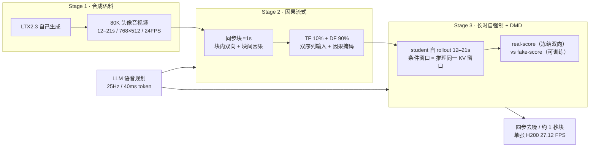
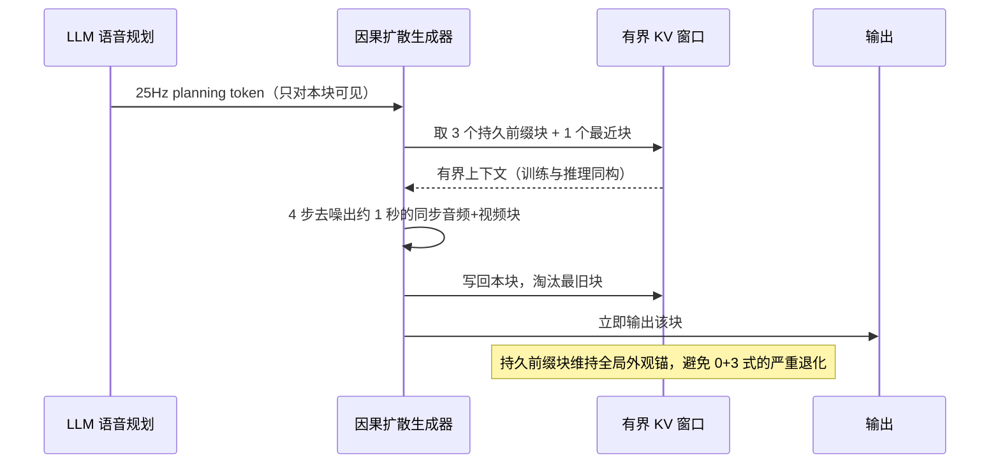

# Vorch-Streamer

## 论文信息

| 项 | 值 |
|---|---|
| 标题 | Vorch-Streamer: Extending Human Audio-Visual Generation to Real-Time Long-Form Streaming |
| 作者 | Menglin Han\*、Yang Ding\*、Yulei Lu、Haoran Yu、Xin Ma、Junyi Chen、Zhangkai Ni†、Lin Ma†、Yaohui Wang†（\* 同等贡献，† 通讯） |
| 单位 | Vorch Team、Tongji University、Harbin Institute of Technology (Shenzhen)、Shanghai Jiao Tong University |
| venue / 年份 | arXiv `v2`（2026-08-07）；该版本未声明 venue |
| arXiv | `2608.05663v2` |
| 项目页 | https://vorch-project.github.io/Vorch-Streamer-project/ |
| 代码仓库 | 论文未给出代码仓库（项目页存在，未见开源声明） |
| papers 库 | **未入库**，因此本篇只登记 `arxiv_id`，不写 `papers_id` |

## 一句话总结

**在一个预训练的双向音视频基座上做后训练，把「自回归复用生成块」的暴露偏差用长时自强制压住**；同时承认第二个困境——全局转写说完了「要说什么」，因果块却不知道「现在该说哪一段」——于是把语音规划显式交给一个 LLM。

- **合成语料**：用基座模型自己生成 80K 段头像音视频（12–21 秒），理由是「与初始化同一个基座 ⇒ model-consistent 的监督」。
- **因果流式**：把音视频切成约 1 秒的同步块，块内双向、块间因果；训练用 **10% Teacher Forcing + 90% Diffusion Forcing** 的样本级混合缩小训练/推理差距。
- **长时自强制 + DMD**：让 student 用自己的预测跑完 12–21 秒，并条件于**与推理完全相同的**有界 KV 窗口；冻结的双向基座充当 real-score 教师，配一个可训练的 fake-score 网络做 DMD 蒸馏。
- **LLM 语音规划**：把话语转成 25 Hz 的离散 planning token（每 token 40 ms），经查表与投影注入音频分支，并附一个可学习的 silence token，从而支持打断与显式静默倾听。

## 问题与动机

论文把实时长时头像音视频生成的两难写在摘要与引言里，两条都出在**把双向模型改造成因果生成器**这一步：

1. **暴露偏差导致漂移累积**。自回归地复用已生成的块作为上下文，会让小误差沿因果历史传播。论文的原话是：因果注意力下这种分布位移会导致 **compounding artifacts、temporal drift 与 unstable long-horizon generation**。它在 §2.1 顺带点出基座自己的问题——LTX-2 在**超出其支持时长**后就报告时序漂移与同步退化。
2. **全局语音条件与因果音频生成不匹配**。文本 prompt 描述的是**整段话语**，而每个流式块只能看到有限窗口内**已经生成**的音视频内容。在双向模型里这种对齐是隐式的（所有 token 可全局交互）；一旦改成因果注意力，**同一个 prompt 就让扩散模型同时负责「说什么」与「什么时候说」**——论文报告的失败现象是生成的音频**可能从目标语音的中间开始**，或在时间上与对应语音位置错配。这个问题在长时生成与相邻语音段边界附近尤其严重。

## 方法精析

整体链路是一条**后训练流水线**，而不是新架构：基座（LTX2.3，22B）不动，三个阶段依次把「双向」改造成「因果、长时、可推进语音」。

### 合成语料只用一条理由

论文用基座自己合成 **80K 段头像音视频（12–21 秒）**，并明确给出唯一理由：这些样本由**与初始化同一个基座模型**生成，因此提供 **model-consistent** 的音视频监督，适合后训练。这批语料**同时服务** Stage 2 与 Stage 3。

需要如实记下的是：**论文没有给出任何其他理由**——没有真人数据配比、没有身份多样性与可控性的动机、没有清洗与过滤口径、没有许可与授权讨论。12–21 秒这个区间与 Stage 3 的 self-rollout 时长完全一致，从上下文看是为「长时自 rollout 训练」配套选定的，但论文没有把这层因果关系写出来。

### 因果流式：同步块、有界窗口与 TF/DF 混合

**同步块切分**。视频与音频 latent 被切成同步的块（式 1）：

$$
\mathcal{B}_b=\left(\mathbf{x}^v_0\!\left[s^v_b:e^v_b\right],\ \mathbf{x}^a_0\!\left[s^a_b:e^a_b\right]\right)
$$

$\mathbf{x}^v_0$、$\mathbf{x}^a_0$ 是干净的视频/音频 latent，$s,e$ 是各自的起止位置。按基座 VAE 的口径（视频 3 latent frame/秒、音频 25 latent token/秒），**每个常规块 = 3 个视频 latent frame + 25 个音频 latent token ≈ 1 秒**内容。第一块因因果 VAE 对齐而**多 1 个视频 frame 与 1 个音频 token**——论文注明这一处沿用了 OmniForcing 的做法。

**块内双向、块间因果，窗口有界**。为了同时给出「稳定身份上下文」与「近期运动上下文」，训练时第 $b$ 块只关注前三个块与最近三个前置块（式 2）：

$$
\mathcal{H}_b=\{0,1,2\}\cup\left\{\max(0,b-3),\dots,b-1\right\}
$$

$\mathcal{H}_b$ 是可见块的集合。论文把这条有界窗口的作用写成：既实现 **constant-memory streaming**，又不丢弃初始外观与场景信息。实现分两路——因果训练期用注意力掩码施加同一依赖，长时训练与推理 rollc­out 期用 **windowed KV cache + cache eviction**。窗口记号在消融里写作 $P{+}R$（$P$ 个持久前缀块 + $R$ 个近期块）：**训练默认 $3{+}3$，推理默认 $3{+}1$**（由上下文消融选出）。

**TF/DF 混合**。直接用 Teacher Forcing 只会让模型看到干净真值历史，而流式推理的条件是**此前生成的、可能不完美的块**。于是论文按**样本级**混合：每个样本是**双序列输入**（一条 history 序列 + 一条内容相同的去噪序列），history 有 **10% 的概率保持干净**（Teacher Forcing），其余 **90% 被加噪**（Diffusion Forcing）。加噪按 flow-matching 插值（式 3）：

$$
\mathbf{x}^m_\sigma=(1-\sigma)\mathbf{x}^m_0+\sigma\bm{\epsilon}^m,
\qquad \bm{\epsilon}^m\sim\mathcal{N}(\mathbf{0},\mathbf{I}),
\qquad m\in\{v,a\}
$$

同时因果掩码保证当前去噪块能看到前置 history，**但读不到当前块的干净目标**。

### 长时自强制与 DMD

论文自述 Stage 2 不够：「混合因果 forcing 只让模型对**局部被破坏的上下文**鲁棒，并不能复现自回归推理期累积出的**结构化误差**」。Stage 3 的做法是改变**上下文的来源**：

- **student 用自己的预测**逐块生成 12–21 秒的序列；
- 每个新块通过**推理期同一个有界 KV 窗口**条件于**自己先前生成的块**——这直接把模型暴露在它自己的长时 rollout 分布下，从而关闭因果训练与流式推理之间的暴露差距；
- **固定窗口 cache** 同时保证内存不随序列长度增长，使训练行为与实时部署一致；
- 保留原始双向基座作为**冻结教师**，用 **DMD（分布匹配蒸馏）** 保住预训练的质量与语义保真度。

DMD 的三网络分工在论文里写明：① **因果 student** 产生长时 rollout；② **冻结的双向 real-score 模型**代表预训练目标分布；③ **可训练的双向 fake-score 模型**用 flow-matching 损失估计 student 样本**当前**的分布。流程是先把 student rollout 扰动到随机噪声水平，再让同一噪声样本同时过两个打分网络；real-score 用「条件 + 无条件预测」组合成引导教师目标，fake-score 只在条件分布上评估。更新方向取二者之差：

$$
\overline{\mathbf{g}}^m\propto\mathbf{p}^m_{\mathrm{fake}}-\mathbf{p}^m_{\mathrm{real}}
$$

$\mathbf{p}^m_{\mathrm{real}}$、$\mathbf{p}^m_{\mathrm{fake}}$ 分别是两个打分网络给出的方向。student 用带 stop-gradient 的代理目标被推向 real-score 预测、推离 fake-score 当前刻画的分布，fake-score 则在 detached 的 student rollout 上单独更新；两者**交替更新**，使 DMD 方向在生成器改进过程中持续有信息量。

### LLM 语音规划

这是对第二个困境的直接回应。论文的动作是**把语音规划与音视频实现显式分离**：

- planning LLM 给定目标话语，预测离散的 **speech-planning token 序列**，**25 Hz、每个 token 代表 40 ms 的 planning unit**；
- token 经预训练 **Fun-CosyVoice 查表**加可学习投影转成连续特征；因为 planning 序列与音频 latent **同为 25 Hz**，**每个因果块恰好收到属于它自己时间区间的语音特征**；
- 注入方式是在音频扩散分支加一条 **speech cross-attention**，并**严格限制音频 token 只能关注同一块内的 planning 特征**；输出用一个**可学习 gate** 与原文本条件特征自适应融合：

$$
\mathbf{h}^a_\ell\leftarrow\mathbf{h}^a_\ell+\operatorname{sigmoid}(g_\ell)\operatorname{Attn}^\ell_{\mathrm{speech}}\!\left(\mathbf{h}^a_\ell,\mathbf{e}^s\right)
$$

$\mathbf{h}^a_\ell$ 是第 $\ell$ 层音频隐状态，$g_\ell$ 是该层 gate，$\mathbf{e}^s$ 是 planning 特征。原 text cross-attention **保持不变**，继续负责全局语义、外观与说话风格；speech 分支提供显式的本地排期。

还有一处**非对称条件**值得记下：post-training 期间，因果 student 条件于「全局场景描述 + 对齐后的 planning token」，而 Self Forcing 里的双向 teacher **仍走它原本的文本条件路径、接收完整 utterance**。论文称这样教师保留预训练的全局建模能力，同时监督一个为「因果语音执行」而设计的 student。此外，planning 的查表上扩展了一个**可学习 silence token**，给模型显式的静默倾听能力，并声称因此**支持在流式过程中随时打断或切换语音**。

## 训练与实现细节

| 项 | 值 |
|---|---|
| 基座 | 预训练双向音视频模型 **LTX2.3**；§4.1 写 **22B**，§4.2/Table 1 写本文管线 **22.8B**（对象不同，非矛盾） |
| 合成语料 | 基座自己生成 **80K** 头像音视频片段，**12–21 秒**，**768×512**，**24 FPS** |
| Stage 1 | 用合成语料提供 model-consistent 监督（语料同时供 Stage 2/3 使用） |
| Stage 2 | **10% Teacher Forcing + 90% Diffusion Forcing**，**6,000 steps**，**64 × H200**，global batch 64，lr `1e-4` |
| Stage 3 | **1,000 iterations**，**32 × H200**，global batch 32，**critic:generator 更新比 6:1**，生成器与 fake-score lr 均 `1e-5`；在**完整 12–21 秒训练视界**上做 self-rollout；冻结双向 LTX2.3 作 real-score teacher |
| 推理 | 每个约 1 秒的音视频块用 **4 步去噪**；因果窗口默认 **3+1**（3 个持久前缀块 + 1 个最近块） |
| 语音规划 | planning token **25 Hz / 40 ms**；Fun-CosyVoice 查表 + 可学习投影；可学习 silence token |
| 评测 | held-out benchmark（多身份/语言/说话风格/背景/话语长度），目标约**两分钟**；时序指标按**固定 1 秒间隔**采样 |
| 指标 | Sync-C / Sync-D、FID、FVD、VBench Dynamic Degree、VBench Drift、VBench2 Human Anatomy / Human Identity、WER，外加 ArcFace 与 CLIP Image Similarity（对首帧） |
| 吞吐口径 | **生成帧数 ÷ 端到端 wall-clock**，在**单张 NVIDIA H200** 上测得 |
| 训练总机时 / 随机种子 / 数据清洗口径 | **未披露** |

## 推理与系统链路

三条值得记住的推理期设定：**每块只解 4 步**（相比 Stage 2 checkpoint 的 20 步 CFG）；**窗口训练用 3+3、推理用 3+1**；**内存与序列长度无关**（固定窗口 cache）。吞吐 27.12 FPS 是在单张 H200 上按「生成帧数 ÷ 端到端 wall-clock」测得的，论文称这是**唯一超过 24 FPS 播放速率的原生 T2AV 方法**。

## 实验与结果

### 评估口径与两组不可混比的任务

评测集是自建 held-out benchmark（覆盖多样身份、语言、说话风格、背景与话语长度，且 prompt 不与训练集重合）。基线与任务口径：

| 方法 | 参数 | 任务 | 因果出块 | 备注 |
|---|---|---|---|---|
| LTX2.3 | 22B | T2AV | ✗ | 离线质量参考，**不能因果出块** |
| JoyAI-Echo | 22B | T2AV | ✗ | 联合音视频生成 |
| LiveAvatar+TTS† | 14B | **TIA2V** | ✓ | 收到 Qwen3-TTS 音频与 LTX2.3 生成首帧 |
| SoulX-FlashTalk+TTS† | 18.9B | **TIA2V** | ✓ | 同上 |
| OmniForcing（30 s） | 19B | T2AV | ✓ | 流式 avatar 模型 |
| Hallo-Live（30 s） | 11.7B | T2AV | ✓ | 流式 avatar 模型 |
| **Vorch-Streamer** | **22.8B** | T2AV | ✓ | 本文 |

**口径警告（必须与数字并列写）**：带 † 的两条是 **TIA2V** 级联参考管线——它们拿到外部 TTS 生成的目标语音与生成好的首帧再合成视频，**与从零生成的原生 T2AV 不是同一任务**；其 WER 由共享的 TTS 输入决定，**不衡量 avatar 生成器**。论文自己也声明「条件的优势不应被解读为更强的从零生成能力」。此外 OmniForcing 与 Hallo-Live 因 OOM 只能跑到 30 秒。

FPS 的定义是**生成帧数 ÷ 端到端 wall-clock**；指标共九项量化的加两项时序一致性（ArcFace 与 CLIP Image 对首帧的相似度）。

### 主结果

| 方法 | 参数 | 任务 | 因果出块 | FPS↑ | Sync-C↑ | Sync-D↓ | WER↓ |
|---|---|---|---|---|---|---|---|
| LTX2.3 | 22B | T2AV | | 1.83 | 6.80 | 7.96 **[下划线]** | **7.59% [粗体]** |
| JoyAI-Echo | 22B | T2AV | | 3.08 | 2.44 | 12.91 | 9.34% |
| LiveAvatar+TTS† | 14B | TIA2V | ✓ | 7.58 | 7.18 **[下划线]** | 8.30 | 9.21% |
| SoulX-FlashTalk+TTS† | 18.9B | TIA2V | ✓ | 5.11 | **8.69 [粗体]** | **7.26 [粗体]** | 9.21% |
| OmniForcing (30 s) | 19B | T2AV | ✓ | 12.12 **[下划线]** | 0.75 | 12.22 | 98.79% |
| Hallo-Live (30 s) | 11.7B | T2AV | ✓ | 11.51 | 0.58 | 13.90 | 94.13% |
| **Vorch-Streamer** | **22.8B** | T2AV | ✓ | **27.12 [粗体]** | 6.62 | 8.95 | 7.92% **[下划线]** |

**读法有两层**。第一层是论文的读数：27.12 FPS 是唯一超过 24 FPS 播放速率的原生 T2AV 方法（比 JoyAI-Echo 快 8.8×、比双向 LTX2.3 快 14.8×、比 OmniForcing 快约 2.2×、比 Hallo-Live 快约 2.4×）；原生 T2AV 里 WER 7.92% 已接近离线的 LTX2.3，而 OmniForcing / Hallo-Live 是 98.79% / 94.13%——论文把这归因于第二个困境：**没有显式语音规划，因果块无法确定全局转写里接下来该说哪一段**。

**第二层是格式事实**：表注声明「最好加粗、次好加下划线」，而**这些标记是跨 T2AV 与 TIA2V 两组统一比较的结果**——Sync-C 的粗体落在 TIA2V 的 SoulX-FlashTalk（8.69）上，下划线落在 TIA2V 的 LiveAvatar（7.18）上。图注同时警告两组不可直接比较。所以**不能把这张表读成「本文全面最优」**。

### 视觉质量与人类保真

| 方法 | FID↓ | FVD↓ | Dynamic↑ | Drift↓ | Human Anatomy↑ | Human Identity↑ | ArcFace↑ | CLIP I.Sim↑ |
|---|---|---|---|---|---|---|---|---|
| LTX2.3 | 115.12 **[下划线]** | 521.74 | **0.2941 [粗体]** | 0.0776 | 0.9680 | 0.8733 | 0.5679 | 0.8866 |
| JoyAI-Echo | **110.81 [粗体]** | **354.85 [粗体]** | 0.0471 | 0.0481 | 0.9710 **[下划线]** | 0.9789 | 0.6777 | 0.9075 |
| LiveAvatar+TTS | 120.94 | 457.85 | 0.2824 **[下划线]** | 0.0301 | 0.9651 | 0.9722 | 0.7387 | 0.9532 **[下划线]** |
| SoulX-FlashTalk+TTS | 123.13 | 448.33 **[下划线]** | 0.2000 | **0.0231 [粗体]** | **0.9719 [粗体]** | 0.9849 **[下划线]** | **0.8431 [粗体]** | **0.9552 [粗体]** |
| OmniForcing (30 s) | 167.26 | 1217.10 | 0.1529 | 0.0663 | 0.8884 | 0.8012 | 0.3870 | 0.8804 |
| Hallo-Live (30 s) | 143.18 | 1007.90 | 0.0000 | 0.0811 | 0.9291 | 0.8670 | 0.4652 | 0.8752 |
| **Vorch-Streamer** | 119.80 | 549.99 | 0.2706 | 0.0286 **[下划线]** | 0.9233 | **0.9996 [粗体]** | 0.7534 **[下划线]** | 0.9324 |

论文的自述是：取得**最高 Human Identity（0.9996）**、原生 T2AV 中**第二高 Dynamic Degree（0.2706）**、总体**第二低 Drift（0.0286）**，FID/FVD 有竞争力。**同时必须写出反向事实**：SoulX-FlashTalk 的 ArcFace（0.8431）与两条 TIA2V 参考的 CLIP 相似度更高（论文解释为其首帧条件直接固定了身份与场景外观），而 **Vorch-Streamer 在 Human Anatomy（0.9233）上低于三条 T2AV/TIA2V 对手**，属持平偏弱项。本表的加粗/下划线约定**未在图注中声明**（HTML 中存在样式标记），此处按主表的同一约定解读，属推断。

### 长时保持

| 方法 | Sync-C↑ | Sync-D↓ | Dynamic↑ | Drift↓ | Human Anatomy↑ | Human Identity↑ |
|---|---|---|---|---|---|---|
| LTX2.3 | 6.21（−18.51%） | 8.46（+14.98%） | 0.1647（−61.11%） | 0.0336（−32.93%） | 0.9589（−1.21%） | 0.9595（+0.07%） |
| LiveAvatar+TTS | 7.04（−3.57%） | 8.38（+2.80%） | 0.2941（−3.85%） | 0.0234（−17.54%） | 0.9707（+0.32%） | 0.9960（+1.12%） |
| SoulX-FlashTalk+TTS | 8.79（+1.65%） | 7.25（−1.55%） | 0.2118（+28.57%） | 0.0202（−8.99%） | 0.9690（+0.16%） | 0.9956（+1.22%） |
| JoyAI-Echo | 2.24（−16.30%） | 12.90（+0.11%） | 0.0353（−50.00%） | 0.0355（+68.78%） | 0.9868（+2.19%） | 0.9874（−1.13%） |
| OmniForcing (30 s) | 0.46（−31.94%） | 13.52（+2.40%） | 0.2235（+280.00%） | 0.0096（−78.35%） | 0.9117（+3.44%） | 1.0000（+13.04%） |
| Hallo-Live (30 s) | 0.29（−53.94%） | 15.58（+12.05%） | 0.0000（−100.00%） | 0.0243（−30.41%） | 0.9000（−3.76%） | 0.9633（−0.70%） |
| **Vorch-Streamer** | 6.67（−0.49%） | 8.88（+0.47%） | 0.2588（+10.00%） | 0.0221（−5.48%） | 0.9284（−0.04%） | 1.0000（+0.06%） |

读法是「**最后 10 秒窗口的取值 + 相对最初 10 秒窗口的变化率**」。论文强调两点：Vorch-Streamer 端点退化很小，且 Dynamic Degree 仍高（0.2588）并**上升 10%**——说明外观稳定不是靠输出静态视频换来的；反过来，LTX2.3 在 Sync-C 上损失 18.51%、Dynamic 损失 61.11%，JoyAI-Echo 的 Drift 上升 68.78%，而 OmniForcing 与 Hallo-Live 在更短的 30 秒内就已明显退化（Hallo-Live 的 Dynamic 直接归零）。

论文给出的曲线读值是：Vorch-Streamer 在约两分钟 rollout 上保持稳定（初期过渡后 ArcFace 约 0.73–0.77、CLIP 约 0.92–0.94，且无持续下行趋势），而完成长 rollout 的原生 T2AV 方法持续退化——LTX2.3 掉到约 0.42 ArcFace / 0.82 CLIP，JoyAI-Echo 掉到约 0.62 / 0.88。

### 消融

**语音条件（Table 4）**：

| 语音条件 | WER↓ | Sync-C↑ | Sync-D↓ |
|---|---|---|---|
| 完整长话语 | **184%** | 5.58 | 9.66 |
| 切成短文本段 | 62.77% | 6.76 | 8.98 |
| 窗口文本 + RoPE | 65.46% | 4.75 | 9.19 |
| **LLM 语音规划** | **7.92%** | 6.62 | 8.95 |

这张表是第二个困境最直接的证据：把完整话语当条件时 WER 高达 **184%**——全局转写始终可见，但因果生成器没有可靠信号知道当前块该说哪一段，于是用极有限的本地上下文去硬讲长句，产出**不自然且过快的错误语音**。切成短段降到 62.77%，但段切换时缓存的音频上下文仍属于上一段，会**从中间进入新段或重复语音**；给文本 token 加时间戳并用 RoPE 限制可见窗口能缓解边界歧义，但连续词重复仍以不可忽略的概率出现。**这三种设计都没有从根本上解决问题**，LLM planner 把话语变成显式的、与块对齐的语音单元序列后 WER 降到 7.92%。（WER 超过 100% 在定义上可能——插入错误计入——但论文未给出 WER 的计算实现，此处不替它解释。）

**Stage 2 与 Stage 3（Table 5）**：

| 变体 | FVD↓ | Sync-C↑ | Sync-D↓ | Dynamic↑ | Drift↓ | Human Identity↑ | WER↓ |
|---|---|---|---|---|---|---|---|
| 无 Stage 2 | 515.30 | 6.89 | 8.73 | **0.0824** | 0.0238 | 1.0000 | 11.16% |
| 无 Stage 3（20 步 CFG） | 442.99 | 6.07 | 9.18 | 0.3059 | 0.0312 | 0.9939 | 9.17% |
| **Stage 2 + Stage 3** | 549.99 | 6.62 | 8.95 | 0.2706 | 0.0286 | 0.9996 | **7.92%** |

**两项必须一起读**：跳过 Stage 2 会让 Dynamic Degree 从 0.2706 掉到 **0.0824**、WER 从 7.92% 升到 11.16%——论文明确指出该变体「看似更好的 Drift 与 Human Identity」必须**与严重的动态损失一起解读**（「低运动的 rollout 本来就更不容易累积视觉漂移或身份变化」）；而 Stage 3 的作用是带来四步推理，并把 Sync 与 WER 一并改善。**同时注意**：完整模型的 **FVD 549.99 是这三档里最差的**，论文正文没有解释这一项，因此**不能写成「Stage 2+3 全面更好」**。

**训练视界（Table 6）**：

| 训练视界 | FVD↓ | Dynamic↑ | Drift↓ | Human Identity↑ | ArcFace↑ | CLIP-I↑ |
|---|---|---|---|---|---|---|
| 仅 Stage 2（20 步 CFG） | 442.99 | 0.3059 | 0.0312 | 0.9939 | 0.7478 | 0.9445 |
| 前五块 | 556.32 | **0.5059** | 0.0739 | 0.9021 | 0.5800 | 0.8757 |
| 随机五块 | 461.95 | 0.1647 | 0.0698 | 0.9878 | 0.6869 | 0.8861 |
| 后五块 | 443.87 | 0.2000 | **0.1368** | **0.6995** | **0.4437** | **0.7895** |
| **全时域** | 549.99 | 0.2706 | **0.0286** | **0.9996** | **0.7534** | 0.9324 |

只训前五块能拿到最高 Dynamic（0.5059）但 Drift 升到 0.0739、身份降到 0.9021（额外运动伴随外观累积变化）；只监督后五块最不稳定（Drift 0.1368 最高），因为晚期块必须从早期**未被直接优化**的自生成状态里恢复；随机五块覆盖更多状态，但 Drift 仍是全时域训练的两倍以上。全时域 self forcing 拿到最低 Drift 与最高身份/末窗相似度——**它不最小化 FVD，也不最大化 Dynamic**，论文的结论是应当优化**完整推理轨迹**而非稀疏子集。

**上下文窗口（Table 7）**——推理期消融，模型固定只改窗口：

| 窗口 $P{+}R$ | FVD↓ | Dynamic↑ | Drift↓ | Human Identity↑ | ArcFace↑ | CLIP-I↑ |
|---|---|---|---|---|---|---|
| 0+3 | 501.70 | 0.2235 | **0.1589** | **0.6921** | **0.2759** | **0.7533** |
| 1+3 | 544.13 | 0.2941 | 0.0383 | 0.9328 | 0.5882 | 0.9082 |
| 3+3 | 498.93 | 0.2706 | 0.0377 | 0.9427 | 0.6386 | 0.9150 |
| **3+1** | 549.99 | 0.2706 | **0.0286** | **0.9996** | **0.7534** | **0.9324** |

没有持久前缀块的 **0+3 严重退化**（Drift 0.1589、ArcFace 0.2759、CLIP 0.7533）；保留前缀能缓解，但 3+1 在测试窗口里取得最低 Drift 与最高 ArcFace/CLIP——论文的机制解释是**三个持久前缀块维持全局外观锚**，而只留一个紧邻块提供运动连续性。

### 定性对比

论文对比的是**开头/中部/结尾**：Vorch-Streamer 在 **120 秒与 113 秒**的 rollout 上保持面部结构、衣物与背景，同时**仍在改变注视、表情、手部姿态与物体朝向**——论文特意强调「近乎静态的视频可以在外观相似度上得高分，却不构成有用的长时生成」。基线的失败模式是具体的：LTX2.3 结尾附近出现严重的面部与背景损坏；Hallo-Live 在 30 秒时就已有强烈颜色与结构伪影；OmniForcing **30 秒内即出现明显的帧冻结**与大幅质量下降；JoyAI-Echo 视觉连贯但姿态变化很少且面部明显退化。TIA2V 两条更可靠地保持身份，但它们从同一个外部生成首帧出发并跟随外部音频，其稳定性反映的是**强条件动画**，也不证明解决了「因果上下文下的文本到语音推进」。

## 相关工作与定位

论文把自己放在三条脉络之后：

| 脉络 | 代表 | 本文的差异 |
|---|---|---|
| 联合音视频生成 | 早期 T2V 蓝图 → **Ovi**（对称双子 DiT + 块级双向跨模态融合）、**LTX-2**（非对称双流 + 双向音视频 cross-attn） | 论文批评这条线是**全序列双向去噪**，不能增量流式、无法复用 KV；其结论句是「**双向改因果不是减少采样步数就能做到**」。注意 **LTX-2 正是本文基座（LTX2.3）的来源** |
| 实时与长时视频 | CausVid、Self Forcing、Causal Forcing、LongLive、**OmniForcing** | OmniForcing 是最接近的前作：它已经做过「LTX-2 → 流式 AR」的因果联合音视频蒸馏（非对称块对齐 + audio sink + 联合 self-forcing + rolling KV），但**只在短片段上量化**，未研究长时头像语音、转写推进与打断 |
| 以人为中心 | Live Avatar / StreamAvatar（依赖外部驱动音频）、Hallo-Live / StreamChar / JoyAI-Echo、**Wan-Streamer** | 与 **Wan-Streamer 被写成互补**：Wan-Streamer 训练新的端到端交互基座，本文是对现成高质量双向基座做**后训练**转因果长时流式 |

另有两条与本文最直接相关的对照：**StreamChar** 走 LLM orchestrator 读转写与音频历史再交给联合 AV DiT，但其长时协议**提前提供完整全局转写**，也未报告生成过程中打断；**StreamAvatar** 在交互模型里**关掉了文本控制**且依赖外部驱动音频。本文用预训练语音语言模型给出 planning 特征，声称因此支持打断/切换，并用 silence token 表达静默倾听。

## 局限与启发

### 论文的边界与回避

- **论文未设 Limitations 或 Future Work 一节**（已全文确认），因此下面几条是从正文与表格里读出来的，不是作者自述。
- **合成语料只给了一条理由**（model-consistent），没有真人数据配比、身份与可控性动机、清洗口径、许可讨论。
- **两处未解释的指标**：完整模型的 FVD 在 Stage 2/3 消融里最差（549.99），正文未说明；Table 2 的加粗/下划线约定未在图注声明。
- **评测口径的两处张力**：主表的「最好/次好」跨 T2AV 与 TIA2V 统一比较，而图注又声明两组不可直接比较；长时评测因多系统缺显式帧数控制只能设「名义两分钟」，且 OmniForcing 与 Hallo-Live 因 OOM 只到 30 秒。
- **打断与切换语音只有设计声明**：论文称支持随时打断或切换，并给了 silence token 的实现，但**没有对应的量化协议**。
- 论文未讨论消费级硬件的可达性（对照我们 `liveact` 那篇的经验，这类后训练框架的部署成本往往落在显存之外的环节）。

### 我们的实测

本篇我们**没有接入实测**（知识库与 CyberVerse 都没有 Vorch 相关资产），因此这里只做机制层面的对照，不并列吞吐。把四篇笔记放在同一张表上看「同一个漂移问题」的四条路线：

| 路线 | 漂移的成因假设 | 解法 | 判据 |
|---|---|---|---|
| **Avatar Forcing** | 生成结果经 offset/KV 成为下一段历史，方向逐步游走 | 推理期锚帧库约束方向（单身份 300 秒 CSIM 从 0.645 提到 0.935） | latent 夹角、CSIM |
| **Ditto** | 身份几何与外观需要每帧重新落地 | 逐帧参考注册 + 参考外观贴回（渲染入口锚定） | LSE、CSIM |
| **SoulX-LiveAct** | 沿 AR 链传播的表示与目标处在不同扩散步；历史无界 | ARPP 改为同一步邻居 + ConvKV 定长记忆 | 时序 FVD、Sync |
| **Vorch-Streamer** | **暴露偏差**：训练用干净历史、推理用自生成历史，结构化误差沿历史累积 | 长时自强制（条件窗口与推理同构）+ DMD 蒸馏 | VBench Drift、Human Identity、ArcFace/CLIP 对首帧的时序曲线 |

也就是：前三篇的机制细节分别见 [[论文笔记/avatar-forcing|Avatar Forcing 模型笔记]]、[[论文笔记/ditto|Ditto 模型笔记]] 与 [[论文笔记/liveact|SoulX-LiveAct 模型笔记]]。

**最有价值的一条对照**：我们 AF 那一线测到的漂移是**方向游走**（模长不涨、夹角持续增大），而 Vorch-Streamer 的判据是**对首帧的相似度曲线不下降**（ArcFace/CLIP）加上 VBench Drift。两者都在测「长时退化」，但一个测隐空间指向、一个测外观回到首帧的程度——**这说明漂移的判据本身还没有共识**，同一现象在不同坐标下的读数不可互换。

另有一条工程判断可以直接借用：论文对「低运动换高相似度」的警惕，与我们 `liveact` 那篇记录的「画质指标好看但动作没学对」是同一类陷阱——**外观指标必须在动态指标不退化的前提下读**。

### 可操作启发

1. **把「难的那部分条件」显式拆出去，比让扩散模型自己推断更稳**。语音规划从扩散主干里剥离成一个 25 Hz 的 planning 序列后，WER 从 184% 降到 7.92%——同一主干、不同条件组织方式。这与我们在 [[论文笔记/liveact|SoulX-LiveAct]] 里看到的「换传播什么比换主干更省」是同一类判断。
2. **训练与推理的上下文必须同构**。长时自强制的关键不是「用自己的输出训练」这一句，而是**条件窗口与推理期的 KV 窗口完全一致**；只有这样才能真正关闭暴露差距，而不是换个地方制造新的分布位移。
3. **长时指标要防「静态换分」**。论文在每处高相似度旁边都放了 Dynamic Degree，并且明确指出「近乎静态的视频可以得高分」。任何长时一致性评测若不带动态指标，都可能奖励退化。
4. **消融里最差的数字往往最有信息**。完整模型 FVD 最差、只训前五块 Dynamic 最高但身份掉——这类「不对称」说明后训练阶段的各部分在互相牵制，而不是简单叠加。

## 术语与符号表

| 术语 | 英文 | 含义 |
|---|---|---|
| 文本到音视频 | T2AV (Text-to-Audio-Video) | 生成器直接从文本合成语音与视频；本文只在自己这个原生设定下评测 |
| 级联参考管线 | TIA2V（论文对「+TTS」基线任务的命名） | 先拿外部 TTS 语音与生成首帧再合成视频，**与 T2AV 不是同一任务** |
| 后训练 | post-training | 在预训练双向基座上转成因果流式生成 |
| 暴露偏差 | exposure bias | 训练用干净真值历史、推理用自生成历史造成的分布位移 |
| 长时自强制 | Long-Horizon Self Forcing | student 用自己的预测跑完整 12–21 秒，并条件于与推理一致的有界窗口 |
| 分布匹配蒸馏 | DMD | 用冻结双向教师保住预训练质量；本文 Stage 3 的核心机制 |
| 真实分 / 虚假分网络 | real-score / fake-score | 前者是冻结双向基座（目标分布），后者可训练（估计 student 当前分布） |
| 持久前缀块 / 近期块 | persistent prefix blocks / recent blocks | 窗口记号 $P{+}R$；训练 3+3、推理 3+1 |
| 缓存淘汰 | cache eviction | 窗口化 KV cache + 淘汰，使内存与序列长度无关 |
| 同步块 | synchronized block | 视频与音频同区间的生成单元，约 1 秒（3 个视频 latent frame + 25 个音频 latent token） |
| 语音规划 | speech planning | 显式决定「当前块该说哪一段」，与音视频实现解耦 |
| 规划单元 | planning unit | 每个 planning token 对应 40 ms（25 Hz） |
| 静默 token | silence token | 在预训练查表上扩展的可学习 token，给模型显式静默倾听能力 |
| 模型一致监督 | model-consistent supervision | 合成语料由与初始化同一个基座生成（论文给出的唯一理由） |

| 符号 | 含义 |
|---|---|
| $\mathbf{x}^v_0$、$\mathbf{x}^a_0$ | 干净的视频 / 音频 latent |
| $\mathcal{B}_b$ | 第 $b$ 个同步块及其起止位置 |
| $\mathcal{H}_b$ | 第 $b$ 块的可见块集合（式 2 的有界窗口） |
| $\sigma$、$\bm{\epsilon}^m$ | flow-matching 噪声水平与高斯噪声 |
| $\mathbf{x}^m_\sigma$ | 加噪 latent |
| $\mathbf{p}^m_{\mathrm{real}}$、$\mathbf{p}^m_{\mathrm{fake}}$ | real-score / fake-score 给出的方向 |
| $\overline{\mathbf{g}}^m$ | DMD 引导方向，$\propto\mathbf{p}^m_{\mathrm{fake}}-\mathbf{p}^m_{\mathrm{real}}$ |
| $\mathbf{z}=(z_1,\dots,z_{T_a})$ | LLM 预测的 planning token 序列 |
| $\mathbf{e}^s_t$ | 第 $t$ 个 planning 单元的连续特征 |
| $\mathbf{h}^a_\ell$、$g_\ell$ | 第 $\ell$ 层音频隐状态与该层 gate |
| $P$、$R$ | 窗口中的持久前缀块数与近期块数 |

**五条命名易错**：① **T2AV 与 TIA2V 不是同一任务**，后者的 WER 由外部 TTS 决定；② **LTX-2 与 LTX2.3** 要分清（前者是被批评的路线，后者是本文基座）；③ **22B 与 22.8B** 指的对象不同（基座 vs 本文管线）；④ **窗口有训练 3+3 与推理 3+1 两个默认值**；⑤ 主表的加粗/下划线是**跨任务组**统一比较的结果。

## 相关文档

- 同一漂移问题的其他三条路线：[[论文笔记/avatar-forcing|Avatar Forcing 模型笔记]]、[[论文笔记/ditto|Ditto 模型笔记]]、[[论文笔记/liveact|SoulX-LiveAct 模型笔记]]
- 实时性与硬件口径：[[knowledge/digital-human-realtime-gpu-comparison|实时数字人 GPU 横评]]、[[knowledge/视频生成训练与推理加速专题|视频生成训练与推理加速专题]]
- 领域问题中的长时漂移与分段边界讨论：[[数字人概述/数字人领域问题|数字人领域问题]]
- 本条论文在清单里的登记：`论文笔记/README.md`（papers 库未入库，仅登记 arXiv）
